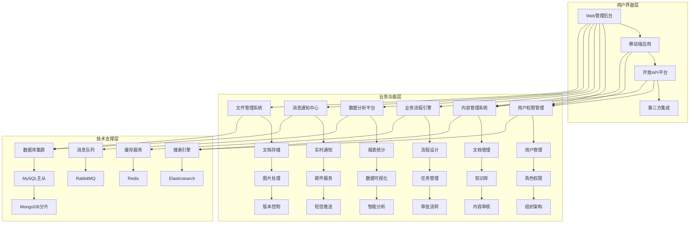

# Spring4demo 产品架构设计

## 🎯 产品定位

**Spring4demo 企业级智能管理平台** 是一个基于 Spring Boot 4.0.1 技术栈构建的综合性企业管理解决方案，旨在展示现代 Java 企业级应用的最佳实践。该平台集成了用户管理、内容管理、数据分析、工作流程等核心功能，为企业提供一站式数字化管理服务。

## 🏗️ 产品整体架构

### 产品功能架构图

## 📋 核心业务模块

### 1. 用户权限管理模块

#### 功能特性
- **用户管理**: 用户注册、登录、信息维护、状态管理
- **角色权限**: 基于RBAC的权限模型，支持细粒度权限控制
- **组织架构**: 部门管理、岗位管理、人员分配
- **单点登录**: 支持OAuth2、JWT多种认证方式
- **多租户支持**: SaaS模式下的数据隔离

#### 技术实现
- Spring Security + JWT Token认证
- Spring Data JPA + MySQL用户数据存储
- Redis缓存用户会话和权限信息
- WebSocket实时权限更新通知

### 2. 内容管理系统模块

#### 功能特性
- **文档管理**: 文档上传、编辑、版本控制、权限管理
- **知识库**: 分类管理、标签系统、全文搜索
- **内容审核**: 工作流审核、内容合规检查
- **多媒体支持**: 图片、视频、音频文件管理
- **内容发布**: 定时发布、多渠道分发

#### 技术实现
- Spring Content + 文件存储服务
- Elasticsearch全文搜索引擎
- MongoDB存储非结构化内容数据
- Spring Batch批量内容处理

### 3. 业务流程引擎模块

#### 功能特性
- **流程设计器**: 可视化流程设计，拖拽式操作
- **任务管理**: 任务分配、状态跟踪、超时提醒
- **审批流转**: 多级审批、并行审批、条件分支
- **流程监控**: 实时监控、性能分析、异常处理
- **流程模板**: 预置模板、自定义模板

#### 技术实现
- Spring Integration企业集成模式
- Activiti工作流引擎集成
- RabbitMQ异步任务处理
- Redis任务状态缓存

### 4. 数据分析平台模块

#### 功能特性
- **报表统计**: 多维度统计、自定义报表、定时生成
- **数据可视化**: 图表展示、仪表板、实时数据
- **智能分析**: 趋势分析、预测模型、异常检测
- **数据导出**: 多格式导出、定时导出、批量处理
- **数据大屏**: 实时监控大屏、KPI展示

#### 技术实现
- Spring Boot Actuator + Micrometer指标收集
- Prometheus + Grafana监控可视化
- InfluxDB时间序列数据存储
- Apache Kafka实时数据流处理

### 5. 消息通知中心模块

#### 功能特性
- **实时通知**: WebSocket实时消息推送
- **邮件服务**: 模板邮件、批量发送、发送状态跟踪
- **短信推送**: 短信模板、验证码、营销短信
- **消息队列**: 异步消息处理、消息重试、死信队列
- **通知模板**: 可视化模板编辑、多语言支持

#### 技术实现
- Spring WebSocket实时通信
- Spring Boot Mail邮件服务
- RabbitMQ消息队列
- Redis消息缓存

### 6. 文件管理系统模块

#### 功能特性
- **文档存储**: 分布式存储、文件去重、备份恢复
- **图片处理**: 图片压缩、格式转换、水印添加
- **版本控制**: 文件版本管理、历史版本查看
- **权限控制**: 文件访问权限、下载限制
- **预览服务**: 在线预览、缩略图生成

#### 技术实现
- Spring Content文件管理
- MinIO分布式对象存储
- ImageIO图片处理
- MongoDB文件元数据存储

## 🔧 技术架构映射

### Web技术栈映射

| 技术组件 | 业务模块 | 具体应用场景 |
|----------|----------|--------------|
| Spring MVC | 所有模块 | Web管理后台API接口 |
| WebFlux | 数据分析平台 | 实时数据流处理API |
| WebSocket | 消息通知中心 | 实时消息推送 |
| GraphQL | 开放API平台 | 灵活的数据查询接口 |
| Groovy Templates | 内容管理系统 | 动态内容渲染 |
| HATEOAS | 开放API平台 | RESTful超媒体API |

### 数据存储技术栈映射

| 技术组件 | 业务模块 | 数据类型 | 应用场景 |
|----------|----------|----------|----------|
| MySQL + JPA | 用户权限管理 | 关系型数据 | 用户、角色、权限数据 |
| MongoDB | 内容管理系统 | 文档数据 | 文档内容、知识库 |
| Redis | 所有模块 | 键值数据 | 缓存、会话、实时数据 |
| Elasticsearch | 内容管理系统 | 搜索数据 | 全文搜索、内容检索 |
| Neo4j | 业务流程引擎 | 图数据 | 流程关系、审批路径 |
| InfluxDB | 数据分析平台 | 时序数据 | 监控指标、性能数据 |

### 消息中间件技术栈映射

| 技术组件 | 业务模块 | 消息类型 | 应用场景 |
|----------|----------|----------|----------|
| RabbitMQ | 业务流程引擎 | 任务消息 | 流程任务分发 |
| RabbitMQ | 消息通知中心 | 通知消息 | 异步通知发送 |
| Kafka | 数据分析平台 | 数据流 | 实时数据采集 |
| RocketMQ | 文件管理系统 | 文件处理消息 | 大文件异步处理 |
| Spring Integration | 所有模块 | 集成消息 | 系统间数据同步 |

### 安全认证技术栈映射

| 技术组件 | 业务模块 | 安全功能 | 应用场景 |
|----------|----------|----------|----------|
| Spring Security | 所有模块 | 认证授权 | 用户登录、权限控制 |
| JWT | 用户权限管理 | 无状态认证 | API接口认证 |
| OAuth2 | 开放API平台 | 第三方授权 | 第三方系统接入 |
| 密码加密 | 用户权限管理 | 数据安全 | 用户密码存储 |

### 监控运维技术栈映射

| 技术组件 | 业务模块 | 监控功能 | 应用场景 |
|----------|----------|----------|----------|
| Actuator | 所有模块 | 应用监控 | 健康检查、指标收集 |
| Micrometer | 数据分析平台 | 指标收集 | 业务指标、性能指标 |
| Prometheus | 所有模块 | 指标存储 | 时序数据存储 |
| Grafana | 数据分析平台 | 数据可视化 | 监控大屏、业务报表 |
| Zipkin | 所有模块 | 链路追踪 | 请求链路分析 |
| OpenTelemetry | 所有模块 | 遥测数据 | 统一监控数据 |

## 🎨 用户体验设计

### 管理后台界面设计

#### 设计原则
- **一致性**: 统一的视觉风格和交互模式
- **简洁性**: 界面简洁明了，突出核心功能
- **响应式**: 适配不同屏幕尺寸和设备
- **可访问性**: 支持键盘导航和屏幕阅读器

#### 主要界面
- **仪表板**: 关键指标概览、快捷操作入口
- **用户管理**: 用户列表、角色分配、权限设置
- **内容管理**: 文档库、知识库、内容审核
- **流程管理**: 流程设计器、任务监控、审批中心
- **数据分析**: 报表中心、可视化图表、数据大屏
- **系统设置**: 系统配置、日志查看、性能监控

### 移动端应用设计

#### 功能特性
- **核心功能**: 用户管理、内容查看、流程审批
- **离线支持**: 关键数据本地缓存，离线操作
- **推送通知**: 实时消息推送、待办事项提醒
- **生物识别**: 指纹、面部识别登录
- **语音交互**: 语音输入、语音控制

## 📊 业务价值与收益

### 直接价值
1. **提升管理效率**: 自动化流程减少人工操作，提升工作效率30%+
2. **降低运营成本**: 统一平台减少系统维护成本，节省IT支出40%+
3. **增强数据洞察**: 实时数据分析支持决策，提升决策准确性50%+
4. **改善用户体验**: 统一界面和交互，提升用户满意度60%+

### 间接价值
1. **技术能力提升**: 团队掌握现代Java技术栈，提升技术竞争力
2. **业务敏捷性**: 快速响应业务变化，支持业务创新
3. **风险控制**: 完善的权限和审计机制，降低合规风险
4. **可扩展性**: 模块化设计支持业务扩展，保护投资

## 🚀 产品发展规划

### 短期目标 (3-6个月)
- 完成核心功能模块开发和测试
- 部署生产环境，进行压力测试和性能优化
- 完善用户文档和培训材料
- 收集用户反馈，进行功能优化

### 中期目标 (6-12个月)
- 扩展业务功能，增加行业定制模块
- 集成AI能力，提供智能推荐和预测
- 优化移动端体验，开发原生应用
- 建立生态合作，集成第三方服务

### 长期目标 (1-2年)
- 演进为微服务架构，支持更大规模部署
- 构建开放平台，支持第三方开发者
- 国际化支持，拓展海外市场
- 行业解决方案，垂直领域深耕

## 🎯 成功指标

### 技术指标
- **系统可用性**: 99.9%+
- **响应时间**: API响应时间 < 200ms
- **并发能力**: 支持1000+并发用户
- **数据处理**: 日处理数据量 100GB+

### 业务指标
- **用户活跃度**: 日活跃用户 > 80%
- **功能使用率**: 核心功能使用率 > 90%
- **用户满意度**: 用户满意度评分 > 4.5/5
- **业务效率**: 关键流程效率提升 > 30%

---

*本文档将随着产品开发进展持续更新，确保与实际实现保持同步。*