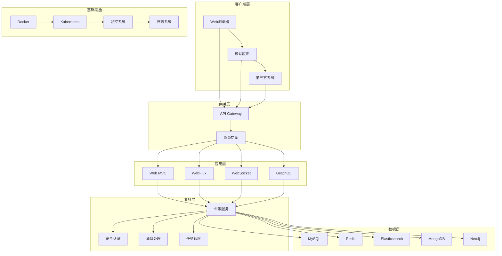

<div align="center">


# Spring Boot 4.0.1 生态环境集成最佳实践

[](https://spring.io/projects/spring-boot)

> 🚀 一个全面的 Spring Boot 4.0.1 生态环境集成项目，涵盖50+热门技术栈的最佳实践和常见问题解决方案

[快速开始](#快速开始) • [功能特性](#功能特性) • [技术架构](#技术架构) • [文档指南](#文档指南) • [贡献指南](#贡献指南)

</div>

## 📋 目录

- [🌟 项目简介](#-项目简介)
- [⚡ 快速开始](#-快速开始)
- [🎯 功能特性](#-功能特性)
- [🏗️ 技术架构](#️-技术架构)
- [📚 技术栈](#-技术栈)
- [🛠️ 开发指南](#️-开发指南)
- [📖 文档](#-文档)
- [🤝 贡献指南](#-贡献指南)
- [📄 开源协议](#-开源协议)

## 🌟 项目简介

Spring4demo 是一个基于 Spring Boot 4.0.1 和 Java 25 的企业级生态环境集成项目。本项目旨在为开发者提供一个全面、实用的 Spring Boot 生态系统参考实现，涵盖从基础 Web 开发到微服务架构、从传统关系型数据库到新兴 NoSQL 存储、从单体应用到云原生部署的完整技术栈。

### 🎯 项目目标

- ✅ **全面覆盖** - 涵盖 Spring Boot 生态80%+的热门技术栈
- ✅ **最佳实践** - 提供企业级应用开发的最佳实践和规范
- ✅ **问题解决** - 收集整理常见问题和解决方案
- ✅ **渐进学习** - 分阶段实施，适合不同层次的开发者
- ✅ **生产就绪** - 包含监控、安全、性能优化等生产级特性

## ⚡ 快速开始

### 📋 环境要求

- **Java**: JDK 25+
- **Maven**: 3.9.0+
- **Docker**: 20.0+ (可选，用于容器化部署)
- **IDE**: IntelliJ IDEA / Eclipse / VS Code

### 🚀 安装运行

```bash
# 1. 克隆项目
git clone https://github.com/your-username/spring4demo.git
cd spring4demo

# 2. 启动依赖服务 (MySQL, Redis, Elasticsearch, Neo4j)
docker-compose up -d

# 3. 编译运行
mvn clean compile
mvn spring-boot:run

# 4. 访问应用
# 应用地址: http://localhost:8080
# 健康检查: http://localhost:8080/actuator/health
# API文档: http://localhost:8080/swagger-ui.html
```

### 🐳 Docker 部署

```bash
# 构建镜像
docker build -t spring4demo:latest .

# 运行容器
docker run -p 8080:8080 spring4demo:latest

# 或使用 docker-compose
docker-compose up -d
```

## 🎯 功能特性

### 🌐 Web 开发
- 🔄 传统 MVC 和响应式 WebFlux 双模式支持
- 📡 WebSocket 实时通信
- 📊 GraphQL 查询接口
- 🎨 多种模板引擎支持 (Thymeleaf, FreeMarker, Groovy)
- 🔗 RESTful 超媒体 API (HATEOAS)

### 💾 数据存储
- 🗄️ 关系型数据库 (MySQL, PostgreSQL)
- 📄 NoSQL 文档数据库 (MongoDB)
- 🔑 键值存储 (Redis)
- 🔍 搜索引擎 (Elasticsearch)
- 🕸️ 图数据库 (Neo4j)
- ⏱️ 时间序列数据库 (InfluxDB)

### 🔐 安全认证
- 🛡️ Spring Security 安全框架
- 🔑 JWT Token 认证
- 🌐 OAuth2/OIDC 支持
- 🔒 API 安全最佳实践

### 📨 消息中间件
- 🐰 RabbitMQ 消息队列
- 🚀 Apache Kafka 流处理
- 📮 Apache RocketMQ
- 🔌 Spring Integration 企业集成模式

### 📊 监控运维
- 📈 Actuator 应用监控
- 📊 Micrometer 指标收集
- 🔍 链路追踪 (Zipkin)
- 📋 OpenTelemetry 遥测
- 🚨 自定义健康检查

### ☁️ 云原生
- 🐳 Docker 容器化
- ⚡ GraalVM 原生镜像
- ☸️ Kubernetes 部署
- 🌩️ 云平台集成 (AWS, Azure, GCP)

## 🏗️ 技术架构



## 📚 技术栈

### 🔧 核心技术

| 技术 | 版本 | 说明 |
|------|------|------|
| Spring Boot | 4.0.1 | 应用框架核心 |
| Spring Framework | 6.x | 依赖注入、AOP等核心功能 |
| Java | 25 | 编程语言 |
| Maven | 3.9.12 | 构建工具 |

### 🌐 Web技术栈

- [x] **spring-boot-starter-web** - Spring MVC Web应用（默认Tomcat）
- [x] **spring-boot-starter-webflux** - 响应式Web编程
- [x] **spring-boot-starter-websocket** - WebSocket支持
- [x] **spring-boot-starter-web-services** - Spring Web Services
- [x] **spring-boot-starter-groovy-templates** - Groovy模板引擎
- [x] **spring-boot-starter-hateoas** - RESTful超媒体支持
- [x] **spring-boot-starter-graphql** - GraphQL应用支持

### 💾 数据存储技术栈

#### 关系型数据库
- [x] **spring-boot-starter-data-jpa** - JPA数据访问（Hibernate）
- [x] **spring-boot-starter-data-jdbc** - Spring Data JDBC
- [x] **spring-boot-starter-jdbc** - JDBC（HikariCP连接池）
- [x] **spring-boot-starter-Mybatis** - Mybatis(Druid连接池)
- [x] **spring-boot-starter-Mybatis-Plus** - Mybatis-Plus访问层

#### NoSQL数据库
- [x] **spring-boot-starter-data-mongodb** - MongoDB文档数据库
- [x] **spring-boot-starter-data-mongodb-reactive** - MongoDB响应式支持
- [x] **spring-boot-starter-data-redis** - Redis键值存储
- [x] **spring-boot-starter-data-redis-reactive** - Redis响应式支持
- [x] **spring-boot-starter-data-elasticsearch** - Elasticsearch搜索引擎
- [x] **spring-boot-starter-data-neo4j** - Neo4j图数据库
- [x] **spring-boot-starter-data-r2dbc** - R2DBC响应式数据库访问
- [x] **spring-boot-starter-data-influxdb** - InfluxDB时间序列数据库

### 📨 消息中间件技术栈

- [x] **spring-boot-starter-amqp** - Spring AMQP和RabbitMQ
- [x] **spring-boot-starter-rocketmq** - Apache RocketMQ消息队列
- [x] **spring-boot-starter-kafka** - Apache Kafka消息队列
- [x] **spring-boot-starter-integration** - Spring Integration企业集成模式
- [x] **spring-boot-starter-rsocket** - RSocket客户端和服务端

### 🔐 安全认证技术栈

- [x] **spring-boot-starter-security** - Spring Security安全框架
- [x] **spring-boot-starter-oauth2-client** - OAuth2/OpenID Connect客户端
- [x] **spring-boot-starter-oauth2-resource-server** - OAuth2资源服务器

### 📊 监控运维技术栈

- [x] **spring-boot-starter-actuator** - 生产就绪监控和管理功能
- [x] **spring-boot-starter-metrics** - Micrometer指标收集
- [x] **OpenTelemetry** - 遥测数据导出
- [x] **Zipkin** - 链路追踪
- [x] **Prometheus** - 指标收集
- [x] **Grafana** - 监控面板

### 🛠️ 开发工具和测试

- [x] **Spring Boot DevTools** - 热重载开发工具
- [x] **Spring Boot Configuration Processor** - 配置元数据生成
- [x] **Lombok** - 减少样板代码
- [x] **MapStruct** - Bean映射框架
- [x] **Testcontainers** - 集成测试容器支持

## 🛠️ 开发指南

### 📁 项目结构

```
spring4demo/
├── 📂 src/
│   ├── 📂 main/
│   │   ├── 📂 java/com/kev1n/spring4demo/
│   │   │   ├── 📄 Spring4demoApplication.java    # 主应用程序入口
│   │   │   ├── 📂 config/                        # 配置类
│   │   │   ├── 📂 controller/                    # 控制器层
│   │   │   ├── 📂 service/                       # 业务逻辑层
│   │   │   ├── 📂 repository/                    # 数据访问层
│   │   │   ├── 📂 entity/                        # 实体类
│   │   │   └── 📂 util/                          # 工具类
│   │   └── 📂 resources/
│   │       ├── 📄 application.yaml               # 主配置文件
│   │       ├── 📂 db/migration/                  # 数据库迁移脚本
│   │       └── 📂 static/                        # 静态资源
│   └── 📂 test/
│       └── 📂 java/com/kev1n/spring4demo/
├── 📄 pom.xml                                    # Maven 配置文件
├── 📄 compose.yaml                               # Docker Compose 配置
├── 📄 Dockerfile                                 # Docker 镜像构建文件
└── 📄 README.md                                  # 项目说明文档
```

### 🔧 配置说明

#### 应用配置 (application.yaml)

```yaml
spring:
  application:
    name: spring4demo
  profiles:
    active: dev
  
server:
  port: 8080
  servlet:
    context-path: /

management:
  endpoints:
    web:
      exposure:
        include: health,info,metrics,prometheus
  endpoint:
    health:
      show-details: always

logging:
  level:
    com.kev1n.spring4demo: DEBUG
    org.springframework.web: INFO
```

#### 数据库配置

```yaml
spring:
  datasource:
    url: jdbc:mysql://localhost:3306/mydatabase
    username: myuser
    password: mypassword
    driver-class-name: com.mysql.cj.jdbc.Driver
    hikari:
      maximum-pool-size: 20
      minimum-idle: 5
  
  jpa:
    hibernate:
      ddl-auto: validate
    show-sql: false
    properties:
      hibernate:
        format_sql: true
  
  redis:
    host: localhost
    port: 6379
    timeout: 2000ms
    lettuce:
      pool:
        max-active: 8
        max-idle: 8
        min-idle: 0
```

### 🧪 测试指南

```bash
# 运行所有测试
mvn test

# 运行特定测试类
mvn test -Dtest=Spring4demoApplicationTests

# 运行集成测试
mvn test -Pintegration-test

# 生成测试覆盖率报告
mvn jacoco:report
```

### 📦 构建部署

```bash
# 打包应用
mvn clean package

# 构建Docker镜像
docker build -t spring4demo:latest .

# 创建GraalVM原生镜像
./mvnw native:compile -Pnative

# 部署到Kubernetes
kubectl apply -f k8s/
```

## 📖 文档

| 文档 | 描述 |
|------|------|
| [📖 用户指南](docs/user-guide.md) | 详细的使用说明和API文档 |
| [🏗️ 架构设计](docs/architecture.md) | 系统架构和设计理念 |
| [🛠️ 开发指南](docs/development.md) | 开发环境搭建和规范 |
| [🚀 部署指南](docs/deployment.md) | 生产环境部署指南 |
| [🔧 配置参考](docs/configuration.md) | 完整的配置参数说明 |
| [❓ 常见问题](docs/faq.md) | 常见问题和解决方案 |
| [📊 性能优化](docs/performance.md) | 性能调优和最佳实践 |

## 🤝 贡献指南

我们欢迎所有形式的贡献！请阅读 [贡献指南](CONTRIBUTING.md) 了解如何参与项目开发。

### 🚀 快速贡献

1. **Fork** 项目到你的 GitHub 账户
2. **Clone** 你的 Fork 到本地
3. **创建** 功能分支 (`git checkout -b feature/AmazingFeature`)
4. **提交** 你的更改 (`git commit -m 'Add some AmazingFeature'`)
5. **推送** 到分支 (`git push origin feature/AmazingFeature`)
6. **创建** Pull Request

### 📋 贡献类型

- 🐛 **Bug修复** - 修复已知问题
- ✨ **新功能** - 添加新的功能特性
- 📚 **文档改进** - 完善项目文档
- 🎨 **代码优化** - 性能优化和代码重构
- 🧪 **测试增强** - 提高测试覆盖率

## 📄 开源协议

本项目采用 [MIT License](LICENSE) 开源协议。

---

<div align="center">

**⭐ 如果这个项目对你有帮助，请给我们一个 Star！**

[🔝 回到顶部](#spring-boot-401-生态环境集成最佳实践)

Made with ❤️ by [Spring Boot Community](https://spring.io/)

</div>
