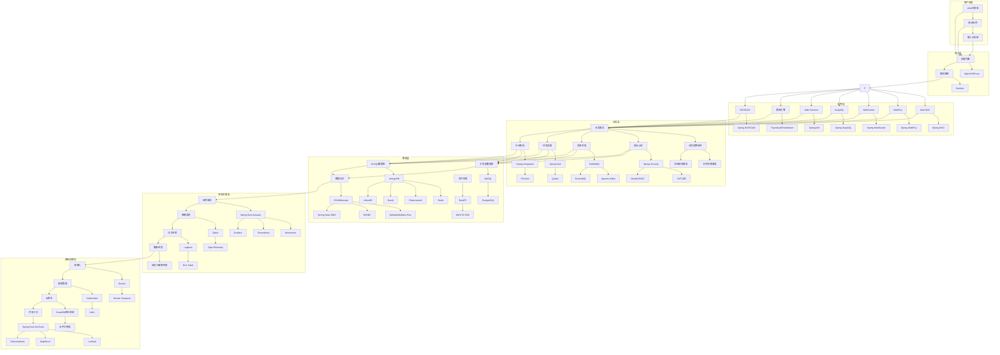
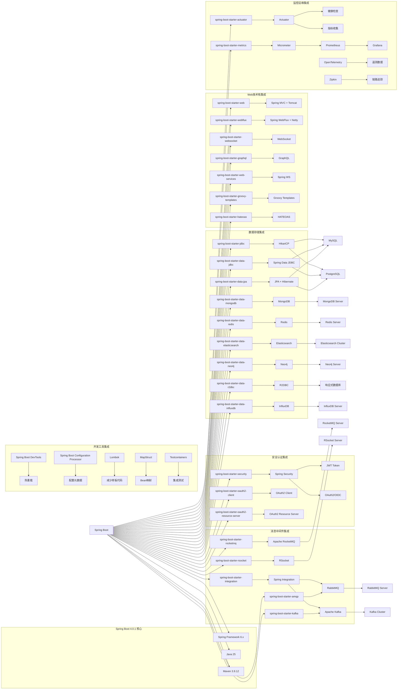
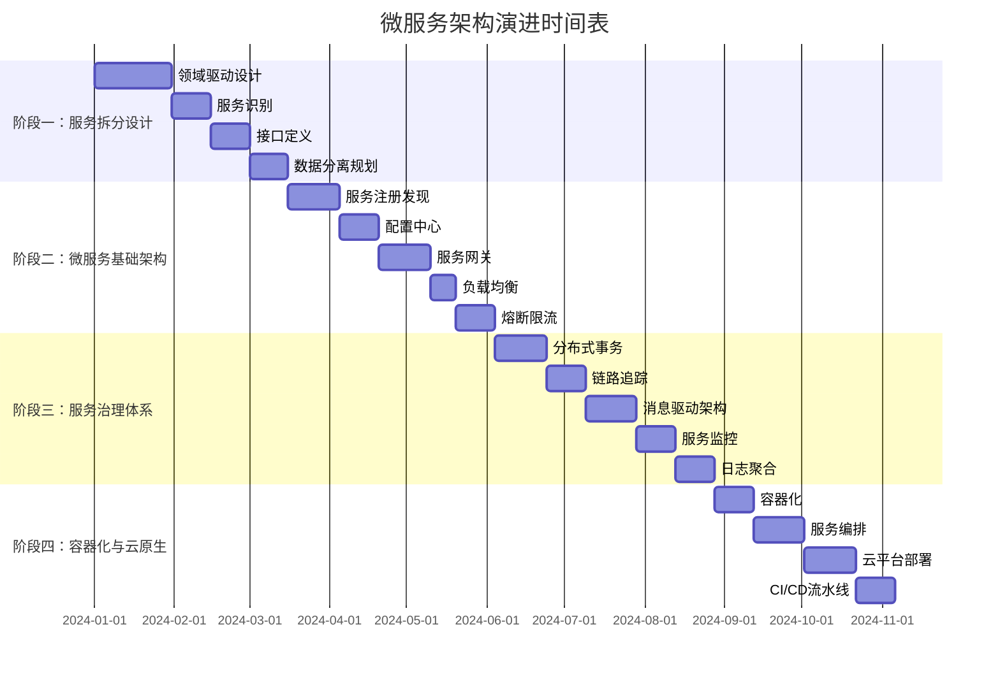

<div align="center">


# Spring Boot 4.0.1 生态环境集成最佳实践

[](https://spring.io/projects/spring-boot)

> 🚀 一个全面的 Spring Boot 4.0.1 生态环境集成项目，涵盖50+热门技术栈的最佳实践和常见问题解决方案

[快速开始](#快速开始) • [功能特性](#功能特性) • [技术架构](#技术架构) • [文档指南](#文档指南) • [贡献指南](#贡献指南)

</div>

## 📋 目录

- [🌟 项目简介](#-项目简介)
- [⚡ 快速开始](#-快速开始)
- [🎯 功能特性](#-功能特性)
- [🏗️ 技术架构](#️-技术架构)
- [📚 技术栈](#-技术栈)
- [🛠️ 开发指南](#️-开发指南)
- [📖 文档](#-文档)
- [🤝 贡献指南](#-贡献指南)
- [📄 开源协议](#-开源协议)

## 🌟 项目简介

Spring4demo 是一个基于 Spring Boot 4.0.1 和 Java 25 的企业级生态环境集成项目。本项目旨在为开发者提供一个全面、实用的 Spring Boot 生态系统参考实现，涵盖从基础 Web 开发到微服务架构、从传统关系型数据库到新兴 NoSQL 存储、从单体应用到云原生部署的完整技术栈。

### 🎯 项目目标

- ✅ **全面覆盖** - 涵盖 Spring Boot 生态80%+的热门技术栈
- ✅ **最佳实践** - 提供企业级应用开发的最佳实践和规范
- ✅ **问题解决** - 收集整理常见问题和解决方案
- ✅ **渐进学习** - 分阶段实施，适合不同层次的开发者
- ✅ **生产就绪** - 包含监控、安全、性能优化等生产级特性

## ⚡ 快速开始

### 📋 环境要求

- **Java**: JDK 25+
- **Maven**: 3.9.0+
- **Docker**: 20.0+ (可选，用于容器化部署)
- **IDE**: IntelliJ IDEA / Eclipse / VS Code

### 🚀 安装运行

```bash
# 1. 克隆项目
git clone https://github.com/your-username/spring4demo.git
cd spring4demo

# 2. 启动依赖服务 (MySQL, Redis, Elasticsearch, Neo4j, RustFS, KKFileView)
docker-compose up -d

# 启动 RustFS 文件存储服务
docker run -p 9000:9000 --name rustfs \
  -e RUSTFS_ACCESS_KEY=admin \
  -e RUSTFS_SECRET_KEY=admin123 \
  -v /data/rustfs:/data \
  -d rustfs/rustfs

# 启动 KKFileView 文档预览服务
docker run -d -p 8012:8012 --name kkfileview keking/kkfileview

# 3. 编译运行
mvn clean compile
mvn spring-boot:run

# 4. 访问应用
# 应用地址: http://localhost:8080
# 健康检查: http://localhost:8080/actuator/health
# API文档: http://localhost:8080/swagger-ui.html
# RustFS: http://localhost:9000
# KKFileView: http://localhost:8012
```

### 🐳 Docker 部署

```bash
# 构建镜像
docker build -t spring4demo:latest .

# 运行容器
docker run -p 8080:8080 spring4demo:latest

# 或使用 docker-compose
docker-compose up -d
```

## 🎯 功能特性

### 🌐 Web 开发
- 🔄 传统 MVC 和响应式 WebFlux 双模式支持
- 📡 WebSocket 实时通信
- 📊 GraphQL 查询接口
- 🎨 多种模板引擎支持 (Thymeleaf, FreeMarker, Groovy)
- 🔗 RESTful 超媒体 API (HATEOAS)

### 💾 数据存储
- 🗄️ 关系型数据库 (MySQL, PostgreSQL)
- 📄 NoSQL 文档数据库 (MongoDB)
- 🔑 键值存储 (Redis)
- 🔍 搜索引擎 (Elasticsearch)
- 🕸️ 图数据库 (Neo4j)
- ⏱️ 时间序列数据库 (InfluxDB)

### 🔐 安全认证
- 🛡️ Sa-Token 轻量级权限认证框架
- 🔑 JWT Token 认证
- 🌐 OAuth2/OIDC 支持
- 🔒 API 安全最佳实践

### 📨 消息中间件
- 🐰 RabbitMQ 消息队列
- 🚀 Apache Kafka 流处理
- 📮 Apache RocketMQ
- 🔌 Spring Integration 企业集成模式

### 💾 文件存储与预览
- 🗄️ RustFS 分布式对象存储（兼容 S3 协议）
- 📄 KKFileView 在线文件预览
- 📁 文件上传下载管理
- 🔍 多格式文档预览（Office、PDF、图片、视频等）

### 📊 监控运维
- 📈 Actuator 应用监控
- 📊 Micrometer 指标收集
- 🔍 链路追踪 (Zipkin)
- 📋 OpenTelemetry 遥测
- 🚨 自定义健康检查

### ☁️ 云原生
- 🐳 Docker 容器化
- ⚡ GraalVM 原生镜像
- ☸️ Kubernetes 部署
- 🌩️ 云平台集成 (AWS, Azure, GCP)

## 🏗️ 技术架构

Spring4demo 采用分层架构设计，从客户端到基础设施共分为七个层次，每层都有明确的职责和技术组件支撑。

### 架构层次说明

**🖥️ 客户端层**
- 支持多种客户端接入：Web浏览器、移动应用、第三方系统
- 提供统一的API访问入口

**🌐 接入层**
- **负载均衡**: Nginx/HAProxy 实现流量分发
- **限流熔断**: Sentinel 提供应用级别的流量控制和熔断保护
- **反向代理**: 通过 Nginx 实现静态资源服务和请求转发

**⚙️ 应用层**
- **Web MVC**: 基于 Spring MVC 的传统同步Web开发
- **WebFlux**: 基于 Spring WebFlux 的响应式Web开发
- **WebSocket**: 实时双向通信支持
- **GraphQL**: 灵活的查询接口
- **Web Services**: SOAP协议支持
- **模板引擎**: Thymeleaf/FreeMarker 服务端渲染
- **HATEOAS**: RESTful超媒体API

**🏢 业务层**
- **业务服务**: 核心业务逻辑处理
- **安全认证**: Sa-Token + JWT + OAuth2/OIDC
- **消息处理**: RabbitMQ + Kafka + RocketMQ
- **任务调度**: Spring Task + Quartz 定时任务
- **企业集成**: Spring Integration + RSocket 企业集成模式

**💾 数据层**
- **关系型数据库**: MySQL + PostgreSQL + MyBatis-Plus 数据访问
- **NoSQL数据库**: MongoDB + Redis + Elasticsearch + Neo4j + InfluxDB
- **数据访问**: MyBatis-Plus + Druid 连接池 + HikariCP

**📊 监控运维层**
- **应用监控**: Spring Boot Actuator + Micrometer + Prometheus + Grafana
- **链路追踪**: Zipkin + OpenTelemetry 遥测数据
- **日志系统**: Logback + ELK Stack
- **健康检查**: 自定义健康检查端点

**🏗️ 基础设施层**
- **容器化**: Docker + Docker Compose
- **编排管理**: Kubernetes + Helm
- **云原生**: GraalVM原生镜像 + 云平台集成
- **开发工具**: Spring Boot DevTools + Lombok + MapStruct + Testcontainers

### 整体系统架构



### 技术栈映射图



### 技术组件依赖关系图

```mermaid
graph TB
    subgraph "应用启动流程"
        APP[Spring4demoApplication] --> CONFIG[@SpringBootApplication]
        CONFIG --> AUTOCONFIG[@EnableAutoConfiguration]
        CONFIG --> COMPONENTSCAN[@ComponentScan]
        CONFIG --> BOOTSTRAP[Bootstrap Context]
    end
    
    subgraph "配置管理"
        CONFIG --> YAML[application.yaml]
        YAML --> PROFILES[Spring Profiles]
        PROFILES --> DEV[dev环境]
        PROFILES --> TEST[test环境]
        PROFILES --> PROD[prod环境]
        CONFIG --> CONFIGPROP[Configuration Properties]
        CONFIGPROP --> VALIDATOR[JSR-303 Validation]
    end
    
    subgraph "依赖注入容器"
        AUTOCONFIG --> CONTEXT[ApplicationContext]
        CONTEXT --> BEANFACTORY[BeanFactory]
        CONTEXT --> AOP[Aspect-Oriented Programming]
        CONTEXT --> TRANSACTION[Transaction Management]
    end
    
    subgraph "Web层架构"
        CONTEXT --> SERVLET[Servlet Container]
        SERVLET --> DISPATCHER[DispatcherServlet]
        DISPATCHER --> CONTROLLER[@Controller/@RestController]
        CONTROLLER --> SERVICE[@Service]
        SERVICE --> REPOSITORY[@Repository]
        REPOSITORY --> ENTITY[@Entity]
        
        CONTEXT --> REACTIVE[Reactive Container]
        REACTIVE --> DISPATCHERFLUX[DispatcherHandler]
        DISPATCHERFLUX --> CONTROLLERFLUX[@RestController]
        CONTROLLERFLUX --> SERVICEFLUX[@Service]
        SERVICEFLUX --> REPOSITORYFLUX[ReactiveRepository]
    end
    
    subgraph "数据访问层"
        REPOSITORY --> JPA_IMPL[JpaRepository]
        REPOSITORY --> MONGO_IMPL[MongoRepository]
        REPOSITORY --> REDIS_IMPL[RedisRepository]
        REPOSITORY --> ES_IMPL[ElasticsearchRepository]
        REPOSITORY --> NEO4J_IMPL[Neo4jRepository]
        
        JPA_IMPL --> HIBERNATE[Hibernate ORM]
        MONGO_IMPL --> MONGO_DRIVER[MongoDB Driver]
        REDIS_IMPL --> LETTUCE[Lettuce Client]
        ES_IMPL --> REST_CLIENT[REST High Level Client]
        NEO4J_IMPL --> NEO4J_DRIVER[Neo4j Java Driver]
    end
    
    subgraph "安全架构"
        CONTEXT --> SECURITY_CHAIN[Security Filter Chain]
        SECURITY_CHAIN --> AUTHENTICATION[Authentication Manager]
        SECURITY_CHAIN --> AUTHORIZATION[Authorization Manager]
        AUTHENTICATION --> JWT_PROVIDER[JWT Provider]
        AUTHENTICATION --> OAUTH2_PROVIDER[OAuth2 Provider]
        AUTHORIZATION --> ROLE_BASED[Role-based Access]
        AUTHORIZATION --> METHOD_SECURITY[Method Security]
    end
    
    subgraph "监控集成"
        CONTEXT --> ACTUATOR_ENDPOINTS[Actuator Endpoints]
        ACTUATOR_ENDPOINTS --> HEALTH_ENDPOINT[Health Endpoint]
        ACTUATOR_ENDPOINTS --> METRICS_ENDPOINT[Metrics Endpoint]
        ACTUATOR_ENDPOINTS --> INFO_ENDPOINT[Info Endpoint]
        METRICS_ENDPOINT --> MICROMETER_REGISTRY[Micrometer Registry]
        MICROMETER_REGISTRY --> PROMETHEUS_REGISTRY[Prometheus Registry]
        CONTEXT --> OPENTELEMETRY[OpenTelemetry]
        OPENTELEMETRY --> TRACER[Tracer Provider]
        TRACER --> ZIPKIN_REPORTER[Zipkin Reporter]
    end
```

## 📚 技术栈

### 🔧 核心技术

| 技术 | 版本 | 说明 |
|------|------|------|
| Spring Boot | 4.0.1 | 应用框架核心 |
| Spring Framework | 6.x | 依赖注入、AOP等核心功能 |
| Java | 25 | 编程语言 |
| Maven | 3.9.12 | 构建工具 |

### 🌐 Web技术栈

- [x] **spring-boot-starter-web** - Spring MVC Web应用（默认Tomcat）
- [x] **spring-boot-starter-webflux** - 响应式Web编程
- [x] **spring-boot-starter-websocket** - WebSocket支持
- [x] **spring-boot-starter-web-services** - Spring Web Services
- [x] **spring-boot-starter-groovy-templates** - Groovy模板引擎
- [x] **spring-boot-starter-hateoas** - RESTful超媒体支持
- [x] **spring-boot-starter-graphql** - GraphQL应用支持

### 💾 数据存储技术栈

#### 关系型数据库
- [x] **MyBatis-Plus** - MyBatis 增强工具，简化 CRUD 操作
- [x] **MyBatis-Plus-Boot-Starter** - MyBatis-Plus Spring Boot 集成
- [x] **Druid** - 高性能数据库连接池
- [x] **HikariCP** - Spring Boot 默认连接池

#### NoSQL数据库
- [x] **MongoDB** - MongoDB文档数据库
- [x] **Redis** - Redis键值存储（Sa-Token 持久化支持）
- [x] **Elasticsearch** - Elasticsearch搜索引擎
- [x] **Neo4j** - Neo4j图数据库
- [x] **InfluxDB** - InfluxDB时间序列数据库

#### 文件存储与预览
- [x] **RustFS** - 高性能分布式对象存储（兼容 S3 协议）
- [x] **AWS S3 SDK** - 2.29.29
- [x] **KKFileView** - 在线文件预览服务

### 📨 消息中间件技术栈

- [x] **spring-boot-starter-amqp** - Spring AMQP和RabbitMQ
- [x] **spring-boot-starter-rocketmq** - Apache RocketMQ消息队列
- [x] **spring-boot-starter-kafka** - Apache Kafka消息队列
- [x] **spring-boot-starter-integration** - Spring Integration企业集成模式
- [x] **spring-boot-starter-rsocket** - RSocket客户端和服务端

### 🔐 安全认证技术栈

- [x] **Sa-Token** - 轻量级 Java 权限认证框架
- [x] **Sa-Token-OAuth2** - OAuth2/OpenID Connect 支持
- [x] **Sa-Token-Redis** - Redis 持久化支持

### 📊 监控运维技术栈

- [x] **spring-boot-starter-actuator** - 生产就绪监控和管理功能
- [x] **spring-boot-starter-metrics** - Micrometer指标收集
- [x] **OpenTelemetry** - 遥测数据导出
- [x] **Zipkin** - 链路追踪
- [x] **Prometheus** - 指标收集
- [x] **Grafana** - 监控面板

### 🛠️ 开发工具和测试

- [x] **Spring Boot DevTools** - 热重载开发工具
- [x] **Spring Boot Configuration Processor** - 配置元数据生成
- [x] **Lombok** - 减少样板代码
- [x] **MapStruct** - Bean映射框架
- [x] **Testcontainers** - 集成测试容器支持

## 🛠️ 开发指南

### 📁 项目结构

```
spring4demo/
├── 📂 src/
│   ├── 📂 main/
│   │   ├── 📂 java/com/kev1n/spring4demo/
│   │   │   ├── 📄 Spring4demoApplication.java    # 主应用程序入口
│   │   │   ├── 📂 config/                        # 配置类
│   │   │   ├── 📂 controller/                    # 控制器层
│   │   │   ├── 📂 service/                       # 业务逻辑层
│   │   │   │   ├── 📂 FileStorageService.java   # 文件存储服务
│   │   │   │   └── 📂 DocumentPreviewService.java # 文档预览服务
│   │   │   ├── 📂 repository/                    # 数据访问层
│   │   │   ├── 📂 entity/                        # 实体类
│   │   │   └── 📂 util/                          # 工具类
│   │   └── 📂 resources/
│   │       ├── 📄 application.yaml               # 主配置文件
│   │       ├── 📂 db/migration/                  # 数据库迁移脚本
│   │       └── 📂 static/                        # 静态资源
│   └── 📂 test/
│       └── 📂 java/com/kev1n/spring4demo/
├── 📄 pom.xml                                    # Maven 配置文件
├── 📄 compose.yaml                               # Docker Compose 配置
├── 📄 Dockerfile                                 # Docker 镜像构建文件
└── 📄 README.md                                  # 项目说明文档
```

### 🔧 配置说明

#### 应用配置 (application.yaml)

```yaml
spring:
  application:
    name: spring4demo
  profiles:
    active: dev
  
server:
  port: 8080
  servlet:
    context-path: /

management:
  endpoints:
    web:
      exposure:
        include: health,info,metrics,prometheus
  endpoint:
    health:
      show-details: always

logging:
  level:
    com.kev1n.spring4demo: DEBUG
    org.springframework.web: INFO
```

#### 数据库配置

```yaml
spring:
  datasource:
    url: jdbc:mysql://localhost:3306/mydatabase
    username: myuser
    password: mypassword
    driver-class-name: com.mysql.cj.jdbc.Driver
    type: com.alibaba.druid.pool.DruidDataSource
    druid:
      initial-size: 5
      min-idle: 5
      max-active: 20
      max-wait: 60000
      time-between-eviction-runs-millis: 60000
      min-evictable-idle-time-millis: 300000
      validation-query: SELECT 1
      test-while-idle: true
      test-on-borrow: false
      test-on-return: false
  
  redis:
    host: localhost
    port: 6379
    timeout: 2000ms
    lettuce:
      pool:
        max-active: 8
        max-idle: 8
        min-idle: 0

# MyBatis-Plus 配置
mybatis-plus:
  configuration:
    map-underscore-to-camel-case: true
    cache-enabled: false
    call-setters-on-nulls: true
    jdbc-type-for-null: 'null'
  global-config:
    db-config:
      id-type: auto
      logic-delete-field: deleted
      logic-delete-value: 1
      logic-not-delete-value: 0
  mapper-locations: classpath*:/mapper/**/*.xml

# Sa-Token 配置
sa-token:
  token-name: Authorization
  timeout: 2592000
  active-timeout: -1
  is-concurrent: true
  is-share: false
  token-style: uuid
  is-log: false
  is-print: false
  jwt-secret-key: abcdefghijklmnopqrstuvwxyz

# RustFS 文件存储配置
rustfs:
  # RustFS 服务端点地址
  endpoint: http://localhost:9000
  # 访问密钥
  access-key: admin
  # 秘密密钥
  secret-key: admin123
  # 存储桶名称
  bucket-name: spring4demo
  # 区域
  region: us-east-1
  # 是否启用路径风格访问
  path-style-access: true
  # 最大文件大小（MB）
  max-file-size: 10
  # 最大请求大小（MB）
  max-request-size: 100

# KKFileView 文档预览配置
kkfileview:
  # KKFileView 服务地址
  server-url: http://localhost:8012
  # 预览接口路径
  preview-path: /onlinePreview
  # 是否使用缓存
  use-cache: false
  # 缓存过期时间（秒）
  cache-expire-time: 3600
  # 当前服务地址（用于生成文件 URL）
  current-server-url: http://localhost:8080
  # 是否强制更新缓存
  force-update-cache: true
```

### 🧪 测试指南

```bash
# 运行所有测试
mvn test

# 运行特定测试类
mvn test -Dtest=Spring4demoApplicationTests

# 运行集成测试
mvn test -Pintegration-test

# 生成测试覆盖率报告
mvn jacoco:report
```

### 📦 构建部署

```bash
# 打包应用
mvn clean package

# 构建Docker镜像
docker build -t spring4demo:latest .

# 创建GraalVM原生镜像
./mvnw native:compile -Pnative

# 部署到Kubernetes
kubectl apply -f k8s/
```

## 📖 文档

| 文档 | 描述 |
|------|------|
| [📖 用户指南](docs/user-guide.md) | 详细的使用说明和API文档 |
| [🏗️ 架构设计](docs/architecture.md) | 系统架构和设计理念 |
| [🛠️ 开发指南](docs/development.md) | 开发环境搭建和规范 |
| [🚀 部署指南](docs/deployment.md) | 生产环境部署指南 |
| [🔧 配置参考](docs/configuration.md) | 完整的配置参数说明 |
| [❓ 常见问题](docs/faq.md) | 常见问题和解决方案 |
| [📊 性能优化](docs/performance.md) | 性能调优和最佳实践 |
| [💾 文件存储指南](docs/file-storage.md) | RustFS 文件存储使用指南 |
| [📄 文档预览指南](docs/document-preview.md) | KKFileView 文档预览使用指南 |

## 🚀 微服务架构演进计划

### 📋 演进路线图

基于当前 Spring Boot 单应用项目，我们规划了完整的微服务架构演进路线：

#### 阶段一：服务拆分设计 (1-2个月)
- **领域驱动设计 (DDD)**: 基于业务边界进行服务拆分
- **服务识别**: 识别核心业务域和支撑域
- **接口定义**: 设计服务间的 API 契约
- **数据分离**: 规划数据库拆分策略

#### 阶段二：微服务基础架构 (2-3个月)
- **服务注册与发现**: Spring Cloud Alibaba Nacos
- **配置中心**: Spring Cloud Alibaba Nacos Config
- **服务网关**: Spring Cloud Gateway
- **负载均衡**: Spring Cloud LoadBalancer
- **熔断限流**: Sentinel + Seata

#### 阶段三：服务治理体系 (1-2个月)
- **分布式事务**: Seata AT/TCC 模式
- **分布式链路追踪**: Spring Cloud Sleuth + Zipkin
- **消息驱动架构**: Spring Cloud Stream + RocketMQ
- **服务监控**: Spring Boot Admin + Prometheus
- **日志聚合**: ELK Stack

#### 阶段四：容器化与云原生 (1-2个月)
- **容器化**: Docker 镜像标准化
- **服务编排**: Docker Compose → Kubernetes
- **服务网格**: Istio (可选)
- **云平台部署**: AWS/Azure/GCP 集成
- **CI/CD 流水线**: Jenkins/GitLab CI

### 🏗️ 微服务技术栈规划

#### 核心框架
```
Spring Cloud Alibaba 2022.x
├── Nacos (服务注册发现 + 配置中心)
├── Gateway (API 网关)
├── OpenFeign (声明式服务调用)
├── LoadBalancer (客户端负载均衡)
├── Sentinel (流量控制、熔断降级)
└── Seata (分布式事务解决方案)
```

#### 服务治理
```
Spring Cloud + 其他组件
├── Spring Cloud Sleuth (链路追踪)
├── Zipkin (链路追踪收集)
├── Spring Cloud Config (配置管理，备选)
├── Spring Cloud Bus (消息总线，备选)
├── Spring Boot Admin (服务监控)
└── Micrometer + Prometheus (指标监控)
```

#### 消息与数据
```
分布式数据管理
├── Spring Cloud Stream (消息驱动)
├── RocketMQ (消息队列)
├── Redis (分布式缓存)
├── Sharding-JDBC (分库分表)
└── MongoDB (文档数据库，特定场景)
```

#### 容器化部署
```
云原生技术栈
├── Docker (容器化)
├── Kubernetes (容器编排)
├── Helm (K8s 包管理)
├── Istio (服务网格，可选)
├── Jenkins X (CI/CD)
└── ArgoCD (GitOps 部署)
```

### 📦 服务拆分策略

#### 核心业务服务
1. **用户服务 (User Service)**
   - 用户注册、登录、信息管理
   - 权限认证、角色管理
   - JWT Token 生成与验证

2. **产品服务 (Product Service)**
   - 产品信息管理
   - 产品分类、搜索
   - 库存管理

3. **订单服务 (Order Service)**
   - 订单创建、支付
   - 订单状态管理
   - 订单历史查询

4. **支付服务 (Payment Service)**
   - 支付接口集成
   - 支付状态回调
   - 账务管理

#### 支撑服务
1. **通知服务 (Notification Service)**
   - 邮件通知
   - 短信通知
   - 站内消息

2. **文件服务 (File Service)**
   - 文件上传下载
   - 图片处理
   - 文件存储管理

3. **日志服务 (Log Service)**
   - 日志收集
   - 日志分析
   - 审计日志

### 🎯 演进收益

#### 技术收益
- **独立部署**: 服务可独立发布，提升交付效率
- **技术异构**: 不同服务可采用最适合的技术栈
- **弹性伸缩**: 根据负载独立扩展服务
- **故障隔离**: 单个服务故障不影响整体系统

#### 业务收益
- **快速响应**: 业务变更可快速实现和部署
- **团队自治**: 小团队负责特定服务，提升开发效率
- **风险控制**: 降低单点故障风险
- **成本优化**: 按需使用资源，降低运营成本

### 📅 实施时间表



---

## 🤝 贡献指南

我们欢迎所有形式的贡献！请阅读 [贡献指南](CONTRIBUTING.md) 了解如何参与项目开发。

### 🚀 快速贡献

1. **Fork** 项目到你的 GitHub 账户
2. **Clone** 你的 Fork 到本地
3. **创建** 功能分支 (`git checkout -b feature/AmazingFeature`)
4. **提交** 你的更改 (`git commit -m 'Add some AmazingFeature'`)
5. **推送** 到分支 (`git push origin feature/AmazingFeature`)
6. **创建** Pull Request

### 📋 贡献类型

- 🐛 **Bug修复** - 修复已知问题
- ✨ **新功能** - 添加新的功能特性
- 📚 **文档改进** - 完善项目文档
- 🎨 **代码优化** - 性能优化和代码重构
- 🧪 **测试增强** - 提高测试覆盖率

## 📄 开源协议

本项目采用 [MIT License](LICENSE) 开源协议。

---

<div align="center">

**⭐ 如果这个项目对你有帮助，请给我们一个 Star！**

[🔝 回到顶部](#spring-boot-401-生态环境集成最佳实践)

Made with ❤️ by [Spring Boot Community](https://spring.io/)

</div>
