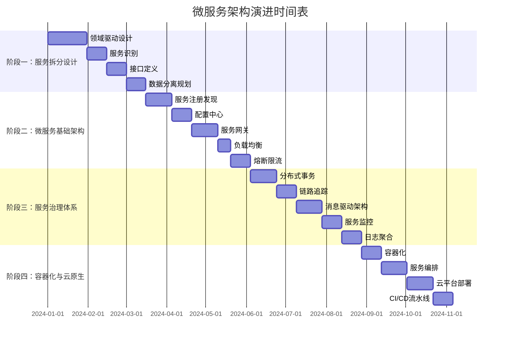

<div align="center">


# Spring Boot 4.0.1 生态环境集成最佳实践

[](https://spring.io/projects/spring-boot)

> 🚀 一个全面的 Spring Boot 4.0.1 生态环境集成项目，涵盖50+热门技术栈的最佳实践和常见问题解决方案

[快速开始](#快速开始) • [功能特性](#功能特性) • [技术架构](#技术架构) • [文档指南](#文档指南) • [贡献指南](#贡献指南)

</div>

## 📋 目录
# 功能开发插件

- [🌟 项目简介](#-项目简介)
- [⚡ 快速开始](#-快速开始)
- [🎯 功能特性](#-功能特性)
- [🏗️ 技术架构](#️-技术架构)
- [📚 技术栈](#-技术栈)
- [🛠️ 开发指南](#️-开发指南)
- [📖 文档](#-文档)
- [🤝 贡献指南](#-贡献指南)
- [📄 开源协议](#-开源协议)
  一个全面的、结构化的工作流，用于功能开发，包含专门用于代码库探索、架构设计和质量审查的代理。

## 🌟 项目简介
## 概述

Spring4demo 是一个基于 Spring Boot 4.0.1 和 Java 25 的企业级生态环境集成项目。本项目旨在为开发者提供一个全面、实用的 Spring Boot 生态系统参考实现，涵盖从基础 Web 开发到微服务架构、从传统关系型数据库到新兴 NoSQL 存储、从单体应用到云原生部署的完整技术栈。
功能开发插件提供了系统化的 7 阶段方法来构建新功能。它不是直接跳入代码，而是引导您理解代码库、提出澄清问题、设计架构并确保质量——从而产生设计更好、与现有代码无缝集成的功能。

### 🎯 项目目标
## 理念

- ✅ **全面覆盖** - 涵盖 Spring Boot 生态80%+的热门技术栈
- ✅ **最佳实践** - 提供企业级应用开发的最佳实践和规范
- ✅ **问题解决** - 收集整理常见问题和解决方案
- ✅ **渐进学习** - 分阶段实施，适合不同层次的开发者
- ✅ **生产就绪** - 包含监控、安全、性能优化等生产级特性
  构建功能不仅仅是编写代码。您需要：
- **在进行更改前理解代码库**
- **提出问题**以澄清模糊的需求
- **在实现前深思熟虑地设计**
- **构建后进行质量审查**

## ⚡ 快速开始
此插件将这些实践嵌入到结构化的工作流中，当您使用 `/feature-dev` 命令时会自动运行。

### 📋 环境要求
## 命令: `/feature-dev`

- **Java**: JDK 25+
- **Maven**: 3.9.0+
- **Docker**: 20.0+ (可选，用于容器化部署)
- **IDE**: IntelliJ IDEA / Eclipse / VS Code
  启动引导式功能开发工作流，包含 7 个不同的阶段。

### 🚀 安装运行

**用法：**
```bash
# 1. 克隆项目
git clone https://github.com/your-username/spring4demo.git
cd spring4demo

# 2. 启动依赖服务 (MySQL, Redis, Elasticsearch, Neo4j, RustFS, KKFileView)
docker-compose up -d

# 启动 RustFS 文件存储服务
docker run -p 9000:9000 --name rustfs \
  -e RUSTFS_ACCESS_KEY=admin \
  -e RUSTFS_SECRET_KEY=admin123 \
  -v /data/rustfs:/data \
  -d rustfs/rustfs

# 启动 KKFileView 文档预览服务
docker run -d -p 8012:8012 --name kkfileview keking/kkfileview

# 3. 编译运行
mvn clean compile
mvn spring-boot:run

# 4. 访问应用
# 应用地址: http://localhost:8080
# 健康检查: http://localhost:8080/actuator/health
# API文档: http://localhost:8080/swagger-ui.html
# RustFS: http://localhost:9000
# KKFileView: http://localhost:8012
/feature-dev Add user authentication with OAuth
```

### 🐳 Docker 部署

或简单地：
```bash
# 构建镜像
docker build -t spring4demo:latest .

# 运行容器
docker run -p 8080:8080 spring4demo:latest

# 或使用 docker-compose
docker-compose up -d
/feature-dev
```

## 🎯 功能特性
该命令将引导您完成整个交互式过程。

### 🌐 Web 开发
- 🔄 传统 MVC 和响应式 WebFlux 双模式支持
- 📡 WebSocket 实时通信
- 📊 GraphQL 查询接口
- 🎨 多种模板引擎支持 (Thymeleaf, FreeMarker, Groovy)
- 🔗 RESTful 超媒体 API (HATEOAS)
## 7 阶段工作流

### 💾 数据存储
- 🗄️ 关系型数据库 (MySQL, PostgreSQL)
- 📄 NoSQL 文档数据库 (MongoDB)
- 🔑 键值存储 (Redis)
- 🔍 搜索引擎 (Elasticsearch)
- 🕸️ 图数据库 (Neo4j)
- ⏱️ 时间序列数据库 (InfluxDB)
- 📁 文件存储 (RustFS)
### 阶段 1：发现

### 📅 任务调度
- ⏰ 简单定时任务 (Spring Task)
- 🔄 复杂调度任务 (Quartz)
- 📋 任务依赖管理
- 🎯 动态任务管理
  **目标**：理解需要构建什么

### 📄 文档预览
- 📖 在线文件预览 (KKFileView)
- 📊 Office 文档预览
- 🖼️ 图片预览
- 🎬 视频播放
  **发生什么：**
- 如果功能请求不清晰，则进行澄清
- 询问您要解决什么问题
- 识别约束和需求
- 总结理解并与您确认

### 🔐 安全认证
- 🛡️ Sa-Token 轻量级权限认证框架
- 🔑 JWT Token 认证
- 🌐 OAuth2/OIDC 支持
- 🔒 API 安全最佳实践

### 📨 消息中间件
- 🐰 RabbitMQ 消息队列
- 🚀 Apache Kafka 流处理
- 📮 Apache RocketMQ
- 🔌 Spring Integration 企业集成模式
  **示例：**
```
You: /feature-dev Add caching
Claude: 让我了解您的需求...
        - 应该缓存什么？（API 响应、计算值等）
        - 您的性能要求是什么？
        - 您有偏好的缓存解决方案吗？
```

### 💾 文件存储与预览
- 🗄️ RustFS 分布式对象存储（兼容 S3 协议）
- 📄 KKFileView 在线文件预览
- 📁 文件上传下载管理
- 🔍 多格式文档预览（Office、PDF、图片、视频等）
### 阶段 2：代码库探索

### 📊 监控运维
- 📈 Actuator 应用监控
- 📊 Micrometer 指标收集
- 🔍 链路追踪 (Zipkin)
- 📋 OpenTelemetry 遥测
- 🚨 自定义健康检查
  **目标**：理解相关的现有代码和模式

### ☁️ 云原生
- 🐳 Docker 容器化
- ⚡ GraalVM 原生镜像
- ☸️ Kubernetes 部署
- 🌩️ 云平台集成 (AWS, Azure, GCP)
  **发生什么：**
- 并行启动 2-3 个 `code-explorer` 代理
- 每个代理探索不同的方面（类似功能、架构、UI 模式）
- 代理返回包含要读取的关键文件的全面分析
- Claude 读取所有识别的文件以构建深入理解
- 呈现全面的调查结果摘要

## 🏗️ 技术架构
**启动的代理：**
- "查找类似于 [功能] 的功能并追踪实现"
- "映射 [区域] 的架构和抽象"
- "分析 [相关功能] 的当前实现"

Spring4demo 采用分层架构设计，从客户端到基础设施共分为七个层次，每层都有明确的职责和技术组件支撑。
**示例输出：**
```
发现类似功能：
- 用户认证 (src/auth/)：使用 JWT 令牌、中间件模式
- 会话管理 (src/session/)：Redis 支持，24 小时过期
- API 安全 (src/api/middleware/)：速率限制、CORS

### 架构层次说明
要理解的关键文件：
- src/auth/AuthService.ts:45 - 核心认证逻辑
- src/middleware/authMiddleware.ts:12 - 请求认证
- src/config/security.ts:8 - 安全配置
```

**🖥️ 客户端层**
- 支持多种客户端接入：Web浏览器、移动应用、第三方系统
- 提供统一的API访问入口
### 阶段 3：澄清问题

**🌐 接入层**
- **负载均衡**: Nginx/HAProxy 实现流量分发
- **限流熔断**: Sentinel 提供应用级别的流量控制和熔断保护
- **反向代理**: 通过 Nginx 实现静态资源服务和请求转发
  **目标**：填补空白并解决所有模糊之处

**⚙️ 应用层**
- **Web MVC**: 基于 Spring MVC 的传统同步Web开发
- **WebFlux**: 基于 Spring WebFlux 的响应式Web开发
- **WebSocket**: 实时双向通信支持
- **GraphQL**: 灵活的查询接口
- **Web Services**: SOAP协议支持
- **模板引擎**: Thymeleaf/FreeMarker 服务端渲染
- **HATEOAS**: RESTful超媒体API
  **发生什么：**
- 审查代码库调查结果和功能请求
- 识别未明确指定的方面：
  - 边缘情况
  - 错误处理
  - 集成点
  - 向后兼容性
  - 性能需求
- 以组织化的列表呈现所有问题
- **在继续之前等待您的回答**

**🏢 业务层**
- **业务服务**: 核心业务逻辑处理
- **安全认证**: Sa-Token + JWT + OAuth2/OIDC
- **消息处理**: RabbitMQ + Kafka + RocketMQ
- **任务调度**: Spring Task + Quartz 定时任务
- **企业集成**: Spring Integration + RSocket 企业集成模式
  **示例：**
```
在设计架构之前，我需要澄清：

**💾 数据层**
- **关系型数据库**: MySQL + PostgreSQL + MyBatis-Plus 数据访问
- **NoSQL数据库**: MongoDB + Redis + Elasticsearch + Neo4j + InfluxDB
- **数据访问**: MyBatis-Plus + Druid 连接池 + HikariCP
1. OAuth 提供商：哪些 OAuth 提供商？（Google、GitHub、自定义？）
2. 用户数据：存储 OAuth 令牌还是仅用户配置文件？
3. 现有认证：替换当前认证还是并行添加？
4. 会话：与现有会话管理集成？
5. 错误处理：如何处理 OAuth 失败？
```

**📊 监控运维层**
- **应用监控**: Spring Boot Actuator + Micrometer + Prometheus + Grafana
- **链路追踪**: Zipkin + OpenTelemetry 遥测数据
- **日志系统**: Logback + ELK Stack
- **健康检查**: 自定义健康检查端点
  **关键**：此阶段确保在设计开始前没有任何模糊之处。

**🏗️ 基础设施层**
- **容器化**: Docker + Docker Compose
- **编排管理**: Kubernetes + Helm
- **云原生**: GraalVM原生镜像 + 云平台集成
- **开发工具**: Spring Boot DevTools + Lombok + MapStruct + Testcontainers
### 阶段 4：架构设计

### 整体系统架构
**目标**：设计多种实现方法

```mermaid
graph TB
    subgraph "客户端层"
        A[Web浏览器] --> B[移动应用]
        B --> C[第三方系统]
    end
    
    subgraph "接入层"
        D[负载均衡] --> D1[Nginx/HAProxy]
        E[限流熔断] --> E1[Sentinel]
    end
    
    subgraph "应用层"
        G[Web MVC] --> G1[Spring MVC]
        H[WebFlux] --> H1[Spring WebFlux]
        I[WebSocket] --> I1[Spring WebSocket]
        J[GraphQL] --> J1[Spring GraphQL]
        K[Web Services] --> K1[Spring WS]
        L[模板引擎] --> L1[Thymeleaf/FreeMarker]
        M[HATEOAS] --> M1[Spring HATEOAS]
    end
    
    subgraph "业务层"
        N[业务服务] --> N1[业务逻辑组件]
        N1 --> N2[文件存储服务]
        N1 --> N3[文档预览服务]
        O[安全认证] --> O1[Spring Security]
        O1 --> O2[JWT认证]
        O1 --> O3[OAuth2/OIDC]
        P[消息处理] --> P1[RabbitMQ]
        P1 --> P2[Apache Kafka]
        P1 --> P3[RocketMQ]
        Q[任务调度] --> Q1[Spring Task]
        Q1 --> Q2[Quartz]
        R[企业集成] --> R1[Spring Integration]
        R1 --> R2[RSocket]
    end
    
    subgraph "数据层"
        S[关系型数据库] --> S1[MySQL]
        S1 --> S2[PostgreSQL]
        T[NoSQL数据库] --> T1[MongoDB]
        T1 --> T2[Redis]
        T1 --> T3[Elasticsearch]
        T1 --> T4[Neo4j]
        T1 --> T5[InfluxDB]
        T6[文件存储] --> T7[RustFS]
        T7 --> T8[AWS S3 SDK]
        U[数据访问] --> U1[JPA/Hibernate]
        U1 --> U2[MyBatis/MyBatis-Plus]
        U1 --> U3[R2DBC]
        U1 --> U4[Spring Data JDBC]
    end
    
    subgraph "监控运维层"
        V[应用监控] --> V1[Spring Boot Actuator]
        V1 --> V2[Micrometer]
        V1 --> V3[Prometheus]
        V1 --> V4[Grafana]
        W[链路追踪] --> W1[Zipkin]
        W1 --> W2[OpenTelemetry]
        X[日志系统] --> X1[Logback]
        X1 --> X2[ELK Stack]
        Y[健康检查] --> Y1[自定义健康检查]
    end
    
    subgraph "基础设施层"
        Z[容器化] --> Z1[Docker]
        Z1 --> Z2[Docker Compose]
        AA[编排管理] --> AA1[Kubernetes]
        AA1 --> AA2[Helm]
        BB[云原生] --> BB1[GraalVM原生镜像]
        BB1 --> BB2[云平台集成]
        CC[开发工具] --> CC1[Spring Boot DevTools]
        CC1 --> CC2[Lombok]
        CC1 --> CC3[MapStruct]
        CC1 --> CC4[Testcontainers]
    end
    
    A --> D
    B --> D
    C --> D
    D --> E
    E --> F
    F --> G
    F --> H
    F --> I
    F --> J
    F --> K
    F --> L
    F --> M
    G --> N
    H --> N
    I --> N
    J --> N
    K --> N
    L --> N
    M --> N
    N --> O
    N --> P
    N --> Q
    N --> R
    O --> S
    O --> T
    P --> S
    P --> T
    Q --> S
    Q --> T
    R --> S
    R --> T
    S --> U
    T --> U
    U --> V
    V --> W
    W --> X
    X --> Y
    Y --> Z
    Z --> AA
    AA --> BB
    BB --> CC
**发生什么：**
- 启动 2-3 个 `code-architect` 代理，关注点不同：
  - **最小更改**：最小更改，最大重用
  - **干净架构**：可维护性、优雅的抽象
  - **务实平衡**：速度 + 质量
- 审查所有方法
- 为此任务形成最适合的意见
- 呈现比较、权衡和建议
- **询问您更喜欢哪种方法**

**示例输出：**
```
我设计了 3 种方法：

方法 1：最小更改
- 用 OAuth 方法扩展现有的 AuthService
- 将新的 OAuth 路由添加到现有的认证路由器
- 需要的重构最少
  优点：快速，风险低
  缺点：OAuth 与现有认证耦合，更难测试

方法 2：干净架构
- 具有专用接口的新 OAuthService
- 独立的 OAuth 路由器和中间件
- 使用通用接口重构 AuthService
  优点：清晰分离，可测试，可维护
  缺点：更多文件，更多重构

方法 3：务实平衡
- 新的 OAuthProvider 抽象
- 集成到现有的 AuthService 中
- 最小重构，良好的边界
  优点：平衡复杂性和简洁性
  缺点：仍存在一些耦合

建议：方法 3 - 在不进行过多重构的情况下为您提供清晰的边界，并且非常适合您现有的架构。

您想使用哪种方法？
```

### 技术栈映射图
### 阶段 5：实现

```mermaid
graph LR
    subgraph "Spring Boot 4.0.1 核心"
        SB[Spring Boot] --> SF[Spring Framework 6.x]
        SB --> JAVA[Java 25]
        SB --> MAVEN[Maven 3.9.12]
    end
    
    subgraph "Web技术栈集成"
        SB --> WEB1[spring-boot-starter-web]
        WEB1 --> MVC[Spring MVC + Tomcat]
        SB --> WEB2[spring-boot-starter-webflux]
        WEB2 --> FLUX[Spring WebFlux + Netty]
        SB --> WEB3[spring-boot-starter-websocket]
        WEB3 --> WS[WebSocket]
        SB --> WEB4[spring-boot-starter-graphql]
        WEB4 --> GQL[GraphQL]
        SB --> WEB5[spring-boot-starter-web-services]
        WEB5 --> SOAP[Spring WS]
        SB --> WEB6[spring-boot-starter-groovy-templates]
        WEB6 --> GT[Groovy Templates]
        SB --> WEB7[spring-boot-starter-hateoas]
        WEB7 --> HAL[HATEOAS]
    end
    
    subgraph "数据存储集成"
        SB --> DATA1[spring-boot-starter-data-jpa]
        DATA1 --> JPA[JPA + Hibernate]
        SB --> DATA2[spring-boot-starter-data-jdbc]
        DATA2 --> JDBC[Spring Data JDBC]
        SB --> DATA3[spring-boot-starter-jdbc]
        DATA3 --> HIKARI[HikariCP]
        SB --> DATA4[spring-boot-starter-data-mongodb]
        DATA4 --> MONGO[MongoDB]
        SB --> DATA5[spring-boot-starter-data-redis]
        DATA5 --> REDIS[Redis]
        SB --> DATA6[spring-boot-starter-data-elasticsearch]
        DATA6 --> ES[Elasticsearch]
        SB --> DATA7[spring-boot-starter-data-neo4j]
        DATA7 --> NEO4J[Neo4j]
        SB --> DATA8[spring-boot-starter-data-r2dbc]
        DATA8 --> R2DBC[R2DBC]
        SB --> DATA9[spring-boot-starter-data-influxdb]
        DATA9 --> INFLUX[InfluxDB]
    end
    
    subgraph "消息中间件集成"
        SB --> MSG1[spring-boot-starter-amqp]
        MSG1 --> RABBIT[RabbitMQ]
        SB --> MSG2[spring-boot-starter-kafka]
        MSG2 --> KAFKA[Apache Kafka]
        SB --> MSG3[spring-boot-starter-rocketmq]
        MSG3 --> ROCKETMQ[Apache RocketMQ]
        SB --> MSG4[spring-boot-starter-integration]
        MSG4 --> INTEGRATION[Spring Integration]
        SB --> MSG5[spring-boot-starter-rsocket]
        MSG5 --> RSOCKET[RSocket]
    end
    
    subgraph "安全认证集成"
        SB --> SEC1[spring-boot-starter-security]
        SEC1 --> SECURITY[Spring Security]
        SB --> SEC2[spring-boot-starter-oauth2-client]
        SEC2 --> OAUTH2_CLIENT[OAuth2 Client]
        SB --> SEC3[spring-boot-starter-oauth2-resource-server]
        SEC3 --> OAUTH2_SERVER[OAuth2 Resource Server]
        SECURITY --> JWT[JWT Token]
        SECURITY --> OAUTH2[OAuth2/OIDC]
    end
    
    subgraph "监控运维集成"
        SB --> MON1[spring-boot-starter-actuator]
        MON1 --> ACTUATOR[Actuator]
        SB --> MON2[spring-boot-starter-metrics]
        MON2 --> MICROMETER[Micrometer]
        ACTUATOR --> HEALTH[健康检查]
        ACTUATOR --> METRICS[指标收集]
        MICROMETER --> PROMETHEUS[Prometheus]
        PROMETHEUS --> GRAFANA[Grafana]
        MON3[OpenTelemetry] --> TELEMETRY[遥测数据]
        MON4[Zipkin] --> TRACING[链路追踪]
    end
    
    subgraph "开发工具集成"
        DEV1[Spring Boot DevTools] --> HOTRELOAD[热重载]
        DEV2[Spring Boot Configuration Processor] --> CONFIGMETA[配置元数据]
        DEV3[Lombok] --> REDUCECODE[减少样板代码]
        DEV4[MapStruct] --> BEANMAPPING[Bean映射]
        DEV5[Testcontainers] --> INTEGRATIONTEST[集成测试]
    end
    
    %% 数据库连接关系
    JPA --> MYSQL[MySQL]
    JPA --> POSTGRESQL[PostgreSQL]
    JDBC --> MYSQL
    JDBC --> POSTGRESQL
    HIKARI --> MYSQL
    HIKARI --> POSTGRESQL
    MONGO --> MONGODB_SERVER[MongoDB Server]
    REDIS --> REDIS_SERVER[Redis Server]
    ES --> ELASTICSEARCH_SERVER[Elasticsearch Cluster]
    NEO4J --> NEO4J_SERVER[Neo4j Server]
    R2DBC --> R2DBC_DB[响应式数据库]
    INFLUX --> INFLUXDB_SERVER[InfluxDB Server]
    
    %% 消息队列连接关系
    RABBIT --> RABBIT_SERVER[RabbitMQ Server]
    KAFKA --> KAFKA_CLUSTER[Kafka Cluster]
    ROCKETMQ --> ROCKETMQ_SERVER[RocketMQ Server]
    INTEGRATION --> RABBIT
    INTEGRATION --> KAFKA
    RSOCKET --> RSOCKET_SERVER[RSocket Server]
**目标**：构建功能

**发生什么：**
- **在开始前等待明确批准**
- 读取在先前阶段识别的所有相关文件
- 遵循选择的架构进行实现
- 严格遵循代码库约定
- 编写干净、文档良好的代码
- 随着进度更新待办事项

**注意：**
- 实现仅在您批准后开始
- 遵循阶段 2 发现的模式
- 使用阶段 4 设计的架构
- 持续跟踪进度

### 阶段 6：质量审查

**目标**：确保代码简单、DRY、优雅且功能正确

**发生什么：**
- 启动 3 个 `code-reviewer` 代理，关注点不同：
  - **简单性/DRY/优雅性**：代码质量和可维护性
  - **错误/正确性**：功能正确性和逻辑错误
  - **约定/抽象**：项目标准和模式
- 整合调查结果
- 识别最高严重性问题
- **呈现调查结果并询问您想做什么**：
  - 立即修复
  - 稍后修复
  - 按原样继续
- 根据您的决定解决问题

**示例输出：**
```
代码审查结果：

### 技术组件依赖关系图
高优先级问题：
1. OAuth 回调缺少错误处理 (src/auth/oauth.ts:67)
2. 内存泄漏：OAuth 状态未清理 (src/auth/oauth.ts:89)

```mermaid
graph TB
    subgraph "应用启动流程"
        APP[Spring4demoApplication] --> CONFIG[@SpringBootApplication]
        CONFIG --> AUTOCONFIG[@EnableAutoConfiguration]
        CONFIG --> COMPONENTSCAN[@ComponentScan]
        CONFIG --> BOOTSTRAP[Bootstrap Context]
    end
    
    subgraph "配置管理"
        CONFIG --> YAML[application.yaml]
        YAML --> PROFILES[Spring Profiles]
        PROFILES --> DEV[dev环境]
        PROFILES --> TEST[test环境]
        PROFILES --> PROD[prod环境]
        CONFIG --> CONFIGPROP[Configuration Properties]
        CONFIGPROP --> VALIDATOR[JSR-303 Validation]
    end
    
    subgraph "依赖注入容器"
        AUTOCONFIG --> CONTEXT[ApplicationContext]
        CONTEXT --> BEANFACTORY[BeanFactory]
        CONTEXT --> AOP[Aspect-Oriented Programming]
        CONTEXT --> TRANSACTION[Transaction Management]
    end
    
    subgraph "Web层架构"
        CONTEXT --> SERVLET[Servlet Container]
        SERVLET --> DISPATCHER[DispatcherServlet]
        DISPATCHER --> CONTROLLER[@Controller/@RestController]
        CONTROLLER --> SERVICE[@Service]
        SERVICE --> REPOSITORY[@Repository]
        REPOSITORY --> ENTITY[@Entity]
        
        CONTEXT --> REACTIVE[Reactive Container]
        REACTIVE --> DISPATCHERFLUX[DispatcherHandler]
        DISPATCHERFLUX --> CONTROLLERFLUX[@RestController]
        CONTROLLERFLUX --> SERVICEFLUX[@Service]
        SERVICEFLUX --> REPOSITORYFLUX[ReactiveRepository]
    end
    
    subgraph "数据访问层"
        REPOSITORY --> JPA_IMPL[JpaRepository]
        REPOSITORY --> MONGO_IMPL[MongoRepository]
        REPOSITORY --> REDIS_IMPL[RedisRepository]
        REPOSITORY --> ES_IMPL[ElasticsearchRepository]
        REPOSITORY --> NEO4J_IMPL[Neo4jRepository]
        
        JPA_IMPL --> HIBERNATE[Hibernate ORM]
        MONGO_IMPL --> MONGO_DRIVER[MongoDB Driver]
        REDIS_IMPL --> LETTUCE[Lettuce Client]
        ES_IMPL --> REST_CLIENT[REST High Level Client]
        NEO4J_IMPL --> NEO4J_DRIVER[Neo4j Java Driver]
    end
    
    subgraph "安全架构"
        CONTEXT --> SECURITY_CHAIN[Security Filter Chain]
        SECURITY_CHAIN --> AUTHENTICATION[Authentication Manager]
        SECURITY_CHAIN --> AUTHORIZATION[Authorization Manager]
        AUTHENTICATION --> JWT_PROVIDER[JWT Provider]
        AUTHENTICATION --> OAUTH2_PROVIDER[OAuth2 Provider]
        AUTHORIZATION --> ROLE_BASED[Role-based Access]
        AUTHORIZATION --> METHOD_SECURITY[Method Security]
    end
    
    subgraph "监控集成"
        CONTEXT --> ACTUATOR_ENDPOINTS[Actuator Endpoints]
        ACTUATOR_ENDPOINTS --> HEALTH_ENDPOINT[Health Endpoint]
        ACTUATOR_ENDPOINTS --> METRICS_ENDPOINT[Metrics Endpoint]
        ACTUATOR_ENDPOINTS --> INFO_ENDPOINT[Info Endpoint]
        METRICS_ENDPOINT --> MICROMETER_REGISTRY[Micrometer Registry]
        MICROMETER_REGISTRY --> PROMETHEUS_REGISTRY[Prometheus Registry]
        CONTEXT --> OPENTELEMETRY[OpenTelemetry]
        OPENTELEMETRY --> TRACER[Tracer Provider]
        TRACER --> ZIPKIN_REPORTER[Zipkin Reporter]
    end
中等优先级：
1. 可以简化令牌刷新逻辑 (src/auth/oauth.ts:120)
2. 考虑提取 OAuth 配置验证

所有测试通过。代码遵循项目约定。

您想做什么？
```

### 阶段 7：总结

**目标**：记录完成的内容

**发生什么：**
- 标记所有待办事项完成
- 总结：
  - 构建了什么
  - 做出的关键决策
  - 修改的文件
  - 建议的后续步骤

**示例：**
```
功能完成：OAuth 认证

## 📚 技术栈
构建了什么：
- 支持 Google 和 GitHub 的 OAuth 提供商抽象
- 与现有认证集成的 OAuth 路由和中间件
- 令牌刷新和会话集成
- 所有 OAuth 流的错误处理

### 🔧 核心技术
关键决策：
- 使用具有 OAuthProvider 抽象的务实方法
- 与现有会话管理集成
- 添加 OAuth 状态以防止 CSRF

| 技术 | 版本 | 说明 |
|------|------|------|
| Spring Boot | 4.0.1 | 应用框架核心 |
| Spring Framework | 6.x | 依赖注入、AOP等核心功能 |
| Java | 25 | 编程语言 |
| Maven | 3.9.12 | 构建工具 |
修改的文件：
- src/auth/OAuthProvider.ts (新)
- src/auth/AuthService.ts
- src/routes/auth.ts
- src/middleware/authMiddleware.ts

### 🌐 Web技术栈
建议的后续步骤：
- 为 OAuth 流添加测试
- 添加更多 OAuth 提供商（Microsoft、Apple）
- 更新文档
```

- [x] **spring-boot-starter-web** - Spring MVC Web应用（默认Tomcat）
- [x] **spring-boot-starter-webflux** - 响应式Web编程
- [x] **spring-boot-starter-websocket** - WebSocket支持
- [x] **spring-boot-starter-web-services** - Spring Web Services
- [x] **spring-boot-starter-groovy-templates** - Groovy模板引擎
- [x] **spring-boot-starter-hateoas** - RESTful超媒体支持
- [x] **spring-boot-starter-graphql** - GraphQL应用支持
## 代理

### 💾 数据存储技术栈
### `code-explorer`

#### 关系型数据库
- [x] **MyBatis-Plus** - MyBatis 增强工具，简化 CRUD 操作
- [x] **MyBatis-Plus-Boot-Starter** - MyBatis-Plus Spring Boot 集成
- [x] **Druid** - 高性能数据库连接池
- [x] **HikariCP** - Spring Boot 默认连接池
  **目的**：通过追踪执行路径深入分析现有代码库功能

#### NoSQL数据库
- [x] **MongoDB** - MongoDB文档数据库
- [x] **Redis** - Redis键值存储（Sa-Token 持久化支持）
- [x] **Elasticsearch** - Elasticsearch搜索引擎
- [x] **Neo4j** - Neo4j图数据库
- [x] **InfluxDB** - InfluxDB时间序列数据库
  **关注领域：**
- 入口点和调用链
- 数据流和转换
- 架构层和模式
- 依赖关系和集成
- 实现细节

#### 文件存储与预览
- [x] **RustFS** - 高性能分布式对象存储（兼容 S3 协议）
- [x] **AWS S3 SDK** - 2.29.29
- [x] **KKFileView** - 在线文件预览服务
  **触发时机：**
- 在阶段 2 自动触发
- 可以在探索代码时手动调用

### 📅 任务调度技术栈
**输出：**
- 包含 file:line 引用的入口点
- 逐步执行流
- 关键组件和职责
- 架构见解
- 要读取的基本文件列表

- [x] **Spring Task** - Spring 原生任务调度（简单定时任务）
- [x] **Quartz** - 定时任务框架（复杂调度需求）
- [x] **Spring Batch** - 批量任务处理（可选）
### `code-architect`

### 📨 消息中间件技术栈
**目的**：设计功能架构和实现蓝图

- [x] **spring-boot-starter-amqp** - Spring AMQP和RabbitMQ
- [x] **spring-boot-starter-rocketmq** - Apache RocketMQ消息队列
- [x] **spring-boot-starter-kafka** - Apache Kafka消息队列
- [x] **spring-boot-starter-integration** - Spring Integration企业集成模式
- [x] **spring-boot-starter-rsocket** - RSocket客户端和服务端
  **关注领域：**
- 代码库模式分析
- 架构决策
- 组件设计
- 实现路线图
- 数据流和构建顺序

### 🔐 安全认证技术栈
**触发时机：**
- 在阶段 4 自动触发
- 可以在架构设计时手动调用

- [x] **Sa-Token** - 轻量级 Java 权限认证框架
- [x] **Sa-Token-OAuth2** - OAuth2/OpenID Connect 支持
- [x] **Sa-Token-Redis** - Redis 持久化支持
  **输出：**
- 发现的模式和约定
- 带有原理的架构决策
- 完整的组件设计
- 包含特定文件的实现映射
- 包含阶段的构建顺序

### 📊 监控运维技术栈
### `code-reviewer`

- [x] **spring-boot-starter-actuator** - 生产就绪监控和管理功能
- [x] **spring-boot-starter-metrics** - Micrometer指标收集
- [x] **OpenTelemetry** - 遥测数据导出
- [x] **Zipkin** - 链路追踪
- [x] **Prometheus** - 指标收集
- [x] **Grafana** - 监控面板
  **目的**：审查代码中的错误、质量问题和项目约定

### 🛠️ 开发工具和测试
**关注领域：**
- 项目指南合规性（CLAUDE.md）
- 错误检测
- 代码质量问题
- 基于置信度的过滤（仅报告置信度 ≥80 的问题）

- [x] **Spring Boot DevTools** - 热重载开发工具
- [x] **Spring Boot Configuration Processor** - 配置元数据生成
- [x] **Lombok** - 减少样板代码
- [x] **MapStruct** - Bean映射框架
- [x] **Testcontainers** - 集成测试容器支持
  **触发时机：**
- 在阶段 6 自动触发
- 可以在编写代码后手动调用

## 🛠️ 开发指南
**输出：**
- 关键问题（置信度 75-100）
- 重要问题（置信度 50-74）
- 包含 file:line 引用的具体修复
- 项目指南引用

### 📁 项目结构
## 使用模式

```
spring4demo/
├── 📂 src/
│   ├── 📂 main/
│   │   ├── 📂 java/com/kev1n/spring4demo/
│   │   │   ├── 📄 Spring4demoApplication.java    # 主应用程序入口
│   │   │   ├── 📂 config/                        # 配置类
│   │   │   ├── 📂 controller/                    # 控制器层
│   │   │   ├── 📂 service/                       # 业务逻辑层
│   │   │   │   ├── 📂 FileStorageService.java   # 文件存储服务
│   │   │   │   └── 📂 DocumentPreviewService.java # 文档预览服务
│   │   │   ├── 📂 repository/                    # 数据访问层
│   │   │   ├── 📂 entity/                        # 实体类
│   │   │   └── 📂 util/                          # 工具类
│   │   └── 📂 resources/
│   │       ├── 📄 application.yaml               # 主配置文件
│   │       ├── 📂 db/migration/                  # 数据库迁移脚本
│   │       └── 📂 static/                        # 静态资源
│   └── 📂 test/
│       └── 📂 java/com/kev1n/spring4demo/
├── 📄 pom.xml                                    # Maven 配置文件
├── 📄 compose.yaml                               # Docker Compose 配置
├── 📄 Dockerfile                                 # Docker 镜像构建文件
└── 📄 README.md                                  # 项目说明文档
```

### 🔧 配置说明

#### 应用配置 (application.yaml)

```yaml
spring:
  application:
    name: spring4demo
  profiles:
    active: dev
  
server:
  port: 8080
  servlet:
    context-path: /

management:
  endpoints:
    web:
      exposure:
        include: health,info,metrics,prometheus
  endpoint:
    health:
      show-details: always

logging:
  level:
    com.kev1n.spring4demo: DEBUG
    org.springframework.web: INFO
```

#### 数据库配置

```yaml
spring:
  datasource:
    url: jdbc:mysql://localhost:3306/mydatabase
    username: myuser
    password: mypassword
    driver-class-name: com.mysql.cj.jdbc.Driver
    type: com.alibaba.druid.pool.DruidDataSource
    druid:
      initial-size: 5
      min-idle: 5
      max-active: 20
      max-wait: 60000
      time-between-eviction-runs-millis: 60000
      min-evictable-idle-time-millis: 300000
      validation-query: SELECT 1
      test-while-idle: true
      test-on-borrow: false
      test-on-return: false
  
  redis:
    host: localhost
    port: 6379
    timeout: 2000ms
    lettuce:
      pool:
        max-active: 8
        max-idle: 8
        min-idle: 0

# MyBatis-Plus 配置
mybatis-plus:
  configuration:
    map-underscore-to-camel-case: true
    cache-enabled: false
    call-setters-on-nulls: true
    jdbc-type-for-null: 'null'
  global-config:
    db-config:
      id-type: auto
      logic-delete-field: deleted
      logic-delete-value: 1
      logic-not-delete-value: 0
  mapper-locations: classpath*:/mapper/**/*.xml

# Sa-Token 配置
sa-token:
  token-name: Authorization
  timeout: 2592000
  active-timeout: -1
  is-concurrent: true
  is-share: false
  token-style: uuid
  is-log: false
  is-print: false
  jwt-secret-key: abcdefghijklmnopqrstuvwxyz

# RustFS 文件存储配置
rustfs:
  # RustFS 服务端点地址
  endpoint: http://localhost:9000
  # 访问密钥
  access-key: admin
  # 秘密密钥
  secret-key: admin123
  # 存储桶名称
  bucket-name: spring4demo
  # 区域
  region: us-east-1
  # 是否启用路径风格访问
  path-style-access: true
  # 最大文件大小（MB）
  max-file-size: 10
  # 最大请求大小（MB）
  max-request-size: 100

# KKFileView 文档预览配置
kkfileview:
  # KKFileView 服务地址
  server-url: http://localhost:8012
  # 预览接口路径
  preview-path: /onlinePreview
  # 是否使用缓存
  use-cache: false
  # 缓存过期时间（秒）
  cache-expire-time: 3600
  # 当前服务地址（用于生成文件 URL）
  current-server-url: http://localhost:8080
  # 是否强制更新缓存
  force-update-cache: true

# Quartz 任务调度配置
quartz:
  # 是否启用Quartz调度器
  enabled: true
  # 调度器实例名称
  instance-name: QuartzScheduler
  # 调度器实例ID（AUTO表示自动生成）
  instance-id: AUTO
  # 任务存储配置
  job-store:
    # 任务存储类（RAMJobStore用于内存存储，JobStoreTX用于JDBC持久化）
    job-store-class: org.quartz.simpl.RAMJobStore
    # 数据库驱动代理类（使用JDBC持久化时需要配置）
    driver-delegate-class: org.quartz.impl.jdbcjobstore.StdJDBCDelegate
    # 数据库表前缀
    table-prefix: QRTZ_
    # 是否启用集群模式
    is-clustered: false
  # 线程池配置
  thread-pool:
    # 线程池实现类
    thread-pool-class: org.quartz.simpl.SimpleThreadPool
    # 线程数量
    thread-count: 5
    # 线程优先级
    thread-priority: 5
      # 执行器运行日志文件存储磁盘路径 [选填]
      logpath: /data/applogs/xxl-job/jobhandler
      # 执行器日志文件保存天数 [选填]
      logretentiondays: 30
```

### 🧪 测试指南

### 完整工作流（推荐用于新功能）：
```bash
# 运行所有测试
mvn test

# 运行特定测试类
mvn test -Dtest=Spring4demoApplicationTests

# 运行集成测试
mvn test -Pintegration-test

# 生成测试覆盖率报告
mvn jacoco:report
/feature-dev Add rate limiting to API endpoints
```

### 📦 构建部署

```bash
# 打包应用
mvn clean package

# 构建Docker镜像
docker build -t spring4demo:latest .

# 创建GraalVM原生镜像
./mvnw native:compile -Pnative

# 部署到Kubernetes
kubectl apply -f k8s/
```

## 📖 文档

| 文档 | 描述 |
|------|------|
| [📖 用户指南](docs/user-guide.md) | 详细的使用说明和API文档 |
| [🏗️ 架构设计](docs/architecture.md) | 系统架构和设计理念 |
| [🛠️ 开发指南](docs/development.md) | 开发环境搭建和规范 |
| [🚀 部署指南](docs/deployment.md) | 生产环境部署指南 |
| [🔧 配置参考](docs/configuration.md) | 完整的配置参数说明 |
| [❓ 常见问题](docs/faq.md) | 常见问题和解决方案 |
| [📊 性能优化](docs/performance.md) | 性能调优和最佳实践 |
| [💾 文件存储指南](docs/file-storage.md) | RustFS 文件存储使用指南 |
| [📄 文档预览指南](docs/document-preview.md) | KKFileView 文档预览使用指南 |

## 🚀 微服务架构演进计划

### 📋 演进路线图

基于当前 Spring Boot 单应用项目，我们规划了完整的微服务架构演进路线：

#### 阶段一：服务拆分设计 (1-2个月)
- **领域驱动设计 (DDD)**: 基于业务边界进行服务拆分
- **服务识别**: 识别核心业务域和支撑域
- **接口定义**: 设计服务间的 API 契约
- **数据分离**: 规划数据库拆分策略

#### 阶段二：微服务基础架构 (2-3个月)
- **服务注册与发现**: Spring Cloud Alibaba Nacos
- **配置中心**: Spring Cloud Alibaba Nacos Config
- **服务网关**: Spring Cloud Gateway
- **负载均衡**: Spring Cloud LoadBalancer
- **熔断限流**: Sentinel + Seata

#### 阶段三：服务治理体系 (1-2个月)
- **分布式事务**: Seata AT/TCC 模式
- **分布式链路追踪**: Spring Cloud Sleuth + Zipkin
- **消息驱动架构**: Spring Cloud Stream + RocketMQ
- **服务监控**: Spring Boot Admin + Prometheus
- **日志聚合**: ELK Stack

#### 阶段四：容器化与云原生 (1-2个月)
- **容器化**: Docker 镜像标准化
- **服务编排**: Docker Compose → Kubernetes
- **服务网格**: Istio (可选)
- **云平台部署**: AWS/Azure/GCP 集成
- **CI/CD 流水线**: Jenkins/GitLab CI

### 🏗️ 微服务技术栈规划
让工作流引导您完成所有 7 个阶段。

#### 核心框架
```
Spring Cloud Alibaba 2022.x
├── Nacos (服务注册发现 + 配置中心)
├── Gateway (API 网关)
├── OpenFeign (声明式服务调用)
├── LoadBalancer (客户端负载均衡)
├── Sentinel (流量控制、熔断降级)
└── Seata (分布式事务解决方案)
```
### 手动代理调用：

#### 服务治理
**探索功能：**
```
Spring Cloud + 其他组件
├── Spring Cloud Sleuth (链路追踪)
├── Zipkin (链路追踪收集)
├── Spring Cloud Config (配置管理，备选)
├── Spring Cloud Bus (消息总线，备选)
├── Spring Boot Admin (服务监控)
└── Micrometer + Prometheus (指标监控)
"Launch code-explorer to trace how authentication works"
```

#### 消息与数据
**设计架构：**
```
分布式数据管理
├── Spring Cloud Stream (消息驱动)
├── RocketMQ (消息队列)
├── Redis (分布式缓存)
├── Sharding-JDBC (分库分表)
└── MongoDB (文档数据库，特定场景)
"Launch code-architect to design the caching layer"
```

#### 容器化部署
**审查代码：**
```
云原生技术栈
├── Docker (容器化)
├── Kubernetes (容器编排)
├── Helm (K8s 包管理)
├── Istio (服务网格，可选)
├── Jenkins X (CI/CD)
└── ArgoCD (GitOps 部署)
"Launch code-reviewer to check my recent changes"
```

### 📦 服务拆分策略

#### 核心业务服务
1. **用户服务 (User Service)**
  - 用户注册、登录、信息管理
  - 权限认证、角色管理
  - JWT Token 生成与验证

2. **产品服务 (Product Service)**
  - 产品信息管理
  - 产品分类、搜索
  - 库存管理
## 最佳实践

3. **订单服务 (Order Service)**
  - 订单创建、支付
  - 订单状态管理
  - 订单历史查询
1. **对复杂功能使用完整工作流**：7 个阶段确保彻底规划
2. **深思熟虑地回答澄清问题**：阶段 3 防止未来混淆
4. **不要跳过代码审查**：阶段 6 在代码到达生产环境前捕获问题
5. **阅读建议的文件**：阶段 2 识别关键文件——阅读它们以理解上下文

4. **支付服务 (Payment Service)**
  - 支付接口集成
  - 支付状态回调
  - 账务管理
## 使用时机

#### 支撑服务
1. **通知服务 (Notification Service)**
  - 邮件通知
  - 短信通知
  - 站内消息
    **适用于：**
- 触及多个文件的新功能
- 需要架构决策的功能
- 与现有代码的复杂集成
- 需求有些模糊的功能

2. **文件服务 (File Service)**
  - 文件上传下载
  - 图片处理
  - 文件存储管理
    **不适用于：**
- 单行错误修复
- 琐碎的更改
- 定义明确、简单的任务
- 紧急热修复

3. **日志服务 (Log Service)**
  - 日志收集
  - 日志分析
  - 审计日志
## 要求

### 🎯 演进收益
- 已安装 Claude Code
- Git 仓库（用于代码审查）
- 具有现有代码库的项目（工作流假设存在现有代码供学习）

#### 技术收益
- **独立部署**: 服务可独立发布，提升交付效率
- **技术异构**: 不同服务可采用最适合的技术栈
- **弹性伸缩**: 根据负载独立扩展服务
- **故障隔离**: 单个服务故障不影响整体系统
## 故障排除

#### 业务收益
- **快速响应**: 业务变更可快速实现和部署
- **团队自治**: 小团队负责特定服务，提升开发效率
- **风险控制**: 降低单点故障风险
- **成本优化**: 按需使用资源，降低运营成本
### 代理耗时过长

### 📅 实施时间表
**问题**：代码探索或架构代理运行缓慢


**解决方案**：
- 对于大型代码库很正常
- 代理尽可能并行运行
- 彻底性在更好的理解中得到回报

### 过多的澄清问题

**问题**：阶段 3 提出太多问题

**解决方案**：
- 在初始功能请求中更具体
- 在开头提供有关约束的上下文
- 如果确实没有偏好，说"您认为什么最好"

---
### 架构选项过多

## 🤝 贡献指南
**问题**：阶段 4 的架构选项过多

我们欢迎所有形式的贡献！请阅读 [贡献指南](CONTRIBUTING.md) 了解如何参与项目开发。
**解决方案**：
- 信任推荐——它基于代码库分析
- 如果仍然不确定，要求更多解释
- 当不确定时选择务实的选项

### 🚀 快速贡献
## 提示

1. **Fork** 项目到你的 GitHub 账户
2. **Clone** 你的 Fork 到本地
3. **创建** 功能分支 (`git checkout -b feature/AmazingFeature`)
4. **提交** 你的更改 (`git commit -m 'Add some AmazingFeature'`)
5. **推送** 到分支 (`git push origin feature/AmazingFeature`)
6. **创建** Pull Request
- **在功能请求中具体**：更多细节 = 更少的澄清问题
- **信任过程**：每个阶段都建立在前一个阶段的基础上
- **审查代理输出**：代理提供有关您自己代码库的宝贵见解
- **不要跳过阶段**：每个阶段都有其目的
- **用于学习**：探索阶段教您了解自己的代码库

### 📋 贡献类型
## 作者

- 🐛 **Bug修复** - 修复已知问题
- ✨ **新功能** - 添加新的功能特性
- 📚 **文档改进** - 完善项目文档
- 🎨 **代码优化** - 性能优化和代码重构
- 🧪 **测试增强** - 提高测试覆盖率
  Sid Bidasaria (sbidasaria@anthropic.com)

## 📄 开源协议
## 版本

本项目采用 [MIT License](LICENSE) 开源协议。

---

<div align="center">

**⭐ 如果这个项目对你有帮助，请给我们一个 Star！**

[🔝 回到顶部](#spring-boot-401-生态环境集成最佳实践)

Made with ❤️ by [Spring Boot Community](https://spring.io/)

</div>

1.0.0
