<div align="center">


# Spring Boot 4.0.1 生态环境集成最佳实践

[](https://spring.io/projects/spring-boot)

> 🚀 一个全面的 Spring Boot 4.0.1 生态环境集成项目，涵盖50+热门技术栈的最佳实践和常见问题解决方案

[快速开始](#快速开始) • [功能特性](#功能特性) • [技术架构](#技术架构) • [文档指南](#文档指南) • [贡献指南](#贡献指南)

</div>

## 📋 目录

- [🌟 项目简介](#-项目简介)
- [⚡ 快速开始](#-快速开始)
- [🎯 功能特性](#-功能特性)
- [🏗️ 技术架构](#️-技术架构)
- [📚 技术栈](#-技术栈)
- [🛠️ 开发指南](#️-开发指南)
- [📖 文档](#-文档)
- [🤝 贡献指南](#-贡献指南)
- [📄 开源协议](#-开源协议)

## 🌟 项目简介

Spring4demo 是一个基于 Spring Boot 4.0.1 和 Java 25 的企业级生态环境集成项目。本项目旨在为开发者提供一个全面、实用的 Spring Boot 生态系统参考实现，涵盖从基础 Web 开发到微服务架构、从传统关系型数据库到新兴 NoSQL 存储、从单体应用到云原生部署的完整技术栈。

### 🎯 项目目标

- ✅ **全面覆盖** - 涵盖 Spring Boot 生态80%+的热门技术栈
- ✅ **最佳实践** - 提供企业级应用开发的最佳实践和规范
- ✅ **问题解决** - 收集整理常见问题和解决方案
- ✅ **渐进学习** - 分阶段实施，适合不同层次的开发者
- ✅ **生产就绪** - 包含监控、安全、性能优化等生产级特性

## ⚡ 快速开始

### 📋 环境要求

- **Java**: JDK 25+
- **Maven**: 3.9.0+
- **Docker**: 20.0+ (可选，用于容器化部署)
- **IDE**: IntelliJ IDEA / Eclipse / VS Code

### 🚀 安装运行

```bash
# 1. 克隆项目
git clone https://github.com/your-username/spring4demo.git
cd spring4demo

# 2. 启动依赖服务 (MySQL, Redis, Elasticsearch, Neo4j)
docker-compose up -d

# 3. 编译运行
mvn clean compile
mvn spring-boot:run

# 4. 访问应用
# 应用地址: http://localhost:8080
# 健康检查: http://localhost:8080/actuator/health
# API文档: http://localhost:8080/swagger-ui.html
```

### 🐳 Docker 部署

```bash
# 构建镜像
docker build -t spring4demo:latest .

# 运行容器
docker run -p 8080:8080 spring4demo:latest

# 或使用 docker-compose
docker-compose up -d
```

## 🎯 功能特性

### 🌐 Web 开发
- 🔄 传统 MVC 和响应式 WebFlux 双模式支持
- 📡 WebSocket 实时通信
- 📊 GraphQL 查询接口
- 🎨 多种模板引擎支持 (Thymeleaf, FreeMarker, Groovy)
- 🔗 RESTful 超媒体 API (HATEOAS)

### 💾 数据存储
- 🗄️ 关系型数据库 (MySQL, PostgreSQL)
- 📄 NoSQL 文档数据库 (MongoDB)
- 🔑 键值存储 (Redis)
- 🔍 搜索引擎 (Elasticsearch)
- 🕸️ 图数据库 (Neo4j)
- ⏱️ 时间序列数据库 (InfluxDB)

### 🔐 安全认证
- 🛡️ Spring Security 安全框架
- 🔑 JWT Token 认证
- 🌐 OAuth2/OIDC 支持
- 🔒 API 安全最佳实践

### 📨 消息中间件
- 🐰 RabbitMQ 消息队列
- 🚀 Apache Kafka 流处理
- 📮 Apache RocketMQ
- 🔌 Spring Integration 企业集成模式

### 📊 监控运维
- 📈 Actuator 应用监控
- 📊 Micrometer 指标收集
- 🔍 链路追踪 (Zipkin)
- 📋 OpenTelemetry 遥测
- 🚨 自定义健康检查

### ☁️ 云原生
- 🐳 Docker 容器化
- ⚡ GraalVM 原生镜像
- ☸️ Kubernetes 部署
- 🌩️ 云平台集成 (AWS, Azure, GCP)

## 🏗️ 技术架构

Spring4demo 采用分层架构设计，从客户端到基础设施共分为七个层次，每层都有明确的职责和技术组件支撑。

### 架构层次说明

**🖥️ 客户端层**
- 支持多种客户端接入：Web浏览器、移动应用、第三方系统
- 提供统一的API访问入口

**🌐 网关层**
- **API Gateway**: 使用 Spring Cloud Gateway 实现路由转发、负载均衡
- **负载均衡**: Nginx/HAProxy 实现流量分发
- **限流熔断**: Sentinel 提供流量控制和熔断保护

**⚙️ 应用层**
- **Web MVC**: 基于 Spring MVC 的传统同步Web开发
- **WebFlux**: 基于 Spring WebFlux 的响应式Web开发
- **WebSocket**: 实时双向通信支持
- **GraphQL**: 灵活的查询接口
- **Web Services**: SOAP协议支持
- **模板引擎**: Thymeleaf/FreeMarker 服务端渲染
- **HATEOAS**: RESTful超媒体API

**🏢 业务层**
- **业务服务**: 核心业务逻辑处理
- **安全认证**: Spring Security + JWT + OAuth2/OIDC
- **消息处理**: RabbitMQ + Kafka + RocketMQ
- **任务调度**: Spring Task + Quartz 定时任务
- **企业集成**: Spring Integration + RSocket 企业集成模式

**💾 数据层**
- **关系型数据库**: MySQL + PostgreSQL + 多种数据访问技术
- **NoSQL数据库**: MongoDB + Redis + Elasticsearch + Neo4j + InfluxDB
- **数据访问**: JPA/Hibernate + MyBatis/MyBatis-Plus + R2DBC + Spring Data JDBC

**📊 监控运维层**
- **应用监控**: Spring Boot Actuator + Micrometer + Prometheus + Grafana
- **链路追踪**: Zipkin + OpenTelemetry 遥测数据
- **日志系统**: Logback + ELK Stack
- **健康检查**: 自定义健康检查端点

**🏗️ 基础设施层**
- **容器化**: Docker + Docker Compose
- **编排管理**: Kubernetes + Helm
- **云原生**: GraalVM原生镜像 + 云平台集成
- **开发工具**: Spring Boot DevTools + Lombok + MapStruct + Testcontainers

### 整体系统架构

```mermaid
graph TB
    subgraph "客户端层"
        A[Web浏览器] --> B[移动应用]
        B --> C[第三方系统]
    end
    
    subgraph "网关层"
        D[API Gateway] --> D1[Spring Cloud Gateway]
        E[负载均衡] --> E1[Nginx/HAProxy]
        F[限流熔断] --> F1[Sentinel]
    end
    
    subgraph "应用层"
        G[Web MVC] --> G1[Spring MVC]
        H[WebFlux] --> H1[Spring WebFlux]
        I[WebSocket] --> I1[Spring WebSocket]
        J[GraphQL] --> J1[Spring GraphQL]
        K[Web Services] --> K1[Spring WS]
        L[模板引擎] --> L1[Thymeleaf/FreeMarker]
        M[HATEOAS] --> M1[Spring HATEOAS]
    end
    
    subgraph "业务层"
        N[业务服务] --> N1[业务逻辑组件]
        O[安全认证] --> O1[Spring Security]
        O1 --> O2[JWT认证]
        O1 --> O3[OAuth2/OIDC]
        P[消息处理] --> P1[RabbitMQ]
        P1 --> P2[Apache Kafka]
        P1 --> P3[RocketMQ]
        Q[任务调度] --> Q1[Spring Task]
        Q1 --> Q2[Quartz]
        R[企业集成] --> R1[Spring Integration]
        R1 --> R2[RSocket]
    end
    
    subgraph "数据层"
        S[关系型数据库] --> S1[MySQL]
        S1 --> S2[PostgreSQL]
        T[NoSQL数据库] --> T1[MongoDB]
        T1 --> T2[Redis]
        T1 --> T3[Elasticsearch]
        T1 --> T4[Neo4j]
        T1 --> T5[InfluxDB]
        U[数据访问] --> U1[JPA/Hibernate]
        U1 --> U2[MyBatis/MyBatis-Plus]
        U1 --> U3[R2DBC]
        U1 --> U4[Spring Data JDBC]
    end
    
    subgraph "监控运维层"
        V[应用监控] --> V1[Spring Boot Actuator]
        V1 --> V2[Micrometer]
        V1 --> V3[Prometheus]
        V1 --> V4[Grafana]
        W[链路追踪] --> W1[Zipkin]
        W1 --> W2[OpenTelemetry]
        X[日志系统] --> X1[Logback]
        X1 --> X2[ELK Stack]
        Y[健康检查] --> Y1[自定义健康检查]
    end
    
    subgraph "基础设施层"
        Z[容器化] --> Z1[Docker]
        Z1 --> Z2[Docker Compose]
        AA[编排管理] --> AA1[Kubernetes]
        AA1 --> AA2[Helm]
        BB[云原生] --> BB1[GraalVM原生镜像]
        BB1 --> BB2[云平台集成]
        CC[开发工具] --> CC1[Spring Boot DevTools]
        CC1 --> CC2[Lombok]
        CC1 --> CC3[MapStruct]
        CC1 --> CC4[Testcontainers]
    end
    
    A --> D
    B --> D
    C --> D
    D --> E
    E --> F
    F --> G
    F --> H
    F --> I
    F --> J
    F --> K
    F --> L
    F --> M
    G --> N
    H --> N
    I --> N
    J --> N
    K --> N
    L --> N
    M --> N
    N --> O
    N --> P
    N --> Q
    N --> R
    O --> S
    O --> T
    P --> S
    P --> T
    Q --> S
    Q --> T
    R --> S
    R --> T
    S --> U
    T --> U
    U --> V
    V --> W
    W --> X
    X --> Y
    Y --> Z
    Z --> AA
    AA --> BB
    BB --> CC
```



### 技术栈映射图

```mermaid
graph LR
    subgraph "Spring Boot 4.0.1 核心"
        SB[Spring Boot] --> SF[Spring Framework 6.x]
        SB --> JAVA[Java 25]
        SB --> MAVEN[Maven 3.9.12]
    end
    
    subgraph "Web技术栈集成"
        SB --> WEB1[spring-boot-starter-web]
        WEB1 --> MVC[Spring MVC + Tomcat]
        SB --> WEB2[spring-boot-starter-webflux]
        WEB2 --> FLUX[Spring WebFlux + Netty]
        SB --> WEB3[spring-boot-starter-websocket]
        WEB3 --> WS[WebSocket]
        SB --> WEB4[spring-boot-starter-graphql]
        WEB4 --> GQL[GraphQL]
        SB --> WEB5[spring-boot-starter-web-services]
        WEB5 --> SOAP[Spring WS]
        SB --> WEB6[spring-boot-starter-groovy-templates]
        WEB6 --> GT[Groovy Templates]
        SB --> WEB7[spring-boot-starter-hateoas]
        WEB7 --> HAL[HATEOAS]
    end
    
    subgraph "数据存储集成"
        SB --> DATA1[spring-boot-starter-data-jpa]
        DATA1 --> JPA[JPA + Hibernate]
        SB --> DATA2[spring-boot-starter-data-jdbc]
        DATA2 --> JDBC[Spring Data JDBC]
        SB --> DATA3[spring-boot-starter-jdbc]
        DATA3 --> HIKARI[HikariCP]
        SB --> DATA4[spring-boot-starter-data-mongodb]
        DATA4 --> MONGO[MongoDB]
        SB --> DATA5[spring-boot-starter-data-redis]
        DATA5 --> REDIS[Redis]
        SB --> DATA6[spring-boot-starter-data-elasticsearch]
        DATA6 --> ES[Elasticsearch]
        SB --> DATA7[spring-boot-starter-data-neo4j]
        DATA7 --> NEO4J[Neo4j]
        SB --> DATA8[spring-boot-starter-data-r2dbc]
        DATA8 --> R2DBC[R2DBC]
        SB --> DATA9[spring-boot-starter-data-influxdb]
        DATA9 --> INFLUX[InfluxDB]
    end
    
    subgraph "消息中间件集成"
        SB --> MSG1[spring-boot-starter-amqp]
        MSG1 --> RABBIT[RabbitMQ]
        SB --> MSG2[spring-boot-starter-kafka]
        MSG2 --> KAFKA[Apache Kafka]
        SB --> MSG3[spring-boot-starter-rocketmq]
        MSG3 --> ROCKETMQ[Apache RocketMQ]
        SB --> MSG4[spring-boot-starter-integration]
        MSG4 --> INTEGRATION[Spring Integration]
        SB --> MSG5[spring-boot-starter-rsocket]
        MSG5 --> RSOCKET[RSocket]
    end
    
    subgraph "安全认证集成"
        SB --> SEC1[spring-boot-starter-security]
        SEC1 --> SECURITY[Spring Security]
        SB --> SEC2[spring-boot-starter-oauth2-client]
        SEC2 --> OAUTH2_CLIENT[OAuth2 Client]
        SB --> SEC3[spring-boot-starter-oauth2-resource-server]
        SEC3 --> OAUTH2_SERVER[OAuth2 Resource Server]
        SECURITY --> JWT[JWT Token]
        SECURITY --> OAUTH2[OAuth2/OIDC]
    end
    
    subgraph "监控运维集成"
        SB --> MON1[spring-boot-starter-actuator]
        MON1 --> ACTUATOR[Actuator]
        SB --> MON2[spring-boot-starter-metrics]
        MON2 --> MICROMETER[Micrometer]
        ACTUATOR --> HEALTH[健康检查]
        ACTUATOR --> METRICS[指标收集]
        MICROMETER --> PROMETHEUS[Prometheus]
        PROMETHEUS --> GRAFANA[Grafana]
        MON3[OpenTelemetry] --> TELEMETRY[遥测数据]
        MON4[Zipkin] --> TRACING[链路追踪]
    end
    
    subgraph "开发工具集成"
        DEV1[Spring Boot DevTools] --> HOTRELOAD[热重载]
        DEV2[Spring Boot Configuration Processor] --> CONFIGMETA[配置元数据]
        DEV3[Lombok] --> REDUCECODE[减少样板代码]
        DEV4[MapStruct] --> BEANMAPPING[Bean映射]
        DEV5[Testcontainers] --> INTEGRATIONTEST[集成测试]
    end
    
    %% 数据库连接关系
    JPA --> MYSQL[MySQL]
    JPA --> POSTGRESQL[PostgreSQL]
    JDBC --> MYSQL
    JDBC --> POSTGRESQL
    HIKARI --> MYSQL
    HIKARI --> POSTGRESQL
    MONGO --> MONGODB_SERVER[MongoDB Server]
    REDIS --> REDIS_SERVER[Redis Server]
    ES --> ELASTICSEARCH_SERVER[Elasticsearch Cluster]
    NEO4J --> NEO4J_SERVER[Neo4j Server]
    R2DBC --> R2DBC_DB[响应式数据库]
    INFLUX --> INFLUXDB_SERVER[InfluxDB Server]
    
    %% 消息队列连接关系
    RABBIT --> RABBIT_SERVER[RabbitMQ Server]
    KAFKA --> KAFKA_CLUSTER[Kafka Cluster]
    ROCKETMQ --> ROCKETMQ_SERVER[RocketMQ Server]
    INTEGRATION --> RABBIT
    INTEGRATION --> KAFKA
    RSOCKET --> RSOCKET_SERVER[RSocket Server]
```



### 技术组件依赖关系图

```mermaid
graph TB
    subgraph "应用启动流程"
        APP[Spring4demoApplication] --> CONFIG[@SpringBootApplication]
        CONFIG --> AUTOCONFIG[@EnableAutoConfiguration]
        CONFIG --> COMPONENTSCAN[@ComponentScan]
        CONFIG --> BOOTSTRAP[Bootstrap Context]
    end
    
    subgraph "配置管理"
        CONFIG --> YAML[application.yaml]
        YAML --> PROFILES[Spring Profiles]
        PROFILES --> DEV[dev环境]
        PROFILES --> TEST[test环境]
        PROFILES --> PROD[prod环境]
        CONFIG --> CONFIGPROP[Configuration Properties]
        CONFIGPROP --> VALIDATOR[JSR-303 Validation]
    end
    
    subgraph "依赖注入容器"
        AUTOCONFIG --> CONTEXT[ApplicationContext]
        CONTEXT --> BEANFACTORY[BeanFactory]
        CONTEXT --> AOP[Aspect-Oriented Programming]
        CONTEXT --> TRANSACTION[Transaction Management]
    end
    
    subgraph "Web层架构"
        CONTEXT --> SERVLET[Servlet Container]
        SERVLET --> DISPATCHER[DispatcherServlet]
        DISPATCHER --> CONTROLLER[@Controller/@RestController]
        CONTROLLER --> SERVICE[@Service]
        SERVICE --> REPOSITORY[@Repository]
        REPOSITORY --> ENTITY[@Entity]
        
        CONTEXT --> REACTIVE[Reactive Container]
        REACTIVE --> DISPATCHERFLUX[DispatcherHandler]
        DISPATCHERFLUX --> CONTROLLERFLUX[@RestController]
        CONTROLLERFLUX --> SERVICEFLUX[@Service]
        SERVICEFLUX --> REPOSITORYFLUX[ReactiveRepository]
    end
    
    subgraph "数据访问层"
        REPOSITORY --> JPA_IMPL[JpaRepository]
        REPOSITORY --> MONGO_IMPL[MongoRepository]
        REPOSITORY --> REDIS_IMPL[RedisRepository]
        REPOSITORY --> ES_IMPL[ElasticsearchRepository]
        REPOSITORY --> NEO4J_IMPL[Neo4jRepository]
        
        JPA_IMPL --> HIBERNATE[Hibernate ORM]
        MONGO_IMPL --> MONGO_DRIVER[MongoDB Driver]
        REDIS_IMPL --> LETTUCE[Lettuce Client]
        ES_IMPL --> REST_CLIENT[REST High Level Client]
        NEO4J_IMPL --> NEO4J_DRIVER[Neo4j Java Driver]
    end
    
    subgraph "安全架构"
        CONTEXT --> SECURITY_CHAIN[Security Filter Chain]
        SECURITY_CHAIN --> AUTHENTICATION[Authentication Manager]
        SECURITY_CHAIN --> AUTHORIZATION[Authorization Manager]
        AUTHENTICATION --> JWT_PROVIDER[JWT Provider]
        AUTHENTICATION --> OAUTH2_PROVIDER[OAuth2 Provider]
        AUTHORIZATION --> ROLE_BASED[Role-based Access]
        AUTHORIZATION --> METHOD_SECURITY[Method Security]
    end
    
    subgraph "监控集成"
        CONTEXT --> ACTUATOR_ENDPOINTS[Actuator Endpoints]
        ACTUATOR_ENDPOINTS --> HEALTH_ENDPOINT[Health Endpoint]
        ACTUATOR_ENDPOINTS --> METRICS_ENDPOINT[Metrics Endpoint]
        ACTUATOR_ENDPOINTS --> INFO_ENDPOINT[Info Endpoint]
        METRICS_ENDPOINT --> MICROMETER_REGISTRY[Micrometer Registry]
        MICROMETER_REGISTRY --> PROMETHEUS_REGISTRY[Prometheus Registry]
        CONTEXT --> OPENTELEMETRY[OpenTelemetry]
        OPENTELEMETRY --> TRACER[Tracer Provider]
        TRACER --> ZIPKIN_REPORTER[Zipkin Reporter]
    end
```

## 📚 技术栈

### 🔧 核心技术

| 技术 | 版本 | 说明 |
|------|------|------|
| Spring Boot | 4.0.1 | 应用框架核心 |
| Spring Framework | 6.x | 依赖注入、AOP等核心功能 |
| Java | 25 | 编程语言 |
| Maven | 3.9.12 | 构建工具 |

### 🌐 Web技术栈

- [x] **spring-boot-starter-web** - Spring MVC Web应用（默认Tomcat）
- [x] **spring-boot-starter-webflux** - 响应式Web编程
- [x] **spring-boot-starter-websocket** - WebSocket支持
- [x] **spring-boot-starter-web-services** - Spring Web Services
- [x] **spring-boot-starter-groovy-templates** - Groovy模板引擎
- [x] **spring-boot-starter-hateoas** - RESTful超媒体支持
- [x] **spring-boot-starter-graphql** - GraphQL应用支持

### 💾 数据存储技术栈

#### 关系型数据库
- [x] **spring-boot-starter-data-jpa** - JPA数据访问（Hibernate）
- [x] **spring-boot-starter-data-jdbc** - Spring Data JDBC
- [x] **spring-boot-starter-jdbc** - JDBC（HikariCP连接池）
- [x] **spring-boot-starter-Mybatis** - Mybatis(Druid连接池)
- [x] **spring-boot-starter-Mybatis-Plus** - Mybatis-Plus访问层

#### NoSQL数据库
- [x] **spring-boot-starter-data-mongodb** - MongoDB文档数据库
- [x] **spring-boot-starter-data-mongodb-reactive** - MongoDB响应式支持
- [x] **spring-boot-starter-data-redis** - Redis键值存储
- [x] **spring-boot-starter-data-redis-reactive** - Redis响应式支持
- [x] **spring-boot-starter-data-elasticsearch** - Elasticsearch搜索引擎
- [x] **spring-boot-starter-data-neo4j** - Neo4j图数据库
- [x] **spring-boot-starter-data-r2dbc** - R2DBC响应式数据库访问
- [x] **spring-boot-starter-data-influxdb** - InfluxDB时间序列数据库

### 📨 消息中间件技术栈

- [x] **spring-boot-starter-amqp** - Spring AMQP和RabbitMQ
- [x] **spring-boot-starter-rocketmq** - Apache RocketMQ消息队列
- [x] **spring-boot-starter-kafka** - Apache Kafka消息队列
- [x] **spring-boot-starter-integration** - Spring Integration企业集成模式
- [x] **spring-boot-starter-rsocket** - RSocket客户端和服务端

### 🔐 安全认证技术栈

- [x] **spring-boot-starter-security** - Spring Security安全框架
- [x] **spring-boot-starter-oauth2-client** - OAuth2/OpenID Connect客户端
- [x] **spring-boot-starter-oauth2-resource-server** - OAuth2资源服务器

### 📊 监控运维技术栈

- [x] **spring-boot-starter-actuator** - 生产就绪监控和管理功能
- [x] **spring-boot-starter-metrics** - Micrometer指标收集
- [x] **OpenTelemetry** - 遥测数据导出
- [x] **Zipkin** - 链路追踪
- [x] **Prometheus** - 指标收集
- [x] **Grafana** - 监控面板

### 🛠️ 开发工具和测试

- [x] **Spring Boot DevTools** - 热重载开发工具
- [x] **Spring Boot Configuration Processor** - 配置元数据生成
- [x] **Lombok** - 减少样板代码
- [x] **MapStruct** - Bean映射框架
- [x] **Testcontainers** - 集成测试容器支持

## 🛠️ 开发指南

### 📁 项目结构

```
spring4demo/
├── 📂 src/
│   ├── 📂 main/
│   │   ├── 📂 java/com/kev1n/spring4demo/
│   │   │   ├── 📄 Spring4demoApplication.java    # 主应用程序入口
│   │   │   ├── 📂 config/                        # 配置类
│   │   │   ├── 📂 controller/                    # 控制器层
│   │   │   ├── 📂 service/                       # 业务逻辑层
│   │   │   ├── 📂 repository/                    # 数据访问层
│   │   │   ├── 📂 entity/                        # 实体类
│   │   │   └── 📂 util/                          # 工具类
│   │   └── 📂 resources/
│   │       ├── 📄 application.yaml               # 主配置文件
│   │       ├── 📂 db/migration/                  # 数据库迁移脚本
│   │       └── 📂 static/                        # 静态资源
│   └── 📂 test/
│       └── 📂 java/com/kev1n/spring4demo/
├── 📄 pom.xml                                    # Maven 配置文件
├── 📄 compose.yaml                               # Docker Compose 配置
├── 📄 Dockerfile                                 # Docker 镜像构建文件
└── 📄 README.md                                  # 项目说明文档
```

### 🔧 配置说明

#### 应用配置 (application.yaml)

```yaml
spring:
  application:
    name: spring4demo
  profiles:
    active: dev
  
server:
  port: 8080
  servlet:
    context-path: /

management:
  endpoints:
    web:
      exposure:
        include: health,info,metrics,prometheus
  endpoint:
    health:
      show-details: always

logging:
  level:
    com.kev1n.spring4demo: DEBUG
    org.springframework.web: INFO
```

#### 数据库配置

```yaml
spring:
  datasource:
    url: jdbc:mysql://localhost:3306/mydatabase
    username: myuser
    password: mypassword
    driver-class-name: com.mysql.cj.jdbc.Driver
    hikari:
      maximum-pool-size: 20
      minimum-idle: 5
  
  jpa:
    hibernate:
      ddl-auto: validate
    show-sql: false
    properties:
      hibernate:
        format_sql: true
  
  redis:
    host: localhost
    port: 6379
    timeout: 2000ms
    lettuce:
      pool:
        max-active: 8
        max-idle: 8
        min-idle: 0
```

### 🧪 测试指南

```bash
# 运行所有测试
mvn test

# 运行特定测试类
mvn test -Dtest=Spring4demoApplicationTests

# 运行集成测试
mvn test -Pintegration-test

# 生成测试覆盖率报告
mvn jacoco:report
```

### 📦 构建部署

```bash
# 打包应用
mvn clean package

# 构建Docker镜像
docker build -t spring4demo:latest .

# 创建GraalVM原生镜像
./mvnw native:compile -Pnative

# 部署到Kubernetes
kubectl apply -f k8s/
```

## 📖 文档

| 文档 | 描述 |
|------|------|
| [📖 用户指南](docs/user-guide.md) | 详细的使用说明和API文档 |
| [🏗️ 架构设计](docs/architecture.md) | 系统架构和设计理念 |
| [🛠️ 开发指南](docs/development.md) | 开发环境搭建和规范 |
| [🚀 部署指南](docs/deployment.md) | 生产环境部署指南 |
| [🔧 配置参考](docs/configuration.md) | 完整的配置参数说明 |
| [❓ 常见问题](docs/faq.md) | 常见问题和解决方案 |
| [📊 性能优化](docs/performance.md) | 性能调优和最佳实践 |

## 🤝 贡献指南

我们欢迎所有形式的贡献！请阅读 [贡献指南](CONTRIBUTING.md) 了解如何参与项目开发。

### 🚀 快速贡献

1. **Fork** 项目到你的 GitHub 账户
2. **Clone** 你的 Fork 到本地
3. **创建** 功能分支 (`git checkout -b feature/AmazingFeature`)
4. **提交** 你的更改 (`git commit -m 'Add some AmazingFeature'`)
5. **推送** 到分支 (`git push origin feature/AmazingFeature`)
6. **创建** Pull Request

### 📋 贡献类型

- 🐛 **Bug修复** - 修复已知问题
- ✨ **新功能** - 添加新的功能特性
- 📚 **文档改进** - 完善项目文档
- 🎨 **代码优化** - 性能优化和代码重构
- 🧪 **测试增强** - 提高测试覆盖率

## 📄 开源协议

本项目采用 [MIT License](LICENSE) 开源协议。

---

<div align="center">

**⭐ 如果这个项目对你有帮助，请给我们一个 Star！**

[🔝 回到顶部](#spring-boot-401-生态环境集成最佳实践)

Made with ❤️ by [Spring Boot Community](https://spring.io/)

</div>
