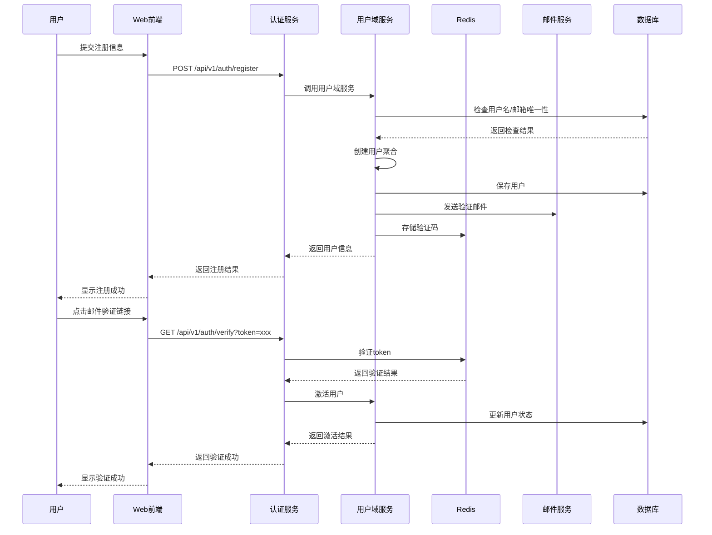
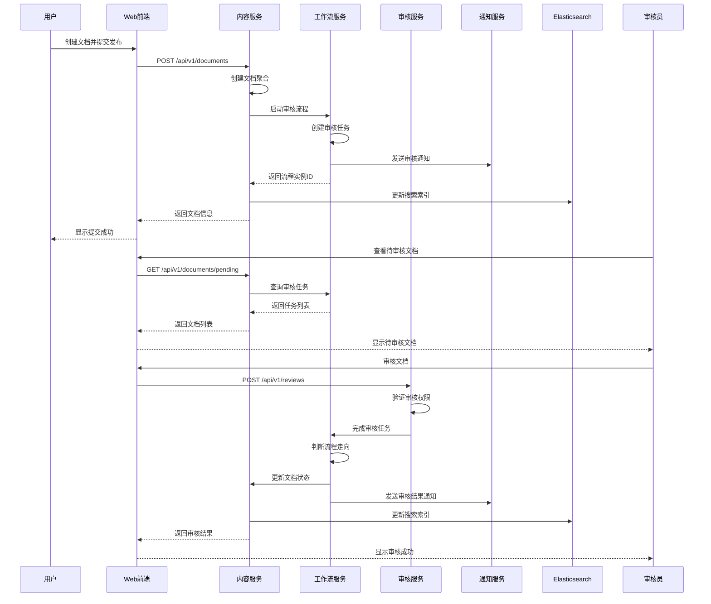

# Spring4demo 业务架构设计

## 📋 文档信息

| 项目 | 内容 |
|------|------|
| **文档名称** | Spring4demo 业务架构设计 |
| **版本号** | v1.0.0 |
| **创建日期** | 2025-12-24 |
| **作者** | 业务架构师 |
| **审核人** | 产品经理 |
| **批准人** | 业务总监 |

## 🎯 业务架构概述

Spring4demo企业级智能管理平台的业务架构基于领域驱动设计(DDD)理念，采用限界上下文划分业务领域，通过聚合根保证业务一致性，以领域事件驱动业务流程。整个架构支持从单体向微服务的平滑演进。

## 🏗️ 业务领域划分

### 1. 核心业务域 (Core Business Domains)

#### 1.1 用户权限域 (User & Permission Domain)

**领域职责**: 负责用户身份管理、权限控制、组织架构管理

**核心业务能力**:
- 用户注册、登录、注销
- 多因子认证(MFA)
- 基于角色的访问控制(RBAC)
- 组织架构层级管理
- 单点登录(SSO)
- 多租户数据隔离

**限界上下文边界**:
```java
// 用户权限域的包结构
com.kev1n.spring4demo.core.domain.user
├── entity/              // 实体
│   ├── User.java
│   ├── Role.java
│   └── Permission.java
├── valueobject/         // 值对象
│   ├── UserProfile.java
│   ├── UserStatus.java
│   └── ContactInfo.java
├── aggregate/           // 聚合根
│   └── UserAggregate.java
├── repository/          // 仓储接口
│   ├── UserRepository.java
│   └── RoleRepository.java
├── service/             // 领域服务
│   ├── UserDomainService.java
│   └── AuthService.java
└── event/               // 领域事件
    ├── UserCreatedEvent.java
    ├── UserUpdatedEvent.java
    └── UserDeletedEvent.java
```

**聚合根设计**:
```java
@Entity
@Table(name = "users")
@AggregateRoot
public class User extends BaseEntity {
    
    @Id
    @GeneratedValue(strategy = GenerationType.IDENTITY)
    private Long id;
    
    @Column(unique = true, nullable = false, length = 50)
    private String username;
    
    @Column(unique = true, nullable = false, length = 100)
    private String email;
    
    @Column(nullable = false)
    private String password;
    
    @Enumerated(EnumType.STRING)
    @Column(nullable = false)
    private UserStatus status;
    
    @Embedded
    private UserProfile profile;
    
    @OneToMany(mappedBy = "user", cascade = CascadeType.ALL, fetch = FetchType.LAZY)
    private Set<UserRole> userRoles = new HashSet<>();
    
    // 领域方法
    public static User create(String username, String email, String password) {
        User user = new User();
        user.username = username;
        user.email = email;
        user.password = password;
        user.status = UserStatus.ACTIVE;
        user.profile = new UserProfile();
        
        // 发布领域事件
        DomainEventPublisher.publish(new UserCreatedEvent(user.id));
        
        return user;
    }
    
    public void activate() {
        if (this.status == UserStatus.INACTIVE) {
            this.status = UserStatus.ACTIVE;
            DomainEventPublisher.publish(new UserActivatedEvent(this.id));
        }
    }
    
    public void assignRole(Role role) {
        UserRole userRole = new UserRole(this, role);
        this.userRoles.add(userRole);
        DomainEventPublisher.publish(new UserRoleAssignedEvent(this.id, role.getId()));
    }
}
```

#### 1.2 内容管理域 (Content Management Domain)

**领域职责**: 企业级内容管理、文档处理、知识库管理

**核心业务能力**:
- 文档创建、编辑、版本控制
- 分类管理和标签系统
- 全文搜索和内容推荐
- 工作流审核和内容合规
- 多媒体文件处理和转换
- 内容权限和访问控制

**聚合设计**:
```java
@Entity
@Table(name = "documents")
@AggregateRoot
public class Document extends BaseEntity {
    
    @Id
    @GeneratedValue(strategy = GenerationType.IDENTITY)
    private Long id;
    
    @Column(nullable = false, length = 255)
    private String title;
    
    @Column(columnDefinition = "LONGTEXT")
    private String content;
    
    @ManyToOne(fetch = FetchType.LAZY)
    @JoinColumn(name = "category_id")
    private Category category;
    
    @ManyToOne(fetch = FetchType.LAZY)
    @JoinColumn(name = "author_id")
    private User author;
    
    @Enumerated(EnumType.STRING)
    @Column(nullable = false)
    private DocumentStatus status;
    
    @Column(name = "version", nullable = false)
    private Integer version = 1;
    
    @ManyToMany
    @JoinTable(
        name = "document_tags",
        joinColumns = @JoinColumn(name = "document_id"),
        inverseJoinColumns = @JoinColumn(name = "tag_id")
    )
    private Set<Tag> tags = new HashSet<>();
    
    // 领域方法
    public static Document create(String title, String content, User author, Category category) {
        Document document = new Document();
        document.title = title;
        document.content = content;
        document.author = author;
        document.category = category;
        document.status = DocumentStatus.DRAFT;
        document.version = 1;
        
        DomainEventPublisher.publish(new DocumentCreatedEvent(document.id));
        
        return document;
    }
    
    public void publish() {
        if (this.status == DocumentStatus.DRAFT) {
            this.status = DocumentStatus.PUBLISHED;
            this.publishedAt = LocalDateTime.now();
            DomainEventPublisher.publish(new DocumentPublishedEvent(this.id));
        }
    }
    
    public void updateContent(String newContent, User updatedBy) {
        this.content = newContent;
        this.version++;
        this.updatedBy = updatedBy.getId();
        this.updatedAt = LocalDateTime.now();
        
        DomainEventPublisher.publish(new DocumentUpdatedEvent(this.id, this.version));
    }
}
```

#### 1.3 工作流引擎域 (Workflow Engine Domain)

**领域职责**: 业务流程管理、任务分配、审批流转

**核心业务能力**:
- 可视化流程设计器
- 流程定义和版本管理
- 任务分配和状态跟踪
- 多级审批和并行审批
- 流程监控和性能分析
- 条件路由和动态任务

**BPMN流程集成**:
```java
@Service
@Transactional
public class WorkflowDomainService {
    
    @Autowired
    private ProcessEngine processEngine;
    
    @Autowired
    private ProcessRepository processRepository;
    
    @Autowired
    private TaskRepository taskRepository;
    
    /**
     * 启动流程实例
     */
    public ProcessInstance startProcess(String processDefinitionKey, String businessKey, 
                                      Map<String, Object> variables, String startedBy) {
        // 1. 验证流程定义
        ProcessDefinition processDefinition = processEngine.getRepositoryService()
            .createProcessDefinitionQuery()
            .processDefinitionKey(processDefinitionKey)
            .latestVersion()
            .singleResult();
        
        if (processDefinition == null) {
            throw new ProcessDefinitionNotFoundException("Process definition not found: " + processDefinitionKey);
        }
        
        // 2. 启动流程实例
        ProcessInstance processInstance = processEngine.getRuntimeService()
            .startProcessInstanceByKey(processDefinitionKey, businessKey, variables);
        
        // 3. 保存流程实例到数据库
        ProcessEntity processEntity = ProcessEntity.builder()
            .processInstanceId(processInstance.getId())
            .processDefinitionKey(processDefinitionKey)
            .businessKey(businessKey)
            .status(ProcessStatus.RUNNING)
            .startedBy(startedBy)
            .startTime(LocalDateTime.now())
            .variables(variables)
            .build();
        
        processRepository.save(processEntity);
        
        // 4. 发布领域事件
        DomainEventPublisher.publish(new ProcessStartedEvent(processInstance.getId(), startedBy));
        
        return processInstance;
    }
    
    /**
     * 完成任务
     */
    public void completeTask(String taskId, String assignee, Map<String, Object> variables) {
        // 1. 获取任务
        Task task = processEngine.getTaskService()
            .createTaskQuery()
            .taskId(taskId)
            .taskAssignee(assignee)
            .singleResult();
        
        if (task == null) {
            throw new TaskNotFoundException("Task not found or not assigned to user: " + taskId);
        }
        
        // 2. 完成任务
        processEngine.getTaskService().complete(taskId, variables);
        
        // 3. 更新任务状态
        TaskEntity taskEntity = taskRepository.findByTaskId(taskId)
            .orElseThrow(() -> new TaskNotFoundException("Task entity not found: " + taskId));
        
        taskEntity.setStatus(TaskStatus.COMPLETED);
        taskEntity.setCompletionTime(LocalDateTime.now());
        taskEntity.setVariables(variables);
        taskRepository.save(taskEntity);
        
        // 4. 发布领域事件
        DomainEventPublisher.publish(new TaskCompletedEvent(taskId, assignee));
    }
}
```

### 2. 支撑业务域 (Supporting Business Domains)

#### 2.1 消息通知域 (Notification Domain)

**领域职责**: 统一消息通知、多渠道推送、通知模板管理

**核心实现**:
```java
@Service
@Transactional
public class NotificationDomainService {
    
    @Autowired
    private NotificationRepository notificationRepository;
    
    @Autowired
    private EmailService emailService;
    
    @Autowired
    private SmsService smsService;
    
    @Autowired
    private WebSocketService webSocketService;
    
    /**
     * 发送通知
     */
    public void sendNotification(NotificationCommand command) {
        // 1. 创建通知实体
        Notification notification = Notification.create(
            command.getRecipientId(),
            command.getType(),
            command.getTitle(),
            command.getContent(),
            command.getChannels()
        );
        
        // 2. 保存通知
        notificationRepository.save(notification);
        
        // 3. 根据渠道发送通知
        for (NotificationChannel channel : command.getChannels()) {
            switch (channel) {
                case EMAIL:
                    sendEmailNotification(notification);
                    break;
                case SMS:
                    sendSmsNotification(notification);
                    break;
                case WEBSOCKET:
                    sendWebSocketNotification(notification);
                    break;
                case IN_APP:
                    sendInAppNotification(notification);
                    break;
            }
        }
        
        // 4. 发布事件
        DomainEventPublisher.publish(new NotificationSentEvent(notification.getId()));
    }
    
    private void sendEmailNotification(Notification notification) {
        EmailRequest emailRequest = EmailRequest.builder()
            .to(notification.getRecipientEmail())
            .subject(notification.getTitle())
            .content(notification.getContent())
            .template(notification.getTemplate())
            .build();
        
        emailService.send(emailRequest);
    }
    
    private void sendWebSocketNotification(Notification notification) {
        WebSocketMessage message = WebSocketMessage.builder()
            .type("NOTIFICATION")
            .userId(notification.getRecipientId())
            .data(NotificationMapper.toDTO(notification))
            .build();
        
        webSocketService.sendToUser(notification.getRecipientId(), message);
    }
}
```

#### 2.2 文件管理域 (File Management Domain)

**领域职责**: 文件存储、版本控制、权限管理、格式转换

**分布式存储实现**:
```java
@Service
@Transactional
public class FileManagementDomainService {
    
    @Autowired
    private FileRepository fileRepository;
    
    @Autowired
    private StorageService storageService;
    
    @Autowired
    private ImageProcessingService imageProcessingService;
    
    /**
     * 上传文件
     */
    public FileEntity uploadFile(UploadFileCommand command) {
        // 1. 验证文件
        validateFile(command.getFile());
        
        // 2. 生成文件路径和名称
        String filePath = generateFilePath(command.getCategory(), command.getFile().getOriginalFilename());
        String fileKey = generateFileKey(filePath);
        
        // 3. 上传到存储服务
        StorageResult storageResult = storageService.upload(fileKey, command.getFile());
        
        // 4. 处理图片缩略图
        String thumbnailUrl = null;
        if (isImageFile(command.getFile())) {
            thumbnailUrl = generateThumbnail(command.getFile(), fileKey);
        }
        
        // 5. 创建文件实体
        FileEntity fileEntity = FileEntity.builder()
            .originalName(command.getFile().getOriginalFilename())
            .storagePath(storageResult.getPath())
            .fileSize(command.getFile().getSize())
            .mimeType(command.getFile().getContentType())
            .category(command.getCategory())
            .uploadedBy(command.getUploadedBy())
            .thumbnailUrl(thumbnailUrl)
            .status(FileStatus.ACTIVE)
            .build();
        
        fileRepository.save(fileEntity);
        
        // 6. 发布事件
        DomainEventPublisher.publish(new FileUploadedEvent(fileEntity.getId()));
        
        return fileEntity;
    }
    
    private String generateFilePath(String category, String originalFilename) {
        String datePath = LocalDate.now().format(DateTimeFormatter.ofPattern("yyyy/MM/dd"));
        String fileExtension = getFileExtension(originalFilename);
        String uuid = UUID.randomUUID().toString();
        
        return String.format("%s/%s/%s%s", category, datePath, uuid, fileExtension);
    }
    
    private String generateThumbnail(MultipartFile file, String originalFileKey) {
        try {
            // 生成缩略图
            BufferedImage thumbnail = imageProcessingService.generateThumbnail(
                file.getInputStream(), 200, 200);
            
            // 上传缩略图
            String thumbnailKey = "thumbnails/" + originalFileKey;
            ByteArrayOutputStream baos = new ByteArrayOutputStream();
            ImageIO.write(thumbnail, "jpg", baos);
            
            return storageService.upload(thumbnailKey, baos.toByteArray(), "image/jpeg").getPath();
        } catch (Exception e) {
            log.error("Failed to generate thumbnail for file: " + originalFileKey, e);
            return null;
        }
    }
}
```

## 🔄 业务流程架构

### 1. 核心业务流程设计

#### 1.1 用户注册和认证流程



**实现代码**:
```java
@Service
@Transactional
public class AuthenticationService {
    
    @Autowired
    private UserDomainService userDomainService;
    
    @Autowired
    private EmailService emailService;
    
    @Autowired
    private RedisTemplate<String, String> redisTemplate;
    
    /**
     * 用户注册
     */
    public RegisterResult register(RegisterCommand command) {
        // 1. 创建用户
        CreateUserCommand createUserCommand = CreateUserCommand.builder()
            .username(command.getUsername())
            .email(command.getEmail())
            .password(command.getPassword())
            .firstName(command.getFirstName())
            .lastName(command.getLastName())
            .build();
        
        User user = userDomainService.createUser(createUserCommand);
        
        // 2. 生成验证令牌
        String verificationToken = generateVerificationToken(user.getId());
        
        // 3. 发送验证邮件
        EmailRequest emailRequest = EmailRequest.builder()
            .to(user.getEmail())
            .subject("Verify your email address")
            .template("email-verification")
            .variable("userName", user.getUsername())
            .variable("verificationUrl", buildVerificationUrl(verificationToken))
            .build();
        
        emailService.send(emailRequest);
        
        // 4. 返回注册结果
        return RegisterResult.builder()
            .userId(user.getId())
            .username(user.getUsername())
            .email(user.getEmail())
            .status("PENDING_VERIFICATION")
            .message("Registration successful. Please check your email for verification.")
            .build();
    }
    
    /**
     * 邮箱验证
     */
    public VerifyResult verifyEmail(String token) {
        // 1. 从Redis获取用户ID
        String userId = redisTemplate.opsForValue().get("email_verification:" + token);
        if (userId == null) {
            throw new InvalidTokenException("Invalid or expired verification token");
        }
        
        // 2. 激活用户
        userDomainService.activateUser(Long.parseLong(userId));
        
        // 3. 删除验证令牌
        redisTemplate.delete("email_verification:" + token);
        
        return VerifyResult.builder()
            .status("VERIFIED")
            .message("Email verification successful")
            .build();
    }
    
    private String generateVerificationToken(Long userId) {
        String token = UUID.randomUUID().toString();
        redisTemplate.opsForValue().set(
            "email_verification:" + token, 
            userId.toString(), 
            Duration.ofHours(24)
        );
        return token;
    }
}
```

#### 1.2 文档发布审核流程



**工作流配置**:
```xml
<!-- document-review-process.bpmn20.xml -->
<definitions xmlns="http://www.omg.org/spec/BPMN/20100524/MODEL"
             targetNamespace="http://spring4demo.com/bpmn">
    
    <process id="documentReviewProcess" name="Document Review Process">
        
        <startEvent id="startEvent"/>
        
        <sequenceFlow sourceRef="startEvent" targetRef="managerReview"/>
        
        <userTask id="managerReview" name="Manager Review">
            <extensionElements>
                <activiti:candidateGroups>MANAGER</activiti:candidateGroups>
            </extensionElements>
        </userTask>
        
        <sequenceFlow sourceRef="managerReview" targetRef="reviewDecision"/>
        
        <exclusiveGateway id="reviewDecision"/>
        
        <sequenceFlow sourceRef="reviewDecision" targetRef="approvedEnd">
            <conditionExpression xsi:type="tFormalExpression">
                ${approved == true}
            </conditionExpression>
        </sequenceFlow>
        
        <sequenceFlow sourceRef="reviewDecision" targetRef="rejectedEnd">
            <conditionExpression xsi:type="tFormalExpression">
                ${approved == false}
            </conditionExpression>
        </sequenceFlow>
        
        <endEvent id="approvedEnd">
            <extensionElements>
                <activiti:executionListener event="end" 
                    delegateExpression="${documentApprovedListener}"/>
            </extensionElements>
        </endEvent>
        
        <endEvent id="rejectedEnd">
            <extensionElements>
                <activiti:executionListener event="end" 
                    delegateExpression="${documentRejectedListener}"/>
            </extensionElements>
        </endEvent>
        
    </process>
</definitions>
```

## 📊 业务能力矩阵与实现

### 1. 用户管理能力实现

| 能力项 | 实现类 | 关键方法 | 性能指标 | 监控指标 |
|--------|--------|----------|----------|----------|
| 用户注册 | UserDomainService | createUser() | 响应时间<200ms | 注册成功率 |
| 身份认证 | AuthenticationService | authenticate() | 响应时间<100ms | 登录成功率 |
| 权限验证 | PermissionService | checkPermission() | 响应时间<50ms | 权限检查QPS |
| 密码重置 | PasswordResetService | resetPassword() | 响应时间<500ms | 邮件发送成功率 |

**权限验证实现**:
```java
@Component
public class PermissionService {
    
    @Autowired
    private UserRepository userRepository;
    
    @Autowired
    private RedisTemplate<String, Object> redisTemplate;
    
    /**
     * 检查用户权限
     */
    @Cacheable(value = "user_permissions", key = "#userId")
    public boolean hasPermission(Long userId, String resource, String action) {
        // 1. 从缓存获取用户权限
        String cacheKey = "user_permissions:" + userId;
        Set<String> permissions = (Set<String>) redisTemplate.opsForValue().get(cacheKey);
        
        if (permissions == null) {
            // 2. 从数据库加载权限
            User user = userRepository.findById(userId)
                .orElseThrow(() -> new UserNotFoundException("User not found: " + userId));
            
            permissions = user.getPermissions();
            
            // 3. 缓存权限信息
            redisTemplate.opsForValue().set(cacheKey, permissions, Duration.ofMinutes(30));
        }
        
        // 4. 检查权限
        String requiredPermission = resource + ":" + action;
        return permissions.contains(requiredPermission) || 
               permissions.contains("*:*") || // 超级管理员权限
               permissions.contains(resource + ":*"); // 资源所有权限
    }
    
    /**
     * 清除用户权限缓存
     */
    @CacheEvict(value = "user_permissions", key = "#userId")
    public void clearUserPermissionCache(Long userId) {
        // 缓存清除逻辑
    }
}
```

### 2. 内容管理能力实现

| 能力项 | 实现类 | 关键方法 | 性能指标 | 存储策略 |
|--------|--------|----------|----------|----------|
| 文档创建 | DocumentDomainService | createDocument() | 响应时间<300ms | MySQL存储 |
| 全文搜索 | SearchService | searchDocuments() | 响应时间<500ms | Elasticsearch |
| 版本控制 | VersionService | createVersion() | 响应时间<200ms | MongoDB存储 |
| 内容审核 | ReviewService | submitForReview() | 响应时间<400ms | 工作流引擎 |

**搜索服务实现**:
```java
@Service
public class SearchService {
    
    @Autowired
    private ElasticsearchOperations elasticsearchOperations;
    
    @Autowired
    private DocumentRepository documentRepository;
    
    /**
     * 全文搜索文档
     */
    public SearchResult<DocumentDTO> searchDocuments(SearchQuery query) {
        // 1. 构建搜索查询
        BoolQueryBuilder boolQuery = QueryBuilders.boolQuery();
        
        // 关键词搜索
        if (StringUtils.hasText(query.getKeyword())) {
            boolQuery.must(QueryBuilders.multiMatchQuery(query.getKeyword())
                .field("title", 2.0f)
                .field("content", 1.0f)
                .field("tags.name", 1.5f)
                .type(MultiMatchQueryBuilder.Type.BEST_FIELDS));
        }
        
        // 分类过滤
        if (query.getCategoryId() != null) {
            boolQuery.filter(QueryBuilders.termQuery("category.id", query.getCategoryId()));
        }
        
        // 状态过滤
        if (query.getStatus() != null) {
            boolQuery.filter(QueryBuilders.termQuery("status", query.getStatus().name()));
        }
        
        // 时间范围过滤
        if (query.getStartDate() != null && query.getEndDate() != null) {
            boolQuery.filter(QueryBuilders.rangeQuery("createdAt")
                .gte(query.getStartDate())
                .lte(query.getEndDate()));
        }
        
        // 2. 构建排序
        List<SortBuilder<?>> sorts = new ArrayList<>();
        if ("relevance".equals(query.getSortBy())) {
            sorts.add(ScoreSortBuilder.DESC);
        } else if ("date".equals(query.getSortBy())) {
            sorts.add(FieldSortBuilder.DESC.field("createdAt"));
        } else if ("title".equals(query.getSortBy())) {
            sorts.add(FieldSortBuilder.ASC.field("title.keyword"));
        }
        
        // 3. 构建高亮
        HighlightBuilder highlightBuilder = new HighlightBuilder()
            .field("title")
            .field("content")
            .fragmentSize(150)
            .numOfFragments(3);
        
        // 4. 执行搜索
        NativeSearchQuery searchQuery = new NativeSearchQueryBuilder()
            .withQuery(boolQuery)
            .withSorts(sorts)
            .withHighlightBuilder(highlightBuilder)
            .withPageable(PageRequest.of(query.getPage(), query.getSize()))
            .build();
        
        SearchHits<DocumentDocument> searchHits = elasticsearchOperations.search(searchQuery, DocumentDocument.class);
        
        // 5. 转换结果
        List<DocumentDTO> documents = searchHits.getSearchHits().stream()
            .map(hit -> {
                DocumentDocument doc = hit.getContent();
                DocumentDTO dto = DocumentMapper.toDTO(doc);
                
                // 设置高亮片段
                if (hit.getHighlightFields().containsKey("title")) {
                    dto.setHighlightedTitle(hit.getHighlightFields().get("title").getFragments()[0].string());
                }
                if (hit.getHighlightFields().containsKey("content")) {
                    dto.setHighlightedContent(hit.getHighlightFields().get("content").getFragments()[0].string());
                }
                
                return dto;
            })
            .collect(Collectors.toList());
        
        return SearchResult.<DocumentDTO>builder()
            .content(documents)
            .totalElements(searchHits.getTotalHits())
            .totalPages((int) Math.ceil((double) searchHits.getTotalHits() / query.getSize()))
            .currentPage(query.getPage())
            .build();
    }
}
```

## 🔧 业务规则引擎

### 1. 规则引擎架构

```java
@Component
public class BusinessRuleEngine {
    
    @Autowired
    private KieContainer kieContainer;
    
    @Autowired
    private RuleRepository ruleRepository;
    
    /**
     * 执行业务规则
     */
    public RuleExecutionResult executeRules(String ruleGroup, Map<String, Object> facts) {
        // 1. 获取KIE会话
        KieSession kieSession = kieContainer.newKieSession();
        
        try {
            // 2. 插入事实对象
            facts.forEach(kieSession::insert);
            
            // 3. 设置全局变量
            kieSession.setGlobal("ruleLogger", new RuleLogger());
            
            // 4. 执行规则
            kieSession.fireAllRules();
            
            // 5. 获取执行结果
            RuleExecutionResult result = extractExecutionResult(kieSession);
            
            return result;
        } finally {
            kieSession.dispose();
        }
    }
    
    /**
     * 用户注册规则验证
     */
    public ValidationResult validateUserRegistration(CreateUserCommand command) {
        Map<String, Object> facts = new HashMap<>();
        facts.put("command", command);
        facts.put("result", new ValidationResult());
        
        RuleExecutionResult executionResult = executeRules("user_registration", facts);
        
        return (ValidationResult) executionResult.getFact("result");
    }
}
```

### 2. 业务规则示例 (DRL)

```drools
// 用户注册规则.drl
package com.kev1n.spring4demo.rules

import com.kev1n.spring4demo.core.domain.user.command.CreateUserCommand
import com.kev1n.spring4demo.core.domain.user.validation.ValidationResult

rule "用户名长度验证"
when
    $command : CreateUserCommand(username == null || username.length < 3 || username.length > 50)
    $result : ValidationResult()
then
    $result.addError("用户名长度必须在3-50个字符之间");
end

rule "邮箱格式验证"
when
    $command : CreateUserCommand(email == null || !email.matches("^[A-Za-z0-9+_.-]+@(.+)$"))
    $result : ValidationResult()
then
    $result.addError("邮箱格式不正确");
end

rule "密码强度验证"
when
    $command : CreateUserCommand(password == null || !password.matches("^(?=.*[a-z])(?=.*[A-Z])(?=.*\\d)(?=.*[@$!%*?&])[A-Za-z\\d@$!%*?&]"))
    $result : ValidationResult()
then
    $result.addError("密码必须包含大小写字母、数字和特殊字符");
end

rule "企业邮箱域名验证"
when
    $command : CreateUserCommand(email != null && !email.endsWith("@company.com"))
    $result : ValidationResult()
then
    $result.addWarning("建议使用企业邮箱注册");
end
```

## 📈 业务监控与分析

### 1. 业务指标监控

```java
@Component
public class BusinessMetrics {
    
    private final Counter userRegistrationCounter;
    private final Counter documentCreationCounter;
    private final Timer userLoginTimer;
    private final Gauge activeUsersGauge;
    
    public BusinessMetrics(MeterRegistry meterRegistry) {
        this.userRegistrationCounter = Counter.builder("business.user.registrations")
            .description("Number of user registrations")
            .register(meterRegistry);
        
        this.documentCreationCounter = Counter.builder("business.document.creations")
            .description("Number of document creations")
            .register(meterRegistry);
        
        this.userLoginTimer = Timer.builder("business.user.login.time")
            .description("User login response time")
            .register(meterRegistry);
        
        this.activeUsersGauge = Gauge.builder("business.users.active")
            .description("Number of active users")
            .register(meterRegistry, this, BusinessMetrics::getActiveUserCount);
    }
    
    @EventListener
    public void handleUserRegistered(UserRegisteredEvent event) {
        userRegistrationCounter.increment(
            Tags.of("tenant", event.getTenantId().toString())
        );
    }
    
    @EventListener
    public void handleDocumentCreated(DocumentCreatedEvent event) {
        documentCreationCounter.increment(
            Tags.of("category", event.getCategory(), "author", event.getAuthorId().toString())
        );
    }
    
    public Timer.Sample startLoginTimer() {
        return Timer.start();
    }
    
    public void recordLoginTime(Timer.Sample sample) {
        sample.stop(userLoginTimer);
    }
    
    private double getActiveUserCount() {
        // 实现获取活跃用户数的逻辑
        return userService.getActiveUserCount();
    }
}
```

### 2. 业务分析服务

```java
@Service
public class BusinessAnalyticsService {
    
    @Autowired
    private UserRepository userRepository;
    
    @Autowired
    private DocumentRepository documentRepository;
    
    @Autowired
    private ProcessInstanceRepository processInstanceRepository;
    
    /**
     * 用户活跃度分析
     */
    public UserActivityAnalysis analyzeUserActivity(LocalDate startDate, LocalDate endDate) {
        // 1. 查询时间段内的用户活动数据
        List<UserActivity> activities = userRepository.findUserActivities(startDate, endDate);
        
        // 2. 计算活跃度指标
        long totalUsers = userRepository.count();
        long activeUsers = activities.stream()
            .map(UserActivity::getUserId)
            .distinct()
            .count();
        
        double activityRate = (double) activeUsers / totalUsers * 100;
        
        // 3. 按天统计活跃用户数
        Map<LocalDate, Long> dailyActiveUsers = activities.stream()
            .collect(Collectors.groupingBy(
                UserActivity::getDate,
                Collectors.counting()
            ));
        
        // 4. 计算留存率
        double retentionRate = calculateRetentionRate(startDate, endDate);
        
        return UserActivityAnalysis.builder()
            .totalUsers(totalUsers)
            .activeUsers(activeUsers)
            .activityRate(activityRate)
            .dailyActiveUsers(dailyActiveUsers)
            .retentionRate(retentionRate)
            .build();
    }
    
    /**
     * 内容发布分析
     */
    public ContentPublishingAnalysis analyzeContentPublishing(LocalDate startDate, LocalDate endDate) {
        // 1. 查询文档发布数据
        List<Document> documents = documentRepository.findByPublishedAtBetween(startDate, endDate);
        
        // 2. 按分类统计
        Map<String, Long> documentsByCategory = documents.stream()
            .collect(Collectors.groupingBy(
                doc -> doc.getCategory().getName(),
                Collectors.counting()
            ));
        
        // 3. 按作者统计
        Map<String, Long> documentsByAuthor = documents.stream()
            .collect(Collectors.groupingBy(
                doc -> doc.getAuthor().getUsername(),
                Collectors.counting()
            ));
        
        // 4. 计算平均审核时间
        double averageReviewTime = documents.stream()
            .filter(doc -> doc.getReviewedAt() != null)
            .mapToLong(doc -> Duration.between(doc.getCreatedAt(), doc.getReviewedAt()).toHours())
            .average()
            .orElse(0.0);
        
        return ContentPublishingAnalysis.builder()
            .totalDocuments(documents.size())
            .documentsByCategory(documentsByCategory)
            .documentsByAuthor(documentsByAuthor)
            .averageReviewTime(averageReviewTime)
            .build();
    }
}
```

---

*本文档提供了详细的业务架构设计，包括具体的实现代码、配置示例和最佳实践，为开发团队提供了直接的技术指导。*