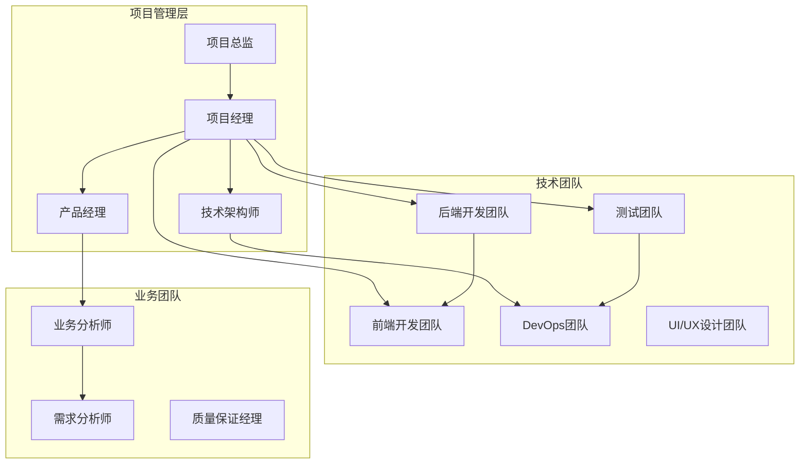
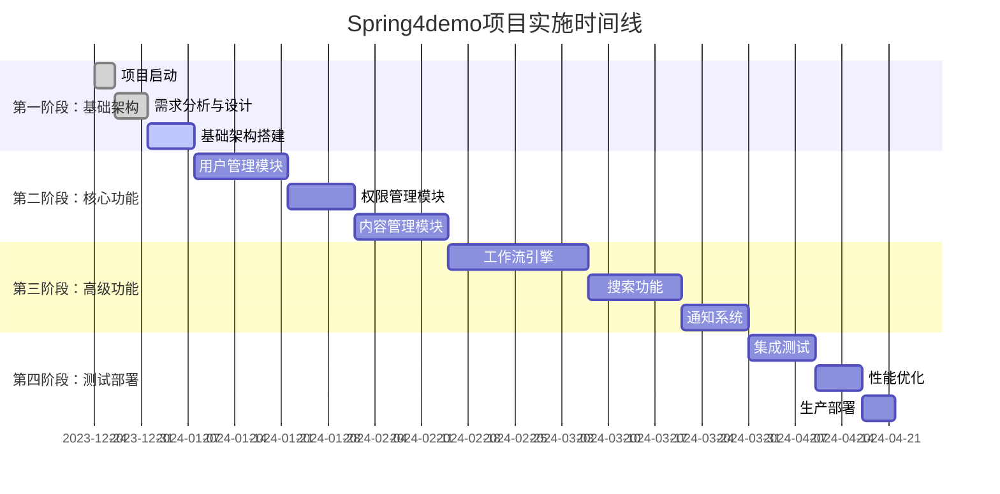
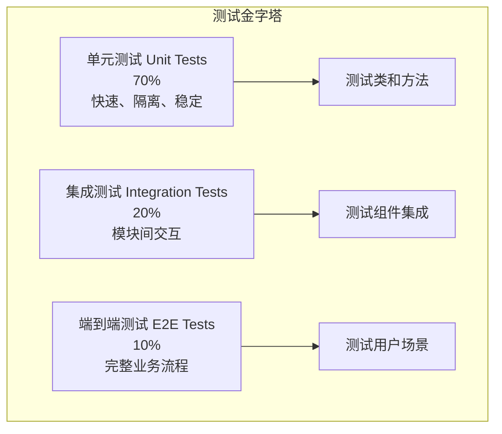
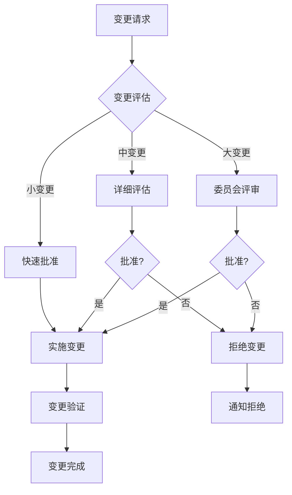

# Spring4demo 实施方案设计

## 📋 文档信息

| 项目 | 内容 |
|------|------|
| **文档名称** | Spring4demo 实施方案设计 |
| **版本号** | v1.0.0 |
| **创建日期** | 2025-12-24 |
| **作者** | 项目经理 |
| **审核人** | 技术架构师 |
| **批准人** | 项目总监 |

## 🎯 实施方案概述

Spring4demo实施方案采用敏捷开发方法，分阶段交付，确保项目能够快速响应业务需求变化。整个实施过程包括项目启动、需求分析、系统设计、开发实现、测试验证、部署上线和运维支持等完整环节，配备专业的项目团队和完善的实施流程。

## 👥 项目组织架构

### 1. 项目团队结构



**团队成员职责**:

| 角色 | 人数 | 主要职责 |
|------|------|----------|
| 项目总监 | 1 | 项目整体把控、资源协调、风险决策 |
| 项目经理 | 1 | 项目计划制定、进度管理、团队协调 |
| 技术架构师 | 1 | 技术架构设计、技术选型、代码审查 |
| 产品经理 | 1 | 需求管理、产品规划、用户验收 |
| 后端开发工程师 | 4 | 后端功能开发、API设计、数据库设计 |
| 前端开发工程师 | 3 | 前端界面开发、用户体验实现 |
| 测试工程师 | 2 | 测试用例设计、自动化测试、质量保证 |
| DevOps工程师 | 2 | 环境搭建、CI/CD、监控运维 |
| UI/UX设计师 | 1 | 界面设计、交互设计、用户体验 |
| 业务分析师 | 1 | 业务需求分析、流程梳理 |

### 2. 项目管理流程

#### 2.1 敏捷开发流程



#### 2.2 Sprint规划

**Sprint 1-2: 基础架构搭建**
- 目标：建立项目基础架构和开发环境
- 主要任务：
  - 项目初始化和代码仓库搭建
  - CI/CD流水线配置
  - 开发环境Docker化部署
  - 数据库设计和初始化
  - 基础框架搭建

**Sprint 3-4: 用户权限模块**
- 目标：完成用户管理和权限控制功能
- 主要任务：
  - 用户注册、登录、信息管理
  - 角色权限管理
  - JWT认证实现
  - 权限控制中间件
  - 用户界面开发

**Sprint 5-6: 内容管理模块**
- 目标：实现文档管理和内容审核功能
- 主要任务：
  - 文档CRUD操作
  - 分类和标签管理
  - 文档搜索功能
  - 内容审核流程
  - 文件上传下载

**Sprint 7-9: 工作流引擎**
- 目标：构建完整的业务流程管理系统
- 主要任务：
  - 流程定义和实例管理
  - 任务分配和处理
  - 流程监控和统计
  - 可视化流程设计器
  - 移动端适配

## 📋 实施阶段规划

### 1. 第一阶段：项目启动与基础架构（2周）

#### 1.1 项目启动准备

**项目启动清单**:

```markdown
## 项目启动检查清单

### 环境准备
- [ ] 开发环境搭建（IDE、JDK、Maven、Git）
- [ ] 代码仓库创建（GitHub/GitLab）
- [ ] 项目管理工具配置（Jira/Confluence）
- [ ] 团队沟通工具配置（Slack/Teams）
- [ ] 文档管理平台搭建

### 技术准备
- [ ] 技术栈确认和版本锁定
- [ ] 开发规范制定（代码规范、提交规范）
- [ ] CI/CD流水线基础配置
- [ ] Docker开发环境配置
- [ ] 数据库环境搭建

### 团队准备
- [ ] 团队成员角色确认
- [ ] 开发流程培训
- [ ] 技术栈培训
- [ ] 项目目标和范围确认
- [ ] 沟通机制建立
```

**项目启动会议议程**:

```yaml
# 项目启动会议议程
meeting_agenda:
  duration: "2小时"
  participants: "全体项目成员"
  
  agenda_items:
    - time: "0:00-0:15"
      topic: "项目背景和目标介绍"
      presenter: "项目总监"
      materials:
        - "项目背景文档"
        - "项目目标PPT"
    
    - time: "0:15-0:30"
      topic: "技术架构和选型说明"
      presenter: "技术架构师"
      materials:
        - "技术架构图"
        - "技术选型对比表"
    
    - time: "0:30-0:45"
      topic: "项目计划和里程碑"
      presenter: "项目经理"
      materials:
        - "项目时间线"
        - "关键里程碑"
        - "风险评估"
    
    - time: "0:45-1:00"
      topic: "团队协作流程和规范"
      presenter: "项目经理"
      materials:
        - "开发流程图"
        - "代码规范文档"
        - "协作工具使用指南"
    
    - time: "1:00-1:30"
      topic: "需求分析和功能演示"
      presenter: "产品经理"
      materials:
        - "需求文档"
        - "原型设计"
        - "用户故事地图"
    
    - time: "1:30-2:00"
      topic: "Q&A和团队讨论"
      presenter: "全体成员"
      materials:
        - "常见问题清单"
        - "讨论要点记录"
```

#### 1.2 基础架构搭建

**技术架构实施计划**:

```java
// 项目初始化脚本
public class ProjectInitializer {
    
    public void initializeProject() {
        // 1. 创建项目结构
        createProjectStructure();
        
        // 2. 配置Maven父项目
        setupMavenParentProject();
        
        // 3. 创建子模块
        createSubModules();
        
        // 4. 配置基础依赖
        setupBasicDependencies();
        
        // 5. 配置开发环境
        setupDevelopmentEnvironment();
        
        // 6. 初始化数据库
        initializeDatabase();
        
        // 7. 配置CI/CD流水线
        setupCICDPipeline();
    }
    
    private void createProjectStructure() {
        // 创建标准Maven项目结构
        String[] directories = {
            "src/main/java/com/kev1n/spring4demo",
            "src/main/resources",
            "src/test/java",
            "src/test/resources",
            "docs",
            "scripts",
            "docker"
        };
        
        for (String dir : directories) {
            new File(dir).mkdirs();
        }
    }
}
```

**Docker开发环境配置**:

```yaml
# docker-compose.dev.yml
version: '3.8'

services:
  # 应用服务
  app:
    build:
      context: .
      dockerfile: Dockerfile.dev
    ports:
      - "8080:8080"
      - "5005:5005"  # Debug端口
    volumes:
      - .:/app
      - ~/.m2:/root/.m2
    environment:
      - SPRING_PROFILES_ACTIVE=dev
      - JAVA_DEBUG_OPTIONS="-Xdebug -Xrunjdwp:transport=dt_socket,server=y,suspend=n,address=*:5005"
    depends_on:
      - mysql
      - redis
    networks:
      - dev-network

  # MySQL数据库
  mysql:
    image: mysql:8.0.35
    ports:
      - "3306:3306"
    environment:
      - MYSQL_ROOT_PASSWORD=rootpassword
      - MYSQL_DATABASE=spring4demo_dev
      - MYSQL_USER=dev
      - MYSQL_PASSWORD=devpassword
    volumes:
      - mysql_dev_data:/var/lib/mysql
      - ./docker/mysql/init.sql:/docker-entrypoint-initdb.d/init.sql
    networks:
      - dev-network

  # Redis缓存
  redis:
    image: redis:7.0.5-alpine
    ports:
      - "6379:6379"
    volumes:
      - redis_dev_data:/data
    networks:
      - dev-network

volumes:
  mysql_dev_data:
  redis_dev_data:

networks:
  dev-network:
    driver: bridge
```

### 2. 第二阶段：核心功能开发（8周）

#### 2.1 用户权限模块开发

**开发任务分解**:

```markdown
## 用户权限模块开发任务

### Sprint 3: 用户管理基础功能
**目标**: 完成用户注册、登录、信息管理等基础功能

#### 后端开发任务
- [ ] 用户实体设计和数据库表创建
- [ ] 用户注册API开发
- [ ] 用户登录API开发（JWT认证）
- [ ] 用户信息查询和更新API
- [ ] 密码重置功能
- [ ] 用户状态管理（激活/禁用）

#### 前端开发任务
- [ ] 登录页面开发
- [ ] 注册页面开发
- [ ] 用户信息管理页面
- [ ] 密码修改页面
- [ ] 用户列表页面（管理员）
- [ ] 响应式布局适配

#### 测试任务
- [ ] 用户注册功能测试用例
- [ ] 用户登录功能测试用例
- [ ] 用户信息管理测试用例
- [ ] 安全性测试（SQL注入、XSS等）
- [ ] 性能测试（并发登录）

### Sprint 4: 权限管理功能
**目标**: 完成角色权限管理功能

#### 后端开发任务
- [ ] 角色权限实体设计
- [ ] 角色管理API开发
- [ ] 权限管理API开发
- [ ] 用户角色分配API
- [ ] 权限验证中间件
- [ ] 动态权限加载

#### 前端开发任务
- [ ] 角色管理页面
- [ ] 权限管理页面
- [ ] 用户角色分配页面
- [ ] 权限树形组件开发
- [ ] 权限验证前端实现

#### 测试任务
- [ ] 权限管理功能测试
- [ ] 权限验证测试
- [ ] 角色分配测试
- [ ] 安全性测试
```

**代码实现示例**:

```java
// 用户服务实现
@Service
@Transactional
public class UserServiceImpl implements UserService {
    
    @Autowired
    private UserRepository userRepository;
    
    @Autowired
    private PasswordEncoder passwordEncoder;
    
    @Autowired
    private EmailService emailService;
    
    @Override
    public UserDTO registerUser(RegisterUserRequest request) {
        // 1. 验证用户名唯一性
        if (userRepository.existsByUsername(request.getUsername())) {
            throw new UserAlreadyExistsException("Username already exists");
        }
        
        // 2. 验证邮箱唯一性
        if (userRepository.existsByEmail(request.getEmail())) {
            throw new UserAlreadyExistsException("Email already exists");
        }
        
        // 3. 创建用户实体
        User user = User.builder()
            .username(request.getUsername())
            .email(request.getEmail())
            .password(passwordEncoder.encode(request.getPassword()))
            .status(UserStatus.INACTIVE)
            .build();
        
        // 4. 保存用户
        user = userRepository.save(user);
        
        // 5. 发送激活邮件
        String activationToken = generateActivationToken(user);
        emailService.sendActivationEmail(user.getEmail(), activationToken);
        
        // 6. 返回用户信息
        return UserMapper.toDTO(user);
    }
    
    @Override
    public LoginResponse loginUser(LoginRequest request) {
        // 1. 查找用户
        User user = userRepository.findByUsername(request.getUsername())
            .orElseThrow(() -> new AuthenticationException("Invalid credentials"));
        
        // 2. 验证密码
        if (!passwordEncoder.matches(request.getPassword(), user.getPassword())) {
            throw new AuthenticationException("Invalid credentials");
        }
        
        // 3. 检查用户状态
        if (user.getStatus() != UserStatus.ACTIVE) {
            throw new UserInactiveException("User account is not active");
        }
        
        // 4. 生成JWT Token
        String token = jwtTokenProvider.generateToken(user);
        
        // 5. 更新登录信息
        user.setLastLoginTime(LocalDateTime.now());
        user.setLastLoginIp(request.getIpAddress());
        userRepository.save(user);
        
        return LoginResponse.builder()
            .token(token)
            .user(UserMapper.toDTO(user))
            .build();
    }
}
```

#### 2.2 内容管理模块开发

**开发任务分解**:

```markdown
## 内容管理模块开发任务

### Sprint 5: 文档管理基础功能
**目标**: 完成文档的创建、编辑、查看等基础功能

#### 后端开发任务
- [ ] 文档实体设计和数据库表创建
- [ ] 文档CRUD API开发
- [ ] 文档分类管理API
- [ ] 文档标签管理API
- [ ] 文件上传下载API
- [ ] 文档版本控制

#### 前端开发任务
- [ ] 文档列表页面
- [ ] 文档创建/编辑页面
- [ ] 文档详情页面
- [ ] 文档分类管理页面
- [ ] 文件上传组件
- [ ] 富文本编辑器集成

#### 搜索功能开发任务
- [ ] Elasticsearch索引配置
- [ ] 文档搜索API开发
- [ ] 搜索结果页面
- [ ] 高级搜索功能
- [ ] 搜索结果高亮

### Sprint 6: 内容审核和发布
**目标**: 完成内容审核流程和发布功能

#### 后端开发任务
- [ ] 审核流程引擎集成
- [ ] 文档状态管理
- [ ] 审核任务分配
- [ ] 发布调度功能
- [ ] 审核历史记录

#### 前端开发任务
- [ ] 审核任务页面
- [ ] 审核详情页面
- [ ] 发布管理页面
- [ ] 审核历史查询
- [ ] 批量操作功能
```

### 3. 第三阶段：高级功能开发（6周）

#### 3.1 工作流引擎开发

**工作流引擎集成方案**:

```java
// 工作流服务实现
@Service
@Transactional
public class WorkflowServiceImpl implements WorkflowService {
    
    @Autowired
    private ProcessEngine processEngine;
    
    @Autowired
    private ProcessDefinitionRepository processDefinitionRepository;
    
    @Override
    public ProcessInstance startProcess(String processKey, StartProcessRequest request, Long userId) {
        // 1. 获取流程定义
        ProcessDefinition processDefinition = processDefinitionRepository
            .findByKeyAndStatus(processKey, Status.ACTIVE)
            .orElseThrow(() -> new ProcessDefinitionNotFoundException("Process not found"));
        
        // 2. 构建流程变量
        Map<String, Object> variables = new HashMap<>();
        variables.put("applicant", userId);
        variables.putAll(request.getVariables());
        
        // 3. 启动流程实例
        org.activiti.engine.runtime.ProcessInstance activitiInstance = processEngine
            .getRuntimeService()
            .startProcessInstanceByKey(processKey, request.getBusinessKey(), variables);
        
        // 4. 保存流程实例信息
        ProcessInstance processInstance = ProcessInstance.builder()
            .processInstanceId(activitiInstance.getId())
            .processDefinitionId(processDefinition.getId())
            .processDefinitionKey(processKey)
            .businessKey(request.getBusinessKey())
            .startedBy(userId)
            .startTime(LocalDateTime.now())
            .variables(variables)
            .status(ProcessStatus.RUNNING)
            .build();
        
        return processInstanceRepository.save(processInstance);
    }
    
    @Override
    public List<TaskInstance> getTasksByAssignee(Long userId) {
        List<org.activiti.engine.task.Task> activitiTasks = processEngine
            .getTaskService()
            .createTaskQuery()
            .taskAssignee(userId.toString())
            .active()
            .orderByTaskCreateTime()
            .desc()
            .list();
        
        return activitiTasks.stream()
            .map(this::convertToTaskInstance)
            .collect(Collectors.toList());
    }
    
    private TaskInstance convertToTaskInstance(org.activiti.engine.task.Task activitiTask) {
        return TaskInstance.builder()
            .taskId(activitiTask.getId())
            .processInstanceId(activitiTask.getProcessInstanceId())
            .name(activitiTask.getName())
            .description(activitiTask.getDescription())
            .assignee(Long.parseLong(activitiTask.getAssignee()))
            .createTime(activitiTask.getCreateTime().toInstant()
                .atZone(ZoneId.systemDefault()).toLocalDateTime())
            .dueDate(activitiTask.getDueDate() != null ? 
                activitiTask.getDueDate().toInstant()
                    .atZone(ZoneId.systemDefault()).toLocalDateTime() : null)
            .build();
    }
}
```

#### 3.2 搜索功能开发

**Elasticsearch集成实现**:

```java
@Service
public class DocumentSearchServiceImpl implements DocumentSearchService {
    
    @Autowired
    private ElasticsearchOperations elasticsearchOperations;
    
    @Autowired
    private DocumentRepository documentRepository;
    
    @Override
    public void indexDocument(Document document) {
        DocumentSearchDocument searchDocument = DocumentSearchMapper.toSearchDocument(document);
        
        IndexQuery indexQuery = new IndexQueryBuilder()
            .withId(document.getId().toString())
            .withObject(searchDocument)
            .build();
        
        elasticsearchOperations.index(indexQuery);
    }
    
    @Override
    public SearchResult<DocumentDTO> searchDocuments(DocumentSearchRequest request) {
        // 1. 构建查询条件
        BoolQueryBuilder boolQuery = QueryBuilders.boolQuery();
        
        // 关键词搜索
        if (StringUtils.hasText(request.getKeyword())) {
            MultiMatchQueryBuilder multiMatchQuery = QueryBuilders.multiMatchQuery(request.getKeyword())
                .field("title", 2.0f)
                .field("content", 1.0f)
                .field("summary", 1.5f)
                .type(MultiMatchQueryBuilder.Type.BEST_FIELDS)
                .fuzziness("AUTO");
            
            boolQuery.must(multiMatchQuery);
        }
        
        // 分类过滤
        if (request.getCategoryIds() != null && !request.getCategoryIds().isEmpty()) {
            boolQuery.filter(QueryBuilders.termsQuery("categoryId", request.getCategoryIds()));
        }
        
        // 状态过滤
        if (request.getStatus() != null) {
            boolQuery.filter(QueryBuilders.termQuery("status", request.getStatus().name()));
        }
        
        // 2. 构建排序
        List<SortBuilder<?>> sorts = new ArrayList<>();
        if ("relevance".equals(request.getSortBy())) {
            sorts.add(ScoreSortBuilder.DESC);
        } else if ("date".equals(request.getSortBy())) {
            sorts.add(FieldSortBuilder.DESC.field("createdAt"));
        }
        
        // 3. 执行搜索
        NativeSearchQuery searchQuery = new NativeSearchQueryBuilder()
            .withQuery(boolQuery)
            .withSorts(sorts)
            .withPageable(PageRequest.of(request.getPage(), request.getSize()))
            .build();
        
        SearchHits<DocumentSearchDocument> searchHits = elasticsearchOperations
            .search(searchQuery, DocumentSearchDocument.class);
        
        // 4. 转换结果
        List<DocumentDTO> documents = searchHits.getSearchHits().stream()
            .map(hit -> {
                DocumentSearchDocument doc = hit.getContent();
                DocumentDTO dto = DocumentMapper.toDTO(doc);
                dto.setScore(hit.getScore());
                return dto;
            })
            .collect(Collectors.toList());
        
        return SearchResult.<DocumentDTO>builder()
            .content(documents)
            .totalElements(searchHits.getTotalHits())
            .currentPage(request.getPage())
            .pageSize(request.getSize())
            .build();
    }
}
```

### 4. 第四阶段：测试与部署（3周）

#### 4.1 测试策略

**测试金字塔实现**:

```java
// 单元测试示例
@ExtendWith(MockitoExtension.class)
class UserServiceTest {
    
    @Mock
    private UserRepository userRepository;
    
    @Mock
    private PasswordEncoder passwordEncoder;
    
    @Mock
    private EmailService emailService;
    
    @InjectMocks
    private UserServiceImpl userService;
    
    @Test
    @DisplayName("用户注册成功")
    void shouldRegisterUserSuccessfully() {
        // Given
        RegisterUserRequest request = RegisterUserRequest.builder()
            .username("testuser")
            .email("test@example.com")
            .password("password123")
            .build();
        
        when(passwordEncoder.encode("password123")).thenReturn("encodedPassword");
        when(userRepository.existsByUsername("testuser")).thenReturn(false);
        when(userRepository.existsByEmail("test@example.com")).thenReturn(false);
        when(userRepository.save(any(User.class))).thenAnswer(invocation -> {
            User user = invocation.getArgument(0);
            user.setId(1L);
            return user;
        });
        
        // When
        UserDTO result = userService.registerUser(request);
        
        // Then
        assertThat(result.getId()).isEqualTo(1L);
        assertThat(result.getUsername()).isEqualTo("testuser");
        assertThat(result.getEmail()).isEqualTo("test@example.com");
        
        verify(userRepository).save(any(User.class));
        verify(emailService).sendActivationEmail(eq("test@example.com"), anyString());
    }
}

// 集成测试示例
@SpringBootTest
@TestPropertySource(properties = {
    "spring.datasource.url=jdbc:h2:mem:testdb",
    "spring.jpa.hibernate.ddl-auto=create-drop"
})
@Transactional
class UserControllerIntegrationTest {
    
    @Autowired
    private TestRestTemplate restTemplate;
    
    @Autowired
    private UserRepository userRepository;
    
    @Test
    @DisplayName("用户注册端到端测试")
    void shouldRegisterUserEndToEnd() {
        // Given
        RegisterUserRequest request = RegisterUserRequest.builder()
            .username("e2euser")
            .email("e2e@example.com")
            .password("password123")
            .build();
        
        // When
        ResponseEntity<ApiResponse<UserDTO>> response = restTemplate.postForEntity(
            "/api/v1/auth/register", request, new ParameterizedTypeReference<ApiResponse<UserDTO>>() {});
        
        // Then
        assertThat(response.getStatusCode()).isEqualTo(HttpStatus.CREATED);
        assertThat(response.getBody().getData().getUsername()).isEqualTo("e2euser");
        
        // 验证数据库中的数据
        User savedUser = userRepository.findByUsername("e2euser").orElse(null);
        assertThat(savedUser).isNotNull();
        assertThat(savedUser.getEmail()).isEqualTo("e2e@example.com");
    }
}
```

#### 4.2 性能测试

**性能测试脚本**:

```java
// 性能测试示例
@SpringBootTest(webEnvironment = SpringBootTest.WebEnvironment.RANDOM_PORT)
@TestMethodOrder(OrderAnnotation.class)
class PerformanceTest {
    
    @Autowired
    private TestRestTemplate restTemplate;
    
    private static final int THREAD_COUNT = 100;
    private static final int REQUEST_COUNT = 1000;
    
    @Test
    @Order(1)
    @DisplayName("并发登录性能测试")
    void testConcurrentLoginPerformance() throws InterruptedException {
        ExecutorService executor = Executors.newFixedThreadPool(THREAD_COUNT);
        CountDownLatch latch = new CountDownLatch(THREAD_COUNT);
        
        long startTime = System.currentTimeMillis();
        
        for (int i = 0; i < THREAD_COUNT; i++) {
            final int userId = i;
            executor.submit(() -> {
                try {
                    LoginRequest request = LoginRequest.builder()
                        .username("user" + userId)
                        .password("password123")
                        .build();
                    
                    for (int j = 0; j < REQUEST_COUNT / THREAD_COUNT; j++) {
                        restTemplate.postForEntity("/api/v1/auth/login", request, String.class);
                    }
                } finally {
                    latch.countDown();
                }
            });
        }
        
        latch.await();
        long endTime = System.currentTimeMillis();
        
        long totalTime = endTime - startTime;
        double throughput = (double) REQUEST_COUNT / (totalTime / 1000.0);
        
        System.out.println("并发登录性能测试结果:");
        System.out.println("总耗时: " + totalTime + "ms");
        System.out.println("吞吐量: " + throughput + " 请求/秒");
        
        // 性能断言
        assertThat(throughput).isGreaterThan(100); // 至少100请求/秒
        assertThat(totalTime).isLessThan(30000); // 总耗时不超过30秒
    }
}
```

## 📊 质量保证体系

### 1. 代码质量控制

#### 1.1 代码审查流程

**代码审查检查清单**:

```markdown
## 代码审查检查清单

### 代码质量
- [ ] 代码符合项目编码规范
- [ ] 方法长度不超过50行
- [ ] 类的职责单一明确
- [ ] 没有重复代码
- [ ] 异常处理完善
- [ ] 日志记录适当

### 性能考虑
- [ ] 数据库查询优化
- [ ] 避免N+1查询问题
- [ ] 缓存策略合理
- [ ] 内存泄漏风险检查
- [ ] 大对象处理优化

### 安全性
- [ ] 输入验证完整
- [ ] SQL注入防护
- [ ] XSS防护
- [ ] 敏感信息加密
- [ ] 权限控制正确

### 测试覆盖
- [ ] 单元测试覆盖率 > 80%
- [ ] 集成测试覆盖主要流程
- [ ] 边界条件测试
- [ ] 异常场景测试
```

#### 1.2 自动化质量检查

**GitHub Actions质量检查**:

```yaml
# .github/workflows/quality-check.yml
name: Quality Check

on:
  push:
    branches: [ main, develop ]
  pull_request:
    branches: [ main ]

jobs:
  quality-check:
    runs-on: ubuntu-latest
    
    steps:
    - uses: actions/checkout@v3
    
    - name: Set up JDK 25
      uses: actions/setup-java@v3
      with:
        java-version: '25'
        distribution: 'temurin'
    
    - name: Cache Maven packages
      uses: actions/cache@v3
      with:
        path: ~/.m2
        key: ${{ runner.os }}-m2-${{ hashFiles('**/pom.xml') }}
    
    - name: Run tests with coverage
      run: mvn clean test jacoco:report
    
    - name: Check test coverage
      run: |
        COVERAGE=$(mvn jacoco:report -q | grep -oP 'Total.*? \K[0-9]+' | head -1)
        if [ $COVERAGE -lt 80 ]; then
          echo "Test coverage is below 80%: $COVERAGE%"
          exit 1
        fi
    
    - name: Run SpotBugs
      run: mvn spotbugs:check
    
    - name: Run PMD analysis
      run: mvn pmd:check
    
    - name: Run SonarCloud analysis
      uses: SonarSource/sonarcloud-github-action@master
      env:
        GITHUB_TOKEN: ${{ secrets.GITHUB_TOKEN }}
        SONAR_TOKEN: ${{ secrets.SONAR_TOKEN }}
    
    - name: Check code formatting
      run: mvn spotless:check
    
    - name: Build project
      run: mvn clean package -DskipTests
```

### 2. 测试策略

#### 2.1 测试金字塔

**测试层级设计**:



#### 2.2 测试数据管理

**测试数据构建器**:

```java
// 测试数据构建器
public class TestDataBuilder {
    
    public static class UserBuilder {
        private Long id = 1L;
        private String username = "testuser";
        private String email = "test@example.com";
        private String password = "password123";
        private UserStatus status = UserStatus.ACTIVE;
        private Set<Role> roles = new HashSet<>();
        
        public UserBuilder withId(Long id) {
            this.id = id;
            return this;
        }
        
        public UserBuilder withUsername(String username) {
            this.username = username;
            return this;
        }
        
        public UserBuilder withEmail(String email) {
            this.email = email;
            return this;
        }
        
        public UserBuilder withStatus(UserStatus status) {
            this.status = status;
            return this;
        }
        
        public UserBuilder withRole(Role role) {
            this.roles.add(role);
            return this;
        }
        
        public User build() {
            return User.builder()
                .id(id)
                .username(username)
                .email(email)
                .password(password)
                .status(status)
                .roles(roles)
                .build();
        }
    }
    
    public static UserBuilder user() {
        return new UserBuilder();
    }
}

// 测试用例示例
@ExtendWith(MockitoExtension.class)
class UserServiceTest {
    
    @Test
    @DisplayName("创建用户成功")
    void shouldCreateUserSuccessfully() {
        // Given
        User user = TestDataBuilder.user()
            .withUsername("newuser")
            .withEmail("newuser@example.com")
            .withStatus(UserStatus.ACTIVE)
            .build();
        
        when(userRepository.save(any(User.class))).thenReturn(user);
        
        // When
        UserDTO result = userService.createUser(user);
        
        // Then
        assertThat(result.getUsername()).isEqualTo("newuser");
        assertThat(result.getEmail()).isEqualTo("newuser@example.com");
        assertThat(result.getStatus()).isEqualTo(UserStatus.ACTIVE);
    }
}
```

## 🚀 风险管理

### 1. 风险识别与应对

#### 1.1 技术风险

**技术风险评估表**:

| 风险项 | 风险等级 | 影响 | 概率 | 应对措施 | 负责人 |
|--------|----------|------|------|----------|--------|
| 技术栈兼容性问题 | 中 | 开发延期 | 中 | 提前验证、备选方案 | 技术架构师 |
| 性能不达标 | 高 | 用户体验 | 中 | 性能测试、优化方案 | 后端团队 |
| 安全漏洞 | 高 | 数据泄露 | 低 | 安全审计、防护措施 | 安全专家 |
| 第三方依赖风险 | 中 | 功能受限 | 中 | 依赖评估、备选方案 | 技术架构师 |
| 数据迁移风险 | 中 | 数据丢失 | 低 | 备份策略、测试迁移 | DBA |

#### 1.2 项目风险

**项目风险应对策略**:

```java
// 风险监控系统
@Component
public class RiskMonitoringService {
    
    @Autowired
    private ProjectMetricsCollector metricsCollector;
    
    @Scheduled(cron = "0 0 9 * * MON-FRI")  // 工作日每天9点执行
    public void monitorProjectRisks() {
        ProjectMetrics metrics = metricsCollector.collectMetrics();
        
        List<Risk> identifiedRisks = identifyRisks(metrics);
        
        for (Risk risk : identifiedRisks) {
            handleRisk(risk);
        }
    }
    
    private List<Risk> identifyRisks(ProjectMetrics metrics) {
        List<Risk> risks = new ArrayList<>();
        
        // 进度风险
        if (metrics.getScheduleVariance() > 0.2) {
            risks.add(Risk.builder()
                .type(RiskType.SCHEDULE)
                .severity(RiskSeverity.HIGH)
                .description("项目进度偏差超过20%")
                .mitigation("增加资源投入、调整计划")
                .build());
        }
        
        // 质量风险
        if (metrics.getDefectDensity() > 5) {
            risks.add(Risk.builder()
                .type(RiskType.QUALITY)
                .severity(RiskSeverity.MEDIUM)
                .description("缺陷密度过高")
                .mitigation("加强代码审查、增加测试")
                .build());
        }
        
        // 资源风险
        if (metrics.getTeamUtilization() > 0.9) {
            risks.add(Risk.builder()
                .type(RiskType.RESOURCE)
                .severity(RiskSeverity.MEDIUM)
                .description("团队资源利用率过高")
                .mitigation("增加人力、优化任务分配")
                .build());
        }
        
        return risks;
    }
    
    private void handleRisk(Risk risk) {
        // 1. 记录风险
        riskRepository.save(risk);
        
        // 2. 发送告警
        alertService.sendRiskAlert(risk);
        
        // 3. 创建应对任务
        if (risk.getSeverity() == RiskSeverity.HIGH) {
            createMitigationTask(risk);
        }
    }
}
```

### 2. 变更管理

#### 2.1 变更控制流程

**变更请求处理流程**:



#### 2.2 配置管理

**配置版本控制**:

```yaml
# 配置管理策略
configuration_management:
  version_control:
    tool: "Git"
    branch_strategy: "GitFlow"
    tagging_convention: "v{major}.{minor}.{patch}"
  
  environment_config:
    development:
      branch: "develop"
      auto_deploy: true
    
    staging:
      branch: "release/*"
      auto_deploy: true
      approval_required: true
    
    production:
      branch: "main"
      auto_deploy: false
      approval_required: true
      manual_verification: true
  
  change_management:
    change_types:
      - name: "minor"
        approval: "auto"
        testing: "automated"
      - name: "major"
        approval: "committee"
        testing: "comprehensive"
      - name: "emergency"
        approval: "fast_track"
        testing: "minimal"
```

## 📈 项目监控与报告

### 1. 项目指标监控

#### 1.1 关键指标定义

**项目KPI指标**:

```java
// 项目指标收集器
@Component
public class ProjectMetricsCollector {
    
    @Autowired
    private JiraApiClient jiraClient;
    
    @Autowired
    private GitApiClient gitClient;
    
    @Autowired
    private SonarQubeClient sonarClient;
    
    public ProjectMetrics collectMetrics() {
        return ProjectMetrics.builder()
            .scheduleVariance(calculateScheduleVariance())
            .budgetVariance(calculateBudgetVariance())
            .defectDensity(calculateDefectDensity())
            .testCoverage(calculateTestCoverage())
            .codeQuality(calculateCodeQuality())
            .teamVelocity(calculateTeamVelocity())
            .teamUtilization(calculateTeamUtilization())
            .build();
    }
    
    private double calculateScheduleVariance() {
        // 从Jira获取计划进度和实际进度
        SprintProgress planned = jiraClient.getCurrentSprintPlannedProgress();
        SprintProgress actual = jiraClient.getCurrentSprintActualProgress();
        
        return Math.abs(planned.getCompletionPercentage() - actual.getCompletionPercentage()) / 100.0;
    }
    
    private double calculateDefectDensity() {
        // 从Jira获取缺陷数量
        int totalDefects = jiraClient.getTotalDefects();
        int storyPoints = jiraClient.getTotalStoryPoints();
        
        return storyPoints > 0 ? (double) totalDefects / storyPoints : 0;
    }
    
    private double calculateTestCoverage() {
        // 从SonarQube获取测试覆盖率
        return sonarClient.getTestCoverage();
    }
}
```

#### 1.2 项目报告

**自动化报告生成**:

```java
// 项目报告服务
@Service
public class ProjectReportService {
    
    @Autowired
    private ProjectMetricsCollector metricsCollector;
    
    @Autowired
    private ReportGenerator reportGenerator;
    
    @Scheduled(cron = "0 0 17 * * FRI")  // 每周五下午5点生成报告
    public void generateWeeklyReport() {
        ProjectMetrics metrics = metricsCollector.collectMetrics();
        
        WeeklyReport report = WeeklyReport.builder()
            .reportDate(LocalDate.now())
            .metrics(metrics)
            .achievements(getWeeklyAchievements())
            .blockers(getWeeklyBlockers())
            .nextWeekPlan(getNextWeekPlan())
            .build();
        
        // 生成PDF报告
        byte[] pdfReport = reportGenerator.generatePDF(report);
        
        // 发送邮件
        emailService.sendWeeklyReport(pdfReport);
        
        // 保存到文档库
        documentRepository.saveReport(report, pdfReport);
    }
}
```

### 2. 持续改进

#### 2.1 回顾会议机制

**Sprint回顾会议流程**:

```markdown
## Sprint回顾会议议程

### 会议准备
- 时间：Sprint结束后第一个工作日下午
- 参与者：全体项目成员
- 准备材料：Sprint指标、问题清单、改进建议

### 会议议程
1. **Sprint成果回顾** (15分钟)
   - 完成的功能列表
   - 达成的业务价值
   - 关键指标展示

2. **数据分析** (15分钟)
   - 速度趋势分析
   - 质量指标分析
   - 团队协作分析

3. **问题讨论** (20分钟)
   - 遇到的困难和挑战
   - 阻碍因素分析
   - 解决方案讨论

4. **改进建议** (15分钟)
   - 流程改进建议
   - 工具改进建议
   - 团队协作改进

5. **行动计划** (10分钟)
   - 确定改进措施
   - 分配责任人
   - 设定完成时间

### 会议产出
- 会议纪要
- 改进行动项
- 下Sprint关注点
```

---

*本文档提供了详细的实施方案设计，包括项目组织、实施阶段、质量保证、风险管理和项目监控的具体内容，为项目成功实施提供了全面的指导。*