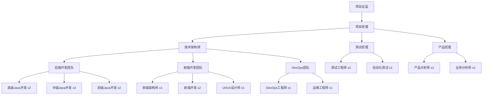
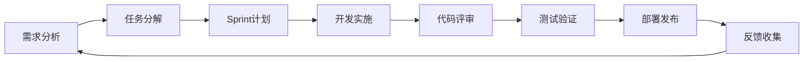

# Junmo Platform 项目管理落地方案

## 📋 项目概述

### 项目基本信息
- **项目名称**: Junmo Platform 企业级智能管理平台
- **项目类型**: 企业级软件开发项目
- **技术栈**: Spring Boot 4.0.1 + Java 25 + 微服务架构
- **项目周期**: 12个月（分3个阶段实施）
- **预算规模**: 根据团队规模和资源配置确定
- **项目目标**: 构建企业级智能管理平台，展示Spring Boot最佳实践

### 项目成功标准
- **技术目标**: 系统可用性99.9%+，响应时间<200ms，支持1000+并发用户
- **业务目标**: 核心功能完整交付，用户满意度>4.5/5，业务效率提升30%+
- **质量目标**: 代码覆盖率>80%，零重大安全漏洞，文档完整度>90%

## 🏗️ 项目组织架构

### 项目团队结构

### 角色职责说明

#### 项目总监
- 项目整体战略规划和资源协调
- 重大决策审批和风险把控
- 与高层管理汇报和沟通

#### 项目经理
- 项目计划制定和执行监控
- 团队协调和资源管理
- 进度跟踪和质量控制
- 风险识别和应对措施

#### 技术架构师
- 技术架构设计和评审
- 技术选型和标准制定
- 代码review和技术指导
- 性能优化和技术难题解决

#### 产品经理
- 需求收集和分析
- 产品规划和功能设计
- 用户体验优化
- 业务价值评估

## 📅 项目实施计划

### 项目阶段划分

#### 第一阶段：基础平台建设 (1-4个月)

**目标**: 搭建基础架构，完成核心功能模块

**主要交付物**:
- 项目基础架构搭建
- 用户权限管理模块
- 基础内容管理功能
- 开发和测试环境部署

**详细计划**:

| 月份 | 主要任务 | 交付成果 | 关键里程碑 |
|------|----------|----------|------------|
| M1 | 项目启动、需求细化、架构设计 | 需求文档、架构设计文档 | 项目启动完成 |
| M2 | 基础架构搭建、用户管理模块 | 开发环境、用户管理功能 | 基础平台完成 |
| M3 | 权限系统、内容管理基础功能 | 权限控制、文档管理 | 核心功能完成 |
| M4 | 系统测试、性能优化、部署上线 | 测试报告、生产环境 | 第一阶段上线 |

#### 第二阶段：功能完善与集成 (5-8个月)

**目标**: 完善业务功能，集成第三方系统

**主要交付物**:
- 业务流程引擎
- 数据分析平台
- 消息通知中心
- 第三方系统集成

**详细计划**:

| 月份 | 主要任务 | 交付成果 | 关键里程碑 |
|------|----------|----------|------------|
| M5 | 流程引擎设计、任务管理模块 | 流程设计器、任务管理 | 流程引擎完成 |
| M6 | 数据分析、报表统计功能 | 数据报表、可视化图表 | 分析平台完成 |
| M7 | 消息中心、通知系统 | 实时通知、邮件服务 | 通知系统完成 |
| M8 | 系统集成、联调测试 | 集成测试报告 | 第二阶段上线 |

#### 第三阶段：优化与扩展 (9-12个月)

**目标**: 性能优化，功能扩展，用户体验提升

**主要交付物**:
- 性能优化和扩展
- 移动端应用
- AI智能功能
- 运维监控体系

**详细计划**:

| 月份 | 主要任务 | 交付成果 | 关键里程碑 |
|------|----------|----------|------------|
| M9 | 性能优化、缓存策略 | 性能测试报告、优化方案 | 性能达标 |
| M10 | 移动端开发、API开放平台 | 移动应用、开放API | 多端支持 |
| M11 | AI功能集成、智能分析 | 智能推荐、预测分析 | AI能力完成 |
| M12 | 运维监控、项目验收 | 监控体系、验收报告 | 项目交付 |

## 🎯 项目管理体系

### 项目管理方法论

#### 敏捷开发模式
- **开发周期**: 2周一个Sprint
- **角色分工**: Product Owner、Scrum Master、开发团队
- **主要活动**: Sprint计划、每日站会、Sprint评审、回顾会议

#### 项目管理流程

### 质量管理体系

#### 代码质量控制
- **代码规范**: 统一编码标准，使用CheckStyle检查
- **代码评审**: 所有代码必须经过同行评审
- **静态分析**: SonarQube代码质量检查
- **单元测试**: 代码覆盖率要求>80%

#### 测试管理
- **测试策略**: 单元测试、集成测试、系统测试、验收测试
- **自动化测试**: Selenium UI自动化、接口自动化测试
- **性能测试**: JMeter压力测试、性能基准测试
- **安全测试**: 代码安全扫描、渗透测试

### 配置管理

#### 版本控制策略
- **代码管理**: Git + GitLab代码托管
- **分支策略**: Git Flow工作流（master/develop/feature/release/hotfix）
- **代码合并**: Merge Request + 代码评审
- **版本发布**: 语义化版本控制（Semantic Versioning）

#### 环境管理
- **开发环境**: 本地开发 + Docker容器
- **测试环境**: 自动化部署 + 数据隔离
- **预生产环境**: 生产环境镜像 + 真实数据
- **生产环境**: 高可用部署 + 监控告警

## ⚠️ 风险管理

### 风险识别矩阵

| 风险类型 | 风险描述 | 发生概率 | 影响程度 | 风险等级 | 应对策略 |
|----------|----------|----------|----------|----------|----------|
| 技术风险 | Spring Boot 4.0.1新技术栈不成熟 | 中 | 高 | 高 | 技术预研、备选方案 |
| 人员风险 | 核心技术人员流失 | 中 | 高 | 高 | 知识文档化、人员备份 |
| 进度风险 | 开发进度延期 | 高 | 中 | 中 | 敏捷开发、快速调整 |
| 需求风险 | 需求变更频繁 | 高 | 中 | 中 | 需求冻结、变更控制 |
| 质量风险 | 系统性能不达标 | 中 | 高 | 高 | 性能测试、持续优化 |
| 安全风险 | 数据安全漏洞 | 低 | 高 | 中 | 安全审计、渗透测试 |

### 风险应对措施

#### 技术风险应对
- **技术预研**: 项目启动前进行技术验证
- **原型开发**: 关键技术点先做原型验证
- **技术培训**: 团队技术能力提升
- **专家咨询**: 引入外部技术专家支持

#### 进度风险应对
- **缓冲时间**: 项目计划预留20%缓冲时间
- **并行开发**: 模块化开发，减少依赖
- **快速交付**: MVP优先，迭代完善
- **资源调配**: 灵活调整人员配置

## 💰 预算管理

### 成本构成分析

#### 人力成本 (占比70%)
- **开发团队**: 8人 × 12个月 × 平均薪资
- **测试团队**: 3人 × 12个月 × 平均薪资
- **项目管理**: 2人 × 12个月 × 平均薪资

#### 基础设施成本 (占比15%)
- **开发环境**: 云服务器、数据库、中间件
- **测试环境**: 独立测试集群
- **生产环境**: 高可用集群部署
- **第三方服务**: 监控、日志、安全服务

#### 软件许可成本 (占比5%)
- **开发工具**: IDE、设计工具、项目管理工具
- **商业组件**: 必要的商业软件许可
- **技术服务**: 技术支持、咨询服务

#### 其他成本 (占比10%)
- **培训成本**: 技术培训、认证考试
- **差旅成本**: 现场支持、用户培训
- **管理费用**: 行政管理、财务成本

### 预算控制措施

#### 成本监控
- **月度预算review**: 每月预算执行情况分析
- **成本预警**: 超支预警机制
- **ROI分析**: 投入产出比评估
- **成本优化**: 持续成本优化措施

## 📊 项目监控与报告

### 关键绩效指标 (KPI)

#### 项目进度指标
- **Sprint完成率**: 计划vs实际完成情况
- **里程碑达成率**: 关键节点按时完成率
- **需求交付率**: 需求按时交付比例
- **缺陷修复率**: 缺陷发现vs修复比例

#### 质量指标
- **代码质量**: SonarQube质量评分
- **测试覆盖率**: 单元测试覆盖率
- **系统可用性**: 系统正常运行时间
- **性能指标**: 响应时间、吞吐量

#### 团队效率指标
- **开发速度**: Story Point完成速度
- **代码提交频率**: 活跃度指标
- **缺陷密度**: 每千行代码缺陷数
- **团队满意度**: 团队成员满意度调查

### 报告机制

#### 日报机制
- **开发团队**: 每日站会、进度更新
- **测试团队**: 测试进度、缺陷状态
- **运维团队**: 系统状态、性能指标

#### 周报机制
- **项目周报**: 整体进度、风险状态
- **质量周报**: 测试结果、质量指标
- **技术周报**: 技术难点、解决方案

#### 月报机制
- **项目月报**: 月度总结、下月计划
- **财务月报**: 预算执行、成本分析
- **管理层报告**: 项目状态、决策建议

## 🚀 项目交付与验收

### 交付标准

#### 功能交付标准
- **功能完整性**: 所有需求功能100%实现
- **功能正确性**: 功能测试通过率>95%
- **用户体验**: 用户满意度>4.5/5
- **文档完整性**: 用户文档、技术文档完整

#### 技术交付标准
- **性能指标**: 响应时间<200ms，并发>1000用户
- **可用性指标**: 系统可用性>99.9%
- **安全指标**: 无高危安全漏洞
- **代码质量**: 代码覆盖率>80%，质量评分>8.0

### 验收流程

#### 验收准备
- **验收计划制定**: 验收范围、标准、时间安排
- **验收环境准备**: 生产环境、测试数据
- **验收团队组建**: 业务方、技术方、第三方专家

#### 验收执行
- **功能验收**: 业务功能验证
- **性能验收**: 性能指标测试
- **安全验收**: 安全漏洞扫描
- **文档验收**: 文档完整性检查

#### 验收结论
- **验收通过**: 项目正式交付
- **条件通过**: 限期整改后交付
- **验收不通过**: 重新开发或项目终止

## 📚 项目总结与知识管理

### 项目总结

#### 技术总结
- **技术选型评估**: 各技术组件使用效果
- **架构设计总结**: 架构优缺点分析
- **性能优化经验**: 性能调优最佳实践
- **问题解决方案**: 技术难题解决过程

#### 管理总结
- **项目管理经验**: 成功经验和失败教训
- **团队管理心得**: 团队建设和管理经验
- **风险管理实践**: 风险识别和应对效果
- **质量管理做法**: 质量控制和保证措施

### 知识沉淀

#### 文档管理
- **技术文档**: 架构设计、接口文档、部署文档
- **业务文档**: 需求文档、用户手册、操作手册
- **管理文档**: 项目计划、会议纪要、决策记录
- **经验文档**: 最佳实践、问题解决、经验分享

#### 知识分享
- **技术分享会**: 定期技术交流和分享
- **培训材料**: 新人培训、技能提升材料
- **案例库**: 典型问题解决案例
- **知识库**: 项目知识管理系统

## 🔄 持续改进

### 改进机制

#### 定期回顾
- **Sprint回顾**: 每个Sprint结束后的回顾会议
- **月度回顾**: 每月项目进展和问题回顾
- **阶段回顾**: 每个阶段结束后的全面回顾
- **项目总结**: 项目完成后的全面总结

#### 改进措施
- **流程优化**: 基于回顾结果优化工作流程
- **工具改进**: 引入更好的开发和管理工具
- **技能提升**: 团队技能培训和能力提升
- **文化建设**: 建立持续改进的团队文化

### 成功要素

#### 关键成功因素
- **明确的目标**: 清晰的项目目标和成功标准
- **合适的团队**: 技能匹配、配合默契的团队
- **有效的沟通**: 及时、准确、全面的沟通机制
- **严格的质量**: 贯穿全流程的质量控制体系
- **灵活的管理**: 适应变化的项目管理方法

#### 最佳实践
- **敏捷开发**: 快速响应变化，持续交付价值
- **DevOps实践**: 开发运维一体化，自动化交付
- **质量第一**: 质量是项目的生命线
- **用户导向**: 以用户需求为中心的设计思维
- **持续学习**: 团队持续学习和能力提升

---

*本项目管理方案将根据项目实际执行情况持续更新和完善，确保项目成功交付。*