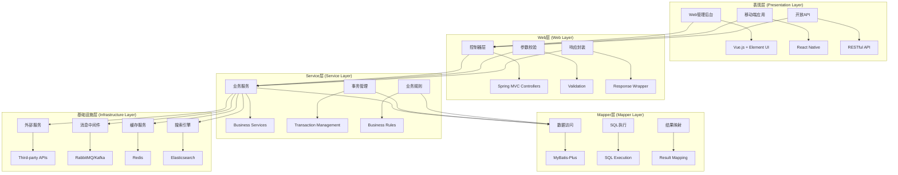
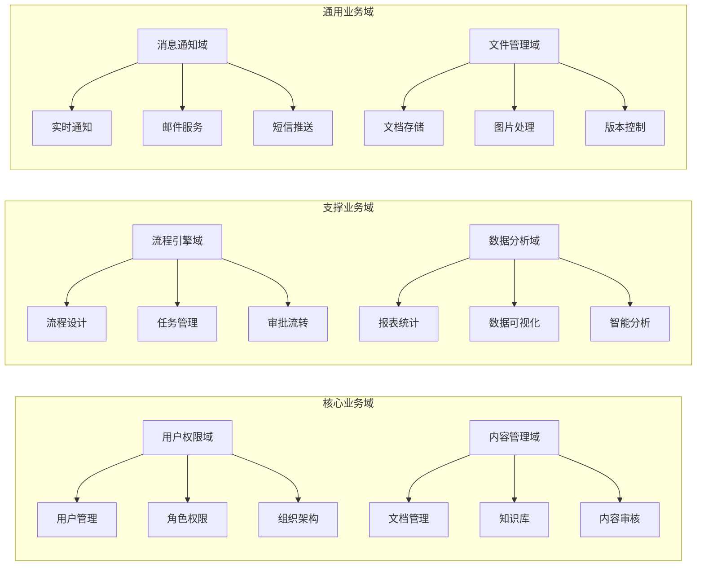
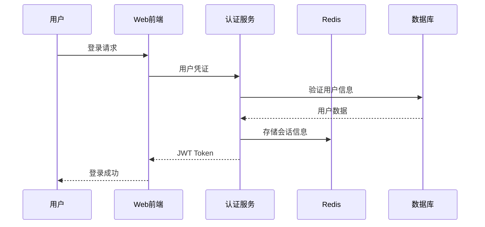
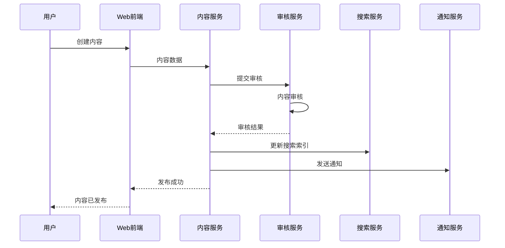
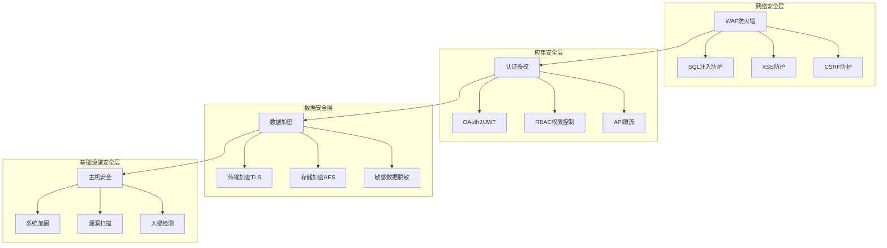
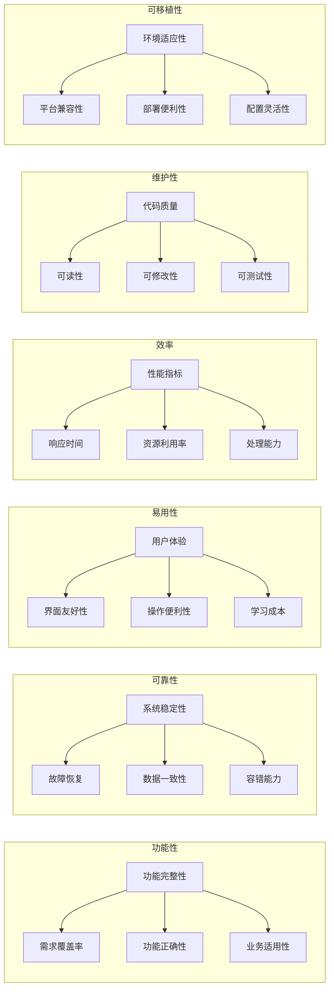

# Spring4demo 总体设计文档

## 📋 文档信息

| 项目 | 内容 |
|------|------|
| **文档名称** | Spring4demo 企业级智能管理平台总体设计 |
| **版本号** | v1.1.0 |
| **创建日期** | 2025-12-24 |
| **更新日期** | 2026-01-07 |
| **作者** | 架构师团队 |
| **审核人** | 技术架构师 |
| **批准人** | 项目总监 |

## 📝 更新说明

**v1.1.0 (2026-01-07)**:
- 架构分层从DDD 7层调整为三层架构（Web层、Service层、Mapper层）
- 数据访问从Spring Data JPA调整为MyBatis-Plus
- 主键策略从AUTO_INCREMENT/UUID调整为雪花算法
- 去掉领域层、聚合根、值对象、领域事件等DDD概念
- 更新架构分层模型，反映实际使用的技术栈

## 🎯 设计目标

### 业务目标
- **数字化转型**: 为企业提供一站式数字化管理解决方案
- **效率提升**: 通过自动化流程提升企业管理效率30%+
- **成本控制**: 降低IT运维成本40%+，减少重复投入
- **创新支持**: 支持业务快速创新和迭代

### 技术目标
- **高性能**: 系统响应时间<200ms，支持1000+并发用户
- **高可用**: 系统可用性99.9%+，故障恢复时间<5分钟
- **可扩展**: 支持水平扩展，可承载10倍业务增长
- **安全性**: 通过安全认证，零重大安全漏洞

### 架构目标
- **模块化**: 高内聚低耦合的模块化设计
- **标准化**: 统一的技术标准和开发规范
- **可维护**: 代码可维护性评分>8.0
- **可演进**: 支持从单体向微服务架构演进

## 🏗️ 系统总体架构

### 架构分层设计

### 核心设计原则

#### 1. 单一职责原则 (SRP)
- **模块职责**: 每个模块只负责一个业务领域
- **类职责**: 每个类只有一个变化的理由
- **方法职责**: 每个方法只完成一个功能

#### 2. 开闭原则 (OCP)
- **对扩展开放**: 通过接口和抽象类支持功能扩展
- **对修改封闭**: 稳定的核心代码不允许随意修改
- **插件机制**: 支持插件化的功能扩展

#### 3. 依赖倒置原则 (DIP)
- **高层不依赖低层**: 通过接口解耦
- **抽象不依赖细节**: 面向接口编程
- **依赖注入**: 使用Spring DI容器管理依赖

#### 4. 接口隔离原则 (ISP)
- **细粒度接口**: 接口职责单一明确
- **客户端特定**: 不强迫客户端依赖不需要的接口
- **接口组合**: 通过接口组合实现复杂功能

## 📊 业务架构设计

### 业务领域划分

### 业务流程设计

#### 用户认证流程

#### 内容发布流程

## 🔧 技术架构决策

### 技术选型原则

#### 1. 成熟度原则
- **技术成熟度**: 选择经过生产环境验证的技术
- **社区活跃度**: 拥有活跃的开源社区支持
- **文档完整性**: 完善的官方文档和社区资源
- **案例丰富性**: 有丰富的成功应用案例

#### 2. 性能原则
- **高并发支持**: 支持高并发访问和处理
- **低延迟要求**: 满足业务响应时间要求
- **高吞吐能力**: 支持大数据量处理
- **资源效率**: 合理的资源使用效率

#### 3. 可维护性原则
- **代码质量**: 代码结构清晰，易于理解和维护
- **调试便利**: 提供完善的调试和监控工具
- **升级兼容**: 版本升级向后兼容
- **故障排查**: 问题定位和排查便利

#### 4. 生态完整性原则
- **技术栈完整**: 形成完整的技术栈解决方案
- **工具链丰富**: 提供丰富的开发和运维工具
- **集成便利**: 各组件之间集成便利
- **扩展性好**: 支持功能扩展和定制

### 核心技术决策

| 技术领域 | 选择方案 | 决策理由 | 备选方案 |
|----------|----------|----------|----------|
| **应用框架** | Spring Boot 4.0.1 | 成熟稳定、生态丰富、社区活跃 | Spring Framework、Micronaut |
| **数据库** | MySQL 8.0 + MongoDB 6.0 | 关系型+文档型组合，满足不同数据需求 | PostgreSQL、MariaDB |
| **缓存** | Redis 7.0 | 高性能、数据结构丰富、持久化支持 | Memcached、Hazelcast |
| **搜索** | Elasticsearch 8.0 | 强大的全文搜索和分析能力 | Solr、Lucene |
| **消息队列** | RabbitMQ 3.12 | 可靠性强、路由灵活、管理便利 | Apache Kafka、ActiveMQ |
| **容器化** | Docker + Docker Compose | 标准化部署、环境一致性 | Podman、Containerd |

## 📈 性能设计

### 性能指标要求

| 性能指标 | 目标值 | 测试条件 | 监控方式 |
|----------|--------|----------|----------|
| **响应时间** | < 200ms | 1000并发用户 | APM工具监控 |
| **吞吐量** | > 5000 TPS | 正常负载 | 压力测试 |
| **并发用户** | > 1000 | 系统稳定运行 | 负载测试 |
| **可用性** | > 99.9% | 7x24小时运行 | 监控告警 |
| **资源利用率** | < 80% | 峰值负载 | 系统监控 |

### 性能优化策略

#### 1. 应用层优化
- **代码优化**: 算法优化、减少不必要的计算
- **缓存策略**: 多级缓存、热点数据缓存
- **异步处理**: 非阻塞IO、异步任务处理
- **连接池**: 数据库连接池、HTTP连接池

#### 2. 数据层优化
- **数据库优化**: 索引优化、查询优化、分库分表
- **缓存优化**: Redis集群、本地缓存、CDN
- **存储优化**: 数据压缩、存储分层、冷热分离

#### 3. 网络层优化
- **负载均衡**: 多实例负载均衡、智能路由
- **CDN加速**: 静态资源CDN、边缘缓存
- **网络优化**: HTTP/2、压缩传输、长连接

## 🔒 安全架构设计

### 安全架构模型

### 安全控制措施

#### 1. 身份认证
- **多因素认证**: 密码+短信/邮箱验证
- **单点登录**: 统一认证中心
- **会话管理**: 安全会话管理、超时控制
- **密码策略**: 强密码策略、定期更换

#### 2. 访问控制
- **最小权限**: 按需授权、最小权限原则
- **权限分离**: 管理权限与操作权限分离
- **动态授权**: 基于角色和资源的动态授权
- **权限审计**: 权限变更审计、定期review

#### 3. 数据保护
- **数据分类**: 敏感数据分类分级
- **加密存储**: 关键数据加密存储
- **传输安全**: HTTPS、VPN安全传输
- **备份安全**: 数据备份加密、异地存储

## 🧪 质量保证设计

### 质量模型

### 质量保证措施

#### 1. 代码质量
- **编码规范**: 统一的编码标准和规范
- **代码评审**: 强制性的代码评审流程
- **静态分析**: SonarQube代码质量检查
- **单元测试**: 代码覆盖率>80%

#### 2. 测试质量
- **测试策略**: 多层次测试策略
- **自动化测试**: 自动化测试覆盖率>90%
- **性能测试**: 定期性能基准测试
- **安全测试**: 定期安全漏洞扫描

#### 3. 过程质量
- **CMMI标准**: 遵循CMMI过程标准
- **敏捷实践**: 敏捷开发最佳实践
- **持续集成**: CI/CD自动化流程
- **质量度量**: 全面的质量度量体系

## 📚 设计约束

### 技术约束
- **技术栈限制**: 必须使用Spring Boot 4.0.1技术栈
- **数据库限制**: 必须使用MySQL作为主数据库
- **部署环境**: 支持Docker容器化部署
- **浏览器兼容**: 支持主流浏览器最新版本

### 业务约束
- **用户规模**: 初期支持1000+并发用户
- **数据量**: 支持TB级数据存储
- **响应时间**: 核心接口响应时间<200ms
- **可用性**: 系统可用性>99.9%

### 合规约束
- **数据保护**: 符合GDPR数据保护要求
- **安全标准**: 符合ISO27001安全标准
- **行业标准**: 遵循相关行业标准
- **法律法规**: 符合相关法律法规要求

## 🔄 演进规划

### 架构演进路线

#### 阶段一：单体架构 (当前)
- **架构特点**: 单体应用、模块化设计
- **适用场景**: 初期快速开发和部署
- **优势**: 开发效率高、部署简单
- **劣势**: 扩展性有限、技术栈受限

#### 阶段二：微服务架构 (1-2年)
- **架构特点**: 服务拆分、独立部署
- **适用场景**: 业务规模扩大、团队增多
- **优势**: 技术栈灵活、独立扩展
- **劣势**: 系统复杂度增加

#### 阶段三：云原生架构 (2-3年)
- **架构特点**: 容器化、微服务、DevOps
- **适用场景**: 大规模生产环境
- **优势**: 高弹性、高可用、自动化
- **劣势**: 技术复杂度高、运维要求高

### 技术演进规划

| 时间阶段 | 技术演进 | 目标收益 |
|----------|----------|----------|
| **0-6个月** | Spring Boot单体架构 | 快速交付、验证技术 |
| **6-12个月** | 模块化重构 | 提升代码质量、为微服务做准备 |
| **12-18个月** | 微服务拆分 | 提升系统可扩展性 |
| **18-24个月** | 云原生改造 | 提升运维效率、降低成本 |

---

*本文档将作为整个项目的技术指导文档，所有后续设计和技术决策都应遵循本文档的总体设计原则。*