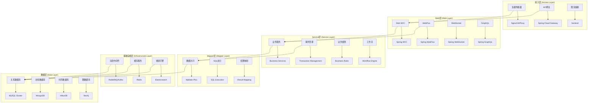
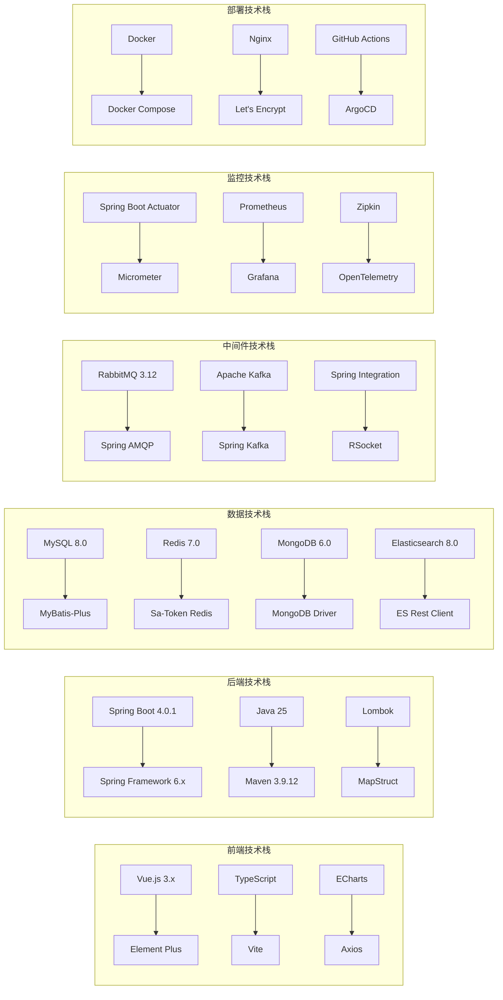
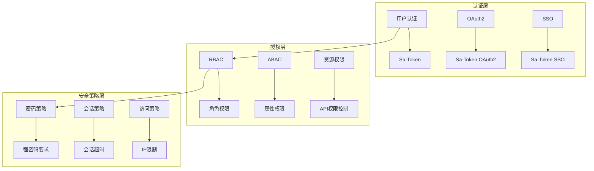
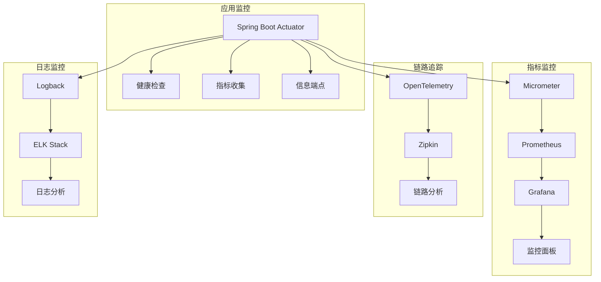
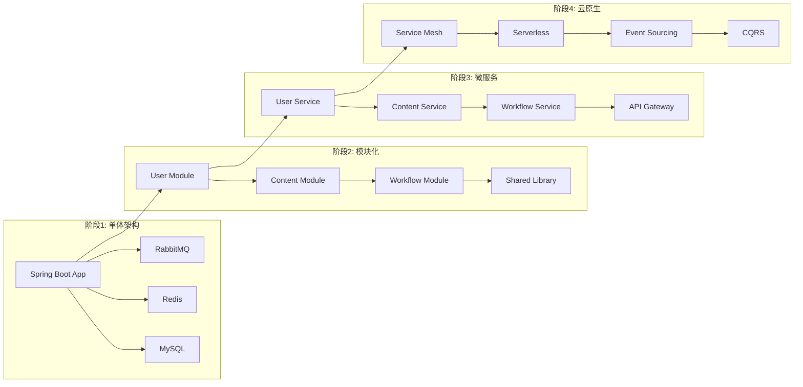

# Spring4demo 技术架构设计文档

## 📋 文档信息

| 项目 | 内容 |
|------|------|
| **文档名称** | Spring4demo 技术架构设计 |
| **版本号** | v1.1.0 |
| **创建日期** | 2025-12-24 |
| **更新日期** | 2026-01-07 |
| **作者** | 技术架构师 |
| **审核人** | 首席架构师 |
| **批准人** | 技术总监 |

## 📝 更新说明

**v1.1.0 (2026-01-07)**:
- 架构分层从DDD 7层调整为三层架构（Web层、Service层、Mapper层）
- 认证框架从Spring Security调整为Sa-Token
- 数据访问从Spring Data JPA调整为MyBatis-Plus
- 主键策略从AUTO_INCREMENT/UUID调整为雪花算法
- 去掉领域层、聚合根、值对象、领域事件等DDD概念
- 去掉限界上下文、领域服务等DDD概念
- 更新技术栈架构图，反映实际使用的技术栈

## 🎯 架构设计原则

### 核心设计理念

#### 1. 分层架构原则
- **关注点分离**: 每层只关注自己的职责
- **依赖方向**: 上层依赖下层，下层不依赖上层
- **接口隔离**: 通过接口定义层间交互
- **松耦合**: 层间通过接口和DTO解耦

#### 2. 模块化设计原则
- **高内聚**: 模块内部功能高度相关
- **低耦合**: 模块间依赖最小化
- **单一职责**: 每个模块只负责一个业务领域
- **开放封闭**: 对扩展开放，对修改封闭

#### 3. 三层架构原则
- **Web层**: 负责接收HTTP请求、参数校验、返回响应
- **Service层**: 负责业务逻辑处理、事务管理、业务规则校验
- **Mapper层**: 负责数据访问、SQL执行、结果映射

## 🏗️ 整体技术架构

### 架构分层模型



### 技术栈架构图



## 🔧 核心架构组件

### 1. 接入层架构

#### 负载均衡设计
```yaml
# 负载均衡配置
load_balancer:
  type: "nginx"
  algorithm: "round_robin"
  health_check:
    path: "/actuator/health"
    interval: "30s"
    timeout: "5s"
    retries: 3
  upstream:
    servers:
      - host: "app-server-1"
        port: 8080
        weight: 1
      - host: "app-server-2"
        port: 8080
        weight: 1
```

#### API网关设计
```java
@Configuration
public class GatewayConfig {
    
    @Bean
    public RouteLocator customRouteLocator(RouteLocatorBuilder builder) {
        return builder.routes()
            .route("user-service", r -> r.path("/api/users/**")
                .uri("lb://user-service"))
            .route("content-service", r -> r.path("/api/content/**")
                .uri("lb://content-service"))
            .route("workflow-service", r -> r.path("/api/workflow/**")
                .uri("lb://workflow-service"))
            .build();
    }
}
```

#### 限流熔断设计
```java
@Configuration
public class SentinelConfig {
    
    @Bean
    public SentinelResourceAspect sentinelResourceAspect() {
        return new SentinelResourceAspect();
    }
    
    @PostConstruct
    public void initFlowRules() {
        List<FlowRule> rules = new ArrayList<>();
        FlowRule rule = new FlowRule();
        rule.setResource("getUserInfo");
        rule.setGrade(RuleConstant.FLOW_GRADE_QPS);
        rule.setCount(100);
        rules.add(rule);
        FlowRuleManager.loadRules(rules);
    }
}
```

### 2. 应用层架构

#### MVC架构设计
```java
@RestController
@RequestMapping("/api/users")
public class UserController {
    
    @Autowired
    private UserService userService;
    
    @GetMapping("/{id}")
    public ResponseEntity<UserDTO> getUser(@PathVariable Long id) {
        UserDTO user = userService.getUserById(id);
        return ResponseEntity.ok(user);
    }
    
    @PostMapping
    public ResponseEntity<UserDTO> createUser(@Valid @RequestBody CreateUserRequest request) {
        UserDTO user = userService.createUser(request);
        return ResponseEntity.status(HttpStatus.CREATED).body(user);
    }
}
```

#### WebFlux响应式设计
```java
@RestController
@RequestMapping("/api/reactive")
public class ReactiveUserController {
    
    @Autowired
    private ReactiveUserService userService;
    
    @GetMapping("/users/{id}")
    public Mono<UserDTO> getUser(@PathVariable Long id) {
        return userService.getUserById(id);
    }
    
    @GetMapping("/users")
    public Flux<UserDTO> getAllUsers() {
        return userService.getAllUsers();
    }
}
```

#### WebSocket实时通信
```java
@Configuration
@EnableWebSocket
public class WebSocketConfig implements WebSocketConfigurer {
    
    @Override
    public void registerWebSocketHandlers(WebSocketHandlerRegistry registry) {
        registry.addHandler(new NotificationWebSocketHandler(), "/ws/notifications")
                .setAllowedOrigins("*");
    }
}

@Component
public class NotificationWebSocketHandler extends TextWebSocketHandler {
    
    @Override
    public void afterConnectionEstablished(WebSocketSession session) {
        // 连接建立后的处理逻辑
    }
    
    @Override
    protected void handleTextMessage(WebSocketSession session, TextMessage message) {
        // 消息处理逻辑
    }
}
```

### 3. Service层架构

#### 业务服务设计
```java
@Service
@Transactional
public class UserServiceImpl implements UserService {

    @Autowired
    private UserMapper userMapper;

    @Autowired
    private PasswordEncoder passwordEncoder;

    @Override
    public UserDTO createUser(CreateUserRequest request) {
        // 1. 验证业务规则
        validateUserRequest(request);

        // 2. 检查用户名唯一性
        if (userMapper.existsByUsername(request.getUsername())) {
            throw new UserAlreadyExistsException("Username already exists");
        }

        // 3. 检查邮箱唯一性
        if (userMapper.existsByEmail(request.getEmail())) {
            throw new UserAlreadyExistsException("Email already exists");
        }

        // 4. 密码加密
        String encodedPassword = passwordEncoder.encode(request.getPassword());

        // 5. 创建用户实体
        User user = new User();
        user.setUsername(request.getUsername());
        user.setEmail(request.getEmail());
        user.setPassword(encodedPassword);
        user.setStatus(UserStatus.ACTIVE);
        user.setCreateTime(LocalDateTime.now());
        user.setUpdateTime(LocalDateTime.now());

        // 6. 保存到数据库
        userMapper.insert(user);

        // 7. 返回DTO
        return UserMapper.toDTO(user);
    }

    @Override
    public UserDTO getUserById(Long id) {
        User user = userMapper.selectById(id);
        if (user == null) {
            throw new UserNotFoundException("User not found");
        }
        return UserMapper.toDTO(user);
    }

    @Override
    public void updateUser(Long id, UpdateUserRequest request) {
        User user = userMapper.selectById(id);
        if (user == null) {
            throw new UserNotFoundException("User not found");
        }

        // 更新用户信息
        if (request.getEmail() != null) {
            user.setEmail(request.getEmail());
        }
        if (request.getPassword() != null) {
            user.setPassword(passwordEncoder.encode(request.getPassword()));
        }
        user.setUpdateTime(LocalDateTime.now());

        userMapper.updateById(user);
    }

    @Override
    public void deleteUser(Long id) {
        User user = userMapper.selectById(id);
        if (user == null) {
            throw new UserNotFoundException("User not found");
        }
        userMapper.deleteById(id);
    }
}
```

#### 事务管理设计
```java
@Service
public class OrderServiceImpl implements OrderService {

    @Autowired
    private OrderMapper orderMapper;

    @Autowired
    private OrderItemMapper orderItemMapper;

    @Autowired
    private ProductMapper productMapper;

    @Override
    @Transactional(rollbackFor = Exception.class)
    public OrderDTO createOrder(CreateOrderRequest request) {
        // 1. 创建订单
        Order order = new Order();
        order.setOrderNo(generateOrderNo());
        order.setUserId(request.getUserId());
        order.setStatus(OrderStatus.PENDING);
        order.setTotalAmount(request.getTotalAmount());
        order.setCreateTime(LocalDateTime.now());
        order.setUpdateTime(LocalDateTime.now());

        orderMapper.insert(order);

        // 2. 创建订单项
        for (CreateOrderItemRequest itemRequest : request.getItems()) {
            OrderItem item = new OrderItem();
            item.setOrderId(order.getId());
            item.setProductId(itemRequest.getProductId());
            item.setQuantity(itemRequest.getQuantity());
            item.setPrice(itemRequest.getPrice());
            item.setCreateTime(LocalDateTime.now());

            orderItemMapper.insert(item);

            // 3. 扣减库存
            Product product = productMapper.selectById(itemRequest.getProductId());
            if (product.getStock() < itemRequest.getQuantity()) {
                throw new InsufficientStockException("Insufficient stock");
            }
            product.setStock(product.getStock() - itemRequest.getQuantity());
            product.setUpdateTime(LocalDateTime.now());
            productMapper.updateById(product);
        }

        return OrderMapper.toDTO(order);
    }
}
```

### 4. Mapper层架构

#### 数据访问设计
```java
@Mapper
public interface UserMapper extends BaseMapper<User> {

    /**
     * 根据用户名查询用户
     */
    @Select("SELECT * FROM users WHERE username = #{username} AND deleted = 0")
    User findByUsername(@Param("username") String username);

    /**
     * 根据邮箱查询用户
     */
    @Select("SELECT * FROM users WHERE email = #{email} AND deleted = 0")
    User findByEmail(@Param("email") String email);

    /**
     * 检查用户名是否存在
     */
    @Select("SELECT COUNT(1) FROM users WHERE username = #{username} AND deleted = 0")
    boolean existsByUsername(@Param("username") String username);

    /**
     * 检查邮箱是否存在
     */
    @Select("SELECT COUNT(1) FROM users WHERE email = #{email} AND deleted = 0")
    boolean existsByEmail(@Param("email") String email);

    /**
     * 根据角色查询用户列表
     */
    @Select("SELECT u.* FROM users u " +
            "JOIN user_roles ur ON u.id = ur.user_id " +
            "JOIN roles r ON ur.role_id = r.id " +
            "WHERE r.name = #{roleName} AND u.deleted = 0")
    List<User> findByRole(@Param("roleName") String roleName);

    /**
     * 分页查询用户列表
     */
    IPage<User> selectUserPage(Page<User> page, @Param("username") String username, @Param("status") UserStatus status);
}
```

#### 实体类设计
```java
@Data
@TableName("users")
public class User {

    /**
     * 主键ID（雪花算法）
     */
    @TableId(type = IdType.ASSIGN_ID)
    private Long id;

    /**
     * 用户名
     */
    @TableField("username")
    private String username;

    /**
     * 邮箱
     */
    @TableField("email")
    private String email;

    /**
     * 密码（加密后）
     */
    @TableField("password")
    private String password;

    /**
     * 用户状态
     */
    @TableField("status")
    private UserStatus status;

    /**
     * 创建时间
     */
    @TableField("create_time")
    private LocalDateTime createTime;

    /**
     * 更新时间
     */
    @TableField("update_time")
    private LocalDateTime updateTime;

    /**
     * 删除标记（0：未删除，1：已删除）
     */
    @TableField("deleted")
    @TableLogic
    private Integer deleted;
}
```

#### DTO映射设计
```java
@Mapper(componentModel = "spring")
public interface UserMapper {

    /**
     * 实体转DTO
     */
    @Mapping(target = "roles", ignore = true)
    UserDTO toDTO(User user);

    /**
     * DTO转实体
     */
    @Mapping(target = "id", ignore = true)
    @Mapping(target = "createTime", ignore = true)
    @Mapping(target = "updateTime", ignore = true)
    @Mapping(target = "deleted", ignore = true)
    User toEntity(UserDTO userDTO);

    /**
     * 实体列表转DTO列表
     */
    List<UserDTO> toDTOList(List<User> users);
}
```

#### 缓存设计
```java
@Service
@CacheConfig(cacheNames = "users")
public class UserCacheService {
    
    @Autowired
    private UserRepository userRepository;
    
    @Cacheable(key = "#id")
    public User getUserById(Long id) {
        return userRepository.findById(id).orElse(null);
    }
    
    @CachePut(key = "#user.id")
    public User updateUser(User user) {
        return userRepository.save(user);
    }
    
    @CacheEvict(key = "#id")
    public void deleteUser(Long id) {
        userRepository.deleteById(id);
    }
}
```

#### 消息队列设计
```java
@Component
public class MessageProducer {
    
    @Autowired
    private RabbitTemplate rabbitTemplate;
    
    public void sendUserCreatedMessage(Long userId) {
        UserCreatedMessage message = new UserCreatedMessage(userId);
        rabbitTemplate.convertAndSend("user.exchange", "user.created", message);
    }
    
    public void sendNotificationMessage(NotificationMessage message) {
        rabbitTemplate.convertAndSend("notification.exchange", "notification.send", message);
    }
}

@Component
public class MessageConsumer {
    
    @RabbitListener(queues = "user.created.queue")
    public void handleUserCreated(UserCreatedMessage message) {
        // 处理用户创建事件
        log.info("User created: {}", message.getUserId());
    }
    
    @RabbitListener(queues = "notification.queue")
    public void handleNotification(NotificationMessage message) {
        // 处理通知消息
        log.info("Notification: {}", message.getContent());
    }
}
```

## 🔒 安全架构设计

### 认证授权架构



### 安全配置实现

```java
@Configuration
public class SaTokenConfig {
    
    @Bean
    public SaTokenDao saTokenDao() {
        // 使用 Redis 存储 Token
        return new SaTokenDaoRedisImpl();
    }
    
    @Bean
    public StpInterface stpInterface() {
        return new StpInterfaceImpl();
    }
}

@Component
public class StpInterfaceImpl implements StpInterface {
    
    @Autowired
    private UserMapper userMapper;
    
    @Override
    public List<String> getPermissionList(Object loginId, String loginType) {
        // 返回此 loginId 拥有的权限列表
        User user = userMapper.selectById((Long) loginId);
        return user.getPermissions();
    }
    
    @Override
    public List<String> getRoleList(Object loginId, String loginType) {
        // 返回此 loginId 拥有的角色码列表
        User user = userMapper.selectById((Long) loginId);
        return user.getRoles();
    }
}
```

## 📊 监控架构设计

### 监控体系架构



### 监控配置实现

```java
@Configuration
public class MonitoringConfig {
    
    @Bean
    public MeterRegistryCustomizer<MeterRegistry> metricsCommonTags() {
        return registry -> registry.config().commonTags(
            "application", "spring4demo",
            "region", System.getenv().getOrDefault("REGION", "local")
        );
    }
    
    @Bean
    public TimedAspect timedAspect(MeterRegistry registry) {
        return new TimedAspect(registry);
    }
    
    @Bean
    public CountedAspect countedAspect(MeterRegistry registry) {
        return new CountedAspect(registry);
    }
}
```

## 🚀 性能架构设计

### 性能优化策略

#### 1. 缓存架构
```java
@Configuration
@EnableCaching
public class CacheConfig {
    
    @Bean
    public CacheManager cacheManager() {
        RedisCacheManager.Builder builder = RedisCacheManager
            .RedisCacheManagerBuilder
            .fromConnectionFactory(redisConnectionFactory())
            .cacheDefaults(cacheConfiguration());
        
        return builder.build();
    }
    
    private RedisCacheConfiguration cacheConfiguration() {
        return RedisCacheConfiguration.defaultCacheConfig()
            .entryTtl(Duration.ofMinutes(30))
            .serializeKeysWith(RedisSerializationContext.SerializationPair
                .fromSerializer(new StringRedisSerializer()))
            .serializeValuesWith(RedisSerializationContext.SerializationPair
                .fromSerializer(new GenericJackson2JsonRedisSerializer()));
    }
}
```

#### 2. 连接池配置
```yaml
spring:
  datasource:
    hikari:
      maximum-pool-size: 20
      minimum-idle: 5
      idle-timeout: 300000
      max-lifetime: 1200000
      connection-timeout: 20000
      leak-detection-threshold: 60000
      
  redis:
    lettuce:
      pool:
        max-active: 8
        max-idle: 8
        min-idle: 0
        max-wait: -1ms
```

#### 3. 异步处理
```java
@Configuration
@EnableAsync
public class AsyncConfig {
    
    @Bean(name = "taskExecutor")
    public Executor taskExecutor() {
        ThreadPoolTaskExecutor executor = new ThreadPoolTaskExecutor();
        executor.setCorePoolSize(5);
        executor.setMaxPoolSize(10);
        executor.setQueueCapacity(25);
        executor.setThreadNamePrefix("Async-");
        executor.initialize();
        return executor;
    }
}

@Service
public class AsyncService {
    
    @Async("taskExecutor")
    public CompletableFuture<String> asyncMethod() {
        // 异步处理逻辑
        return CompletableFuture.completedFuture("Result");
    }
}
```

## 🔄 架构演进设计

### 微服务演进路径



### 架构决策记录 (ADR)

#### ADR-001: 选择Spring Boot作为应用框架
**状态**: 已接受  
**决策**: 使用Spring Boot 4.0.1作为主要应用框架  
**理由**: 
- 成熟的生态系统和丰富的功能
- 简化配置和快速开发能力
- 与现有技术栈兼容性好
- 社区活跃，文档完善

**后果**:
- 正面: 开发效率高，学习成本低
- 负面: 框架较重，启动时间较长
- 风险: 版本升级可能带来兼容性问题

#### ADR-002: 选择MySQL作为主数据库
**状态**: 已接受  
**决策**: 使用MySQL 8.0作为主数据库  
**理由**:
- 关系型数据模型适合业务需求
- 事务支持完善，数据一致性强
- 运维工具丰富，社区支持好
- 与MyBatis-Plus集成良好，SQL控制灵活

**后果**:
- 正面: 数据一致性强，运维成熟，SQL可控性强
- 负面: 扩展性相对有限
- 风险: 大数据量场景性能瓶颈

---

*本文档为技术架构的核心指导文档，所有技术实现都应遵循本文档的架构设计原则。*