# Spring4demo 技术架构设计文档

## 📋 文档信息

| 项目 | 内容 |
|------|------|
| **文档名称** | Spring4demo 技术架构设计 |
| **版本号** | v1.1.0 |
| **创建日期** | 2025-12-24 |
| **更新日期** | 2026-01-07 |
| **作者** | 技术架构师 |
| **审核人** | 首席架构师 |
| **批准人** | 技术总监 |

## 📝 更新说明

**v1.2.0 (2026-01-07)**:
- 架构定位从微服务架构调整为单体Spring Boot应用
- 去掉微服务组件：Spring Cloud Gateway、Nacos、Sentinel、RSocket、RocketMQ
- 接入层简化为Nginx负载均衡器
- 限流方案从Sentinel调整为Guava限流
- 消息队列使用Spring Stream接入RabbitMQ和Kafka
- 保留MongoDB、Elasticsearch、Neo4j、InfluxDB等数据存储
- 更新架构分层模型，去掉微服务相关组件
- 更新技术栈架构图，反映单体应用架构

**v1.1.0 (2026-01-07)**:
- 架构分层从DDD 7层调整为三层架构（Web层、Service层、Mapper层）
- 认证框架从Spring Security调整为Sa-Token
- 数据访问从Spring Data JPA调整为MyBatis-Plus
- 主键策略从AUTO_INCREMENT/UUID调整为雪花算法
- 去掉领域层、聚合根、值对象、领域事件等DDD概念
- 去掉限界上下文、领域服务等DDD概念
- 更新技术栈架构图，反映实际使用的技术栈

## 🎯 架构设计原则

### 核心设计理念

#### 1. 分层架构原则
- **关注点分离**: 每层只关注自己的职责
- **依赖方向**: 上层依赖下层，下层不依赖上层
- **接口隔离**: 通过接口定义层间交互
- **松耦合**: 层间通过接口和DTO解耦

#### 2. 模块化设计原则
- **高内聚**: 模块内部功能高度相关
- **低耦合**: 模块间依赖最小化
- **单一职责**: 每个模块只负责一个业务领域
- **开放封闭**: 对扩展开放，对修改封闭

#### 3. 三层架构原则
- **Web层**: 负责接收HTTP请求、参数校验、返回响应
- **Service层**: 负责业务逻辑处理、事务管理、业务规则校验
- **Mapper层**: 负责数据访问、SQL执行、结果映射

## 🏗️ 整体技术架构

### 架构分层模型

```mermaid
graph TB
    subgraph "接入层 (Access Layer)"
        A1[负载均衡器] --> A2[Nginx]
    end

    subgraph "Web层 (Web Layer)"
        B1[Web MVC] --> B2[Spring MVC]
        B3[WebFlux] --> B4[Spring WebFlux]
        B5[WebSocket] --> B6[Spring WebSocket]
        B7[GraphQL] --> B8[Spring GraphQL]
    end

    subgraph "Service层 (Service Layer)"
        C1[业务服务] --> C2[Business Services]
        C3[事务管理] --> C4[Transaction Management]
        C5[业务规则] --> C6[Business Rules]
        C7[工作流] --> C8[Workflow Engine]
    end

    subgraph "Mapper层 (Mapper Layer)"
        D1[数据访问] --> D2[MyBatis-Plus]
        D3[SQL执行] --> D4[SQL Execution]
        D5[结果映射] --> D6[Result Mapping]
    end

    subgraph "基础设施层 (Infrastructure Layer)"
        E1[消息中间件] --> E2[Spring Stream]
        E3[缓存服务] --> E4[Redis]
        E5[搜索引擎] --> E6[Elasticsearch]
    end

    subgraph "数据层 (Data Layer)"
        F1[关系数据库] --> F2[MySQL]
        F3[文档数据库] --> F4[MongoDB]
        F5[时序数据库] --> F6[InfluxDB]
        F7[图数据库] --> F8[Neo4j]
    end

    A1 --> B1
    B1 --> C1
    B3 --> C1
    C1 --> D1
    C3 --> D1
    D1 --> F1
    E1 --> F1
    E3 --> F1
    E5 --> F1
```



### 技术栈架构图

```mermaid
graph LR
    subgraph "前端技术栈"
        A1[Vue.js 3.x] --> A2[Element Plus]
        A3[TypeScript] --> A4[Vite]
        A5[ECharts] --> A6[Axios]
    end

    subgraph "后端技术栈"
        B1[Spring Boot 4.0.1] --> B2[Spring Framework 6.x]
        B3[Java 25] --> B4[Maven 3.9.12]
        B5[Lombok] --> B6[MapStruct]
    end

    subgraph "数据技术栈"
        C1[MySQL 8.0] --> C2[MyBatis-Plus]
        C3[Redis 7.0] --> C4[Sa-Token Redis]
        C5[MongoDB 6.0] --> C6[MongoDB Driver]
        C7[Elasticsearch 8.0] --> C8[ES Rest Client]
        C9[Neo4j 5.12] --> C10[Neo4j Driver]
        C11[InfluxDB 2.7] --> C12[InfluxDB Client]
    end

    subgraph "中间件技术栈"
        D1[Spring Stream] --> D2[RabbitMQ 3.12]
        D1 --> D3[Apache Kafka 3.6]
    end

    subgraph "监控技术栈"
        E1[Spring Boot Actuator] --> E2[Micrometer]
        E3[Prometheus] --> E4[Grafana]
        E5[Zipkin] --> E6[OpenTelemetry]
    end

    subgraph "部署技术栈"
        F1[Docker] --> F2[Docker Compose]
        F3[Nginx] --> F4[Let's Encrypt]
        F5[GitHub Actions] --> F6[ArgoCD]
    end
```



## 🔧 核心架构组件

### 1. 接入层架构

#### 负载均衡设计
```yaml
# 负载均衡配置
load_balancer:
  type: "nginx"
  algorithm: "round_robin"
  health_check:
    path: "/actuator/health"
    interval: "30s"
    timeout: "5s"
    retries: 3
  upstream:
    servers:
      - host: "app-server-1"
        port: 8080
        weight: 1
      - host: "app-server-2"
        port: 8080
        weight: 1
```

#### 限流设计（Guava）
```java
@Configuration
public class RateLimiterConfig {

    @Bean
    public LoadingCache<String, RateLimiter> rateLimiterCache() {
        return Caffeine.newBuilder()
                .maximumSize(1000)
                .expireAfterWrite(1, TimeUnit.HOURS)
                .build(key -> RateLimiter.create(100)); // 每秒100个请求
    }

    @Bean
    public RateLimiterAspect rateLimiterAspect() {
        return new RateLimiterAspect();
    }
}

@Aspect
@Component
@Slf4j
public class RateLimiterAspect {

    @Autowired
    private LoadingCache<String, RateLimiter> rateLimiterCache;

    @Around("@annotation(rateLimit)")
    public Object around(ProceedingJoinPoint joinPoint, RateLimit rateLimit) throws Throwable {
        String key = rateLimit.key();
        RateLimiter rateLimiter = rateLimiterCache.get(key);

        if (!rateLimiter.tryAcquire()) {
            log.warn("限流触发: key={}, permits={}", key, rateLimit.permits());
            throw new RateLimitException("请求过于频繁，请稍后重试");
        }

        return joinPoint.proceed();
    }
}
```

### 2. 应用层架构

#### MVC架构设计
```java
@RestController
@RequestMapping("/api/users")
public class UserController {
    
    @Autowired
    private UserService userService;
    
    @GetMapping("/{id}")
    public ResponseEntity<UserDTO> getUser(@PathVariable Long id) {
        UserDTO user = userService.getUserById(id);
        return ResponseEntity.ok(user);
    }
    
    @PostMapping
    public ResponseEntity<UserDTO> createUser(@Valid @RequestBody CreateUserRequest request) {
        UserDTO user = userService.createUser(request);
        return ResponseEntity.status(HttpStatus.CREATED).body(user);
    }
}
```

#### WebFlux响应式设计
```java
@RestController
@RequestMapping("/api/reactive")
public class ReactiveUserController {
    
    @Autowired
    private ReactiveUserService userService;
    
    @GetMapping("/users/{id}")
    public Mono<UserDTO> getUser(@PathVariable Long id) {
        return userService.getUserById(id);
    }
    
    @GetMapping("/users")
    public Flux<UserDTO> getAllUsers() {
        return userService.getAllUsers();
    }
}
```

#### WebSocket实时通信
```java
@Configuration
@EnableWebSocket
public class WebSocketConfig implements WebSocketConfigurer {
    
    @Override
    public void registerWebSocketHandlers(WebSocketHandlerRegistry registry) {
        registry.addHandler(new NotificationWebSocketHandler(), "/ws/notifications")
                .setAllowedOrigins("*");
    }
}

@Component
public class NotificationWebSocketHandler extends TextWebSocketHandler {
    
    @Override
    public void afterConnectionEstablished(WebSocketSession session) {
        // 连接建立后的处理逻辑
    }
    
    @Override
    protected void handleTextMessage(WebSocketSession session, TextMessage message) {
        // 消息处理逻辑
    }
}
```

### 3. Service层架构

#### 业务服务设计
```java
@Service
@Transactional
public class UserServiceImpl implements UserService {

    @Autowired
    private UserMapper userMapper;

    @Autowired
    private PasswordEncoder passwordEncoder;

    @Override
    public UserDTO createUser(CreateUserRequest request) {
        // 1. 验证业务规则
        validateUserRequest(request);

        // 2. 检查用户名唯一性
        if (userMapper.existsByUsername(request.getUsername())) {
            throw new UserAlreadyExistsException("Username already exists");
        }

        // 3. 检查邮箱唯一性
        if (userMapper.existsByEmail(request.getEmail())) {
            throw new UserAlreadyExistsException("Email already exists");
        }

        // 4. 密码加密
        String encodedPassword = passwordEncoder.encode(request.getPassword());

        // 5. 创建用户实体
        User user = new User();
        user.setUsername(request.getUsername());
        user.setEmail(request.getEmail());
        user.setPassword(encodedPassword);
        user.setStatus(UserStatus.ACTIVE);
        user.setCreateTime(LocalDateTime.now());
        user.setUpdateTime(LocalDateTime.now());

        // 6. 保存到数据库
        userMapper.insert(user);

        // 7. 返回DTO
        return UserMapper.toDTO(user);
    }

    @Override
    public UserDTO getUserById(Long id) {
        User user = userMapper.selectById(id);
        if (user == null) {
            throw new UserNotFoundException("User not found");
        }
        return UserMapper.toDTO(user);
    }

    @Override
    public void updateUser(Long id, UpdateUserRequest request) {
        User user = userMapper.selectById(id);
        if (user == null) {
            throw new UserNotFoundException("User not found");
        }

        // 更新用户信息
        if (request.getEmail() != null) {
            user.setEmail(request.getEmail());
        }
        if (request.getPassword() != null) {
            user.setPassword(passwordEncoder.encode(request.getPassword()));
        }
        user.setUpdateTime(LocalDateTime.now());

        userMapper.updateById(user);
    }

    @Override
    public void deleteUser(Long id) {
        User user = userMapper.selectById(id);
        if (user == null) {
            throw new UserNotFoundException("User not found");
        }
        userMapper.deleteById(id);
    }
}
```

#### 事务管理设计
```java
@Service
public class OrderServiceImpl implements OrderService {

    @Autowired
    private OrderMapper orderMapper;

    @Autowired
    private OrderItemMapper orderItemMapper;

    @Autowired
    private ProductMapper productMapper;

    @Override
    @Transactional(rollbackFor = Exception.class)
    public OrderDTO createOrder(CreateOrderRequest request) {
        // 1. 创建订单
        Order order = new Order();
        order.setOrderNo(generateOrderNo());
        order.setUserId(request.getUserId());
        order.setStatus(OrderStatus.PENDING);
        order.setTotalAmount(request.getTotalAmount());
        order.setCreateTime(LocalDateTime.now());
        order.setUpdateTime(LocalDateTime.now());

        orderMapper.insert(order);

        // 2. 创建订单项
        for (CreateOrderItemRequest itemRequest : request.getItems()) {
            OrderItem item = new OrderItem();
            item.setOrderId(order.getId());
            item.setProductId(itemRequest.getProductId());
            item.setQuantity(itemRequest.getQuantity());
            item.setPrice(itemRequest.getPrice());
            item.setCreateTime(LocalDateTime.now());

            orderItemMapper.insert(item);

            // 3. 扣减库存
            Product product = productMapper.selectById(itemRequest.getProductId());
            if (product.getStock() < itemRequest.getQuantity()) {
                throw new InsufficientStockException("Insufficient stock");
            }
            product.setStock(product.getStock() - itemRequest.getQuantity());
            product.setUpdateTime(LocalDateTime.now());
            productMapper.updateById(product);
        }

        return OrderMapper.toDTO(order);
    }
}
```

### 4. Mapper层架构

#### 数据访问设计
```java
@Mapper
public interface UserMapper extends BaseMapper<User> {

    /**
     * 根据用户名查询用户
     */
    @Select("SELECT * FROM users WHERE username = #{username} AND deleted = 0")
    User findByUsername(@Param("username") String username);

    /**
     * 根据邮箱查询用户
     */
    @Select("SELECT * FROM users WHERE email = #{email} AND deleted = 0")
    User findByEmail(@Param("email") String email);

    /**
     * 检查用户名是否存在
     */
    @Select("SELECT COUNT(1) FROM users WHERE username = #{username} AND deleted = 0")
    boolean existsByUsername(@Param("username") String username);

    /**
     * 检查邮箱是否存在
     */
    @Select("SELECT COUNT(1) FROM users WHERE email = #{email} AND deleted = 0")
    boolean existsByEmail(@Param("email") String email);

    /**
     * 根据角色查询用户列表
     */
    @Select("SELECT u.* FROM users u " +
            "JOIN user_roles ur ON u.id = ur.user_id " +
            "JOIN roles r ON ur.role_id = r.id " +
            "WHERE r.name = #{roleName} AND u.deleted = 0")
    List<User> findByRole(@Param("roleName") String roleName);

    /**
     * 分页查询用户列表
     */
    IPage<User> selectUserPage(Page<User> page, @Param("username") String username, @Param("status") UserStatus status);
}
```

#### 实体类设计
```java
@Data
@TableName("users")
public class User {

    /**
     * 主键ID（雪花算法）
     */
    @TableId(type = IdType.ASSIGN_ID)
    private Long id;

    /**
     * 用户名
     */
    @TableField("username")
    private String username;

    /**
     * 邮箱
     */
    @TableField("email")
    private String email;

    /**
     * 密码（加密后）
     */
    @TableField("password")
    private String password;

    /**
     * 用户状态
     */
    @TableField("status")
    private UserStatus status;

    /**
     * 创建时间
     */
    @TableField("create_time")
    private LocalDateTime createTime;

    /**
     * 更新时间
     */
    @TableField("update_time")
    private LocalDateTime updateTime;

    /**
     * 删除标记（0：未删除，1：已删除）
     */
    @TableField("deleted")
    @TableLogic
    private Integer deleted;
}
```

#### DTO映射设计
```java
@Mapper(componentModel = "spring")
public interface UserMapper {

    /**
     * 实体转DTO
     */
    @Mapping(target = "roles", ignore = true)
    UserDTO toDTO(User user);

    /**
     * DTO转实体
     */
    @Mapping(target = "id", ignore = true)
    @Mapping(target = "createTime", ignore = true)
    @Mapping(target = "updateTime", ignore = true)
    @Mapping(target = "deleted", ignore = true)
    User toEntity(UserDTO userDTO);

    /**
     * 实体列表转DTO列表
     */
    List<UserDTO> toDTOList(List<User> users);
}
```

#### 缓存设计
```java
@Service
@CacheConfig(cacheNames = "users")
public class UserCacheService {
    
    @Autowired
    private UserRepository userRepository;
    
    @Cacheable(key = "#id")
    public User getUserById(Long id) {
        return userRepository.findById(id).orElse(null);
    }
    
    @CachePut(key = "#user.id")
    public User updateUser(User user) {
        return userRepository.save(user);
    }
    
    @CacheEvict(key = "#id")
    public void deleteUser(Long id) {
        userRepository.deleteById(id);
    }
}
```

#### 消息队列设计（Spring Stream）
```java
// Spring Stream配置
@Configuration
public class StreamConfig {

    @Bean
    public Function<UserMessage, UserMessage> userProcessor() {
        return message -> {
            log.info("处理用户消息: {}", message);
            // 处理逻辑
            return message;
        };
    }
}

// 消息生产者
@Component
@Slf4j
public class MessageProducer {

    @Autowired
    private StreamBridge streamBridge;

    /**
     * 发送用户创建消息到RabbitMQ
     */
    public void sendUserCreatedMessage(Long userId) {
        UserCreatedMessage message = new UserCreatedMessage(userId);
        streamBridge.send("userCreated-out-0", message);
        log.info("发送用户创建消息: {}", message);
    }

    /**
     * 发送用户创建消息到Kafka
     */
    public void sendUserCreatedMessageToKafka(Long userId) {
        UserCreatedMessage message = new UserCreatedMessage(userId);
        streamBridge.send("userCreatedKafka-out-0", message);
        log.info("发送用户创建消息到Kafka: {}", message);
    }

    /**
     * 发送通知消息
     */
    public void sendNotificationMessage(NotificationMessage message) {
        streamBridge.send("notification-out-0", message);
        log.info("发送通知消息: {}", message);
    }
}

// 消息消费者
@Component
@Slf4j
public class MessageConsumer {

    /**
     * 消费RabbitMQ用户创建消息
     */
    @Bean
    public Consumer<UserCreatedMessage> userCreated() {
        return message -> {
            log.info("消费用户创建消息: {}", message);
            // 处理用户创建事件
            handleUserCreated(message);
        };
    }

    /**
     * 消费Kafka用户创建消息
     */
    @Bean
    public Consumer<UserCreatedMessage> userCreatedKafka() {
        return message -> {
            log.info("消费Kafka用户创建消息: {}", message);
            // 处理用户创建事件
            handleUserCreated(message);
        };
    }

    /**
     * 消费通知消息
     */
    @Bean
    public Consumer<NotificationMessage> notification() {
        return message -> {
            log.info("消费通知消息: {}", message);
            // 处理通知消息
            handleNotification(message);
        };
    }

    private void handleUserCreated(UserCreatedMessage message) {
        // 处理用户创建事件逻辑
    }

    private void handleNotification(NotificationMessage message) {
        // 处理通知消息逻辑
    }
}
```

## 🔒 安全架构设计

### 认证授权架构



### 安全配置实现

```java
@Configuration
public class SaTokenConfig {
    
    @Bean
    public SaTokenDao saTokenDao() {
        // 使用 Redis 存储 Token
        return new SaTokenDaoRedisImpl();
    }
    
    @Bean
    public StpInterface stpInterface() {
        return new StpInterfaceImpl();
    }
}

@Component
public class StpInterfaceImpl implements StpInterface {
    
    @Autowired
    private UserMapper userMapper;
    
    @Override
    public List<String> getPermissionList(Object loginId, String loginType) {
        // 返回此 loginId 拥有的权限列表
        User user = userMapper.selectById((Long) loginId);
        return user.getPermissions();
    }
    
    @Override
    public List<String> getRoleList(Object loginId, String loginType) {
        // 返回此 loginId 拥有的角色码列表
        User user = userMapper.selectById((Long) loginId);
        return user.getRoles();
    }
}
```

## 📊 监控架构设计

### 监控体系架构



### 监控配置实现

```java
@Configuration
public class MonitoringConfig {
    
    @Bean
    public MeterRegistryCustomizer<MeterRegistry> metricsCommonTags() {
        return registry -> registry.config().commonTags(
            "application", "spring4demo",
            "region", System.getenv().getOrDefault("REGION", "local")
        );
    }
    
    @Bean
    public TimedAspect timedAspect(MeterRegistry registry) {
        return new TimedAspect(registry);
    }
    
    @Bean
    public CountedAspect countedAspect(MeterRegistry registry) {
        return new CountedAspect(registry);
    }
}
```

## 🚀 性能架构设计

### 性能优化策略

#### 1. 缓存架构
```java
@Configuration
@EnableCaching
public class CacheConfig {
    
    @Bean
    public CacheManager cacheManager() {
        RedisCacheManager.Builder builder = RedisCacheManager
            .RedisCacheManagerBuilder
            .fromConnectionFactory(redisConnectionFactory())
            .cacheDefaults(cacheConfiguration());
        
        return builder.build();
    }
    
    private RedisCacheConfiguration cacheConfiguration() {
        return RedisCacheConfiguration.defaultCacheConfig()
            .entryTtl(Duration.ofMinutes(30))
            .serializeKeysWith(RedisSerializationContext.SerializationPair
                .fromSerializer(new StringRedisSerializer()))
            .serializeValuesWith(RedisSerializationContext.SerializationPair
                .fromSerializer(new GenericJackson2JsonRedisSerializer()));
    }
}
```

#### 2. 连接池配置
```yaml
spring:
  datasource:
    hikari:
      maximum-pool-size: 20
      minimum-idle: 5
      idle-timeout: 300000
      max-lifetime: 1200000
      connection-timeout: 20000
      leak-detection-threshold: 60000
      
  redis:
    lettuce:
      pool:
        max-active: 8
        max-idle: 8
        min-idle: 0
        max-wait: -1ms
```

#### 3. 异步处理
```java
@Configuration
@EnableAsync
public class AsyncConfig {
    
    @Bean(name = "taskExecutor")
    public Executor taskExecutor() {
        ThreadPoolTaskExecutor executor = new ThreadPoolTaskExecutor();
        executor.setCorePoolSize(5);
        executor.setMaxPoolSize(10);
        executor.setQueueCapacity(25);
        executor.setThreadNamePrefix("Async-");
        executor.initialize();
        return executor;
    }
}

@Service
public class AsyncService {
    
    @Async("taskExecutor")
    public CompletableFuture<String> asyncMethod() {
        // 异步处理逻辑
        return CompletableFuture.completedFuture("Result");
    }
}
```

## 🔄 架构演进设计

### 单体应用优化路径

```mermaid
graph LR
    subgraph "阶段1: 基础单体架构"
        A1[Spring Boot App] --> A2[MySQL]
        A1 --> A3[Redis]
        A1 --> A4[基础监控]
    end

    subgraph "阶段2: 功能增强"
        B1[Spring Boot App] --> B2[消息队列]
        B1 --> B3[搜索引擎]
        B1 --> B4[分布式缓存]
        B1 --> B5[限流保护]
    end

    subgraph "阶段3: 性能优化"
        C1[Spring Boot App] --> C2[读写分离]
        C1 --> C3[数据库分库分表]
        C1 --> C4[缓存优化]
        C1 --> C5[异步处理]
    end

    subgraph "阶段4: 模块化重构"
        D1[模块化单体] --> D2[清晰的模块边界]
        D2 --> D3[独立部署准备]
        D3 --> D4[可拆分为微服务]
    end

    A1 --> B1
    B1 --> C1
    C1 --> D1
```



### 架构决策记录 (ADR)

#### ADR-001: 选择单体Spring Boot架构
**状态**: 已接受
**决策**: 使用单体Spring Boot应用架构，而非微服务架构
**理由**:
- 当前业务规模适合单体架构
- 开发团队规模较小，单体架构更易维护
- 降低系统复杂度和运维成本
- 快速迭代和部署更便捷

**后果**:
- 正面: 开发效率高，部署简单，调试方便
- 负面: 扩展性受限，技术栈统一性要求高
- 风险: 随着业务增长可能需要重构为微服务

#### ADR-002: 选择Spring Boot作为应用框架
**状态**: 已接受
**决策**: 使用Spring Boot 4.0.1作为主要应用框架
**理由**:
- 成熟的生态系统和丰富的功能
- 简化配置和快速开发能力
- 与现有技术栈兼容性好
- 社区活跃，文档完善

**后果**:
- 正面: 开发效率高，学习成本低
- 负面: 框架较重，启动时间较长
- 风险: 版本升级可能带来兼容性问题

#### ADR-003: 选择MySQL作为主数据库
**状态**: 已接受
**决策**: 使用MySQL 8.0作为主数据库
**理由**:
- 关系型数据模型适合业务需求
- 事务支持完善，数据一致性强
- 运维工具丰富，社区支持好
- 与MyBatis-Plus集成良好，SQL控制灵活

**后果**:
- 正面: 数据一致性强，运维成熟，SQL可控性强
- 负面: 扩展性相对有限
- 风险: 大数据量场景性能瓶颈

#### ADR-004: 使用Guava限流替代Sentinel
**状态**: 已接受
**决策**: 使用Guava RateLimiter进行限流，而非Sentinel
**理由**:
- 单体应用不需要分布式限流
- Guava轻量级，集成简单
- 性能开销小，适合单体应用场景
- 避免引入不必要的微服务组件依赖

**后果**:
- 正面: 轻量级、高性能、易集成
- 负面: 不支持分布式限流，功能相对简单
- 风险: 随着应用扩展可能需要升级到分布式限流方案

#### ADR-005: 使用Spring Stream接入消息队列
**状态**: 已接受
**决策**: 使用Spring Cloud Stream统一接入RabbitMQ和Kafka
**理由**:
- 统一的消息编程模型
- 支持多种消息中间件切换
- 与Spring生态集成良好
- 简化消息队列的开发和维护

**后果**:
- 正面: 统一API、灵活性高、易扩展
- 负面: 增加一层抽象，学习成本稍高
- 风险: 特定消息中间件的高级特性可能受限
---

*本文档为技术架构的核心指导文档，所有技术实现都应遵循本文档的架构设计原则。*