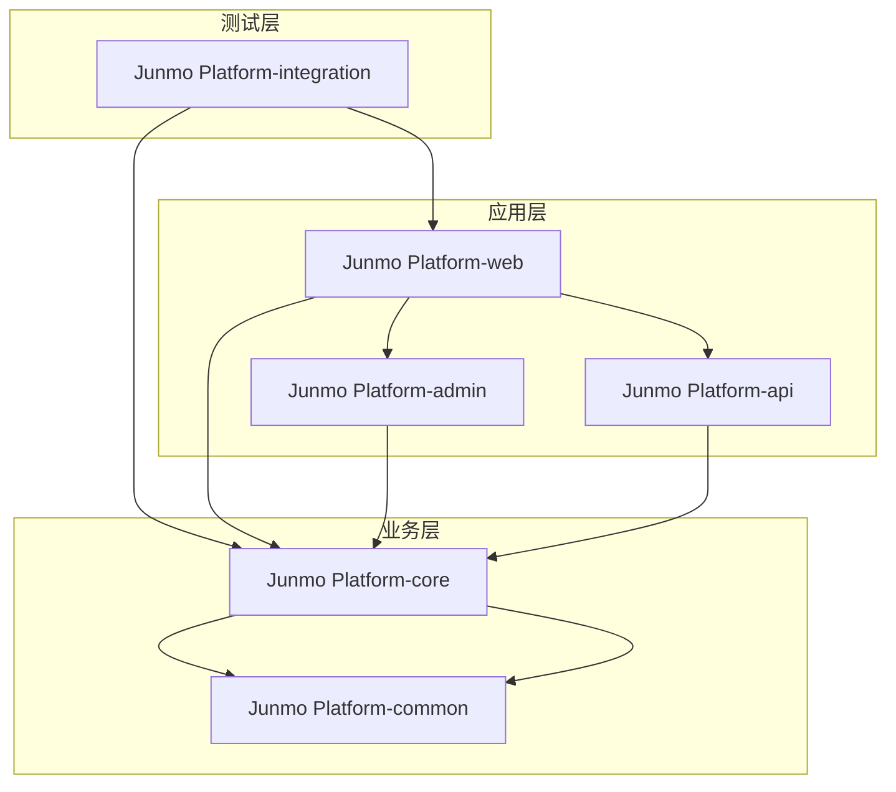

# Junmo Platform 项目结构设计文档

## 📋 文档基本信息

| 项目名称 | Junmo Platform 企业级智能管理平台 |
|---------|------------------------------|
| **文档名称** | Junmo Platform 项目结构设计 |
| **版本号** | v1.1.0 |
| **创建日期** | 2025-12-24 |
| **更新日期** | 2026-01-07 |
| **作者** | 架构师团队 |
| **审核人** | 技术架构师 |
| **批准人** | 项目经理 |

## 📝 更新说明

**v1.1.0 (2026-01-07)**:
- 项目结构从DDD架构调整为三层架构（Web层、Service层、Mapper层）
- 去掉domain层中的DDD概念（聚合根、值对象、领域事件等）
- 更新core模块结构，采用entity、service、mapper三层结构
- 数据访问从Spring Data JPA调整为MyBatis-Plus
- 主键策略从AUTO_INCREMENT/UUID调整为雪花算法

## 🎯 设计原则

### 项目结构原则

#### 1. 分层原则
- **清晰的层次结构**: 按照业务和技术分层组织代码
- **依赖方向明确**: 上层依赖下层，避免循环依赖
- **职责分离**: 每层只关注自己的职责
- **接口隔离**: 通过接口定义层间交互

#### 2. 模块化原则
- **业务模块化**: 按业务领域划分模块
- **技术模块化**: 按技术能力划分模块
- **高内聚**: 模块内部功能高度相关
- **低耦合**: 模块间依赖最小化

#### 3. 标准化原则
- **命名规范**: 统一的包名和类名规范
- **目录结构**: 标准化的目录组织方式
- **配置管理**: 统一的配置文件管理
- **文档规范**: 标准化的文档格式

## 📁 整体项目结构

### Maven多模块结构

```
Junmo Platform/
├── pom.xml                                    # 父POM文件
├── README.md                                  # 项目说明文档
├── .gitignore                                 # Git忽略文件
├── .gitattributes                             # Git属性文件
├── docs/                                      # 项目文档目录
│   ├── api/                                   # API文档
│   ├── design/                                # 设计文档
│   └── deployment/                            # 部署文档
├── scripts/                                   # 脚本文件目录
│   ├── build/                                 # 构建脚本
│   ├── deploy/                                # 部署脚本
│   └── database/                              # 数据库脚本
├── docker/                                    # Docker相关文件
│   ├── Dockerfile                             # 应用镜像
│   ├── docker-compose.yml                     # 开发环境
│   └── docker-compose.prod.yml                # 生产环境
├── Junmo Platform-common/                        # 公共模块
│   ├── pom.xml
│   └── src/main/java/com/kev1n/Junmo Platform/common/
├── Junmo Platform-core/                          # 核心业务模块
│   ├── pom.xml
│   └── src/
│       ├── main/
│       │   ├── java/com/kev1n/Junmo Platform/core/
│       │   └── resources/
│       └── test/
├── Junmo Platform-web/                           # Web应用模块
│   ├── pom.xml
│   └── src/
│       ├── main/
│       │   ├── java/com/kev1n/Junmo Platform/web/
│       │   └── resources/
│       └── test/
├── Junmo Platform-api/                           # API接口模块
│   ├── pom.xml
│   └── src/main/java/com/kev1n/Junmo Platform/api/
├── Junmo Platform-integration/                   # 集成测试模块
│   ├── pom.xml
│   └── src/test/java/com/kev1n/Junmo Platform/integration/
└── Junmo Platform-admin/                         # 管理后台模块
    ├── pom.xml
    └── src/
        ├── main/
        │   ├── java/com/kev1n/Junmo Platform/admin/
        │   └── resources/
        └── test/
```

## 🏗️ 核心模块详细结构

### 1. Junmo Platform-common 公共模块

#### 目录结构
```
Junmo Platform-common/
├── pom.xml
└── src/main/java/com/kev1n/Junmo Platform/common/
    ├── annotation/                            # 自定义注解
    │   ├── RequirePermission.java
    │   ├── LogOperation.java
    │   └── CacheEvict.java
    ├── aspect/                                # 切面编程
    │   ├── LoggingAspect.java
    │   ├── PermissionAspect.java
    │   └── CacheAspect.java
    ├── config/                                # 公共配置
    │   ├── RedisConfig.java
    │   ├── JacksonConfig.java
    │   └── SwaggerConfig.java
    ├── constant/                              # 常量定义
    │   ├── ErrorCode.java
    │   ├── BusinessConstant.java
    │   └── SystemConstant.java
    ├── dto/                                   # 数据传输对象
    │   ├── request/                           # 请求DTO
    │   │   ├── BaseRequest.java
    │   │   ├── PageRequest.java
    │   │   └── IdRequest.java
    │   ├── response/                          # 响应DTO
    │   │   ├── BaseResponse.java
    │   │   ├── PageResponse.java
    │   │   └── Result.java
    │   └── query/                             # 查询DTO
    │       ├── BaseQuery.java
    │       └── PageQuery.java
    ├── enums/                                 # 枚举定义
    │   ├── StatusEnum.java
    │   ├── ErrorCode.java                     # 错误码枚举
    │   └── BusinessEnum.java
    ├── exception/                             # 异常定义
    │   ├── BaseException.java                 # 基础异常类
    │   ├── BusinessException.java             # 业务异常
    │   ├── AuthException.java                 # 认证异常基类
    │   │   ├── NotLoginException.java         # 未登录异常
    │   │   ├── NotPermissionException.java    # 无权限异常
    │   │   └── TokenInvalidException.java     # Token无效异常
    │   ├── SystemException.java               # 系统异常
    │   └── ValidationException.java           # 参数校验异常
    ├── handler/                               # 处理器
    │   ├── GlobalExceptionHandler.java        # 全局异常处理器
    │   ├── AsyncExceptionHandler.java         # 异步异常处理器
    │   └── ValidationExceptionHandler.java    # 校验异常处理器
    ├── interceptor/                           # 拦截器
    │   ├── AuthInterceptor.java
    │   ├── LoggingInterceptor.java
    │   └── RateLimitInterceptor.java
    ├── mapper/                                # 映射器
    │   ├── BaseMapper.java
    │   └── EntityMapper.java
    ├── service/                               # 公共服务
    │   ├── CacheService.java
    │   ├── MessageService.java
    │   └── FileService.java
    ├── util/                                  # 工具类
    │   ├── DateUtil.java
    │   ├── StringUtil.java
    │   ├── JsonUtil.java
    │   ├── EncryptUtil.java
    │   └── ValidationUtil.java
    └── validator/                             # 验证器
        ├── BaseValidator.java
        ├── EmailValidator.java
        └── PhoneValidator.java
```

### 2. Junmo Platform-core 核心业务模块

#### 目录结构
```
Junmo Platform-core/
├── pom.xml
└── src/
    ├── main/
    │   ├── java/com/kev1n/Junmo Platform/core/
    │   │   ├── entity/                        # 实体层
    │   │   │   ├── user/                      # 用户实体
    │   │   │   │   ├── User.java
    │   │   │   │   ├── Role.java
    │   │   │   │   └── Permission.java
    │   │   │   ├── content/                   # 内容实体
    │   │   │   │   ├── Document.java
    │   │   │   │   ├── Category.java
    │   │   │   │   └── Tag.java
    │   │   │   ├── workflow/                  # 工作流实体
    │   │   │   │   ├── Process.java
    │   │   │   │   ├── Task.java
    │   │   │   │   └── ProcessDefinition.java
    │   │   │   └── system/                    # 系统实体
    │   │   │       ├── SystemConfig.java
    │   │   │       └── OperationLog.java
    │   │   ├── mapper/                        # 数据访问层
    │   │   │   ├── user/
    │   │   │   │   ├── UserMapper.java
    │   │   │   │   ├── RoleMapper.java
    │   │   │   │   └── PermissionMapper.java
    │   │   │   ├── content/
    │   │   │   │   ├── DocumentMapper.java
    │   │   │   │   ├── CategoryMapper.java
    │   │   │   │   └── TagMapper.java
    │   │   │   ├── workflow/
    │   │   │   │   ├── ProcessMapper.java
    │   │   │   │   ├── TaskMapper.java
    │   │   │   │   └── ProcessDefinitionMapper.java
    │   │   │   └── system/
    │   │   │       ├── SystemConfigMapper.java
    │   │   │       └── OperationLogMapper.java
    │   │   ├── service/                       # 业务逻辑层
    │   │   │   ├── user/
    │   │   │   │   ├── UserService.java
    │   │   │   │   ├── RoleService.java
    │   │   │   │   ├── PermissionService.java
    │   │   │   │   └── impl/
    │   │   │   │       ├── UserServiceImpl.java
    │   │   │   │       ├── RoleServiceImpl.java
    │   │   │   │       └── PermissionServiceImpl.java
    │   │   │   ├── content/
    │   │   │   │   ├── DocumentService.java
    │   │   │   │   ├── CategoryService.java
    │   │   │   │   ├── TagService.java
    │   │   │   │   └── impl/
    │   │   │   │       ├── DocumentServiceImpl.java
    │   │   │   │       ├── CategoryServiceImpl.java
    │   │   │   │       └── TagServiceImpl.java
    │   │   │   ├── workflow/
    │   │   │   │   ├── ProcessService.java
    │   │   │   │   ├── TaskService.java
    │   │   │   │   ├── ProcessDefinitionService.java
    │   │   │   │   └── impl/
    │   │   │   │       ├── ProcessServiceImpl.java
    │   │   │   │       ├── TaskServiceImpl.java
    │   │   │   │       └── ProcessDefinitionServiceImpl.java
    │   │   │   └── system/
    │   │   │       ├── SystemConfigService.java
    │   │   │       ├── OperationLogService.java
    │   │   │       └── impl/
    │   │   │           ├── SystemConfigServiceImpl.java
    │   │   │           └── OperationLogServiceImpl.java
    │   │   ├── dto/                           # 数据传输对象
    │   │   │   ├── user/
    │   │   │   │   ├── UserDTO.java
    │   │   │   │   ├── RoleDTO.java
    │   │   │   │   └── PermissionDTO.java
    │   │   │   ├── content/
    │   │   │   │   ├── DocumentDTO.java
    │   │   │   │   ├── CategoryDTO.java
    │   │   │   │   └── TagDTO.java
    │   │   │   └── workflow/
    │   │   │       ├── ProcessDTO.java
    │   │   │       ├── TaskDTO.java
    │   │   │       └── ProcessDefinitionDTO.java
    │   │   ├── vo/                            # 视图对象
    │   │   │   ├── user/
    │   │   │   │   ├── UserVO.java
    │   │   │   │   └── UserRoleVO.java
    │   │   │   └── content/
    │   │   │       ├── DocumentVO.java
    │   │   │       └── DocumentDetailVO.java
    │   │   ├── enums/                         # 枚举定义
    │   │   │   ├── UserStatus.java
    │   │   │   ├── DocumentStatus.java
    │   │   │   ├── ProcessStatus.java
    │   │   │   └── TaskStatus.java
    │   │   ├── constant/                      # 常量定义
    │   │   │   ├── RedisKeyConstant.java
    │   │   │   └── CacheConstant.java
    │   │   ├── config/                        # 配置类
    │   │   │   ├── MyBatisPlusConfig.java
    │   │   │   └── SnowflakeConfig.java
    │   │   └── util/                          # 工具类
    │   │       ├── SnowflakeIdWorker.java
    │   │       └── BeanCopyUtil.java
    │   └── resources/
    │       ├── application.yml                 # 应用配置
    │       ├── application-dev.yml             # 开发环境配置
    │       ├── application-test.yml            # 测试环境配置
    │       ├── application-prod.yml            # 生产环境配置
    │       └── mapper/                        # MyBatis Mapper XML
    │           ├── user/
    │           │   ├── UserMapper.xml
    │           │   ├── RoleMapper.xml
    │           │   └── PermissionMapper.xml
    │           ├── content/
    │           │   ├── DocumentMapper.xml
    │           │   ├── CategoryMapper.xml
    │           │   └── TagMapper.xml
    │           └── workflow/
    │               ├── ProcessMapper.xml
    │               ├── TaskMapper.xml
    │               └── ProcessDefinitionMapper.xml
    └── test/
        └── java/com/kev1n/Junmo Platform/core/
            ├── entity/                         # 实体层测试
            │   ├── user/
            │   │   ├── UserTest.java
            │   │   ├── RoleTest.java
            │   │   └── PermissionTest.java
            │   ├── content/
            │   │   ├── DocumentTest.java
            │   │   └── CategoryTest.java
            │   └── workflow/
            │       ├── ProcessTest.java
            │       └── TaskTest.java
            ├── service/                        # 业务层测试
            │   ├── user/
            │   │   ├── UserServiceTest.java
            │   │   ├── RoleServiceTest.java
            │   │   └── PermissionServiceTest.java
            │   ├── content/
            │   │   ├── DocumentServiceTest.java
            │   │   ├── CategoryServiceTest.java
            │   │   └── TagServiceTest.java
            │   └── workflow/
            │       ├── ProcessServiceTest.java
            │       ├── TaskServiceTest.java
            │       └── ProcessDefinitionServiceTest.java
            └── mapper/                         # 数据访问层测试
                ├── user/
                │   ├── UserMapperTest.java
                │   ├── RoleMapperTest.java
                │   └── PermissionMapperTest.java
                ├── content/
                │   ├── DocumentMapperTest.java
                │   └── CategoryMapperTest.java
                └── workflow/
                    ├── ProcessMapperTest.java
                    └── TaskMapperTest.java
```

### 3. Junmo Platform-web Web应用模块

#### 目录结构
```
Junmo Platform-web/
├── pom.xml
└── src/
    ├── main/
    │   ├── java/com/kev1n/Junmo Platform/web/
    │   │   ├── Junmo PlatformWebApplication.java  # 应用启动类
    │   │   ├── config/                         # Web配置
    │   │   │   ├── WebMvcConfig.java
    │   │   │   ├── WebFluxConfig.java
    │   │   │   ├── WebSocketConfig.java
    │   │   │   └── SecurityConfig.java
    │   │   ├── controller/                     # 控制器
    │   │   │   ├── user/
    │   │   │   │   ├── UserController.java
    │   │   │   │   ├── RoleController.java
    │   │   │   │   └── PermissionController.java
    │   │   │   ├── content/
    │   │   │   │   ├── DocumentController.java
    │   │   │   │   ├── CategoryController.java
    │   │   │   │   └── TagController.java
    │   │   │   ├── workflow/
    │   │   │   │   ├── ProcessController.java
    │   │   │   │   ├── TaskController.java
    │   │   │   │   └── ProcessDefinitionController.java
    │   │   │   └── system/
    │   │   │       ├── HealthController.java
    │   │   │       ├── InfoController.java
    │   │   │       └── MetricsController.java
    │   │   ├── rest/                           # REST控制器
    │   │   │   ├── UserRestController.java
    │   │   │   ├── ContentRestController.java
    │   │   │   └── WorkflowRestController.java
    │   │   ├── graphql/                        # GraphQL控制器
    │   │   │   ├── UserResolver.java
    │   │   │   ├── ContentResolver.java
    │   │   │   └── WorkflowResolver.java
    │   │   ├── websocket/                      # WebSocket控制器
    │   │   │   ├── NotificationWebSocketHandler.java
    │   │   │   ├── ChatWebSocketHandler.java
    │   │   │   └── ProgressWebSocketHandler.java
    │   │   ├── filter/                         # 过滤器
    │   │   │   ├── AuthenticationFilter.java
    │   │   │   ├── LoggingFilter.java
    │   │   │   ├── CorsFilter.java
    │   │   │   └── RateLimitFilter.java
    │   │   ├── interceptor/                    # 拦截器
    │   │   │   ├── AuthInterceptor.java
    │   │   │   ├── LoggingInterceptor.java
    │   │   │   └── LocaleInterceptor.java
    │   │   ├── resolver/                       # 参数解析器
    │   │   │   ├── PageableArgumentResolver.java
    │   │   │   ├── CurrentUserArgumentResolver.java
    │   │   │   └── JsonArgumentResolver.java
    │   │   ├── handler/                        # 处理器
    │   │   │   ├── GlobalExceptionHandler.java    # 全局异常处理器
    │   │   │   ├── ValidationExceptionHandler.java # 校验异常处理器
    │   │   │   └── AsyncExceptionHandler.java      # 异步异常处理器
    │   │   ├── advice/                         # 通知
    │   │   │   ├── ValidationAdvice.java
    │   │   │   └── LoggingAdvice.java
    │   │   └── dto/                           # Web层DTO
    │   │       ├── request/
    │   │       │   ├── user/
    │   │       │   │   ├── CreateUserRequest.java
    │   │       │   │   ├── UpdateUserRequest.java
    │   │       │   │   └── UserQueryRequest.java
    │   │       │   ├── content/
    │   │       │   │   ├── CreateDocumentRequest.java
    │   │       │   │   ├── UpdateDocumentRequest.java
    │   │       │   │   └── DocumentQueryRequest.java
    │   │       │   └── workflow/
    │   │       │       ├── StartProcessRequest.java
    │   │       │       ├── CompleteTaskRequest.java
    │   │       │       └── ProcessQueryRequest.java
    │   │       └── response/
    │   │           ├── user/
    │   │           │   ├── UserResponse.java
    │   │           │   ├── UserListResponse.java
    │   │           │   └── UserProfileResponse.java
    │   │           ├── content/
    │   │           │   ├── DocumentResponse.java
    │   │           │   ├── DocumentListResponse.java
    │   │           │   └── CategoryResponse.java
    │   │           └── workflow/
    │   │               ├── ProcessResponse.java
    │   │               ├── TaskResponse.java
    │   │               └── ProcessInstanceResponse.java
    │   └── resources/
    │       ├── application.yml                 # 应用配置
    │       ├── application-web.yml             # Web模块配置
    │       ├── static/                         # 静态资源
    │       │   ├── css/
    │       │   ├── js/
    │       │   ├── images/
    │       │   └── fonts/
    │       ├── templates/                      # 模板文件
    │       │   ├── index.html
    │       │   ├── error/
    │       │   └── email/
    │       └── banner.txt                      # 启动横幅
    └── test/
        └── java/com/kev1n/Junmo Platform/web/
            ├── controller/                     # 控制器测试
            │   ├── UserControllerTest.java
            │   ├── DocumentControllerTest.java
            │   └── ProcessControllerTest.java
            ├── integration/                    # 集成测试
            │   ├── UserIntegrationTest.java
            │   ├── ContentIntegrationTest.java
            │   └── WorkflowIntegrationTest.java
            └── testutil/                       # 测试工具
                ├── TestDataBuilder.java
                ├── MockDataBuilder.java
                └── IntegrationTestBase.java
```

## 📦 模块依赖关系

### Maven依赖管理

#### 父POM配置
```xml
<?xml version="1.0" encoding="UTF-8"?>
<project xmlns="http://maven.apache.org/POM/4.0.0"
         xmlns:xsi="http://www.w3.org/2001/XMLSchema-instance"
         xsi:schemaLocation="http://maven.apache.org/POM/4.0.0 
         http://maven.apache.org/xsd/maven-4.0.0.xsd">
    <modelVersion>4.0.0</modelVersion>
    
    <groupId>com.junmo</groupId>
    <artifactId>Junmo Platform</artifactId>
    <version>1.0.0-SNAPSHOT</version>
    <packaging>pom</packaging>
    
    <name>Junmo Platform</name>
    <description>Junmo Platform Enterprise Management Platform</description>
    
    <properties>
        <java.version>25</java.version>
        <spring-boot.version>4.0.1</spring-boot.version>
        <spring-cloud.version>2023.0.0</spring-cloud.version>
        <maven.compiler.source>25</maven.compiler.source>
        <maven.compiler.target>25</maven.compiler.target>
        <project.build.sourceEncoding>UTF-8</project.build.sourceEncoding>
    </properties>
    
    <modules>
        <module>Junmo Platform-common</module>
        <module>Junmo Platform-core</module>
        <module>Junmo Platform-web</module>
        <module>Junmo Platform-api</module>
        <module>Junmo Platform-integration</module>
        <module>Junmo Platform-admin</module>
    </modules>
    
    <dependencyManagement>
        <dependencies>
            <!-- Spring Boot BOM -->
            <dependency>
                <groupId>org.springframework.boot</groupId>
                <artifactId>spring-boot-dependencies</artifactId>
                <version>${spring-boot.version}</version>
                <type>pom</type>
                <scope>import</scope>
            </dependency>
            
            <!-- Spring Cloud BOM -->
            <dependency>
                <groupId>org.springframework.cloud</groupId>
                <artifactId>spring-cloud-dependencies</artifactId>
                <version>${spring-cloud.version}</version>
                <type>pom</type>
                <scope>import</scope>
            </dependency>
            
            <!-- Project Modules -->
            <dependency>
                <groupId>com.junmo</groupId>
                <artifactId>Junmo Platform-common</artifactId>
                <version>${project.version}</version>
            </dependency>
            <dependency>
                <groupId>com.junmo</groupId>
                <artifactId>Junmo Platform-core</artifactId>
                <version>${project.version}</version>
            </dependency>
            <dependency>
                <groupId>com.junmo</groupId>
                <artifactId>Junmo Platform-api</artifactId>
                <version>${project.version}</version>
            </dependency>
        </dependencies>
    </dependencyManagement>
    
    <build>
        <pluginManagement>
            <plugins>
                <plugin>
                    <groupId>org.springframework.boot</groupId>
                    <artifactId>spring-boot-maven-plugin</artifactId>
                    <version>${spring-boot.version}</version>
                </plugin>
                <plugin>
                    <groupId>org.apache.maven.plugins</groupId>
                    <artifactId>maven-compiler-plugin</artifactId>
                    <version>3.11.0</version>
                    <configuration>
                        <source>${java.version}</source>
                        <target>${java.version}</target>
                        <encoding>UTF-8</encoding>
                    </configuration>
                </plugin>
            </plugins>
        </pluginManagement>
    </build>
</project>
```

#### 模块依赖关系图



## 🔧 配置管理

### 配置文件结构

```
src/main/resources/
├── application.yml                           # 主配置文件
├── application-dev.yml                       # 开发环境配置
├── application-test.yml                      # 测试环境配置
├── application-prod.yml                      # 生产环境配置
├── application-local.yml                     # 本地环境配置
├── logback-spring.xml                        # 日志配置
├── banner.txt                                # 启动横幅
└── db/
    └── migration/                            # 数据库迁移脚本
        ├── V1__Create_user_tables.sql
        ├── V2__Create_content_tables.sql
        ├── V3__Create_workflow_tables.sql
        └── V4__Create_indexes.sql
```

### 配置管理策略

#### 1. 环境分离
- **开发环境**: application-dev.yml
- **测试环境**: application-test.yml  
- **生产环境**: application-prod.yml
- **本地环境**: application-local.yml

#### 2. 配置优先级
1. 命令行参数
2. 环境变量
3. 外部配置文件
4. 内部配置文件
5. 默认配置

#### 3. 敏感信息管理
- **加密配置**: 使用Jasypt加密敏感配置
- **环境变量**: 敏感信息通过环境变量注入
- **配置中心**: 集中管理配置信息

## 📝 代码规范

### 包命名规范

#### 1. 基础包结构
```
com.junmo.Junmo Platform.{module}.{layer}.{domain}
```

#### 2. 层级包命名
- **domain**: 领域层包
- **application**: 应用层包
- **infrastructure**: 基础设施层包
- **controller**: 控制器包
- **service**: 服务层包
- **repository**: 仓储层包

#### 3. 功能包命名
- **entity**: 实体类
- **dto**: 数据传输对象
- **vo**: 值对象
- **enum**: 枚举类
- **config**: 配置类
- **util**: 工具类

### 类命名规范

#### 1. 实体类命名
- **Entity**: UserEntity, DocumentEntity
- **DTO**: UserDTO, DocumentDTO
- **VO**: UserVO, DocumentVO
- **PO**: UserPO, DocumentPO

#### 2. 服务类命名
- **Service**: UserService, DocumentService
- **Manager**: UserManager, DocumentManager
- **Handler**: UserEventHandler, DocumentHandler

#### 3. 控制器命名
- **Controller**: UserController, DocumentController
- **RestController**: UserRestController

### 方法命名规范

#### 1. 查询方法
- **get**: 获取单个对象
- **find**: 查询对象列表
- **query**: 复杂查询
- **search**: 搜索功能
- **count**: 统计数量

#### 2. 修改方法
- **create**: 创建对象
- **update**: 更新对象
- **delete**: 删除对象
- **save**: 保存对象

#### 3. 业务方法
- **validate**: 验证
- **process**: 处理
- **execute**: 执行
- **handle**: 处理

## 🧪 测试结构

### 测试分层策略

#### 1. 单元测试
- **位置**: 与源码相同的包结构
- **命名**: {ClassName}Test.java
- **覆盖**: 业务逻辑、工具类、服务层

#### 2. 集成测试
- **位置**: test/java/{package}/integration/
- **命名**: {Module}IntegrationTest.java
- **覆盖**: 模块间集成、数据库集成

#### 3. 端到端测试
- **位置**: test/java/{package}/e2e/
- **命名**: {Scenario}E2ETest.java
- **覆盖**: 完整业务流程

### 测试数据管理

#### 1. 测试数据构建
```java
@Component
public class TestDataBuilder {
    
    public static User buildUser() {
        return User.builder()
                .username("testuser")
                .email("test@example.com")
                .status(UserStatus.ACTIVE)
                .build();
    }
    
    public static Document buildDocument() {
        return Document.builder()
                .title("Test Document")
                .content("Test Content")
                .status(DocumentStatus.DRAFT)
                .build();
    }
}
```

#### 2. 测试数据清理
```java
@ExtendWith(SpringExtension.class)
@SpringBootTest
@Transactional
public abstract class IntegrationTestBase {
    
    @Autowired
    private TestEntityManager entityManager;
    
    @AfterEach
    public void cleanup() {
        entityManager.clear();
    }
}
```

---

*本文档定义了项目的整体结构和组织方式，所有开发人员都应遵循本文档的结构规范。*