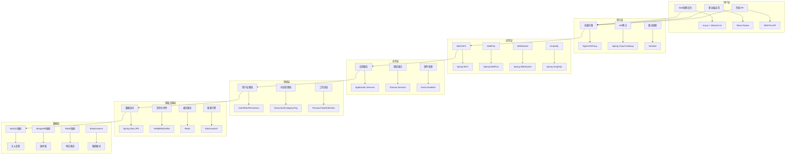
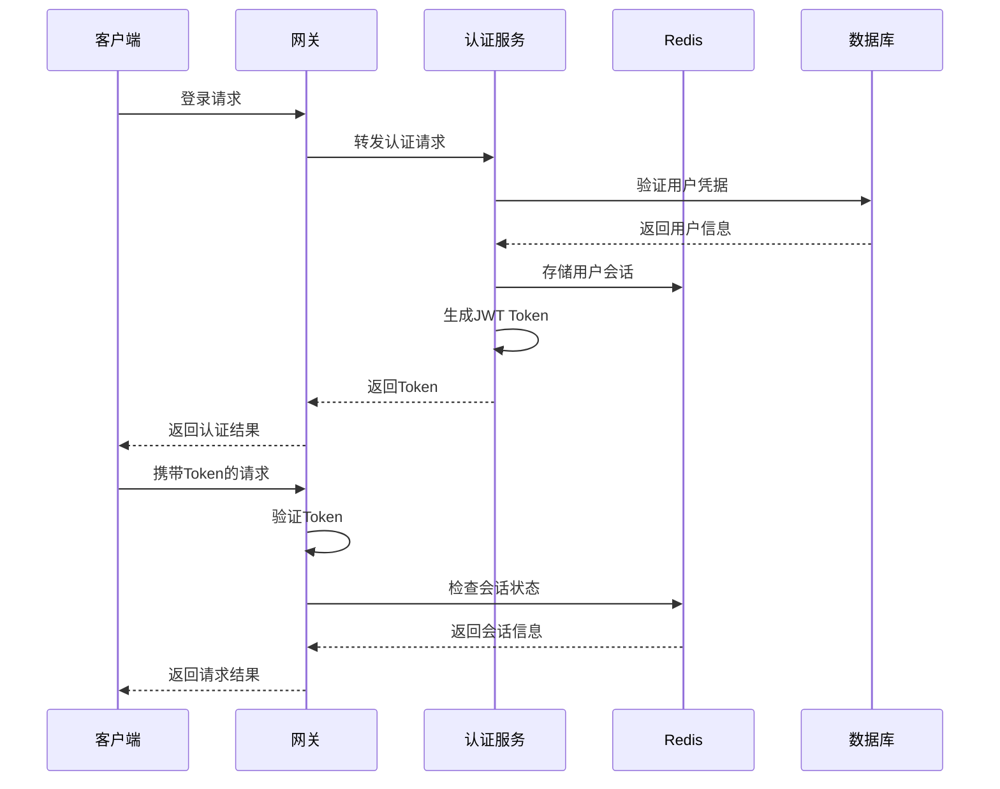
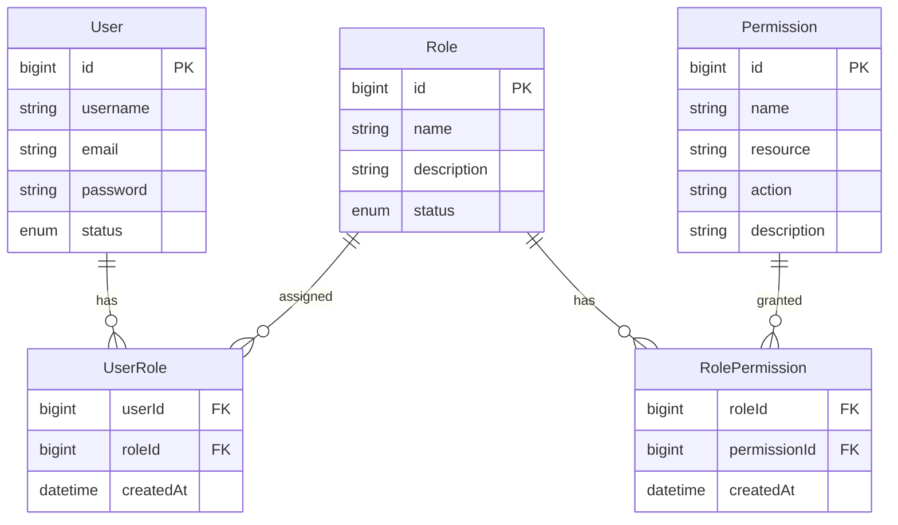
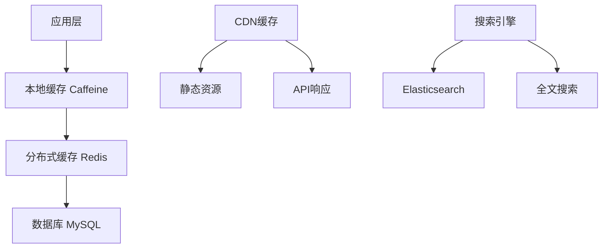

# Spring4demo 概要设计文档

## 📋 文档信息

| 项目 | 内容 |
|------|------|
| **文档名称** | Spring4demo 概要设计 |
| **版本号** | v1.0.0 |
| **创建日期** | 2025-12-24 |
| **作者** | 系统架构师 |
| **审核人** | 技术架构师 |
| **批准人** | 技术总监 |

## 🎯 设计概述

### 系统目标
Spring4demo 企业级智能管理平台是一个基于 Spring Boot 4.0.1 的综合性企业管理系统，旨在提供完整的数字化管理解决方案。系统采用分层架构设计，支持高并发、高可用、高扩展性。

### 设计原则
1. **分层架构**: 清晰的分层结构，职责分离
2. **模块化设计**: 高内聚低耦合的模块化架构
3. **领域驱动**: 以业务领域为核心的设计思想
4. **微服务就绪**: 支持向微服务架构演进

### 技术栈选择
- **后端框架**: Spring Boot 4.0.1 + Spring Framework 6.x
- **数据库**: MySQL 8.0 + MongoDB 6.0 + Redis 7.0
- **消息队列**: RabbitMQ 3.12 + Apache Kafka
- **搜索引擎**: Elasticsearch 8.0
- **容器化**: Docker + Docker Compose

## 🏗️ 系统架构设计

### 整体架构图



### 核心模块设计

#### 1. 用户权限管理模块

**功能概述**
提供完整的用户身份认证和权限管理功能，支持多租户、角色权限、组织架构管理。

**核心功能**
- 用户注册、登录、信息管理
- 角色权限管理、RBAC模型
- 组织架构管理、层级结构
- 单点登录、OAuth2集成
- 多租户数据隔离

**技术实现**
- Spring Security + JWT认证
- Spring Data JPA数据访问
- Redis缓存用户会话
- WebSocket实时权限更新

#### 2. 内容管理模块

**功能概述**
提供企业级内容管理能力，支持文档管理、知识库、内容审核等功能。

**核心功能**
- 文档上传、编辑、版本控制
- 分类管理、标签系统
- 全文搜索、内容推荐
- 工作流审核、内容合规
- 多媒体文件处理

**技术实现**
- Spring Content文件管理
- Elasticsearch全文搜索
- MongoDB存储非结构化数据
- Activiti工作流引擎

#### 3. 工作流引擎模块

**功能概述**
提供灵活的业务流程管理能力，支持可视化流程设计、任务管理、审批流转。

**核心功能**
- 可视化流程设计器
- 任务分配、状态跟踪
- 多级审批、并行审批
- 流程监控、性能分析
- 流程模板管理

**技术实现**
- Activiti工作流引擎
- Spring Integration企业集成
- RabbitMQ异步任务处理
- Redis任务状态缓存

#### 4. 数据分析模块

**功能概述**
提供强大的数据分析和可视化能力，支持报表统计、实时监控、智能分析。

**核心功能**
- 多维度统计报表
- 实时数据可视化
- 自定义仪表板
- 数据预测分析
- 导出功能

**技术实现**
- Spring Boot Actuator监控
- Micrometer指标收集
- Prometheus + Grafana
- InfluxDB时序数据

#### 5. 消息通知模块

**功能概述**
提供统一的消息通知能力，支持实时通知、邮件服务、短信推送。

**核心功能**
- 实时消息推送
- 邮件模板管理
- 短信验证码
- 消息队列处理
- 通知历史管理

**技术实现**
- Spring WebSocket实时通信
- Spring Boot Mail邮件服务
- RabbitMQ消息队列
- Redis消息缓存

#### 6. 文件管理模块

**功能概述**
提供企业级文件管理能力，支持分布式存储、版本控制、权限管理。

**核心功能**
- 文档存储、版本控制
- 图片处理、格式转换
- 权限控制、下载限制
- 在线预览、缩略图
- 存储空间管理

**技术实现**
- Spring Content文件管理
- MinIO分布式对象存储
- ImageIO图片处理
- MongoDB文件元数据

## 📊 数据库设计

### 数据库架构

#### 1. 关系型数据库设计 (MySQL)

**用户权限表设计**
```sql
-- 用户表
CREATE TABLE users (
    id BIGINT AUTO_INCREMENT PRIMARY KEY,
    username VARCHAR(50) UNIQUE NOT NULL,
    email VARCHAR(100) UNIQUE NOT NULL,
    password VARCHAR(255) NOT NULL,
    status ENUM('ACTIVE', 'INACTIVE', 'LOCKED') DEFAULT 'ACTIVE',
    created_at TIMESTAMP DEFAULT CURRENT_TIMESTAMP,
    updated_at TIMESTAMP DEFAULT CURRENT_TIMESTAMP ON UPDATE CURRENT_TIMESTAMP,
    created_by BIGINT,
    updated_by BIGINT,
    INDEX idx_username (username),
    INDEX idx_email (email),
    INDEX idx_status (status)
);

-- 角色表
CREATE TABLE roles (
    id BIGINT AUTO_INCREMENT PRIMARY KEY,
    name VARCHAR(50) UNIQUE NOT NULL,
    description VARCHAR(255),
    status ENUM('ACTIVE', 'INACTIVE') DEFAULT 'ACTIVE',
    created_at TIMESTAMP DEFAULT CURRENT_TIMESTAMP,
    updated_at TIMESTAMP DEFAULT CURRENT_TIMESTAMP ON UPDATE CURRENT_TIMESTAMP,
    INDEX idx_name (name),
    INDEX idx_status (status)
);

-- 权限表
CREATE TABLE permissions (
    id BIGINT AUTO_INCREMENT PRIMARY KEY,
    name VARCHAR(100) UNIQUE NOT NULL,
    resource VARCHAR(100) NOT NULL,
    action VARCHAR(50) NOT NULL,
    description VARCHAR(255),
    created_at TIMESTAMP DEFAULT CURRENT_TIMESTAMP,
    INDEX idx_resource (resource),
    INDEX idx_action (action)
);

-- 用户角色关联表
CREATE TABLE user_roles (
    id BIGINT AUTO_INCREMENT PRIMARY KEY,
    user_id BIGINT NOT NULL,
    role_id BIGINT NOT NULL,
    created_at TIMESTAMP DEFAULT CURRENT_TIMESTAMP,
    FOREIGN KEY (user_id) REFERENCES users(id) ON DELETE CASCADE,
    FOREIGN KEY (role_id) REFERENCES roles(id) ON DELETE CASCADE,
    UNIQUE KEY uk_user_role (user_id, role_id)
);

-- 角色权限关联表
CREATE TABLE role_permissions (
    id BIGINT AUTO_INCREMENT PRIMARY KEY,
    role_id BIGINT NOT NULL,
    permission_id BIGINT NOT NULL,
    created_at TIMESTAMP DEFAULT CURRENT_TIMESTAMP,
    FOREIGN KEY (role_id) REFERENCES roles(id) ON DELETE CASCADE,
    FOREIGN KEY (permission_id) REFERENCES permissions(id) ON DELETE CASCADE,
    UNIQUE KEY uk_role_permission (role_id, permission_id)
);
```

**内容管理表设计**
```sql
-- 文档表
CREATE TABLE documents (
    id BIGINT AUTO_INCREMENT PRIMARY KEY,
    title VARCHAR(255) NOT NULL,
    content LONGTEXT,
    category_id BIGINT,
    author_id BIGINT NOT NULL,
    status ENUM('DRAFT', 'PUBLISHED', 'ARCHIVED') DEFAULT 'DRAFT',
    version INT DEFAULT 1,
    created_at TIMESTAMP DEFAULT CURRENT_TIMESTAMP,
    updated_at TIMESTAMP DEFAULT CURRENT_TIMESTAMP ON UPDATE CURRENT_TIMESTAMP,
    published_at TIMESTAMP NULL,
    FOREIGN KEY (category_id) REFERENCES categories(id),
    FOREIGN KEY (author_id) REFERENCES users(id),
    INDEX idx_title (title),
    INDEX idx_category_id (category_id),
    INDEX idx_author_id (author_id),
    INDEX idx_status (status),
    INDEX idx_created_at (created_at)
);

-- 分类表
CREATE TABLE categories (
    id BIGINT AUTO_INCREMENT PRIMARY KEY,
    name VARCHAR(100) NOT NULL,
    parent_id BIGINT,
    description TEXT,
    sort_order INT DEFAULT 0,
    status ENUM('ACTIVE', 'INACTIVE') DEFAULT 'ACTIVE',
    created_at TIMESTAMP DEFAULT CURRENT_TIMESTAMP,
    updated_at TIMESTAMP DEFAULT CURRENT_TIMESTAMP ON UPDATE CURRENT_TIMESTAMP,
    FOREIGN KEY (parent_id) REFERENCES categories(id),
    INDEX idx_parent_id (parent_id),
    INDEX idx_name (name),
    INDEX idx_status (status)
);

-- 标签表
CREATE TABLE tags (
    id BIGINT AUTO_INCREMENT PRIMARY KEY,
    name VARCHAR(50) UNIQUE NOT NULL,
    color VARCHAR(7) DEFAULT '#1890ff',
    created_at TIMESTAMP DEFAULT CURRENT_TIMESTAMP,
    INDEX idx_name (name)
);

-- 文档标签关联表
CREATE TABLE document_tags (
    id BIGINT AUTO_INCREMENT PRIMARY KEY,
    document_id BIGINT NOT NULL,
    tag_id BIGINT NOT NULL,
    created_at TIMESTAMP DEFAULT CURRENT_TIMESTAMP,
    FOREIGN KEY (document_id) REFERENCES documents(id) ON DELETE CASCADE,
    FOREIGN KEY (tag_id) REFERENCES tags(id) ON DELETE CASCADE,
    UNIQUE KEY uk_document_tag (document_id, tag_id)
);
```

#### 2. 文档数据库设计 (MongoDB)

**工作流数据设计**
```javascript
// 流程定义集合
db.process_definitions.insertOne({
    _id: ObjectId(),
    name: "请假审批流程",
    key: "leave_approval",
    version: 1,
    description: "员工请假审批流程",
    bpmnXml: "...", // BPMN XML内容
    status: "ACTIVE",
    createdBy: ObjectId("user_id"),
    createdAt: new Date(),
    updatedAt: new Date()
});

// 流程实例集合
db.process_instances.insertOne({
    _id: ObjectId(),
    processDefinitionId: ObjectId("process_def_id"),
    processDefinitionKey: "leave_approval",
    businessKey: "leave_20231201_001",
    status: "RUNNING",
    startTime: new Date(),
    endTime: null,
    startedBy: ObjectId("user_id"),
    variables: {
        applicant: "张三",
        leaveDays: 3,
        reason: "家中有事"
    },
    tasks: [
        {
            id: ObjectId(),
            name: "部门经理审批",
            assignee: ObjectId("manager_id"),
            status: "PENDING",
            createTime: new Date(),
            dueTime: new Date(Date.now() + 24*60*60*1000)
        }
    ]
});

// 任务实例集合
db.task_instances.insertOne({
    _id: ObjectId(),
    processInstanceId: ObjectId("process_instance_id"),
    name: "部门经理审批",
    description: "请审批员工请假申请",
    assignee: ObjectId("manager_id"),
    status: "PENDING",
    priority: 50,
    createTime: new Date(),
    dueTime: new Date(Date.now() + 24*60*60*1000),
    completionTime: null,
    variables: {
        approvalResult: null,
        comments: null
    }
});
```

#### 3. 缓存设计 (Redis)

**缓存策略设计**
```yaml
# 缓存配置
cache:
  users:
    prefix: "user:"
    ttl: 3600  # 1小时
    strategy: "WRITE_THROUGH"
  
  permissions:
    prefix: "permission:"
    ttl: 1800  # 30分钟
    strategy: "WRITE_BEHIND"
  
  documents:
    prefix: "document:"
    ttl: 7200  # 2小时
    strategy: "CACHE_ASIDE"
  
  sessions:
    prefix: "session:"
    ttl: 1800  # 30分钟
    strategy: "WRITE_THROUGH"
```

## 🔐 安全设计

### 安全架构

#### 1. 认证设计

**JWT认证流程**


**认证配置**
```java
@Configuration
@EnableWebSecurity
@EnableMethodSecurity(prePostEnabled = true)
public class SecurityConfig {
    
    @Bean
    public SecurityFilterChain filterChain(HttpSecurity http) throws Exception {
        http
            .csrf(csrf -> csrf.disable())
            .sessionManagement(session -> 
                session.sessionCreationPolicy(SessionCreationPolicy.STATELESS))
            .authorizeHttpRequests(authz -> authz
                .requestMatchers("/api/auth/**").permitAll()
                .requestMatchers("/api/public/**").permitAll()
                .requestMatchers(HttpMethod.GET, "/api/users/**").hasRole("USER")
                .requestMatchers(HttpMethod.POST, "/api/users/**").hasRole("ADMIN")
                .anyRequest().authenticated()
            )
            .addFilterBefore(jwtAuthenticationFilter(), UsernamePasswordAuthenticationFilter.class);
        
        return http.build();
    }
    
    @Bean
    public JwtAuthenticationFilter jwtAuthenticationFilter() {
        return new JwtAuthenticationFilter();
    }
    
    @Bean
    public PasswordEncoder passwordEncoder() {
        return new BCryptPasswordEncoder();
    }
}
```

#### 2. 授权设计

**RBAC权限模型**


#### 3. 数据安全

**数据加密策略**
- **传输加密**: HTTPS/TLS 1.3
- **存储加密**: AES-256数据库加密
- **敏感数据**: 字段级加密存储
- **密钥管理**: 外部密钥管理服务

## 🚀 性能设计

### 性能优化策略

#### 1. 缓存策略

**多级缓存架构**


**缓存配置**
```java
@Configuration
@EnableCaching
public class CacheConfig {
    
    @Bean
    public CacheManager cacheManager() {
        CaffeineCacheManager caffeineManager = new CaffeineCacheManager();
        caffeineManager.setCaffeine(Caffeine.newBuilder()
            .maximumSize(1000)
            .expireAfterWrite(Duration.ofMinutes(10))
            .recordStats());
        
        RedisCacheManager redisManager = RedisCacheManager
            .builder(redisConnectionFactory())
            .cacheDefaults(redisCacheConfiguration())
            .build();
        
        return new CompositeCacheManager(caffeineManager, redisManager);
    }
    
    private RedisCacheConfiguration redisCacheConfiguration() {
        return RedisCacheConfiguration.defaultCacheConfig()
            .entryTtl(Duration.ofMinutes(30))
            .serializeKeysWith(RedisSerializationContext.SerializationPair
                .fromSerializer(new StringRedisSerializer()))
            .serializeValuesWith(RedisSerializationContext.SerializationPair
                .fromSerializer(new GenericJackson2JsonRedisSerializer()));
    }
}
```

#### 2. 数据库优化

**连接池配置**
```yaml
spring:
  datasource:
    hikari:
      maximum-pool-size: 20
      minimum-idle: 5
      idle-timeout: 300000
      max-lifetime: 1200000
      connection-timeout: 20000
      leak-detection-threshold: 60000
      
  jpa:
    hibernate:
      ddl-auto: validate
    show-sql: false
    properties:
      hibernate:
        format_sql: true
        dialect: org.hibernate.dialect.MySQL8Dialect
        jdbc:
          batch_size: 20
        order_inserts: true
        order_updates: true
```

**索引优化策略**
```sql
-- 用户表索引
CREATE INDEX idx_users_username ON users(username);
CREATE INDEX idx_users_email ON users(email);
CREATE INDEX idx_users_status ON users(status);
CREATE INDEX idx_users_created_at ON users(created_at);

-- 文档表索引
CREATE INDEX idx_documents_title ON documents(title);
CREATE INDEX idx_documents_category_id ON documents(category_id);
CREATE INDEX idx_documents_author_id ON documents(author_id);
CREATE INDEX idx_documents_status ON documents(status);
CREATE INDEX idx_documents_created_at ON documents(created_at);

-- 复合索引
CREATE INDEX idx_documents_category_status ON documents(category_id, status);
CREATE INDEX idx_documents_author_status ON documents(author_id, status);
```

#### 3. 异步处理

**异步任务配置**
```java
@Configuration
@EnableAsync
public class AsyncConfig {
    
    @Bean(name = "taskExecutor")
    public Executor taskExecutor() {
        ThreadPoolTaskExecutor executor = new ThreadPoolTaskExecutor();
        executor.setCorePoolSize(10);
        executor.setMaxPoolSize(20);
        executor.setQueueCapacity(200);
        executor.setThreadNamePrefix("Async-");
        executor.setRejectedExecutionHandler(new ThreadPoolExecutor.CallerRunsPolicy());
        executor.initialize();
        return executor;
    }
    
    @Bean(name = "emailExecutor")
    public Executor emailExecutor() {
        ThreadPoolTaskExecutor executor = new ThreadPoolTaskExecutor();
        executor.setCorePoolSize(5);
        executor.setMaxPoolSize(10);
        executor.setQueueCapacity(100);
        executor.setThreadNamePrefix("Email-");
        executor.initialize();
        return executor;
    }
}

@Service
public class NotificationService {
    
    @Async("emailExecutor")
    public CompletableFuture<Void> sendEmail(String to, String subject, String content) {
        // 异步发送邮件
        emailService.send(to, subject, content);
        return CompletableFuture.completedFuture(null);
    }
    
    @Async("taskExecutor")
    public CompletableFuture<Void> processDocument(Long documentId) {
        // 异步处理文档
        documentProcessor.process(documentId);
        return CompletableFuture.completedFuture(null);
    }
}
```

## 📈 监控设计

### 监控体系

#### 1. 应用监控

**Actuator端点配置**
```yaml
management:
  endpoints:
    web:
      exposure:
        include: health,info,metrics,prometheus,loggers,threaddump,heapdump
  endpoint:
    health:
      show-details: always
      show-components: always
    metrics:
      enabled: true
    prometheus:
      enabled: true
  metrics:
    export:
      prometheus:
        enabled: true
    distribution:
      percentiles-histogram:
        http.server.requests: true
      percentiles:
        http.server.requests: 0.5,0.9,0.95,0.99
```

#### 2. 业务监控

**自定义指标**
```java
@Component
public class BusinessMetrics {
    
    private final Counter userRegistrationCounter;
    private final Timer documentProcessingTimer;
    private final Gauge activeUsersGauge;
    
    public BusinessMetrics(MeterRegistry meterRegistry) {
        this.userRegistrationCounter = Counter.builder("user.registrations")
            .description("Number of user registrations")
            .register(meterRegistry);
        
        this.documentProcessingTimer = Timer.builder("document.processing.time")
            .description("Time taken to process documents")
            .register(meterRegistry);
        
        this.activeUsersGauge = Gauge.builder("users.active")
            .description("Number of active users")
            .register(meterRegistry, this, BusinessMetrics::getActiveUserCount);
    }
    
    public void incrementUserRegistration() {
        userRegistrationCounter.increment();
    }
    
    public Timer.Sample startDocumentProcessing() {
        return Timer.start();
    }
    
    public void recordDocumentProcessingTime(Timer.Sample sample) {
        sample.stop(documentProcessingTimer);
    }
    
    private double getActiveUserCount() {
        // 实现获取活跃用户数的逻辑
        return userService.getActiveUserCount();
    }
}
```

#### 3. 日志监控

**日志配置**
```xml
<?xml version="1.0" encoding="UTF-8"?>
<configuration>
    <springProfile name="!prod">
        <include resource="org/springframework/boot/logging/logback/defaults.xml"/>
        <include resource="org/springframework/boot/logging/logback/console-appender.xml"/>
        <root level="INFO">
            <appender-ref ref="CONSOLE"/>
        </root>
    </springProfile>
    
    <springProfile name="prod">
        <appender name="FILE" class="ch.qos.logback.core.rolling.RollingFileAppender">
            <file>logs/spring4demo.log</file>
            <rollingPolicy class="ch.qos.logback.core.rolling.TimeBasedRollingPolicy">
                <fileNamePattern>logs/spring4demo.%d{yyyy-MM-dd}.%i.log</fileNamePattern>
                <maxFileSize>100MB</maxFileSize>
                <maxHistory>30</maxHistory>
                <totalSizeCap>3GB</totalSizeCap>
            </rollingPolicy>
            <encoder>
                <pattern>%d{yyyy-MM-dd HH:mm:ss.SSS} [%thread] %-5level %logger{36} - %msg%n</pattern>
            </encoder>
        </appender>
        
        <root level="INFO">
            <appender-ref ref="FILE"/>
        </root>
    </springProfile>
</configuration>
```

## 🔄 集成设计

### 外部系统集成

#### 1. 消息队列集成

**RabbitMQ配置**
```java
@Configuration
@EnableRabbit
public class RabbitConfig {
    
    @Bean
    public TopicExchange userExchange() {
        return new TopicExchange("user.exchange");
    }
    
    @Bean
    public Queue userQueue() {
        return QueueBuilder.durable("user.queue").build();
    }
    
    @Bean
    public Binding userBinding() {
        return BindingBuilder
            .bind(userQueue())
            .to(userExchange())
            .with("user.created");
    }
    
    @Bean
    public RabbitTemplate rabbitTemplate(ConnectionFactory connectionFactory) {
        RabbitTemplate template = new RabbitTemplate(connectionFactory);
        template.setMessageConverter(new Jackson2JsonMessageConverter());
        return template;
    }
}
```

#### 2. 搜索引擎集成

**Elasticsearch配置**
```java
@Configuration
@EnableElasticsearchRepositories
public class ElasticsearchConfig {
    
    @Bean
    public ElasticsearchOperations elasticsearchTemplate(ElasticsearchClient client) {
        return new ElasticsearchRestTemplate(client);
    }
    
    @Bean
    public ElasticsearchClient elasticsearchClient() {
        return ElasticsearchClients.createSimple(
            HttpHost.create("http://localhost:9200"));
    }
}
```

#### 3. 缓存集成

**Redis配置**
```java
@Configuration
@EnableCaching
public class RedisConfig {
    
    @Bean
    public LettuceConnectionFactory redisConnectionFactory() {
        return new LettuceConnectionFactory(
            new RedisStandaloneConfiguration("localhost", 6379));
    }
    
    @Bean
    public RedisTemplate<String, Object> redisTemplate() {
        RedisTemplate<String, Object> template = new RedisTemplate<>();
        template.setConnectionFactory(redisConnectionFactory());
        template.setKeySerializer(new StringRedisSerializer());
        template.setValueSerializer(new GenericJackson2JsonRedisSerializer());
        template.setHashKeySerializer(new StringRedisSerializer());
        template.setHashValueSerializer(new GenericJackson2JsonRedisSerializer());
        return template;
    }
}
```

## 📋 接口设计

### RESTful API设计

#### 1. 用户管理API

```yaml
# 用户管理API规范
/api/v1/users:
  get:
    summary: 获取用户列表
    parameters:
      - name: page
        in: query
        type: integer
        default: 0
      - name: size
        in: query
        type: integer
        default: 20
      - name: keyword
        in: query
        type: string
    responses:
      200:
        description: 成功返回用户列表
        schema:
          type: object
          properties:
            code:
              type: integer
            message:
              type: string
            data:
              type: object
              properties:
                content:
                  type: array
                  items:
                    $ref: '#/definitions/UserDTO'
                totalElements:
                  type: integer
                totalPages:
                  type: integer

  post:
    summary: 创建用户
    parameters:
      - name: user
        in: body
        required: true
        schema:
          $ref: '#/definitions/CreateUserRequest'
    responses:
      201:
        description: 用户创建成功
        schema:
          $ref: '#/definitions/UserDTO'

/api/v1/users/{id}:
  get:
    summary: 获取用户详情
    parameters:
      - name: id
        in: path
        required: true
        type: integer
    responses:
      200:
        description: 成功返回用户详情
        schema:
          $ref: '#/definitions/UserDTO'

  put:
    summary: 更新用户
    parameters:
      - name: id
        in: path
        required: true
        type: integer
      - name: user
        in: body
        required: true
        schema:
          $ref: '#/definitions/UpdateUserRequest'
    responses:
      200:
        description: 用户更新成功
        schema:
          $ref: '#/definitions/UserDTO'

  delete:
    summary: 删除用户
    parameters:
      - name: id
        in: path
        required: true
        type: integer
    responses:
      204:
        description: 用户删除成功
```

#### 2. 内容管理API

```yaml
# 文档管理API规范
/api/v1/documents:
  get:
    summary: 获取文档列表
    parameters:
      - name: categoryId
        in: query
        type: integer
      - name: status
        in: query
        type: string
        enum: [DRAFT, PUBLISHED, ARCHIVED]
      - name: page
        in: query
        type: integer
        default: 0
      - name: size
        in: query
        type: integer
        default: 20
    responses:
      200:
        description: 成功返回文档列表
        schema:
          type: object
          properties:
            code:
              type: integer
            message:
              type: string
            data:
              type: object
              properties:
                content:
                  type: array
                  items:
                    $ref: '#/definitions/DocumentDTO'
                totalElements:
                  type: integer

  post:
    summary: 创建文档
    parameters:
      - name: document
        in: body
        required: true
        schema:
          $ref: '#/definitions/CreateDocumentRequest'
    responses:
      201:
        description: 文档创建成功
        schema:
          $ref: '#/definitions/DocumentDTO'

/api/v1/documents/{id}:
  get:
    summary: 获取文档详情
    parameters:
      - name: id
        in: path
        required: true
        type: integer
    responses:
      200:
        description: 成功返回文档详情
        schema:
          $ref: '#/definitions/DocumentDTO'

  put:
    summary: 更新文档
    parameters:
      - name: id
        in: path
        required: true
        type: integer
      - name: document
        in: body
        required: true
        schema:
          $ref: '#/definitions/UpdateDocumentRequest'
    responses:
      200:
        description: 文档更新成功
        schema:
          $ref: '#/definitions/DocumentDTO'

/api/v1/documents/{id}/publish:
  post:
    summary: 发布文档
    parameters:
      - name: id
        in: path
        required: true
        type: integer
    responses:
      200:
        description: 文档发布成功
        schema:
          $ref: '#/definitions/DocumentDTO'
```

## 🧪 测试策略

### 测试体系设计

#### 1. 单元测试

**测试覆盖率要求**
- 代码覆盖率 > 80%
- 分支覆盖率 > 70%
- 核心业务逻辑覆盖率 > 90%

**测试示例**
```java
@ExtendWith(MockitoExtension.class)
class UserServiceTest {
    
    @Mock
    private UserRepository userRepository;
    
    @Mock
    private PasswordEncoder passwordEncoder;
    
    @InjectMocks
    private UserServiceImpl userService;
    
    @Test
    @DisplayName("创建用户 - 成功")
    void createUser_Success() {
        // Given
        CreateUserRequest request = CreateUserRequest.builder()
            .username("testuser")
            .email("test@example.com")
            .password("password123")
            .build();
        
        User savedUser = User.builder()
            .id(1L)
            .username("testuser")
            .email("test@example.com")
            .password("encodedPassword")
            .status(UserStatus.ACTIVE)
            .build();
        
        when(passwordEncoder.encode("password123")).thenReturn("encodedPassword");
        when(userRepository.existsByUsername("testuser")).thenReturn(false);
        when(userRepository.existsByEmail("test@example.com")).thenReturn(false);
        when(userRepository.save(any(User.class))).thenReturn(savedUser);
        
        // When
        UserDTO result = userService.createUser(request);
        
        // Then
        assertThat(result.getId()).isEqualTo(1L);
        assertThat(result.getUsername()).isEqualTo("testuser");
        assertThat(result.getEmail()).isEqualTo("test@example.com");
        
        verify(userRepository).save(any(User.class));
        verify(passwordEncoder).encode("password123");
    }
}
```

#### 2. 集成测试

**测试配置**
```java
@SpringBootTest
@TestPropertySource(properties = {
    "spring.datasource.url=jdbc:h2:mem:testdb",
    "spring.jpa.hibernate.ddl-auto=create-drop"
})
@Transactional
class UserControllerIntegrationTest {
    
    @Autowired
    private TestRestTemplate restTemplate;
    
    @Autowired
    private UserRepository userRepository;
    
    @Test
    @DisplayName("获取用户列表 - 集成测试")
    void getUserList_Integration() {
        // Given
        User user = User.builder()
            .username("testuser")
            .email("test@example.com")
            .password("password")
            .status(UserStatus.ACTIVE)
            .build();
        userRepository.save(user);
        
        // When
        ResponseEntity<PageResponse<UserDTO>> response = restTemplate.getForEntity(
            "/api/v1/users?page=0&size=10", 
            new ParameterizedTypeReference<PageResponse<UserDTO>>() {});
        
        // Then
        assertThat(response.getStatusCode()).isEqualTo(HttpStatus.OK);
        assertThat(response.getBody().getContent()).hasSize(1);
        assertThat(response.getBody().getContent().get(0).getUsername()).isEqualTo("testuser");
    }
}
```

#### 3. 端到端测试

**测试框架**
```java
@SpringBootTest(webEnvironment = SpringBootTest.WebEnvironment.RANDOM_PORT)
@TestMethodOrder(OrderAnnotation.class)
class UserE2ETest {
    
    @Autowired
    private TestRestTemplate restTemplate;
    
    private static Long userId;
    
    @Test
    @Order(1)
    @DisplayName("用户注册端到端测试")
    void registerUser_E2E() {
        // Given
        CreateUserRequest request = CreateUserRequest.builder()
            .username("e2euser")
            .email("e2e@example.com")
            .password("password123")
            .build();
        
        // When
        ResponseEntity<UserDTO> response = restTemplate.postForEntity(
            "/api/v1/users", request, UserDTO.class);
        
        // Then
        assertThat(response.getStatusCode()).isEqualTo(HttpStatus.CREATED);
        assertThat(response.getBody().getUsername()).isEqualTo("e2euser");
        
        userId = response.getBody().getId();
    }
    
    @Test
    @Order(2)
    @DisplayName("用户登录端到端测试")
    void loginUser_E2E() {
        // Given
        LoginRequest request = LoginRequest.builder()
            .username("e2euser")
            .password("password123")
            .build();
        
        // When
        ResponseEntity<LoginResponse> response = restTemplate.postForEntity(
            "/api/v1/auth/login", request, LoginResponse.class);
        
        // Then
        assertThat(response.getStatusCode()).isEqualTo(HttpStatus.OK);
        assertThat(response.getBody().getToken()).isNotEmpty();
    }
}
```

---

*本文档为系统的概要设计，提供了系统架构、数据库设计、安全设计、性能设计等核心内容，为详细设计提供了指导。*