# Spring4demo 概要设计文档

## 📋 文档信息

| 项目 | 内容 |
|------|------|
| **文档名称** | Spring4demo 概要设计 |
| **版本号** | v1.1.0 |
| **创建日期** | 2025-12-24 |
| **更新日期** | 2026-01-07 |
| **作者** | 系统架构师 |
| **审核人** | 技术架构师 |
| **批准人** | 技术总监 |

## 📝 更新说明

**v1.2.0 (2026-01-07)**:
- 架构定位从微服务架构调整为单体Spring Boot应用
- 去掉微服务组件：Spring Cloud Gateway、Nacos、Sentinel、RSocket、RocketMQ
- 接入层简化为Nginx负载均衡器
- 限流方案从Sentinel调整为Guava限流
- 消息队列使用Spring Stream接入RabbitMQ和Kafka
- 保留MongoDB、Elasticsearch、Neo4j、InfluxDB等数据存储
- 更新整体架构图，反映单体应用架构

**v1.1.0 (2026-01-07)**:
- 架构分层从DDD 7层调整为三层架构（Web层、Service层、Mapper层）
- 认证框架从Spring Security调整为Sa-Token
- 数据访问从Spring Data JPA调整为MyBatis-Plus
- 主键策略从AUTO_INCREMENT/UUID调整为雪花算法
- 去掉领域层、聚合根、值对象、领域事件等DDD概念
- 更新整体架构图，反映实际使用的技术栈

## 🎯 设计概述

### 系统目标
Spring4demo 企业级智能管理平台是一个基于 Spring Boot 4.0.1 的综合性企业管理系统，旨在提供完整的数字化管理解决方案。系统采用分层架构设计，支持高并发、高可用、高扩展性。

### 设计原则
1. **分层架构**: 清晰的三层结构（Web层、Service层、Mapper层），职责分离
2. **模块化设计**: 高内聚低耦合的模块化架构
3. **业务驱动**: 以业务需求为核心的设计思想
4. **微服务就绪**: 支持向微服务架构演进

### 技术栈选择
- **后端框架**: Spring Boot 4.0.1 + Spring Framework 6.x
- **数据库**: MySQL 8.0 + MongoDB 6.0 + Redis 7.0
- **消息队列**: RabbitMQ 3.12 + Apache Kafka
- **搜索引擎**: Elasticsearch 8.0
- **容器化**: Docker + Docker Compose

## 🏗️ 系统架构设计

### 整体架构图

```mermaid
graph TB
    subgraph "用户层"
        A1[Web管理后台] --> A2[Vue.js + Element UI]
        A3[移动端应用] --> A4[React Native]
        A5[开放API] --> A6[RESTful API]
    end

    subgraph "接入层"
        B1[负载均衡] --> B2[Nginx]
    end

    subgraph "Web层"
        C1[Web MVC] --> C2[Spring MVC]
        C3[WebFlux] --> C4[Spring WebFlux]
        C5[WebSocket] --> C6[Spring WebSocket]
        C7[GraphQL] --> C8[Spring GraphQL]
    end

    subgraph "Service层"
        D1[业务服务] --> D2[Business Services]
        D3[事务管理] --> D4[Transaction Management]
        D5[业务规则] --> D6[Business Rules]
    end

    subgraph "Mapper层"
        E1[数据访问] --> E2[MyBatis-Plus]
        E3[SQL执行] --> E4[SQL Execution]
        E5[结果映射] --> E6[Result Mapping]
    end

    subgraph "基础设施层"
        F1[消息中间件] --> F2[Spring Stream]
        F3[缓存服务] --> F4[Redis]
        F5[搜索引擎] --> F6[Elasticsearch]
    end

    subgraph "数据层"
        G1[MySQL] --> G2[主从复制]
        G3[MongoDB] --> G4[副本集]
        G5[Redis] --> G6[哨兵模式]
        G7[Elasticsearch] --> G8[集群模式]
        G9[Neo4j] --> G10[集群模式]
        G11[InfluxDB] --> G12[集群模式]
    end

    A1 --> B1
    A3 --> B1
    A5 --> B1
    B1 --> C1
    C1 --> D1
    D1 --> E1
    E1 --> G1
    D1 --> F1
```



### 核心模块设计

#### 1. 用户权限管理模块

**功能概述**
提供完整的用户身份认证和权限管理功能，支持多租户、角色权限、组织架构管理。

**核心功能**
- 用户注册、登录、信息管理
- 角色权限管理、RBAC模型
- 组织架构管理、层级结构
- 单点登录、OAuth2集成
- 多租户数据隔离

**技术实现**
- Sa-Token + JWT认证
- MyBatis-Plus数据访问
- Redis缓存用户会话
- WebSocket实时权限更新

#### 2. 内容管理模块

**功能概述**
提供企业级内容管理能力，支持文档管理、知识库、内容审核等功能。

**核心功能**
- 文档上传、编辑、版本控制
- 分类管理、标签系统
- 全文搜索、内容推荐
- 工作流审核、内容合规
- 多媒体文件处理

**技术实现**
- Spring Content文件管理
- Elasticsearch全文搜索
- MongoDB存储非结构化数据
- Activiti工作流引擎

#### 3. 工作流引擎模块

**功能概述**
提供灵活的业务流程管理能力，支持可视化流程设计、任务管理、审批流转。

**核心功能**
- 可视化流程设计器
- 任务分配、状态跟踪
- 多级审批、并行审批
- 流程监控、性能分析
- 流程模板管理

**技术实现**
- Activiti工作流引擎
- Spring Integration企业集成
- RabbitMQ异步任务处理
- Redis任务状态缓存

#### 4. 数据分析模块

**功能概述**
提供强大的数据分析和可视化能力，支持报表统计、实时监控、智能分析。

**核心功能**
- 多维度统计报表
- 实时数据可视化
- 自定义仪表板
- 数据预测分析
- 导出功能

**技术实现**
- Spring Boot Actuator监控
- Micrometer指标收集
- Prometheus + Grafana
- InfluxDB时序数据

#### 5. 消息通知模块

**功能概述**
提供统一的消息通知能力，支持实时通知、邮件服务、短信推送。

**核心功能**
- 实时消息推送
- 邮件模板管理
- 短信验证码
- 消息队列处理
- 通知历史管理

**技术实现**
- Spring WebSocket实时通信
- Spring Boot Mail邮件服务
- RabbitMQ消息队列
- Redis消息缓存

#### 6. 文件管理模块

**功能概述**
提供企业级文件管理能力，支持分布式存储、版本控制、权限管理。

**核心功能**
- 文档存储、版本控制
- 图片处理、格式转换
- 权限控制、下载限制
- 在线预览、缩略图
- 存储空间管理

**技术实现**
- Spring Content文件管理
- MinIO分布式对象存储
- ImageIO图片处理
- MongoDB文件元数据

## 📊 数据库设计

### 数据库架构

#### 1. 关系型数据库设计 (MySQL)

**用户权限表设计**
```sql
-- 用户表
CREATE TABLE users (
    id BIGINT PRIMARY KEY COMMENT '主键ID（雪花算法）',
    username VARCHAR(50) UNIQUE NOT NULL COMMENT '用户名',
    email VARCHAR(100) UNIQUE NOT NULL COMMENT '邮箱',
    password VARCHAR(255) NOT NULL COMMENT '密码（加密后）',
    status ENUM('ACTIVE', 'INACTIVE', 'LOCKED') DEFAULT 'ACTIVE' COMMENT '用户状态',
    created_at TIMESTAMP DEFAULT CURRENT_TIMESTAMP COMMENT '创建时间',
    updated_at TIMESTAMP DEFAULT CURRENT_TIMESTAMP ON UPDATE CURRENT_TIMESTAMP COMMENT '更新时间',
    created_by BIGINT COMMENT '创建人',
    updated_by BIGINT COMMENT '更新人',
    INDEX idx_username (username),
    INDEX idx_email (email),
    INDEX idx_status (status)
) ENGINE=InnoDB DEFAULT CHARSET=utf8mb4 COMMENT='用户表';

-- 角色表
CREATE TABLE roles (
    id BIGINT PRIMARY KEY COMMENT '主键ID（雪花算法）',
    name VARCHAR(50) UNIQUE NOT NULL COMMENT '角色名称',
    description VARCHAR(255) COMMENT '角色描述',
    status ENUM('ACTIVE', 'INACTIVE') DEFAULT 'ACTIVE' COMMENT '角色状态',
    created_at TIMESTAMP DEFAULT CURRENT_TIMESTAMP COMMENT '创建时间',
    updated_at TIMESTAMP DEFAULT CURRENT_TIMESTAMP ON UPDATE CURRENT_TIMESTAMP COMMENT '更新时间',
    INDEX idx_name (name),
    INDEX idx_status (status)
) ENGINE=InnoDB DEFAULT CHARSET=utf8mb4 COMMENT='角色表';

-- 权限表
CREATE TABLE permissions (
    id BIGINT PRIMARY KEY COMMENT '主键ID（雪花算法）',
    name VARCHAR(100) UNIQUE NOT NULL COMMENT '权限名称',
    resource VARCHAR(100) NOT NULL COMMENT '资源',
    action VARCHAR(50) NOT NULL COMMENT '操作',
    description VARCHAR(255) COMMENT '权限描述',
    created_at TIMESTAMP DEFAULT CURRENT_TIMESTAMP COMMENT '创建时间',
    INDEX idx_resource (resource),
    INDEX idx_action (action)
) ENGINE=InnoDB DEFAULT CHARSET=utf8mb4 COMMENT='权限表';

-- 用户角色关联表
CREATE TABLE user_roles (
    id BIGINT PRIMARY KEY COMMENT '主键ID（雪花算法）',
    user_id BIGINT NOT NULL COMMENT '用户ID',
    role_id BIGINT NOT NULL COMMENT '角色ID',
    created_at TIMESTAMP DEFAULT CURRENT_TIMESTAMP COMMENT '创建时间',
    FOREIGN KEY (user_id) REFERENCES users(id) ON DELETE CASCADE,
    FOREIGN KEY (role_id) REFERENCES roles(id) ON DELETE CASCADE,
    UNIQUE KEY uk_user_role (user_id, role_id)
) ENGINE=InnoDB DEFAULT CHARSET=utf8mb4 COMMENT='用户角色关联表';

-- 角色权限关联表
CREATE TABLE role_permissions (
    id BIGINT PRIMARY KEY COMMENT '主键ID（雪花算法）',
    role_id BIGINT NOT NULL COMMENT '角色ID',
    permission_id BIGINT NOT NULL COMMENT '权限ID',
    created_at TIMESTAMP DEFAULT CURRENT_TIMESTAMP COMMENT '创建时间',
    FOREIGN KEY (role_id) REFERENCES roles(id) ON DELETE CASCADE,
    FOREIGN KEY (permission_id) REFERENCES permissions(id) ON DELETE CASCADE,
    UNIQUE KEY uk_role_permission (role_id, permission_id)
) ENGINE=InnoDB DEFAULT CHARSET=utf8mb4 COMMENT='角色权限关联表';
```

**内容管理表设计**
```sql
-- 文档表
CREATE TABLE documents (
    id BIGINT PRIMARY KEY COMMENT '主键ID（雪花算法）',
    title VARCHAR(255) NOT NULL COMMENT '文档标题',
    content LONGTEXT COMMENT '文档内容',
    category_id BIGINT COMMENT '分类ID',
    author_id BIGINT NOT NULL COMMENT '作者ID',
    status ENUM('DRAFT', 'PUBLISHED', 'ARCHIVED') DEFAULT 'DRAFT' COMMENT '文档状态',
    version INT DEFAULT 1 COMMENT '版本号',
    created_at TIMESTAMP DEFAULT CURRENT_TIMESTAMP COMMENT '创建时间',
    updated_at TIMESTAMP DEFAULT CURRENT_TIMESTAMP ON UPDATE CURRENT_TIMESTAMP COMMENT '更新时间',
    published_at TIMESTAMP NULL COMMENT '发布时间',
    FOREIGN KEY (category_id) REFERENCES categories(id),
    FOREIGN KEY (author_id) REFERENCES users(id),
    INDEX idx_title (title),
    INDEX idx_category_id (category_id),
    INDEX idx_author_id (author_id),
    INDEX idx_status (status),
    INDEX idx_created_at (created_at)
) ENGINE=InnoDB DEFAULT CHARSET=utf8mb4 COMMENT='文档表';

-- 分类表
CREATE TABLE categories (
    id BIGINT PRIMARY KEY COMMENT '主键ID（雪花算法）',
    name VARCHAR(100) NOT NULL COMMENT '分类名称',
    parent_id BIGINT COMMENT '父分类ID',
    description TEXT COMMENT '分类描述',
    sort_order INT DEFAULT 0 COMMENT '排序',
    status ENUM('ACTIVE', 'INACTIVE') DEFAULT 'ACTIVE' COMMENT '分类状态',
    created_at TIMESTAMP DEFAULT CURRENT_TIMESTAMP COMMENT '创建时间',
    updated_at TIMESTAMP DEFAULT CURRENT_TIMESTAMP ON UPDATE CURRENT_TIMESTAMP COMMENT '更新时间',
    FOREIGN KEY (parent_id) REFERENCES categories(id),
    INDEX idx_parent_id (parent_id),
    INDEX idx_name (name),
    INDEX idx_status (status)
) ENGINE=InnoDB DEFAULT CHARSET=utf8mb4 COMMENT='分类表';

-- 标签表
CREATE TABLE tags (
    id BIGINT PRIMARY KEY COMMENT '主键ID（雪花算法）',
    name VARCHAR(50) UNIQUE NOT NULL COMMENT '标签名称',
    color VARCHAR(7) DEFAULT '#1890ff' COMMENT '标签颜色',
    created_at TIMESTAMP DEFAULT CURRENT_TIMESTAMP COMMENT '创建时间',
    INDEX idx_name (name)
) ENGINE=InnoDB DEFAULT CHARSET=utf8mb4 COMMENT='标签表';

-- 文档标签关联表
CREATE TABLE document_tags (
    id BIGINT PRIMARY KEY COMMENT '主键ID（雪花算法）',
    document_id BIGINT NOT NULL COMMENT '文档ID',
    tag_id BIGINT NOT NULL COMMENT '标签ID',
    created_at TIMESTAMP DEFAULT CURRENT_TIMESTAMP COMMENT '创建时间',
    FOREIGN KEY (document_id) REFERENCES documents(id) ON DELETE CASCADE,
    FOREIGN KEY (tag_id) REFERENCES tags(id) ON DELETE CASCADE,
    UNIQUE KEY uk_document_tag (document_id, tag_id)
) ENGINE=InnoDB DEFAULT CHARSET=utf8mb4 COMMENT='文档标签关联表';
```

#### 2. 文档数据库设计 (MongoDB)

**工作流数据设计**
```javascript
// 流程定义集合
db.process_definitions.insertOne({
    _id: ObjectId(),
    name: "请假审批流程",
    key: "leave_approval",
    version: 1,
    description: "员工请假审批流程",
    bpmnXml: "...", // BPMN XML内容
    status: "ACTIVE",
    createdBy: ObjectId("user_id"),
    createdAt: new Date(),
    updatedAt: new Date()
});

// 流程实例集合
db.process_instances.insertOne({
    _id: ObjectId(),
    processDefinitionId: ObjectId("process_def_id"),
    processDefinitionKey: "leave_approval",
    businessKey: "leave_20231201_001",
    status: "RUNNING",
    startTime: new Date(),
    endTime: null,
    startedBy: ObjectId("user_id"),
    variables: {
        applicant: "张三",
        leaveDays: 3,
        reason: "家中有事"
    },
    tasks: [
        {
            id: ObjectId(),
            name: "部门经理审批",
            assignee: ObjectId("manager_id"),
            status: "PENDING",
            createTime: new Date(),
            dueTime: new Date(Date.now() + 24*60*60*1000)
        }
    ]
});

// 任务实例集合
db.task_instances.insertOne({
    _id: ObjectId(),
    processInstanceId: ObjectId("process_instance_id"),
    name: "部门经理审批",
    description: "请审批员工请假申请",
    assignee: ObjectId("manager_id"),
    status: "PENDING",
    priority: 50,
    createTime: new Date(),
    dueTime: new Date(Date.now() + 24*60*60*1000),
    completionTime: null,
    variables: {
        approvalResult: null,
        comments: null
    }
});
```

#### 3. 缓存设计 (Redis)

**缓存策略设计**
```yaml
# 缓存配置
cache:
  users:
    prefix: "user:"
    ttl: 3600  # 1小时
    strategy: "WRITE_THROUGH"
  
  permissions:
    prefix: "permission:"
    ttl: 1800  # 30分钟
    strategy: "WRITE_BEHIND"
  
  documents:
    prefix: "document:"
    ttl: 7200  # 2小时
    strategy: "CACHE_ASIDE"
  
  sessions:
    prefix: "session:"
    ttl: 1800  # 30分钟
    strategy: "WRITE_THROUGH"
```

## 🔐 安全设计

### 安全架构

#### 1. 认证设计

**JWT认证流程**

```mermaid
sequenceDiagram
    participant C as 客户端
    participant G as 网关
    participant A as 认证服务
    participant R as Redis
    participant D as 数据库
    
    C->>G: 登录请求
    G->>A: 转发认证请求
    A->>D: 验证用户凭据
    D-->>A: 返回用户信息
    A->>R: 存储用户会话
    A->>A: 生成JWT Token
    A-->>G: 返回Token
    G-->>C: 返回认证结果
    
    C->>G: 携带Token的请求
    G->>G: 验证Token
    G->>R: 检查会话状态
    R-->>G: 返回会话信息
    G-->>C: 返回请求结果
```


**认证配置**
```java
@Configuration
@EnableWebSecurity
@EnableMethodSecurity(prePostEnabled = true)
public class SecurityConfig {
    
    @Bean
    public SecurityFilterChain filterChain(HttpSecurity http) throws Exception {
        http
            .csrf(csrf -> csrf.disable())
            .sessionManagement(session -> 
                session.sessionCreationPolicy(SessionCreationPolicy.STATELESS))
            .authorizeHttpRequests(authz -> authz
                .requestMatchers("/api/auth/**").permitAll()
                .requestMatchers("/api/public/**").permitAll()
                .requestMatchers(HttpMethod.GET, "/api/users/**").hasRole("USER")
                .requestMatchers(HttpMethod.POST, "/api/users/**").hasRole("ADMIN")
                .anyRequest().authenticated()
            )
            .addFilterBefore(jwtAuthenticationFilter(), UsernamePasswordAuthenticationFilter.class);
        
        return http.build();
    }
    
    @Bean
    public JwtAuthenticationFilter jwtAuthenticationFilter() {
        return new JwtAuthenticationFilter();
    }
    
    @Bean
    public PasswordEncoder passwordEncoder() {
        return new BCryptPasswordEncoder();
    }
}
```

#### 2. 授权设计

**RBAC权限模型**


#### 3. 数据安全

**数据加密策略**
- **传输加密**: HTTPS/TLS 1.3
- **存储加密**: AES-256数据库加密
- **敏感数据**: 字段级加密存储
- **密钥管理**: 外部密钥管理服务

## 🚀 性能设计

### 性能优化策略

#### 1. 缓存策略

**多级缓存架构**

```mermaid
graph TB
    A[应用层] --> B[本地缓存 Caffeine]
    B --> C[分布式缓存 Redis]
    C --> D[数据库 MySQL]
    
    E[CDN缓存] --> F[静态资源]
    E --> G[API响应]
    
    H[搜索引擎] --> I[Elasticsearch]
    H --> J[全文搜索]
```


**缓存配置**
```java
@Configuration
@EnableCaching
public class CacheConfig {
    
    @Bean
    public CacheManager cacheManager() {
        CaffeineCacheManager caffeineManager = new CaffeineCacheManager();
        caffeineManager.setCaffeine(Caffeine.newBuilder()
            .maximumSize(1000)
            .expireAfterWrite(Duration.ofMinutes(10))
            .recordStats());
        
        RedisCacheManager redisManager = RedisCacheManager
            .builder(redisConnectionFactory())
            .cacheDefaults(redisCacheConfiguration())
            .build();
        
        return new CompositeCacheManager(caffeineManager, redisManager);
    }
    
    private RedisCacheConfiguration redisCacheConfiguration() {
        return RedisCacheConfiguration.defaultCacheConfig()
            .entryTtl(Duration.ofMinutes(30))
            .serializeKeysWith(RedisSerializationContext.SerializationPair
                .fromSerializer(new StringRedisSerializer()))
            .serializeValuesWith(RedisSerializationContext.SerializationPair
                .fromSerializer(new GenericJackson2JsonRedisSerializer()));
    }
}
```

#### 2. 数据库优化

**连接池配置**
```yaml
spring:
  datasource:
    hikari:
      maximum-pool-size: 20
      minimum-idle: 5
      idle-timeout: 300000
      max-lifetime: 1200000
      connection-timeout: 20000
      leak-detection-threshold: 60000
      
  jpa:
    hibernate:
      ddl-auto: validate
    show-sql: false
    properties:
      hibernate:
        format_sql: true
        dialect: org.hibernate.dialect.MySQL8Dialect
        jdbc:
          batch_size: 20
        order_inserts: true
        order_updates: true
```

**索引优化策略**
```sql
-- 用户表索引
CREATE INDEX idx_users_username ON users(username);
CREATE INDEX idx_users_email ON users(email);
CREATE INDEX idx_users_status ON users(status);
CREATE INDEX idx_users_created_at ON users(created_at);

-- 文档表索引
CREATE INDEX idx_documents_title ON documents(title);
CREATE INDEX idx_documents_category_id ON documents(category_id);
CREATE INDEX idx_documents_author_id ON documents(author_id);
CREATE INDEX idx_documents_status ON documents(status);
CREATE INDEX idx_documents_created_at ON documents(created_at);

-- 复合索引
CREATE INDEX idx_documents_category_status ON documents(category_id, status);
CREATE INDEX idx_documents_author_status ON documents(author_id, status);
```

#### 3. 异步处理

**异步任务配置**
```java
@Configuration
@EnableAsync
public class AsyncConfig {
    
    @Bean(name = "taskExecutor")
    public Executor taskExecutor() {
        ThreadPoolTaskExecutor executor = new ThreadPoolTaskExecutor();
        executor.setCorePoolSize(10);
        executor.setMaxPoolSize(20);
        executor.setQueueCapacity(200);
        executor.setThreadNamePrefix("Async-");
        executor.setRejectedExecutionHandler(new ThreadPoolExecutor.CallerRunsPolicy());
        executor.initialize();
        return executor;
    }
    
    @Bean(name = "emailExecutor")
    public Executor emailExecutor() {
        ThreadPoolTaskExecutor executor = new ThreadPoolTaskExecutor();
        executor.setCorePoolSize(5);
        executor.setMaxPoolSize(10);
        executor.setQueueCapacity(100);
        executor.setThreadNamePrefix("Email-");
        executor.initialize();
        return executor;
    }
}

@Service
public class NotificationService {
    
    @Async("emailExecutor")
    public CompletableFuture<Void> sendEmail(String to, String subject, String content) {
        // 异步发送邮件
        emailService.send(to, subject, content);
        return CompletableFuture.completedFuture(null);
    }
    
    @Async("taskExecutor")
    public CompletableFuture<Void> processDocument(Long documentId) {
        // 异步处理文档
        documentProcessor.process(documentId);
        return CompletableFuture.completedFuture(null);
    }
}
```

## 📈 监控设计

### 监控体系

#### 1. 应用监控

**Actuator端点配置**
```yaml
management:
  endpoints:
    web:
      exposure:
        include: health,info,metrics,prometheus,loggers,threaddump,heapdump
  endpoint:
    health:
      show-details: always
      show-components: always
    metrics:
      enabled: true
    prometheus:
      enabled: true
  metrics:
    export:
      prometheus:
        enabled: true
    distribution:
      percentiles-histogram:
        http.server.requests: true
      percentiles:
        http.server.requests: 0.5,0.9,0.95,0.99
```

#### 2. 业务监控

**自定义指标**
```java
@Component
public class BusinessMetrics {
    
    private final Counter userRegistrationCounter;
    private final Timer documentProcessingTimer;
    private final Gauge activeUsersGauge;
    
    public BusinessMetrics(MeterRegistry meterRegistry) {
        this.userRegistrationCounter = Counter.builder("user.registrations")
            .description("Number of user registrations")
            .register(meterRegistry);
        
        this.documentProcessingTimer = Timer.builder("document.processing.time")
            .description("Time taken to process documents")
            .register(meterRegistry);
        
        this.activeUsersGauge = Gauge.builder("users.active")
            .description("Number of active users")
            .register(meterRegistry, this, BusinessMetrics::getActiveUserCount);
    }
    
    public void incrementUserRegistration() {
        userRegistrationCounter.increment();
    }
    
    public Timer.Sample startDocumentProcessing() {
        return Timer.start();
    }
    
    public void recordDocumentProcessingTime(Timer.Sample sample) {
        sample.stop(documentProcessingTimer);
    }
    
    private double getActiveUserCount() {
        // 实现获取活跃用户数的逻辑
        return userService.getActiveUserCount();
    }
}
```

#### 3. 日志监控

**日志配置**
```xml
<?xml version="1.0" encoding="UTF-8"?>
<configuration>
    <springProfile name="!prod">
        <include resource="org/springframework/boot/logging/logback/defaults.xml"/>
        <include resource="org/springframework/boot/logging/logback/console-appender.xml"/>
        <root level="INFO">
            <appender-ref ref="CONSOLE"/>
        </root>
    </springProfile>
    
    <springProfile name="prod">
        <appender name="FILE" class="ch.qos.logback.core.rolling.RollingFileAppender">
            <file>logs/spring4demo.log</file>
            <rollingPolicy class="ch.qos.logback.core.rolling.TimeBasedRollingPolicy">
                <fileNamePattern>logs/spring4demo.%d{yyyy-MM-dd}.%i.log</fileNamePattern>
                <maxFileSize>100MB</maxFileSize>
                <maxHistory>30</maxHistory>
                <totalSizeCap>3GB</totalSizeCap>
            </rollingPolicy>
            <encoder>
                <pattern>%d{yyyy-MM-dd HH:mm:ss.SSS} [%thread] %-5level %logger{36} - %msg%n</pattern>
            </encoder>
        </appender>
        
        <root level="INFO">
            <appender-ref ref="FILE"/>
        </root>
    </springProfile>
</configuration>
```

## 🔄 集成设计

### 外部系统集成

#### 1. 消息队列集成

**RabbitMQ配置**
```java
@Configuration
@EnableRabbit
public class RabbitConfig {
    
    @Bean
    public TopicExchange userExchange() {
        return new TopicExchange("user.exchange");
    }
    
    @Bean
    public Queue userQueue() {
        return QueueBuilder.durable("user.queue").build();
    }
    
    @Bean
    public Binding userBinding() {
        return BindingBuilder
            .bind(userQueue())
            .to(userExchange())
            .with("user.created");
    }
    
    @Bean
    public RabbitTemplate rabbitTemplate(ConnectionFactory connectionFactory) {
        RabbitTemplate template = new RabbitTemplate(connectionFactory);
        template.setMessageConverter(new Jackson2JsonMessageConverter());
        return template;
    }
}
```

#### 2. 搜索引擎集成

**Elasticsearch配置**
```java
@Configuration
@EnableElasticsearchRepositories
public class ElasticsearchConfig {
    
    @Bean
    public ElasticsearchOperations elasticsearchTemplate(ElasticsearchClient client) {
        return new ElasticsearchRestTemplate(client);
    }
    
    @Bean
    public ElasticsearchClient elasticsearchClient() {
        return ElasticsearchClients.createSimple(
            HttpHost.create("http://localhost:9200"));
    }
}
```

#### 3. 缓存集成

**Redis配置**
```java
@Configuration
@EnableCaching
public class RedisConfig {
    
    @Bean
    public LettuceConnectionFactory redisConnectionFactory() {
        return new LettuceConnectionFactory(
            new RedisStandaloneConfiguration("localhost", 6379));
    }
    
    @Bean
    public RedisTemplate<String, Object> redisTemplate() {
        RedisTemplate<String, Object> template = new RedisTemplate<>();
        template.setConnectionFactory(redisConnectionFactory());
        template.setKeySerializer(new StringRedisSerializer());
        template.setValueSerializer(new GenericJackson2JsonRedisSerializer());
        template.setHashKeySerializer(new StringRedisSerializer());
        template.setHashValueSerializer(new GenericJackson2JsonRedisSerializer());
        return template;
    }
}
```

## 📋 接口设计

### RESTful API设计

#### 1. 用户管理API

```yaml
# 用户管理API规范
/api/v1/users:
  get:
    summary: 获取用户列表
    parameters:
      - name: page
        in: query
        type: integer
        default: 0
      - name: size
        in: query
        type: integer
        default: 20
      - name: keyword
        in: query
        type: string
    responses:
      200:
        description: 成功返回用户列表
        schema:
          type: object
          properties:
            code:
              type: integer
            message:
              type: string
            data:
              type: object
              properties:
                content:
                  type: array
                  items:
                    $ref: '#/definitions/UserDTO'
                totalElements:
                  type: integer
                totalPages:
                  type: integer

  post:
    summary: 创建用户
    parameters:
      - name: user
        in: body
        required: true
        schema:
          $ref: '#/definitions/CreateUserRequest'
    responses:
      201:
        description: 用户创建成功
        schema:
          $ref: '#/definitions/UserDTO'

/api/v1/users/{id}:
  get:
    summary: 获取用户详情
    parameters:
      - name: id
        in: path
        required: true
        type: integer
    responses:
      200:
        description: 成功返回用户详情
        schema:
          $ref: '#/definitions/UserDTO'

  put:
    summary: 更新用户
    parameters:
      - name: id
        in: path
        required: true
        type: integer
      - name: user
        in: body
        required: true
        schema:
          $ref: '#/definitions/UpdateUserRequest'
    responses:
      200:
        description: 用户更新成功
        schema:
          $ref: '#/definitions/UserDTO'

  delete:
    summary: 删除用户
    parameters:
      - name: id
        in: path
        required: true
        type: integer
    responses:
      204:
        description: 用户删除成功
```

#### 2. 内容管理API

```yaml
# 文档管理API规范
/api/v1/documents:
  get:
    summary: 获取文档列表
    parameters:
      - name: categoryId
        in: query
        type: integer
      - name: status
        in: query
        type: string
        enum: [DRAFT, PUBLISHED, ARCHIVED]
      - name: page
        in: query
        type: integer
        default: 0
      - name: size
        in: query
        type: integer
        default: 20
    responses:
      200:
        description: 成功返回文档列表
        schema:
          type: object
          properties:
            code:
              type: integer
            message:
              type: string
            data:
              type: object
              properties:
                content:
                  type: array
                  items:
                    $ref: '#/definitions/DocumentDTO'
                totalElements:
                  type: integer

  post:
    summary: 创建文档
    parameters:
      - name: document
        in: body
        required: true
        schema:
          $ref: '#/definitions/CreateDocumentRequest'
    responses:
      201:
        description: 文档创建成功
        schema:
          $ref: '#/definitions/DocumentDTO'

/api/v1/documents/{id}:
  get:
    summary: 获取文档详情
    parameters:
      - name: id
        in: path
        required: true
        type: integer
    responses:
      200:
        description: 成功返回文档详情
        schema:
          $ref: '#/definitions/DocumentDTO'

  put:
    summary: 更新文档
    parameters:
      - name: id
        in: path
        required: true
        type: integer
      - name: document
        in: body
        required: true
        schema:
          $ref: '#/definitions/UpdateDocumentRequest'
    responses:
      200:
        description: 文档更新成功
        schema:
          $ref: '#/definitions/DocumentDTO'

/api/v1/documents/{id}/publish:
  post:
    summary: 发布文档
    parameters:
      - name: id
        in: path
        required: true
        type: integer
    responses:
      200:
        description: 文档发布成功
        schema:
          $ref: '#/definitions/DocumentDTO'
```

## 🧪 测试策略

### 测试体系设计

#### 1. 单元测试

**测试覆盖率要求**
- 代码覆盖率 > 80%
- 分支覆盖率 > 70%
- 核心业务逻辑覆盖率 > 90%

**测试示例**
```java
@ExtendWith(MockitoExtension.class)
class UserServiceTest {
    
    @Mock
    private UserRepository userRepository;
    
    @Mock
    private PasswordEncoder passwordEncoder;
    
    @InjectMocks
    private UserServiceImpl userService;
    
    @Test
    @DisplayName("创建用户 - 成功")
    void createUser_Success() {
        // Given
        CreateUserRequest request = CreateUserRequest.builder()
            .username("testuser")
            .email("test@example.com")
            .password("password123")
            .build();
        
        User savedUser = User.builder()
            .id(1L)
            .username("testuser")
            .email("test@example.com")
            .password("encodedPassword")
            .status(UserStatus.ACTIVE)
            .build();
        
        when(passwordEncoder.encode("password123")).thenReturn("encodedPassword");
        when(userRepository.existsByUsername("testuser")).thenReturn(false);
        when(userRepository.existsByEmail("test@example.com")).thenReturn(false);
        when(userRepository.save(any(User.class))).thenReturn(savedUser);
        
        // When
        UserDTO result = userService.createUser(request);
        
        // Then
        assertThat(result.getId()).isEqualTo(1L);
        assertThat(result.getUsername()).isEqualTo("testuser");
        assertThat(result.getEmail()).isEqualTo("test@example.com");
        
        verify(userRepository).save(any(User.class));
        verify(passwordEncoder).encode("password123");
    }
}
```

#### 2. 集成测试

**测试配置**
```java
@SpringBootTest
@TestPropertySource(properties = {
    "spring.datasource.url=jdbc:h2:mem:testdb",
    "spring.jpa.hibernate.ddl-auto=create-drop"
})
@Transactional
class UserControllerIntegrationTest {
    
    @Autowired
    private TestRestTemplate restTemplate;
    
    @Autowired
    private UserRepository userRepository;
    
    @Test
    @DisplayName("获取用户列表 - 集成测试")
    void getUserList_Integration() {
        // Given
        User user = User.builder()
            .username("testuser")
            .email("test@example.com")
            .password("password")
            .status(UserStatus.ACTIVE)
            .build();
        userRepository.save(user);
        
        // When
        ResponseEntity<PageResponse<UserDTO>> response = restTemplate.getForEntity(
            "/api/v1/users?page=0&size=10", 
            new ParameterizedTypeReference<PageResponse<UserDTO>>() {});
        
        // Then
        assertThat(response.getStatusCode()).isEqualTo(HttpStatus.OK);
        assertThat(response.getBody().getContent()).hasSize(1);
        assertThat(response.getBody().getContent().get(0).getUsername()).isEqualTo("testuser");
    }
}
```

#### 3. 端到端测试

**测试框架**
```java
@SpringBootTest(webEnvironment = SpringBootTest.WebEnvironment.RANDOM_PORT)
@TestMethodOrder(OrderAnnotation.class)
class UserE2ETest {
    
    @Autowired
    private TestRestTemplate restTemplate;
    
    private static Long userId;
    
    @Test
    @Order(1)
    @DisplayName("用户注册端到端测试")
    void registerUser_E2E() {
        // Given
        CreateUserRequest request = CreateUserRequest.builder()
            .username("e2euser")
            .email("e2e@example.com")
            .password("password123")
            .build();
        
        // When
        ResponseEntity<UserDTO> response = restTemplate.postForEntity(
            "/api/v1/users", request, UserDTO.class);
        
        // Then
        assertThat(response.getStatusCode()).isEqualTo(HttpStatus.CREATED);
        assertThat(response.getBody().getUsername()).isEqualTo("e2euser");
        
        userId = response.getBody().getId();
    }
    
    @Test
    @Order(2)
    @DisplayName("用户登录端到端测试")
    void loginUser_E2E() {
        // Given
        LoginRequest request = LoginRequest.builder()
            .username("e2euser")
            .password("password123")
            .build();
        
        // When
        ResponseEntity<LoginResponse> response = restTemplate.postForEntity(
            "/api/v1/auth/login", request, LoginResponse.class);
        
        // Then
        assertThat(response.getStatusCode()).isEqualTo(HttpStatus.OK);
        assertThat(response.getBody().getToken()).isNotEmpty();
    }
}
```

---

*本文档为系统的概要设计，提供了系统架构、数据库设计、安全设计、性能设计等核心内容，为详细设计提供了指导。*