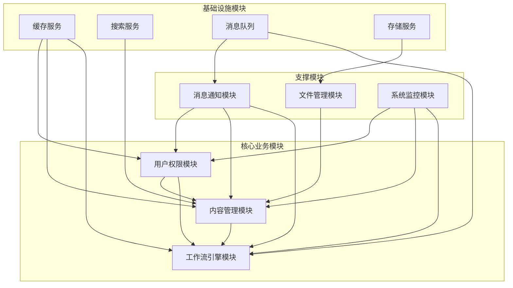

# Junmo Platform 功能分解设计

## 📋 文档信息

| 项目 | 内容 |
|------|------|
| **文档名称** | Junmo Platform 功能分解设计 |
| **版本号** | v1.0.0 |
| **创建日期** | 2025-12-24 |
| **作者** | 系统架构师 |
| **审核人** | 技术架构师 |
| **批准人** | 项目经理 |

## 🎯 功能架构概述

Junmo Platform企业级智能管理平台的功能架构基于模块化设计理念，采用分层解耦的方式组织功能模块。每个功能模块都有明确的职责边界和接口定义，支持独立开发、测试和部署。

## 🏗️ 核心功能模块分解

### 1. 用户权限管理模块 (User & Permission Module)

#### 1.1 用户注册功能

**功能描述**: 提供多种渠道的用户注册能力，支持邮箱注册、手机号注册和第三方OAuth登录

**技术实现**:

```java
@RestController
@RequestMapping("/api/v1/auth")
@Validated
@Slf4j
public class AuthController {
    
    @Autowired
    private UserRegistrationService userRegistrationService;
    
    @Autowired
    private CaptchaService captchaService;
    
    /**
     * 邮箱注册
     */
    @PostMapping("/register/email")
    public ResponseEntity<ApiResponse<RegisterResult>> registerByEmail(
            @Valid @RequestBody EmailRegisterRequest request) {
        
        log.info("Email registration request for: {}", request.getEmail());
        
        // 1. 验证图形验证码
        captchaService.validateCaptcha(request.getCaptchaKey(), request.getCaptchaCode());
        
        // 2. 发送邮箱验证码
        String verificationCode = userRegistrationService.sendEmailVerification(request.getEmail());
        
        // 3. 缓存验证码
        userRegistrationService.cacheVerificationCode(request.getEmail(), verificationCode);
        
        return ResponseEntity.ok(ApiResponse.success(
            RegisterResult.builder()
                .step("EMAIL_VERIFICATION_SENT")
                .message("验证码已发送到您的邮箱")
                .build()
        ));
    }
    
    /**
     * 验证邮箱并完成注册
     */
    @PostMapping("/register/email/verify")
    public ResponseEntity<ApiResponse<UserDTO>> verifyEmailAndRegister(
            @Valid @RequestBody EmailVerifyRequest request) {
        
        log.info("Email verification for: {}", request.getEmail());
        
        // 1. 验证邮箱验证码
        userRegistrationService.validateEmailCode(request.getEmail(), request.getVerificationCode());
        
        // 2. 创建用户
        CreateUserCommand command = CreateUserCommand.builder()
            .username(request.getUsername())
            .email(request.getEmail())
            .password(request.getPassword())
            .firstName(request.getFirstName())
            .lastName(request.getLastName())
            .registrationType(RegistrationType.EMAIL)
            .build();
        
        User user = userRegistrationService.registerUser(command);
        
        return ResponseEntity.status(HttpStatus.CREATED)
            .body(ApiResponse.success(UserMapper.toDTO(user)));
    }
    
    /**
     * 手机号注册
     */
    @PostMapping("/register/phone")
    public ResponseEntity<ApiResponse<RegisterResult>> registerByPhone(
            @Valid @RequestBody PhoneRegisterRequest request) {
        
        log.info("Phone registration request for: {}", request.getPhoneNumber());
        
        // 1. 发送短信验证码
        String smsCode = userRegistrationService.sendSmsVerification(request.getPhoneNumber());
        
        // 2. 缓存验证码
        userRegistrationService.cacheSmsCode(request.getPhoneNumber(), smsCode);
        
        return ResponseEntity.ok(ApiResponse.success(
            RegisterResult.builder()
                .step("SMS_VERIFICATION_SENT")
                .message("验证码已发送到您的手机")
                .build()
        ));
    }
    
    /**
     * 第三方OAuth登录
     */
    @PostMapping("/oauth/{provider}")
    public ResponseEntity<ApiResponse<OAuthResult>> oauthLogin(
            @PathVariable String provider,
            @RequestBody OAuthRequest request) {
        
        log.info("OAuth login request for provider: {}", provider);
        
        // 1. 验证OAuth token
        OAuthUserInfo userInfo = oauthService.validateOAuthToken(provider, request.getAccessToken());
        
        // 2. 查找或创建用户
        User user = userRegistrationService.findOrCreateOAuthUser(provider, userInfo);
        
        // 3. 生成JWT token
        String jwtToken = jwtTokenService.generateToken(user);
        
        return ResponseEntity.ok(ApiResponse.success(
            OAuthResult.builder()
                .user(UserMapper.toDTO(user))
                .token(jwtToken)
                .isNewUser(user.getCreatedAt().isAfter(LocalDateTime.now().minusMinutes(5)))
                .build()
        ));
    }
}
```

**服务层实现**:

```java
@Service
@Transactional
public class UserRegistrationService {
    
    @Autowired
    private UserRepository userRepository;
    
    @Autowired
    private RoleRepository roleRepository;
    
    @Autowired
    private PasswordEncoder passwordEncoder;
    
    @Autowired
    private EmailService emailService;
    
    @Autowired
    private SmsService smsService;
    
    @Autowired
    private RedisTemplate<String, String> redisTemplate;
    
    /**
     * 发送邮箱验证码
     */
    public String sendEmailVerification(String email) {
        // 1. 生成6位数字验证码
        String verificationCode = generateVerificationCode();
        
        // 2. 发送邮件
        EmailRequest emailRequest = EmailRequest.builder()
            .to(email)
            .subject("Junmo Platform - 邮箱验证码")
            .template("email-verification")
            .variable("verificationCode", verificationCode)
            .variable("expirationMinutes", 10)
            .build();
        
        emailService.send(emailRequest);
        
        return verificationCode;
    }
    
    /**
     * 注册用户
     */
    public User registerUser(CreateUserCommand command) {
        // 1. 验证用户名唯一性
        if (userRepository.existsByUsername(command.getUsername())) {
            throw new UserAlreadyExistsException("用户名已存在: " + command.getUsername());
        }
        
        // 2. 验证邮箱唯一性
        if (userRepository.existsByEmail(command.getEmail())) {
            throw new UserAlreadyExistsException("邮箱已存在: " + command.getEmail());
        }
        
        // 3. 密码加密
        String encodedPassword = passwordEncoder.encode(command.getPassword());
        
        // 4. 创建用户实体
        User user = User.create(command.getUsername(), command.getEmail(), encodedPassword);
        user.setFirstName(command.getFirstName());
        user.setLastName(command.getLastName());
        user.setRegistrationType(command.getRegistrationType());
        
        // 5. 分配默认角色
        assignDefaultRole(user);
        
        // 6. 保存用户
        User savedUser = userRepository.save(user);
        
        // 7. 发送欢迎邮件
        sendWelcomeEmail(savedUser);
        
        // 8. 发布事件
        DomainEventPublisher.publish(new UserRegisteredEvent(savedUser.getId()));
        
        return savedUser;
    }
    
    private String generateVerificationCode() {
        return String.format("%06d", new Random().nextInt(1000000));
    }
    
    private void assignDefaultRole(User user) {
        Role defaultRole = roleRepository.findByName("USER")
            .orElseThrow(() -> new RoleNotFoundException("默认角色不存在"));
        
        user.assignRole(defaultRole);
    }
    
    private void sendWelcomeEmail(User user) {
        EmailRequest emailRequest = EmailRequest.builder()
            .to(user.getEmail())
            .subject("欢迎加入Junmo Platform")
            .template("welcome-email")
            .variable("userName", user.getUsername())
            .build();
        
        emailService.send(emailRequest);
    }
}
```

#### 1.2 身份认证功能

**功能描述**: 提供安全的身份认证机制，支持多种认证方式和会话管理

**技术实现**:

```java
@Service
public class AuthenticationService {
    
    @Autowired
    private AuthenticationManager authenticationManager;
    
    @Autowired
    private JwtTokenService jwtTokenService;
    
    @Autowired
    private UserSessionService userSessionService;
    
    @Autowired
    private MfaService mfaService;
    
    /**
     * 用户登录
     */
    public LoginResult login(LoginCommand command) {
        // 1. 身份认证
        Authentication authentication = authenticationManager.authenticate(
            new UsernamePasswordAuthenticationToken(
                command.getUsername(),
                command.getPassword()
            )
        );
        
        // 2. 获取用户信息
        User user = (User) authentication.getPrincipal();
        
        // 3. 检查MFA要求
        if (user.isMfaEnabled()) {
            return handleMfaLogin(user, command);
        }
        
        // 4. 生成JWT token
        String accessToken = jwtTokenService.generateAccessToken(user);
        String refreshToken = jwtTokenService.generateRefreshToken(user);
        
        // 5. 创建用户会话
        UserSession session = userSessionService.createSession(
            user.getId(),
            command.getIpAddress(),
            command.getUserAgent(),
            refreshToken
        );
        
        // 6. 更新登录信息
        user.updateLoginInfo(command.getIpAddress());
        userRepository.save(user);
        
        return LoginResult.builder()
            .accessToken(accessToken)
            .refreshToken(refreshToken)
            .sessionId(session.getId())
            .user(UserMapper.toDTO(user))
            .expiresIn(jwtTokenService.getAccessTokenExpiration())
            .build();
    }
    
    /**
     * 多因子认证登录
     */
    private LoginResult handleMfaLogin(User user, LoginCommand command) {
        // 1. 生成MFA挑战
        String challengeId = mfaService.generateChallenge(user.getId());
        
        // 2. 发送MFA验证码
        mfaService.sendMfaCode(user.getId(), user.getMfaMethod());
        
        return LoginResult.builder()
            .step("MFA_REQUIRED")
            .challengeId(challengeId)
            .mfaMethod(user.getMfaMethod())
            .message("请输入多因子验证码")
            .build();
    }
    
    /**
     * 验证MFA并完成登录
     */
    public LoginResult verifyMfaAndLogin(MfaVerificationCommand command) {
        // 1. 验证MFA挑战
        MfaChallenge challenge = mfaService.getChallenge(command.getChallengeId());
        if (challenge == null || challenge.isExpired()) {
            throw new InvalidMfaChallengeException("MFA挑战无效或已过期");
        }
        
        // 2. 验证MFA代码
        boolean mfaValid = mfaService.verifyCode(
            challenge.getUserId(),
            command.getCode(),
            challenge.getMethod()
        );
        
        if (!mfaValid) {
            throw new InvalidMfaCodeException("MFA验证码错误");
        }
        
        // 3. 获取用户并生成token
        User user = userRepository.findById(challenge.getUserId())
            .orElseThrow(() -> new UserNotFoundException("用户不存在"));
        
        String accessToken = jwtTokenService.generateAccessToken(user);
        String refreshToken = jwtTokenService.generateRefreshToken(user);
        
        // 4. 清除MFA挑战
        mfaService.clearChallenge(command.getChallengeId());
        
        return LoginResult.builder()
            .accessToken(accessToken)
            .refreshToken(refreshToken)
            .user(UserMapper.toDTO(user))
            .expiresIn(jwtTokenService.getAccessTokenExpiration())
            .build();
    }
}
```

#### 1.3 权限管理功能

**功能描述**: 基于RBAC模型的细粒度权限控制，支持动态权限分配和权限继承

**技术实现**:

```java
@Service
public class PermissionService {
    
    @Autowired
    private UserRepository userRepository;
    
    @Autowired
    private RoleRepository roleRepository;
    
    @Autowired
    private PermissionRepository permissionRepository;
    
    @Autowired
    private RedisTemplate<String, Object> redisTemplate;
    
    /**
     * 检查用户权限
     */
    public boolean hasPermission(Long userId, String resource, String action) {
        // 1. 从缓存获取用户权限
        Set<String> permissions = getUserPermissions(userId);
        
        // 2. 构建所需权限格式
        String requiredPermission = String.format("%s:%s", resource, action);
        
        // 3. 检查权限
        return permissions.contains(requiredPermission) ||
               permissions.contains(String.format("%s:*", resource)) ||
               permissions.contains("*:*");
    }
    
    /**
     * 获取用户权限列表
     */
    @Cacheable(value = "user_permissions", key = "#userId")
    public Set<String> getUserPermissions(Long userId) {
        User user = userRepository.findById(userId)
            .orElseThrow(() -> new UserNotFoundException("用户不存在"));
        
        return user.getPermissions();
    }
    
    /**
     * 分配角色权限
     */
    @Transactional
    public void assignRolePermission(Long roleId, Long permissionId) {
        Role role = roleRepository.findById(roleId)
            .orElseThrow(() -> new RoleNotFoundException("角色不存在"));
        
        Permission permission = permissionRepository.findById(permissionId)
            .orElseThrow(() -> new PermissionNotFoundException("权限不存在"));
        
        // 1. 检查权限是否已存在
        if (role.hasPermission(permission.getName())) {
            throw new PermissionAlreadyAssignedException("权限已分配给该角色");
        }
        
        // 2. 分配权限
        role.addPermission(permission);
        roleRepository.save(role);
        
        // 3. 清除相关用户权限缓存
        clearUserPermissionCache(role);
        
        // 4. 发布事件
        DomainEventPublisher.publish(new RolePermissionAssignedEvent(roleId, permissionId));
    }
    
    /**
     * 动态权限检查注解处理器
     */
    @Component
    public class PermissionCheckAspect {
        
        @Autowired
        private PermissionService permissionService;
        
        @Around("@annotation(requirePermission)")
        public Object checkPermission(ProceedingJoinPoint joinPoint, RequirePermission requirePermission) throws Throwable {
            // 1. 获取当前用户
            Authentication authentication = SecurityContextHolder.getContext().getAuthentication();
            if (authentication == null || !authentication.isAuthenticated()) {
                throw new AuthenticationException("用户未认证");
            }
            
            User user = (User) authentication.getPrincipal();
            
            // 2. 检查权限
            boolean hasPermission = permissionService.hasPermission(
                user.getId(),
                requirePermission.resource(),
                requirePermission.action()
            );
            
            if (!hasPermission) {
                throw new AccessDeniedException(
                    String.format("用户没有权限执行操作: %s:%s", 
                        requirePermission.resource(), requirePermission.action())
                );
            }
            
            // 3. 执行目标方法
            return joinPoint.proceed();
        }
    }
}
```

### 2. 内容管理模块 (Content Management Module)

#### 2.1 文档管理功能

**功能描述**: 提供完整的文档生命周期管理，支持富文本编辑、版本控制和协同编辑

**技术实现**:

```java
@Service
@Transactional
public class DocumentManagementService {
    
    @Autowired
    private DocumentRepository documentRepository;
    
    @Autowired
    private DocumentVersionService documentVersionService;
    
    @Autowired
    private DocumentSearchService documentSearchService;
    
    @Autowired
    private WorkflowService workflowService;
    
    /**
     * 创建文档
     */
    public Document createDocument(CreateDocumentCommand command) {
        // 1. 验证权限
        permissionService.checkPermission(command.getAuthorId(), "document", "create");
        
        // 2. 创建文档实体
        Document document = Document.create(
            command.getTitle(),
            command.getContent(),
            command.getAuthor(),
            command.getCategory()
        );
        
        // 3. 设置标签
        if (command.getTagIds() != null && !command.getTagIds().isEmpty()) {
            List<Tag> tags = tagRepository.findAllById(command.getTagIds());
            document.setTags(new HashSet<>(tags));
        }
        
        // 4. 设置访问权限
        document.setAccessLevel(command.getAccessLevel());
        document.setAllowedUsers(command.getAllowedUserIds());
        document.setAllowedRoles(command.getAllowedRoleIds());
        
        // 5. 保存文档
        Document savedDocument = documentRepository.save(document);
        
        // 6. 创建初始版本
        documentVersionService.createVersion(savedDocument, "初始版本");
        
        // 7. 更新搜索索引
        documentSearchService.indexDocument(savedDocument);
        
        // 8. 启动审核流程（如果需要）
        if (command.requiresReview()) {
            workflowService.startDocumentReviewProcess(savedDocument.getId());
        }
        
        // 9. 发布事件
        DomainEventPublisher.publish(new DocumentCreatedEvent(savedDocument.getId()));
        
        return savedDocument;
    }
    
    /**
     * 更新文档
     */
    public Document updateDocument(UpdateDocumentCommand command) {
        // 1. 获取文档
        Document document = documentRepository.findById(command.getDocumentId())
            .orElseThrow(() -> new DocumentNotFoundException("文档不存在"));
        
        // 2. 检查权限
        permissionService.checkDocumentPermission(
            command.getUserId(), 
            document, 
            "edit"
        );
        
        // 3. 检查文档状态
        if (document.isLocked()) {
            throw new DocumentLockedException("文档已被锁定，无法编辑");
        }
        
        // 4. 创建版本备份
        documentVersionService.createVersion(document, command.getChangeDescription());
        
        // 5. 更新文档内容
        document.updateContent(command.getContent(), command.getUpdatedBy());
        if (command.getTitle() != null) {
            document.setTitle(command.getTitle());
        }
        
        // 6. 更新标签
        if (command.getTagIds() != null) {
            List<Tag> tags = tagRepository.findAllById(command.getTagIds());
            document.setTags(new HashSet<>(tags));
        }
        
        // 7. 保存文档
        Document updatedDocument = documentRepository.save(document);
        
        // 8. 更新搜索索引
        documentSearchService.indexDocument(updatedDocument);
        
        // 9. 发布事件
        DomainEventPublisher.publish(new DocumentUpdatedEvent(updatedDocument.getId()));
        
        return updatedDocument;
    }
    
    /**
     * 协同编辑
     */
    @EventListener
    public void handleDocumentEditOperation(DocumentEditOperationEvent event) {
        // 1. 获取文档
        Document document = documentRepository.findById(event.getDocumentId())
            .orElseThrow(() -> new DocumentNotFoundException("文档不存在"));
        
        // 2. 应用编辑操作
        DocumentEditResult result = document.applyEditOperation(event.getOperation());
        
        // 3. 保存文档
        documentRepository.save(document);
        
        // 4. 广播编辑结果给其他协作者
        webSocketService.broadcastToDocumentEditors(
            event.getDocumentId(),
            DocumentEditMessage.builder()
                .operation(event.getOperation())
                .result(result)
                .editedBy(event.getUserId())
                .timestamp(LocalDateTime.now())
                .build()
        );
        
        // 5. 定期创建版本（每10分钟或每50次操作）
        if (shouldCreateVersion(document)) {
            documentVersionService.createVersion(document, "自动保存版本");
        }
    }
}
```

#### 2.2 富文本编辑器集成

**前端集成**:

```javascript
// 富文本编辑器配置
class RichTextEditor {
    constructor(container, options = {}) {
        this.container = container;
        this.options = {
            height: 500,
            language: 'zh-CN',
            toolbar: [
                ['style', ['style']],
                ['font', ['bold', 'italic', 'underline', 'strikethrough', 'superscript', 'subscript']],
                ['para', ['ul', 'ol', 'paragraph', 'height']],
                ['insert', ['picture', 'link', 'video', 'table', 'hr']],
                ['view', ['fullscreen', 'codeview', 'help']]
            ],
            callbacks: {
                onInit: () => this.onInit(),
                onChange: () => this.onChange(),
                onImageUpload: (files) => this.onImageUpload(files),
                onPaste: (e) => this.onPaste(e)
            },
            ...options
        };
        
        this.init();
    }
    
    init() {
        this.editor = $(this.container).summernote(this.options);
        this.setupCollaboration();
        this.setupAutoSave();
    }
    
    setupCollaboration() {
        // WebSocket连接用于协同编辑
        this.websocket = new WebSocket(`ws://localhost:8080/ws/document/${this.documentId}`);
        
        this.websocket.onmessage = (event) => {
            const message = JSON.parse(event.data);
            if (message.type === 'EDIT_OPERATION') {
                this.applyRemoteOperation(message.operation);
            }
        };
        
        // 监听本地编辑操作
        this.editor.on('summernote.change', () => {
            const operation = this.createEditOperation();
            this.websocket.send(JSON.stringify({
                type: 'EDIT_OPERATION',
                operation: operation,
                userId: this.currentUserId
            }));
        });
    }
    
    setupAutoSave() {
        // 自动保存功能
        let saveTimer;
        this.editor.on('summernote.change', () => {
            clearTimeout(saveTimer);
            saveTimer = setTimeout(() => {
                this.autoSave();
            }, 5000); // 5秒后自动保存
        });
    }
    
    async onImageUpload(files) {
        const file = files[0];
        const formData = new FormData();
        formData.append('file', file);
        formData.append('documentId', this.documentId);
        
        try {
            const response = await fetch('/api/v1/documents/upload-image', {
                method: 'POST',
                body: formData,
                headers: {
                    'Authorization': `Bearer ${this.authToken}`
                }
            });
            
            const result = await response.json();
            if (result.success) {
                this.editor.summernote('insertImage', result.data.url);
            }
        } catch (error) {
            console.error('Image upload failed:', error);
        }
    }
    
    autoSave() {
        const content = this.editor.summernote('code');
        
        fetch(`/api/v1/documents/${this.documentId}/auto-save`, {
            method: 'POST',
            headers: {
                'Content-Type': 'application/json',
                'Authorization': `Bearer ${this.authToken}`
            },
            body: JSON.stringify({
                content: content,
                timestamp: new Date().toISOString()
            })
        }).then(response => {
            if (response.ok) {
                this.showSaveStatus('已自动保存');
            }
        });
    }
}
```

### 3. 工作流引擎模块 (Workflow Engine Module)

#### 3.1 流程设计器功能

**功能描述**: 提供可视化的流程设计器，支持拖拽式流程设计和BPMN标准

**技术实现**:

```javascript
// BPMN流程设计器
class BpmnDesigner {
    constructor(container, options = {}) {
        this.container = container;
        this.options = {
            keyboard: {
                bindTo: window
            },
            propertiesPanel: {
                parent: '#properties-panel'
            },
            additionalModules: [
                BpmnPropertiesPanelModule,
                BpmnModelerModule
            ],
            moddleExtensions: {
                camunda: camundaModdleDescriptor
            },
            ...options
        };
        
        this.init();
    }
    
    init() {
        this.modeler = new BpmnModeler({
            container: this.container,
            ...this.options
        });
        
        this.setupEventListeners();
        this.loadDefaultDiagram();
    }
    
    setupEventListeners() {
        // 监听元素选择事件
        this.modeler.on('selection.changed', (event) => {
            const { newSelection } = event;
            this.onElementSelected(newSelection[0]);
        });
        
        // 监听元素变更事件
        this.modeler.on('element.changed', (event) => {
            const { element } = event;
            this.onElementChanged(element);
        });
        
        // 监听形状添加事件
        this.modeler.on('shape.added', (event) => {
            const { element } = event;
            this.onShapeAdded(element);
        });
    }
    
    async saveProcessDefinition() {
        try {
            const { xml } = await this.modeler.saveXML({ format: true });
            const { svg } = await this.modeler.saveSVG();
            
            const processDefinition = {
                name: this.getProcessName(),
                key: this.getProcessKey(),
                description: this.getProcessDescription(),
                bpmnXml: xml,
                svg: svg,
                version: this.getVersion()
            };
            
            const response = await fetch('/api/v1/process-definitions', {
                method: 'POST',
                headers: {
                    'Content-Type': 'application/json',
                    'Authorization': `Bearer ${this.authToken}`
                },
                body: JSON.stringify(processDefinition)
            });
            
            if (response.ok) {
                this.showSaveStatus('流程定义已保存');
                return await response.json();
            }
        } catch (error) {
            console.error('Save failed:', error);
            this.showSaveStatus('保存失败', 'error');
        }
    }
    
    async loadProcessDefinition(processDefinitionId) {
        try {
            const response = await fetch(`/api/v1/process-definitions/${processDefinitionId}`);
            const processDefinition = await response.json();
            
            await this.modeler.importXML(processDefinition.bpmnXml);
            this.setProcessInfo(processDefinition);
            
        } catch (error) {
            console.error('Load failed:', error);
        }
    }
    
    validateProcess() {
        const warnings = [];
        const errors = [];
        
        // 检查开始事件
        const startEvents = this.modeler.getDefinitions().rootElements[0].flowElements
            .filter(element => element.$type === 'bpmn:StartEvent');
        
        if (startEvents.length === 0) {
            errors.push('流程必须包含至少一个开始事件');
        }
        
        // 检查结束事件
        const endEvents = this.modeler.getDefinitions().rootElements[0].flowElements
            .filter(element => element.$type === 'bpmn:EndEvent');
        
        if (endEvents.length === 0) {
            errors.push('流程必须包含至少一个结束事件');
        }
        
        // 检查网关配置
        const gateways = this.modeler.getDefinitions().rootElements[0].flowElements
            .filter(element => element.$type === 'bpmn:ExclusiveGateway');
        
        gateways.forEach(gateway => {
            const outgoingFlows = gateway.outgoing || [];
            if (outgoingFlows.length < 2) {
                warnings.push(`排他网关 "${gateway.name || gateway.id}" 至少需要两条输出流`);
            }
        });
        
        return { warnings, errors };
    }
}
```

#### 3.2 流程执行引擎

**后端实现**:

```java
@Service
@Transactional
public class WorkflowExecutionService {
    
    @Autowired
    private ProcessEngine processEngine;
    
    @Autowired
    private TaskService taskService;
    
    @Autowired
    private RuntimeService runtimeService;
    
    @Autowired
    private HistoryService historyService;
    
    /**
     * 启动流程实例
     */
    public ProcessInstance startProcess(StartProcessCommand command) {
        // 1. 验证流程定义
        ProcessDefinition processDefinition = processEngine.getRepositoryService()
            .createProcessDefinitionQuery()
            .processDefinitionId(command.getProcessDefinitionId())
            .singleResult();
        
        if (processDefinition == null) {
            throw new ProcessDefinitionNotFoundException("流程定义不存在");
        }
        
        // 2. 准备启动变量
        Map<String, Object> variables = new HashMap<>(command.getVariables());
        variables.put("startUserId", command.getStartUserId());
        variables.put("businessKey", command.getBusinessKey());
        
        // 3. 启动流程实例
        ProcessInstance processInstance = runtimeService.startProcessInstanceById(
            command.getProcessDefinitionId(),
            command.getBusinessKey(),
            variables
        );
        
        // 4. 保存流程实例扩展信息
        saveProcessInstanceExtension(processInstance, command);
        
        // 5. 发布事件
        DomainEventPublisher.publish(new ProcessStartedEvent(
            processInstance.getId(),
            command.getStartUserId()
        ));
        
        return processInstance;
    }
    
    /**
     * 完成任务
     */
    public void completeTask(CompleteTaskCommand command) {
        // 1. 获取任务
        Task task = taskService.createTaskQuery()
            .taskId(command.getTaskId())
            .singleResult();
        
        if (task == null) {
            throw new TaskNotFoundException("任务不存在");
        }
        
        // 2. 验证任务分配
        if (!task.getAssignee().equals(command.getUserId().toString())) {
            throw new TaskNotAssignedException("任务未分配给当前用户");
        }
        
        // 3. 执行前置验证
        validateTaskCompletion(task, command);
        
        // 4. 添加审批意见
        if (command.getComment() != null) {
            taskService.addComment(command.getTaskId(), task.getProcessInstanceId(), command.getComment());
        }
        
        // 5. 处理附件
        if (command.getAttachments() != null) {
            handleTaskAttachments(command.getTaskId(), command.getAttachments());
        }
        
        // 6. 完成任务
        taskService.complete(command.getTaskId(), command.getVariables());
        
        // 7. 发布事件
        DomainEventPublisher.publish(new TaskCompletedEvent(
            command.getTaskId(),
            command.getUserId(),
            task.getProcessInstanceId()
        ));
    }
    
    /**
     * 驳回任务
     */
    public void rejectTask(RejectTaskCommand command) {
        // 1. 获取任务和流程实例
        Task task = taskService.createTaskQuery()
            .taskId(command.getTaskId())
            .singleResult();
        
        ProcessInstance processInstance = runtimeService.createProcessInstanceQuery()
            .processInstanceId(task.getProcessInstanceId())
            .singleResult();
        
        // 2. 添加驳回意见
        taskService.addComment(command.getTaskId(), task.getProcessInstanceId(), command.getReason());
        
        // 3. 驳回到指定节点
        if (command.getRejectToActivityId() != null) {
            runtimeService.createProcessInstanceModification(processInstance.getId())
                .startBeforeActivity(command.getRejectToActivityId())
                .cancelAllForActivity(task.getTaskDefinitionKey())
                .execute();
        } else {
            // 驳回到开始节点
            runtimeService.createProcessInstanceModification(processInstance.getId())
                .startBeforeActivity(processInstance.getStartActivityId())
                .cancelAllForActivity(task.getTaskDefinitionKey())
                .execute();
        }
        
        // 4. 发布事件
        DomainEventPublisher.publish(new TaskRejectedEvent(
            command.getTaskId(),
            command.getUserId(),
            command.getReason()
        ));
    }
    
    /**
     * 委派任务
     */
    public void delegateTask(DelegateTaskCommand command) {
        Task task = taskService.createTaskQuery()
            .taskId(command.getTaskId())
            .singleResult();
        
        if (task == null) {
            throw new TaskNotFoundException("任务不存在");
        }
        
        // 验证委派权限
        if (!task.getAssignee().equals(command.getUserId().toString())) {
            throw new TaskNotAssignedException("只有任务负责人可以委派任务");
        }
        
        // 执行委派
        taskService.delegateTask(command.getTaskId(), command.getDelegateUserId().toString());
        
        // 添加委派记录
        taskService.addComment(command.getTaskId(), task.getProcessInstanceId(), 
            String.format("任务已委派给用户 %s，委派原因：%s", 
                command.getDelegateUserId(), command.getReason()));
        
        // 发布事件
        DomainEventPublisher.publish(new TaskDelegatedEvent(
            command.getTaskId(),
            command.getUserId(),
            command.getDelegateUserId()
        ));
    }
}
```

## 📊 功能模块依赖关系

### 1. 模块依赖图



### 2. 接口依赖矩阵

| 模块 | 用户权限 | 内容管理 | 工作流引擎 | 消息通知 | 文件管理 |
|------|----------|----------|------------|----------|----------|
| 用户权限 | - | ✓用户信息 | ✓用户权限 | ✓通知用户 | - |
| 内容管理 | ✓权限检查 | - | ✓审核流程 | ✓内容通知 | ✓文件存储 |
| 工作流引擎 | ✓任务分配 | ✓流程触发 | - | ✓任务通知 | ✓流程附件 |
| 消息通知 | ✓用户通知 | ✓内容通知 | ✓流程通知 | - | - |
| 文件管理 | - | ✓文档存储 | ✓流程附件 | - | - |

## 🚀 功能实现优先级

### 1. MVP功能集 (v1.0)

| 功能模块 | 功能点 | 优先级 | 工期(天) | 依赖 |
|----------|--------|--------|----------|------|
| 用户权限 | 用户注册/登录 | P0 | 5 | - |
| 用户权限 | 基础权限管理 | P0 | 3 | 用户注册 |
| 内容管理 | 文档CRUD | P0 | 7 | 用户权限 |
| 内容管理 | 基础搜索 | P1 | 5 | 文档CRUD |
| 工作流引擎 | 简单审批流 | P1 | 10 | 内容管理 |
| 消息通知 | 邮件通知 | P1 | 3 | 用户权限 |

### 2. 增强功能集 (v2.0)

| 功能模块 | 功能点 | 优先级 | 工期(天) | 依赖 |
|----------|--------|--------|----------|------|
| 用户权限 | 多因子认证 | P0 | 5 | 基础权限 |
| 内容管理 | 富文本编辑 | P0 | 8 | 文档CRUD |
| 内容管理 | 协同编辑 | P1 | 12 | 富文本编辑 |
| 工作流引擎 | 可视化设计器 | P0 | 15 | 简单审批流 |
| 工作流引擎 | 复杂流程支持 | P1 | 10 | 可视化设计器 |
| 文件管理 | 分布式存储 | P0 | 7 | 基础存储 |

### 3. 扩展功能集 (v3.0)

| 功能模块 | 功能点 | 优先级 | 工期(天) | 依赖 |
|----------|--------|--------|----------|------|
| 用户权限 | OAuth集成 | P1 | 6 | 基础权限 |
| 内容管理 | AI内容推荐 | P2 | 15 | 协同编辑 |
| 工作流引擎 | 性能优化 | P1 | 8 | 复杂流程 |
| 消息通知 | 多渠道推送 | P1 | 10 | 邮件通知 |
| 系统监控 | 实时监控 | P0 | 8 | 基础模块 |

## 🧪 功能测试实现

### 1. 单元测试框架

```java
@ExtendWith(MockitoExtension.class)
class DocumentManagementServiceTest {
    
    @Mock
    private DocumentRepository documentRepository;
    
    @Mock
    private DocumentVersionService documentVersionService;
    
    @Mock
    private DocumentSearchService documentSearchService;
    
    @Mock
    private PermissionService permissionService;
    
    @InjectMocks
    private DocumentManagementService documentManagementService;
    
    @Test
    @DisplayName("创建文档 - 成功")
    void createDocument_Success() {
        // Given
        CreateDocumentCommand command = CreateDocumentCommand.builder()
            .title("测试文档")
            .content("测试内容")
            .authorId(1L)
            .categoryId(1L)
            .accessLevel(AccessLevel.PUBLIC)
            .build();
        
        User author = User.builder()
            .id(1L)
            .username("testuser")
            .build();
        
        Category category = Category.builder()
            .id(1L)
            .name("测试分类")
            .build();
        
        Document savedDocument = Document.builder()
            .id(1L)
            .title("测试文档")
            .content("测试内容")
            .author(author)
            .category(category)
            .status(DocumentStatus.DRAFT)
            .build();
        
        when(documentRepository.save(any(Document.class))).thenReturn(savedDocument);
        
        // When
        Document result = documentManagementService.createDocument(command);
        
        // Then
        assertThat(result.getTitle()).isEqualTo("测试文档");
        assertThat(result.getContent()).isEqualTo("测试内容");
        assertThat(result.getStatus()).isEqualTo(DocumentStatus.DRAFT);
        
        verify(documentRepository).save(any(Document.class));
        verify(documentVersionService).createVersion(any(Document.class), eq("初始版本"));
        verify(documentSearchService).indexDocument(any(Document.class));
    }
    
    @Test
    @DisplayName("创建文档 - 权限不足")
    void createDocument_InsufficientPermission() {
        // Given
        CreateDocumentCommand command = CreateDocumentCommand.builder()
            .title("测试文档")
            .authorId(1L)
            .build();
        
        doThrow(new AccessDeniedException("权限不足"))
            .when(permissionService).checkPermission(eq(1L), eq("document"), eq("create"));
        
        // When & Then
        assertThrows(AccessDeniedException.class, () -> {
            documentManagementService.createDocument(command);
        });
        
        verify(documentRepository, never()).save(any(Document.class));
    }
}
```

### 2. 集成测试框架

```java
@SpringBootTest
@TestPropertySource(properties = {
    "spring.datasource.url=jdbc:h2:mem:testdb",
    "spring.jpa.hibernate.ddl-auto=create-drop"
})
@Transactional
class DocumentControllerIntegrationTest {
    
    @Autowired
    private TestRestTemplate restTemplate;
    
    @Autowired
    private DocumentRepository documentRepository;
    
    @Autowired
    private UserRepository userRepository;
    
    @Autowired
    private CategoryRepository categoryRepository;
    
    private String authToken;
    
    @BeforeEach
    void setUp() {
        // 创建测试用户并获取token
        User testUser = User.builder()
            .username("testuser")
            .email("test@example.com")
            .password("password")
            .status(UserStatus.ACTIVE)
            .build();
        userRepository.save(testUser);
        
        LoginRequest loginRequest = LoginRequest.builder()
            .username("testuser")
            .password("password")
            .build();
        
        ResponseEntity<ApiResponse<LoginResult>> loginResponse = restTemplate.postForEntity(
            "/api/v1/auth/login", loginRequest, 
            new ParameterizedTypeReference<ApiResponse<LoginResult>>() {});
        
        authToken = loginResponse.getBody().getData().getAccessToken();
    }
    
    @Test
    @DisplayName("创建文档 - 集成测试")
    void createDocument_Integration() {
        // Given
        CreateDocumentRequest request = CreateDocumentRequest.builder()
            .title("集成测试文档")
            .content("这是集成测试内容")
            .categoryId(1L)
            .accessLevel("PUBLIC")
            .build();
        
        HttpHeaders headers = new HttpHeaders();
        headers.setBearerAuth(authToken);
        HttpEntity<CreateDocumentRequest> entity = new HttpEntity<>(request, headers);
        
        // When
        ResponseEntity<ApiResponse<DocumentDTO>> response = restTemplate.postForEntity(
            "/api/v1/documents", entity, 
            new ParameterizedTypeReference<ApiResponse<DocumentDTO>>() {});
        
        // Then
        assertThat(response.getStatusCode()).isEqualTo(HttpStatus.CREATED);
        assertThat(response.getBody().getData().getTitle()).isEqualTo("集成测试文档");
        assertThat(response.getBody().getData().getContent()).isEqualTo("这是集成测试内容");
        
        // 验证数据库中的数据
        Document savedDocument = documentRepository.findById(response.getBody().getData().getId()).orElse(null);
        assertThat(savedDocument).isNotNull();
        assertThat(savedDocument.getTitle()).isEqualTo("集成测试文档");
    }
}
```

---

*本文档提供了详细的功能分解设计，包括具体的实现代码、配置示例和测试策略，为开发团队提供了完整的功能实现指导。*