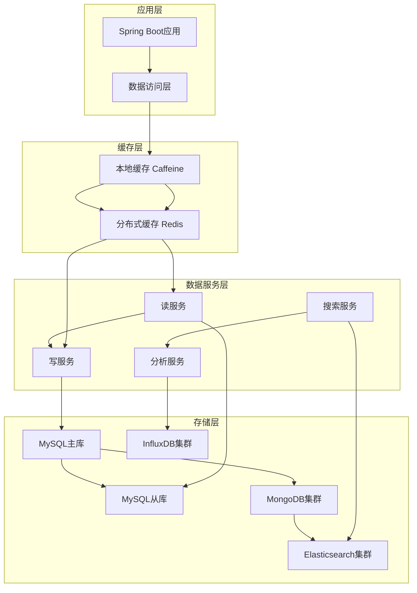

# Spring4demo 数据架构设计

## 📋 文档信息

| 项目 | 内容 |
|------|------|
| **文档名称** | Spring4demo 数据架构设计 |
| **版本号** | v1.1.0 |
| **创建日期** | 2025-12-24 |
| **更新日期** | 2026-01-07 |
| **作者** | 数据架构师 |
| **审核人** | 数据库管理员 |
| **批准人** | 技术总监 |

## 📝 更新说明

**v1.2.0 (2026-01-07)**:
- 架构定位从微服务架构调整为单体Spring Boot应用
- 去掉微服务相关组件
- 保留MongoDB、Elasticsearch、Neo4j、InfluxDB等数据存储
- 更新数据存储技术栈，反映单体应用架构

**v1.1.0 (2026-01-07)**:
- 主键策略从AUTO_INCREMENT调整为雪花算法
- 更新所有表的主键定义，使用雪花算法生成唯一ID
- 添加表注释和字段注释

## 🎯 数据架构概述

Spring4demo采用多层数据架构设计，结合关系型数据库、NoSQL数据库、缓存系统和搜索引擎，构建高性能、高可用、可扩展的数据存储体系。整个架构支持数据分层存储、读写分离、分库分表和实时数据同步。

## 🏗️ 存储技术架构

### 1. 数据存储选型

**技术栈组合**:
```yaml
# 数据存储技术栈
storage_stack:
  relational_database:
    engine: "MySQL 8.0"
    purpose: "核心业务数据存储"
    features:
      - "ACID事务支持"
      - "强一致性"
      - "复杂查询"
      - "数据完整性"
    
  document_database:
    engine: "MongoDB 6.0.8"
    purpose: "文档型数据存储"
    features:
      - "灵活的数据模型"
      - "水平扩展"
      - "全文搜索"
      - "版本控制"
    
  cache_database:
    engine: "Redis 7.0"
    purpose: "高速缓存存储"
    features:
      - "内存存储"
      - "数据结构丰富"
      - "持久化支持"
      - "高并发"
    
  search_engine:
    engine: "Elasticsearch 8.8.0"
    purpose: "全文搜索和分析"
    features:
      - "全文搜索"
      - "实时分析"
      - "聚合查询"
      - "地理空间搜索"
    
  time_series_database:
    engine: "InfluxDB 2.7.0"
    purpose: "时序数据存储"
    features:
      - "时间序列优化"
      - "高写入性能"
      - "数据压缩"
      - "实时监控"
```

### 2. 数据分层架构



**分层实现策略**:

```java
// 数据访问路由配置
@Configuration
public class DataRoutingConfig {
    
    @Bean
    @Primary
    public DataSource masterDataSource() {
        HikariDataSource dataSource = new HikariDataSource();
        dataSource.setJdbcUrl("jdbc:mysql://mysql-master:3306/spring4demo");
        dataSource.setUsername("spring4demo");
        dataSource.setPassword("password");
        dataSource.setDriverClassName("com.mysql.cj.jdbc.Driver");
        
        // 连接池配置
        dataSource.setMaximumPoolSize(20);
        dataSource.setMinimumIdle(5);
        dataSource.setIdleTimeout(300000);
        dataSource.setMaxLifetime(1200000);
        dataSource.setConnectionTimeout(20000);
        
        return dataSource;
    }
    
    @Bean
    public DataSource slaveDataSource() {
        HikariDataSource dataSource = new HikariDataSource();
        dataSource.setJdbcUrl("jdbc:mysql://mysql-slave:3306/spring4demo");
        dataSource.setUsername("spring4demo");
        dataSource.setPassword("password");
        dataSource.setDriverClassName("com.mysql.cj.jdbc.Driver");
        
        dataSource.setMaximumPoolSize(20);
        dataSource.setMinimumIdle(5);
        dataSource.setIdleTimeout(300000);
        dataSource.setMaxLifetime(1200000);
        dataSource.setConnectionTimeout(20000);
        
        return dataSource;
    }
    
    @Bean
    public DataSource routingDataSource() {
        RoutingDataSource routingDataSource = new RoutingDataSource();
        Map<Object, Object> dataSourceMap = new HashMap<>();
        dataSourceMap.put("master", masterDataSource());
        dataSourceMap.put("slave", slaveDataSource());
        routingDataSource.setTargetDataSources(dataSourceMap);
        routingDataSource.setDefaultTargetDataSource(masterDataSource());
        return routingDataSource;
    }
}

// 读写分离注解
@Target({ElementType.METHOD, ElementType.TYPE})
@Retention(RetentionPolicy.RUNTIME)
public @interface ReadOnly {
}

// 读写分离AOP
@Aspect
@Component
public class DataSourceAspect {
    
    @Before("@annotation(readOnly)")
    public void setReadDataSource(ReadOnly readOnly) {
        DataSourceContextHolder.setDataSource("slave");
    }
    
    @Before("@annotation(org.springframework.transaction.annotation.Transactional)")
    public void setWriteDataSource(Transactional transactional) {
        if (!transactional.readOnly()) {
            DataSourceContextHolder.setDataSource("master");
        }
    }
    
    @After("@annotation(ReadOnly) || @annotation(org.springframework.transaction.annotation.Transactional)")
    public void clearDataSource() {
        DataSourceContextHolder.clearDataSource();
    }
}

// 数据源上下文
public class DataSourceContextHolder {
    private static final ThreadLocal<String> contextHolder = new ThreadLocal<>();
    
    public static void setDataSource(String dataSourceType) {
        contextHolder.set(dataSourceType);
    }
    
    public static String getDataSource() {
        return contextHolder.get();
    }
    
    public static void clearDataSource() {
        contextHolder.remove();
    }
}
```

## 🗄️ 数据库设计

### 1. MySQL数据库设计

#### 1.1 用户权限表设计

```sql
-- 用户表
CREATE TABLE sys_user (
    id BIGINT PRIMARY KEY COMMENT '主键ID（雪花算法）',
    username VARCHAR(50) UNIQUE NOT NULL COMMENT '用户名',
    email VARCHAR(100) UNIQUE NOT NULL COMMENT '邮箱',
    password VARCHAR(255) NOT NULL COMMENT '密码',
    real_name VARCHAR(100) COMMENT '真实姓名',
    phone_number VARCHAR(20) COMMENT '手机号',
    avatar_url VARCHAR(255) COMMENT '头像URL',
    status INT DEFAULT 1 COMMENT '用户状态（1-启用，0-禁用）',
    last_login_time TIMESTAMP NULL COMMENT '最后登录时间',
    last_login_ip VARCHAR(45) COMMENT '最后登录IP',
    login_count INT DEFAULT 0 COMMENT '登录次数',
    email_verified BOOLEAN DEFAULT FALSE COMMENT '邮箱是否验证',
    phone_verified BOOLEAN DEFAULT FALSE COMMENT '手机是否验证',
    tenant_id BIGINT COMMENT '租户ID',
    created_at TIMESTAMP DEFAULT CURRENT_TIMESTAMP COMMENT '创建时间',
    updated_at TIMESTAMP DEFAULT CURRENT_TIMESTAMP ON UPDATE CURRENT_TIMESTAMP COMMENT '更新时间',
    created_by BIGINT COMMENT '创建人',
    updated_by BIGINT COMMENT '更新人',

    INDEX idx_username (username),
    INDEX idx_email (email),
    INDEX idx_status (status),
    INDEX idx_tenant_id (tenant_id),
    INDEX idx_created_at (created_at)
) ENGINE=InnoDB DEFAULT CHARSET=utf8mb4 COLLATE=utf8mb4_unicode_ci COMMENT='用户表';

-- 角色表
CREATE TABLE roles (
    id BIGINT PRIMARY KEY COMMENT '主键ID（雪花算法）',
    name VARCHAR(50) UNIQUE NOT NULL COMMENT '角色名称',
    description VARCHAR(255) COMMENT '角色描述',
    role_type ENUM('SYSTEM', 'BUSINESS', 'CUSTOM') DEFAULT 'CUSTOM' COMMENT '角色类型',
    is_system BOOLEAN DEFAULT FALSE COMMENT '是否系统角色',
    sort_order INT DEFAULT 0 COMMENT '排序',
    status ENUM('ACTIVE', 'INACTIVE') DEFAULT 'ACTIVE' COMMENT '状态',
    created_at TIMESTAMP DEFAULT CURRENT_TIMESTAMP COMMENT '创建时间',
    updated_at TIMESTAMP DEFAULT CURRENT_TIMESTAMP ON UPDATE CURRENT_TIMESTAMP COMMENT '更新时间',
    
    INDEX idx_name (name),
    INDEX idx_role_type (role_type),
    INDEX idx_status (status)
) ENGINE=InnoDB DEFAULT CHARSET=utf8mb4 COLLATE=utf8mb4_unicode_ci COMMENT='角色表';

-- 权限表
CREATE TABLE permissions (
    id BIGINT PRIMARY KEY COMMENT '主键ID（雪花算法）',
    name VARCHAR(100) UNIQUE NOT NULL COMMENT '权限名称',
    resource VARCHAR(100) NOT NULL COMMENT '资源',
    action VARCHAR(50) NOT NULL COMMENT '操作',
    description VARCHAR(255) COMMENT '权限描述',
    created_at TIMESTAMP DEFAULT CURRENT_TIMESTAMP COMMENT '创建时间',
    
    INDEX idx_resource (resource),
    INDEX idx_action (action),
    INDEX idx_name (name)
) ENGINE=InnoDB DEFAULT CHARSET=utf8mb4 COLLATE=utf8mb4_unicode_ci COMMENT='权限表';

-- 用户角色关联表
CREATE TABLE user_roles (
    id BIGINT PRIMARY KEY COMMENT '主键ID（雪花算法）',
    user_id BIGINT NOT NULL COMMENT '用户ID',
    role_id BIGINT NOT NULL COMMENT '角色ID',
    assigned_at TIMESTAMP DEFAULT CURRENT_TIMESTAMP COMMENT '分配时间',
    assigned_by BIGINT COMMENT '分配人',

    FOREIGN KEY (user_id) REFERENCES sys_user(id) ON DELETE CASCADE,
    FOREIGN KEY (role_id) REFERENCES roles(id) ON DELETE CASCADE,
    UNIQUE KEY uk_user_role (user_id, role_id),
    INDEX idx_user_id (user_id),
    INDEX idx_role_id (role_id)
) ENGINE=InnoDB DEFAULT CHARSET=utf8mb4 COLLATE=utf8mb4_unicode_ci COMMENT='用户角色关联表';

-- 角色权限关联表
CREATE TABLE role_permissions (
    id BIGINT PRIMARY KEY COMMENT '主键ID（雪花算法）',
    role_id BIGINT NOT NULL COMMENT '角色ID',
    permission_id BIGINT NOT NULL COMMENT '权限ID',
    granted_at TIMESTAMP DEFAULT CURRENT_TIMESTAMP COMMENT '授权时间',
    granted_by BIGINT COMMENT '授权人',
    
    FOREIGN KEY (role_id) REFERENCES roles(id) ON DELETE CASCADE,
    FOREIGN KEY (permission_id) REFERENCES permissions(id) ON DELETE CASCADE,
    UNIQUE KEY uk_role_permission (role_id, permission_id),
    INDEX idx_role_id (role_id),
    INDEX idx_permission_id (permission_id)
) ENGINE=InnoDB DEFAULT CHARSET=utf8mb4 COLLATE=utf8mb4_unicode_ci COMMENT='角色权限关联表';
```

#### 1.2 内容管理表设计

```sql
-- 文档表
CREATE TABLE documents (
    id BIGINT PRIMARY KEY COMMENT '主键ID（雪花算法）',
    title VARCHAR(255) NOT NULL COMMENT '标题',
    content LONGTEXT COMMENT '内容',
    category_id BIGINT COMMENT '分类ID',
    author_id BIGINT NOT NULL COMMENT '作者ID',
    status ENUM('DRAFT', 'PUBLISHED', 'ARCHIVED', 'DELETED') DEFAULT 'DRAFT' COMMENT '状态',
    version INT DEFAULT 1 COMMENT '版本号',
    access_level ENUM('PUBLIC', 'PRIVATE', 'RESTRICTED') DEFAULT 'PUBLIC' COMMENT '访问级别',
    view_count INT DEFAULT 0 COMMENT '查看次数',
    like_count INT DEFAULT 0 COMMENT '点赞次数',
    published_at TIMESTAMP NULL COMMENT '发布时间',
    created_at TIMESTAMP DEFAULT CURRENT_TIMESTAMP COMMENT '创建时间',
    updated_at TIMESTAMP DEFAULT CURRENT_TIMESTAMP ON UPDATE CURRENT_TIMESTAMP COMMENT '更新时间',
    created_by BIGINT COMMENT '创建人',
    updated_by BIGINT COMMENT '更新人',
    
    FOREIGN KEY (category_id) REFERENCES categories(id),
    FOREIGN KEY (author_id) REFERENCES users(id),
    INDEX idx_title (title),
    INDEX idx_category_id (category_id),
    INDEX idx_author_id (author_id),
    INDEX idx_status (status),
    INDEX idx_created_at (created_at),
    INDEX idx_published_at (published_at),
    FULLTEXT KEY ft_title_content (title, content)
) ENGINE=InnoDB DEFAULT CHARSET=utf8mb4 COLLATE=utf8mb4_unicode_ci COMMENT='文档表';

-- 分类表
CREATE TABLE categories (
    id BIGINT PRIMARY KEY COMMENT '主键ID（雪花算法）',
    name VARCHAR(100) NOT NULL COMMENT '分类名称',
    parent_id BIGINT COMMENT '父分类ID',
    description TEXT COMMENT '描述',
    sort_order INT DEFAULT 0 COMMENT '排序',
    status ENUM('ACTIVE', 'INACTIVE') DEFAULT 'ACTIVE' COMMENT '状态',
    created_at TIMESTAMP DEFAULT CURRENT_TIMESTAMP COMMENT '创建时间',
    updated_at TIMESTAMP DEFAULT CURRENT_TIMESTAMP ON UPDATE CURRENT_TIMESTAMP COMMENT '更新时间',
    
    FOREIGN KEY (parent_id) REFERENCES categories(id),
    INDEX idx_parent_id (parent_id),
    INDEX idx_name (name),
    INDEX idx_status (status),
    INDEX idx_sort_order (sort_order)
) ENGINE=InnoDB DEFAULT CHARSET=utf8mb4 COLLATE=utf8mb4_unicode_ci COMMENT='分类表';

-- 标签表
CREATE TABLE tags (
    id BIGINT PRIMARY KEY COMMENT '主键ID（雪花算法）',
    name VARCHAR(50) UNIQUE NOT NULL COMMENT '标签名称',
    color VARCHAR(7) DEFAULT '#1890ff' COMMENT '颜色',
    description VARCHAR(255) COMMENT '描述',
    usage_count INT DEFAULT 0 COMMENT '使用次数',
    created_at TIMESTAMP DEFAULT CURRENT_TIMESTAMP COMMENT '创建时间',
    
    INDEX idx_name (name),
    INDEX idx_usage_count (usage_count)
) ENGINE=InnoDB DEFAULT CHARSET=utf8mb4 COLLATE=utf8mb4_unicode_ci COMMENT='标签表';

-- 文档标签关联表
CREATE TABLE document_tags (
    id BIGINT PRIMARY KEY COMMENT '主键ID（雪花算法）',
    document_id BIGINT NOT NULL COMMENT '文档ID',
    tag_id BIGINT NOT NULL COMMENT '标签ID',
    created_at TIMESTAMP DEFAULT CURRENT_TIMESTAMP COMMENT '创建时间',
    
    FOREIGN KEY (document_id) REFERENCES documents(id) ON DELETE CASCADE,
    FOREIGN KEY (tag_id) REFERENCES tags(id) ON DELETE CASCADE,
    UNIQUE KEY uk_document_tag (document_id, tag_id),
    INDEX idx_document_id (document_id),
    INDEX idx_tag_id (tag_id)
) ENGINE=InnoDB DEFAULT CHARSET=utf8mb4 COLLATE=utf8mb4_unicode_ci COMMENT='文档标签关联表';
```

#### 1.3 工作流表设计

```sql
-- 流程定义表
CREATE TABLE process_definitions (
    id BIGINT PRIMARY KEY COMMENT '主键ID（雪花算法）',
    name VARCHAR(255) NOT NULL COMMENT '流程名称',
    key VARCHAR(255) UNIQUE NOT NULL COMMENT '流程键',
    version INT DEFAULT 1 COMMENT '版本',
    description TEXT COMMENT '描述',
    bpmn_xml LONGTEXT NOT NULL COMMENT 'BPMN XML',
    svg_data LONGTEXT COMMENT 'SVG数据',
    status ENUM('ACTIVE', 'INACTIVE', 'DEPRECATED') DEFAULT 'ACTIVE' COMMENT '状态',
    is_latest BOOLEAN DEFAULT TRUE COMMENT '是否最新版本',
    created_by BIGINT NOT NULL COMMENT '创建人',
    created_at TIMESTAMP DEFAULT CURRENT_TIMESTAMP COMMENT '创建时间',
    updated_at TIMESTAMP DEFAULT CURRENT_TIMESTAMP ON UPDATE CURRENT_TIMESTAMP COMMENT '更新时间',
    
    INDEX idx_key (key),
    INDEX idx_version (version),
    INDEX idx_status (status),
    INDEX idx_created_by (created_by)
) ENGINE=InnoDB DEFAULT CHARSET=utf8mb4 COLLATE=utf8mb4_unicode_ci COMMENT='流程定义表';

-- 流程实例表
CREATE TABLE process_instances (
    id BIGINT PRIMARY KEY COMMENT '主键ID（雪花算法）',
    process_instance_id VARCHAR(64) UNIQUE NOT NULL COMMENT '流程实例ID',
    process_definition_id BIGINT NOT NULL COMMENT '流程定义ID',
    process_definition_key VARCHAR(255) NOT NULL COMMENT '流程键',
    business_key VARCHAR(255) COMMENT '业务键',
    status ENUM('RUNNING', 'COMPLETED', 'SUSPENDED', 'TERMINATED') DEFAULT 'RUNNING' COMMENT '状态',
    started_by BIGINT NOT NULL COMMENT '启动人',
    start_time TIMESTAMP NOT NULL COMMENT '开始时间',
    end_time TIMESTAMP NULL COMMENT '结束时间',
    duration BIGINT COMMENT '持续时间(毫秒)',
    variables JSON COMMENT '流程变量',
    
    FOREIGN KEY (process_definition_id) REFERENCES process_definitions(id),
    FOREIGN KEY (started_by) REFERENCES users(id),
    INDEX idx_process_instance_id (process_instance_id),
    INDEX idx_process_definition_key (process_definition_key),
    INDEX idx_business_key (business_key),
    INDEX idx_status (status),
    INDEX idx_started_by (started_by),
    INDEX idx_start_time (start_time)
) ENGINE=InnoDB DEFAULT CHARSET=utf8mb4 COLLATE=utf8mb4_unicode_ci COMMENT='流程实例表';

-- 任务实例表
CREATE TABLE task_instances (
    id BIGINT PRIMARY KEY COMMENT '主键ID（雪花算法）',
    task_id VARCHAR(64) UNIQUE NOT NULL COMMENT '任务ID',
    process_instance_id VARCHAR(64) NOT NULL COMMENT '流程实例ID',
    name VARCHAR(255) NOT NULL COMMENT '任务名称',
    description TEXT COMMENT '描述',
    assignee BIGINT COMMENT '分配人',
    candidate_groups JSON COMMENT '候选组',
    priority INT DEFAULT 50 COMMENT '优先级',
    status ENUM('ACTIVE', 'COMPLETED', 'CANCELLED') DEFAULT 'ACTIVE' COMMENT '状态',
    create_time TIMESTAMP NOT NULL COMMENT '创建时间',
    due_time TIMESTAMP NULL COMMENT '到期时间',
    completion_time TIMESTAMP NULL COMMENT '完成时间',
    variables JSON COMMENT '任务变量',
    
    FOREIGN KEY (assignee) REFERENCES users(id),
    INDEX idx_task_id (task_id),
    INDEX idx_process_instance_id (process_instance_id),
    INDEX idx_assignee (assignee),
    INDEX idx_status (status),
    INDEX idx_create_time (create_time),
    INDEX idx_due_time (due_time)
) ENGINE=InnoDB DEFAULT CHARSET=utf8mb4 COLLATE=utf8mb4_unicode_ci COMMENT='任务实例表';
```

### 2. MongoDB集合设计

#### 2.1 文档版本集合

```javascript
// 文档版本集合
db.createCollection("document_versions", {
  validator: {
    $jsonSchema: {
      bsonType: "object",
      required: ["documentId", "version", "content", "authorId", "createdAt"],
      properties: {
        documentId: {
          bsonType: "long",
          description: "文档ID"
        },
        version: {
          bsonType: "int",
          minimum: 1,
          description: "版本号"
        },
        title: {
          bsonType: "string",
          description: "标题"
        },
        content: {
          bsonType: "string",
          description: "内容"
        },
        authorId: {
          bsonType: "long",
          description: "作者ID"
        },
        changeDescription: {
          bsonType: "string",
          description: "变更描述"
        },
        tags: {
          bsonType: "array",
          items: {
            bsonType: "string"
          },
          description: "标签"
        },
        metadata: {
          bsonType: "object",
          description: "元数据"
        },
        createdAt: {
          bsonType: "date",
          description: "创建时间"
        },
        fileSize: {
          bsonType: "long",
          description: "文件大小"
        },
        checksum: {
          bsonType: "string",
          description: "校验和"
        }
      }
    }
  }
});

// 创建索引
db.document_versions.createIndex({ "documentId": 1, "version": -1 });
db.document_versions.createIndex({ "authorId": 1 });
db.document_versions.createIndex({ "createdAt": -1 });

// 示例文档
db.document_versions.insertOne({
  documentId: NumberLong(1),
  version: 1,
  title: "Spring Boot最佳实践",
  content: "Spring Boot是一个快速开发框架...",
  authorId: NumberLong(1001),
  changeDescription: "初始版本",
  tags: ["Spring Boot", "Java", "最佳实践"],
  metadata: {
    wordCount: 2500,
    readingTime: 10,
    difficulty: "intermediate"
  },
  createdAt: new Date(),
  fileSize: NumberLong(15360),
  checksum: "sha256:abc123..."
});
```

#### 2.2 系统日志集合

```javascript
// 系统日志集合
db.createCollection("system_logs", {
  capped: true,
  size: 1073741824, // 1GB
  max: 1000000
});

// 创建索引
db.system_logs.createIndex({ "timestamp": -1 });
db.system_logs.createIndex({ "level": 1 });
db.system_logs.createIndex({ "userId": 1 });
db.system_logs.createIndex({ "module": 1 });
db.system_logs.createIndex({ "action": 1 });

// 示例日志
db.system_logs.insertOne({
  timestamp: new Date(),
  level: "INFO",
  message: "用户登录成功",
  userId: NumberLong(1001),
  username: "admin",
  module: "auth",
  action: "login",
  ip: "192.168.1.100",
  userAgent: "Mozilla/5.0...",
  sessionId: "sess_abc123",
  requestId: "req_xyz789",
  duration: NumberLong(150),
  metadata: {
    loginMethod: "password",
    mfaVerified: true
  }
});
```

### 3. Redis数据结构设计

#### 3.1 缓存键命名规范

```yaml
# 缓存键命名规范
cache_keys:
  user:
    profile: "user:profile:{userId}"
    permissions: "user:permissions:{userId}"
    sessions: "user:sessions:{userId}"
    
  document:
    detail: "document:detail:{documentId}"
    list: "document:list:{hash}"
    search: "document:search:{query_hash}"
    
  workflow:
    instances: "workflow:instances:{userId}"
    tasks: "workflow:tasks:{userId}"
    
  system:
    config: "system:config:{key}"
    metrics: "system:metrics:{timestamp}"
```

#### 3.2 Redis数据操作实现

```java
@Service
public class CacheService {
    
    @Autowired
    private RedisTemplate<String, Object> redisTemplate;
    
    @Autowired
    private UserMapper userMapper;
    
    /**
     * 缓存用户信息
     */
    @Cacheable(value = "users", key = "#userId", unless = "#result == null")
    public UserDTO getUserProfile(Long userId) {
        User user = userMapper.selectById(userId);
        return user != null ? UserMapper.toDTO(user) : null;
    }
    
    /**
     * 缓存用户权限
     */
    public Set<String> getUserPermissions(Long userId) {
        String cacheKey = "user:permissions:" + userId;
        
        // 尝试从缓存获取
        Set<String> permissions = (Set<String>) redisTemplate.opsForValue().get(cacheKey);
        
        if (permissions == null) {
            // 从数据库加载
            permissions = userMapper.selectPermissionsByUserId(userId);
            
            // 缓存30分钟
            redisTemplate.opsForValue().set(cacheKey, permissions, Duration.ofMinutes(30));
        }
        
        return permissions;
    }
    
    /**
     * 清除用户权限缓存
     */
    public void clearUserPermissions(Long userId) {
        String cacheKey = "user:permissions:" + userId;
        redisTemplate.delete(cacheKey);
    }
    
    /**
     * 缓存文档详情
     */
    public void cacheDocumentDetail(Long documentId, DocumentDTO document) {
        String cacheKey = "document:detail:" + documentId;
        
        // 缓存2小时
        redisTemplate.opsForValue().set(cacheKey, document, Duration.ofHours(2));
        
        // 同时添加到文档列表缓存
        String listKey = "document:list:recent";
        redisTemplate.opsForZSet().add(listKey, documentId, System.currentTimeMillis());
        
        // 保持最近100个文档
        redisTemplate.opsForZSet().removeRange(listKey, 0, -101);
    }
    
    /**
     * 获取缓存的文档详情
     */
    public DocumentDTO getCachedDocumentDetail(Long documentId) {
        String cacheKey = "document:detail:" + documentId;
        return (DocumentDTO) redisTemplate.opsForValue().get(cacheKey);
    }
    
    /**
     * 实现分布式锁
     */
    public boolean tryLock(String lockKey, String requestId, long expireTime) {
        return redisTemplate.opsForValue().setIfAbsent(
            lockKey, 
            requestId, 
            Duration.ofMillis(expireTime)
        );
    }
    
    /**
     * 释放分布式锁
     */
    public boolean releaseLock(String lockKey, String requestId) {
        String script = "if redis.call('get', KEYS[1]) == ARGV[1] " +
                       "then return redis.call('del', KEYS[1]) " +
                       "else return 0 end";
        
        Long result = redisTemplate.execute(
            new DefaultRedisScript<>(script, Long.class),
            Collections.singletonList(lockKey),
            requestId
        );
        
        return result != null && result == 1;
    }
    
    /**
     * 实现限流
     */
    public boolean isAllowed(String key, int limit, int window) {
        String luaScript = "local current = redis.call('get', KEYS[1]) " +
                          "if current and tonumber(current) > tonumber(ARGV[1]) " +
                          "then return 0 " +
                          "end " +
                          "redis.call('incr', KEYS[1]) " +
                          "if tonumber(redis.call('get', KEYS[1])) == 1 " +
                          "then redis.call('expire', KEYS[1], ARGV[2]) " +
                          "end " +
                          "return 1";
        
        Long result = redisTemplate.execute(
            new DefaultRedisScript<>(luaScript, Long.class),
            Collections.singletonList(key),
            String.valueOf(limit),
            String.valueOf(window)
        );
        
        return result != null && result == 1;
    }
}
```

## 🔍 搜索引擎设计

### 1. Elasticsearch索引设计

#### 1.1 文档索引映射

```json
{
  "mappings": {
    "properties": {
      "id": {
        "type": "long"
      },
      "title": {
        "type": "text",
        "analyzer": "ik_max_word",
        "search_analyzer": "ik_smart",
        "fields": {
          "keyword": {
            "type": "keyword",
            "ignore_above": 256
          }
        }
      },
      "content": {
        "type": "text",
        "analyzer": "ik_max_word",
        "search_analyzer": "ik_smart"
      },
      "summary": {
        "type": "text",
        "analyzer": "ik_max_word"
      },
      "author": {
        "type": "object",
        "properties": {
          "id": {
            "type": "long"
          },
          "username": {
            "type": "keyword"
          },
          "displayName": {
            "type": "text",
            "analyzer": "ik_max_word"
          }
        }
      },
      "category": {
        "type": "object",
        "properties": {
          "id": {
            "type": "long"
          },
          "name": {
            "type": "keyword"
          },
          "path": {
            "type": "keyword"
          }
        }
      },
      "tags": {
        "type": "keyword"
      },
      "status": {
        "type": "keyword"
      },
      "accessLevel": {
        "type": "keyword"
      },
      "viewCount": {
        "type": "long"
      },
      "likeCount": {
        "type": "long"
      },
      "createdAt": {
        "type": "date",
        "format": "yyyy-MM-dd HH:mm:ss||yyyy-MM-dd||epoch_millis"
      },
      "updatedAt": {
        "type": "date",
        "format": "yyyy-MM-dd HH:mm:ss||yyyy-MM-dd||epoch_millis"
      },
      "publishedAt": {
        "type": "date",
        "format": "yyyy-MM-dd HH:mm:ss||yyyy-MM-dd||epoch_millis"
      },
      "metadata": {
        "type": "object",
        "properties": {
          "wordCount": {
            "type": "integer"
          },
          "readingTime": {
            "type": "integer"
          },
          "difficulty": {
            "type": "keyword"
          }
        }
      },
      "attachments": {
        "type": "nested",
        "properties": {
          "name": {
            "type": "text",
            "analyzer": "ik_max_word"
          },
          "type": {
            "type": "keyword"
          },
          "size": {
            "type": "long"
          },
          "url": {
            "type": "keyword"
          }
        }
      }
    }
  },
  "settings": {
    "number_of_shards": 3,
    "number_of_replicas": 1,
    "analysis": {
      "analyzer": {
        "ik_max_word": {
          "type": "ik_max_word"
        },
        "ik_smart": {
          "type": "ik_smart"
        }
      }
    }
  }
}
```

#### 1.2 搜索服务实现

```java
@Service
public class DocumentSearchService {
    
    @Autowired
    private ElasticsearchOperations elasticsearchOperations;
    
    @Autowired
    private DocumentRepository documentRepository;
    
    /**
     * 创建文档索引
     */
    public void indexDocument(Document document) {
        DocumentDocument documentDocument = DocumentMapper.toDocument(document);
        
        IndexQuery indexQuery = new IndexQueryBuilder()
            .withId(document.getId().toString())
            .withObject(documentDocument)
            .build();
        
        elasticsearchOperations.index(indexQuery);
    }
    
    /**
     * 批量索引文档
     */
    public void indexDocuments(List<Document> documents) {
        List<IndexQuery> indexQueries = documents.stream()
            .map(doc -> {
                DocumentDocument doc = DocumentMapper.toDocument(doc);
                return new IndexQueryBuilder()
                    .withId(doc.getId().toString())
                    .withObject(doc)
                    .build();
            })
            .collect(Collectors.toList());
        
        elasticsearchOperations.bulkIndex(indexQueries);
    }
    
    /**
     * 搜索文档
     */
    public SearchResult<DocumentDTO> searchDocuments(DocumentSearchRequest request) {
        // 1. 构建查询条件
        BoolQueryBuilder boolQuery = QueryBuilders.boolQuery();
        
        // 关键词搜索
        if (StringUtils.hasText(request.getKeyword())) {
            MultiMatchQueryBuilder multiMatchQuery = QueryBuilders.multiMatchQuery(request.getKeyword())
                .field("title", 2.0f)
                .field("content", 1.0f)
                .field("summary", 1.5f)
                .field("author.displayName", 1.2f)
                .type(MultiMatchQueryBuilder.Type.BEST_FIELDS)
                .fuzziness("AUTO");
            
            boolQuery.must(multiMatchQuery);
        }
        
        // 分类过滤
        if (request.getCategoryIds() != null && !request.getCategoryIds().isEmpty()) {
            boolQuery.filter(QueryBuilders.termsQuery("category.id", request.getCategoryIds()));
        }
        
        // 标签过滤
        if (request.getTags() != null && !request.getTags().isEmpty()) {
            boolQuery.filter(QueryBuilders.termsQuery("tags", request.getTags()));
        }
        
        // 状态过滤
        if (request.getStatus() != null) {
            boolQuery.filter(QueryBuilders.termQuery("status", request.getStatus().name()));
        }
        
        // 作者过滤
        if (request.getAuthorIds() != null && !request.getAuthorIds().isEmpty()) {
            boolQuery.filter(QueryBuilders.termsQuery("author.id", request.getAuthorIds()));
        }
        
        // 时间范围过滤
        if (request.getStartDate() != null || request.getEndDate() != null) {
            RangeQueryBuilder rangeQuery = QueryBuilders.rangeQuery("createdAt");
            
            if (request.getStartDate() != null) {
                rangeQuery.gte(request.getStartDate());
            }
            
            if (request.getEndDate() != null) {
                rangeQuery.lte(request.getEndDate());
            }
            
            boolQuery.filter(rangeQuery);
        }
        
        // 2. 构建排序
        List<SortBuilder<?>> sorts = new ArrayList<>();
        
        if ("relevance".equals(request.getSortBy())) {
            sorts.add(ScoreSortBuilder.DESC);
        } else if ("date".equals(request.getSortBy())) {
            sorts.add(FieldSortBuilder.DESC.field("createdAt"));
        } else if ("title".equals(request.getSortBy())) {
            sorts.add(FieldSortBuilder.ASC.field("title.keyword"));
        } else if ("views".equals(request.getSortBy())) {
            sorts.add(FieldSortBuilder.DESC.field("viewCount"));
        }
        
        // 3. 构建高亮
        HighlightBuilder highlightBuilder = new HighlightBuilder()
            .field("title")
            .field("content")
            .field("summary")
            .fragmentSize(150)
            .numOfFragments(3)
            .preTags("<em>")
            .postTags("</em>");
        
        // 4. 构建聚合
        Aggregations aggregations = null;
        
        if (request.isIncludeAggregations()) {
            aggregations = buildAggregations();
        }
        
        // 5. 执行搜索
        NativeSearchQuery searchQuery = new NativeSearchQueryBuilder()
            .withQuery(boolQuery)
            .withSorts(sorts)
            .withHighlightBuilder(highlightBuilder)
            .withPageable(PageRequest.of(request.getPage(), request.getSize()))
            .build();
        
        if (aggregations != null) {
            searchQuery.setAggregations(aggregations);
        }
        
        SearchHits<DocumentDocument> searchHits = elasticsearchOperations.search(searchQuery, DocumentDocument.class);
        
        // 6. 转换结果
        List<DocumentDTO> documents = searchHits.getSearchHits().stream()
            .map(hit -> {
                DocumentDocument doc = hit.getContent();
                DocumentDTO dto = DocumentMapper.toDTO(doc);
                
                // 设置高亮片段
                if (hit.getHighlightFields().containsKey("title")) {
                    dto.setHighlightedTitle(hit.getHighlightFields().get("title").getFragments()[0].string());
                }
                if (hit.getHighlightFields().containsKey("content")) {
                    dto.setHighlightedContent(hit.getHighlightFields().get("content").getFragments()[0].string());
                }
                
                // 设置搜索分数
                dto.setScore(hit.getScore());
                
                return dto;
            })
            .collect(Collectors.toList());
        
        // 7. 处理聚合结果
        Map<String, Object> aggregationResults = new HashMap<>();
        if (request.isIncludeAggregations() && searchHits.hasAggregations()) {
            aggregationResults = processAggregations(searchHits.getAggregations());
        }
        
        return SearchResult.<DocumentDTO>builder()
            .content(documents)
            .totalElements(searchHits.getTotalHits())
            .totalPages((int) Math.ceil((double) searchHits.getTotalHits() / request.getSize()))
            .currentPage(request.getPage())
            .aggregations(aggregationResults)
            .build();
    }
    
    /**
     * 构建聚合查询
     */
    private Aggregations buildAggregations() {
        AggregationBuilder categoryAggregation = AggregationBuilders.terms("categories")
            .field("category.name")
            .size(20);
        
        AggregationBuilder tagAggregation = AggregationBuilders.terms("tags")
            .field("tags")
            .size(20);
        
        AggregationBuilder authorAggregation = AggregationBuilders.terms("authors")
            .field("author.username")
            .size(20);
        
        AggregationBuilder dateHistogram = AggregationBuilders.dateHistogram("dateHistogram")
            .field("createdAt")
            .calendarInterval(DateHistogramInterval.MONTH)
            .format("yyyy-MM");
        
        return Aggregations.from(Arrays.asList(
            categoryAggregation,
            tagAggregation,
            authorAggregation,
            dateHistogram
        ));
    }
    
    /**
     * 处理聚合结果
     */
    private Map<String, Object> processAggregations(Aggregations aggregations) {
        Map<String, Object> results = new HashMap<>();
        
        // 分类聚合
        Terms categoryTerms = aggregations.get("categories");
        List<Map<String, Object>> categories = categoryTerms.getBuckets().stream()
            .map(bucket -> {
                Map<String, Object> category = new HashMap<>();
                category.put("name", bucket.getKeyAsString());
                category.put("count", bucket.getDocCount());
                return category;
            })
            .collect(Collectors.toList());
        results.put("categories", categories);
        
        // 标签聚合
        Terms tagTerms = aggregations.get("tags");
        List<Map<String, Object>> tags = tagTerms.getBuckets().stream()
            .map(bucket -> {
                Map<String, Object> tag = new HashMap<>();
                tag.put("name", bucket.getKeyAsString());
                tag.put("count", bucket.getDocCount());
                return tag;
            })
            .collect(Collectors.toList());
        results.put("tags", tags);
        
        // 作者聚合
        Terms authorTerms = aggregations.get("authors");
        List<Map<String, Object>> authors = authorTerms.getBuckets().stream()
            .map(bucket -> {
                Map<String, Object> author = new HashMap<>();
                author.put("name", bucket.getKeyAsString());
                author.put("count", bucket.getDocCount());
                return author;
            })
            .collect(Collectors.toList());
        results.put("authors", authors);
        
        // 日期直方图
        ParsedDateHistogram dateHistogram = aggregations.get("dateHistogram");
        List<Map<String, Object>> dateBuckets = dateHistogram.getBuckets().stream()
            .map(bucket -> {
                Map<String, Object> dateBucket = new HashMap<>();
                dateBucket.put("date", bucket.getKeyAsString());
                dateBucket.put("count", bucket.getDocCount());
                return dateBucket;
            })
            .collect(Collectors.toList());
        results.put("dateHistogram", dateBuckets);
        
        return results;
    }
}
```

## 📊 数据同步与迁移

### 1. 数据同步策略

#### 1.1 MySQL到MongoDB同步

```java
@Service
public class DataSyncService {
    
    @Autowired
    private DocumentRepository documentRepository;
    
    @Autowired
    private MongoTemplate mongoTemplate;
    
    @Autowired
    private RabbitTemplate rabbitTemplate;
    
    /**
     * 同步文档到MongoDB
     */
    @EventListener
    @Async
    public void syncDocumentToMongoDB(DocumentCreatedEvent event) {
        try {
            Document document = documentRepository.findById(event.getDocumentId())
                .orElseThrow(() -> new DocumentNotFoundException("文档不存在"));
            
            // 转换为MongoDB文档
            DocumentDocument mongoDocument = DocumentMapper.toMongoDocument(document);
            
            // 保存到MongoDB
            mongoTemplate.save(mongoDocument, "documents");
            
            log.info("Document {} synced to MongoDB", document.getId());
        } catch (Exception e) {
            log.error("Failed to sync document {} to MongoDB", event.getDocumentId(), e);
            
            // 发送到死信队列
            rabbitTemplate.convertAndSend("sync.dlx", "document.sync.failed", event);
        }
    }
    
    /**
     * 批量同步历史数据
     */
    @Scheduled(cron = "0 0 2 * * ?") // 每天凌晨2点执行
    public void syncHistoricalData() {
        int batchSize = 100;
        int page = 0;
        boolean hasMore = true;
        
        while (hasMore) {
            Pageable pageable = PageRequest.of(page, batchSize);
            Page<Document> documents = documentRepository.findAll(pageable);
            
            if (documents.hasContent()) {
                List<DocumentDocument> mongoDocuments = documents.getContent().stream()
                    .map(DocumentMapper::toMongoDocument)
                    .collect(Collectors.toList());
                
                // 批量插入MongoDB
                mongoTemplate.insertAll(mongoDocuments);
                
                log.info("Synced {} documents to MongoDB", mongoDocuments.size());
            } else {
                hasMore = false;
            }
            
            page++;
        }
    }
}
```

#### 1.2 增量数据同步

```java
@Component
public class IncrementalSyncService {
    
    @Autowired
    private JdbcTemplate jdbcTemplate;
    
    @Autowired
    private MongoTemplate mongoTemplate;
    
    @Value("${sync.batch.size:1000}")
    private int batchSize;
    
    /**
     * 基于时间戳的增量同步
     */
    @Scheduled(fixedDelay = 60000) // 每分钟执行一次
    public void incrementalSync() {
        // 获取上次同步时间戳
        LocalDateTime lastSyncTime = getLastSyncTime();
        
        // 查询增量数据
        List<Map<String, Object>> changes = queryIncrementalChanges(lastSyncTime);
        
        if (!changes.isEmpty()) {
            // 处理增量数据
            processIncrementalChanges(changes);
            
            // 更新同步时间戳
            updateLastSyncTime(LocalDateTime.now());
        }
    }
    
    private List<Map<String, Object>> queryIncrementalChanges(LocalDateTime lastSyncTime) {
        String sql = "SELECT * FROM document_changes WHERE changed_at > ? ORDER BY changed_at LIMIT ?";
        
        return jdbcTemplate.queryForList(sql, lastSyncTime, batchSize);
    }
    
    private void processIncrementalChanges(List<Map<String, Object>> changes) {
        for (Map<String, Object> change : changes) {
            String operation = (String) change.get("operation");
            Long documentId = ((Number) change.get("document_id")).longValue();
            
            switch (operation) {
                case "INSERT":
                case "UPDATE":
                    syncDocument(documentId);
                    break;
                case "DELETE":
                    deleteDocument(documentId);
                    break;
            }
        }
    }
    
    private void syncDocument(Long documentId) {
        Document document = documentRepository.findById(documentId).orElse(null);
        if (document != null) {
            DocumentDocument mongoDocument = DocumentMapper.toMongoDocument(document);
            mongoTemplate.save(mongoDocument, "documents");
        }
    }
    
    private void deleteDocument(Long documentId) {
        mongoTemplate.remove(
            Query.query(Criteria.where("id").is(documentId)), 
            "documents"
        );
    }
    
    private LocalDateTime getLastSyncTime() {
        // 从Redis或配置中获取上次同步时间
        return LocalDateTime.now().minusMinutes(5);
    }
    
    private void updateLastSyncTime(LocalDateTime syncTime) {
        // 更新同步时间戳
    }
}
```

### 2. 数据迁移工具

#### 2.1 数据库迁移脚本

```sql
-- V1__Create_initial_tables.sql
-- 创建初始表结构

-- V2__Add_user_preferences.sql
ALTER TABLE users ADD COLUMN preferences JSON COMMENT '用户偏好设置';

-- V3__Create_audit_tables.sql
CREATE TABLE audit_logs (
    id BIGINT PRIMARY KEY COMMENT '主键ID（雪花算法）',
    table_name VARCHAR(100) NOT NULL COMMENT '表名',
    record_id BIGINT NOT NULL COMMENT '记录ID',
    operation ENUM('INSERT', 'UPDATE', 'DELETE') NOT NULL COMMENT '操作类型',
    old_values JSON COMMENT '旧值',
    new_values JSON COMMENT '新值',
    changed_by BIGINT NOT NULL COMMENT '操作人',
    changed_at TIMESTAMP DEFAULT CURRENT_TIMESTAMP COMMENT '操作时间',
    
    INDEX idx_table_record (table_name, record_id),
    INDEX idx_changed_by (changed_by),
    INDEX idx_changed_at (changed_at)
) ENGINE=InnoDB DEFAULT CHARSET=utf8mb4 COLLATE=utf8mb4_unicode_ci COMMENT='审计日志表';

-- V4__Add_fulltext_indexes.sql
ALTER TABLE documents ADD FULLTEXT INDEX ft_title_content (title, content);
```

#### 2.2 Java迁移工具

```java
@Component
public class DataMigrationTool {
    
    @Autowired
    private JdbcTemplate jdbcTemplate;
    
    @Autowired
    private MongoTemplate mongoTemplate;
    
    /**
     * 迁移用户偏好设置
     */
    public void migrateUserPreferences() {
        String sql = "SELECT id, preferences FROM users WHERE preferences IS NOT NULL";
        
        List<Map<String, Object>> users = jdbcTemplate.queryForList(sql);
        
        for (Map<String, Object> user : users) {
            Long userId = ((Number) user.get("id")).longValue();
            String preferencesJson = (String) user.get("preferences");
            
            try {
                UserPreferences preferences = objectMapper.readValue(preferencesJson, UserPreferences.class);
                
                // 保存到MongoDB
                mongoTemplate.save(preferences, "user_preferences_" + userId);
                
                // 清除MySQL中的字段
                jdbcTemplate.update("UPDATE users SET preferences = NULL WHERE id = ?", userId);
                
            } catch (Exception e) {
                log.error("Failed to migrate preferences for user {}", userId, e);
            }
        }
    }
    
    /**
     * 数据一致性检查
     */
    public ConsistencyReport checkDataConsistency() {
        ConsistencyReport report = new ConsistencyReport();
        
        // 检查用户数量一致性
        long mysqlUserCount = jdbcTemplate.queryForObject("SELECT COUNT(*) FROM users", Long.class);
        long mongoUserCount = mongoTemplate.count(new Query(), "users");
        
        report.addCheck("用户数量", mysqlUserCount, mongoUserCount, mysqlUserCount == mongoUserCount);
        
        // 检查文档数量一致性
        long mysqlDocCount = jdbcTemplate.queryForObject("SELECT COUNT(*) FROM documents", Long.class);
        long mongoDocCount = mongoTemplate.count(new Query(), "documents");
        
        report.addCheck("文档数量", mysqlDocCount, mongoDocCount, mysqlDocCount == mongoDocCount);
        
        return report;
    }
}
```

---

*本文档提供了详细的数据架构设计，包括数据库设计、缓存策略、搜索引擎和数据同步的具体实现，为开发团队提供了完整的数据管理指导。*