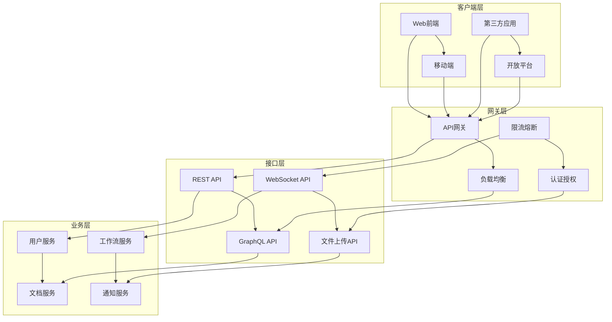

# Junmo Platform 接口设计

## 📋 文档信息

| 项目 | 内容 |
|------|------|
| **文档名称** | Junmo Platform 接口设计 |
| **版本号** | v1.0.0 |
| **创建日期** | 2025-12-24 |
| **作者** | API架构师 |
| **审核人** | 后端架构师 |
| **批准人** | 技术总监 |

## 🎯 接口设计概述

Junmo Platform采用RESTful API设计风格，结合GraphQL查询语言和WebSocket实时通信，构建完整的API服务体系。所有接口遵循统一的规范，包括版本控制、认证授权、错误处理、限流熔断等机制，确保接口的可靠性、安全性和可扩展性。

## 🔧 接口架构设计

### 1. API架构分层



### 2. API版本控制策略

**版本控制实现**:

```java
// API版本配置
@Configuration
public class ApiVersionConfig {
    
    @Bean
    public WebMvcConfigurer apiVersionConfigurer() {
        return new WebMvcConfigurer() {
            @Override
            public void configureContentNegotiation(ContentNegotiationConfigurer configurer) {
                configurer.favorParameter(true)
                    .parameterName("version")
                    .ignoreAcceptHeader(false)
                    .defaultContentType(MediaType.APPLICATION_JSON)
                    .mediaType("v1", MediaType.APPLICATION_JSON)
                    .mediaType("v2", MediaType.APPLICATION_JSON);
            }
        };
    }
}

// API版本注解
@Target({ElementType.TYPE, ElementType.METHOD})
@Retention(RetentionPolicy.RUNTIME)
public @interface ApiVersion {
    int value();
}

// API版本拦截器
@Component
public class ApiVersionInterceptor implements HandlerInterceptor {
    
    @Override
    public boolean preHandle(HttpServletRequest request, HttpServletResponse response, Object handler) throws Exception {
        if (handler instanceof HandlerMethod) {
            HandlerMethod handlerMethod = (HandlerMethod) handler;
            ApiVersion apiVersion = handlerMethod.getMethodAnnotation(ApiVersion.class);
            
            if (apiVersion != null) {
                String requestVersion = request.getParameter("version");
                if (requestVersion == null) {
                    requestVersion = "1"; // 默认版本
                }
                
                if (!String.valueOf(apiVersion.value()).equals(requestVersion)) {
                    response.setStatus(HttpStatus.NOT_FOUND.value());
                    response.getWriter().write("{\"error\":\"API version not supported\"}");
                    return false;
                }
            }
        }
        return true;
    }
}
```

### 3. 统一响应格式

**响应实体设计**:

```java
// 统一响应结果
@Data
@Builder
@NoArgsConstructor
@AllArgsConstructor
public class ApiResponse<T> {
    
    private int code;
    private String message;
    private T data;
    private Long timestamp;
    private String requestId;
    
    public static <T> ApiResponse<T> success(T data) {
        return ApiResponse.<T>builder()
            .code(200)
            .message("Success")
            .data(data)
            .timestamp(System.currentTimeMillis())
            .build();
    }
    
    public static <T> ApiResponse<T> success(T data, String message) {
        return ApiResponse.<T>builder()
            .code(200)
            .message(message)
            .data(data)
            .timestamp(System.currentTimeMillis())
            .build();
    }
    
    public static <T> ApiResponse<T> error(int code, String message) {
        return ApiResponse.<T>builder()
            .code(code)
            .message(message)
            .timestamp(System.currentTimeMillis())
            .build();
    }
    
    public static <T> ApiResponse<T> error(ErrorCode errorCode) {
        return ApiResponse.<T>builder()
            .code(errorCode.getCode())
            .message(errorCode.getMessage())
            .timestamp(System.currentTimeMillis())
            .build();
    }
}

// 分页响应结果
@Data
@Builder
@NoArgsConstructor
@AllArgsConstructor
public class PageResponse<T> {
    
    private List<T> content;
    private long totalElements;
    private int totalPages;
    private int currentPage;
    private int size;
    private boolean first;
    private boolean last;
    
    public static <T> PageResponse<T> of(Page<T> page) {
        return PageResponse.<T>builder()
            .content(page.getContent())
            .totalElements(page.getTotalElements())
            .totalPages(page.getTotalPages())
            .currentPage(page.getNumber())
            .size(page.getSize())
            .first(page.isFirst())
            .last(page.isLast())
            .build();
    }
}

// 错误码枚举
public enum ErrorCode {
    SUCCESS(200, "Success"),
    BAD_REQUEST(400, "Bad Request"),
    UNAUTHORIZED(401, "Unauthorized"),
    FORBIDDEN(403, "Forbidden"),
    NOT_FOUND(404, "Not Found"),
    INTERNAL_ERROR(500, "Internal Server Error"),
    
    // 业务错误码
    USER_NOT_FOUND(1001, "User not found"),
    USER_ALREADY_EXISTS(1002, "User already exists"),
    INVALID_PASSWORD(1003, "Invalid password"),
    TOKEN_EXPIRED(1004, "Token expired"),
    
    DOCUMENT_NOT_FOUND(2001, "Document not found"),
    DOCUMENT_ACCESS_DENIED(2002, "Document access denied"),
    DOCUMENT_VERSION_CONFLICT(2003, "Document version conflict");
    
    private final int code;
    private final String message;
    
    ErrorCode(int code, String message) {
        this.code = code;
        this.message = message;
    }
    
    public int getCode() {
        return code;
    }
    
    public String getMessage() {
        return message;
    }
}
```

## 👤 用户管理API

### 1. 用户认证接口

#### 1.1 用户登录

```yaml
# 用户登录接口
POST /api/v1/auth/login
Content-Type: application/json

# 请求体
{
  "username": "admin",
  "password": "password123",
  "captcha": "abc123",
  "rememberMe": false
}

# 响应体
{
  "code": 200,
  "message": "Login successful",
  "data": {
    "accessToken": "eyJhbGciOiJIUzI1NiIsInR5cCI6IkpXVCJ9...",
    "refreshToken": "eyJhbGciOiJIUzI1NiIsInR5cCI6IkpXVCJ9...",
    "tokenType": "Bearer",
    "expiresIn": 3600,
    "user": {
      "id": 1,
      "username": "admin",
      "email": "admin@example.com",
      "firstName": "Admin",
      "lastName": "User",
      "avatarUrl": "https://example.com/avatar.jpg",
      "roles": ["ADMIN"],
      "permissions": ["user:*", "document:*", "workflow:*"]
    }
  },
  "timestamp": 1703424000000
}
```

**控制器实现**:

```java
@RestController
@RequestMapping("/api/v1/auth")
@Validated
@Slf4j
public class AuthController {
    
    @Autowired
    private AuthService authService;
    
    @Autowired
    private CaptchaService captchaService;
    
    /**
     * 用户登录
     */
    @PostMapping("/login")
    public ApiResponse<LoginResponse> login(@Valid @RequestBody LoginRequest request) {
        log.info("User login attempt: {}", request.getUsername());
        
        // 验证验证码
        if (!captchaService.validate(request.getCaptcha(), request.getCaptchaId())) {
            throw new InvalidCaptchaException("Invalid captcha");
        }
        
        LoginResponse response = authService.login(request);
        
        return ApiResponse.success(response, "Login successful");
    }
    
    /**
     * 刷新Token
     */
    @PostMapping("/refresh")
    public ApiResponse<TokenResponse> refresh(@Valid @RequestBody RefreshTokenRequest request) {
        TokenResponse response = authService.refreshToken(request.getRefreshToken());
        return ApiResponse.success(response);
    }
    
    /**
     * 用户登出
     */
    @PostMapping("/logout")
    @PreAuthorize("isAuthenticated()")
    public ApiResponse<Void> logout(@RequestHeader("Authorization") String authorization) {
        String token = authorization.replace("Bearer ", "");
        authService.logout(token);
        return ApiResponse.success();
    }
    
    /**
     * 获取验证码
     */
    @GetMapping("/captcha")
    public ApiResponse<CaptchaResponse> getCaptcha() {
        CaptchaResponse captcha = captchaService.generateCaptcha();
        return ApiResponse.success(captcha);
    }
}
```

#### 1.2 用户注册

```yaml
# 用户注册接口
POST /api/v1/auth/register
Content-Type: application/json

# 请求体
{
  "username": "newuser",
  "email": "newuser@example.com",
  "password": "Password123!",
  "firstName": "New",
  "lastName": "User",
  "phoneNumber": "+1234567890",
  "captcha": "xyz789",
  "captchaId": "captcha_123",
  "agreeTerms": true
}

# 响应体
{
  "code": 200,
  "message": "Registration successful",
  "data": {
    "user": {
      "id": 2,
      "username": "newuser",
      "email": "newuser@example.com",
      "firstName": "New",
      "lastName": "User",
      "phoneNumber": "+1234567890",
      "status": "ACTIVE",
      "emailVerified": false,
      "phoneVerified": false,
      "createdAt": "2023-12-24T10:00:00Z"
    },
    "verificationToken": "email_verification_token_123"
  },
  "timestamp": 1703424000000
}
```

**服务层实现**:

```java
@Service
@Transactional
public class AuthServiceImpl implements AuthService {
    
    @Autowired
    private UserRepository userRepository;
    
    @Autowired
    private PasswordEncoder passwordEncoder;
    
    @Autowired
    private JwtTokenProvider tokenProvider;
    
    @Autowired
    private EmailService emailService;
    
    @Override
    public LoginResponse login(LoginRequest request) {
        // 1. 查找用户
        User user = userRepository.findByUsername(request.getUsername())
            .orElseThrow(() -> new AuthenticationException("Invalid credentials"));
        
        // 2. 验证密码
        if (!passwordEncoder.matches(request.getPassword(), user.getPassword())) {
            throw new AuthenticationException("Invalid credentials");
        }
        
        // 3. 检查用户状态
        if (!user.isActive()) {
            throw new UserLockedException("User account is locked");
        }
        
        // 4. 更新登录信息
        user.updateLoginInfo(request.getIpAddress());
        userRepository.save(user);
        
        // 5. 生成Token
        String accessToken = tokenProvider.generateAccessToken(user);
        String refreshToken = tokenProvider.generateRefreshToken(user);
        
        // 6. 构建响应
        return LoginResponse.builder()
            .accessToken(accessToken)
            .refreshToken(refreshToken)
            .tokenType("Bearer")
            .expiresIn(tokenProvider.getAccessTokenExpiration())
            .user(UserMapper.toDTO(user))
            .build();
    }
    
    @Override
    public UserDTO register(RegisterRequest request) {
        // 1. 验证用户名唯一性
        if (userRepository.existsByUsername(request.getUsername())) {
            throw new UserAlreadyExistsException("Username already exists");
        }
        
        // 2. 验证邮箱唯一性
        if (userRepository.existsByEmail(request.getEmail())) {
            throw new UserAlreadyExistsException("Email already exists");
        }
        
        // 3. 创建用户
        User user = User.create(
            request.getUsername(),
            request.getEmail(),
            passwordEncoder.encode(request.getPassword())
        );
        user.setFirstName(request.getFirstName());
        user.setLastName(request.getLastName());
        user.setPhoneNumber(request.getPhoneNumber());
        
        // 4. 分配默认角色
        assignDefaultRole(user);
        
        // 5. 保存用户
        user = userRepository.save(user);
        
        // 6. 发送验证邮件
        String verificationToken = generateVerificationToken(user);
        emailService.sendVerificationEmail(user.getEmail(), verificationToken);
        
        return UserMapper.toDTO(user);
    }
}
```

### 2. 用户管理接口

#### 2.1 获取用户列表

```yaml
# 获取用户列表接口
GET /api/v1/users?page=0&size=20&keyword=admin&status=ACTIVE&roleId=1
Authorization: Bearer {accessToken}

# 响应体
{
  "code": 200,
  "message": "Success",
  "data": {
    "content": [
      {
        "id": 1,
        "username": "admin",
        "email": "admin@example.com",
        "firstName": "Admin",
        "lastName": "User",
        "phoneNumber": "+1234567890",
        "avatarUrl": "https://example.com/avatar.jpg",
        "status": "ACTIVE",
        "lastLoginTime": "2023-12-24T09:30:00Z",
        "lastLoginIp": "192.168.1.100",
        "loginCount": 42,
        "emailVerified": true,
        "phoneVerified": true,
        "roles": [
          {
            "id": 1,
            "name": "ADMIN",
            "description": "Administrator"
          }
        ],
        "createdAt": "2023-01-01T00:00:00Z",
        "updatedAt": "2023-12-24T09:30:00Z"
      }
    ],
    "totalElements": 1,
    "totalPages": 1,
    "currentPage": 0,
    "size": 20,
    "first": true,
    "last": true
  },
  "timestamp": 1703424000000
}
```

**控制器实现**:

```java
@RestController
@RequestMapping("/api/v1/users")
@PreAuthorize("hasRole('ADMIN')")
public class UserController {
    
    @Autowired
    private UserService userService;
    
    /**
     * 获取用户列表
     */
    @GetMapping
    public ApiResponse<PageResponse<UserDTO>> getUsers(
            @RequestParam(defaultValue = "0") int page,
            @RequestParam(defaultValue = "20") int size,
            @RequestParam(required = false) String keyword,
            @RequestParam(required = false) UserStatus status,
            @RequestParam(required = false) Long roleId) {
        
        UserQuery query = UserQuery.builder()
            .page(page)
            .size(size)
            .keyword(keyword)
            .status(status)
            .roleId(roleId)
            .build();
        
        Page<UserDTO> users = userService.findUsers(query);
        PageResponse<UserDTO> response = PageResponse.of(users);
        
        return ApiResponse.success(response);
    }
    
    /**
     * 获取用户详情
     */
    @GetMapping("/{id}")
    public ApiResponse<UserDTO> getUser(@PathVariable Long id) {
        User user = userService.findUserById(id);
        UserDTO userDTO = UserMapper.toDTO(user);
        return ApiResponse.success(userDTO);
    }
    
    /**
     * 创建用户
     */
    @PostMapping
    public ApiResponse<UserDTO> createUser(@Valid @RequestBody CreateUserRequest request) {
        User user = userService.createUser(request);
        UserDTO userDTO = UserMapper.toDTO(user);
        return ApiResponse.success(userDTO, "User created successfully");
    }
    
    /**
     * 更新用户
     */
    @PutMapping("/{id}")
    public ApiResponse<UserDTO> updateUser(
            @PathVariable Long id,
            @Valid @RequestBody UpdateUserRequest request) {
        
        User user = userService.updateUser(id, request);
        UserDTO userDTO = UserMapper.toDTO(user);
        return ApiResponse.success(userDTO, "User updated successfully");
    }
    
    /**
     * 删除用户
     */
    @DeleteMapping("/{id}")
    public ApiResponse<Void> deleteUser(@PathVariable Long id) {
        userService.deleteUser(id);
        return ApiResponse.success(null, "User deleted successfully");
    }
    
    /**
     * 重置密码
     */
    @PostMapping("/{id}/reset-password")
    public ApiResponse<Void> resetPassword(@PathVariable Long id) {
        userService.resetPassword(id);
        return ApiResponse.success(null, "Password reset email sent");
    }
    
    /**
     * 分配角色
     */
    @PutMapping("/{id}/roles")
    public ApiResponse<Void> assignRoles(
            @PathVariable Long id,
            @Valid @RequestBody AssignRolesRequest request) {
        
        userService.assignRoles(id, request.getRoleIds());
        return ApiResponse.success(null, "Roles assigned successfully");
    }
}
```

## 📄 文档管理API

### 1. 文档CRUD接口

#### 1.1 创建文档

```yaml
# 创建文档接口
POST /api/v1/documents
Authorization: Bearer {accessToken}
Content-Type: application/json

# 请求体
{
  "title": "Spring Boot最佳实践",
  "content": "Spring Boot是一个快速开发框架...",
  "summary": "本文介绍Spring Boot的最佳实践",
  "categoryId": 1,
  "tags": ["Spring Boot", "Java", "最佳实践"],
  "accessLevel": "PUBLIC",
  "status": "DRAFT",
  "attachments": [
    {
      "name": "spring-boot-guide.pdf",
      "type": "application/pdf",
      "size": 1024000,
      "url": "https://example.com/files/spring-boot-guide.pdf"
    }
  ]
}

# 响应体
{
  "code": 200,
  "message": "Document created successfully",
  "data": {
    "id": 1,
    "title": "Spring Boot最佳实践",
    "content": "Spring Boot是一个快速开发框架...",
    "summary": "本文介绍Spring Boot的最佳实践",
    "category": {
      "id": 1,
      "name": "技术文档",
      "path": "/技术文档"
    },
    "author": {
      "id": 1,
      "username": "admin",
      "displayName": "Admin User"
    },
    "tags": ["Spring Boot", "Java", "最佳实践"],
    "status": "DRAFT",
    "version": 1,
    "accessLevel": "PUBLIC",
    "viewCount": 0,
    "likeCount": 0,
    "attachments": [
      {
        "id": 1,
        "name": "spring-boot-guide.pdf",
        "type": "application/pdf",
        "size": 1024000,
        "url": "https://example.com/files/spring-boot-guide.pdf"
      }
    ],
    "createdAt": "2023-12-24T10:00:00Z",
    "updatedAt": "2023-12-24T10:00:00Z"
  },
  "timestamp": 1703424000000
}
```

**服务层实现**:

```java
@Service
@Transactional
public class DocumentServiceImpl implements DocumentService {
    
    @Autowired
    private DocumentRepository documentRepository;
    
    @Autowired
    private CategoryRepository categoryRepository;
    
    @Autowired
    private TagRepository tagRepository;
    
    @Autowired
    private SearchService searchService;
    
    @Override
    public Document createDocument(CreateDocumentRequest request, Long authorId) {
        // 1. 验证分类
        Category category = categoryRepository.findById(request.getCategoryId())
            .orElseThrow(() -> new CategoryNotFoundException("Category not found"));
        
        // 2. 创建文档
        Document document = Document.create(
            request.getTitle(),
            request.getContent(),
            authorId,
            category.getId()
        );
        
        document.setSummary(request.getSummary());
        document.setAccessLevel(request.getAccessLevel());
        document.setStatus(request.getStatus());
        
        // 3. 处理标签
        if (request.getTags() != null && !request.getTags().isEmpty()) {
            Set<Tag> tags = findOrCreateTags(request.getTags());
            document.setTags(tags);
        }
        
        // 4. 处理附件
        if (request.getAttachments() != null && !request.getAttachments().isEmpty()) {
            Set<Attachment> attachments = request.getAttachments().stream()
                .map(attachmentMapper::toEntity)
                .collect(Collectors.toSet());
            document.setAttachments(attachments);
        }
        
        // 5. 保存文档
        document = documentRepository.save(document);
        
        // 6. 索引到搜索引擎
        searchService.indexDocument(document);
        
        // 7. 发布事件
        eventPublisher.publishEvent(new DocumentCreatedEvent(document.getId()));
        
        return document;
    }
    
    @Override
    public Document updateDocument(Long documentId, UpdateDocumentRequest request, Long userId) {
        // 1. 获取文档
        Document document = documentRepository.findById(documentId)
            .orElseThrow(() -> new DocumentNotFoundException("Document not found"));
        
        // 2. 检查权限
        if (!document.canEdit(userId)) {
            throw new DocumentAccessDeniedException("Access denied");
        }
        
        // 3. 更新文档
        document.update(request.getTitle(), request.getContent());
        document.setSummary(request.getSummary());
        
        if (request.getCategoryId() != null) {
            Category category = categoryRepository.findById(request.getCategoryId())
                .orElseThrow(() -> new CategoryNotFoundException("Category not found"));
            document.setCategory(category);
        }
        
        // 4. 更新标签
        if (request.getTags() != null) {
            Set<Tag> tags = findOrCreateTags(request.getTags());
            document.setTags(tags);
        }
        
        // 5. 保存更新
        document = documentRepository.save(document);
        
        // 6. 更新搜索索引
        searchService.indexDocument(document);
        
        // 7. 发布事件
        eventPublisher.publishEvent(new DocumentUpdatedEvent(document.getId()));
        
        return document;
    }
    
    private Set<Tag> findOrCreateTags(Set<String> tagNames) {
        return tagNames.stream()
            .map(tagName -> {
                return tagRepository.findByName(tagName)
                    .orElseGet(() -> {
                        Tag tag = Tag.create(tagName);
                        return tagRepository.save(tag);
                    });
            })
            .collect(Collectors.toSet());
    }
}
```

#### 1.2 搜索文档

```yaml
# 搜索文档接口
GET /api/v1/documents/search?keyword=Spring%20Boot&categoryIds=1,2&tags=Java&status=PUBLISHED&page=0&size=10&sortBy=relevance&includeAggregations=true
Authorization: Bearer {accessToken}

# 响应体
{
  "code": 200,
  "message": "Search completed",
  "data": {
    "content": [
      {
        "id": 1,
        "title": "Spring Boot最佳实践",
        "summary": "本文介绍Spring Boot的最佳实践",
        "highlightedTitle": "<em>Spring Boot</em>最佳实践",
        "highlightedContent": "<em>Spring Boot</em>是一个快速开发框架...",
        "author": {
          "id": 1,
          "username": "admin",
          "displayName": "Admin User"
        },
        "category": {
          "id": 1,
          "name": "技术文档"
        },
        "tags": ["Spring Boot", "Java", "最佳实践"],
        "status": "PUBLISHED",
        "viewCount": 150,
        "likeCount": 25,
        "publishedAt": "2023-12-24T10:00:00Z",
        "score": 0.95
      }
    ],
    "totalElements": 1,
    "totalPages": 1,
    "currentPage": 0,
    "size": 10,
    "aggregations": {
      "categories": [
        {
          "name": "技术文档",
          "count": 1
        }
      ],
      "tags": [
        {
          "name": "Spring Boot",
          "count": 1
        },
        {
          "name": "Java",
          "count": 1
        }
      ],
      "authors": [
        {
          "name": "admin",
          "count": 1
        }
      ],
      "dateHistogram": [
        {
          "date": "2023-12",
          "count": 1
        }
      ]
    }
  },
  "timestamp": 1703424000000
}
```

## 🔄 工作流API

### 1. 流程管理接口

#### 1.1 启动流程

```yaml
# 启动流程接口
POST /api/v1/workflow/processes/{processKey}/start
Authorization: Bearer {accessToken}
Content-Type: application/json

# 请求体
{
  "businessKey": "LEAVE_20231224_001",
  "variables": {
    "applicant": "张三",
    "leaveDays": 3,
    "reason": "家中有事",
    "startDate": "2023-12-25",
    "endDate": "2023-12-27"
  }
}

# 响应体
{
  "code": 200,
  "message": "Process started successfully",
  "data": {
    "processInstanceId": "proc_123456789",
    "processDefinitionId": 1,
    "processDefinitionKey": "leave_approval",
    "businessKey": "LEAVE_20231224_001",
    "status": "RUNNING",
    "startedBy": 1,
    "startTime": "2023-12-24T10:00:00Z",
    "variables": {
      "applicant": "张三",
      "leaveDays": 3,
      "reason": "家中有事",
      "startDate": "2023-12-25",
      "endDate": "2023-12-27"
    },
    "tasks": [
      {
        "taskId": "task_123456789",
        "name": "部门经理审批",
        "assignee": 2,
        "status": "ACTIVE",
        "createTime": "2023-12-24T10:00:00Z",
        "dueTime": "2023-12-25T10:00:00Z"
      }
    ]
  },
  "timestamp": 1703424000000
}
```

**服务层实现**:

```java
@Service
@Transactional
public class WorkflowServiceImpl implements WorkflowService {
    
    @Autowired
    private ProcessDefinitionRepository processDefinitionRepository;
    
    @Autowired
    private ProcessInstanceRepository processInstanceRepository;
    
    @Autowired
    private TaskInstanceRepository taskInstanceRepository;
    
    @Autowired
    private BpmnProcessEngine processEngine;
    
    @Override
    public ProcessInstance startProcess(String processKey, StartProcessRequest request, Long userId) {
        // 1. 获取流程定义
        ProcessDefinition processDefinition = processDefinitionRepository
            .findByKeyAndStatus(processKey, Status.ACTIVE)
            .orElseThrow(() -> new ProcessDefinitionNotFoundException("Process definition not found"));
        
        // 2. 验证启动权限
        if (!canStartProcess(processDefinition, userId)) {
            throw new ProcessAccessDeniedException("Access denied");
        }
        
        // 3. 启动流程实例
        ProcessInstance processInstance = ProcessInstance.create(
            processDefinition.getId(),
            processKey,
            request.getBusinessKey(),
            userId
        );
        
        processInstance.setVariables(request.getVariables());
        processInstance = processInstanceRepository.save(processInstance);
        
        // 4. 启动BPMN流程
        ProcessInstance bpmnInstance = processEngine.startProcess(
            processKey,
            processInstance.getProcessInstanceId(),
            request.getVariables()
        );
        
        // 5. 创建初始任务
        List<Task> bpmnTasks = processEngine.getActiveTasks(bpmnInstance.getId());
        for (Task bpmnTask : bpmnTasks) {
            TaskInstance taskInstance = TaskInstance.create(
                bpmnTask.getId(),
                processInstance.getProcessInstanceId(),
                bpmnTask.getName(),
                bpmnTask.getAssignee()
            );
            
            taskInstance.setVariables(bpmnTask.getVariables());
            taskInstanceRepository.save(taskInstance);
        }
        
        // 6. 发布事件
        eventPublisher.publishEvent(new ProcessStartedEvent(processInstance.getId()));
        
        return processInstance;
    }
    
    @Override
    public TaskInstance completeTask(String taskId, CompleteTaskRequest request, Long userId) {
        // 1. 获取任务实例
        TaskInstance taskInstance = taskInstanceRepository.findByTaskId(taskId)
            .orElseThrow(() -> new TaskNotFoundException("Task not found"));
        
        // 2. 检查任务状态
        if (!taskInstance.isActive()) {
            throw new TaskNotActiveException("Task is not active");
        }
        
        // 3. 检查权限
        if (!taskInstance.canComplete(userId)) {
            throw new TaskAccessDeniedException("Access denied");
        }
        
        // 4. 完成任务
        taskInstance.complete(request.getVariables());
        taskInstance.setCompletionTime(LocalDateTime.now());
        taskInstanceRepository.save(taskInstance);
        
        // 5. 完成BPMN任务
        processEngine.completeTask(taskId, request.getVariables());
        
        // 6. 检查流程是否完成
        ProcessInstance processInstance = processInstanceRepository
            .findByProcessInstanceId(taskInstance.getProcessInstanceId());
        
        if (processEngine.isProcessCompleted(processInstance.getProcessInstanceId())) {
            processInstance.complete();
            processInstanceRepository.save(processInstance);
            
            eventPublisher.publishEvent(new ProcessCompletedEvent(processInstance.getId()));
        } else {
            // 创建下一个任务
            List<Task> nextTasks = processEngine.getActiveTasks(processInstance.getProcessInstanceId());
            for (Task nextTask : nextTasks) {
                TaskInstance nextTaskInstance = TaskInstance.create(
                    nextTask.getId(),
                    processInstance.getProcessInstanceId(),
                    nextTask.getName(),
                    nextTask.getAssignee()
                );
                
                nextTaskInstance.setVariables(nextTask.getVariables());
                taskInstanceRepository.save(nextTaskInstance);
                
                eventPublisher.publishEvent(new TaskCreatedEvent(nextTaskInstance.getId()));
            }
        }
        
        // 7. 发布任务完成事件
        eventPublisher.publishEvent(new TaskCompletedEvent(taskInstance.getId()));
        
        return taskInstance;
    }
}
```

## 📨 通知API

### 1. 实时通知接口

#### 1.1 WebSocket连接

```javascript
// WebSocket连接示例
const socket = new WebSocket('ws://localhost:8080/ws/notifications');

// 连接建立
socket.onopen = function(event) {
    console.log('WebSocket connected');
    
    // 发送认证消息
    socket.send(JSON.stringify({
        type: 'auth',
        data: {
            token: 'Bearer eyJhbGciOiJIUzI1NiIsInR5cCI6IkpXVCJ9...'
        }
    }));
};

// 接收消息
socket.onmessage = function(event) {
    const message = JSON.parse(event.data);
    
    switch (message.type) {
        case 'notification':
            handleNotification(message.data);
            break;
        case 'document_update':
            handleDocumentUpdate(message.data);
            break;
        case 'workflow_update':
            handleWorkflowUpdate(message.data);
            break;
    }
};

// 处理通知消息
function handleNotification(data) {
    const notification = {
        id: data.id,
        title: data.title,
        message: data.message,
        type: data.type,
        createdAt: data.createdAt,
        read: data.read
    };
    
    // 显示通知
    showNotification(notification);
    
    // 更新通知列表
    updateNotificationList(notification);
}

// 发送心跳
setInterval(() => {
    socket.send(JSON.stringify({ type: 'ping' }));
}, 30000);
```

**WebSocket处理器实现**:

```java
@Component
public class NotificationWebSocketHandler extends TextWebSocketHandler {
    
    @Autowired
    private JwtTokenProvider tokenProvider;
    
    @Autowired
    private NotificationService notificationService;
    
    private final Map<String, WebSocketSession> sessions = new ConcurrentHashMap<>();
    private final Map<String, Long> userSessions = new ConcurrentHashMap<>();
    
    @Override
    public void afterConnectionEstablished(WebSocketSession session) throws Exception {
        String sessionId = session.getId();
        sessions.put(sessionId, session);
        
        log.info("WebSocket connection established: {}", sessionId);
    }
    
    @Override
    protected void handleTextMessage(WebSocketSession session, TextMessage message) throws Exception {
        try {
            JsonObject jsonMessage = JsonParser.parseString(message.getPayload()).getAsJsonObject();
            String type = jsonMessage.get("type").getAsString();
            
            switch (type) {
                case "auth":
                    handleAuth(session, jsonMessage);
                    break;
                case "ping":
                    handlePing(session);
                    break;
                default:
                    log.warn("Unknown message type: {}", type);
            }
        } catch (Exception e) {
            log.error("Error handling message: {}", message.getPayload(), e);
            sendErrorMessage(session, "Invalid message format");
        }
    }
    
    private void handleAuth(WebSocketSession session, JsonObject message) {
        try {
            String token = message.getAsJsonObject("data")
                .get("token").getAsString()
                .replace("Bearer ", "");
            
            // 验证Token
            if (tokenProvider.validateToken(token)) {
                Long userId = tokenProvider.getUserIdFromToken(token);
                String sessionId = session.getId();
                
                userSessions.put(sessionId, userId);
                
                // 发送认证成功消息
                sendMessage(session, new AuthMessage(true));
                
                // 发送未读通知
                List<Notification> unreadNotifications = notificationService.getUnreadNotifications(userId);
                for (Notification notification : unreadNotifications) {
                    sendMessage(session, new NotificationMessage(notification));
                }
                
                log.info("User {} authenticated for WebSocket session {}", userId, sessionId);
            } else {
                sendErrorMessage(session, "Invalid token");
                session.close();
            }
        } catch (Exception e) {
            log.error("Authentication failed", e);
            sendErrorMessage(session, "Authentication failed");
            session.close();
        }
    }
    
    private void handlePing(WebSocketSession session) {
        sendMessage(session, new PingMessage());
    }
    
    @Override
    public void afterConnectionClosed(WebSocketSession session, CloseStatus status) throws Exception {
        String sessionId = session.getId();
        sessions.remove(sessionId);
        userSessions.remove(sessionId);
        
        log.info("WebSocket connection closed: {}", sessionId);
    }
    
    public void sendNotificationToUser(Long userId, Notification notification) {
        userSessions.entrySet().stream()
            .filter(entry -> entry.getValue().equals(userId))
            .forEach(entry -> {
                WebSocketSession session = sessions.get(entry.getKey());
                if (session != null && session.isOpen()) {
                    sendMessage(session, new NotificationMessage(notification));
                }
            });
    }
    
    private void sendMessage(WebSocketSession session, Object message) {
        try {
            String jsonMessage = objectMapper.writeValueAsString(message);
            session.sendMessage(new TextMessage(jsonMessage));
        } catch (Exception e) {
            log.error("Error sending message to session {}", session.getId(), e);
        }
    }
    
    private void sendErrorMessage(WebSocketSession session, String error) {
        sendMessage(session, new ErrorMessage(error));
    }
}
```

## 📁 文件上传API

### 1. 文件上传接口

#### 1.1 单文件上传

```yaml
# 文件上传接口
POST /api/v1/files/upload
Authorization: Bearer {accessToken}
Content-Type: multipart/form-data

# 请求体
file: [binary data]
category: "document"
description: "项目文档"

# 响应体
{
  "code": 200,
  "message": "File uploaded successfully",
  "data": {
    "id": "file_123456789",
    "originalName": "project-document.pdf",
    "fileName": "20231224_abc123.pdf",
    "contentType": "application/pdf",
    "size": 2048576,
    "url": "https://example.com/files/20231224_abc123.pdf",
    "thumbnailUrl": "https://example.com/thumbnails/20231224_abc123.jpg",
    "category": "document",
    "description": "项目文档",
    "uploadedBy": 1,
    "uploadedAt": "2023-12-24T10:00:00Z"
  },
  "timestamp": 1703424000000
}
```

**文件上传服务实现**:

```java
@Service
public class FileUploadServiceImpl implements FileUploadService {
    
    @Autowired
    private FileStorageService fileStorageService;
    
    @Autowired
    private ImageProcessingService imageProcessingService;
    
    @Override
    public FileUploadResult uploadFile(MultipartFile file, String category, String description, Long userId) {
        // 1. 验证文件
        validateFile(file);
        
        // 2. 生成文件名
        String originalName = file.getOriginalFilename();
        String fileName = generateFileName(originalName);
        
        // 3. 存储文件
        String fileUrl = fileStorageService.store(file, fileName);
        
        // 4. 生成缩略图（如果是图片）
        String thumbnailUrl = null;
        if (isImageFile(file.getContentType())) {
            thumbnailUrl = generateThumbnail(file, fileName);
        }
        
        // 5. 保存文件记录
        FileUpload fileUpload = FileUpload.create(
            originalName,
            fileName,
            file.getContentType(),
            file.getSize(),
            fileUrl,
            thumbnailUrl,
            category,
            description,
            userId
        );
        
        fileUpload = fileUploadRepository.save(fileUpload);
        
        // 6. 返回结果
        return FileUploadResult.builder()
            .id(fileUpload.getId())
            .originalName(originalName)
            .fileName(fileName)
            .contentType(file.getContentType())
            .size(file.getSize())
            .url(fileUrl)
            .thumbnailUrl(thumbnailUrl)
            .category(category)
            .description(description)
            .uploadedBy(userId)
            .uploadedAt(fileUpload.getCreatedAt())
            .build();
    }
    
    private void validateFile(MultipartFile file) {
        if (file.isEmpty()) {
            throw new InvalidFileException("File is empty");
        }
        
        // 检查文件大小
        if (file.getSize() > MAX_FILE_SIZE) {
            throw new FileSizeExceededException("File size exceeds limit");
        }
        
        // 检查文件类型
        String contentType = file.getContentType();
        if (!ALLOWED_CONTENT_TYPES.contains(contentType)) {
            throw new UnsupportedFileTypeException("File type not supported");
        }
    }
    
    private String generateFileName(String originalName) {
        String extension = getFileExtension(originalName);
        String timestamp = LocalDateTime.now().format(DateTimeFormatter.ofPattern("yyyyMMdd_HHmmss"));
        String randomString = UUID.randomUUID().toString().substring(0, 8);
        
        return String.format("%s_%s.%s", timestamp, randomString, extension);
    }
    
    private String generateThumbnail(MultipartFile file, String fileName) {
        try {
            BufferedImage image = ImageIO.read(file.getInputStream());
            BufferedImage thumbnail = imageProcessingService.createThumbnail(image, 200, 200);
            
            String thumbnailName = "thumb_" + fileName.replace(".", "_thumb.");
            return fileStorageService.storeThumbnail(thumbnail, thumbnailName, "jpg");
        } catch (Exception e) {
            log.error("Failed to generate thumbnail for file: {}", fileName, e);
            return null;
        }
    }
}
```

## 🔒 接口安全设计

### 1. 认证授权机制

#### 1.1 JWT Token实现

```java
@Component
public class JwtTokenProvider {
    
    @Value("${app.jwt.secret}")
    private String jwtSecret;
    
    @Value("${app.jwt.expiration}")
    private int jwtExpiration;
    
    @Value("${app.jwt.refresh-expiration}")
    private int refreshExpiration;
    
    public String generateAccessToken(User user) {
        Date expiryDate = new Date(System.currentTimeMillis() + jwtExpiration * 1000);
        
        return Jwts.builder()
            .setSubject(user.getId().toString())
            .setIssuedAt(new Date())
            .setExpiration(expiryDate)
            .claim("username", user.getUsername())
            .claim("roles", user.getRoles().stream()
                .map(role -> role.getName())
                .collect(Collectors.toList()))
            .claim("permissions", user.getPermissions())
            .signWith(SignatureAlgorithm.HS512, jwtSecret)
            .compact();
    }
    
    public String generateRefreshToken(User user) {
        Date expiryDate = new Date(System.currentTimeMillis() + refreshExpiration * 1000);
        
        return Jwts.builder()
            .setSubject(user.getId().toString())
            .setIssuedAt(new Date())
            .setExpiration(expiryDate)
            .claim("type", "refresh")
            .signWith(SignatureAlgorithm.HS512, jwtSecret)
            .compact();
    }
    
    public boolean validateToken(String token) {
        try {
            Jwts.parser().setSigningKey(jwtSecret).parseClaimsJws(token);
            return true;
        } catch (JwtException | IllegalArgumentException e) {
            log.error("Invalid JWT token: {}", e.getMessage());
            return false;
        }
    }
    
    public Long getUserIdFromToken(String token) {
        Claims claims = Jwts.parser()
            .setSigningKey(jwtSecret)
            .parseClaimsJws(token)
            .getBody();
        
        return Long.parseLong(claims.getSubject());
    }
    
    @SuppressWarnings("unchecked")
    public List<String> getRolesFromToken(String token) {
        Claims claims = Jwts.parser()
            .setSigningKey(jwtSecret)
            .parseClaimsJws(token)
            .getBody();
        
        return (List<String>) claims.get("roles");
    }
    
    @SuppressWarnings("unchecked")
    public Set<String> getPermissionsFromToken(String token) {
        Claims claims = Jwts.parser()
            .setSigningKey(jwtSecret)
            .parseClaimsJws(token)
            .getBody();
        
        return new HashSet<>((List<String>) claims.get("permissions"));
    }
}
```

#### 1.2 权限控制拦截器

```java
@Component
public class AuthorizationInterceptor implements HandlerInterceptor {
    
    @Autowired
    private JwtTokenProvider tokenProvider;
    
    @Override
    public boolean preHandle(HttpServletRequest request, HttpServletResponse response, Object handler) throws Exception {
        if (handler instanceof HandlerMethod) {
            HandlerMethod handlerMethod = (HandlerMethod) handler;
            
            // 检查方法级别的权限注解
            PreAuthorize preAuthorize = handlerMethod.getMethodAnnotation(PreAuthorize.class);
            if (preAuthorize != null) {
                return checkPermission(request, preAuthorize.value());
            }
            
            // 检查类级别的权限注解
            preAuthorize = handlerMethod.getBeanType().getAnnotation(PreAuthorize.class);
            if (preAuthorize != null) {
                return checkPermission(request, preAuthorize.value());
            }
        }
        
        return true;
    }
    
    private boolean checkPermission(HttpServletRequest request, String expression) {
        try {
            // 获取Token
            String token = extractToken(request);
            if (token == null) {
                return false;
            }
            
            // 验证Token
            if (!tokenProvider.validateToken(token)) {
                return false;
            }
            
            // 获取用户权限
            Set<String> permissions = tokenProvider.getPermissionsFromToken(token);
            
            // 评估权限表达式
            return evaluatePermissionExpression(expression, permissions);
            
        } catch (Exception e) {
            log.error("Permission check failed", e);
            return false;
        }
    }
    
    private String extractToken(HttpServletRequest request) {
        String bearerToken = request.getHeader("Authorization");
        if (bearerToken != null && bearerToken.startsWith("Bearer ")) {
            return bearerToken.substring(7);
        }
        return null;
    }
    
    private boolean evaluatePermissionExpression(String expression, Set<String> permissions) {
        // 简单的权限表达式评估
        if (expression.equals("isAuthenticated()")) {
            return true;
        }
        
        if (expression.startsWith("hasRole('") && expression.endsWith("')")) {
            String role = expression.substring(9, expression.length() - 2);
            return permissions.contains(role);
        }
        
        if (expression.startsWith("hasAuthority('") && expression.endsWith("')")) {
            String permission = expression.substring(14, expression.length() - 2);
            return permissions.contains(permission);
        }
        
        // 更复杂的表达式可以使用SpEL等表达式引擎
        return false;
    }
}
```

### 2. 接口限流熔断

#### 2.1 限流实现

```java
@Component
public class RateLimitingInterceptor implements HandlerInterceptor {
    
    @Autowired
    private RedisTemplate<String, String> redisTemplate;
    
    private static final String RATE_LIMIT_PREFIX = "rate_limit:";
    private static final int DEFAULT_LIMIT = 100; // 每分钟100次请求
    private static final int DEFAULT_WINDOW = 60; // 60秒窗口
    
    @Override
    public boolean preHandle(HttpServletRequest request, HttpServletResponse response, Object handler) throws Exception {
        String clientIp = getClientIp(request);
        String uri = request.getRequestURI();
        String key = RATE_LIMIT_PREFIX + clientIp + ":" + uri;
        
        // 检查限流
        if (!isAllowed(key, DEFAULT_LIMIT, DEFAULT_WINDOW)) {
            response.setStatus(HttpStatus.TOO_MANY_REQUESTS.value());
            response.getWriter().write("{\"error\":\"Rate limit exceeded\"}");
            return false;
        }
        
        return true;
    }
    
    private boolean isAllowed(String key, int limit, int window) {
        String script = "local current = redis.call('get', KEYS[1]) " +
                      "if current and tonumber(current) > tonumber(ARGV[1]) " +
                      "then return 0 " +
                      "end " +
                      "redis.call('incr', KEYS[1]) " +
                      "if tonumber(redis.call('get', KEYS[1])) == 1 " +
                      "then redis.call('expire', KEYS[1], ARGV[2]) " +
                      "end " +
                      "return 1";
        
        Long result = redisTemplate.execute(
            new DefaultRedisScript<>(script, Long.class),
            Collections.singletonList(key),
            String.valueOf(limit),
            String.valueOf(window)
        );
        
        return result != null && result == 1;
    }
    
    private String getClientIp(HttpServletRequest request) {
        String xForwardedFor = request.getHeader("X-Forwarded-For");
        if (xForwardedFor != null && !xForwardedFor.isEmpty()) {
            return xForwardedFor.split(",")[0].trim();
        }
        
        String xRealIp = request.getHeader("X-Real-IP");
        if (xRealIp != null && !xRealIp.isEmpty()) {
            return xRealIp;
        }
        
        return request.getRemoteAddr();
    }
}
```

---

*本文档提供了详细的接口设计，包括REST API、GraphQL、WebSocket和文件上传的具体实现，为开发团队提供了完整的API开发指导。*