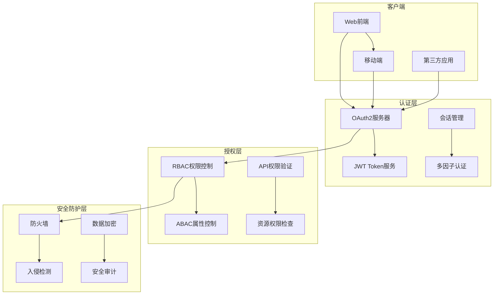

# Junmo Platform 非功能性设计

## 📋 文档信息

| 项目 | 内容 |
|------|------|
| **文档名称** | Junmo Platform 非功能性设计 |
| **版本号** | v1.1.0 |
| **创建日期** | 2025-12-24 |
| **更新日期** | 2026-01-07 |
| **作者** | 系统架构师 |
| **审核人** | 质量保证经理 |
| **批准人** | 技术总监 |

## 📝 更新说明

**v1.1.0 (2026-01-07)**:
- 认证框架从Spring Security调整为Sa-Token

## 🎯 非功能性设计概述

Junmo Platform的非功能性设计涵盖了性能、可用性、安全性、可维护性、可扩展性等关键质量属性。通过系统性的设计和实现，确保系统在各种负载条件下都能稳定运行，同时满足业务发展的需求。

## ⚡ 性能设计

### 1. 性能目标与指标

**性能指标定义**:

```yaml
# 性能目标
performance_targets:
  response_time:
    api_endpoints:
      - endpoint: "/api/v1/users"
        target: "< 200ms"
        measurement: "95th percentile"
      - endpoint: "/api/v1/documents/search"
        target: "< 500ms"
        measurement: "95th percentile"
      - endpoint: "/api/v1/auth/login"
        target: "< 300ms"
        measurement: "95th percentile"
    
    web_pages:
      - page: "dashboard"
        target: "< 2s"
        measurement: "page load time"
      - page: "document_list"
        target: "< 1.5s"
        measurement: "page load time"
  
  throughput:
    concurrent_users: "> 1000"
    requests_per_second: "> 5000"
    database_transactions: "> 10000"
  
  resource_utilization:
    cpu_usage: "< 70%"
    memory_usage: "< 80%"
    disk_io: "< 80%"
    network_io: "< 70%"
```

### 2. 性能优化策略

#### 2.1 应用层优化

**缓存策略实现**:

```java
@Configuration
@EnableCaching
public class CacheConfig {
    
    @Bean
    public CacheManager cacheManager() {
        // 多级缓存管理器
        CompositeCacheManager compositeCacheManager = new CompositeCacheManager();
        
        // L1缓存：本地缓存
        CaffeineCacheManager caffeineCacheManager = new CaffeineCacheManager();
        caffeineCacheManager.setCaffeine(Caffeine.newBuilder()
            .maximumSize(1000)
            .expireAfterWrite(Duration.ofMinutes(10))
            .recordStats());
        
        // L2缓存：分布式缓存
        RedisCacheManager redisCacheManager = RedisCacheManager
            .builder(redisConnectionFactory())
            .cacheDefaults(redisCacheConfiguration())
            .build();
        
        compositeCacheManager.setCacheManagers(Arrays.asList(
            caffeineCacheManager,
            redisCacheManager
        ));
        
        return compositeCacheManager;
    }
    
    private RedisCacheConfiguration redisCacheConfiguration() {
        return RedisCacheConfiguration.defaultCacheConfig()
            .entryTtl(Duration.ofMinutes(30))
            .serializeKeysWith(RedisSerializationContext.SerializationPair
                .fromSerializer(new StringRedisSerializer()))
            .serializeValuesWith(RedisSerializationContext.SerializationPair
                .fromSerializer(new GenericJackson2JsonRedisSerializer()))
            .disableCachingNullValues();
    }
}

// 缓存使用示例
@Service
public class UserServiceImpl implements UserService {
    
    @Cacheable(value = "users", key = "#userId", unless = "#result == null")
    public UserDTO getUserById(Long userId) {
        User user = userRepository.findById(userId).orElse(null);
        return user != null ? UserMapper.toDTO(user) : null;
    }
    
    @CacheEvict(value = "users", key = "#userId")
    public void updateUser(Long userId, UpdateUserRequest request) {
        // 更新用户逻辑
    }
    
    @Cacheable(value = "user_permissions", key = "#userId")
    public Set<String> getUserPermissions(Long userId) {
        return userRepository.findPermissionsByUserId(userId);
    }
}
```

**异步处理机制**:

```java
@Configuration
@EnableAsync
public class AsyncConfig {
    
    @Bean(name = "taskExecutor")
    public Executor taskExecutor() {
        ThreadPoolTaskExecutor executor = new ThreadPoolTaskExecutor();
        executor.setCorePoolSize(10);
        executor.setMaxPoolSize(20);
        executor.setQueueCapacity(200);
        executor.setThreadNamePrefix("Async-");
        executor.setRejectedExecutionHandler(new ThreadPoolExecutor.CallerRunsPolicy());
        executor.setWaitForTasksToCompleteOnShutdown(true);
        executor.setAwaitTerminationSeconds(60);
        executor.initialize();
        return executor;
    }
    
    @Bean(name = "emailExecutor")
    public Executor emailExecutor() {
        ThreadPoolTaskExecutor executor = new ThreadPoolTaskExecutor();
        executor.setCorePoolSize(5);
        executor.setMaxPoolSize(10);
        executor.setQueueCapacity(100);
        executor.setThreadNamePrefix("Email-");
        executor.setRejectedExecutionHandler(new ThreadPoolExecutor.AbortPolicy());
        executor.initialize();
        return executor;
    }
}

// 异步服务示例
@Service
public class NotificationServiceImpl implements NotificationService {
    
    @Async("emailExecutor")
    public CompletableFuture<Void> sendEmail(String to, String subject, String content) {
        try {
            emailService.send(to, subject, content);
            log.info("Email sent successfully to: {}", to);
            return CompletableFuture.completedFuture(null);
        } catch (Exception e) {
            log.error("Failed to send email to: {}", to, e);
            return CompletableFuture.failedFuture(e);
        }
    }
    
    @Async("taskExecutor")
    public CompletableFuture<Void> processDocumentAsync(Long documentId) {
        try {
            documentProcessor.process(documentId);
            return CompletableFuture.completedFuture(null);
        } catch (Exception e) {
            log.error("Failed to process document: {}", documentId, e);
            return CompletableFuture.failedFuture(e);
        }
    }
}
```

#### 2.2 数据库优化

**连接池配置**:

```yaml
# 数据库连接池配置
spring:
  datasource:
    hikari:
      maximum-pool-size: 20
      minimum-idle: 5
      idle-timeout: 300000
      max-lifetime: 1200000
      connection-timeout: 20000
      leak-detection-threshold: 60000
      connection-test-query: SELECT 1
      
  jpa:
    hibernate:
      ddl-auto: validate
      naming:
        physical-strategy: org.hibernate.boot.model.naming.SnakeCasePhysicalNamingStrategy
    show-sql: false
    properties:
      hibernate:
        dialect: org.hibernate.dialect.MySQL8Dialect
        format_sql: true
        use_sql_comments: true
        jdbc:
          batch_size: 20
          order_inserts: true
          order_updates: true
        cache:
          use_second_level_cache: true
          use_query_cache: true
          region.factory_class: org.hibernate.cache.ehcache.EhCacheRegionFactory
```

**查询优化示例**:

```java
@Repository
public class UserRepositoryImpl implements UserRepositoryCustom {
    
    @Autowired
    private EntityManager entityManager;
    
    /**
     * 优化的用户查询
     */
    @Override
    public Page<UserDTO> findUsersOptimized(UserQuery query, Pageable pageable) {
        CriteriaBuilder cb = entityManager.getCriteriaBuilder();
        CriteriaQuery<User> cq = cb.createQuery(User.class);
        Root<User> root = cq.from(User.class);
        
        // 构建查询条件
        List<Predicate> predicates = new ArrayList<>();
        
        if (StringUtils.hasText(query.getKeyword())) {
            Predicate usernamePredicate = cb.like(
                cb.lower(root.get("username")), 
                "%" + query.getKeyword().toLowerCase() + "%"
            );
            Predicate emailPredicate = cb.like(
                cb.lower(root.get("email")), 
                "%" + query.getKeyword().toLowerCase() + "%"
            );
            predicates.add(cb.or(usernamePredicate, emailPredicate));
        }
        
        if (query.getStatus() != null) {
            predicates.add(cb.equal(root.get("status"), query.getStatus()));
        }
        
        if (query.getRoleId() != null) {
            Join<User, UserRole> userRoleJoin = root.join("userRoles", JoinType.INNER);
            Join<UserRole, Role> roleJoin = userRoleJoin.join("role", JoinType.INNER);
            predicates.add(cb.equal(roleJoin.get("id"), query.getRoleId()));
        }
        
        cq.where(predicates.toArray(new Predicate[0]));
        
        // 执行查询
        TypedQuery<User> typedQuery = entityManager.createQuery(cq);
        typedQuery.setFirstResult((int) pageable.getOffset());
        typedQuery.setMaxResults(pageable.getPageSize());
        
        List<User> users = typedQuery.getResultList();
        
        // 获取总数
        CriteriaQuery<Long> countQuery = cb.createQuery(Long.class);
        Root<User> countRoot = countQuery.from(User.class);
        countQuery.select(cb.count(countRoot));
        countQuery.where(predicates.toArray(new Predicate[0]));
        
        Long total = entityManager.createQuery(countQuery).getSingleResult();
        
        // 转换为DTO
        List<UserDTO> userDTOs = users.stream()
            .map(UserMapper::toDTO)
            .collect(Collectors.toList());
        
        return new PageImpl<>(userDTOs, pageable, total);
    }
}
```

### 3. 性能监控

#### 3.1 指标收集

**自定义指标**:

```java
@Component
public class PerformanceMetrics {
    
    private final MeterRegistry meterRegistry;
    private final Counter requestCounter;
    private final Timer responseTimer;
    private final Gauge activeConnections;
    
    public PerformanceMetrics(MeterRegistry meterRegistry) {
        this.meterRegistry = meterRegistry;
        
        this.requestCounter = Counter.builder("http.requests.total")
            .description("Total number of HTTP requests")
            .register(meterRegistry);
        
        this.responseTimer = Timer.builder("http.request.duration")
            .description("HTTP request duration")
            .register(meterRegistry);
        
        this.activeConnections = Gauge.builder("http.connections.active")
            .description("Number of active HTTP connections")
            .register(meterRegistry, this, PerformanceMetrics::getActiveConnections);
    }
    
    public void recordRequest(String method, String uri, int statusCode, long duration) {
        // 增加请求计数
        requestCounter.increment(
            Tags.of(
                Tag.of("method", method),
                Tag.of("uri", uri),
                Tag.of("status", String.valueOf(statusCode))
            )
        );
        
        // 记录响应时间
        responseTimer.record(duration, TimeUnit.MILLISECONDS,
            Tags.of(
                Tag.of("method", method),
                Tag.of("uri", uri)
            )
        );
    }
    
    private double getActiveConnections() {
        // 实现获取活跃连接数的逻辑
        return 0.0;
    }
}

// 性能拦截器
@Component
public class PerformanceInterceptor implements HandlerInterceptor {
    
    @Autowired
    private PerformanceMetrics performanceMetrics;
    
    @Override
    public boolean preHandle(HttpServletRequest request, HttpServletResponse response, Object handler) {
        request.setAttribute("startTime", System.currentTimeMillis());
        return true;
    }
    
    @Override
    public void afterCompletion(HttpServletRequest request, HttpServletResponse response, 
            Object handler, Exception ex) {
        
        long startTime = (Long) request.getAttribute("startTime");
        long duration = System.currentTimeMillis() - startTime;
        
        performanceMetrics.recordRequest(
            request.getMethod(),
            request.getRequestURI(),
            response.getStatus(),
            duration
        );
    }
}
```

#### 3.2 性能分析工具

**性能分析服务**:

```java
@Service
public class PerformanceAnalysisService {
    
    @Autowired
    private MeterRegistry meterRegistry;
    
    /**
     * 获取性能统计
     */
    public PerformanceStats getPerformanceStats() {
        PerformanceStats stats = new PerformanceStats();
        
        // 获取请求统计
        stats.setRequestCount(getRequestCount());
        stats.setAverageResponseTime(getAverageResponseTime());
        stats.setErrorRate(getErrorRate());
        
        // 获取系统资源使用情况
        stats.setCpuUsage(getCpuUsage());
        stats.setMemoryUsage(getMemoryUsage());
        stats.setDiskUsage(getDiskUsage());
        
        // 获取数据库性能
        stats.setDatabaseConnectionPool(getDatabaseConnectionPoolStats());
        stats.setDatabaseQueryTime(getDatabaseQueryTime());
        
        return stats;
    }
    
    private long getRequestCount() {
        return meterRegistry.get("http.requests.total").counter().count();
    }
    
    private double getAverageResponseTime() {
        return meterRegistry.get("http.request.duration").timer().mean(TimeUnit.MILLISECONDS);
    }
    
    private double getErrorRate() {
        double totalRequests = meterRegistry.get("http.requests.total").counter().count();
        double errorRequests = meterRegistry.get("http.requests.total")
            .tag("status", "5").counter().count();
        
        return totalRequests > 0 ? (errorRequests / totalRequests) * 100 : 0.0;
    }
    
    private double getCpuUsage() {
        OperatingSystemMXBean osBean = ManagementFactory.getOperatingSystemMXBean();
        return osBean.getSystemLoadAverage() * 100;
    }
    
    private double getMemoryUsage() {
        MemoryMXBean memoryBean = ManagementFactory.getMemoryMXBean();
        MemoryUsage heapUsage = memoryBean.getHeapMemoryUsage();
        return (double) heapUsage.getUsed() / heapUsage.getMax() * 100;
    }
    
    private double getDiskUsage() {
        File disk = new File("/");
        long totalSpace = disk.getTotalSpace();
        long freeSpace = disk.getFreeSpace();
        return ((double) (totalSpace - freeSpace) / totalSpace) * 100;
    }
}
```

## 🛡️ 安全性设计

### 1. 安全架构

#### 1.1 认证授权架构



#### 1.2 安全配置实现

**Sa-Token配置**:

```java
@Configuration
public class SaTokenConfig {

    @Bean
    public SaTokenDao saTokenDao() {
        // 使用 Redis 存储 Token
        return new SaTokenDaoRedisImpl();
    }

    @Bean
    public StpInterface stpInterface() {
        return new StpInterfaceImpl();
    }
}

@Component
public class StpInterfaceImpl implements StpInterface {

    @Autowired
    private UserMapper userMapper;

    @Override
    public List<String> getPermissionList(Object loginId, String loginType) {
        // 返回此 loginId 拥有的权限列表
        User user = userMapper.selectById((Long) loginId);
        return user.getPermissions();
    }

    @Override
    public List<String> getRoleList(Object loginId, String loginType) {
        // 返回此 loginId 拥有的角色码列表
        User user = userMapper.selectById((Long) loginId);
        return user.getRoles();
    }
}
    private CustomAuthenticationEntryPoint authenticationEntryPoint;
    
    @Autowired
    private CustomAccessDeniedHandler accessDeniedHandler;
    
    @Bean
    public SecurityFilterChain filterChain(HttpSecurity http) throws Exception {
        http
            // 禁用CSRF
            .csrf(csrf -> csrf.disable())
            
            // 配置会话管理
            .sessionManagement(session -> 
                session.sessionCreationPolicy(SessionCreationPolicy.STATELESS))
            
            // 配置异常处理
            .exceptionHandling(exceptions -> exceptions
                .authenticationEntryPoint(authenticationEntryPoint)
                .accessDeniedHandler(accessDeniedHandler))
            
            // 配置请求授权
            .authorizeHttpRequests(authz -> authz
                // 公开接口
                .requestMatchers("/api/v1/auth/**").permitAll()
                .requestMatchers("/api/v1/public/**").permitAll()
                .requestMatchers("/actuator/health").permitAll()
                .requestMatchers("/actuator/info").permitAll()
                
                // 静态资源
                .requestMatchers("/static/**", "/css/**", "/js/**", "/images/**").permitAll()
                
                // 管理员接口
                .requestMatchers("/api/v1/admin/**").hasRole("ADMIN")
                
                // 其他接口需要认证
                .anyRequest().authenticated()
            )
            
            // 添加JWT过滤器
            .addFilterBefore(jwtAuthenticationFilter, UsernamePasswordAuthenticationFilter.class)
            
            // 配置CORS
            .cors(cors -> cors.configurationSource(corsConfigurationSource()))
            
            // 配置安全头
            .headers(headers -> headers
                .contentSecurityPolicy(csp -> csp
                    .policyDirectives("default-src 'self'; script-src 'self' 'unsafe-inline'; style-src 'self' 'unsafe-inline'"))
                .frameOptions(HeadersConfigurer.FrameOptionsConfig::deny)
                .xssProtection(HeadersConfigurer.XXSSConfig::disable)
                .httpStrictTransportSecurity(hsts -> hsts
                    .includeSubDomains(true)
                    .maxAgeInSeconds(31536000))
            );
        
        return http.build();
    }
    
    @Bean
    public CorsConfigurationSource corsConfigurationSource() {
        CorsConfiguration configuration = new CorsConfiguration();
        configuration.setAllowedOriginPatterns(Arrays.asList("*"));
        configuration.setAllowedMethods(Arrays.asList("GET", "POST", "PUT", "DELETE", "OPTIONS"));
        configuration.setAllowedHeaders(Arrays.asList("*"));
        configuration.setAllowCredentials(true);
        
        UrlBasedCorsConfigurationSource source = new UrlBasedCorsConfigurationSource();
        source.registerCorsConfiguration("/**", configuration);
        return source;
    }
    
    @Bean
    public PasswordEncoder passwordEncoder() {
        return new BCryptPasswordEncoder(12);
    }
    
    @Bean
    public AuthenticationManager authenticationManager(AuthenticationConfiguration config) throws Exception {
        return config.getAuthenticationManager();
    }
}
```

### 2. 数据安全

#### 2.1 数据加密实现

**敏感数据加密**:

```java
@Component
public class DataEncryptionService {
    
    @Value("${app.encryption.key}")
    private String encryptionKey;
    
    private static final String ALGORITHM = "AES/CBC/PKCS5Padding";
    private static final String SECRET_KEY_ALGORITHM = "AES";
    
    /**
     * 加密敏感数据
     */
    public String encrypt(String plainText) {
        try {
            SecretKeySpec secretKey = new SecretKeySpec(
                encryptionKey.getBytes(), SECRET_KEY_ALGORITHM);
            
            Cipher cipher = Cipher.getInstance(ALGORITHM);
            cipher.init(Cipher.ENCRYPT_MODE, secretKey);
            
            byte[] encryptedBytes = cipher.doFinal(plainText.getBytes());
            return Base64.getEncoder().encodeToString(encryptedBytes);
            
        } catch (Exception e) {
            throw new EncryptionException("Failed to encrypt data", e);
        }
    }
    
    /**
     * 解密敏感数据
     */
    public String decrypt(String encryptedText) {
        try {
            SecretKeySpec secretKey = new SecretKeySpec(
                encryptionKey.getBytes(), SECRET_KEY_ALGORITHM);
            
            Cipher cipher = Cipher.getInstance(ALGORITHM);
            cipher.init(Cipher.DECRYPT_MODE, secretKey);
            
            byte[] decryptedBytes = cipher.doFinal(
                Base64.getDecoder().decode(encryptedText));
            return new String(decryptedBytes);
            
        } catch (Exception e) {
            throw new EncryptionException("Failed to decrypt data", e);
        }
    }
}

// 敏感字段处理
@Converter
public class EncryptedStringConverter implements AttributeConverter<String, String> {
    
    @Autowired
    private DataEncryptionService encryptionService;
    
    @Override
    public String convertToDatabaseColumn(String attribute) {
        return attribute != null ? encryptionService.encrypt(attribute) : null;
    }
    
    @Override
    public String convertToEntityAttribute(String dbData) {
        return dbData != null ? encryptionService.decrypt(dbData) : null;
    }
}
```

#### 2.2 SQL注入防护

**安全查询实现**:

```java
@Repository
public class SecureUserRepository {
    
    @Autowired
    private JdbcTemplate jdbcTemplate;
    
    /**
     * 安全的用户查询 - 使用参数化查询
     */
    public List<User> findUsersByCriteria(String username, String email, UserStatus status) {
        StringBuilder sql = new StringBuilder("SELECT * FROM users WHERE 1=1");
        List<Object> params = new ArrayList<>();
        
        if (StringUtils.hasText(username)) {
            sql.append(" AND username = ?");
            params.add(username);
        }
        
        if (StringUtils.hasText(email)) {
            sql.append(" AND email = ?");
            params.add(email);
        }
        
        if (status != null) {
            sql.append(" AND status = ?");
            params.add(status.name());
        }
        
        return jdbcTemplate.query(sql.toString(), 
            params.toArray(), 
            new UserRowMapper());
    }
    
    /**
     * 使用存储过程防止SQL注入
     */
    public List<User> searchUsers(String keyword) {
        SimpleJdbcCall jdbcCall = new SimpleJdbcCall(jdbcTemplate)
            .withProcedureName("search_users")
            .returningResultSet("users", new UserRowMapper());
        
        SqlParameterSource in = new MapSqlParameterSource()
            .addValue("p_keyword", keyword);
        
        Map<String, Object> result = jdbcCall.execute(in);
        return (List<User>) result.get("users");
    }
}

// 输入验证组件
@Component
public class InputValidator {
    
    private static final Pattern SQL_INJECTION_PATTERN = 
        Pattern.compile("(?i)(union|select|insert|update|delete|drop|create|alter|exec|execute)");
    
    /**
     * 检查SQL注入
     */
    public boolean containsSqlInjection(String input) {
        if (input == null || input.trim().isEmpty()) {
            return false;
        }
        return SQL_INJECTION_PATTERN.matcher(input).find();
    }
    
    /**
     * 清理输入
     */
    public String sanitizeInput(String input) {
        if (input == null) {
            return null;
        }
        
        // 移除危险字符
        return input.replaceAll("[';\"\\\\]", "");
    }
}
```

### 3. 安全监控

#### 3.1 安全事件监控

**安全事件处理**:

```java
@Component
public class SecurityEventMonitor {
    
    @Autowired
    private SecurityEventRepository securityEventRepository;
    
    @Autowired
    private NotificationService notificationService;
    
    /**
     * 记录安全事件
     */
    public void recordSecurityEvent(SecurityEvent event) {
        // 保存事件
        securityEventRepository.save(event);
        
        // 检查是否需要告警
        if (requiresAlert(event)) {
            sendSecurityAlert(event);
        }
        
        // 检查是否需要自动响应
        if (requiresAutoResponse(event)) {
            executeAutoResponse(event);
        }
    }
    
    @EventListener
    public void handleAuthenticationFailure(AuthenticationFailureEvent event) {
        SecurityEvent securityEvent = SecurityEvent.builder()
            .eventType("AUTHENTICATION_FAILURE")
            .username(event.getUsername())
            .ipAddress(event.getIpAddress())
            .userAgent(event.getUserAgent())
            .description("Authentication failed for user: " + event.getUsername())
            .severity("HIGH")
            .timestamp(LocalDateTime.now())
            .build();
        
        recordSecurityEvent(securityEvent);
    }
    
    @EventListener
    public void handleSuspiciousActivity(SuspiciousActivityEvent event) {
        SecurityEvent securityEvent = SecurityEvent.builder()
            .eventType("SUSPICIOUS_ACTIVITY")
            .ipAddress(event.getIpAddress())
            .description(event.getDescription())
            .severity("CRITICAL")
            .timestamp(LocalDateTime.now())
            .build();
        
        recordSecurityEvent(securityEvent);
    }
    
    private boolean requiresAlert(SecurityEvent event) {
        return "CRITICAL".equals(event.getSeverity()) || 
               "HIGH".equals(event.getSeverity());
    }
    
    private void sendSecurityAlert(SecurityEvent event) {
        SecurityAlert alert = SecurityAlert.builder()
            .title("Security Alert: " + event.getEventType())
            .message(event.getDescription())
            .severity(event.getSeverity())
            .timestamp(LocalDateTime.now())
            .build();
        
        notificationService.sendSecurityAlert(alert);
    }
    
    private void requiresAutoResponse(SecurityEvent event) {
        return "CRITICAL".equals(event.getSeverity());
    }
    
    private void executeAutoResponse(SecurityEvent event) {
        switch (event.getEventType()) {
            case "SUSPICIOUS_ACTIVITY":
                blockIpAddress(event.getIpAddress());
                break;
            case "BRUTE_FORCE_ATTACK":
                blockIpAddress(event.getIpAddress());
                break;
            default:
                break;
        }
    }
    
    private void blockIpAddress(String ipAddress) {
        // 实现IP地址封禁逻辑
        log.warn("Blocking IP address due to suspicious activity: {}", ipAddress);
    }
}
```

## 🔧 可维护性设计

### 1. 代码质量保证

#### 1.1 代码规范

**代码检查配置**:

```xml
<!-- pom.xml中的代码质量插件配置 -->
<plugin>
    <groupId>com.github.spotbugs</groupId>
    <artifactId>spotbugs-maven-plugin</artifactId>
    <version>4.7.3.0</version>
    <configuration>
        <effort>Max</effort>
        <threshold>Low</threshold>
        <xmlOutput>true</xmlOutput>
    </configuration>
</plugin>

<plugin>
    <groupId>org.jacoco</groupId>
    <artifactId>jacoco-maven-plugin</artifactId>
    <version>0.8.8</version>
    <executions>
        <execution>
            <goals>
                <goal>prepare-agent</goal>
            </goals>
        </execution>
        <execution>
            <id>report</id>
            <phase>test</phase>
            <goals>
                <goal>report</goal>
            </goals>
        </execution>
    </executions>
</plugin>

<plugin>
    <groupId>org.sonarsource.scanner.maven</groupId>
    <artifactId>sonar-maven-plugin</artifactId>
    <version>3.9.1.2184</version>
</plugin>
```

**代码质量门禁**:

```yaml
# .github/workflows/quality-check.yml
name: Quality Check

on:
  push:
    branches: [ main, develop ]
  pull_request:
    branches: [ main ]

jobs:
  quality-check:
    runs-on: ubuntu-latest
    
    steps:
    - uses: actions/checkout@v3
    
    - name: Set up JDK 25
      uses: actions/setup-java@v3
      with:
        java-version: '25'
        distribution: 'temurin'
    
    - name: Cache Maven packages
      uses: actions/cache@v3
      with:
        path: ~/.m2
        key: ${{ runner.os }}-m2-${{ hashFiles('**/pom.xml') }}
    
    - name: Run tests
      run: mvn clean test
    
    - name: Generate test report
      uses: dorny/test-reporter@v1
      if: success() || failure()
      with:
        name: Maven Tests
        path: target/surefire-reports/*.xml
        reporter: java-junit
    
    - name: Run SpotBugs
      run: mvn spotbugs:check
    
    - name: Generate JaCoCo report
      run: mvn jacoco:report
    
    - name: Check test coverage
      run: |
        COVERAGE=$(mvn jacoco:report -q | grep -oP 'Total.*? \K[0-9]+%' | tr -d '%')
        if [ $COVERAGE -lt 80 ]; then
          echo "Test coverage is below 80%: $COVERAGE%"
          exit 1
        fi
    
    - name: SonarCloud Scan
      uses: SonarSource/sonarcloud-github-action@master
      env:
        GITHUB_TOKEN: ${{ secrets.GITHUB_TOKEN }}
        SONAR_TOKEN: ${{ secrets.SONAR_TOKEN }}
```

#### 1.2 日志规范

**日志配置**:

```xml
<!-- logback-spring.xml -->
<?xml version="1.0" encoding="UTF-8"?>
<configuration>
    <springProfile name="!prod">
        <include resource="org/springframework/boot/logging/logback/defaults.xml"/>
        <include resource="org/springframework/boot/logging/logback/console-appender.xml"/>
        <root level="INFO">
            <appender-ref ref="CONSOLE"/>
        </root>
    </springProfile>
    
    <springProfile name="prod">
        <appender name="FILE" class="ch.qos.logback.core.rolling.RollingFileAppender">
            <file>logs/Junmo Platform.log</file>
            <rollingPolicy class="ch.qos.logback.core.rolling.TimeBasedRollingPolicy">
                <fileNamePattern>logs/Junmo Platform.%d{yyyy-MM-dd}.%i.log</fileNamePattern>
                <maxFileSize>100MB</maxFileSize>
                <maxHistory>30</maxHistory>
                <totalSizeCap>3GB</totalSizeCap>
            </rollingPolicy>
            <encoder>
                <pattern>%d{yyyy-MM-dd HH:mm:ss.SSS} [%thread] %-5level %logger{36} - %msg%n</pattern>
            </encoder>
        </appender>
        
        <appender name="ERROR_FILE" class="ch.qos.logback.core.rolling.RollingFileAppender">
            <file>logs/error.log</file>
            <filter class="ch.qos.logback.classic.filter.LevelFilter">
                <level>ERROR</level>
                <onMatch>ACCEPT</onMatch>
                <onMismatch>DENY</onMismatch>
            </filter>
            <rollingPolicy class="ch.qos.logback.core.rolling.TimeBasedRollingPolicy">
                <fileNamePattern>logs/error.%d{yyyy-MM-dd}.log</fileNamePattern>
                <maxHistory>30</maxHistory>
            </rollingPolicy>
            <encoder>
                <pattern>%d{yyyy-MM-dd HH:mm:ss.SSS} [%thread] %-5level %logger{36} - %msg%n</pattern>
            </encoder>
        </appender>
        
        <root level="INFO">
            <appender-ref ref="FILE"/>
            <appender-ref ref="ERROR_FILE"/>
        </root>
    </springProfile>
</configuration>
```

**结构化日志实现**:

```java
@Component
public class StructuredLogger {
    
    private static final Logger logger = LoggerFactory.getLogger(StructuredLogger.class);
    
    /**
     * 记录用户操作日志
     */
    public void logUserAction(String userId, String action, String resource, String result) {
        logger.info("USER_ACTION {} {} {} {}",
            userId, action, resource, result);
    }
    
    /**
     * 记录API调用日志
     */
    public void logApiCall(String method, String uri, int statusCode, long duration) {
        logger.info("API_CALL {} {} {} {}",
            method, uri, statusCode, duration);
    }
    
    /**
     * 记录业务事件日志
     */
    public void logBusinessEvent(String eventType, String entityId, Map<String, Object> metadata) {
        logger.info("BUSINESS_EVENT {} {} {}",
            eventType, entityId, metadata);
    }
    
    /**
     * 记录错误日志
     */
    public void logError(String message, Throwable throwable, Map<String, Object> context) {
        logger.error("ERROR {} {} {}",
            message, throwable, context);
    }
}
```

### 2. 系统监控

#### 2.1 健康检查

**健康检查配置**:

```java
@Component
public class CustomHealthIndicator implements HealthIndicator {
    
    @Autowired
    private DatabaseHealthChecker databaseHealthChecker;
    
    @Autowired
    private RedisHealthChecker redisHealthChecker;
    
    @Autowired
    private ExternalServiceHealthChecker externalServiceHealthChecker;
    
    @Override
    public Health health() {
        Health.Builder builder = new Health.Builder();
        
        // 检查数据库健康状态
        Health databaseHealth = databaseHealthChecker.check();
        builder.withDetail("database", databaseHealth);
        
        // 检查Redis健康状态
        Health redisHealth = redisHealthChecker.check();
        builder.withDetail("redis", redisHealth);
        
        // 检查外部服务健康状态
        Health externalServiceHealth = externalServiceHealthChecker.check();
        builder.withDetail("externalService", externalServiceHealth);
        
        // 综合健康状态
        if (databaseHealth.getStatus() == Status.UP && 
            redisHealth.getStatus() == Status.UP) {
            builder.up();
        } else {
            builder.down();
        }
        
        return builder.build();
    }
}

@Component
public class DatabaseHealthChecker {
    
    @Autowired
    private JdbcTemplate jdbcTemplate;
    
    public Health check() {
        try {
            jdbcTemplate.queryForObject("SELECT 1", Integer.class);
            return Health.up().withDetail("status", "Database connection is healthy").build();
        } catch (Exception e) {
            return Health.down()
                .withDetail("status", "Database connection failed")
                .withDetail("error", e.getMessage())
                .build();
        }
    }
}
```

#### 2.2 指标监控

**自定义指标**:

```java
@Component
public class BusinessMetrics {
    
    private final Counter userRegistrationCounter;
    private final Counter documentCreationCounter;
    private final Timer documentProcessingTimer;
    private final Gauge activeUsersGauge;
    
    public BusinessMetrics(MeterRegistry meterRegistry) {
        this.userRegistrationCounter = Counter.builder("business.user.registrations")
            .description("Number of user registrations")
            .register(meterRegistry);
        
        this.documentCreationCounter = Counter.builder("business.document.creations")
            .description("Number of document creations")
            .register(meterRegistry);
        
        this.documentProcessingTimer = Timer.builder("business.document.processing.time")
            .description("Time taken to process documents")
            .register(meterRegistry);
        
        this.activeUsersGauge = Gauge.builder("business.users.active")
            .description("Number of active users")
            .register(meterRegistry, this, BusinessMetrics::getActiveUserCount);
    }
    
    public void incrementUserRegistration() {
        userRegistrationCounter.increment();
    }
    
    public void incrementDocumentCreation() {
        documentCreationCounter.increment();
    }
    
    public Timer.Sample startDocumentProcessing() {
        return Timer.start();
    }
    
    public void recordDocumentProcessingTime(Timer.Sample sample) {
        sample.stop(documentProcessingTimer);
    }
    
    private double getActiveUserCount() {
        // 实现获取活跃用户数的逻辑
        return 0.0;
    }
}
```

## 📈 可扩展性设计

### 1. 水平扩展架构

#### 1.1 无状态设计

**无状态服务实现**:

```java
@RestController
public class UserController {
    
    // 避免在Controller中保存状态
    // 所有状态都应该存储在外部系统中（数据库、缓存等）
    
    @Autowired
    private UserService userService;
    
    @GetMapping("/users/{id}")
    public ResponseEntity<UserDTO> getUser(@PathVariable Long id) {
        UserDTO user = userService.getUserById(id);
        return ResponseEntity.ok(user);
    }
}

@Service
public class UserServiceImpl implements UserService {
    
    // 使用外部缓存而不是本地缓存
    @Autowired
    private CacheManager cacheManager;
    
    @Override
    public UserDTO getUserById(Long id) {
        // 从分布式缓存获取
        Cache cache = cacheManager.getCache("users");
        UserDTO user = cache.get(id, UserDTO.class);
        
        if (user == null) {
            // 从数据库加载
            user = loadUserFromDatabase(id);
            // 存储到分布式缓存
            cache.put(id, user);
        }
        
        return user;
    }
}
```

#### 1.2 负载均衡

**负载均衡配置**:

```yaml
# nginx.conf
upstream Junmo Platform_backend {
    least_conn;
    server backend1:8080 weight=1 max_fails=3 fail_timeout=30s;
    server backend2:8080 weight=1 max_fails=3 fail_timeout=30s;
    server backend3:8080 weight=1 max_fails=3 fail_timeout=30s;
}

server {
    listen 80;
    server_name Junmo Platform.example.com;
    
    location / {
        proxy_pass http://Junmo Platform_backend;
        proxy_set_header Host $host;
        proxy_set_header X-Real-IP $remote_addr;
        proxy_set_header X-Forwarded-For $proxy_add_x_forwarded_for;
        proxy_set_header X-Forwarded-Proto $scheme;
        
        # 健康检查
        proxy_next_upstream error timeout invalid_header http_500 http_502 http_503 http_504;
        proxy_connect_timeout 5s;
        proxy_send_timeout 10s;
        proxy_read_timeout 10s;
    }
    
    # 静态资源直接由nginx提供
    location /static/ {
        root /var/www/Junmo Platform;
        expires 1y;
        add_header Cache-Control "public, immutable";
    }
}
```

### 2. 数据库扩展

#### 2.1 读写分离

**读写分离配置**:

```java
@Configuration
public class DataSourceConfig {
    
    @Bean
    @Primary
    public DataSource masterDataSource() {
        return DataSourceBuilder.create()
            .url("jdbc:mysql://mysql-master:3306/Junmo Platform")
            .username("Junmo Platform")
            .password("password")
            .driverClassName("com.mysql.cj.jdbc.Driver")
            .build();
    }
    
    @Bean
    public DataSource slaveDataSource() {
        return DataSourceBuilder.create()
            .url("jdbc:mysql://mysql-slave:3306/Junmo Platform")
            .username("Junmo Platform")
            .password("password")
            .driverClassName("com.mysql.cj.jdbc.Driver")
            .build();
    }
    
    @Bean
    public DataSource routingDataSource() {
        RoutingDataSource routingDataSource = new RoutingDataSource();
        Map<Object, Object> dataSourceMap = new HashMap<>();
        dataSourceMap.put("master", masterDataSource());
        dataSourceMap.put("slave", slaveDataSource());
        routingDataSource.setTargetDataSources(dataSourceMap);
        routingDataSource.setDefaultTargetDataSource(masterDataSource());
        return routingDataSource;
    }
}

// 读写分离注解
@Target({ElementType.METHOD, ElementType.TYPE})
@Retention(RetentionPolicy.RUNTIME)
public @interface ReadOnly {
}

// 读写分离AOP
@Aspect
@Component
public class ReadOnlyInterceptor {
    
    @Autowired
    private DataSourceRouting dataSourceRouting;
    
    @Before("@annotation(readOnly)")
    public void setReadDataSource(ReadOnly readOnly) {
        dataSourceRouting.setDataSource("slave");
    }
    
    @After("@annotation(readOnly)")
    public void clearDataSource() {
        dataSourceRouting.clearDataSource();
    }
}
```

#### 2.2 分库分表

**分表策略实现**:

```java
@Component
public class ShardingStrategy {
    
    private static final int SHARD_COUNT = 4;
    
    /**
     * 根据用户ID确定分片
     */
    public String determineShard(Long userId) {
        int shardIndex = (int) (userId % SHARD_COUNT);
        return "users_" + shardIndex;
    }
    
    /**
     * 根据时间确定分表
     */
    public String determineTimeTable(LocalDateTime dateTime) {
        int year = dateTime.getYear();
        int month = dateTime.getMonthValue();
        return String.format("documents_%d%02d", year, month);
    }
}

@Repository
public class ShardedUserRepository {
    
    @Autowired
    private ShardingStrategy shardingStrategy;
    
    @Autowired
    private JdbcTemplate jdbcTemplate;
    
    public User findById(Long userId) {
        String tableName = shardingStrategy.determineShard(userId);
        String sql = "SELECT * FROM " + tableName + " WHERE id = ?";
        
        return jdbcTemplate.queryForObject(sql, new Object[]{userId}, new UserRowMapper());
    }
    
    public void save(User user) {
        String tableName = shardingStrategy.determineShard(user.getId());
        String sql = "INSERT INTO " + tableName + " (username, email, password) VALUES (?, ?, ?)";
        
        jdbcTemplate.update(sql, user.getUsername(), user.getEmail(), user.getPassword());
    }
}
```

---

*本文档提供了详细的非功能性设计，包括性能优化、安全防护、可维护性保证和可扩展性架构的具体实现，为开发团队提供了完整的系统质量保证指导。*