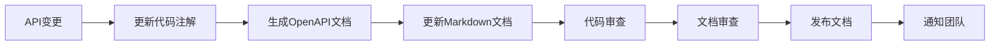

# Junmo Platform API文档规范

## 📋 文档信息

| 项目 | 内容 |
|------|------|
| **文档名称** | Junmo Platform API文档规范 |
| **版本号** | v1.0.0 |
| **创建日期** | 2025-12-24 |
| **作者** | API架构师 |
| **审核人** | 技术架构师 |
| **批准人** | 项目经理 |

## 🎯 文档目的

本文档定义了Junmo Platform企业级智能管理平台的API设计规范、文档标准和最佳实践，确保所有API接口的一致性、可维护性和易用性。

## 🏗️ API架构概述

### RESTful API设计原则

#### 1. 资源导向设计
- **资源识别**: 使用名词而非动词描述资源
- **URI设计**: 使用层次化的资源结构
- **HTTP方法**: 正确使用HTTP语义
- **状态码**: 标准HTTP状态码使用

#### 2. 统一接口规范
- **请求格式**: 统一的请求体结构
- **响应格式**: 统一的响应体结构
- **错误处理**: 统一的错误响应格式
- **分页机制**: 统一的分页参数和响应

#### 3. 版本管理策略
- **URL版本控制**: `/api/v1/`, `/api/v2/`
- **向后兼容**: 保持API向后兼容性
- **废弃策略**: 明确的API废弃和迁移计划

### API设计规范

#### 1. URI设计规范

**基础URI结构**
```
https://Junmo Platform.example.com/api/{version}/{resource}/{id}
```

**命名规范**
- 使用小写字母和连字符
- 使用复数形式表示资源集合
- 避免深层嵌套（最多3层）
- 使用查询参数进行过滤和排序

**示例**
```yaml
# 正确示例
GET /api/v1/users
GET /api/v1/users/{userId}/documents
GET /api/v1/documents?category=tech&status=published

# 错误示例
GET /api/v1/getAllUsers
GET /api/v1/users/{userId}/documents/{documentId}/comments/{commentId}
```

#### 2. HTTP方法使用规范

| 方法 | 用途 | 幂等性 | 安全性 |
|------|------|--------|--------|
| GET | 获取资源 | ✅ | ✅ |
| POST | 创建资源 | ❌ | ❌ |
| PUT | 完整更新资源 | ✅ | ❌ |
| PATCH | 部分更新资源 | ❌ | ❌ |
| DELETE | 删除资源 | ✅ | ❌ |
| OPTIONS | 获取支持的方法 | ✅ | ✅ |

**使用示例**
```yaml
# 用户管理API
GET    /api/v1/users           # 获取用户列表
GET    /api/v1/users/{id}      # 获取特定用户
POST   /api/v1/users           # 创建新用户
PUT    /api/v1/users/{id}      # 完整更新用户信息
PATCH  /api/v1/users/{id}      # 部分更新用户信息
DELETE /api/v1/users/{id}      # 删除用户
```

#### 3. 请求响应格式规范

**统一请求格式**
```json
{
  "data": {
    // 业务数据
  },
  "meta": {
    "timestamp": "2025-12-24T10:30:00Z",
    "requestId": "req_123456789"
  }
}
```

**统一成功响应格式**
```json
{
  "code": 200,
  "message": "Success",
  "data": {
    // 响应数据
  },
  "meta": {
    "timestamp": "2025-12-24T10:30:00Z",
    "requestId": "req_123456789",
    "duration": 150
  }
}
```

**分页响应格式**
```json
{
  "code": 200,
  "message": "Success",
  "data": {
    "content": [
      // 数据列表
    ],
    "page": {
      "number": 0,
      "size": 20,
      "totalElements": 100,
      "totalPages": 5,
      "first": true,
      "last": false
    }
  },
  "meta": {
    "timestamp": "2025-12-24T10:30:00Z",
    "requestId": "req_123456789"
  }
}
```

**统一错误响应格式**
```json
{
  "code": 400,
  "message": "Bad Request",
  "error": {
    "type": "VALIDATION_ERROR",
    "details": [
      {
        "field": "email",
        "message": "Invalid email format",
        "code": "EMAIL_INVALID"
      }
    ]
  },
  "meta": {
    "timestamp": "2025-12-24T10:30:00Z",
    "requestId": "req_123456789"
  }
}
```

## 📚 API文档结构

### 1. 文档组织架构

```
docs/
├── api/
│   ├── README.md                    # API概述和快速开始
│   ├── authentication.md           # 认证授权说明
│   ├── error-codes.md              # 错误码参考
│   ├── rate-limiting.md            # 限流说明
│   └── openapi.yaml                # OpenAPI规范文件
├── modules/
│   ├── user-management/
│   │   ├── README.md               # 用户管理API概述
│   │   ├── users.md                # 用户API文档
│   │   ├── roles.md                # 角色API文档
│   │   └── permissions.md          # 权限API文档
│   ├── content-management/
│   │   ├── README.md               # 内容管理API概述
│   │   ├── documents.md            # 文档API文档
│   │   ├── categories.md           # 分类API文档
│   │   └── tags.md                 # 标签API文档
│   ├── workflow/
│   │   ├── README.md               # 工作流API概述
│   │   ├── processes.md            # 流程API文档
│   │   └── tasks.md                # 任务API文档
│   └── system/
│       ├── README.md               # 系统API概述
│       ├── health.md               # 健康检查API
│       └── metrics.md              # 监控指标API
└── examples/
    ├── curl/                       # curl命令示例
    ├── postman/                    # Postman集合
    └── code/                       # 代码示例
```

### 2. OpenAPI规范

**基础信息配置**
```yaml
openapi: 3.0.3
info:
  title: Junmo Platform API
  description: 企业级智能管理平台API文档
  version: 1.0.0
  contact:
    name: API Support
    email: api-support@Junmo Platform.com
  license:
    name: MIT
    url: https://opensource.org/licenses/MIT

servers:
  - url: https://api.Junmo Platform.com/v1
    description: 生产环境
  - url: https://staging-api.Junmo Platform.com/v1
    description: 测试环境
  - url: http://localhost:8080/api/v1
    description: 开发环境

security:
  - BearerAuth: []

components:
  securitySchemes:
    BearerAuth:
      type: http
      scheme: bearer
      bearerFormat: JWT
```

**通用响应模型**
```yaml
components:
  schemas:
    ApiResponse:
      type: object
      properties:
        code:
          type: integer
          description: 响应状态码
        message:
          type: string
          description: 响应消息
        data:
          type: object
          description: 响应数据
        meta:
          $ref: '#/components/schemas/ResponseMeta'
    
    ResponseMeta:
      type: object
      properties:
        timestamp:
          type: string
          format: date-time
          description: 响应时间戳
        requestId:
          type: string
          description: 请求ID
        duration:
          type: integer
          description: 请求处理时长(ms)
    
    ErrorResponse:
      type: object
      properties:
        code:
          type: integer
          description: 错误状态码
        message:
          type: string
          description: 错误消息
        error:
          $ref: '#/components/schemas/ErrorDetail'
        meta:
          $ref: '#/components/schemas/ResponseMeta'
    
    ErrorDetail:
      type: object
      properties:
        type:
          type: string
          description: 错误类型
        details:
          type: array
          items:
            $ref: '#/components/schemas/ValidationError'
    
    ValidationError:
      type: object
      properties:
        field:
          type: string
          description: 错误字段
        message:
          type: string
          description: 错误描述
        code:
          type: string
          description: 错误代码
```

## 🔐 认证授权规范

### 1. 认证机制

#### JWT Token认证
```yaml
# 请求头格式
Authorization: Bearer <JWT_TOKEN>

# Token结构
{
  "header": {
    "alg": "HS256",
    "typ": "JWT"
  },
  "payload": {
    "sub": "user123",
    "roles": ["USER", "ADMIN"],
    "exp": 1735065600,
    "iat": 1735062000
  }
}
```

#### API Key认证（第三方集成）
```yaml
# 请求头格式
X-API-Key: <API_KEY>
X-API-Secret: <API_SECRET>

# 使用场景
- 第三方系统集成
- 服务间调用
- 批量数据操作
```

### 2. 权限控制

#### 基于角色的访问控制(RBAC)
```yaml
# 权限级别
- PUBLIC: 公开访问，无需认证
- USER: 普通用户权限
- ADMIN: 管理员权限
- SUPER_ADMIN: 超级管理员权限

# 权限检查示例
@PreAuthorize("hasRole('USER')")
@GetMapping("/profile")
public UserProfile getProfile() {
    // 获取用户资料
}

@PreAuthorize("hasRole('ADMIN')")
@PostMapping("/users")
public UserDTO createUser(@RequestBody CreateUserRequest request) {
    // 创建用户（需要管理员权限）
}
```

#### 资源级权限控制
```yaml
# 用户只能访问自己的资源
GET /api/v1/users/{userId}/documents
# 权限检查: userId == currentUserId || hasRole('ADMIN')

# 组织级权限控制
GET /api/v1/organizations/{orgId}/users
# 权限检查: isMemberOf(orgId) || hasRole('ADMIN')
```

## 📊 API模块设计

### 1. 用户管理模块API

#### 用户CRUD操作
```yaml
paths:
  /api/v1/users:
    get:
      summary: 获取用户列表
      parameters:
        - name: page
          in: query
          schema:
            type: integer
            default: 0
        - name: size
          in: query
          schema:
            type: integer
            default: 20
        - name: keyword
          in: query
          schema:
            type: string
        - name: status
          in: query
          schema:
            type: string
            enum: [ACTIVE, INACTIVE, LOCKED]
      responses:
        '200':
          description: 成功返回用户列表
          content:
            application/json:
              schema:
                $ref: '#/components/schemas/UserListResponse'
    
    post:
      summary: 创建用户
      requestBody:
        required: true
        content:
          application/json:
            schema:
              $ref: '#/components/schemas/CreateUserRequest'
      responses:
        '201':
          description: 用户创建成功
          content:
            application/json:
              schema:
                $ref: '#/components/schemas/UserResponse'

  /api/v1/users/{userId}:
    get:
      summary: 获取用户详情
      parameters:
        - name: userId
          in: path
          required: true
          schema:
            type: integer
      responses:
        '200':
          description: 成功返回用户详情
          content:
            application/json:
              schema:
                $ref: '#/components/schemas/UserResponse'
    
    put:
      summary: 更新用户信息
      parameters:
        - name: userId
          in: path
          required: true
          schema:
            type: integer
      requestBody:
        required: true
        content:
          application/json:
            schema:
              $ref: '#/components/schemas/UpdateUserRequest'
      responses:
        '200':
          description: 用户更新成功
          content:
            application/json:
              schema:
                $ref: '#/components/schemas/UserResponse'
    
    delete:
      summary: 删除用户
      parameters:
        - name: userId
          in: path
          required: true
          schema:
            type: integer
      responses:
        '204':
          description: 用户删除成功
```

#### 数据模型定义
```yaml
components:
  schemas:
    UserResponse:
      type: object
      properties:
        id:
          type: integer
          description: 用户ID
        username:
          type: string
          description: 用户名
        email:
          type: string
          format: email
          description: 邮箱地址
        status:
          type: string
          enum: [ACTIVE, INACTIVE, LOCKED]
          description: 用户状态
        profile:
          $ref: '#/components/schemas/UserProfile'
        roles:
          type: array
          items:
            $ref: '#/components/schemas/Role'
        createdAt:
          type: string
          format: date-time
          description: 创建时间
        updatedAt:
          type: string
          format: date-time
          description: 更新时间
    
    UserProfile:
      type: object
      properties:
        firstName:
          type: string
          description: 名
        lastName:
          type: string
          description: 姓
        phone:
          type: string
          description: 电话号码
        avatar:
          type: string
          description: 头像URL
        department:
          type: string
          description: 部门
        position:
          type: string
          description: 职位
    
    CreateUserRequest:
      type: object
      required:
        - username
        - email
        - password
      properties:
        username:
          type: string
          minLength: 3
          maxLength: 50
          pattern: '^[a-zA-Z0-9_]+$'
          description: 用户名
        email:
          type: string
          format: email
          description: 邮箱地址
        password:
          type: string
          minLength: 8
          description: 密码
        profile:
          $ref: '#/components/schemas/UserProfile'
        roleIds:
          type: array
          items:
            type: integer
          description: 角色ID列表
```

### 2. 内容管理模块API

#### 文档管理API
```yaml
paths:
  /api/v1/documents:
    get:
      summary: 获取文档列表
      parameters:
        - name: categoryId
          in: query
          schema:
            type: integer
        - name: status
          in: query
          schema:
            type: string
            enum: [DRAFT, PUBLISHED, ARCHIVED]
        - name: authorId
          in: query
          schema:
            type: integer
        - name: tags
          in: query
          schema:
            type: array
            items:
              type: string
      responses:
        '200':
          description: 成功返回文档列表
          content:
            application/json:
              schema:
                $ref: '#/components/schemas/DocumentListResponse'
    
    post:
      summary: 创建文档
      requestBody:
        required: true
        content:
          multipart/form-data:
            schema:
              $ref: '#/components/schemas/CreateDocumentRequest'
      responses:
        '201':
          description: 文档创建成功
          content:
            application/json:
              schema:
                $ref: '#/components/schemas/DocumentResponse'

  /api/v1/documents/{documentId}:
    get:
      summary: 获取文档详情
      parameters:
        - name: documentId
          in: path
          required: true
          schema:
            type: integer
      responses:
        '200':
          description: 成功返回文档详情
          content:
            application/json:
              schema:
                $ref: '#/components/schemas/DocumentResponse'
    
    put:
      summary: 更新文档
      parameters:
        - name: documentId
          in: path
          required: true
          schema:
            type: integer
      requestBody:
        required: true
        content:
          multipart/form-data:
            schema:
              $ref: '#/components/schemas/UpdateDocumentRequest'
      responses:
        '200':
          description: 文档更新成功
          content:
            application/json:
              schema:
                $ref: '#/components/schemas/DocumentResponse'
    
    delete:
      summary: 删除文档
      parameters:
        - name: documentId
          in: path
          required: true
          schema:
            type: integer
      responses:
        '204':
          description: 文档删除成功

  /api/v1/documents/{documentId}/publish:
    post:
      summary: 发布文档
      parameters:
        - name: documentId
          in: path
          required: true
          schema:
            type: integer
      responses:
        '200':
          description: 文档发布成功
          content:
            application/json:
              schema:
                $ref: '#/components/schemas/DocumentResponse'
```

### 3. 工作流模块API

#### 流程管理API
```yaml
paths:
  /api/v1/processes:
    get:
      summary: 获取流程列表
      parameters:
        - name: status
          in: query
          schema:
            type: string
            enum: [RUNNING, COMPLETED, SUSPENDED]
        - name: startedBy
          in: query
          schema:
            type: integer
      responses:
        '200':
          description: 成功返回流程列表
          content:
            application/json:
              schema:
                $ref: '#/components/schemas/ProcessListResponse'
    
    post:
      summary: 启动新流程
      requestBody:
        required: true
        content:
          application/json:
            schema:
              $ref: '#/components/schemas/StartProcessRequest'
      responses:
        '201':
          description: 流程启动成功
          content:
            application/json:
              schema:
                $ref: '#/components/schemas/ProcessResponse'

  /api/v1/processes/{processId}:
    get:
      summary: 获取流程详情
      parameters:
        - name: processId
          in: path
          required: true
          schema:
            type: string
      responses:
        '200':
          description: 成功返回流程详情
          content:
            application/json:
              schema:
                $ref: '#/components/schemas/ProcessResponse'
    
    delete:
      summary: 终止流程
      parameters:
        - name: processId
          in: path
          required: true
          schema:
            type: string
      responses:
        '204':
          description: 流程终止成功

  /api/v1/processes/{processId}/tasks:
    get:
      summary: 获取流程任务列表
      parameters:
        - name: processId
          in: path
          required: true
          schema:
            type: string
        - name: assignee
          in: query
          schema:
            type: integer
        - name: status
          in: query
          schema:
            type: string
            enum: [PENDING, COMPLETED, CANCELLED]
      responses:
        '200':
          description: 成功返回任务列表
          content:
            application/json:
              schema:
                $ref: '#/components/schemas/TaskListResponse'
```

## 🚨 错误处理规范

### 1. HTTP状态码使用

| 状态码 | 类别 | 使用场景 |
|--------|------|----------|
| 200 | 成功 | 请求成功处理 |
| 201 | 成功 | 资源创建成功 |
| 204 | 成功 | 请求成功但无返回内容 |
| 400 | 客户端错误 | 请求参数错误 |
| 401 | 客户端错误 | 未认证 |
| 403 | 客户端错误 | 无权限 |
| 404 | 客户端错误 | 资源不存在 |
| 409 | 客户端错误 | 资源冲突 |
| 422 | 客户端错误 | 请求参数验证失败 |
| 429 | 客户端错误 | 请求频率限制 |
| 500 | 服务器错误 | 服务器内部错误 |
| 503 | 服务器错误 | 服务不可用 |

### 2. 业务错误码

```yaml
# 错误码规范: {模块}_{错误类型}_{具体错误}
# 模块: USER(用户), CONTENT(内容), WORKFLOW(工作流), SYSTEM(系统)
# 错误类型: VALID(验证), AUTH(认证), PERM(权限), BIZ(业务), SYS(系统)

# 用户模块错误码
USER_VALID_001: 用户名格式错误
USER_VALID_002: 邮箱格式错误
USER_VALID_003: 密码强度不足
USER_AUTH_001: 用户名或密码错误
USER_AUTH_002: 用户账户已被锁定
USER_AUTH_003: Token已过期
USER_PERM_001: 无权限访问该资源
USER_BIZ_001: 用户名已存在
USER_BIZ_002: 邮箱已被注册

# 内容模块错误码
CONTENT_VALID_001: 文档标题不能为空
CONTENT_VALID_002: 文档内容不能为空
CONTENT_PERM_001: 无权限编辑该文档
CONTENT_BIZ_001: 文档不存在
CONTENT_BIZ_002: 文档已发布，不能删除

# 工作流模块错误码
WORKFLOW_VALID_001: 流程定义不存在
WORKFLOW_VALID_002: 任务参数错误
WORKFLOW_PERM_001: 无权限处理该任务
WORKFLOW_BIZ_001: 流程已完成
WORKFLOW_BIZ_002: 任务已处理

# 系统错误码
SYS_SYS_001: 系统内部错误
SYS_SYS_002: 数据库连接错误
SYS_SYS_003: 外部服务不可用
SYS_RATE_001: 请求频率超限
SYS_MAINT_001: 系统维护中
```

### 3. 错误响应示例

```json
{
  "code": 422,
  "message": "Validation failed",
  "error": {
    "type": "VALIDATION_ERROR",
    "code": "USER_VALID_001",
    "details": [
      {
        "field": "username",
        "message": "用户名格式错误，只能包含字母、数字和下划线",
        "code": "USERNAME_FORMAT_INVALID"
      },
      {
        "field": "password",
        "message": "密码强度不足，至少8位包含大小写字母和数字",
        "code": "PASSWORD_STRENGTH_INSUFFICIENT"
      }
    ]
  },
  "meta": {
    "timestamp": "2025-12-24T10:30:00Z",
    "requestId": "req_123456789"
  }
}
```

## 📈 API性能和限流

### 1. 性能优化策略

#### 响应时间要求
```yaml
# 性能指标要求
- API响应时间: < 200ms (95%分位)
- 文件上传响应时间: < 5s
- 批量操作响应时间: < 30s
- 数据导出响应时间: < 60s
```

#### 缓存策略
```yaml
# 缓存配置
用户信息缓存: 30分钟
权限信息缓存: 15分钟
配置信息缓存: 2小时
文档列表缓存: 5分钟
```

### 2. 限流策略

#### 限流规则
```yaml
# 全局限流
- 每个IP: 1000 请求/小时
- 每个用户: 5000 请求/小时
- 每个API Key: 10000 请求/小时

# 接口级限流
- 登录接口: 10 请求/分钟/IP
- 文件上传: 100 请求/小时/用户
- 数据导出: 20 请求/小时/用户
- 批量操作: 50 请求/小时/用户
```

#### 限流响应
```json
{
  "code": 429,
  "message": "Too Many Requests",
  "error": {
    "type": "RATE_LIMIT_EXCEEDED",
    "details": [
      {
        "message": "请求频率超过限制",
        "limit": 1000,
        "remaining": 0,
        "resetTime": "2025-12-24T11:00:00Z"
      }
    ]
  },
  "meta": {
    "timestamp": "2025-12-24T10:30:00Z",
    "requestId": "req_123456789"
  }
}
```

## 📝 API文档生成和维护

### 1. 文档生成工具

#### SpringDoc OpenAPI集成
```java
@Configuration
public class OpenApiConfig {
    
    @Bean
    public OpenAPI Junmo PlatformOpenAPI() {
        return new OpenAPI()
            .info(new Info()
                .title("Junmo Platform API")
                .description("企业级智能管理平台API文档")
                .version("v1.0.0")
                .contact(new Contact()
                    .name("API Support")
                    .email("api-support@Junmo Platform.com"))
                .license(new License()
                    .name("MIT")
                    .url("https://opensource.org/licenses/MIT")))
            .addSecurityItem(new SecurityRequirement().addList("BearerAuth"))
            .components(new Components()
                .addSecuritySchemes("BearerAuth", new SecurityScheme()
                    .type(SecurityScheme.Type.HTTP)
                    .scheme("bearer")
                    .bearerFormat("JWT")));
    }
}
```

#### Swagger注解使用
```java
@RestController
@RequestMapping("/api/v1/users")
@Tag(name = "用户管理", description = "用户管理相关API")
public class UserController {
    
    @GetMapping
    @Operation(summary = "获取用户列表", description = "分页获取用户列表，支持关键词搜索和状态过滤")
    @ApiResponses({
        @ApiResponse(responseCode = "200", description = "成功返回用户列表",
            content = @Content(schema = @Schema(implementation = UserListResponse.class))),
        @ApiResponse(responseCode = "400", description = "请求参数错误"),
        @ApiResponse(responseCode = "401", description = "未认证"),
        @ApiResponse(responseCode = "403", description = "无权限")
    })
    public ResponseEntity<PageResponse<UserDTO>> getUsers(
            @Parameter(description = "页码，从0开始", example = "0") 
            @RequestParam(defaultValue = "0") int page,
            
            @Parameter(description = "每页大小", example = "20") 
            @RequestParam(defaultValue = "20") int size,
            
            @Parameter(description = "搜索关键词", example = "john") 
            @RequestParam(required = false) String keyword,
            
            @Parameter(description = "用户状态", example = "ACTIVE") 
            @RequestParam(required = false) UserStatus status) {
        
        PageRequest pageRequest = PageRequest.of(page, size);
        PageResponse<UserDTO> response = userService.getUsers(pageRequest, keyword, status);
        return ResponseEntity.ok(response);
    }
}
```

### 2. 文档维护流程

#### 文档更新流程


#### 版本管理策略
```yaml
# API版本管理
v1.0.0: 初始版本
v1.1.0: 新增功能（向后兼容）
v1.2.0: 功能增强（向后兼容）
v2.0.0: 重大变更（不向后兼容）

# 文档版本管理
- 与API版本保持同步
- 维护历史版本文档
- 提供版本迁移指南
```

## 🧪 API测试规范

### 1. 测试策略

#### 测试分层
```yaml
# 单元测试
- 测试单个API方法
- Mock外部依赖
- 覆盖率要求: > 90%

# 集成测试
- 测试API端到端流程
- 使用测试数据库
- 覆盖主要业务场景

# 契约测试
- 验证API契约一致性
- 使用Pact等工具
- 支持消费者驱动契约

# 性能测试
- 压力测试和负载测试
- 响应时间和并发测试
- 使用JMeter等工具
```

#### 测试用例示例
```java
@SpringBootTest
@AutoConfigureTestDatabase
class UserControllerTest {
    
    @Autowired
    private TestRestTemplate restTemplate;
    
    @Test
    @DisplayName("获取用户列表 - 成功")
    void getUsers_Success() {
        // Given
        User user = createTestUser();
        
        // When
        ResponseEntity<PageResponse<UserDTO>> response = restTemplate.getForEntity(
            "/api/v1/users?page=0&size=10", 
            new ParameterizedTypeReference<PageResponse<UserDTO>>() {});
        
        // Then
        assertThat(response.getStatusCode()).isEqualTo(HttpStatus.OK);
        assertThat(response.getBody().getContent()).isNotEmpty();
        assertThat(response.getBody().getPage().getSize()).isEqualTo(10);
    }
    
    @Test
    @DisplayName("创建用户 - 验证失败")
    void createUser_ValidationError() {
        // Given
        CreateUserRequest request = CreateUserRequest.builder()
            .username("")  // 无效用户名
            .email("invalid-email")  // 无效邮箱
            .password("123")  // 密码太短
            .build();
        
        // When
        ResponseEntity<ErrorResponse> response = restTemplate.postForEntity(
            "/api/v1/users", request, ErrorResponse.class);
        
        // Then
        assertThat(response.getStatusCode()).isEqualTo(HttpStatus.UNPROCESSABLE_ENTITY);
        assertThat(response.getBody().getError().getType()).isEqualTo("VALIDATION_ERROR");
        assertThat(response.getBody().getError().getDetails()).hasSize(3);
    }
}
```

### 2. 测试数据管理

#### 测试数据构建
```java
@Component
public class ApiTestDataBuilder {
    
    public static CreateUserRequest buildCreateUserRequest() {
        return CreateUserRequest.builder()
            .username("testuser")
            .email("test@example.com")
            .password("Password123!")
            .profile(UserProfile.builder()
                .firstName("Test")
                .lastName("User")
                .phone("13800138000")
                .build())
            .roleIds(Arrays.asList(2L))  // 普通用户角色
            .build();
    }
    
    public static DocumentDTO buildDocumentDTO() {
        return DocumentDTO.builder()
            .id(1L)
            .title("Test Document")
            .content("This is a test document content")
            .status(DocumentStatus.DRAFT)
            .categoryId(1L)
            .authorId(1L)
            .tags(Arrays.asList("test", "document"))
            .createdAt(LocalDateTime.now())
            .build();
    }
}
```

## 📋 API监控和日志

### 1. API监控指标

#### 关键指标
```yaml
# 性能指标
- 请求响应时间
- 请求成功率
- 错误率分布
- 并发用户数
- API调用量统计

# 业务指标
- 用户活跃度
- 功能使用率
- 数据操作量
- 文件上传下载量

# 系统指标
- CPU使用率
- 内存使用率
- 数据库连接数
- 缓存命中率
```

#### 监控实现
```java
@Component
public class ApiMetrics {
    
    private final Counter apiRequestCounter;
    private final Timer apiResponseTimer;
    private final Gauge activeUsersGauge;
    
    public ApiMetrics(MeterRegistry meterRegistry) {
        this.apiRequestCounter = Counter.builder("api.requests")
            .description("API请求总数")
            .register(meterRegistry);
        
        this.apiResponseTimer = Timer.builder("api.response.time")
            .description("API响应时间")
            .register(meterRegistry);
        
        this.activeUsersGauge = Gauge.builder("api.active.users")
            .description("活跃用户数")
            .register(meterRegistry, this, ApiMetrics::getActiveUserCount);
    }
    
    public void recordRequest(String endpoint, String method, int statusCode) {
        apiRequestCounter.increment(
            Tags.of("endpoint", endpoint, "method", method, "status", String.valueOf(statusCode))
        );
    }
    
    public Timer.Sample startTimer() {
        return Timer.start();
    }
    
    public void recordResponseTime(Timer.Sample sample) {
        sample.stop(apiResponseTimer);
    }
}
```

### 2. API日志规范

#### 日志格式
```json
{
  "timestamp": "2025-12-24T10:30:00.123Z",
  "level": "INFO",
  "logger": "com.junmo.Junmo Platform.web.controller.UserController",
  "message": "Get users request completed",
  "context": {
    "requestId": "req_123456789",
    "userId": "user123",
    "endpoint": "/api/v1/users",
    "method": "GET",
    "statusCode": 200,
    "duration": 150,
    "parameters": {
      "page": 0,
      "size": 20,
      "keyword": "john"
    }
  }
}
```

#### 日志记录实现
```java
@RestController
@Slf4j
public class UserController {
    
    @GetMapping
    public ResponseEntity<PageResponse<UserDTO>> getUsers(
            @RequestParam(defaultValue = "0") int page,
            @RequestParam(defaultValue = "20") int size,
            @RequestParam(required = false) String keyword,
            HttpServletRequest request) {
        
        String requestId = MDC.get("requestId");
        Timer.Sample sample = apiMetrics.startTimer();
        
        try {
            log.info("Get users request started - requestId: {}, params: page={}, size={}, keyword={}", 
                requestId, page, size, keyword);
            
            PageResponse<UserDTO> response = userService.getUsers(page, size, keyword);
            
            apiMetrics.recordRequest("/api/v1/users", "GET", 200);
            log.info("Get users request completed - requestId: {}, resultCount: {}", 
                requestId, response.getContent().size());
            
            return ResponseEntity.ok(response);
            
        } catch (Exception e) {
            apiMetrics.recordRequest("/api/v1/users", "GET", 500);
            log.error("Get users request failed - requestId: {}", requestId, e);
            throw e;
        } finally {
            apiMetrics.recordResponseTime(sample);
        }
    }
}
```

---

*本文档将随着API发展持续更新，确保API设计的一致性和文档的准确性。*