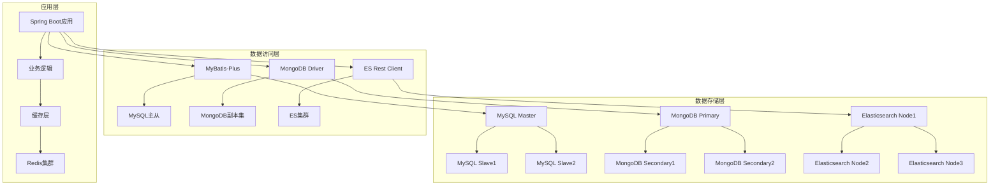
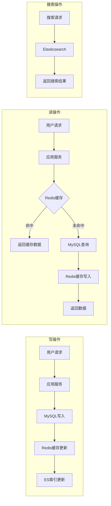

# Spring4demo 数据库详细设计文档

## 📋 文档信息

| 项目 | 内容 |
|------|------|
| **文档名称** | Spring4demo 数据库详细设计 |
| **版本号** | v1.1.0 |
| **创建日期** | 2025-12-24 |
| **更新日期** | 2026-01-07 |
| **作者** | 数据库架构师 |
| **审核人** | 技术架构师 |
| **批准人** | 项目经理 |

## 📝 更新说明

**v1.1.0 (2026-01-07)**:
- 主键策略从AUTO_INCREMENT调整为雪花算法
- 更新所有表的主键定义，使用雪花算法生成唯一ID

## 🎯 设计概述

### 数据库架构目标
Spring4demo采用多数据库架构，结合关系型数据库、文档数据库、缓存数据库和搜索引擎，为不同业务场景提供最优的数据存储解决方案。

### 技术选型
- **关系型数据库**: MySQL 8.0 - 存储结构化业务数据
- **文档数据库**: MongoDB 6.0 - 存储非结构化内容和日志数据
- **缓存数据库**: Redis 7.0 - 缓存热点数据和会话信息
- **搜索引擎**: Elasticsearch 8.0 - 全文搜索和数据分析

## 🏗️ 整体数据架构

### 数据架构图



### 数据流向图



## 📊 MySQL数据库设计

### 1. 数据库配置

#### 主库配置
```yaml
spring:
  datasource:
    master:
      url: jdbc:mysql://mysql-master:3306/spring4demo?useUnicode=true&characterEncoding=utf8&useSSL=false&serverTimezone=Asia/Shanghai
      username: ${DB_USERNAME}
      password: ${DB_PASSWORD}
      driver-class-name: com.mysql.cj.jdbc.Driver
      type: com.alibaba.druid.pool.DruidDataSource
      druid:
        initial-size: 5
        min-idle: 5
        max-active: 20
        max-wait: 60000
        time-between-eviction-runs-millis: 60000
        min-evictable-idle-time-millis: 300000
        validation-query: SELECT 1
        test-while-idle: true
        test-on-borrow: false
        test-on-return: false

# MyBatis-Plus 配置
mybatis-plus:
  configuration:
    map-underscore-to-camel-case: true
    cache-enabled: false
    call-setters-on-nulls: true
    jdbc-type-for-null: 'null'
  global-config:
    db-config:
      id-type: auto
      logic-delete-field: deleted
      logic-delete-value: 1
      logic-not-delete-value: 0
  mapper-locations: classpath*:/mapper/**/*.xml
        minimum-idle: 5
        idle-timeout: 300000
        max-lifetime: 1200000
        connection-timeout: 20000
        leak-detection-threshold: 60000
```

#### 从库配置
```yaml
spring:
  datasource:
    slave:
      url: jdbc:mysql://mysql-slave:3306/spring4demo?useUnicode=true&characterEncoding=utf8&useSSL=false&serverTimezone=Asia/Shanghai
      username: ${DB_USERNAME}
      password: ${DB_PASSWORD}
      driver-class-name: com.mysql.cj.jdbc.Driver
      hikari:
        maximum-pool-size: 10
        minimum-idle: 2
        idle-timeout: 300000
        max-lifetime: 1200000
        connection-timeout: 20000
```

### 2. 用户权限模块表设计

#### 用户表 (sys_user)
```sql
CREATE TABLE sys_user (
    id BIGINT PRIMARY KEY COMMENT '主键ID（雪花算法）',
    username VARCHAR(50) UNIQUE NOT NULL COMMENT '用户名',
    email VARCHAR(100) UNIQUE NOT NULL COMMENT '邮箱地址',
    password VARCHAR(255) NOT NULL COMMENT '密码（加密）',
    real_name VARCHAR(100) COMMENT '真实姓名',
    phone VARCHAR(20) COMMENT '手机号码',
    avatar VARCHAR(255) COMMENT '头像URL',
    status INT DEFAULT 1 COMMENT '用户状态（1-启用，0-禁用）',
    last_login_time DATETIME COMMENT '最后登录时间',
    last_login_ip VARCHAR(45) COMMENT '最后登录IP',
    password_updated_at DATETIME COMMENT '密码更新时间',
    email_verified BOOLEAN DEFAULT FALSE COMMENT '邮箱是否验证',
    phone_verified BOOLEAN DEFAULT FALSE COMMENT '手机是否验证',
    two_factor_enabled BOOLEAN DEFAULT FALSE COMMENT '是否启用双因子认证',
    created_at TIMESTAMP DEFAULT CURRENT_TIMESTAMP COMMENT '创建时间',
    updated_at TIMESTAMP DEFAULT CURRENT_TIMESTAMP ON UPDATE CURRENT_TIMESTAMP COMMENT '更新时间',
    created_by BIGINT COMMENT '创建人',
    updated_by BIGINT COMMENT '更新人',

    INDEX idx_username (username),
    INDEX idx_email (email),
    INDEX idx_phone (phone),
    INDEX idx_status (status),
    INDEX idx_created_at (created_at),
    INDEX idx_last_login_time (last_login_time)
) ENGINE=InnoDB DEFAULT CHARSET=utf8mb4 COLLATE=utf8mb4_unicode_ci COMMENT='用户表';
```

#### 角色表 (roles)
```sql
CREATE TABLE roles (
    id BIGINT AUTO_INCREMENT PRIMARY KEY COMMENT '角色ID',
    name VARCHAR(50) UNIQUE NOT NULL COMMENT '角色名称',
    code VARCHAR(50) UNIQUE NOT NULL COMMENT '角色编码',
    description VARCHAR(255) COMMENT '角色描述',
    status ENUM('ACTIVE', 'INACTIVE') DEFAULT 'ACTIVE' COMMENT '角色状态',
    is_system BOOLEAN DEFAULT FALSE COMMENT '是否系统角色',
    sort_order INT DEFAULT 0 COMMENT '排序',
    created_at TIMESTAMP DEFAULT CURRENT_TIMESTAMP COMMENT '创建时间',
    updated_at TIMESTAMP DEFAULT CURRENT_TIMESTAMP ON UPDATE CURRENT_TIMESTAMP COMMENT '更新时间',
    created_by BIGINT COMMENT '创建人',
    updated_by BIGINT COMMENT '更新人',
    
    INDEX idx_name (name),
    INDEX idx_code (code),
    INDEX idx_status (status),
    INDEX idx_sort_order (sort_order)
) ENGINE=InnoDB DEFAULT CHARSET=utf8mb4 COLLATE=utf8mb4_unicode_ci COMMENT='角色表';
```

#### 权限表 (permissions)
```sql
CREATE TABLE permissions (
    id BIGINT AUTO_INCREMENT PRIMARY KEY COMMENT '权限ID',
    name VARCHAR(100) UNIQUE NOT NULL COMMENT '权限名称',
    code VARCHAR(100) UNIQUE NOT NULL COMMENT '权限编码',
    resource VARCHAR(100) NOT NULL COMMENT '资源',
    action VARCHAR(50) NOT NULL COMMENT '操作',
    description VARCHAR(255) COMMENT '权限描述',
    status ENUM('ACTIVE', 'INACTIVE') DEFAULT 'ACTIVE' COMMENT '权限状态',
    is_system BOOLEAN DEFAULT FALSE COMMENT '是否系统权限',
    parent_id BIGINT COMMENT '父权限ID',
    sort_order INT DEFAULT 0 COMMENT '排序',
    created_at TIMESTAMP DEFAULT CURRENT_TIMESTAMP COMMENT '创建时间',
    updated_at TIMESTAMP DEFAULT CURRENT_TIMESTAMP ON UPDATE CURRENT_TIMESTAMP COMMENT '更新时间',
    
    INDEX idx_name (name),
    INDEX idx_code (code),
    INDEX idx_resource (resource),
    INDEX idx_action (action),
    INDEX idx_status (status),
    INDEX idx_parent_id (parent_id),
    INDEX idx_sort_order (sort_order),
    FOREIGN KEY (parent_id) REFERENCES permissions(id) ON DELETE SET NULL
) ENGINE=InnoDB DEFAULT CHARSET=utf8mb4 COLLATE=utf8mb4_unicode_ci COMMENT='权限表';
```

#### 用户角色关联表 (user_roles)
```sql
CREATE TABLE user_roles (
    id BIGINT AUTO_INCREMENT PRIMARY KEY COMMENT '关联ID',
    user_id BIGINT NOT NULL COMMENT '用户ID',
    role_id BIGINT NOT NULL COMMENT '角色ID',
    assigned_at TIMESTAMP DEFAULT CURRENT_TIMESTAMP COMMENT '分配时间',
    assigned_by BIGINT COMMENT '分配人',
    expires_at TIMESTAMP COMMENT '过期时间',
    
    UNIQUE KEY uk_user_role (user_id, role_id),
    INDEX idx_user_id (user_id),
    INDEX idx_role_id (role_id),
    INDEX idx_assigned_at (assigned_at),
    INDEX idx_expires_at (expires_at),
    FOREIGN KEY (user_id) REFERENCES users(id) ON DELETE CASCADE,
    FOREIGN KEY (role_id) REFERENCES roles(id) ON DELETE CASCADE
) ENGINE=InnoDB DEFAULT CHARSET=utf8mb4 COLLATE=utf8mb4_unicode_ci COMMENT='用户角色关联表';
```

#### 角色权限关联表 (role_permissions)
```sql
CREATE TABLE role_permissions (
    id BIGINT PRIMARY KEY COMMENT '主键ID（雪花算法）',
    role_id BIGINT NOT NULL COMMENT '角色ID',
    permission_id BIGINT NOT NULL COMMENT '权限ID',
    granted_at TIMESTAMP DEFAULT CURRENT_TIMESTAMP COMMENT '授权时间',
    granted_by BIGINT COMMENT '授权人',
    
    UNIQUE KEY uk_role_permission (role_id, permission_id),
    INDEX idx_role_id (role_id),
    INDEX idx_permission_id (permission_id),
    INDEX idx_granted_at (granted_at),
    FOREIGN KEY (role_id) REFERENCES roles(id) ON DELETE CASCADE,
    FOREIGN KEY (permission_id) REFERENCES permissions(id) ON DELETE CASCADE
) ENGINE=InnoDB DEFAULT CHARSET=utf8mb4 COLLATE=utf8mb4_unicode_ci COMMENT='角色权限关联表';
```

### 3. 内容管理模块表设计

#### 文档表 (documents)
```sql
CREATE TABLE documents (
    id BIGINT AUTO_INCREMENT PRIMARY KEY COMMENT '文档ID',
    title VARCHAR(255) NOT NULL COMMENT '文档标题',
    summary TEXT COMMENT '文档摘要',
    content LONGTEXT COMMENT '文档内容',
    category_id BIGINT COMMENT '分类ID',
    author_id BIGINT NOT NULL COMMENT '作者ID',
    status ENUM('DRAFT', 'PUBLISHED', 'ARCHIVED', 'DELETED') DEFAULT 'DRAFT' COMMENT '文档状态',
    version INT DEFAULT 1 COMMENT '版本号',
    view_count BIGINT DEFAULT 0 COMMENT '查看次数',
    download_count BIGINT DEFAULT 0 COMMENT '下载次数',
    like_count BIGINT DEFAULT 0 COMMENT '点赞数',
    comment_count BIGINT DEFAULT 0 COMMENT '评论数',
    file_path VARCHAR(500) COMMENT '文件路径',
    file_size BIGINT COMMENT '文件大小（字节）',
    file_type VARCHAR(50) COMMENT '文件类型',
    thumbnail_path VARCHAR(500) COMMENT '缩略图路径',
    is_top BOOLEAN DEFAULT FALSE COMMENT '是否置顶',
    is_featured BOOLEAN DEFAULT FALSE COMMENT '是否推荐',
    published_at TIMESTAMP NULL COMMENT '发布时间',
    archived_at TIMESTAMP NULL COMMENT '归档时间',
    created_at TIMESTAMP DEFAULT CURRENT_TIMESTAMP COMMENT '创建时间',
    updated_at TIMESTAMP DEFAULT CURRENT_TIMESTAMP ON UPDATE CURRENT_TIMESTAMP COMMENT '更新时间',
    created_by BIGINT COMMENT '创建人',
    updated_by BIGINT COMMENT '更新人',
    
    INDEX idx_title (title),
    INDEX idx_category_id (category_id),
    INDEX idx_author_id (author_id),
    INDEX idx_status (status),
    INDEX idx_published_at (published_at),
    INDEX idx_created_at (created_at),
    INDEX idx_updated_at (updated_at),
    INDEX idx_view_count (view_count),
    INDEX idx_is_top (is_top),
    INDEX idx_is_featured (is_featured),
    FULLTEXT INDEX ft_title_content (title, content),
    FOREIGN KEY (category_id) REFERENCES categories(id) ON DELETE SET NULL,
    FOREIGN KEY (author_id) REFERENCES users(id) ON DELETE CASCADE
) ENGINE=InnoDB DEFAULT CHARSET=utf8mb4 COLLATE=utf8mb4_unicode_ci COMMENT='文档表';
```

#### 分类表 (categories)
```sql
CREATE TABLE categories (
    id BIGINT AUTO_INCREMENT PRIMARY KEY COMMENT '分类ID',
    name VARCHAR(100) NOT NULL COMMENT '分类名称',
    code VARCHAR(50) UNIQUE COMMENT '分类编码',
    description TEXT COMMENT '分类描述',
    parent_id BIGINT COMMENT '父分类ID',
    icon VARCHAR(100) COMMENT '图标',
    sort_order INT DEFAULT 0 COMMENT '排序',
    status ENUM('ACTIVE', 'INACTIVE') DEFAULT 'ACTIVE' COMMENT '分类状态',
    document_count BIGINT DEFAULT 0 COMMENT '文档数量',
    created_at TIMESTAMP DEFAULT CURRENT_TIMESTAMP COMMENT '创建时间',
    updated_at TIMESTAMP DEFAULT CURRENT_TIMESTAMP ON UPDATE CURRENT_TIMESTAMP COMMENT '更新时间',
    created_by BIGINT COMMENT '创建人',
    updated_by BIGINT COMMENT '更新人',
    
    INDEX idx_name (name),
    INDEX idx_code (code),
    INDEX idx_parent_id (parent_id),
    INDEX idx_status (status),
    INDEX idx_sort_order (sort_order),
    INDEX idx_document_count (document_count),
    FOREIGN KEY (parent_id) REFERENCES categories(id) ON DELETE SET NULL
) ENGINE=InnoDB DEFAULT CHARSET=utf8mb4 COLLATE=utf8mb4_unicode_ci COMMENT='分类表';
```

#### 标签表 (tags)
```sql
CREATE TABLE tags (
    id BIGINT AUTO_INCREMENT PRIMARY KEY COMMENT '标签ID',
    name VARCHAR(50) UNIQUE NOT NULL COMMENT '标签名称',
    color VARCHAR(7) DEFAULT '#1890ff' COMMENT '标签颜色',
    description VARCHAR(255) COMMENT '标签描述',
    usage_count BIGINT DEFAULT 0 COMMENT '使用次数',
    status ENUM('ACTIVE', 'INACTIVE') DEFAULT 'ACTIVE' COMMENT '标签状态',
    created_at TIMESTAMP DEFAULT CURRENT_TIMESTAMP COMMENT '创建时间',
    updated_at TIMESTAMP DEFAULT CURRENT_TIMESTAMP ON UPDATE CURRENT_TIMESTAMP COMMENT '更新时间',
    created_by BIGINT COMMENT '创建人',
    
    INDEX idx_name (name),
    INDEX idx_status (status),
    INDEX idx_usage_count (usage_count)
) ENGINE=InnoDB DEFAULT CHARSET=utf8mb4 COLLATE=utf8mb4_unicode_ci COMMENT='标签表';
```

#### 文档标签关联表 (document_tags)
```sql
CREATE TABLE document_tags (
    id BIGINT PRIMARY KEY COMMENT '主键ID（雪花算法）',
    document_id BIGINT NOT NULL COMMENT '文档ID',
    tag_id BIGINT NOT NULL COMMENT '标签ID',
    created_at TIMESTAMP DEFAULT CURRENT_TIMESTAMP COMMENT '创建时间',
    created_by BIGINT COMMENT '创建人',
    
    UNIQUE KEY uk_document_tag (document_id, tag_id),
    INDEX idx_document_id (document_id),
    INDEX idx_tag_id (tag_id),
    INDEX idx_created_at (created_at),
    FOREIGN KEY (document_id) REFERENCES documents(id) ON DELETE CASCADE,
    FOREIGN KEY (tag_id) REFERENCES tags(id) ON DELETE CASCADE
) ENGINE=InnoDB DEFAULT CHARSET=utf8mb4 COLLATE=utf8mb4_unicode_ci COMMENT='文档标签关联表';
```

### 4. 工作流模块表设计

#### 流程定义表 (process_definitions)
```sql
CREATE TABLE process_definitions (
    id BIGINT AUTO_INCREMENT PRIMARY KEY COMMENT '流程定义ID',
    name VARCHAR(255) NOT NULL COMMENT '流程名称',
    key VARCHAR(100) UNIQUE NOT NULL COMMENT '流程键',
    version INT DEFAULT 1 COMMENT '版本号',
    description TEXT COMMENT '流程描述',
    bpmn_xml LONGTEXT NOT NULL COMMENT 'BPMN XML内容',
    status ENUM('ACTIVE', 'INACTIVE', 'DEPRECATED') DEFAULT 'ACTIVE' COMMENT '流程状态',
    category VARCHAR(100) COMMENT '流程分类',
    start_form_config JSON COMMENT '启动表单配置',
    is_system BOOLEAN DEFAULT FALSE COMMENT '是否系统流程',
    deployed_at TIMESTAMP NULL COMMENT '部署时间',
    created_at TIMESTAMP DEFAULT CURRENT_TIMESTAMP COMMENT '创建时间',
    updated_at TIMESTAMP DEFAULT CURRENT_TIMESTAMP ON UPDATE CURRENT_TIMESTAMP COMMENT '更新时间',
    created_by BIGINT COMMENT '创建人',
    updated_by BIGINT COMMENT '更新人',
    
    INDEX idx_name (name),
    INDEX idx_key (key),
    INDEX idx_version (version),
    INDEX idx_status (status),
    INDEX idx_category (category),
    INDEX idx_deployed_at (deployed_at),
    INDEX idx_created_at (created_at)
) ENGINE=InnoDB DEFAULT CHARSET=utf8mb4 COLLATE=utf8mb4_unicode_ci COMMENT='流程定义表';
```

#### 流程实例表 (process_instances)
```sql
CREATE TABLE process_instances (
    id BIGINT PRIMARY KEY COMMENT '主键ID（雪花算法）',
    process_definition_id BIGINT NOT NULL COMMENT '流程定义ID',
    process_definition_key VARCHAR(100) NOT NULL COMMENT '流程定义键',
    business_key VARCHAR(255) COMMENT '业务键',
    name VARCHAR(255) COMMENT '流程实例名称',
    status ENUM('RUNNING', 'COMPLETED', 'SUSPENDED', 'TERMINATED') DEFAULT 'RUNNING' COMMENT '流程状态',
    start_time TIMESTAMP DEFAULT CURRENT_TIMESTAMP COMMENT '开始时间',
    end_time TIMESTAMP NULL COMMENT '结束时间',
    duration BIGINT COMMENT '持续时长（毫秒）',
    started_by BIGINT COMMENT '启动人',
    current_activity VARCHAR(255) COMMENT '当前活动',
    variables JSON COMMENT '流程变量',
    delete_reason VARCHAR(255) COMMENT '删除原因',
    created_at TIMESTAMP DEFAULT CURRENT_TIMESTAMP COMMENT '创建时间',
    updated_at TIMESTAMP DEFAULT CURRENT_TIMESTAMP ON UPDATE CURRENT_TIMESTAMP COMMENT '更新时间',
    
    INDEX idx_process_definition_id (process_definition_id),
    INDEX idx_process_definition_key (process_definition_key),
    INDEX idx_business_key (business_key),
    INDEX idx_status (status),
    INDEX idx_start_time (start_time),
    INDEX idx_end_time (end_time),
    INDEX idx_started_by (started_by),
    INDEX idx_current_activity (current_activity),
    FOREIGN KEY (process_definition_id) REFERENCES process_definitions(id)
) ENGINE=InnoDB DEFAULT CHARSET=utf8mb4 COLLATE=utf8mb4_unicode_ci COMMENT='流程实例表';
```

#### 任务实例表 (task_instances)
```sql
CREATE TABLE task_instances (
    id BIGINT AUTO_INCREMENT PRIMARY KEY COMMENT '任务ID',
    process_instance_id BIGINT NOT NULL COMMENT '流程实例ID',
    name VARCHAR(255) NOT NULL COMMENT '任务名称',
    description TEXT COMMENT '任务描述',
    assignee BIGINT COMMENT '分配人',
    owner BIGINT COMMENT '任务所有者',
    status ENUM('ACTIVE', 'COMPLETED', 'CANCELLED') DEFAULT 'ACTIVE' COMMENT '任务状态',
    priority INT DEFAULT 50 COMMENT '优先级',
    create_time TIMESTAMP DEFAULT CURRENT_TIMESTAMP COMMENT '创建时间',
    due_time TIMESTAMP NULL COMMENT '到期时间',
    completion_time TIMESTAMP NULL COMMENT '完成时间',
    duration BIGINT COMMENT '处理时长（毫秒）',
    variables JSON COMMENT '任务变量',
    form_key VARCHAR(255) COMMENT '表单键',
    category VARCHAR(100) COMMENT '任务分类',
    parent_task_id BIGINT COMMENT '父任务ID',
    created_at TIMESTAMP DEFAULT CURRENT_TIMESTAMP COMMENT '创建时间',
    updated_at TIMESTAMP DEFAULT CURRENT_TIMESTAMP ON UPDATE CURRENT_TIMESTAMP COMMENT '更新时间',
    
    INDEX idx_process_instance_id (process_instance_id),
    INDEX idx_assignee (assignee),
    INDEX idx_owner (owner),
    INDEX idx_status (status),
    INDEX idx_priority (priority),
    INDEX idx_create_time (create_time),
    INDEX idx_due_time (due_time),
    INDEX idx_completion_time (completion_time),
    INDEX idx_category (category),
    INDEX idx_parent_task_id (parent_task_id),
    FOREIGN KEY (process_instance_id) REFERENCES process_instances(id) ON DELETE CASCADE,
    FOREIGN KEY (assignee) REFERENCES users(id) ON DELETE SET NULL,
    FOREIGN KEY (owner) REFERENCES users(id) ON DELETE SET NULL,
    FOREIGN KEY (parent_task_id) REFERENCES task_instances(id) ON DELETE SET NULL
) ENGINE=InnoDB DEFAULT CHARSET=utf8mb4 COLLATE=utf8mb4_unicode_ci COMMENT='任务实例表';
```

### 5. 系统模块表设计

#### 系统配置表 (system_configs)
```sql
CREATE TABLE system_configs (
    id BIGINT AUTO_INCREMENT PRIMARY KEY COMMENT '配置ID',
    module VARCHAR(50) NOT NULL COMMENT '模块',
    config_key VARCHAR(100) NOT NULL COMMENT '配置键',
    config_value TEXT COMMENT '配置值',
    config_type ENUM('STRING', 'NUMBER', 'BOOLEAN', 'JSON') DEFAULT 'STRING' COMMENT '配置类型',
    description VARCHAR(255) COMMENT '配置描述',
    is_encrypted BOOLEAN DEFAULT FALSE COMMENT '是否加密',
    is_system BOOLEAN DEFAULT FALSE COMMENT '是否系统配置',
    sort_order INT DEFAULT 0 COMMENT '排序',
    status ENUM('ACTIVE', 'INACTIVE') DEFAULT 'ACTIVE' COMMENT '配置状态',
    created_at TIMESTAMP DEFAULT CURRENT_TIMESTAMP COMMENT '创建时间',
    updated_at TIMESTAMP DEFAULT CURRENT_TIMESTAMP ON UPDATE CURRENT_TIMESTAMP COMMENT '更新时间',
    created_by BIGINT COMMENT '创建人',
    updated_by BIGINT COMMENT '更新人',
    
    UNIQUE KEY uk_module_key (module, config_key),
    INDEX idx_module (module),
    INDEX idx_config_key (config_key),
    INDEX idx_status (status),
    INDEX idx_sort_order (sort_order)
) ENGINE=InnoDB DEFAULT CHARSET=utf8mb4 COLLATE=utf8mb4_unicode_ci COMMENT='系统配置表';
```

#### 操作日志表 (operation_logs)
```sql
CREATE TABLE operation_logs (
    id BIGINT PRIMARY KEY COMMENT '主键ID（雪花算法）',
    user_id BIGINT COMMENT '用户ID',
    username VARCHAR(50) COMMENT '用户名',
    operation VARCHAR(100) NOT NULL COMMENT '操作类型',
    module VARCHAR(50) NOT NULL COMMENT '模块',
    method VARCHAR(10) NOT NULL COMMENT '请求方法',
    request_uri VARCHAR(500) NOT NULL COMMENT '请求URI',
    request_params TEXT COMMENT '请求参数',
    response_result TEXT COMMENT '响应结果',
    client_ip VARCHAR(45) COMMENT '客户端IP',
    user_agent VARCHAR(500) COMMENT '用户代理',
    status ENUM('SUCCESS', 'FAILURE') NOT NULL COMMENT '操作状态',
    error_message TEXT COMMENT '错误信息',
    execution_time BIGINT COMMENT '执行时长（毫秒）',
    created_at TIMESTAMP DEFAULT CURRENT_TIMESTAMP COMMENT '创建时间',
    
    INDEX idx_user_id (user_id),
    INDEX idx_username (username),
    INDEX idx_operation (operation),
    INDEX idx_module (module),
    INDEX idx_status (status),
    INDEX idx_client_ip (client_ip),
    INDEX idx_created_at (created_at),
    FOREIGN KEY (user_id) REFERENCES users(id) ON DELETE SET NULL
) ENGINE=InnoDB DEFAULT CHARSET=utf8mb4 COLLATE=utf8mb4_unicode_ci COMMENT='操作日志表';
```

## 📄 MongoDB数据库设计

### 1. 数据库配置

#### MongoDB配置
```yaml
spring:
  data:
    mongodb:
      host: mongodb-primary:27017
      database: spring4demo
      username: ${MONGO_USERNAME}
      password: ${MONGO_PASSWORD}
      authentication-database: admin
      auto-index-creation: true
```

### 2. 集合设计

#### 文档内容集合 (document_contents)
```javascript
// 文档内容集合
{
  _id: ObjectId,
  documentId: NumberLong(123),           // 关联MySQL文档ID
  title: "文档标题",
  content: "文档内容...",
  htmlContent: "<p>HTML格式内容</p>",     // 富文本内容
  attachments: [                        // 附件列表
    {
      id: ObjectId,
      name: "附件名称.pdf",
      path: "/files/attachments/xxx.pdf",
      size: NumberLong(1024000),
      type: "application/pdf",
      uploadedAt: ISODate("2025-12-24T10:30:00Z"),
      uploadedBy: NumberLong(456)
    }
  ],
  versions: [                           // 版本历史
    {
      version: 1,
      content: "版本1内容",
      modifiedAt: ISODate("2025-12-24T10:30:00Z"),
      modifiedBy: NumberLong(456),
      changeLog: "初始版本"
    }
  ],
  metadata: {                           // 元数据
    wordCount: NumberInt(1000),
    readingTime: NumberInt(5),          // 预计阅读时间（分钟）
    difficulty: "medium",               // 难度级别
    tags: ["技术", "文档"],
    category: "技术文档"
  },
  seo: {                               // SEO信息
    keywords: ["关键词1", "关键词2"],
    description: "页面描述",
    ogTitle: "社交分享标题",
    ogImage: "https://example.com/image.jpg"
  },
  createdAt: ISODate("2025-12-24T10:30:00Z"),
  updatedAt: ISODate("2025-12-24T10:30:00Z")
}

// 索引
db.document_contents.createIndex({ "documentId": 1 }, { unique: true })
db.document_contents.createIndex({ "title": "text", "content": "text" })
db.document_contents.createIndex({ "metadata.tags": 1 })
db.document_contents.createIndex({ "createdAt": -1 })
```

#### 用户活动日志集合 (user_activities)
```javascript
// 用户活动日志集合
{
  _id: ObjectId,
  userId: NumberLong(123),              // 用户ID
  username: "john_doe",                // 用户名
  sessionId: "sess_123456789",         // 会话ID
  activityType: "LOGIN",                // 活动类型
  activity: "用户登录",                 // 活动描述
  module: "AUTH",                       // 模块
  details: {                            // 详细信息
    ip: "192.168.1.100",
    userAgent: "Mozilla/5.0...",
    location: {
      country: "中国",
      city: "北京",
      coordinates: [116.4074, 39.9042]
    },
    device: {
      type: "desktop",
      os: "Windows 10",
      browser: "Chrome 91.0"
    }
  },
  result: "SUCCESS",                    // 执行结果
  duration: NumberLong(150),            // 执行时长（毫秒）
  timestamp: ISODate("2025-12-24T10:30:00Z")
}

// 索引
db.user_activities.createIndex({ "userId": 1, "timestamp": -1 })
db.user_activities.createIndex({ "activityType": 1, "timestamp": -1 })
db.user_activities.createIndex({ "sessionId": 1 })
db.user_activities.createIndex({ "timestamp": -1 })
```

#### 消息通知集合 (notifications)
```javascript
// 消息通知集合
{
  _id: ObjectId,
  recipientId: NumberLong(123),         // 接收人ID
  senderId: NumberLong(456),            // 发送人ID
  type: "SYSTEM",                       // 通知类型
  category: "REMINDER",                 // 通知分类
  title: "系统通知",                     // 通知标题
  content: "您有一个新的待办任务",       // 通知内容
  actionUrl: "/tasks/789",              // 操作链接
  actionText: "查看详情",                // 操作按钮文本
  priority: "NORMAL",                   // 优先级
  status: "UNREAD",                     // 状态
  readAt: null,                         // 阅读时间
  metadata: {                           // 元数据
    relatedId: NumberLong(789),         // 关联对象ID
    relatedType: "TASK",                // 关联对象类型
    template: "task_assigned",          // 模板名称
    variables: {                        // 模板变量
      taskName: "审核文档",
      assignee: "张三"
    }
  },
  channels: ["WEB", "EMAIL", "SMS"],     // 通知渠道
  sentAt: ISODate("2025-12-24T10:30:00Z"),
  createdAt: ISODate("2025-12-24T10:30:00Z"),
  expiresAt: ISODate("2025-12-31T23:59:59Z")
}

// 索引
db.notifications.createIndex({ "recipientId": 1, "status": 1, "createdAt": -1 })
db.notifications.createIndex({ "type": 1, "status": 1 })
db.notifications.createIndex({ "expiresAt": 1 }, { expireAfterSeconds: 0 })
```

## 🗄️ Redis缓存设计

### 1. Redis配置

#### Redis集群配置
```yaml
spring:
  redis:
    cluster:
      nodes:
        - redis-node1:6379
        - redis-node2:6379
        - redis-node3:6379
        - redis-node4:6379
        - redis-node5:6379
        - redis-node6:6379
    password: ${REDIS_PASSWORD}
    timeout: 3000ms
    lettuce:
      pool:
        max-active: 8
        max-idle: 8
        min-idle: 0
        max-wait: -1ms
```

### 2. 缓存策略设计

#### 缓存键命名规范
```yaml
# 缓存键命名规范
spring4demo:{module}:{type}:{id}:{field?}

# 示例
spring4demo:user:info:123              # 用户信息缓存
spring4demo:user:permissions:123       # 用户权限缓存
spring4demo:document:content:456       # 文档内容缓存
spring4demo:category:tree:root         # 分类树缓存
spring4demo:config:system:all          # 系统配置缓存
```

#### 缓存策略配置
```java
@Configuration
@EnableCaching
public class CacheConfig {
    
    @Bean
    public CacheManager cacheManager(RedisConnectionFactory connectionFactory) {
        Map<String, RedisCacheConfiguration> cacheConfigurations = new HashMap<>();
        
        // 用户信息缓存 - 30分钟
        cacheConfigurations.put("userInfo", RedisCacheConfiguration.defaultCacheConfig()
            .entryTtl(Duration.ofMinutes(30))
            .serializeKeysWith(RedisSerializationContext.SerializationPair
                .fromSerializer(new StringRedisSerializer()))
            .serializeValuesWith(RedisSerializationContext.SerializationPair
                .fromSerializer(new GenericJackson2JsonRedisSerializer())));
        
        // 用户权限缓存 - 15分钟
        cacheConfigurations.put("userPermissions", RedisCacheConfiguration.defaultCacheConfig()
            .entryTtl(Duration.ofMinutes(15))
            .serializeKeysWith(RedisSerializationContext.SerializationPair
                .fromSerializer(new StringRedisSerializer()))
            .serializeValuesWith(RedisSerializationContext.SerializationPair
                .fromSerializer(new GenericJackson2JsonRedisSerializer())));
        
        // 文档内容缓存 - 2小时
        cacheConfigurations.put("documentContent", RedisCacheConfiguration.defaultCacheConfig()
            .entryTtl(Duration.ofHours(2))
            .serializeKeysWith(RedisSerializationContext.SerializationPair
                .fromSerializer(new StringRedisSerializer()))
            .serializeValuesWith(RedisSerializationContext.SerializationPair
                .fromSerializer(new GenericJackson2JsonRedisSerializer())));
        
        // 系统配置缓存 - 1小时
        cacheConfigurations.put("systemConfig", RedisCacheConfiguration.defaultCacheConfig()
            .entryTtl(Duration.ofHours(1))
            .serializeKeysWith(RedisSerializationContext.SerializationPair
                .fromSerializer(new StringRedisSerializer()))
            .serializeValuesWith(RedisSerializationContext.SerializationPair
                .fromSerializer(new GenericJackson2JsonRedisSerializer())));
        
        return RedisCacheManager.builder(connectionFactory)
            .withInitialCacheConfigurations(cacheConfigurations)
            .build();
    }
}
```

#### 缓存使用示例
```java
@Service
public class UserServiceImpl implements UserService {
    
    @Cacheable(value = "userInfo", key = "#userId")
    public UserDTO getUserById(Long userId) {
        User user = userRepository.findById(userId)
            .orElseThrow(() -> new UserNotFoundException("User not found"));
        return UserMapper.toDTO(user);
    }
    
    @CacheEvict(value = "userInfo", key = "#userId")
    public void evictUserCache(Long userId) {
        // 清除用户缓存
    }
    
    @CachePut(value = "userInfo", key = "#user.id")
    public UserDTO updateUser(User user) {
        User savedUser = userRepository.save(user);
        return UserMapper.toDTO(savedUser);
    }
}
```

### 3. 会话管理

#### JWT Token缓存
```java
@Component
public class TokenCacheService {
    
    @Autowired
    private RedisTemplate<String, Object> redisTemplate;
    
    private static final String TOKEN_PREFIX = "spring4demo:token:";
    private static final Duration TOKEN_EXPIRE = Duration.ofHours(24);
    
    public void cacheToken(String token, UserDTO user) {
        String key = TOKEN_PREFIX + token;
        redisTemplate.opsForValue().set(key, user, TOKEN_EXPIRE);
    }
    
    public UserDTO getToken(String token) {
        String key = TOKEN_PREFIX + token;
        return (UserDTO) redisTemplate.opsForValue().get(key);
    }
    
    public void evictToken(String token) {
        String key = TOKEN_PREFIX + token;
        redisTemplate.delete(key);
    }
    
    public void evictUserTokens(Long userId) {
        String pattern = TOKEN_PREFIX + "*";
        Set<String> keys = redisTemplate.keys(pattern);
        if (!keys.isEmpty()) {
            redisTemplate.delete(keys);
        }
    }
}
```

## 🔍 Elasticsearch搜索引擎设计

### 1. Elasticsearch配置

#### ES集群配置
```yaml
spring:
  elasticsearch:
    uris:
      - http://es-node1:9200
      - http://es-node2:9200
      - http://es-node3:9200
    username: ${ES_USERNAME}
    password: ${ES_PASSWORD}
    connection-timeout: 5s
    socket-timeout: 30s
```

### 2. 索引设计

#### 文档索引 (documents)
```json
{
  "mappings": {
    "properties": {
      "documentId": {
        "type": "long"
      },
      "title": {
        "type": "text",
        "analyzer": "ik_max_word",
        "search_analyzer": "ik_smart",
        "fields": {
          "keyword": {
            "type": "keyword"
          }
        }
      },
      "content": {
        "type": "text",
        "analyzer": "ik_max_word",
        "search_analyzer": "ik_smart"
      },
      "summary": {
        "type": "text",
        "analyzer": "ik_max_word"
      },
      "authorId": {
        "type": "long"
      },
      "authorName": {
        "type": "keyword"
      },
      "categoryId": {
        "type": "long"
      },
      "categoryName": {
        "type": "keyword"
      },
      "tags": {
        "type": "keyword"
      },
      "status": {
        "type": "keyword"
      },
      "viewCount": {
        "type": "long"
      },
      "likeCount": {
        "type": "long"
      },
      "isTop": {
        "type": "boolean"
      },
      "isFeatured": {
        "type": "boolean"
      },
      "publishedAt": {
        "type": "date",
        "format": "yyyy-MM-dd HH:mm:ss||yyyy-MM-dd||epoch_millis"
      },
      "createdAt": {
        "type": "date",
        "format": "yyyy-MM-dd HH:mm:ss||yyyy-MM-dd||epoch_millis"
      },
      "updatedAt": {
        "type": "date",
        "format": "yyyy-MM-dd HH:mm:ss||yyyy-MM-dd||epoch_millis"
      }
    }
  },
  "settings": {
    "number_of_shards": 3,
    "number_of_replicas": 1,
    "analysis": {
      "analyzer": {
        "ik_max_word": {
          "type": "ik_max_word"
        },
        "ik_smart": {
          "type": "ik_smart"
        }
      }
    }
  }
}
```

#### 搜索服务实现
```java
@Service
public class DocumentSearchService {
    
    @Autowired
    private ElasticsearchOperations elasticsearchOperations;
    
    public void indexDocument(Document document) {
        DocumentSearchDocument searchDocument = DocumentSearchMapper.toSearchDocument(document);
        
        IndexQuery indexQuery = new IndexQueryBuilder()
            .withId(document.getId().toString())
            .withObject(searchDocument)
            .build();
        
        elasticsearchOperations.index(indexQuery);
    }
    
    public SearchResult<DocumentDTO> searchDocuments(DocumentSearchRequest request) {
        BoolQueryBuilder boolQuery = QueryBuilders.boolQuery();
        
        // 关键词搜索
        if (StringUtils.hasText(request.getKeyword())) {
            MultiMatchQueryBuilder multiMatchQuery = QueryBuilders.multiMatchQuery(request.getKeyword())
                .field("title", 2.0f)
                .field("content", 1.0f)
                .field("summary", 1.5f)
                .type(MultiMatchQueryBuilder.Type.BEST_FIELDS)
                .fuzziness("AUTO");
            
            boolQuery.must(multiMatchQuery);
        }
        
        // 分类过滤
        if (request.getCategoryIds() != null && !request.getCategoryIds().isEmpty()) {
            boolQuery.filter(QueryBuilders.termsQuery("categoryId", request.getCategoryIds()));
        }
        
        // 状态过滤
        if (request.getStatus() != null) {
            boolQuery.filter(QueryBuilders.termQuery("status", request.getStatus()));
        }
        
        // 标签过滤
        if (request.getTags() != null && !request.getTags().isEmpty()) {
            boolQuery.filter(QueryBuilders.termsQuery("tags", request.getTags()));
        }
        
        // 日期范围过滤
        if (request.getStartDate() != null || request.getEndDate() != null) {
            RangeQueryBuilder rangeQuery = QueryBuilders.rangeQuery("publishedAt");
            if (request.getStartDate() != null) {
                rangeQuery.gte(request.getStartDate());
            }
            if (request.getEndDate() != null) {
                rangeQuery.lte(request.getEndDate());
            }
            boolQuery.filter(rangeQuery);
        }
        
        // 排序
        List<SortBuilder<?>> sorts = new ArrayList<>();
        if ("relevance".equals(request.getSortBy())) {
            sorts.add(ScoreSortBuilder.DESC);
        } else if ("date".equals(request.getSortBy())) {
            sorts.add(FieldSortBuilder.DESC.field("publishedAt"));
        } else if ("views".equals(request.getSortBy())) {
            sorts.add(FieldSortBuilder.DESC.field("viewCount"));
        } else if ("likes".equals(request.getSortBy())) {
            sorts.add(FieldSortBuilder.DESC.field("likeCount"));
        }
        
        // 构建查询
        NativeSearchQuery searchQuery = new NativeSearchQueryBuilder()
            .withQuery(boolQuery)
            .withSorts(sorts)
            .withPageable(PageRequest.of(request.getPage(), request.getSize()))
            .withHighlightFields(
                new HighlightBuilder.Field("title"),
                new HighlightBuilder.Field("content").fragmentSize(150).numOfFragments(3)
            )
            .build();
        
        SearchHits<DocumentSearchDocument> searchHits = elasticsearchOperations
            .search(searchQuery, DocumentSearchDocument.class);
        
        // 转换结果
        List<DocumentDTO> documents = searchHits.getSearchHits().stream()
            .map(hit -> {
                DocumentSearchDocument doc = hit.getContent();
                DocumentDTO dto = DocumentMapper.toDTO(doc);
                dto.setScore(hit.getScore());
                
                // 设置高亮片段
                if (hit.getHighlightFields() != null) {
                    Map<String, List<String>> highlightFields = hit.getHighlightFields();
                    if (highlightFields.containsKey("title")) {
                        dto.setHighlightTitle(String.join("...", highlightFields.get("title")));
                    }
                    if (highlightFields.containsKey("content")) {
                        dto.setHighlightContent(String.join("...", highlightFields.get("content")));
                    }
                }
                
                return dto;
            })
            .collect(Collectors.toList());
        
        return SearchResult.<DocumentDTO>builder()
            .content(documents)
            .totalElements(searchHits.getTotalHits())
            .currentPage(request.getPage())
            .pageSize(request.getSize())
            .totalPages((int) Math.ceil((double) searchHits.getTotalHits() / request.getSize()))
            .build();
    }
}
```

## 🔄 数据同步策略

### 1. MySQL主从同步

#### 主从复制配置
```sql
-- 主库配置 (my.cnf)
[mysqld]
server-id=1
log-bin=mysql-bin
binlog-format=ROW
binlog-do-db=spring4demo
expire_logs_days=7
max_binlog_size=100M

-- 从库配置 (my.cnf)
[mysqld]
server-id=2
relay-log=relay-bin
read-only=1
replicate-do-db=spring4demo
```

#### 读写分离实现
```java
@Configuration
public class DataSourceConfig {
    
    @Bean
    @Primary
    public DataSource masterDataSource() {
        return DataSourceBuilder.create()
            .driverClassName("com.mysql.cj.jdbc.Driver")
            .url(masterUrl)
            .username(username)
            .password(password)
            .build();
    }
    
    @Bean
    public DataSource slaveDataSource() {
        return DataSourceBuilder.create()
            .driverClassName("com.mysql.cj.jdbc.Driver")
            .url(slaveUrl)
            .username(username)
            .password(password)
            .build();
    }
    
    @Bean
    public DataSource routingDataSource() {
        RoutingDataSource routingDataSource = new RoutingDataSource();
        Map<Object, Object> dataSourceMap = new HashMap<>();
        dataSourceMap.put("master", masterDataSource());
        dataSourceMap.put("slave", slaveDataSource());
        routingDataSource.setTargetDataSources(dataSourceMap);
        routingDataSource.setDefaultTargetDataSource(masterDataSource());
        return routingDataSource;
    }
}

// 读写分离注解
@Target({ElementType.METHOD, ElementType.TYPE})
@Retention(RetentionPolicy.RUNTIME)
public @interface ReadOnly {
}

// AOP切面实现
@Aspect
@Component
public class DataSourceAspect {
    
    @Before("@annotation(readOnly)")
    public void setReadDataSource(ReadOnly readOnly) {
        DataSourceContextHolder.setDataSource("slave");
    }
    
    @After("@annotation(readOnly)")
    public void clearDataSource() {
        DataSourceContextHolder.clearDataSource();
    }
}
```

### 2. 缓存同步策略

#### 缓存更新策略
```java
@Component
public class CacheSyncService {
    
    @Autowired
    private RedisTemplate<String, Object> redisTemplate;
    
    @Autowired
    private ApplicationEventPublisher eventPublisher;
    
    // 写入时同步更新缓存
    @CacheEvict(value = "userInfo", key = "#user.id")
    public UserDTO updateUser(User user) {
        User savedUser = userRepository.save(user);
        
        // 发布缓存更新事件
        eventPublisher.publishEvent(new UserUpdatedEvent(savedUser.getId()));
        
        return UserMapper.toDTO(savedUser);
    }
    
    // 监听缓存更新事件
    @EventListener
    @Async
    public void handleUserUpdatedEvent(UserUpdatedEvent event) {
        // 清除相关缓存
        String pattern = "spring4demo:user:*:" + event.getUserId();
        Set<String> keys = redisTemplate.keys(pattern);
        if (!keys.isEmpty()) {
            redisTemplate.delete(keys);
        }
        
        // 预热热点数据
        warmUpUserCache(event.getUserId());
    }
    
    private void warmUpUserCache(Long userId) {
        // 预热用户信息缓存
        UserDTO user = userService.getUserById(userId);
        redisTemplate.opsForValue().set(
            "spring4demo:user:info:" + userId, 
            user, 
            Duration.ofMinutes(30)
        );
    }
}
```

### 3. 搜索索引同步

#### 索引同步实现
```java
@Component
public class SearchIndexSyncService {
    
    @Autowired
    private DocumentSearchService documentSearchService;
    
    @EventListener
    @Async
    public void handleDocumentCreatedEvent(DocumentCreatedEvent event) {
        // 文档创建时同步到搜索索引
        Document document = documentRepository.findById(event.getDocumentId()).orElse(null);
        if (document != null) {
            documentSearchService.indexDocument(document);
        }
    }
    
    @EventListener
    @Async
    public void handleDocumentUpdatedEvent(DocumentUpdatedEvent event) {
        // 文档更新时同步到搜索索引
        Document document = documentRepository.findById(event.getDocumentId()).orElse(null);
        if (document != null) {
            documentSearchService.indexDocument(document);
        }
    }
    
    @EventListener
    @Async
    public void handleDocumentDeletedEvent(DocumentDeletedEvent event) {
        // 文档删除时从搜索索引中删除
        documentSearchService.deleteDocument(event.getDocumentId());
    }
    
    // 定期全量同步
    @Scheduled(cron = "0 0 2 * * ?") // 每天凌晨2点执行
    public void fullSync() {
        log.info("开始全量同步搜索索引");
        
        try {
            // 删除现有索引
            documentSearchService.deleteIndex();
            
            // 重新创建索引
            documentSearchService.createIndex();
            
            // 批量索引所有文档
            int pageSize = 1000;
            int page = 0;
            boolean hasMore = true;
            
            while (hasMore) {
                Pageable pageable = PageRequest.of(page, pageSize);
                Page<Document> documents = documentRepository.findAll(pageable);
                
                if (documents.hasContent()) {
                    documentSearchService.batchIndexDocuments(documents.getContent());
                    page++;
                } else {
                    hasMore = false;
                }
            }
            
            log.info("全量同步搜索索引完成");
            
        } catch (Exception e) {
            log.error("全量同步搜索索引失败", e);
        }
    }
}
```

## 📈 数据库性能优化

### 1. MySQL性能优化

#### 索引优化策略
```sql
-- 复合索引优化
CREATE INDEX idx_documents_category_status_published ON documents(category_id, status, published_at);
CREATE INDEX idx_users_status_created_at ON users(status, created_at);
CREATE INDEX idx_tasks_assignee_status ON task_instances(assignee, status);

-- 覆盖索引优化
CREATE INDEX idx_documents_list_covering ON documents(status, category_id, published_at) 
INCLUDE (id, title, author_id, view_count);

-- 函数索引（MySQL 8.0+）
CREATE INDEX idx_documents_title_lower ON documents((LOWER(title)));
CREATE INDEX idx_users_email_lower ON users((LOWER(email)));
```

#### 查询优化
```sql
-- 优化前：全表扫描
SELECT * FROM documents WHERE title LIKE '%keyword%';

-- 优化后：使用全文索引
SELECT * FROM documents 
WHERE MATCH(title, content) AGAINST('keyword' IN NATURAL LANGUAGE MODE);

-- 优化前：子查询
SELECT * FROM users u 
WHERE u.id IN (SELECT ur.user_id FROM user_roles ur WHERE ur.role_id = 1);

-- 优化后：JOIN查询
SELECT u.* FROM users u 
INNER JOIN user_roles ur ON u.id = ur.user_id 
WHERE ur.role_id = 1;

-- 优化前：OR条件
SELECT * FROM documents WHERE status = 'PUBLISHED' OR status = 'ARCHIVED';

-- 优化后：IN条件
SELECT * FROM documents WHERE status IN ('PUBLISHED', 'ARCHIVED');
```

#### 分区表设计
```sql
-- 按月分区的操作日志表
CREATE TABLE operation_logs_partitioned (
    id BIGINT AUTO_INCREMENT,
    user_id BIGINT,
    operation VARCHAR(100) NOT NULL,
    module VARCHAR(50) NOT NULL,
    created_at TIMESTAMP DEFAULT CURRENT_TIMESTAMP,
    PRIMARY KEY (id, created_at),
    INDEX idx_user_id (user_id),
    INDEX idx_operation (operation),
    INDEX idx_module (module)
) PARTITION BY RANGE (YEAR(created_at) * 100 + MONTH(created_at)) (
    PARTITION p202512 VALUES LESS THAN (202601),
    PARTITION p202501 VALUES LESS THAN (202602),
    PARTITION p202502 VALUES LESS THAN (202603),
    PARTITION p202503 VALUES LESS THAN (202604),
    PARTITION p202504 VALUES LESS THAN (202605),
    PARTITION p202505 VALUES LESS THAN (202606),
    PARTITION p202506 VALUES LESS THAN (202607),
    PARTITION p202507 VALUES LESS THAN (202608),
    PARTITION p202508 VALUES LESS THAN (202609),
    PARTITION p202509 VALUES LESS THAN (202610),
    PARTITION p202510 VALUES LESS THAN (202611),
    PARTITION p202511 VALUES LESS THAN (202612),
    PARTITION p202512 VALUES LESS THAN (202701),
    PARTITION p_future VALUES LESS THAN MAXVALUE
);
```

### 2. MongoDB性能优化

#### 索引优化
```javascript
// 复合索引
db.document_contents.createIndex({ "documentId": 1, "updatedAt": -1 })

// 文本索引
db.document_contents.createIndex({ 
  "title": "text", 
  "content": "text",
  "metadata.tags": "text"
}, {
  weights: {
    "title": 10,
    "content": 5,
    "metadata.tags": 8
  }
})

// TTL索引（自动过期）
db.notifications.createIndex({ "expiresAt": 1 }, { expireAfterSeconds: 0 })

// 稀疏索引
db.user_activities.createIndex({ "details.location.coordinates": "2dsphere" }, { sparse: true })
```

#### 聚合管道优化
```javascript
// 优化前：多次查询
db.user_activities.find({ "userId": 123 }).sort({ "timestamp": -1 }).limit(10)
db.user_activities.countDocuments({ "userId": 123 })

// 优化后：聚合管道
db.user_activities.aggregate([
  { $match: { "userId": 123 } },
  { $facet: {
    "activities": [
      { $sort: { "timestamp": -1 } },
      { $limit: 10 }
    ],
    "totalCount": [
      { $count: "count" }
    ]
  }}
])
```

### 3. Redis性能优化

#### 内存优化
```yaml
# Redis配置优化
maxmemory 2gb
maxmemory-policy allkeys-lru
save 900 1
save 300 10
save 60 10000
```

#### 连接池优化
```java
@Configuration
public class RedisConfig {
    
    @Bean
    public LettuceConnectionFactory redisConnectionFactory() {
        GenericObjectPoolConfig<StatefulRedisConnection<String, String>> poolConfig = 
            new GenericObjectPoolConfig<>();
        poolConfig.setMaxTotal(20);
        poolConfig.setMaxIdle(10);
        poolConfig.setMinIdle(5);
        poolConfig.setMaxWaitMillis(3000);
        
        LettuceClientConfiguration clientConfig = LettuceClientConfiguration.builder()
            .commandTimeout(Duration.ofSeconds(3))
            .shutdownTimeout(Duration.ZERO)
            .build();
        
        return new LettuceConnectionFactory(
            new RedisStandaloneConfiguration("localhost", 6379), 
            clientConfig);
    }
}
```

## 🔒 数据安全设计

### 1. 数据加密

#### 敏感数据加密
```java
@Component
public class DataEncryptionService {
    
    @Value("${encryption.key}")
    private String encryptionKey;
    
    private final AESUtil aesUtil;
    
    public DataEncryptionService() {
        this.aesUtil = new AESUtil();
    }
    
    // 加密用户敏感信息
    public void encryptUserSensitiveData(User user) {
        if (StringUtils.hasText(user.getPhone())) {
            user.setPhone(aesUtil.encrypt(user.getPhone(), encryptionKey));
        }
        if (StringUtils.hasText(user.getIdCard())) {
            user.setIdCard(aesUtil.encrypt(user.getIdCard(), encryptionKey));
        }
    }
    
    // 解密用户敏感信息
    public void decryptUserSensitiveData(UserDTO userDTO) {
        if (StringUtils.hasText(userDTO.getPhone())) {
            userDTO.setPhone(aesUtil.decrypt(userDTO.getPhone(), encryptionKey));
        }
        if (StringUtils.hasText(userDTO.getIdCard())) {
            userDTO.setIdCard(aesUtil.decrypt(userDTO.getIdCard(), encryptionKey));
        }
    }
}
```

#### 数据库连接加密
```yaml
spring:
  datasource:
    url: jdbc:mysql://mysql-master:3306/spring4demo?useSSL=true&requireSSL=true&verifyServerCertificate=false
    username: ${DB_USERNAME}
    password: ${DB_PASSWORD}
    driver-class-name: com.mysql.cj.jdbc.Driver
    hikari:
      data-source-properties:
        useSSL: true
        requireSSL: true
        verifyServerCertificate: false
        clientCertificateKeyStoreUrl: file:/path/to/client-keystore.jks
        clientCertificateKeyStorePassword: ${KEYSTORE_PASSWORD}
        trustCertificateKeyStoreUrl: file:/path/to/truststore.jks
        trustCertificateKeyStorePassword: ${TRUSTSTORE_PASSWORD}
```

### 2. 数据备份策略

#### MySQL备份策略
```bash
#!/bin/bash
# 全量备份脚本
BACKUP_DIR="/backup/mysql"
DATE=$(date +%Y%m%d_%H%M%S)
DB_NAME="spring4demo"

# 创建备份目录
mkdir -p $BACKUP_DIR

# 全量备份
mysqldump -h mysql-master -u backup_user -p$BACKUP_PASSWORD \
  --single-transaction \
  --routines \
  --triggers \
  --events \
  --master-data=2 \
  --flush-logs \
  --databases $DB_NAME | gzip > $BACKUP_DIR/full_backup_$DATE.sql.gz

# 删除7天前的备份
find $BACKUP_DIR -name "full_backup_*.sql.gz" -mtime +7 -delete

# 上传到云存储
aws s3 cp $BACKUP_DIR/full_backup_$DATE.sql.gz s3://spring4demo-backups/mysql/
```

#### MongoDB备份策略
```bash
#!/bin/bash
# MongoDB备份脚本
BACKUP_DIR="/backup/mongodb"
DATE=$(date +%Y%m%d_%H%M%S)
DB_NAME="spring4demo"

# 创建备份目录
mkdir -p $BACKUP_DIR

# 使用mongodump备份
mongodump --host mongodb-primary:27017 \
  --username backup_user \
  --password $MONGO_BACKUP_PASSWORD \
  --db $DB_NAME \
  --out $BACKUP_DIR/mongodb_backup_$DATE

# 压缩备份
tar -czf $BACKUP_DIR/mongodb_backup_$DATE.tar.gz -C $BACKUP_DIR mongodb_backup_$DATE
rm -rf $BACKUP_DIR/mongodb_backup_$DATE

# 删除7天前的备份
find $BACKUP_DIR -name "mongodb_backup_*.tar.gz" -mtime +7 -delete

# 上传到云存储
aws s3 cp $BACKUP_DIR/mongodb_backup_$DATE.tar.gz s3://spring4demo-backups/mongodb/
```

### 3. 数据库审计

#### 审计日志配置
```sql
-- MySQL审计插件配置
INSTALL PLUGIN audit_log SONAME 'audit_log.so';

-- 配置审计参数
SET GLOBAL audit_log_format = 'JSON';
SET GLOBAL audit_log_policy = 'ALL';
SET GLOBAL audit_log_strategy = 'ASYNCHRONOUS';
SET GLOBAL audit_log_file = '/var/log/mysql/audit.log';
SET GLOBAL audit_log_rotate_on_size = 1073741824; -- 1GB
SET GLOBAL audit_log_rotations = 10;
```

#### 审计数据查询
```sql
-- 查询用户登录审计记录
SELECT * FROM mysql.audit_log 
WHERE ACTION = 'CONNECT' 
  AND MYSQL_USER = 'admin'
  AND TIMESTAMP > DATE_SUB(NOW(), INTERVAL 1 DAY);

-- 查询敏感操作审计记录
SELECT * FROM mysql.audit_log 
WHERE ACTION IN ('INSERT', 'UPDATE', 'DELETE')
  AND OBJECT_SCHEMA = 'spring4demo'
  AND OBJECT_NAME IN ('users', 'user_roles')
  AND TIMESTAMP > DATE_SUB(NOW(), INTERVAL 1 HOUR);
```

## 📊 数据库监控

### 1. 性能监控

#### MySQL监控指标
```java
@Component
public class DatabaseMetrics {
    
    @Autowired
    private JdbcTemplate jdbcTemplate;
    
    private final MeterRegistry meterRegistry;
    
    public DatabaseMetrics(MeterRegistry meterRegistry) {
        this.meterRegistry = meterRegistry;
    }
    
    @Scheduled(fixedRate = 60000) // 每分钟收集一次
    public void collectMySQLMetrics() {
        // 连接数监控
        Integer connectionCount = jdbcTemplate.queryForObject(
            "SHOW STATUS LIKE 'Threads_connected'", 
            (rs, rowNum) -> rs.getInt("Value")
        );
        meterRegistry.gauge("mysql.connections.active", connectionCount);
        
        // 查询数监控
        Integer queryCount = jdbcTemplate.queryForObject(
            "SHOW STATUS LIKE 'Queries'", 
            (rs, rowNum) -> rs.getInt("Value")
        );
        meterRegistry.gauge("mysql.queries.total", queryCount);
        
        // 慢查询数监控
        Integer slowQueryCount = jdbcTemplate.queryForObject(
            "SHOW STATUS LIKE 'Slow_queries'", 
            (rs, rowNum) -> rs.getInt("Value")
        );
        meterRegistry.gauge("mysql.slow_queries.total", slowQueryCount);
        
        // 缓冲池命中率
        Double innodbBufferPoolReads = jdbcTemplate.queryForObject(
            "SHOW STATUS LIKE 'Innodb_buffer_pool_reads'", 
            (rs, rowNum) -> rs.getDouble("Value")
        );
        Double innodbBufferPoolReadRequests = jdbcTemplate.queryForObject(
            "SHOW STATUS LIKE 'Innodb_buffer_pool_read_requests'", 
            (rs, rowNum) -> rs.getDouble("Value")
        );
        
        if (innodbBufferPoolReadRequests > 0) {
            double hitRate = 1 - (innodbBufferPoolReads / innodbBufferPoolReadRequests);
            meterRegistry.gauge("mysql.buffer_pool.hit_rate", hitRate);
        }
    }
}
```

### 2. 健康检查

#### 数据库健康检查
```java
@Component
public class DatabaseHealthIndicator implements HealthIndicator {
    
    @Autowired
    private DataSource dataSource;
    
    @Override
    public Health health() {
        try (Connection connection = dataSource.getConnection()) {
            if (connection.isValid(5)) {
                // 检查数据库连接池状态
                HikariDataSource hikariDataSource = (HikariDataSource) dataSource;
                HikariPoolMXBean poolProxy = hikariDataSource.getHikariPoolMXBean();
                
                return Health.up()
                    .withDetail("activeConnections", poolProxy.getActiveConnections())
                    .withDetail("idleConnections", poolProxy.getIdleConnections())
                    .withDetail("totalConnections", poolProxy.getTotalConnections())
                    .withDetail("threadsAwaitingConnection", poolProxy.getThreadsAwaitingConnection())
                    .build();
            } else {
                return Health.down().withDetail("reason", "Database connection validation failed").build();
            }
        } catch (Exception e) {
            return Health.down().withDetail("reason", e.getMessage()).build();
        }
    }
}
```

---

*本文档将随着数据库架构演进持续更新，确保数据库设计满足业务发展的需求。*