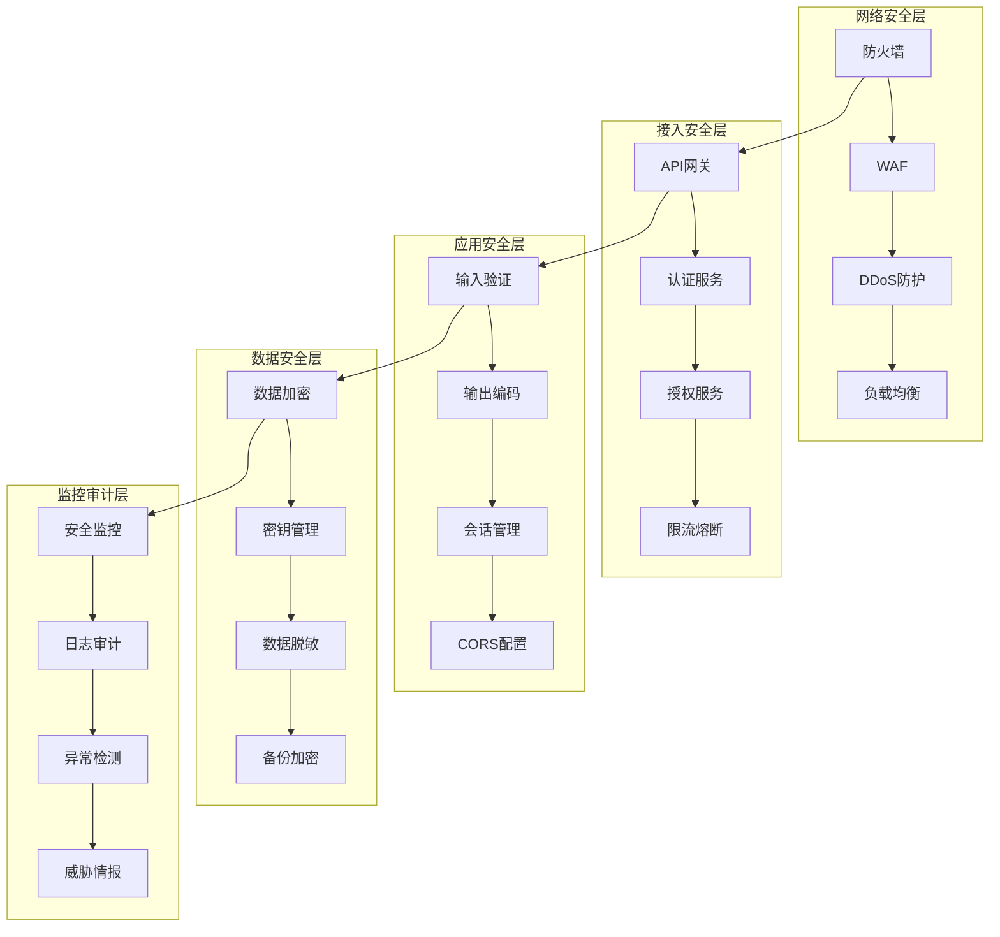

# Junmo Platform 安全设计详细文档

## 📋 文档信息

| 项目 | 内容 |
|------|------|
| **文档名称** | Junmo Platform 安全设计详细文档 |
| **版本号** | v1.0.0 |
| **创建日期** | 2025-12-24 |
| **作者** | 安全架构师 |
| **审核人** | 首席安全官 |
| **批准人** | 技术总监 |

## 🎯 安全架构总览

### 安全设计原则

#### 1. 纵深防御原则
- **多层防护**: 在网络、应用、数据多个层面建立安全防护
- **冗余保护**: 关键安全机制具有多重备份
- **故障安全**: 系统故障时自动进入安全状态

#### 2. 最小权限原则
- **权限最小化**: 用户和系统只获得完成任务所需的最小权限
- **职责分离**: 关键操作需要多角色协作完成
- **临时授权**: 特殊权限具有时效性限制

#### 3. 零信任原则
- **永不信任**: 对所有访问请求都进行身份验证
- **持续验证**: 在访问过程中持续验证身份和权限
- **最小暴露**: 最小化系统暴露面

### 安全架构模型



## 🔐 身份认证与授权

### 认证架构设计

#### 多因素认证 (MFA)
```java
@Configuration
public class MfaSaTokenConfig {
    
    @Bean
    public SaTokenInterceptor saTokenInterceptor() {
        return new SaTokenInterceptor();
    }
    
    @Bean
    public MfaFilter mfaFilter() {
        return new MfaFilter();
    }
}

@Component
public class MfaFilter implements Filter {
    
    @Override
    public void doFilter(ServletRequest request, ServletResponse response, FilterChain chain) 
            throws IOException, ServletException {
        
        HttpServletRequest httpRequest = (HttpServletRequest) request;
        HttpServletResponse httpResponse = (HttpServletResponse) response;
        
        String requestURI = httpRequest.getRequestURI();
        
        // MFA 相关接口放行
        if (requestURI.startsWith("/api/auth/mfa/")) {
            chain.doFilter(request, response);
            return;
        }
        
        // 检查是否需要 MFA 验证
        if (requiresMfaVerification(httpRequest)) {
            if (!verifyMfa(httpRequest)) {
                httpResponse.setStatus(HttpStatus.UNAUTHORIZED.value());
                httpResponse.getWriter().write("MFA verification required");
                return;
            }
        }
        
        chain.doFilter(request, response);
    }
}

@Service
public class MfaService {
    
    @Autowired
    private TotpService totpService;
    
    @Autowired
    private SmsService smsService;
    
    public boolean verifyMfa(String username, String code, MfaType type) {
        switch (type) {
            case TOTP:
                return totpService.verifyCode(username, code);
            case SMS:
                return smsService.verifyCode(username, code);
            case EMAIL:
                return emailService.verifyCode(username, code);
            default:
                return false;
        }
    }
    
    public void generateMfaSecret(String username) {
        String secret = totpService.generateSecret();
        userService.saveMfaSecret(username, secret);
        
        // 生成二维码供用户扫描
        String qrCode = totpService.generateQrCode(username, secret);
        notificationService.sendMfaSetupEmail(username, qrCode);
    }
}
```

#### OAuth2/OIDC 集成
```java
@Configuration
public class OAuth2SaTokenConfig {
    
    @Bean
    public SaOAuth2Template saOAuth2Template() {
        return new SaOAuth2Template();
    }
    
    @Bean
    public SaOAuth2LoginHandler saOAuth2LoginHandler() {
        return new SaOAuth2LoginHandler();
    }
}

@Component
public class SaOAuth2Template extends SaOAuth2Template {
    
    @Override
    public SaClientModel getClientModel(String clientId) {
        // 从数据库获取客户端配置
        return new SaClientModel()
                .setClientId(clientId)
                .setClientSecret("your-client-secret")
                .setAllowUrl("*")
                .setContractScope("openid")
                .setIsAutoMode(true);
    }
    
    @Override
    public String getRedirectUrl() {
        // 获取回调地址
        return "http://your-domain.com/api/auth/oauth2/callback";
    }
}

@Service
public class CustomOAuth2UserService implements OAuth2UserService<OAuth2UserRequest, OAuth2User> {
    
    @Override
    public OAuth2User loadUser(OAuth2UserRequest userRequest) throws OAuth2AuthenticationException {
        OAuth2User oauth2User = delegate.loadUser(userRequest);
        
        // 处理用户信息
        String email = oauth2User.getAttribute("email");
        String name = oauth2User.getAttribute("name");
        
        // 创建或更新本地用户
        User user = userService.findOrCreateUser(email, name);
        
        return new CustomOAuth2User(user, oauth2User.getAttributes());
    }
}
```

### 授权架构设计

#### RBAC权限模型
```java
@Entity
@Table(name = "roles")
public class Role {
    
    @Id
    @GeneratedValue(strategy = GenerationType.IDENTITY)
    private Long id;
    
    @Column(unique = true, nullable = false)
    private String name;
    
    private String description;
    
    @ManyToMany(fetch = FetchType.LAZY)
    @JoinTable(
        name = "role_permissions",
        joinColumns = @JoinColumn(name = "role_id"),
        inverseJoinColumns = @JoinColumn(name = "permission_id")
    )
    private Set<Permission> permissions = new HashSet<>();
}

@Component
public class StpInterfaceImpl implements StpInterface {
    
    @Autowired
    private UserMapper userMapper;
    
    @Override
    public List<String> getPermissionList(Object loginId, String loginType) {
        User user = userMapper.selectById((Long) loginId);
        if (user == null) {
            return Collections.emptyList();
        }
        
        // 获取用户权限列表
        return user.getRoles().stream()
                .flatMap(role -> role.getPermissions().stream())
                .map(Permission::getName)
                .distinct()
                .collect(Collectors.toList());
    }
    
    @Override
    public List<String> getRoleList(Object loginId, String loginType) {
        User user = userMapper.selectById((Long) loginId);
        if (user == null) {
            return Collections.emptyList();
        }
        
        // 获取用户角色列表
        return user.getRoles().stream()
                .map(Role::getName)
                .distinct()
                .collect(Collectors.toList());
    }
}

@Entity
@Table(name = "permissions")
public class Permission {
    
    @Id
    @GeneratedValue(strategy = GenerationType.IDENTITY)
    private Long id;
    
    @Column(unique = true, nullable = false)
    private String name;
    
    private String resource;
    
    private String action;
    
    // getters and setters
}

@Service
public class PermissionService {
    
    @Autowired
    private UserRepository userRepository;
    
    @Autowired
    private RoleRepository roleRepository;
    
    public boolean hasPermission(String username, String resource, String action) {
        User user = userRepository.findByUsername(username)
            .orElseThrow(() -> new UserNotFoundException(username));
        
        return user.getRoles().stream()
            .flatMap(role -> role.getPermissions().stream())
            .anyMatch(permission -> 
                permission.getResource().equals(resource) && 
                permission.getAction().equals(action)
            );
    }
    
    public Set<Permission> getUserPermissions(String username) {
        User user = userRepository.findByUsername(username)
            .orElseThrow(() -> new UserNotFoundException(username));
        
        return user.getRoles().stream()
            .flatMap(role -> role.getPermissions().stream())
            .collect(Collectors.toSet());
    }
}
```

#### ABAC属性权限
```java
@Component
public class AbacPolicyEngine {
    
    @Autowired
    private PolicyRepository policyRepository;
    
    public boolean evaluate(String username, String resource, String action, Map<String, Object> context) {
        User user = userService.getUserByUsername(username);
        
        List<Policy> applicablePolicies = policyRepository.findApplicablePolicies(resource, action);
        
        for (Policy policy : applicablePolicies) {
            if (evaluatePolicy(policy, user, context)) {
                return policy.isEffect();
            }
        }
        
        return false; // 默认拒绝
    }
    
    private boolean evaluatePolicy(Policy policy, User user, Map<String, Object> context) {
        // 评估策略条件
        for (Condition condition : policy.getConditions()) {
            if (!evaluateCondition(condition, user, context)) {
                return false;
            }
        }
        return true;
    }
}

@Entity
@Table(name = "policies")
public class Policy {
    
    @Id
    @GeneratedValue(strategy = GenerationType.IDENTITY)
    private Long id;
    
    private String name;
    
    private String resource;
    
    private String action;
    
    private boolean effect; // true=允许, false=拒绝
    
    @ElementCollection
    @CollectionTable(name = "policy_conditions")
    private List<Condition> conditions = new ArrayList<>();
}

@Embeddable
public class Condition {
    
    private String attribute;
    
    private String operator; // eq, ne, gt, lt, in, contains
    
    private String value;
}
```

## 🔒 数据安全设计

### 数据加密策略

#### 传输加密
```java
@Configuration
public class EncryptionConfig {
    
    @Bean
    public RestTemplate secureRestTemplate() {
        RestTemplate restTemplate = new RestTemplate();
        
        // 配置SSL
        SSLContext sslContext = SSLContextBuilder.create()
            .loadTrustMaterial((chain, authType) -> true) // 生产环境需要验证证书
            .build();
        
        HttpClient client = HttpClients.custom()
            .setSSLContext(sslContext)
            .build();
        
        HttpComponentsClientHttpRequestFactory factory = 
            new HttpComponentsClientHttpRequestFactory(client);
        restTemplate.setRequestFactory(factory);
        
        return restTemplate;
    }
}

@Configuration
public class WebSecurityConfig {
    
    @Bean
    public ServletWebServerFactory servletContainer() {
        TomcatServletWebServerFactory factory = new TomcatServletWebServerFactory();
        factory.addConnectorCustomizers(connector -> {
            connector.setProperty("sslProtocol", "TLS");
            connector.setProperty("sslEnabledProtocols", "TLSv1.2,TLSv1.3");
            connector.setProperty("ciphers", "TLS_ECDHE_RSA_WITH_AES_256_GCM_SHA384,TLS_ECDHE_RSA_WITH_AES_128_GCM_SHA256");
        });
        return factory;
    }
}
```

#### 存储加密
```java
@Component
public class DataEncryptionService {
    
    @Value("${encryption.key}")
    private String encryptionKey;
    
    private final AESUtil aesUtil;
    
    public DataEncryptionService() {
        this.aesUtil = new AESUtil();
    }
    
    @EventListener
    public void handleUserCreated(UserCreatedEvent event) {
        // 加密敏感数据
        User user = userRepository.findById(event.getUserId()).orElse(null);
        if (user != null) {
            encryptSensitiveData(user);
            userRepository.save(user);
        }
    }
    
    private void encryptSensitiveData(User user) {
        if (user.getPhone() != null) {
            user.setPhone(aesUtil.encrypt(user.getPhone(), encryptionKey));
        }
        if (user.getIdCard() != null) {
            user.setIdCard(aesUtil.encrypt(user.getIdCard(), encryptionKey));
        }
    }
    
    public String decryptPhone(String encryptedPhone) {
        return aesUtil.decrypt(encryptedPhone, encryptionKey);
    }
    
    public String encryptPhone(String phone) {
        return aesUtil.encrypt(phone, encryptionKey);
    }
}

public class AESUtil {
    
    private static final String ALGORITHM = "AES";
    private static final String TRANSFORMATION = "AES/CBC/PKCS5Padding";
    
    public String encrypt(String data, String key) throws Exception {
        SecretKeySpec secretKey = new SecretKeySpec(key.getBytes(), ALGORITHM);
        Cipher cipher = Cipher.getInstance(TRANSFORMATION);
        cipher.init(Cipher.ENCRYPT_MODE, secretKey);
        
        byte[] encrypted = cipher.doFinal(data.getBytes());
        return Base64.getEncoder().encodeToString(encrypted);
    }
    
    public String decrypt(String encryptedData, String key) throws Exception {
        SecretKeySpec secretKey = new SecretKeySpec(key.getBytes(), ALGORITHM);
        Cipher cipher = Cipher.getInstance(TRANSFORMATION);
        cipher.init(Cipher.DECRYPT_MODE, secretKey);
        
        byte[] decoded = Base64.getDecoder().decode(encryptedData);
        byte[] decrypted = cipher.doFinal(decoded);
        return new String(decrypted);
    }
}
```

### 密钥管理

#### 密钥轮换机制
```java
@Service
public class KeyRotationService {
    
    @Autowired
    private KeyRepository keyRepository;
    
    @Scheduled(cron = "0 0 2 1 * ?") // 每月1号凌晨2点执行
    public void rotateKeys() {
        log.info("Starting key rotation process");
        
        // 生成新密钥
        String newKey = generateNewKey();
        
        // 保存新密钥
        KeyInfo keyInfo = new KeyInfo();
        keyInfo.setKeyValue(newKey);
        keyInfo.setKeyType("AES");
        keyInfo.setCreatedAt(LocalDateTime.now());
        keyInfo.setStatus(KeyStatus.ACTIVE);
        
        keyRepository.save(keyInfo);
        
        // 标记旧密钥为过期
        markOldKeysAsExpired();
        
        // 重新加密数据
        reencryptDataWithNewKey(newKey);
        
        log.info("Key rotation completed successfully");
    }
    
    private String generateNewKey() {
        try {
            KeyGenerator keyGenerator = KeyGenerator.getInstance("AES");
            keyGenerator.init(256);
            SecretKey secretKey = keyGenerator.generateKey();
            return Base64.getEncoder().encodeToString(secretKey.getEncoded());
        } catch (Exception e) {
            throw new RuntimeException("Failed to generate new key", e);
        }
    }
    
    private void reencryptDataWithNewKey(String newKey) {
        // 分批处理数据
        int batchSize = 100;
        int offset = 0;
        
        List<User> users;
        do {
            users = userRepository.findBatchForReencryption(batchSize, offset);
            
            for (User user : users) {
                // 用旧密钥解密
                String decryptedPhone = decryptWithCurrentKey(user.getPhone());
                // 用新密钥加密
                String encryptedPhone = encryptWithKey(decryptedPhone, newKey);
                user.setPhone(encryptedPhone);
                
                userRepository.save(user);
            }
            
            offset += batchSize;
        } while (users.size() == batchSize);
    }
}
```

### 数据脱敏

#### 敏感数据处理
```java
@Component
public class DataMaskingService {
    
    public UserDTO maskSensitiveData(UserDTO user) {
        UserDTO maskedUser = new UserDTO();
        BeanUtils.copyProperties(user, maskedUser);
        
        // 脱敏手机号
        if (maskedUser.getPhone() != null) {
            maskedUser.setPhone(maskPhone(maskedUser.getPhone()));
        }
        
        // 脱敏邮箱
        if (maskedUser.getEmail() != null) {
            maskedUser.setEmail(maskEmail(maskedUser.getEmail()));
        }
        
        // 脱敏身份证
        if (maskedUser.getIdCard() != null) {
            maskedUser.setIdCard(maskIdCard(maskedUser.getIdCard()));
        }
        
        return maskedUser;
    }
    
    private String maskPhone(String phone) {
        if (phone == null || phone.length() < 7) {
            return phone;
        }
        return phone.substring(0, 3) + "****" + phone.substring(7);
    }
    
    private String maskEmail(String email) {
        if (email == null || !email.contains("@")) {
            return email;
        }
        String[] parts = email.split("@");
        String username = parts[0];
        String domain = parts[1];
        
        if (username.length() <= 2) {
            return username + "***@" + domain;
        }
        
        return username.substring(0, 2) + "***@" + domain;
    }
    
    private String maskIdCard(String idCard) {
        if (idCard == null || idCard.length() < 8) {
            return idCard;
        }
        return idCard.substring(0, 4) + "**********" + idCard.substring(idCard.length() - 4);
    }
}
```

## 🛡️ 应用安全设计

### 输入验证与输出编码

#### 防止注入攻击
```java
@Component
public class InputValidationService {
    
    @Autowired
    private Validator validator;
    
    public void validateInput(Object input) {
        Set<ConstraintViolation<Object>> violations = validator.validate(input);
        if (!violations.isEmpty()) {
            throw new ConstraintViolationException(violations);
        }
    }
    
    public String sanitizeHtml(String input) {
        if (input == null) {
            return null;
        }
        
        // 使用OWASP Java HTML Sanitizer
        PolicyFactory policy = new HtmlPolicyBuilder()
            .allowElements("b", "i", "u", "em", "strong", "p", "br")
            .allowAttributes("class").onElements("p")
            .toFactory();
        
        return policy.sanitize(input);
    }
    
    public String preventSqlInjection(String input) {
        if (input == null) {
            return null;
        }
        
        // 移除潜在的SQL注入字符
        return input.replaceAll("[';\"\\\\]", "");
    }
}

@RestController
@RequestMapping("/api/users")
public class UserController {
    
    @Autowired
    private InputValidationService validationService;
    
    @PostMapping
    public ResponseEntity<UserDTO> createUser(@Valid @RequestBody CreateUserRequest request) {
        // 额外的业务层验证
        validationService.validateInput(request);
        
        // 防止XSS攻击
        if (request.getBio() != null) {
            request.setBio(validationService.sanitizeHtml(request.getBio()));
        }
        
        UserDTO user = userService.createUser(request);
        return ResponseEntity.status(HttpStatus.CREATED).body(user);
    }
}
```

#### 输出编码
```java
@Component
public class OutputEncodingService {
    
    public String encodeForHtml(String input) {
        if (input == null) {
            return null;
        }
        
        return input.replace("&", "&amp;")
                   .replace("<", "&lt;")
                   .replace(">", "&gt;")
                   .replace("\"", "&quot;")
                   .replace("'", "&#x27;");
    }
    
    public String encodeForJavaScript(String input) {
        if (input == null) {
            return null;
        }
        
        return input.replace("\\", "\\\\")
                   .replace("\"", "\\\"")
                   .replace("'", "\\'")
                   .replace("\n", "\\n")
                   .replace("\r", "\\r")
                   .replace("\t", "\\t");
    }
    
    public String encodeForUrl(String input) {
        try {
            return URLEncoder.encode(input, StandardCharsets.UTF_8.name());
        } catch (UnsupportedEncodingException e) {
            throw new RuntimeException("Failed to encode URL", e);
        }
    }
}
```

### 会话管理

#### 安全会话配置
```java
@Configuration
public class SessionConfig {
    
    @Bean
    public HttpSessionEventPublisher httpSessionEventPublisher() {
        return new HttpSessionEventPublisher();
    }
    
    @Bean
    public CookieSerializer cookieSerializer() {
        DefaultCookieSerializer serializer = new DefaultCookieSerializer();
        serializer.setCookieName("SESSION");
        serializer.setCookiePath("/");
        serializer.setDomainNamePattern("^.+?\\.(\\w+\\.[a-z]+)$");
        serializer.setUseHttpOnlyCookie(true);
        serializer.setSameSite("Lax");
        return serializer;
    }
}

@Service
public class SessionService {
    
    @Autowired
    private RedisTemplate<String, Object> redisTemplate;
    
    private static final String SESSION_PREFIX = "spring:session:";
    
    public void createSession(String sessionId, User user) {
        SessionInfo sessionInfo = new SessionInfo();
        sessionInfo.setUserId(user.getId());
        sessionInfo.setUsername(user.getUsername());
        sessionInfo.setRoles(user.getRoles().stream().map(Role::getName).collect(Collectors.toSet()));
        sessionInfo.setCreatedAt(LocalDateTime.now());
        sessionInfo.setLastAccessedAt(LocalDateTime.now());
        sessionInfo.setIpAddress(getCurrentIpAddress());
        sessionInfo.setUserAgent(getCurrentUserAgent());
        
        redisTemplate.opsForValue().set(
            SESSION_PREFIX + sessionId, 
            sessionInfo, 
            Duration.ofHours(24)
        );
    }
    
    public boolean validateSession(String sessionId) {
        SessionInfo sessionInfo = getSessionInfo(sessionId);
        if (sessionInfo == null) {
            return false;
        }
        
        // 检查会话是否过期
        if (sessionInfo.getLastAccessedAt().plusHours(24).isBefore(LocalDateTime.now())) {
            invalidateSession(sessionId);
            return false;
        }
        
        // 更新最后访问时间
        sessionInfo.setLastAccessedAt(LocalDateTime.now());
        redisTemplate.opsForValue().set(
            SESSION_PREFIX + sessionId, 
            sessionInfo, 
            Duration.ofHours(24)
        );
        
        return true;
    }
    
    public void invalidateSession(String sessionId) {
        redisTemplate.delete(SESSION_PREFIX + sessionId);
    }
    
    public void invalidateAllUserSessions(Long userId) {
        Set<String> keys = redisTemplate.keys(SESSION_PREFIX + "*");
        if (keys != null) {
            for (String key : keys) {
                SessionInfo sessionInfo = (SessionInfo) redisTemplate.opsForValue().get(key);
                if (sessionInfo != null && sessionInfo.getUserId().equals(userId)) {
                    redisTemplate.delete(key);
                }
            }
        }
    }
}
```

### CORS配置

#### 跨域安全配置
```java
@Configuration
public class CorsConfig {
    
    @Bean
    public CorsConfigurationSource corsConfigurationSource() {
        CorsConfiguration configuration = new CorsConfiguration();
        
        // 只允许特定的源
        configuration.setAllowedOriginPatterns(Arrays.asList(
            "https://admin.Junmo Platform.com",
            "https://app.Junmo Platform.com"
        ));
        
        // 只允许必要的HTTP方法
        configuration.setAllowedMethods(Arrays.asList("GET", "POST", "PUT", "DELETE", "OPTIONS"));
        
        // 只允许必要的头部
        configuration.setAllowedHeaders(Arrays.asList(
            "Authorization",
            "Content-Type",
            "X-Requested-With"
        ));
        
        // 允许凭证
        configuration.setAllowCredentials(true);
        
        // 预检请求缓存时间
        configuration.setMaxAge(3600L);
        
        UrlBasedCorsConfigurationSource source = new UrlBasedCorsConfigurationSource();
        source.registerCorsConfiguration("/api/**", configuration);
        
        return source;
    }
}
```

## 🔍 安全监控与审计

### 安全事件监控

#### 异常检测
```java
@Component
public class SecurityMonitoringService {
    
    @Autowired
    private MeterRegistry meterRegistry;
    
    @Autowired
    private AlertService alertService;
    
    private final Map<String, AtomicInteger> attemptCounter = new ConcurrentHashMap<>();
    
    @EventListener
    public void handleAuthenticationFailure(AuthenticationFailureBadCredentialsEvent event) {
        String username = event.getAuthentication().getName();
        String ipAddress = getCurrentIpAddress();
        
        // 记录失败次数
        String key = username + ":" + ipAddress;
        AtomicInteger counter = attemptCounter.computeIfAbsent(key, k -> new AtomicInteger(0));
        int attempts = counter.incrementAndGet();
        
        // 记录指标
        meterRegistry.counter("security.auth.failure", 
            "username", username, 
            "ip", ipAddress).increment();
        
        // 检测暴力破解
        if (attempts >= 5) {
            handleSuspiciousActivity(username, ipAddress, "Multiple authentication failures");
        }
    }
    
    @EventListener
    public void handleAuthorizationFailure(AccessDeniedEvent event) {
        Authentication auth = event.getAuthentication();
        String username = auth.getName();
        String ipAddress = getCurrentIpAddress();
        
        meterRegistry.counter("security.auth.denied",
            "username", username,
            "ip", ipAddress).increment();
        
        // 检测权限提升尝试
        if (isPrivilegeEscalationAttempt(event)) {
            handleSuspiciousActivity(username, ipAddress, "Potential privilege escalation");
        }
    }
    
    private void handleSuspiciousActivity(String username, String ipAddress, String reason) {
        // 记录安全事件
        SecurityEvent event = new SecurityEvent();
        event.setType(SecurityEventType.SUSPICIOUS_ACTIVITY);
        event.setUsername(username);
        event.setIpAddress(ipAddress);
        event.setDescription(reason);
        event.setTimestamp(LocalDateTime.now());
        
        securityEventRepository.save(event);
        
        // 发送告警
        alertService.sendSecurityAlert(
            String.format("Suspicious activity detected: %s from %s - %s", 
                username, ipAddress, reason)
        );
        
        // 可选：临时封禁IP
        if (shouldBlockIp(ipAddress)) {
            blockIpAddress(ipAddress, Duration.ofMinutes(30));
        }
    }
}
```

### 日志审计

#### 安全日志记录
```java
@Component
public class SecurityAuditService {
    
    @Autowired
    private AuditLogRepository auditLogRepository;
    
    @EventListener
    @Async
    public void handleUserLogin(AuthenticationSuccessEvent event) {
        Authentication auth = event.getAuthentication();
        String username = auth.getName();
        String ipAddress = getCurrentIpAddress();
        
        AuditLog log = new AuditLog();
        log.setAction(AuditAction.USER_LOGIN);
       .setUsername(username);
        setAuditLogMetadata(log);
        log.setDetails(String.format("User logged in from IP: %s", ipAddress));
        
        auditLogRepository.save(log);
    }
    
    @EventListener
    @Async
    public void handleUserLogout(LogoutSuccessEvent event) {
        Authentication auth = event.getAuthentication();
        String username = auth.getName();
        
        AuditLog log = new AuditLog();
        log.setAction(AuditAction.USER_LOGOUT);
        setUsername(username);
        setAuditLogMetadata(log);
        log.setDetails("User logged out");
        
        auditLogRepository.save(log);
    }
    
    @EventListener
    @Async
    public void handleDataAccess(DataAccessEvent event) {
        AuditLog log = new AuditLog();
        log.setAction(AuditAction.DATA_ACCESS);
       .setUsername(event.getUsername());
        setAuditLogMetadata(log);
        log.setResourceType(event.getResourceType());
        log.setResourceId(event.getResourceId());
        log.setDetails(event.getDetails());
        
        auditLogRepository.save(log);
    }
    
    private void setAuditLogMetadata(AuditLog log) {
        log.setTimestamp(LocalDateTime.now());
        log.setIpAddress(getCurrentIpAddress());
        log.setUserAgent(getCurrentUserAgent());
        log.setSessionId(getCurrentSessionId());
    }
}

@Aspect
@Component
public class AuditAspect {
    
    @Autowired
    private SecurityAuditService auditService;
    
    @Around("@annotation(auditable)")
    public Object auditMethod(ProceedingJoinPoint joinPoint, Auditable auditable) throws Throwable {
        String methodName = joinPoint.getSignature().getName();
        Object[] args = joinPoint.getArgs();
        
        try {
            // 记录方法调用
            auditService.recordMethodCall(methodName, args);
            
            // 执行方法
            Object result = joinPoint.proceed();
            
            // 记录成功结果
            auditService.recordMethodSuccess(methodName, result);
            
            return result;
        } catch (Exception e) {
            // 记录异常
            auditService.recordMethodException(methodName, e);
            throw e;
        }
    }
}
```

## 🚨 威胁检测与防护

### WAF配置

#### Web应用防火墙
```yaml
# application.yaml
spring:
  security:
    waf:
      enabled: true
      rules:
        - name: "SQL Injection Protection"
          pattern: "(?i)(union|select|insert|update|delete|drop|create|alter|exec|execute)"
          action: "BLOCK"
          severity: "HIGH"
        - name: "XSS Protection"
          pattern: "(?i)(<script|javascript:|vbscript:|onload=|onerror=)"
          action: "BLOCK"
          severity: "HIGH"
        - name: "Path Traversal Protection"
          pattern: "(\\.{2}|%2e%2e|%c0%ae%c0%ae)"
          action: "BLOCK"
          severity: "MEDIUM"
        - name: "Command Injection Protection"
          pattern: "(;|\\||&|`|\\$|\\(\\))"
          action: "BLOCK"
          severity: "HIGH"
```

```java
@Component
public class WebApplicationFirewall {
    
    @Autowired
    private List<WafRule> wafRules;
    
    @Component
    @Order(Ordered.HIGHEST_PRECEDENCE)
    public class WafFilter implements Filter {
        
        @Override
        public void doFilter(ServletRequest request, ServletResponse response, FilterChain chain) 
                throws IOException, ServletException {
            
            HttpServletRequest httpRequest = (HttpServletRequest) request;
            HttpServletResponse httpResponse = (HttpServletResponse) response;
            
            if (isMaliciousRequest(httpRequest)) {
                httpResponse.setStatus(HttpStatus.FORBIDDEN.value());
                httpResponse.getWriter().write("Access denied by WAF");
                return;
            }
            
            chain.doFilter(request, response);
        }
        
        private boolean isMaliciousRequest(HttpServletRequest request) {
            String uri = request.getRequestURI();
            String queryString = request.getQueryString();
            String userAgent = request.getHeader("User-Agent");
            String clientIp = getClientIpAddress(request);
            
            // 检查所有WAF规则
            for (WafRule rule : wafRules) {
                if (rule.matches(uri, queryString, userAgent, clientIp)) {
                    logSecurityEvent(rule, request);
                    return true;
                }
            }
            
            return false;
        }
    }
}

public interface WafRule {
    boolean matches(String uri, String queryString, String userAgent, String clientIp);
    String getName();
    String getAction();
    String getSeverity();
}

@Component
public class SqlInjectionRule implements WafRule {
    
    private static final Pattern SQL_INJECTION_PATTERN = 
        Pattern.compile("(?i)(union|select|insert|update|delete|drop|create|alter|exec|execute)");
    
    @Override
    public boolean matches(String uri, String queryString, String userAgent, String clientIp) {
        if (queryString != null && SQL_INJECTION_PATTERN.matcher(queryString).find()) {
            return true;
        }
        return false;
    }
    
    @Override
    public String getName() {
        return "SQL Injection Protection";
    }
    
    @Override
    public String getAction() {
        return "BLOCK";
    }
    
    @Override
    public String getSeverity() {
        return "HIGH";
    }
}
```

### DDoS防护

#### 限流防护
```java
@Component
public class DdosProtectionService {
    
    @Autowired
    private RedisTemplate<String, String> redisTemplate;
    
    private final Map<String, RateLimiter> rateLimiters = new ConcurrentHashMap<>();
    
    @PostConstruct
    public void init() {
        // 初始化不同级别的限流器
        rateLimiters.put("strict", RateLimiter.create(10));    // 10 requests/second
        rateLimiters.put("normal", RateLimiter.create(100));   // 100 requests/second
        rateLimiters.put("lenient", RateLimiter.create(1000)); // 1000 requests/second
    }
    
    public boolean checkRateLimit(String clientIp, String endpoint) {
        String key = "rate_limit:" + clientIp + ":" + endpoint;
        
        // 使用滑动窗口算法
        long currentTime = System.currentTimeMillis();
        long windowStart = currentTime - 60000; // 1分钟窗口
        
        // 清理过期记录
        redisTemplate.opsForZSet().removeRangeByScore(key, 0, windowStart);
        
        // 获取当前窗口内的请求数
        Long requestCount = redisTemplate.opsForZSet().count(key, windowStart, currentTime);
        
        // 根据端点类型设置不同的限制
        int limit = getRequestLimit(endpoint);
        
        if (requestCount >= limit) {
            // 记录DDoS事件
            recordDdosEvent(clientIp, endpoint, requestCount);
            return false;
        }
        
        // 记录当前请求
        redisTemplate.opsForZSet().add(key, UUID.randomUUID().toString(), currentTime);
        redisTemplate.expire(key, Duration.ofMinutes(1));
        
        return true;
    }
    
    private int getRequestLimit(String endpoint) {
        if (endpoint.startsWith("/api/auth/")) {
            return 10; // 认证接口限制更严格
        } else if (endpoint.startsWith("/api/admin/")) {
            return 50; // 管理接口
        } else {
            return 100; // 普通接口
        }
    }
    
    private void recordDdosEvent(String clientIp, String endpoint, long requestCount) {
        SecurityEvent event = new SecurityEvent();
        event.setType(SecurityEventType.DDOS_ATTACK);
        event.setIpAddress(clientIp);
        event.setResourceType("API_ENDPOINT");
        event.setResourceId(endpoint);
        event.setDescription(String.format("DDoS attempt detected: %d requests to %s", requestCount, endpoint));
        event.setTimestamp(LocalDateTime.now());
        
        securityEventRepository.save(event);
        
        // 可选：临时封禁IP
        if (requestCount > getRequestLimit(endpoint) * 2) {
            blockIpAddress(clientIp, Duration.ofMinutes(15));
        }
    }
}
```

## 📋 安全合规性

### 数据保护合规

#### GDPR合规实现
```java
@Service
public class GdprComplianceService {
    
    @Autowired
    private UserRepository userRepository;
    
    @Autowired
    private AuditLogRepository auditLogRepository;
    
    @Transactional
    public UserDataExport exportUserData(String username) {
        User user = userRepository.findByUsername(username)
            .orElseThrow(() -> new UserNotFoundException(username));
        
        UserDataExport export = new UserDataExport();
        export.setUserId(user.getId());
        export.setUsername(user.getUsername());
        export.setEmail(user.getEmail());
        export.setPhone(decryptPhone(user.getPhone()));
        export.setCreatedAt(user.getCreatedAt());
        export.setUpdatedAt(user.getUpdatedAt());
        
        // 导出用户活动日志
        List<AuditLog> userLogs = auditLogRepository.findByUsername(username);
        export.setActivityLogs(userLogs);
        
        // 记录数据导出事件
        recordDataExportEvent(username);
        
        return export;
    }
    
    @Transactional
    public void deleteUserData(String username) {
        User user = userRepository.findByUsername(username)
            .orElseThrow(() -> new UserNotFoundException(username));
        
        // 软删除用户数据
        user.setDeleted(true);
        user.setDeletedAt(LocalDateTime.now());
        user.setEmail("deleted-" + user.getId() + "@deleted.com");
        user.setPhone(null);
        user.setUsername("deleted-" + user.getId());
        
        userRepository.save(user);
        
        // 记录数据删除事件
        recordDataDeletionEvent(username);
    }
    
    public boolean hasConsent(String username, ConsentType consentType) {
        User user = userRepository.findByUsername(username)
            .orElseThrow(() -> new UserNotFoundException(username));
        
        return user.getConsents().stream()
            .anyMatch(consent -> 
                consent.getType() == consentType && 
                consent.isGranted() && 
                !consent.isExpired()
            );
    }
    
    @Transactional
    public void grantConsent(String username, ConsentType consentType, Duration validity) {
        User user = userRepository.findByUsername(username)
            .orElseThrow(() -> new UserNotFoundException(username));
        
        Consent consent = new Consent();
        consent.setUser(user);
        consent.setType(consentType);
        consent.setGranted(true);
        consent.setGrantedAt(LocalDateTime.now());
        consent.setExpiresAt(LocalDateTime.now().plus(validity));
        
        user.getConsents().add(consent);
        userRepository.save(user);
        
        recordConsentEvent(username, consentType, true);
    }
}
```

### 安全审计报告

#### 定期安全评估
```java
@Service
public class SecurityAuditService {
    
    @Scheduled(cron = "0 0 1 1 * ?") // 每月1号凌晨1点执行
    public void generateMonthlySecurityReport() {
        SecurityReport report = new SecurityReport();
        report.setReportType(SecurityReportType.MONTHLY);
        report.setPeriod(getLastMonthPeriod());
        
        // 收集安全指标
        report.setAuthenticationMetrics(collectAuthenticationMetrics());
        report.setAuthorizationMetrics(collectAuthorizationMetrics());
        report.setVulnerabilityMetrics(collectVulnerabilityMetrics());
        report.setIncidentMetrics(collectIncidentMetrics());
        
        // 生成建议
        report.setRecommendations(generateSecurityRecommendations(report));
        
        // 保存报告
        securityReportRepository.save(report);
        
        // 发送报告给安全团队
        emailService.sendSecurityReport(report);
    }
    
    private AuthenticationMetrics collectAuthenticationMetrics() {
        AuthenticationMetrics metrics = new AuthenticationMetrics();
        
        // 统计登录成功/失败次数
        long successfulLogins = auditLogRepository.countByActionAndTimestampBetween(
            AuditAction.USER_LOGIN, 
            getMonthStart(), 
            getMonthEnd()
        );
        
        long failedLogins = securityEventRepository.countByTypeAndTimestampBetween(
            SecurityEventType.AUTHENTICATION_FAILURE,
            getMonthStart(),
            getMonthEnd()
        );
        
        metrics.setSuccessfulLogins(successfulLogins);
        metrics.setFailedLogins(failedLogins);
        metrics.setSuccessRate(calculateSuccessRate(successfulLogins, failedLogins));
        
        // 统计MFA使用率
        long mfaLogins = auditLogRepository.countByActionAndDetailsContaining(
            AuditAction.USER_LOGIN, 
            "MFA"
        );
        metrics.setMfaUsageRate(calculateMfaUsageRate(mfaLogins, successfulLogins));
        
        return metrics;
    }
    
    private List<SecurityRecommendation> generateSecurityRecommendations(SecurityReport report) {
        List<SecurityRecommendation> recommendations = new ArrayList<>();
        
        // 基于指标生成建议
        if (report.getAuthenticationMetrics().getSuccessRate() < 0.95) {
            recommendations.add(new SecurityRecommendation(
                "IMPROVE_AUTHENTICATION",
                "Authentication success rate is below 95%. Consider implementing additional security measures.",
                "HIGH"
            ));
        }
        
        if (report.getVulnerabilityMetrics().getHighVulnerabilities() > 0) {
            recommendations.add(new SecurityRecommendation(
                "FIX_VULNERABILITIES",
                "High severity vulnerabilities detected. Immediate remediation required.",
                "CRITICAL"
            ));
        }
        
        return recommendations;
    }
}
```

## 🔧 安全配置最佳实践

### 生产环境安全配置

#### 安全配置清单
```yaml
# application-prod.yaml
spring:
  security:
    require-ssl: true
    headers:
      frame-options: DENY
      content-type-options: nosniff
      xss-protection: "1; mode=block"
      referrer-policy: strict-origin-when-cross-origin
      
server:
  ssl:
    enabled: true
    key-store: classpath:keystore.p12
    key-store-password: ${SSL_KEYSTORE_PASSWORD}
    key-store-type: PKCS12
    key-alias: Junmo Platform
    protocol: TLS
    enabled-protocols: TLSv1.2,TLSv1.3
    ciphers: TLS_ECDHE_RSA_WITH_AES_256_GCM_SHA384,TLS_ECDHE_RSA_WITH_AES_128_GCM_SHA256
    
  tomcat:
    remote-ip-header: X-Forwarded-For
    protocol-header: X-Forwarded-Proto
    
logging:
  level:
    org.springframework.security: DEBUG
    com.junmo.Junmo Platform.security: DEBUG
    
management:
  endpoints:
    web:
      exposure:
        include: health,info,metrics
  endpoint:
    health:
      show-details: when-authorized
  security:
    enabled: true
```

### 安全测试

#### 安全测试用例
```java
@SpringBootTest
@AutoConfigureMockMvc
public class SecurityTests {
    
    @Autowired
    private MockMvc mockMvc;
    
    @Test
    public void testSqlInjectionProtection() throws Exception {
        String maliciousInput = "admin'; DROP TABLE users; --";
        
        mockMvc.perform(post("/api/users/login")
                .param("username", maliciousInput)
                .param("password", "password"))
                .andExpect(status().isBadRequest());
    }
    
    @Test
    public void testXssProtection() throws Exception {
        String xssPayload = "<script>alert('XSS')</script>";
        
        mockMvc.perform(post("/api/users")
                .contentType(MediaType.APPLICATION_JSON)
                .content("{\"username\":\"test\",\"bio\":\"" + xssPayload + "\"}"))
                .andExpect(status().isBadRequest());
    }
    
    @Test
    public void testAuthenticationRequired() throws Exception {
        mockMvc.perform(get("/api/users/profile"))
                .andExpect(status().isUnauthorized());
    }
    
    @Test
    public void testAuthorizationDenied() throws Exception {
        // 普通用户尝试访问管理员接口
        String token = obtainUserToken("user", "password");
        
        mockMvc.perform(get("/api/admin/users")
                .header("Authorization", "Bearer " + token))
                .andExpect(status().isForbidden());
    }
    
    @Test
    public void testRateLimiting() throws Exception {
        // 快速发送多个请求测试限流
        for (int i = 0; i < 20; i++) {
            mockMvc.perform(post("/api/auth/login")
                    .param("username", "test")
                    .param("password", "wrong"));
        }
        
        mockMvc.perform(post("/api/auth/login")
                .param("username", "test")
                .param("password", "wrong"))
                .andExpect(status().isTooManyRequests());
    }
}
```

---

*本文档将随着安全威胁环境的变化持续更新，确保系统安全防护能力的持续提升。*