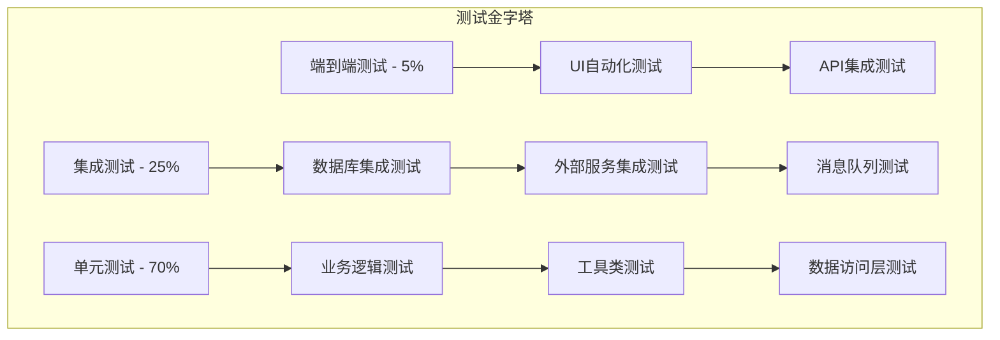

# Spring4demo 测试设计文档

## 📋 文档信息

| 项目 | 内容 |
|------|------|
| **文档名称** | Spring4demo 测试设计文档 |
| **版本号** | v1.0.0 |
| **创建日期** | 2025-12-24 |
| **作者** | 测试架构师 |
| **审核人** | 质量保证经理 |
| **批准人** | 技术总监 |

## 🎯 测试策略总览

### 测试金字塔模型



### 测试分层策略

#### 1. 单元测试 (Unit Tests)
- **目标**: 验证单个组件的功能正确性
- **范围**: 方法、类级别
- **工具**: JUnit 5, Mockito, AssertJ
- **覆盖率要求**: ≥ 80%
- **执行频率**: 每次代码提交

#### 2. 集成测试 (Integration Tests)
- **目标**: 验证组件间协作的正确性
- **范围**: 模块、服务级别
- **工具**: Spring Boot Test, Testcontainers
- **覆盖率要求**: ≥ 60%
- **执行频率**: 每日构建

#### 3. 端到端测试 (E2E Tests)
- **目标**: 验证完整业务流程
- **范围**: 系统级别
- **工具**: Selenium, Cypress, Postman
- **覆盖率要求**: 核心业务流程100%
- **执行频率**: 发布前

## 🧪 单元测试设计

### 测试架构

#### 测试分层结构
```
src/test/java/
├── unit/                           # 单元测试
│   ├── controller/                 # 控制器测试
│   ├── service/                    # 服务层测试
│   ├── repository/                 # 数据访问层测试
│   ├── util/                       # 工具类测试
│   └── config/                     # 配置类测试
├── integration/                    # 集成测试
│   ├── database/                   # 数据库集成测试
│   ├── external/                   # 外部服务集成测试
│   └── messaging/                  # 消息队列测试
├── e2e/                           # 端到端测试
│   ├── api/                        # API测试
│   └── ui/                         # UI测试
└── performance/                    # 性能测试
    ├── load/                       # 负载测试
    └── stress/                     # 压力测试
```

### 业务逻辑单元测试

#### 用户服务测试示例
```java
@ExtendWith(MockitoExtension.class)
class UserServiceTest {
    
    @Mock
    private UserRepository userRepository;
    
    @Mock
    private PasswordEncoder passwordEncoder;
    
    @Mock
    private DomainEventPublisher eventPublisher;
    
    @InjectMocks
    private UserServiceImpl userService;
    
    @Test
    @DisplayName("应该成功创建用户")
    void shouldCreateUserSuccessfully() {
        // Given
        CreateUserRequest request = CreateUserRequest.builder()
            .username("testuser")
            .email("test@example.com")
            .password("password123")
            .build();
        
        User savedUser = User.builder()
            .id(1L)
            .username("testuser")
            .email("test@example.com")
            .password("encodedPassword")
            .status(UserStatus.ACTIVE)
            .build();
        
        when(userRepository.existsByUsername("testuser")).thenReturn(false);
        when(userRepository.existsByEmail("test@example.com")).thenReturn(false);
        when(passwordEncoder.encode("password123")).thenReturn("encodedPassword");
        when(userRepository.save(any(User.class))).thenReturn(savedUser);
        
        // When
        UserDTO result = userService.createUser(request);
        
        // Then
        assertThat(result).isNotNull();
        assertThat(result.getUsername()).isEqualTo("testuser");
        assertThat(result.getEmail()).isEqualTo("test@example.com");
        
        verify(userRepository).existsByUsername("testuser");
        verify(userRepository).existsByEmail("test@example.com");
        verify(passwordEncoder).encode("password123");
        verify(userRepository).save(any(User.class));
        verify(eventPublisher).publish(any(UserCreatedEvent.class));
    }
    
    @Test
    @DisplayName("当用户名已存在时应该抛出异常")
    void shouldThrowExceptionWhenUsernameExists() {
        // Given
        CreateUserRequest request = CreateUserRequest.builder()
            .username("existinguser")
            .email("test@example.com")
            .password("password123")
            .build();
        
        when(userRepository.existsByUsername("existinguser")).thenReturn(true);
        
        // When & Then
        assertThatThrownBy(() -> userService.createUser(request))
            .isInstanceOf(UserAlreadyExistsException.class)
            .hasMessage("Username already exists: existinguser");
        
        verify(userRepository).existsByUsername("existinguser");
        verify(userRepository, never()).save(any(User.class));
        verify(eventPublisher, never()).publish(any());
    }
    
    @Test
    @DisplayName("当邮箱已存在时应该抛出异常")
    void shouldThrowExceptionWhenEmailExists() {
        // Given
        CreateUserRequest request = CreateUserRequest.builder()
            .username("newuser")
            .email("existing@example.com")
            .password("password123")
            .build();
        
        when(userRepository.existsByUsername("newuser")).thenReturn(false);
        when(userRepository.existsByEmail("existing@example.com")).thenReturn(true);
        
        // When & Then
        assertThatThrownBy(() -> userService.createUser(request))
            .isInstanceOf(UserAlreadyExistsException.class)
            .hasMessage("Email already exists: existing@example.com");
        
        verify(userRepository).existsByUsername("newuser");
        verify(userRepository).existsByEmail("existing@example.com");
        verify(userRepository, never()).save(any(User.class));
    }
    
    @ParameterizedTest
    @ValueSource(strings = {"", "ab", "a".repeat(51)})
    @DisplayName("当用户名无效时应该抛出异常")
    void shouldThrowExceptionWhenUsernameInvalid(String invalidUsername) {
        // Given
        CreateUserRequest request = CreateUserRequest.builder()
            .username(invalidUsername)
            .email("test@example.com")
            .password("password123")
            .build();
        
        // When & Then
        assertThatThrownBy(() -> userService.createUser(request))
            .isInstanceOf(ValidationException.class);
        
        verify(userRepository, never()).existsByUsername(any());
        verify(userRepository, never()).save(any(User.class));
    }
}
```

#### 数据访问层测试示例
```java
@ExtendWith(MockitoExtension.class)
class UserRepositoryTest {
    
    @Autowired
    private TestEntityManager entityManager;
    
    @Autowired
    private UserRepository userRepository;
    
    @Test
    @DisplayName("应该根据用户名查找用户")
    void shouldFindUserByUsername() {
        // Given
        User user = User.builder()
            .username("testuser")
            .email("test@example.com")
            .password("password")
            .status(UserStatus.ACTIVE)
            .build();
        entityManager.persistAndFlush(user);
        
        // When
        Optional<User> result = userRepository.findByUsername("testuser");
        
        // Then
        assertThat(result).isPresent();
        assertThat(result.get().getUsername()).isEqualTo("testuser");
        assertThat(result.get().getEmail()).isEqualTo("test@example.com");
    }
    
    @Test
    @DisplayName("当用户名不存在时应该返回空")
    void shouldReturnEmptyWhenUsernameNotExists() {
        // When
        Optional<User> result = userRepository.findByUsername("nonexistent");
        
        // Then
        assertThat(result).isEmpty();
    }
    
    @Test
    @DisplayName("应该检查用户名是否存在")
    void shouldCheckUsernameExists() {
        // Given
        User user = User.builder()
            .username("testuser")
            .email("test@example.com")
            .password("password")
            .build();
        entityManager.persistAndFlush(user);
        
        // When & Then
        assertThat(userRepository.existsByUsername("testuser")).isTrue();
        assertThat(userRepository.existsByUsername("nonexistent")).isFalse();
    }
    
    @Test
    @DisplayName("应该根据角色查找用户")
    void shouldFindUsersByRole() {
        // Given
        Role adminRole = Role.builder().name("ADMIN").build();
        entityManager.persistAndFlush(adminRole);
        
        User adminUser = User.builder()
            .username("admin")
            .email("admin@example.com")
            .password("password")
            .build();
        adminUser.addRole(adminRole);
        entityManager.persistAndFlush(adminUser);
        
        User regularUser = User.builder()
            .username("user")
            .email("user@example.com")
            .password("password")
            .build();
        entityManager.persistAndFlush(regularUser);
        
        // When
        List<User> adminUsers = userRepository.findByRole("ADMIN");
        
        // Then
        assertThat(adminUsers).hasSize(1);
        assertThat(adminUsers.get(0).getUsername()).isEqualTo("admin");
    }
}
```

### 工具类测试

#### 加密工具测试
```java
class AESUtilTest {
    
    private AESUtil aesUtil;
    private String secretKey = "mySecretKey12345";
    
    @BeforeEach
    void setUp() {
        aesUtil = new AESUtil();
    }
    
    @Test
    @DisplayName("应该成功加密和解密文本")
    void shouldEncryptAndDecryptText() throws Exception {
        // Given
        String originalText = "Hello, World!";
        
        // When
        String encrypted = aesUtil.encrypt(originalText, secretKey);
        String decrypted = aesUtil.decrypt(encrypted, secretKey);
        
        // Then
        assertThat(decrypted).isEqualTo(originalText);
        assertThat(encrypted).isNotEqualTo(originalText);
    }
    
    @Test
    @DisplayName("加密相同文本应该产生不同结果")
    void shouldProduceDifferentEncryptedResults() throws Exception {
        // Given
        String originalText = "Hello, World!";
        
        // When
        String encrypted1 = aesUtil.encrypt(originalText, secretKey);
        String encrypted2 = aesUtil.encrypt(originalText, secretKey);
        
        // Then
        assertThat(encrypted1).isNotEqualTo(encrypted2);
    }
    
    @Test
    @DisplayName("使用错误的密钥解密应该抛出异常")
    void shouldThrowExceptionWhenDecryptingWithWrongKey() throws Exception {
        // Given
        String originalText = "Hello, World!";
        String encrypted = aesUtil.encrypt(originalText, secretKey);
        String wrongKey = "wrongKey";
        
        // When & Then
        assertThatThrownBy(() -> aesUtil.decrypt(encrypted, wrongKey))
            .isInstanceOf(RuntimeException.class);
    }
    
    @Test
    @DisplayName("加密空文本应该返回空")
    void shouldReturnEmptyWhenEncryptingNull() throws Exception {
        // When
        String result = aesUtil.encrypt(null, secretKey);
        
        // Then
        assertThat(result).isNull();
    }
}
```

## 🔗 集成测试设计

### 数据库集成测试

#### 使用Testcontainers的测试配置
```java
@SpringBootTest
@Testcontainers
@Transactional
class UserRepositoryIntegrationTest {
    
    @Container
    static MySQLContainer<?> mysql = new MySQLContainer<>("mysql:8.0")
            .withDatabaseName("testdb")
            .withUsername("test")
            .withPassword("test");
    
    @Autowired
    private UserRepository userRepository;
    
    @DynamicPropertySource
    static void configureProperties(DynamicPropertyRegistry registry) {
        registry.add("spring.datasource.url", mysql::getJdbcUrl);
        registry.add("spring.datasource.username", mysql::getUsername);
        registry.add("spring.datasource.password", mysql::getPassword);
        registry.add("spring.datasource.driver-class-name", mysql::getDriverClassName);
    }
    
    @Test
    @DisplayName("应该保存和检索用户")
    void shouldSaveAndRetrieveUser() {
        // Given
        User user = User.builder()
            .username("testuser")
            .email("test@example.com")
            .password("encodedPassword")
            .status(UserStatus.ACTIVE)
            .build();
        
        // When
        User savedUser = userRepository.save(user);
        Optional<User> retrievedUser = userRepository.findById(savedUser.getId());
        
        // Then
        assertThat(retrievedUser).isPresent();
        assertThat(retrievedUser.get().getUsername()).isEqualTo("testuser");
        assertThat(retrievedUser.get().getEmail()).isEqualTo("test@example.com");
        assertThat(retrievedUser.get().getCreatedAt()).isNotNull();
        assertThat(retrievedUser.get().getUpdatedAt()).isNotNull();
    }
    
    @Test
    @DisplayName("应该处理用户角色关系")
    void shouldHandleUserRoleRelationship() {
        // Given
        Role userRole = Role.builder()
            .name("USER")
            .description("Regular user role")
            .build();
        
        User user = User.builder()
            .username("testuser")
            .email("test@example.com")
            .password("encodedPassword")
            .status(UserStatus.ACTIVE)
            .build();
        
        user.addRole(userRole);
        
        // When
        User savedUser = userRepository.save(user);
        User retrievedUser = userRepository.findById(savedUser.getId()).orElse(null);
        
        // Then
        assertThat(retrievedUser).isNotNull();
        assertThat(retrievedUser.getRoles()).hasSize(1);
        assertThat(retrievedUser.getRoles().iterator().next().getName()).isEqualTo("USER");
    }
}
```

### 外部服务集成测试

#### Redis集成测试
```java
@SpringBootTest
@Testcontainers
class RedisIntegrationTest {
    
    @Container
    static GenericContainer<?> redis = new GenericContainer<>("redis:7-alpine")
            .withExposedPorts(6379);
    
    @Autowired
    private RedisTemplate<String, Object> redisTemplate;
    
    @Autowired
    private UserCacheService userCacheService;
    
    @DynamicPropertySource
    static void configureProperties(DynamicPropertyRegistry registry) {
        registry.add("spring.redis.host", redis::getHost);
        registry.add("spring.redis.port", () -> redis.getMappedPort(6379).toString());
    }
    
    @Test
    @DisplayName("应该缓存用户数据")
    void shouldCacheUserData() {
        // Given
        User user = User.builder()
            .id(1L)
            .username("testuser")
            .email("test@example.com")
            .build();
        
        // When
        userCacheService.cacheUser(user);
        User cachedUser = userCacheService.getCachedUser(1L);
        
        // Then
        assertThat(cachedUser).isNotNull();
        assertThat(cachedUser.getUsername()).isEqualTo("testuser");
        assertThat(cachedUser.getEmail()).isEqualTo("test@example.com");
    }
    
    @Test
    @DisplayName("应该处理缓存未命中")
    void shouldHandleCacheMiss() {
        // When
        User cachedUser = userCacheService.getCachedUser(999L);
        
        // Then
        assertThat(cachedUser).isNull();
    }
}
```

### 消息队列集成测试

#### RabbitMQ集成测试
```java
@SpringBootTest
@Testcontainers
@TestPropertySource(properties = {
    "spring.rabbitmq.host=localhost",
    "spring.rabbitmq.port=5672",
    "spring.rabbitmq.username=guest",
    "spring.rabbitmq.password=guest"
})
class RabbitMQIntegrationTest {
    
    @Container
    static RabbitMQContainer rabbitmq = new RabbitMQContainer("rabbitmq:3.12-management");
    
    @Autowired
    private RabbitTemplate rabbitTemplate;
    
    @Autowired
    private MessageConsumer messageConsumer;
    
    @Test
    @DisplayName("应该发送和接收消息")
    void shouldSendAndReceiveMessage() throws InterruptedException {
        // Given
        UserCreatedMessage message = new UserCreatedMessage(1L, "testuser");
        
        // When
        rabbitTemplate.convertAndSend("user.exchange", "user.created", message);
        
        // Then
        await().atMost(Duration.ofSeconds(5)).untilAsserted(() -> {
            verify(messageConsumer, times(1)).handleUserCreated(any(UserCreatedMessage.class));
        });
    }
    
    @Test
    @DisplayName("应该处理消息重试")
    void shouldHandleMessageRetry() throws InterruptedException {
        // Given
        UserCreatedMessage message = new UserCreatedMessage(1L, "testuser");
        doThrow(new RuntimeException("Temporary failure"))
            .when(messageConsumer).handleUserCreated(any());
        
        // When
        rabbitTemplate.convertAndSend("user.exchange", "user.created", message);
        
        // Then
        await().atMost(Duration.ofSeconds(10)).untilAsserted(() -> {
            verify(messageConsumer, atLeast(3)).handleUserCreated(any(UserCreatedMessage.class));
        });
    }
}
```

## 🌐 端到端测试设计

### API端到端测试

#### REST API测试
```java
@SpringBootTest(webEnvironment = SpringBootTest.WebEnvironment.RANDOM_PORT)
@TestPropertySource(properties = {
    "spring.datasource.url=jdbc:h2:mem:testdb",
    "spring.jpa.hibernate.ddl-auto=create-drop"
})
class UserApiE2ETest {
    
    @Autowired
    private TestRestTemplate restTemplate;
    
    @Autowired
    private UserRepository userRepository;
    
    @Autowired
    private PasswordEncoder passwordEncoder;
    
    private String authToken;
    
    @BeforeEach
    void setUp() {
        userRepository.deleteAll();
        
        // 创建测试用户并获取认证token
        User testUser = User.builder()
            .username("testuser")
            .email("test@example.com")
            .password(passwordEncoder.encode("password"))
            .status(UserStatus.ACTIVE)
            .build();
        userRepository.save(testUser);
        
        authToken = obtainAuthToken("testuser", "password");
    }
    
    @Test
    @DisplayName("应该完成用户注册流程")
    void shouldCompleteUserRegistrationFlow() {
        // Given
        CreateUserRequest request = CreateUserRequest.builder()
            .username("newuser")
            .email("newuser@example.com")
            .password("password123")
            .build();
        
        // When
        ResponseEntity<UserDTO> response = restTemplate.postForEntity(
            "/api/users", request, UserDTO.class);
        
        // Then
        assertThat(response.getStatusCode()).isEqualTo(HttpStatus.CREATED);
        assertThat(response.getBody()).isNotNull();
        assertThat(response.getBody().getUsername()).isEqualTo("newuser");
        assertThat(response.getBody().getEmail()).isEqualTo("newuser@example.com");
        
        // 验证用户已保存到数据库
        Optional<User> savedUser = userRepository.findByUsername("newuser");
        assertThat(savedUser).isPresent();
        assertThat(savedUser.get().getEmail()).isEqualTo("newuser@example.com");
    }
    
    @Test
    @DisplayName("应该完成用户登录流程")
    void shouldCompleteUserLoginFlow() {
        // Given
        LoginRequest request = LoginRequest.builder()
            .username("testuser")
            .password("password")
            .build();
        
        // When
        ResponseEntity<AuthResponse> response = restTemplate.postForEntity(
            "/api/auth/login", request, AuthResponse.class);
        
        // Then
        assertThat(response.getStatusCode()).isEqualTo(HttpStatus.OK);
        assertThat(response.getBody()).isNotNull();
        assertThat(response.getBody().getToken()).isNotEmpty();
        assertThat(response.getBody().getType()).isEqualTo("Bearer");
    }
    
    @Test
    @DisplayName("应该完成用户资料更新流程")
    void shouldCompleteUserProfileUpdateFlow() {
        // Given
        UpdateProfileRequest request = UpdateProfileRequest.builder()
            .firstName("John")
            .lastName("Doe")
            .phone("1234567890")
            .build();
        
        HttpHeaders headers = new HttpHeaders();
        headers.setBearerAuth(authToken);
        HttpEntity<UpdateProfileRequest> entity = new HttpEntity<>(request, headers);
        
        // When
        ResponseEntity<UserDTO> response = restTemplate.exchange(
            "/api/users/profile", HttpMethod.PUT, entity, UserDTO.class);
        
        // Then
        assertThat(response.getStatusCode()).isEqualTo(HttpStatus.OK);
        assertThat(response.getBody()).isNotNull();
        assertThat(response.getBody().getProfile().getFirstName()).isEqualTo("John");
        assertThat(response.getBody().getProfile().getLastName()).isEqualTo("Doe");
    }
    
    @Test
    @DisplayName("未认证用户应该无法访问受保护的端点")
    void shouldDenyAccessToUnauthenticatedUser() {
        // When
        ResponseEntity<String> response = restTemplate.getForEntity(
            "/api/users/profile", String.class);
        
        // Then
        assertThat(response.getStatusCode()).isEqualTo(HttpStatus.UNAUTHORIZED);
    }
    
    private String obtainAuthToken(String username, String password) {
        LoginRequest request = LoginRequest.builder()
            .username(username)
            .password(password)
            .build();
        
        ResponseEntity<AuthResponse> response = restTemplate.postForEntity(
            "/api/auth/login", request, AuthResponse.class);
        
        return response.getBody().getToken();
    }
}
```

### UI端到端测试

#### Cypress测试示例
```javascript
// cypress/integration/user-management.spec.js
describe('用户管理', () => {
  beforeEach(() => {
    // 登录系统
    cy.visit('/login');
    cy.get('[data-cy=username]').type('admin');
    cy.get('[data-cy=password]').type('password');
    cy.get('[data-cy=login-button]').click();
    cy.url().should('include', '/dashboard');
  });

  it('应该创建新用户', () => {
    // 导航到用户管理页面
    cy.get('[data-cy=user-management-menu]').click();
    cy.url().should('include', '/users');

    // 点击创建用户按钮
    cy.get('[data-cy=create-user-button]').click();

    // 填写用户信息
    cy.get('[data-cy=username-input]').type('newuser');
    cy.get('[data-cy=email-input]').type('newuser@example.com');
    cy.get('[data-cy=password-input]').type('password123');
    cy.get('[data-cy=confirm-password-input]').type('password123');

    // 提交表单
    cy.get('[data-cy=submit-button]').click();

    // 验证用户创建成功
    cy.get('[data-cy=success-message]').should('contain', '用户创建成功');
    cy.get('[data-cy=user-table]').should('contain', 'newuser');
  });

  it('应该编辑用户信息', () => {
    // 导航到用户管理页面
    cy.get('[data-cy=user-management-menu]').click();
    
    // 找到并点击编辑按钮
    cy.get('[data-cy=user-table]').contains('testuser')
      .parents('tr')
      .find('[data-cy=edit-button]')
      .click();

    // 修改用户信息
    cy.get('[data-cy=email-input]').clear().type('updated@example.com');
    cy.get('[data-cy=submit-button]').click();

    // 验证更新成功
    cy.get('[data-cy=success-message]').should('contain', '用户信息更新成功');
    cy.get('[data-cy=user-table]').should('contain', 'updated@example.com');
  });

  it('应该删除用户', () => {
    // 导航到用户管理页面
    cy.get('[data-cy=user-management-menu]').click();
    
    // 找到并点击删除按钮
    cy.get('[data-cy=user-table]').contains('testuser')
      .parents('tr')
      .find('[data-cy=delete-button]')
      .click();

    // 确认删除
    cy.get('[data-cy=confirm-delete-button]').click();

    // 验证删除成功
    cy.get('[data-cy=success-message]').should('contain', '用户删除成功');
    cy.get('[data-cy=user-table]').should('not.contain', 'testuser');
  });
});
```

## ⚡ 性能测试设计

### 负载测试

#### JMeter测试计划
```xml
<!-- jmeter-test-plan.jmx -->
<?xml version="1.0" encoding="UTF-8"?>
<jmeterTestPlan version="1.2" properties="5.0" jmeter="5.5">
  <hashTree>
    <TestPlan guiclass="TestPlanGui" testclass="TestPlan" testname="Spring4demo 负载测试" enabled="true">
      <stringProp name="TestPlan.comments">Spring4demo API负载测试</stringProp>
      <boolProp name="TestPlan.functional_mode">false</boolProp>
      <boolProp name="TestPlan.tearDown_on_shutdown">true</boolProp>
      <boolProp name="TestPlan.serialize_threadgroups">false</boolProp>
      <elementProp name="TestPlan.user_defined_variables" elementType="Arguments">
        <collectionProp name="Arguments.arguments">
          <elementProp name="BASE_URL" elementType="Argument">
            <stringProp name="Argument.name">BASE_URL</stringProp>
            <stringProp name="Argument.value">http://localhost:8080</stringProp>
          </elementProp>
        </collectionProp>
      </elementProp>
    </TestPlan>
    <hashTree>
      <ThreadGroup guiclass="ThreadGroupGui" testclass="ThreadGroup" testname="用户登录测试" enabled="true">
        <stringProp name="ThreadGroup.on_sample_error">continue</stringProp>
        <elementProp name="ThreadGroup.main_controller" elementType="LoopController">
          <boolProp name="LoopController.continue_forever">false</boolProp>
          <stringProp name="LoopController.loops">100</stringProp>
        </elementProp>
        <stringProp name="ThreadGroup.num_threads">50</stringProp>
        <stringProp name="ThreadGroup.ramp_time">10</stringProp>
        <boolProp name="ThreadGroup.scheduler">false</boolProp>
        <stringProp name="ThreadGroup.duration"></stringProp>
        <stringProp name="ThreadGroup.delay"></stringProp>
      </ThreadGroup>
      <hashTree>
        <HTTPSamplerProxy guiclass="HttpTestSampleGui" testclass="HTTPSamplerProxy" testname="用户登录" enabled="true">
          <elementProp name="HTTPsampler.Arguments" elementType="Arguments">
            <collectionProp name="Arguments.arguments">
              <elementProp name="username" elementType="HTTPArgument">
                <boolProp name="HTTPArgument.always_encode">true</boolProp>
                <stringProp name="Argument.value">testuser</stringProp>
                <stringProp name="Argument.metadata">=</stringProp>
              </elementProp>
              <elementProp name="password" elementType="HTTPArgument">
                <boolProp name="HTTPArgument.always_encode">true</boolProp>
                <stringProp name="Argument.value">password</stringProp>
                <stringProp name="Argument.metadata">=</stringProp>
              </elementProp>
            </collectionProp>
          </elementProp>
          <stringProp name="HTTPSampler.domain">${BASE_URL}</stringProp>
          <stringProp name="HTTPSampler.port">8080</stringProp>
          <stringProp name="HTTPSampler.protocol"></stringProp>
          <stringProp name="HTTPSampler.contentEncoding">UTF-8</stringProp>
          <stringProp name="HTTPSampler.path">/api/auth/login</stringProp>
          <stringProp name="HTTPSampler.method">POST</stringProp>
          <boolProp name="HTTPSampler.follow_redirects">true</boolProp>
          <boolProp name="HTTPSampler.auto_redirects">false</boolProp>
          <boolProp name="HTTPSampler.use_keepalive">true</boolProp>
          <boolProp name="HTTPSampler.DO_MULTIPART_POST">false</boolProp>
        </HTTPSamplerProxy>
        <hashTree/>
      </hashTree>
    </hashTree>
  </hashTree>
</jmeterTestPlan>
```

#### Gatling性能测试
```scala
// src/test/scala/com/kev1n/spring4demo/performance/UserApiSimulation.scala
package com.kev1n.spring4demo.performance

import io.gatling.core.Predef._
import io.gatling.http.Predef._
import scala.concurrent.duration._

class UserApiSimulation extends Simulation {

  val httpProtocol = http
    .baseUrl("http://localhost:8080")
    .acceptHeader("application/json")
    .contentTypeHeader("application/json")

  val scn = scenario("用户API性能测试")
    .exec(
      http("用户登录")
        .post("/api/auth/login")
        .body(StringBody("""{"username":"testuser","password":"password"}"""))
        .check(status.is(200))
        .check(jsonPath("$.token").saveAs("authToken"))
    )
    .pause(1, 3)
    .exec(
      http("获取用户资料")
        .get("/api/users/profile")
        .header("Authorization", "Bearer ${authToken}")
        .check(status.is(200))
    )
    .pause(1, 2)
    .exec(
      http("获取用户列表")
        .get("/api/users")
        .header("Authorization", "Bearer ${authToken}")
        .check(status.is(200))
    )

  setUp(
    scn.inject(
      rampUsers(100) during (30 seconds),
      constantUsers(100) during (60 seconds)
    )
  ).protocols(httpProtocol)
    .assertions(
      global.responseTime.max.lt(2000),
      global.successfulRequests.percent.gt(95)
    )
}
```

## 🔧 测试工具与框架

### 测试依赖配置

#### Maven测试依赖
```xml
<dependencies>
    <!-- 单元测试 -->
    <dependency>
        <groupId>org.springframework.boot</groupId>
        <artifactId>spring-boot-starter-test</artifactId>
        <scope>test</scope>
    </dependency>
    
    <!-- 集成测试 -->
    <dependency>
        <groupId>org.testcontainers</groupId>
        <artifactId>junit-jupiter</artifactId>
        <scope>test</scope>
    </dependency>
    <dependency>
        <groupId>org.testcontainers</groupId>
        <artifactId>mysql</artifactId>
        <scope>test</scope>
    </dependency>
    <dependency>
        <groupId>org.testcontainers</groupId>
        <artifactId>rabbitmq</artifactId>
        <scope>test</scope>
    </dependency>
    
    <!-- 性能测试 -->
    <dependency>
        <groupId>io.gatling.highcharts</groupId>
        <artifactId>gatling-charts-highcharts</artifactId>
        <scope>test</scope>
    </dependency>
    
    <!-- 测试覆盖率 -->
    <dependency>
        <groupId>org.jacoco</groupId>
        <artifactId>jacoco-maven-plugin</artifactId>
        <version>0.8.8</version>
        <scope>test</scope>
    </dependency>
</dependencies>

<build>
    <plugins>
        <plugin>
            <groupId>org.apache.maven.plugins</groupId>
            <artifactId>maven-surefire-plugin</artifactId>
            <configuration>
                <includes>
                    <include>**/*Test.java</include>
                    <include>**/*Tests.java</include>
                </includes>
            </configuration>
        </plugin>
        
        <plugin>
            <groupId>org.apache.maven.plugins</groupId>
            <artifactId>maven-failsafe-plugin</artifactId>
            <configuration>
                <includes>
                    <include>**/*IT.java</include>
                    <include>**/*IntegrationTest.java</include>
                </includes>
            </configuration>
        </plugin>
        
        <plugin>
            <groupId>org.jacoco</groupId>
            <artifactId>jacoco-maven-plugin</artifactId>
            <executions>
                <execution>
                    <goals>
                        <goal>prepare-agent</goal>
                    </goals>
                </execution>
                <execution>
                    <id>report</id>
                    <phase>test</phase>
                    <goals>
                        <goal>report</goal>
                    </goals>
                </execution>
            </executions>
        </plugin>
    </plugins>
</build>
```

### 测试配置

#### 测试应用配置
```yaml
# application-test.yaml
spring:
  datasource:
    url: jdbc:h2:mem:testdb;DB_CLOSE_DELAY=-1;DB_CLOSE_ON_EXIT=FALSE
    driver-class-name: org.h2.Driver
    username: sa
    password: 
    
  jpa:
    hibernate:
      ddl-auto: create-drop
    show-sql: true
    properties:
      hibernate:
        format_sql: true
        
  redis:
    host: localhost
    port: 6379
    database: 1
    
  rabbitmq:
    host: localhost
    port: 5672
    username: guest
    password: guest
    
logging:
  level:
    com.kev1n.spring4demo: DEBUG
    org.springframework.web: DEBUG
    org.hibernate.SQL: DEBUG
```

#### 测试基础类
```java
@SpringBootTest
@TestPropertySource(locations = "classpath:application-test.yaml")
@Transactional
@Rollback
abstract class BaseIntegrationTest {
    
    @Autowired
    protected TestEntityManager entityManager;
    
    @Autowired
    protected UserRepository userRepository;
    
    @Autowired
    protected RoleRepository roleRepository;
    
    @Autowired
    protected PasswordEncoder passwordEncoder;
    
    protected User createTestUser(String username, String email) {
        User user = User.builder()
            .username(username)
            .email(email)
            .password(passwordEncoder.encode("password"))
            .status(UserStatus.ACTIVE)
            .build();
        return entityManager.persistAndFlush(user);
    }
    
    protected Role createTestRole(String name, String description) {
        Role role = Role.builder()
            .name(name)
            .description(description)
            .build();
        return entityManager.persistAndFlush(role);
    }
    
    protected String obtainAuthToken(String username, String password) {
        // 实现获取认证token的逻辑
        return "test-token";
    }
}
```

## 📊 测试报告与监控

### 测试覆盖率报告

#### JaCoCo配置
```xml
<plugin>
    <groupId>org.jacoco</groupId>
    <artifactId>jacoco-maven-plugin</artifactId>
    <version>0.8.8</version>
    <executions>
        <execution>
            <id>prepare-agent</id>
            <goals>
                <goal>prepare-agent</goal>
            </goals>
        </execution>
        <execution>
            <id>report</id>
            <phase>test</phase>
            <goals>
                <goal>report</goal>
            </goals>
        </execution>
        <execution>
            <id>check</id>
            <goals>
                <goal>check</goal>
            </goals>
            <configuration>
                <rules>
                    <rule>
                        <element>BUNDLE</element>
                        <limits>
                            <limit>
                                <counter>INSTRUCTION</counter>
                                <value>COVEREDRATIO</value>
                                <minimum>0.80</minimum>
                            </limit>
                        </limits>
                    </rule>
                </rules>
            </configuration>
        </execution>
    </executions>
</plugin>
```

### CI/CD集成

#### GitHub Actions测试配置
```yaml
# .github/workflows/test.yml
name: 测试流水线

on:
  push:
    branches: [ main, develop ]
  pull_request:
    branches: [ main ]

jobs:
  test:
    runs-on: ubuntu-latest
    
    services:
      mysql:
        image: mysql:8.0
        env:
          MYSQL_ROOT_PASSWORD: password
          MYSQL_DATABASE: testdb
        ports:
          - 3306:3306
        options: --health-cmd="mysqladmin ping" --health-interval=10s --health-timeout=5s --health-retries=3
      
      redis:
        image: redis:7-alpine
        ports:
          - 6379:6379
        options: --health-cmd="redis-cli ping" --health-interval=10s --health-timeout=5s --health-retries=3
      
      rabbitmq:
        image: rabbitmq:3.12-management
        ports:
          - 5672:5672
          - 15672:15672
        options: --health-cmd="rabbitmq-diagnostics -q ping" --health-interval=10s --health-timeout=5s --health-retries=3

    steps:
    - uses: actions/checkout@v3
    
    - name: 设置JDK 25
      uses: actions/setup-java@v3
      with:
        java-version: '25'
        distribution: 'temurin'
    
    - name: 缓存Maven依赖
      uses: actions/cache@v3
      with:
        path: ~/.m2
        key: ${{ runner.os }}-m2-${{ hashFiles('**/pom.xml') }}
        restore-keys: ${{ runner.os }}-m2
    
    - name: 运行单元测试
      run: mvn clean test
    
    - name: 运行集成测试
      run: mvn verify -P integration-test
      env:
        SPRING_DATASOURCE_URL: jdbc:mysql://localhost:3306/testdb
        SPRING_DATASOURCE_USERNAME: root
        SPRING_DATASOURCE_PASSWORD: password
        SPRING_REDIS_HOST: localhost
        SPRING_RABBITMQ_HOST: localhost
    
    - name: 生成测试覆盖率报告
      run: mvn jacoco:report
    
    - name: 上传覆盖率报告到Codecov
      uses: codecov/codecov-action@v3
      with:
        file: ./target/site/jacoco/jacoco.xml
        flags: unittests
        name: codecov-umbrella
    
    - name: 运行性能测试
      run: mvn gatling:test
    
    - name: 发布测试报告
      uses: actions/upload-artifact@v3
      with:
        name: test-reports
        path: |
          target/surefire-reports/
          target/failsafe-reports/
          target/site/jacoco/
          target/gatling/
```

## 📋 测试最佳实践

### 测试命名规范

#### 测试类和方法命名
```java
// 测试类命名：{ClassName}Test
class UserServiceTest {
    
    // 测试方法命名：should{ExpectedResult}When{Condition}
    @Test
    @DisplayName("应该成功创建用户当提供有效数据时")
    void shouldCreateUserSuccessfullyWhenProvidingValidData() {
        // 测试逻辑
    }
    
    @Test
    @DisplayName("应该抛出异常当用户名已存在时")
    void shouldThrowExceptionWhenUsernameAlreadyExists() {
        // 测试逻辑
    }
    
    // 参数化测试命名：should{ExpectedResult}When{Condition}With{Parameters}
    @ParameterizedTest
    @ValueSource(strings = {"", "ab", "a".repeat(51)})
    @DisplayName("应该抛出异常当用户名无效时")
    void shouldThrowExceptionWhenUsernameInvalid(String invalidUsername) {
        // 测试逻辑
    }
}
```

### 测试数据管理

#### 测试数据构建器
```java
public class UserTestDataBuilder {
    
    private Long id = 1L;
    private String username = "testuser";
    private String email = "test@example.com";
    private String password = "password";
    private UserStatus status = UserStatus.ACTIVE;
    
    public static UserTestDataBuilder aUser() {
        return new UserTestDataBuilder();
    }
    
    public UserTestDataBuilder withId(Long id) {
        this.id = id;
        return this;
    }
    
    public UserTestDataBuilder withUsername(String username) {
        this.username = username;
        return this;
    }
    
    public UserTestDataBuilder withEmail(String email) {
        this.email = email;
        return this;
    }
    
    public UserTestDataBuilder withPassword(String password) {
        this.password = password;
        return this;
    }
    
    public UserTestDataBuilder withStatus(UserStatus status) {
        this.status = status;
        return this;
    }
    
    public User build() {
        return User.builder()
            .id(id)
            .username(username)
            .email(email)
            .password(password)
            .status(status)
            .build();
    }
}

// 使用示例
@Test
void shouldUpdateUserStatus() {
    // Given
    User user = UserTestDataBuilder.aUser()
        .withStatus(UserStatus.INACTIVE)
        .build();
    
    // When
    userService.activateUser(user.getId());
    
    // Then
    assertThat(user.getStatus()).isEqualTo(UserStatus.ACTIVE);
}
```

### 测试断言最佳实践

#### 使用AssertJ进行断言
```java
@Test
void shouldCreateUserSuccessfully() {
    // When
    UserDTO result = userService.createUser(request);
    
    // Then - 使用AssertJ进行链式断言
    assertThat(result)
        .isNotNull()
        .extracting(UserDTO::getUsername, UserDTO::getEmail)
        .containsExactly("testuser", "test@example.com");
    
    assertThat(result.getRoles())
        .hasSize(1)
        .extracting(RoleDTO::getName)
        .contains("USER");
    
    assertThat(result.getCreatedAt())
        .isNotNull()
        .isBeforeOrEqualTo(LocalDateTime.now());
    
    // 使用软断言，允许所有断言执行完毕后报告失败
    SoftAssertions softly = new SoftAssertions();
    softly.assertThat(result.getUsername()).isEqualTo("testuser");
    softly.assertThat(result.getEmail()).isEqualTo("test@example.com");
    softly.assertThat(result.getId()).isPositive();
    softly.assertAll();
}
```

### 测试环境管理

#### 测试容器配置
```java
@TestConfiguration
public class TestContainerConfig {
    
    @Bean
    @Primary
    public DataSource testDataSource() {
        HikariConfig config = new HikariConfig();
        config.setJdbcUrl("jdbc:h2:mem:testdb;DB_CLOSE_DELAY=-1");
        config.setUsername("sa");
        config.setPassword("");
        config.setDriverClassName("org.h2.Driver");
        return new HikariDataSource(config);
    }
    
    @Bean
    @Primary
    public RedisTemplate<String, Object> testRedisTemplate() {
        RedisTemplate<String, Object> template = new RedisTemplate<>();
        template.setConnectionFactory(testRedisConnectionFactory());
        template.setKeySerializer(new StringRedisSerializer());
        template.setValueSerializer(new GenericJackson2JsonRedisSerializer());
        return template;
    }
    
    @Bean
    public LettuceConnectionFactory testRedisConnectionFactory() {
        return new LettuceConnectionFactory(
            new RedisStandaloneConfiguration("localhost", 6379)
        );
    }
}
```

---

*本文档将随着项目发展和测试需求的变化持续更新，确保测试策略的有效性和适用性。*