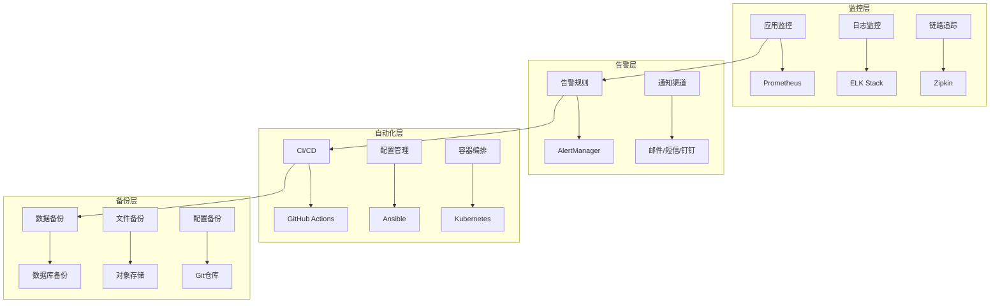

# Spring4demo 运维手册

## 📋 文档信息

| 项目 | 内容 |
|------|------|
| **文档名称** | Spring4demo 运维手册 |
| **版本号** | v1.0.0 |
| **创建日期** | 2025-12-24 |
| **作者** | 运维工程师 |
| **审核人** | 运维经理 |
| **批准人** | 技术总监 |

## 🎯 运维概述

### 运维目标

#### 1. 系统可用性
- **目标可用性**: 99.9% (年停机时间 < 8.76小时)
- **故障恢复时间**: < 30分钟 (RTO)
- **数据恢复点**: < 1小时 (RPO)

#### 2. 性能指标
- **响应时间**: API平均响应时间 < 200ms
- **吞吐量**: 支持1000+并发用户
- **资源利用率**: CPU < 70%, 内存 < 80%, 磁盘 < 85%

#### 3. 安全合规
- **漏洞修复**: 高危漏洞24小时内修复
- **访问控制**: 最小权限原则
- **数据保护**: 符合GDPR、等保2.0要求

### 运维架构



## 🚀 部署指南

### 环境要求

#### 硬件要求

| 环境 | CPU | 内存 | 磁盘 | 网络 |
|------|-----|------|------|------|
| 开发环境 | 2核 | 4GB | 50GB SSD | 100Mbps |
| 测试环境 | 4核 | 8GB | 100GB SSD | 1Gbps |
| 生产环境 | 8核 | 16GB | 500GB SSD | 10Gbps |

#### 软件要求

| 组件 | 版本 | 说明 |
|------|------|------|
| 操作系统 | CentOS 8+ / Ubuntu 20.04+ | Linux系统 |
| Java | JDK 25+ | OpenJDK或Oracle JDK |
| Maven | 3.9.0+ | 构建工具 |
| Docker | 20.0+ | 容器运行时 |
| Kubernetes | 1.25+ | 容器编排 |
| Nginx | 1.20+ | 反向代理 |

### 快速部署

#### 1. Docker Compose部署

```yaml
# docker-compose.yml
version: '3.8'

services:
  # 应用服务
  spring4demo-app:
    image: spring4demo:latest
    container_name: spring4demo-app
    ports:
      - "8080:8080"
    environment:
      - SPRING_PROFILES_ACTIVE=prod
      - SPRING_DATASOURCE_URL=jdbc:mysql://mysql:3306/spring4demo
      - SPRING_DATASOURCE_USERNAME=spring4demo
      - SPRING_DATASOURCE_PASSWORD=${DB_PASSWORD}
      - SPRING_REDIS_HOST=redis
      - SPRING_RABBITMQ_HOST=rabbitmq
    depends_on:
      - mysql
      - redis
      - rabbitmq
    volumes:
      - ./logs:/app/logs
    networks:
      - spring4demo-network
    restart: unless-stopped

  # MySQL数据库
  mysql:
    image: mysql:8.0
    container_name: spring4demo-mysql
    environment:
      - MYSQL_ROOT_PASSWORD=${MYSQL_ROOT_PASSWORD}
      - MYSQL_DATABASE=spring4demo
      - MYSQL_USER=spring4demo
      - MYSQL_PASSWORD=${DB_PASSWORD}
    ports:
      - "3306:3306"
    volumes:
      - mysql-data:/var/lib/mysql
      - ./mysql/init:/docker-entrypoint-initdb.d
    networks:
      - spring4demo-network
    restart: unless-stopped

  # Redis缓存
  redis:
    image: redis:7-alpine
    container_name: spring4demo-redis
    ports:
      - "6379:6379"
    volumes:
      - redis-data:/data
      - ./redis/redis.conf:/usr/local/etc/redis/redis.conf
    command: redis-server /usr/local/etc/redis/redis.conf
    networks:
      - spring4demo-network
    restart: unless-stopped

  # RabbitMQ消息队列
  rabbitmq:
    image: rabbitmq:3.12-management
    container_name: spring4demo-rabbitmq
    environment:
      - RABBITMQ_DEFAULT_USER=admin
      - RABBITMQ_DEFAULT_PASS=${RABBITMQ_PASSWORD}
    ports:
      - "5672:5672"
      - "15672:15672"
    volumes:
      - rabbitmq-data:/var/lib/rabbitmq
    networks:
      - spring4demo-network
    restart: unless-stopped

  # Nginx反向代理
  nginx:
    image: nginx:alpine
    container_name: spring4demo-nginx
    ports:
      - "80:80"
      - "443:443"
    volumes:
      - ./nginx/nginx.conf:/etc/nginx/nginx.conf
      - ./nginx/ssl:/etc/nginx/ssl
    depends_on:
      - spring4demo-app
    networks:
      - spring4demo-network
    restart: unless-stopped

volumes:
  mysql-data:
  redis-data:
  rabbitmq-data:

networks:
  spring4demo-network:
    driver: bridge
```

#### 2. 环境变量配置

```bash
# .env
# 数据库配置
MYSQL_ROOT_PASSWORD=your_root_password
DB_PASSWORD=your_db_password

# RabbitMQ配置
RABBITMQ_PASSWORD=your_rabbitmq_password

# SSL证书路径
SSL_CERT_PATH=./nginx/ssl/cert.pem
SSL_KEY_PATH=./nginx/ssl/key.pem
```

#### 3. 部署脚本

```bash
#!/bin/bash
# deploy.sh

set -e

echo "开始部署 Spring4demo..."

# 检查Docker和Docker Compose
if ! command -v docker &> /dev/null; then
    echo "错误: Docker未安装"
    exit 1
fi

if ! command -v docker-compose &> /dev/null; then
    echo "错误: Docker Compose未安装"
    exit 1
fi

# 创建必要的目录
mkdir -p logs mysql/init redis nginx/ssl

# 复制配置文件
if [ ! -f nginx/nginx.conf ]; then
    cp nginx/nginx.conf.example nginx/nginx.conf
fi

if [ ! -f redis/redis.conf ]; then
    cp redis/redis.conf.example redis/redis.conf
fi

# 构建应用镜像
echo "构建应用镜像..."
docker build -t spring4demo:latest .

# 启动服务
echo "启动服务..."
docker-compose up -d

# 等待服务启动
echo "等待服务启动..."
sleep 30

# 检查服务状态
echo "检查服务状态..."
docker-compose ps

# 健康检查
echo "执行健康检查..."
curl -f http://localhost:8080/actuator/health || {
    echo "错误: 应用健康检查失败"
    docker-compose logs spring4demo-app
    exit 1
}

echo "部署完成!"
echo "应用地址: http://localhost"
echo "API文档: http://localhost/swagger-ui.html"
echo "监控面板: http://localhost:3000 (Grafana)"
```

### Kubernetes部署

#### 1. 命名空间配置

```yaml
# k8s/namespace.yaml
apiVersion: v1
kind: Namespace
metadata:
  name: spring4demo
  labels:
    name: spring4demo
```

#### 2. 配置映射

```yaml
# k8s/configmap.yaml
apiVersion: v1
kind: ConfigMap
metadata:
  name: spring4demo-config
  namespace: spring4demo
data:
  application.yml: |
    spring:
      application:
        name: spring4demo
      profiles:
        active: prod
      datasource:
        url: jdbc:mysql://mysql-service:3306/spring4demo
        username: spring4demo
        password: ${DB_PASSWORD}
      redis:
        host: redis-service
        port: 6379
      rabbitmq:
        host: rabbitmq-service
        port: 5672
        username: admin
        password: ${RABBITMQ_PASSWORD}
    
    server:
      port: 8080
    
    management:
      endpoints:
        web:
          exposure:
            include: health,info,metrics,prometheus
      endpoint:
        health:
          show-details: always
```

#### 3. 密钥配置

```yaml
# k8s/secret.yaml
apiVersion: v1
kind: Secret
metadata:
  name: spring4demo-secrets
  namespace: spring4demo
type: Opaque
data:
  db-password: eW91cl9kYl9wYXNzd29yZA==  # base64编码
  rabbitmq-password: eW91cl9yYWJiaXRtcV9wYXNzd29yZA==
  jwt-secret: eW91cl9qd3Rfc2VjcmV0
```

#### 4. 应用部署

```yaml
# k8s/deployment.yaml
apiVersion: apps/v1
kind: Deployment
metadata:
  name: spring4demo-deployment
  namespace: spring4demo
  labels:
    app: spring4demo
spec:
  replicas: 3
  selector:
    matchLabels:
      app: spring4demo
  template:
    metadata:
      labels:
        app: spring4demo
    spec:
      containers:
      - name: spring4demo
        image: spring4demo:latest
        ports:
        - containerPort: 8080
        env:
        - name: DB_PASSWORD
          valueFrom:
            secretKeyRef:
              name: spring4demo-secrets
              key: db-password
        - name: RABBITMQ_PASSWORD
          valueFrom:
            secretKeyRef:
              name: spring4demo-secrets
              key: rabbitmq-password
        - name: JWT_SECRET
          valueFrom:
            secretKeyRef:
              name: spring4demo-secrets
              key: jwt-secret
        volumeMounts:
        - name: config-volume
          mountPath: /app/config
        - name: logs-volume
          mountPath: /app/logs
        livenessProbe:
          httpGet:
            path: /actuator/health
            port: 8080
          initialDelaySeconds: 60
          periodSeconds: 10
        readinessProbe:
          httpGet:
            path: /actuator/health
            port: 8080
          initialDelaySeconds: 30
          periodSeconds: 5
        resources:
          requests:
            memory: "512Mi"
            cpu: "500m"
          limits:
            memory: "1Gi"
            cpu: "1000m"
      volumes:
      - name: config-volume
        configMap:
          name: spring4demo-config
      - name: logs-volume
        emptyDir: {}
---
apiVersion: v1
kind: Service
metadata:
  name: spring4demo-service
  namespace: spring4demo
spec:
  selector:
    app: spring4demo
  ports:
  - protocol: TCP
    port: 80
    targetPort: 8080
  type: ClusterIP
```

#### 5. Ingress配置

```yaml
# k8s/ingress.yaml
apiVersion: networking.k8s.io/v1
kind: Ingress
metadata:
  name: spring4demo-ingress
  namespace: spring4demo
  annotations:
    kubernetes.io/ingress.class: nginx
    cert-manager.io/cluster-issuer: letsencrypt-prod
    nginx.ingress.kubernetes.io/ssl-redirect: "true"
    nginx.ingress.kubernetes.io/proxy-body-size: "10m"
spec:
  tls:
  - hosts:
    - api.spring4demo.com
    secretName: spring4demo-tls
  rules:
  - host: api.spring4demo.com
    http:
      paths:
      - path: /
        pathType: Prefix
        backend:
          service:
            name: spring4demo-service
            port:
              number: 80
```

#### 6. 部署脚本

```bash
#!/bin/bash
# k8s-deploy.sh

set -e

NAMESPACE="spring4demo"
KUBECTL="kubectl"

echo "开始Kubernetes部署..."

# 创建命名空间
echo "创建命名空间..."
$KUBECTL apply -f k8s/namespace.yaml

# 应用配置
echo "应用配置文件..."
$KUBECTL apply -f k8s/configmap.yaml
$KUBECTL apply -f k8s/secret.yaml

# 部署数据库
echo "部署数据库..."
$KUBECTL apply -f k8s/mysql/
$KUBECTL apply -f k8s/redis/
$KUBECTL apply -f k8s/rabbitmq/

# 等待数据库就绪
echo "等待数据库就绪..."
$KUBECTL wait --for=condition=ready pod -l app=mysql -n $NAMESPACE --timeout=300s
$KUBECTL wait --for=condition=ready pod -l app=redis -n $NAMESPACE --timeout=300s
$KUBECTL wait --for=condition=ready pod -l app=rabbitmq -n $NAMESPACE --timeout=300s

# 部署应用
echo "部署应用..."
$KUBECTL apply -f k8s/deployment.yaml
$KUBECTL apply -f k8s/service.yaml
$KUBECTL apply -f k8s/ingress.yaml

# 等待应用就绪
echo "等待应用就绪..."
$KUBECTL wait --for=condition=available deployment/spring4demo-deployment -n $NAMESPACE --timeout=600s

# 检查部署状态
echo "检查部署状态..."
$KUBECTL get pods -n $NAMESPACE
$KUBECTL get services -n $NAMESPACE
$KUBECTL get ingress -n $NAMESPACE

echo "Kubernetes部署完成!"
```

## 📊 监控配置

### Prometheus配置

#### 1. Prometheus配置文件

```yaml
# prometheus/prometheus.yml
global:
  scrape_interval: 15s
  evaluation_interval: 15s

rule_files:
  - "rules/*.yml"

alerting:
  alertmanagers:
    - static_configs:
        - targets:
          - alertmanager:9093

scrape_configs:
  # Spring Boot应用监控
  - job_name: 'spring4demo'
    metrics_path: '/actuator/prometheus'
    static_configs:
      - targets: ['spring4demo-app:8080']
    scrape_interval: 15s
    scrape_timeout: 10s

  # MySQL监控
  - job_name: 'mysql'
    static_configs:
      - targets: ['mysql-exporter:9104']

  # Redis监控
  - job_name: 'redis'
    static_configs:
      - targets: ['redis-exporter:9121']

  # RabbitMQ监控
  - job_name: 'rabbitmq'
    static_configs:
      - targets: ['rabbitmq:15692']

  # Node监控
  - job_name: 'node'
    static_configs:
      - targets: ['node-exporter:9100']

  # Kubernetes监控
  - job_name: 'kubernetes-apiservers'
    kubernetes_sd_configs:
    - role: endpoints
    scheme: https
    tls_config:
      ca_file: /var/run/secrets/kubernetes.io/serviceaccount/ca.crt
    bearer_token_file: /var/run/secrets/kubernetes.io/serviceaccount/token
    relabel_configs:
    - source_labels: [__meta_kubernetes_namespace, __meta_kubernetes_service_name, __meta_kubernetes_endpoint_port_name]
      action: keep
      regex: default;kubernetes;https
```

#### 2. 告警规则

```yaml
# prometheus/rules/spring4demo.yml
groups:
- name: spring4demo.rules
  rules:
  # 应用可用性告警
  - alert: ApplicationDown
    expr: up{job="spring4demo"} == 0
    for: 1m
    labels:
      severity: critical
    annotations:
      summary: "Spring4demo应用不可用"
      description: "Spring4demo应用已停止运行超过1分钟"

  # 高错误率告警
  - alert: HighErrorRate
    expr: rate(http_requests_total{status=~"5.."}[5m]) > 0.1
    for: 5m
    labels:
      severity: warning
    annotations:
      summary: "应用错误率过高"
      description: "5xx错误率超过10%，持续5分钟"

  # 高响应时间告警
  - alert: HighResponseTime
    expr: histogram_quantile(0.95, rate(http_request_duration_seconds_bucket[5m])) > 1
    for: 5m
    labels:
      severity: warning
    annotations:
      summary: "应用响应时间过长"
      description: "95%请求响应时间超过1秒"

  # 内存使用率告警
  - alert: HighMemoryUsage
    expr: (jvm_memory_used_bytes / jvm_memory_max_bytes) * 100 > 80
    for: 5m
    labels:
      severity: warning
    annotations:
      summary: "内存使用率过高"
      description: "JVM内存使用率超过80%"

  # CPU使用率告警
  - alert: HighCpuUsage
    expr: rate(process_cpu_seconds_total[5m]) * 100 > 80
    for: 5m
    labels:
      severity: warning
    annotations:
      summary: "CPU使用率过高"
      description: "CPU使用率超过80%"

  # 数据库连接池告警
  - alert: DatabaseConnectionPoolExhausted
    expr: hikaricp_connections_active / hikaricp_connections_max > 0.9
    for: 2m
    labels:
      severity: critical
    annotations:
      summary: "数据库连接池即将耗尽"
      description: "数据库连接池使用率超过90%"

  # Redis连接告警
  - alert: RedisConnectionFailed
    expr: redis_up == 0
    for: 1m
    labels:
      severity: critical
    annotations:
      summary: "Redis连接失败"
      description: "无法连接到Redis服务器"
```

### Grafana仪表板

#### 1. 应用性能仪表板

```json
{
  "dashboard": {
    "title": "Spring4demo应用性能",
    "panels": [
      {
        "title": "请求率",
        "type": "graph",
        "targets": [
          {
            "expr": "rate(http_requests_total[5m])",
            "legendFormat": "{{method}} {{uri}}"
          }
        ]
      },
      {
        "title": "响应时间",
        "type": "graph",
        "targets": [
          {
            "expr": "histogram_quantile(0.95, rate(http_request_duration_seconds_bucket[5m]))",
            "legendFormat": "95th percentile"
          },
          {
            "expr": "histogram_quantile(0.50, rate(http_request_duration_seconds_bucket[5m]))",
            "legendFormat": "50th percentile"
          }
        ]
      },
      {
        "title": "错误率",
        "type": "singlestat",
        "targets": [
          {
            "expr": "rate(http_requests_total{status=~\"5..\"}[5m]) / rate(http_requests_total[5m]) * 100"
          }
        ]
      },
      {
        "title": "JVM内存",
        "type": "graph",
        "targets": [
          {
            "expr": "jvm_memory_used_bytes{area=\"heap\"}",
            "legendFormat": "Heap Used"
          },
          {
            "expr": "jvm_memory_max_bytes{area=\"heap\"}",
            "legendFormat": "Heap Max"
          }
        ]
      }
    ]
  }
}
```

### 日志管理

#### 1. Logstash配置

```ruby
# logstash/pipeline/spring4demo.conf
input {
  beats {
    port => 5044
  }
}

filter {
  if [fields][service] == "spring4demo" {
    # 解析JSON格式日志
    json {
      source => "message"
    }
    
    # 解析时间戳
    date {
      match => [ "timestamp", "ISO8601" ]
    }
    
    # 添加标签
    mutate {
      add_tag => [ "spring4demo", "java" ]
    }
    
    # 解析异常堆栈
    if [exception] {
      multiline {
        pattern => "^\\s"
        what => "previous"
      }
    }
    
    # 解析慢查询日志
    if [logger_name] == "com.kev1n.spring4demo.performance" {
      grok {
        match => { "message" => "%{TIMESTAMP_ISO8601:timestamp} %{LOGLEVEL:level} %{GREEDYDATA:message}" }
      }
    }
  }
}

output {
  elasticsearch {
    hosts => ["elasticsearch:9200"]
    index => "spring4demo-%{+YYYY.MM.dd}"
  }
  
  # 输出到标准输出用于调试
  stdout {
    codec => rubydebug
  }
}
```

#### 2. Filebeat配置

```yaml
# filebeat/filebeat.yml
filebeat.inputs:
- type: log
  enabled: true
  paths:
    - /app/logs/*.log
  fields:
    service: spring4demo
    environment: production
  fields_under_root: true
  multiline.pattern: '^\d{4}-\d{2}-\d{2}'
  multiline.negate: true
  multiline.match: after

output.logstash:
  hosts: ["logstash:5044"]

processors:
- add_host_metadata:
    when.not.contains.tags: forwarded
- add_docker_metadata: ~
- add_kubernetes_metadata: ~
```

## 🔧 故障处理

### 常见故障排查

#### 1. 应用无法启动

**症状**: 应用启动失败，容器退出

**排查步骤**:
```bash
# 查看容器日志
docker logs spring4demo-app

# 检查配置文件
docker exec -it spring4demo-app cat /app/config/application.yml

# 检查环境变量
docker exec -it spring4demo-app env | grep SPRING

# 检查端口占用
netstat -tlnp | grep 8080

# 检查JVM参数
docker exec -it spring4demo-app jps -v
```

**常见原因及解决方案**:
- 数据库连接失败: 检查数据库服务和连接配置
- 端口冲突: 修改server.port配置
- 内存不足: 调整JVM heap大小
- 配置错误: 检查application.yml语法

#### 2. 数据库连接问题

**症状**: 应用日志显示数据库连接错误

**排查步骤**:
```bash
# 检查MySQL服务状态
docker exec -it spring4demo-mysql mysql -u root -p -e "SHOW PROCESSLIST;"

# 检查连接数
docker exec -it spring4demo-mysql mysql -u root -p -e "SHOW STATUS LIKE 'Threads_connected';"

# 检查慢查询
docker exec -it spring4demo-mysql mysql -u root -p -e "SHOW VARIABLES LIKE 'slow_query_log';"

# 测试连接
docker exec -it spring4demo-app telnet mysql 3306
```

**解决方案**:
```sql
-- 增加最大连接数
SET GLOBAL max_connections = 1000;

-- 优化连接池配置
-- 在application.yml中调整
spring:
  datasource:
    hikari:
      maximum-pool-size: 20
      minimum-idle: 5
      connection-timeout: 20000
```

#### 3. Redis连接问题

**症状**: 缓存操作失败，性能下降

**排查步骤**:
```bash
# 检查Redis服务状态
docker exec -it spring4demo-redis redis-cli ping

# 检查内存使用
docker exec -it spring4demo-redis redis-cli info memory

# 检查连接数
docker exec -it spring4demo-redis redis-cli info clients

# 检查慢查询
docker exec -it spring4demo-redis redis-cli slowlog get 10
```

**解决方案**:
```bash
# 清理过期键
docker exec -it spring4demo-redis redis-cli --scan --pattern "*" | xargs docker exec -i spring4demo-redis redis-cli del

# 监控Redis性能
docker exec -it spring4demo-redis redis-cli monitor
```

### 故障恢复流程

#### 1. 服务重启流程

```bash
#!/bin/bash
# restart-service.sh

SERVICE_NAME=$1
NAMESPACE=${2:-spring4demo}

if [ -z "$SERVICE_NAME" ]; then
    echo "用法: $0 <service-name> [namespace]"
    exit 1
fi

echo "重启服务: $SERVICE_NAME"

# 滚动更新部署
kubectl rollout restart deployment/$SERVICE_NAME -n $NAMESPACE

# 等待更新完成
kubectl rollout status deployment/$SERVICE_NAME -n $NAMESPACE --timeout=300s

# 检查Pod状态
kubectl get pods -l app=$SERVICE_NAME -n $NAMESPACE

echo "服务重启完成"
```

#### 2. 数据库恢复流程

```bash
#!/bin/bash
# restore-database.sh

BACKUP_FILE=$1
DB_NAME=${2:-spring4demo}

if [ -z "$BACKUP_FILE" ]; then
    echo "用法: $0 <backup-file> [database-name]"
    exit 1
fi

echo "恢复数据库: $DB_NAME 从备份文件: $BACKUP_FILE"

# 停止应用服务
kubectl scale deployment spring4demo-deployment --replicas=0 -n spring4demo

# 恢复数据库
kubectl exec -i mysql-0 -n spring4demo -- mysql -u root -p$MYSQL_ROOT_PASSWORD $DB_NAME < $BACKUP_FILE

# 重启应用服务
kubectl scale deployment spring4demo-deployment --replicas=3 -n spring4demo

# 等待服务就绪
kubectl wait --for=condition=available deployment/spring4demo-deployment -n spring4demo --timeout=300s

echo "数据库恢复完成"
```

#### 3. 紧急故障响应

```bash
#!/bin/bash
# emergency-response.sh

INCIDENT_TYPE=$1

case $INCIDENT_TYPE in
    "app_down")
        echo "应用宕机应急响应"
        # 检查应用状态
        kubectl get pods -n spring4demo
        # 重启应用
        kubectl rollout restart deployment/spring4demo-deployment -n spring4demo
        ;;
    "db_down")
        echo "数据库宕机应急响应"
        # 检查数据库状态
        kubectl get pods -l app=mysql -n spring4demo
        # 重启数据库
        kubectl delete pod mysql-0 -n spring4demo
        ;;
    "high_cpu")
        echo "高CPU使用率应急响应"
        # 扩容应用实例
        kubectl scale deployment spring4demo-deployment --replicas=5 -n spring4demo
        ;;
    "high_memory")
        echo "高内存使用率应急响应"
        # 重启应用释放内存
        kubectl rollout restart deployment/spring4demo-deployment -n spring4demo
        ;;
    *)
        echo "未知故障类型: $INCIDENT_TYPE"
        exit 1
        ;;
esac
```

## 📋 维护计划

### 定期维护任务

#### 1. 日常维护 (每日)

```bash
#!/bin/bash
# daily-maintenance.sh

echo "开始日常维护任务..."

# 检查系统状态
echo "检查系统状态..."
kubectl get pods -n spring4demo
kubectl get nodes

# 清理日志文件
echo "清理日志文件..."
find /var/log -name "*.log" -mtime +7 -delete

# 检查磁盘空间
echo "检查磁盘空间..."
df -h

# 备份配置文件
echo "备份配置文件..."
kubectl get configmap -n spring4demo -o yaml > backup/configmap-$(date +%Y%m%d).yaml
kubectl get secret -n spring4demo -o yaml > backup/secret-$(date +%Y%m%d).yaml

# 发送状态报告
echo "发送状态报告..."
./scripts/send-status-report.sh

echo "日常维护完成"
```

#### 2. 周期维护 (每周)

```bash
#!/bin/bash
# weekly-maintenance.sh

echo "开始周期维护任务..."

# 更新系统补丁
echo "更新系统补丁..."
apt update && apt upgrade -y

# 清理Docker镜像
echo "清理Docker镜像..."
docker system prune -f

# 数据库优化
echo "数据库优化..."
kubectl exec -i mysql-0 -n spring4demo -- mysql -u root -p$MYSQL_ROOT_PASSWORD -e "OPTIMIZE TABLE spring4demo.users;"

# 检查证书有效期
echo "检查SSL证书..."
./scripts/check-ssl-certificates.sh

# 性能测试
echo "执行性能测试..."
./scripts/performance-test.sh

echo "周期维护完成"
```

#### 3. 月度维护 (每月)

```bash
#!/bin/bash
# monthly-maintenance.sh

echo "开始月度维护任务..."

# 安全扫描
echo "执行安全扫描..."
./scripts/security-scan.sh

# 容量规划
echo "容量规划分析..."
./scripts/capacity-planning.sh

# 备份验证
echo "验证备份文件..."
./scripts/verify-backups.sh

# 文档更新
echo "更新运维文档..."
./scripts/update-documentation.sh

echo "月度维护完成"
```

### 备份策略

#### 1. 数据库备份

```bash
#!/bin/bash
# backup-database.sh

BACKUP_DIR="/backup/mysql"
DATE=$(date +%Y%m%d_%H%M%S)
DB_NAME="spring4demo"

# 创建备份目录
mkdir -p $BACKUP_DIR

# 全量备份
echo "执行全量备份..."
mysqldump -h mysql -u root -p$MYSQL_ROOT_PASSWORD \
  --single-transaction \
  --routines \
  --triggers \
  $DB_NAME | gzip > $BACKUP_DIR/${DB_NAME}_full_${DATE}.sql.gz

# 删除7天前的备份
find $BACKUP_DIR -name "*.sql.gz" -mtime +7 -delete

echo "数据库备份完成: ${DB_NAME}_full_${DATE}.sql.gz"
```

#### 2. 应用配置备份

```bash
#!/bin/bash
# backup-config.sh

BACKUP_DIR="/backup/config"
DATE=$(date +%Y%m%d_%H%M%S)
NAMESPACE="spring4demo"

mkdir -p $BACKUP_DIR

# 备份ConfigMap
kubectl get configmap -n $NAMESPACE -o yaml > $BACKUP_DIR/configmap_${DATE}.yaml

# 备份Secret
kubectl get secret -n $NAMESPACE -o yaml > $BACKUP_DIR/secret_${DATE}.yaml

# 备份Deployment
kubectl get deployment -n $NAMESPACE -o yaml > $BACKUP_DIR/deployment_${DATE}.yaml

# 备份Service
kubectl get service -n $NAMESPACE -o yaml > $BACKUP_DIR/service_${DATE}.yaml

# 备份Ingress
kubectl get ingress -n $NAMESPACE -o yaml > $BACKUP_DIR/ingress_${DATE}.yaml

echo "配置备份完成"
```

#### 3. 自动备份配置

```yaml
# k8s/cronjob-backup.yaml
apiVersion: batch/v1
kind: CronJob
metadata:
  name: database-backup
  namespace: spring4demo
spec:
  schedule: "0 2 * * *"  # 每天凌晨2点执行
  jobTemplate:
    spec:
      template:
        spec:
          containers:
          - name: mysql-backup
            image: mysql:8.0
            command:
            - /bin/bash
            - -c
            - |
              mysqldump -h mysql -u root -p$MYSQL_ROOT_PASSWORD \
                --single-transaction \
                --routines \
                --triggers \
                spring4demo | gzip > /backup/${DB_NAME}_$(date +%Y%m%d_%H%M%S).sql.gz
            env:
            - name: MYSQL_ROOT_PASSWORD
              valueFrom:
                secretKeyRef:
                  name: spring4demo-secrets
                  key: db-password
            volumeMounts:
            - name: backup-storage
              mountPath: /backup
          volumes:
          - name: backup-storage
            persistentVolumeClaim:
              claimName: backup-pvc
          restartPolicy: OnFailure
```

## 🔒 安全运维

### 安全检查清单

#### 1. 系统安全检查

```bash
#!/bin/bash
# security-check.sh

echo "执行系统安全检查..."

# 检查开放端口
echo "检查开放端口..."
nmap -sT -O localhost

# 检查用户权限
echo "检查用户权限..."
cat /etc/passwd | grep -E "sh$"

# 检查sudo权限
echo "检查sudo权限..."
cat /etc/sudoers

# 检查SSH配置
echo "检查SSH配置..."
cat /etc/ssh/sshd_config | grep -E "PermitRootLogin|PasswordAuthentication"

# 检查防火墙状态
echo "检查防火墙状态..."
ufw status

# 检查进程
echo "检查可疑进程..."
ps aux | grep -E "sh|bash|python|perl" | grep -v grep

echo "安全检查完成"
```

#### 2. 应用安全检查

```bash
#!/bin/bash
# app-security-check.sh

echo "执行应用安全检查..."

# 检查依赖漏洞
echo "检查依赖漏洞..."
mvn dependency-check:check

# 检查配置安全
echo "检查配置安全..."
kubectl get secret -n spring4demo -o yaml | grep -i "password\|key\|secret"

# 检查网络策略
echo "检查网络策略..."
kubectl get networkpolicy -n spring4demo

# 检查Pod安全策略
echo "检查Pod安全策略..."
kubectl get psp

# 检查RBAC配置
echo "检查RBAC配置..."
kubectl get role,rolebinding -n spring4demo

echo "应用安全检查完成"
```

### 证书管理

#### 1. SSL证书自动更新

```yaml
# k8s/cert-manager.yaml
apiVersion: cert-manager.io/v1
kind: ClusterIssuer
metadata:
  name: letsencrypt-prod
spec:
  acme:
    server: https://acme-v02.api.letsencrypt.org/directory
    email: admin@spring4demo.com
    privateKeySecretRef:
      name: letsencrypt-prod
    solvers:
    - http01:
        ingress:
          class: nginx
```

#### 2. 证书监控脚本

```bash
#!/bin/bash
# check-certificates.sh

DOMAINS=("api.spring4demo.com" "admin.spring4demo.com")
ALERT_EMAIL="admin@spring4demo.com"

for domain in "${DOMAINS[@]}"; do
    # 获取证书过期时间
    expiry_date=$(echo | openssl s_client -servername $domain -connect $domain:443 2>/dev/null | openssl x509 -noout -enddate | cut -d= -f2)
    
    # 转换为时间戳
    expiry_timestamp=$(date -d "$expiry_date" +%s)
    current_timestamp=$(date +%s)
    
    # 计算剩余天数
    days_left=$(( (expiry_timestamp - current_timestamp) / 86400 ))
    
    echo "$domain 证书还有 $days_left 天过期"
    
    # 如果剩余天数少于30天，发送告警
    if [ $days_left -lt 30 ]; then
        echo "警告: $domain 证书即将过期" | mail -s "SSL证书过期告警" $ALERT_EMAIL
    fi
done
```

---

*本运维手册将随着系统架构和运维需求的变化持续更新，确保运维工作的有效性和安全性。*