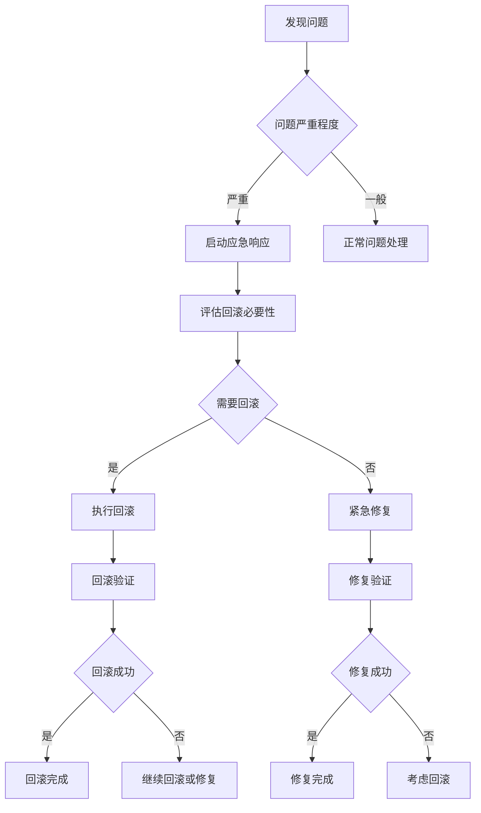

# Junmo Platform 版本发布计划

## 📋 文档信息

| 项目 | 内容 |
|------|------|
| **文档名称** | Junmo Platform 版本发布计划 |
| **版本号** | v1.0.0 |
| **创建日期** | 2025-12-24 |
| **作者** | 产品经理 |
| **审核人** | 技术负责人 |
| **批准人** | 项目总监 |

## 🎯 版本规划概述

### 版本策略

#### 1. 语义化版本控制

**版本格式**: `MAJOR.MINOR.PATCH`

- **MAJOR (主版本)**: 不兼容的API修改
- **MINOR (次版本)**: 向下兼容的功能性新增
- **PATCH (修订版本)**: 向下兼容的问题修正

**示例**:
- `1.0.0`: 首个正式版本
- `1.1.0`: 新增功能版本
- `1.1.1`: 问题修复版本

#### 2. 发布周期

**主版本**: 每6-12个月
**次版本**: 每1-2个月
**修订版本**: 根据需要随时发布

#### 3. 分支策略


## 📅 版本发布时间表

### 2024年版本计划

#### Q1 2024 (1月-3月)

**v1.0.0 - 基础版本**
- **发布日期**: 2024-03-31
- **开发周期**: 2024-01-01 至 2024-03-31
- **主要功能**:
  - 用户管理系统
  - 基础权限控制
  - 文档管理
  - 基础工作流

**里程碑**:
- **Alpha版本** (2024-02-15): 内部测试版本
- **Beta版本** (2024-03-15): 公开测试版本
- **RC版本** (2024-03-25): 候选发布版本
- **正式版本** (2024-03-31): 正式发布

#### Q2 2024 (4月-6月)

**v1.1.0 - 功能增强版本**
- **发布日期**: 2024-05-31
- **开发周期**: 2024-04-01 至 2024-05-31
- **主要功能**:
  - 高级工作流引擎
  - 数据分析模块
  - 消息通知中心
  - API文档系统

**v1.1.1 - 问题修复版本**
- **发布日期**: 2024-06-15
- **修复内容**:
  - 性能优化
  - 安全漏洞修复
  - 用户体验改进

#### Q3 2024 (7月-9月)

**v1.2.0 - 集成版本**
- **发布日期**: 2024-08-31
- **开发周期**: 2024-07-01 至 2024-08-31
- **主要功能**:
  - 第三方系统集成
  - 移动端支持
  - 高级报表功能
  - 系统监控面板

**v1.2.1 - 稳定性版本**
- **发布日期**: 2024-09-20
- **修复内容**:
  - 系统稳定性改进
  - 数据库优化
  - 缓存性能提升

#### Q4 2024 (10月-12月)

**v1.3.0 - 智能化版本**
- **发布日期**: 2024-11-30
- **开发周期**: 2024-10-01 至 2024-11-30
- **主要功能**:
  - AI智能推荐
  - 自动化流程
  - 高级安全功能
  - 多租户支持

**v1.3.1 - 年终维护版本**
- **发布日期**: 2024-12-20
- **修复内容**:
  - 年终数据统计
  - 性能优化
  - 安全加固

### 2025年版本计划

#### Q1 2025 (1月-3月)

**v2.0.0 - 架构升级版本**
- **发布日期**: 2025-03-31
- **开发周期**: 2025-01-01 至 2025-03-31
- **主要功能**:
  - 微服务架构
  - 云原生部署
  - 容器化支持
  - 分布式缓存

**重大变更**:
- API接口重构
- 数据库架构调整
- 配置管理优化
- 部署方式变更

## 🚀 版本发布流程

### 发布前准备

#### 1. 功能完成度检查

**检查清单**:
- [ ] 所有计划功能已完成开发
- [ ] 单元测试覆盖率 ≥ 80%
- [ ] 集成测试全部通过
- [ ] 性能测试达到预期指标
- [ ] 安全测试无高危漏洞
- [ ] 文档更新完成

**功能验证**:
```bash
# 运行完整测试套件
mvn clean verify

# 生成测试报告
mvn jacoco:report

# 性能测试
./scripts/performance-test.sh

# 安全扫描
mvn dependency-check:check
```

#### 2. 代码质量检查

**静态代码分析**:
```bash
# SonarQube代码质量检查
mvn sonar:sonar \
  -Dsonar.projectKey=Junmo Platform \
  -Dsonar.host.url=http://sonar-server:9000 \
  -Dsonar.login=your-token

# 代码覆盖率检查
mvn clean test jacoco:report

# 代码格式检查
mvn spotless:check
```

**质量指标**:
- 代码覆盖率 ≥ 80%
- 代码重复率 ≤ 3%
- 代码复杂度 ≤ 10
- 无阻塞级问题
- 无严重级安全问题

#### 3. 文档准备

**必需文档**:
- [x] 版本发布说明
- [x] API文档更新
- [x] 用户手册更新
- [x] 运维手册更新
- [x] 开发指南更新
- [x] 迁移指南（如需要）

**发布说明模板**:
```markdown
# Junmo Platform v{version} 发布说明

## 🎉 版本亮点
- 主要功能1
- 主要功能2
- 主要功能3

## ✨ 新增功能
- 功能描述1
- 功能描述2

## 🐛 问题修复
- 问题描述1
- 问题描述2

## 🔧 技术改进
- 性能优化
- 安全加固
- 代码重构

## 📋 依赖更新
- Spring Boot 4.0.1 → 4.0.2
- MySQL 8.0 → 8.1
- Redis 7.0 → 7.2

## ⚠️ 重要提示
- 破坏性变更说明
- 迁移注意事项
- 配置变更说明

## 🚀 升级指南
- 升级步骤
- 配置调整
- 数据迁移

## 📞 技术支持
- 联系方式
- 问题反馈渠道
```

### 发布流程

#### 1. 创建发布分支

```bash
# 切换到develop分支
git checkout develop
git pull origin develop

# 创建发布分支
git checkout -b release/v{version}

# 更新版本号
mvn versions:set -DnewVersion={version}
git commit -m "chore: 准备发布版本 {version}"
git push origin release/v{version}
```

#### 2. 发布分支测试

```bash
# 构建发布版本
mvn clean package -Pprod

# 运行集成测试
mvn verify -Pintegration-test

# 部署到测试环境
./scripts/deploy-test.sh release/v{version}

# 执行端到端测试
./scripts/e2e-test.sh
```

#### 3. 修复发布问题

```bash
# 在发布分支上修复问题
git checkout release/v{version}

# 修复代码
# ...

# 提交修复
git add .
git commit -m "fix: 修复发布版本问题"
git push origin release/v{version}

# 重新测试
./scripts/test-release.sh
```

#### 4. 合并到主分支

```bash
# 切换到main分支
git checkout main
git pull origin main

# 合并发布分支
git merge --no-ff release/v{version}

# 创建发布标签
git tag -a v{version} -m "发布版本 {version}"

# 推送到远程仓库
git push origin main
git push origin v{version}
```

#### 5. 合并回开发分支

```bash
# 切换到develop分支
git checkout develop
git pull origin develop

# 合并发布分支
git merge --no-ff release/v{version}

# 推送开发分支
git push origin develop

# 删除发布分支
git branch -d release/v{version}
git push origin --delete release/v{version}
```

### 发布后工作

#### 1. 部署到生产环境

```bash
# 构建生产镜像
docker build -t Junmo Platform:{version} .
docker tag Junmo Platform:{version} Junmo Platform:latest

# 推送到镜像仓库
docker push Junmo Platform:{version}
docker push Junmo Platform:latest

# 部署到生产环境
./scripts/deploy-prod.sh {version}

# 验证部署
./scripts/verify-deployment.sh {version}
```

#### 2. 监控和验证

**健康检查**:
```bash
# 检查应用状态
curl -f https://api.Junmo Platform.com/actuator/health

# 检查关键功能
./scripts/smoke-test.sh

# 监控系统指标
./scripts/monitor-check.sh
```

**日志监控**:
```bash
# 查看应用日志
kubectl logs -f deployment/Junmo Platform -n production

# 检查错误日志
kubectl logs deployment/Junmo Platform -n production | grep ERROR

# 监控性能指标
./scripts/performance-monitor.sh
```

#### 3. 用户通知

**通知渠道**:
- 邮件通知
- 系统内公告
- 官方网站更新
- 社交媒体发布

**通知内容**:
- 版本发布说明
- 新功能介绍
- 问题修复列表
- 升级指南

## 📋 版本发布检查清单

### 发布前检查

#### 代码质量
- [ ] 代码审查完成
- [ ] 单元测试通过
- [ ] 集成测试通过
- [ ] 性能测试达标
- [ ] 安全测试通过
- [ ] 代码覆盖率达标

#### 功能完整性
- [ ] 所有计划功能完成
- [ ] 功能测试通过
- [ ] 用户体验测试通过
- [ ] 兼容性测试通过
- [ ] 边界条件测试通过

#### 文档完整性
- [ ] 发布说明完成
- [ ] API文档更新
- [ ] 用户手册更新
- [ ] 运维手册更新
- [ ] 开发指南更新

#### 环境准备
- [ ] 测试环境验证
- [ ] 预生产环境验证
- [ ] 生产环境准备
- [ ] 数据库脚本准备
- [ ] 配置文件准备

### 发布过程检查

#### 构建过程
- [ ] 代码合并正确
- [ ] 版本号更新正确
- [ ] 构建过程无错误
- [ ] 测试执行通过
- [ ] 构建产物完整

#### 部署过程
- [ ] 部署脚本正确
- [ ] 环境变量配置正确
- [ ] 数据库迁移成功
- [ ] 服务启动成功
- [ ] 健康检查通过

#### 验证过程
- [ ] 基础功能验证
- [ ] 核心业务验证
- [ ] 性能指标验证
- [ ] 安全功能验证
- [ ] 监控指标正常

### 发布后检查

#### 系统监控
- [ ] 应用运行正常
- [ ] 数据库连接正常
- [ ] 缓存服务正常
- [ ] 消息队列正常
- [ ] 监控指标正常

#### 用户反馈
- [ ] 收集用户反馈
- [ ] 处理用户问题
- [ ] 记录系统问题
- [ ] 跟踪使用情况
- [ ] 分析性能数据

#### 问题处理
- [ ] 紧急问题响应
- [ ] 问题根因分析
- [ ] 修复方案制定
- [ ] 修复版本发布
- [ ] 问题总结归档

## 🔄 版本回滚计划

### 回滚触发条件

#### 严重问题
- 系统无法正常访问
- 数据丢失或损坏
- 安全漏洞被利用
- 性能严重下降
- 核心功能无法使用

#### 回滚决策流程



### 回滚执行步骤

#### 1. 快速回滚（Docker环境）

```bash
# 查看当前版本
kubectl get deployment Junmo Platform -o yaml | grep image

# 回滚到上一个版本
kubectl rollout undo deployment/Junmo Platform -n production

# 回滚到指定版本
kubectl rollout undo deployment/Junmo Platform --to-revision=2 -n production

# 验证回滚
kubectl rollout status deployment/Junmo Platform -n production
```

#### 2. 数据库回滚

```bash
# 查看数据库迁移历史
./scripts/db-migration-history.sh

# 回滚数据库版本
./scripts/db-rollback.sh {previous_version}

# 验证数据库状态
./scripts/db-verify.sh
```

#### 3. 配置回滚

```bash
# 恢复配置文件
kubectl apply -f k8s/configmap-backup.yaml
kubectl apply -f k8s/secret-backup.yaml

# 重启服务
kubectl rollout restart deployment/Junmo Platform -n production
```

### 回滚验证

#### 功能验证
- [ ] 基础功能正常
- [ ] 数据完整性验证
- [ ] 用户访问正常
- [ ] 性能指标恢复
- [ ] 错误日志检查

#### 监控验证
- [ ] 系统资源使用正常
- [ ] 应用响应时间正常
- [ ] 错误率在正常范围
- [ ] 数据库连接正常
- [ ] 外部服务连接正常

## 📊 版本发布指标

### 发布质量指标

#### 技术指标
- **代码覆盖率**: ≥ 80%
- **代码质量评分**: ≥ A级
- **安全漏洞数量**: 0个高危漏洞
- **性能回归**: ≤ 5%
- **构建成功率**: 100%

#### 业务指标
- **功能完成率**: 100%
- **测试通过率**: 100%
- **发布准时率**: ≥ 90%
- **回滚率**: ≤ 5%
- **用户满意度**: ≥ 4.5/5

### 发布效率指标

#### 时间指标
- **开发周期**: 按计划完成
- **测试周期**: ≤ 2周
- **发布准备时间**: ≤ 3天
- **发布执行时间**: ≤ 2小时
- **发布验证时间**: ≤ 4小时

#### 成本指标
- **发布成本**: 在预算范围内
- **人力投入**: 按计划投入
- **资源利用率**: ≥ 80%
- **故障处理成本**: 最小化

## 📞 应急响应

### 应急联系机制

#### 核心团队
| 角色 | 负责人 | 联系方式 | 备用联系人 |
|------|--------|----------|------------|
| 发布负责人 | 张三 | 13800138000 | 李四 |
| 技术负责人 | 李四 | 13800138001 | 王五 |
| 运维负责人 | 王五 | 13800138002 | 赵六 |
| 产品负责人 | 赵六 | 13800138003 | 钱七 |

#### 应急联系方式
- **技术支持热线**: 400-123-4567
- **紧急联系邮箱**: emergency@Junmo Platform.com
- **应急响应群**: 企业微信群/钉钉群

### 应急处理流程

#### 问题发现
1. **监控系统告警**
2. **用户反馈**
3. **内部测试发现**
4. **第三方报告**

#### 响应时间
- **P0级故障**: 15分钟内响应
- **P1级故障**: 30分钟内响应
- **P2级故障**: 2小时内响应
- **P3级故障**: 4小时内响应

#### 处理步骤
1. **问题确认**: 确认问题严重程度和影响范围
2. **应急响应**: 启动应急响应小组
3. **问题分析**: 快速分析问题根因
4. **解决方案**: 制定临时解决方案
5. **执行修复**: 执行修复或回滚
6. **验证恢复**: 验证系统恢复情况
7. **问题总结**: 总结问题原因和改进措施

---

*本版本发布计划将根据项目进展和市场需求动态调整，确保版本发布的质量和时效性。*