# Junmo Platform 项目技术栈差异对比与代码质量评审报告

## 📋 文档信息

| 项目 | 内容 |
|------|------|
| **文档名称** | Junmo Platform 项目技术栈差异对比与代码质量评审报告 |
| **版本号** | v7.0.0 |
| **生成日期** | 2026-01-14 |
| **文档类型** | 架构师视角技术栈差异分析与代码质量评审 |
| **项目阶段** | 功能完善阶段 |
| **架构匹配度** | 84% |
| **代码质量评分** | 57/100 |

> **📌 重要更新**：本报告已更新至 v6.0.0，包含最新的代码质量评审结果。详细的代码质量评审报告请查看 [CODE_REVIEW_REPORT.md](./CODE_REVIEW_REPORT.md)

---

## 🎯 执行摘要

### 关键发现

作为架构师，通过深入分析Junmo Platform项目的设计文档与代码实现，发现：

- **架构设计与代码匹配度**: 84%（良好）
- **技术栈覆盖率**: 100%（71个技术栈全部引入）
- **核心组件实现率**: 97.2%（68/70个核心组件已实现）
- **架构决策执行情况**: 100%（所有架构决策都在代码中得到正确实现）
- **六边形架构实现**: 70%（需改进）
- **接口设计匹配度**: 85%（良好）
- **代码质量评分**: 57/100（需大幅提升）
- **测试覆盖率**: 0%（严重问题）
- **严重问题数**: 5个（需立即修复）
- **重要问题数**: 8个（需尽快修复）
- **TODO标记数**: 105个（需完成）

### 架构决策

**单体Spring Boot应用**：基于当前业务规模和团队规模，决定采用单体Spring Boot应用架构，而非微服务架构。

**架构调整**：
- 去掉微服务组件：Spring Cloud Gateway、Nacos、Sentinel、RSocket、RocketMQ
- 接入层简化为Nginx负载均衡器
- 限流方案从Sentinel调整为Guava限流
- 消息队列使用Spring Boot原生API接入RabbitMQ和Kafka
- 保留MongoDB、Elasticsearch、Neo4j、InfluxDB等数据存储

### 主要差异

1. **架构计划文档未更新**：GraphQL在架构计划中标记为未实现，但实际已完整实现
2. **部分技术栈依赖引入但未使用**：HATEOAS、Web Services、Spring Integration、OAuth2、Spring Batch、Testcontainers、WireMock
3. **部分功能需要完善**：Neo4j图数据库需要完善关系查询方法（95% → 100%），InfluxDB时序数据库需要完善查询方法（95% → 100%）

---

## 🏗️ 架构设计与代码匹配度分析

### 综合评估：84/100

| 维度 | 得分 | 满分 | 状态 |
|------|------|------|------|
| **模块划分** | 95 | 100 | ✅ 优秀 |
| **依赖关系** | 100 | 100 | ✅ 优秀 |
| **技术栈** | 100 | 100 | ✅ 优秀 |
| **接口设计** | 85 | 100 | ⚠️ 良好 |
| **六边形架构** | 70 | 100 | ⚠️ 需改进 |
| **架构决策** | 100 | 100 | ✅ 优秀 |
| **代码质量** | 40 | 100 | ❌ 严重 |
| **综合评分** | **84** | 100 | ⚠️ 良好 |

### 1. 模块划分评估：95/100

**模块结构**：✅ 95% 符合设计

| 模块 | 职责 | 状态 | 说明 |
|------|------|------|------|
| **build-tools** | 代码质量检查配置 | ✅ 符合 | Checkstyle、SpotBugs、PMD配置 |
| **common** | 公共模块 - 通用工具类、常量、基础配置 | ✅ 符合 | 配置类、工具类、常量 |
| **test-support** | 测试支持模块 - Testcontainers 配置和测试工具类 | ✅ 符合 | Testcontainers 配置和测试工具类 |
| **core** | 核心业务模块 - 业务逻辑、实体类、数据访问 | ✅ 符合 | 实体、repository、service |
| **web** | Web应用模块 - Controller层、Web配置 | ✅ 符合 | controller、config、interceptor |
| **api** | API接口模块 - 对外API定义、DTO | ✅ 符合 | DTO 定义 |
| **admin** | 管理后台模块 - 后台管理功能 | ✅ 符合 | 管理后台功能 |
| **integration** | 集成测试模块 - 端到端测试、集成测试 | ✅ 符合 | 端到端测试、集成测试 |
| **generator** | 代码生成器模块 - 代码生成工具 | ✅ 符合 | 代码生成工具 |
| **starter** | 启动器模块 - 应用启动入口 | ✅ 符合 | 应用启动入口 |

**问题**：
- ⚠️ 部分配置类位置不当（core 模块 → 应在 common 模块）

### 2. 依赖关系评估：100/100

**依赖原则**：✅ 100% 符合设计

| 依赖原则 | 设计要求 | 实际实现 | 状态 |
|---------|---------|---------|------|
| **common 模块** | 不依赖任何其他业务模块 | ✅ 不依赖 | 符合 |
| **web 模块** | 依赖 core 模块 | ✅ 依赖 core | 符合 |
| **core 模块** | 依赖 common 和 api 模块 | ✅ 依赖 common 和 api | 符合 |
| **test-support 模块** | 可以依赖 common 模块 | ✅ 依赖 common | 符合 |
| **循环依赖** | 避免循环依赖 | ✅ 无循环依赖 | 符合 |
| **模块职责** | 保持模块职责单一 | ✅ 职责单一 | 符合 |

**结论**：✅ 所有依赖关系都符合设计原则，无循环依赖

### 3. 技术栈匹配度评估：100/100

**技术栈完成度**：✅ 100%

| 技术领域 | 设计版本 | 实际版本 | 状态 | 完成度 |
|---------|---------|---------|------|--------|
| **核心框架** | Spring Boot 4.0.1 | Spring Boot 4.0.1 | ✅ | 100% |
| **编程语言** | Java 25 | Java 25 | ✅ | 100% |
| **构建工具** | Maven 3.9.12 | Maven 3.9.12 | ✅ | 100% |
| **关系数据库** | MySQL 8.0 | MySQL 9.5.0 | ✅ | 100% |
| **测试数据库** | H2 | H2 2.4.240 | ✅ | 100% |
| **ORM 框架** | MyBatis-Plus 3.5.9 | MyBatis-Plus 3.5.9 | ✅ | 100% |
| **连接池** | Druid 1.2.20 | Druid 1.2.20 | ✅ | 100% |
| **缓存** | Redis 7.0 | Redis 7.0 | ✅ | 100% |
| **Redis 客户端** | Redisson 3.35.0 | Redisson 3.35.0 | ✅ | 100% |
| **文档数据库** | MongoDB 6.0 | MongoDB 6.0 | ✅ | 100% |
| **搜索引擎** | Elasticsearch 8.0 | Elasticsearch 8.11.4 | ✅ | 100% |
| **图数据库** | Neo4j 5.12 | Neo4j 5.12.0 | ✅ | 100% |
| **时序数据库** | InfluxDB 3.0 | InfluxDB3 Client 1.7.0 | ✅ | 100% |
| **消息队列** | RabbitMQ 3.12 | RabbitMQ 5.17.0 | ✅ | 100% |
| **消息队列** | Kafka 3.6.1 | Kafka 3.6.1 | ✅ | 100% |
| **认证授权** | Sa-Token 1.44.0 | Sa-Token 1.44.0 | ✅ | 100% |
| **响应式 Web** | WebFlux | WebFlux | ✅ | 100% |
| **WebSocket** | WebSocket | WebSocket | ✅ | 100% |
| **GraphQL** | GraphQL | GraphQL | ✅ | 100% |
| **任务调度** | Quartz 2.3.2 | Quartz 2.3.2 | ✅ | 100% |
| **分布式事务** | Seata 2.5.0 | Seata 2.5.0 | ✅ | 100% |
| **文件存储** | AWS S3 SDK | AWS S3 SDK 2.29.29 | ✅ | 100% |
| **API 文档** | SpringDoc 2.7.0 | SpringDoc 2.7.0 | ✅ | 100% |
| **API 文档** | Knife4j 4.5.0 | Knife4j 4.5.0 | ✅ | 100% |
| **测试框架** | Testcontainers 2.0.3 | Testcontainers 2.0.3 | ✅ | 100% |

**结论**：✅ 技术栈完成度 100%，版本号基本一致

### 4. 接口设计匹配度评估：85/100

**RESTful 规范**：✅ 90% 符合设计

| 规范项 | 设计要求 | 实际实现 | 状态 |
|--------|---------|---------|------|
| **HTTP 方法** | GET/POST/PUT/DELETE | ✅ 正确使用 | 符合 |
| **资源路径** | RESTful 风格 | ✅ 设计合理 | 符合 |
| **HTTP 状态码** | 正确使用状态码 | ✅ 正确使用 | 符合 |

**统一响应格式**：✅ 100% 符合设计

```java
// 实际代码
public ResponseEntity<ApiResponse<User>> createUser(@RequestBody UserCreateRequest request)
```

**分页响应格式**：✅ 100% 符合设计

```java
// 实际代码
public ResponseEntity<ApiResponse<Page<User>>> getUsers(@ModelAttribute UserQueryRequest request)
```

**认证授权**：✅ 100% 符合设计

```java
// 实际代码
@SaCheckLogin
@SaCheckRole("ADMIN")
@SaCheckPermission("user:update")
```

**限流保护**：✅ 100% 符合设计

```java
// 实际代码
@RateLimit(key = "user:list", permits = 100)
```

**API 版本控制**：⚠️ 70% 符合设计

- **设计要求**：通过请求头（X-API-Version）控制版本
- **实际实现**：使用不同的 Controller（UserV1Controller, UserV2Controller）
- **问题**：实现方式与设计文档不一致

**接口设计完成度**：⚠️ **85%**

### 5. 六边形架构实现评估：70/100

**实际六边形架构图**：

```mermaid
graph TB
    subgraph "表现层 (Presentation Layer)"
        A1[Web Controllers] --> A2[UserController]
        A1 --> A3[AuthController]
        A1 --> A4[DocumentPreviewController]
        A1 --> A5[FileStorageController]
        A1 --> A6[GraphQLController]
        A1 --> A7[WebSocketController]
        A8[Interceptors] --> A9[认证拦截器]
        A8 --> A10[限流拦截器]
        A11[Handlers] --> A12[全局异常处理器]
    end

    subgraph "应用层 (Application Layer)"
        B1[Business Services] --> B2[UserService]
        B1 --> B3[AuthService]
        B1 --> B4[DocumentService]
        B1 --> B5[FileStorageService]
        B1 --> B6[NotificationService]
        B7[Message Queue] --> B8[RabbitMQ Producer]
        B7 --> B9[Kafka Producer]
        B7 --> B10[RabbitMQ Consumer]
        B7 --> B11[Kafka Consumer]
        B12[Task Scheduling] --> B13[Quartz Jobs]
        B12 --> B14[Spring Tasks]
    end

    subgraph "领域层 (Domain Layer)"
        C1[Entities] --> C2[User]
        C1 --> C3[Document]
        C1 --> C4[Attachment]
        C1 --> C5[Neo4jNode]
        C1 --> C6[InfluxData]
        C2[DTOs] --> C7[UserDTO]
        C2 --> C8[DocumentDTO]
        C2 --> C9[ApiResponse]
    end

    subgraph "基础设施层 (Infrastructure Layer)"
        D1[Data Access] --> D2[MyBatis-Plus Mappers]
        D1 --> D3[Spring Data Repositories]
        D1 --> D4[Mongo Repositories]
        D1 --> D5[Elasticsearch Repositories]
        D1 --> D6[Neo4j Repositories]
        D1 --> D7[InfluxDB Clients]
        D8[External Services] --> D9[Email Service]
        D8 --> D10[SMS Service]
        D11[Caching] --> D12[Redis]
        D11 --> D13[Caffeine]
        D11 --> D14[Redisson]
    end

    subgraph "数据层 (Data Layer)"
        E1[Relational DB] --> E2[MySQL]
        E1 --> E3[H2 Test]
        E2[NoSQL DB] --> E4[MongoDB]
        E2 --> E5[Elasticsearch]
        E2 --> E6[Neo4j]
        E2 --> E7[InfluxDB]
        E3[Message Queue] --> E8[RabbitMQ]
        E3 --> E9[Kafka]
    end

    A1 --> B1
    A8 --> B1
    A11 --> B1
    B1 --> C1
    B1 --> C2
    B1 --> D1
    B1 --> D8
    B1 --> D11
    D1 --> E1
    D1 --> E2
    D1 --> E3
    D8 --> E3
```



**六边形架构评估**：⚠️ **70%**
- ✅ 分层清晰：表现层、应用层、领域层、基础设施层、数据层
- ✅ 依赖方向正确：上层依赖下层
- ⚠️ 端口-适配器模式不够明确
- ⚠️ 领域模型和 DTO 分离不够严格

### 6. 架构决策执行情况评估：100/100

**架构决策符合度**：✅ **100%**

| 架构决策 | 设计要求 | 实际实现 | 状态 |
|---------|---------|---------|------|
| **ADR-001**: 单体 Spring Boot 架构 | 使用单体应用，不引入微服务组件 | ✅ 未引入 Spring Cloud Gateway、Nacos、Sentinel、RSocket、RocketMQ | ✅ 100% |
| **ADR-002**: Spring Boot 框架 | 使用 Spring Boot 4.0.1 | ✅ Spring Boot 4.0.1 | ✅ 100% |
| **ADR-003**: MySQL 主数据库 | 使用 MySQL 8.0 | ✅ MySQL 9.5.0 | ✅ 100% |
| **ADR-004**: Guava 限流 | 使用 Guava RateLimiter | ✅ 自定义 @RateLimit 注解 | ✅ 100% |
| **ADR-005**: Spring Boot 原生 API | 使用 RabbitTemplate 和 KafkaTemplate | ✅ spring-boot-starter-amqp 和 spring-kafka | ✅ 100% |

**结论**：✅ 所有架构决策都在代码中得到正确实现

### 7. 架构层面的问题清单

#### P0（严重问题）- 立即解决

| 问题 | 描述 | 影响 | 文件路径 |
|-----|------|------|---------|
| **测试覆盖率 0%** | 设计文档要求代码覆盖率 ≥ 80%，但实际测试覆盖率 0% | 代码质量、可维护性、稳定性 | 所有模块 |
| **硬编码密码** | DynamicDataSourceProperties.java 中存在硬编码密码 "admin" | 安全风险 | Junmo Platform-common/src/main/java/.../DynamicDataSourceProperties.java |
| **质量检查工具跳过** | 所有质量检查工具都设置为 skip=true | 无法进行有效的代码质量监控 | Junmo Platform/pom.xml |

#### P1（重要问题）- 2-4周内解决

| 问题 | 描述 | 影响 | 优先级 |
|-----|------|------|--------|
| **API 版本控制不一致** | 设计文档要求通过请求头控制版本，实际使用不同的 Controller | API 设计一致性 | P1 |
| **六边形架构未完全实现** | 领域模型、应用服务、端口适配器的分离不够明确 | 代码可维护性 | P1 |
| **配置类位置不当** | 部分配置类在 core 模块，应该在 common 模块 | 模块内聚性 | P1 |
| **104 个 TODO 标记** | 大量未完成功能 | 功能完整性 | P1 |

#### P2（次要问题）- 1-2个月内解决

| 问题 | 描述 | 影响 | 优先级 |
|-----|------|------|--------|
| **代码重复** | 部分 Service 实现中存在重复的日志和缓存逻辑 | 代码可维护性 | P2 |
| **方法过长** | 部分方法圈复杂度较高，违反 SRP 原则 | 代码可读性 | P2 |
| **缺少单元测试** | 仅有 8 个集成测试文件，无单元测试 | 代码质量 | P2 |

### 8. 架构优化建议

#### 建议1：API 版本控制统一化（P1）

**问题**：当前使用多个 Controller 实现版本控制

**建议**：统一使用请求头（X-API-Version）控制版本

**实现方案**：
```java
// API 版本拦截器
@Component
public class ApiVersionInterceptor implements HandlerInterceptor {

    @Override
    public boolean preHandle(HttpServletRequest request, HttpServletResponse response, Object handler) throws Exception {
        if (handler instanceof HandlerMethod) {
            HandlerMethod handlerMethod = (HandlerMethod) handler;
            ApiVersion apiVersion = handlerMethod.getMethodAnnotation(ApiVersion.class);

            if (apiVersion != null) {
                String requestVersion = request.getHeader("X-API-Version");
                if (requestVersion == null) {
                    requestVersion = "1"; // 默认版本
                }

                if (!String.valueOf(apiVersion.value()).equals(requestVersion)) {
                    response.setStatus(HttpStatus.NOT_FOUND.value());
                    response.getWriter().write("{\"error\":\"API version not supported\"}");
                    return false;
                }
            }
        }
        return true;
    }
}
```

**影响面**：API 设计一致性
**落地成本**：中等（需要重构多个 Controller）

#### 建议2：六边形架构完善（P1）

**问题**：领域模型、应用服务、端口适配器分离不够明确

**建议**：
1. 将实体类（Entity）和 DTO 严格分离
2. 将配置类从 core 模块移到 common 模块
3. 明确端口（Interface）和适配器（Implementation）的边界

**实现方案**：
```
core/
├── domain/
│   ├── entity/          # 领域实体
│   ├── valueobject/     # 值对象
│   └── repository/      # 仓储接口
├── application/
│   ├── service/         # 应用服务
│   └── port/            # 端口接口
└── infrastructure/
    ├── adapter/         # 适配器实现
    └── persistence/     # 持久化实现
```

**影响面**：代码可维护性
**落地成本**：高（需要重构大量代码）

#### 建议3：配置类位置调整（P1）

**问题**：部分配置类在 core 模块，应该在 common 模块

**建议**：将配置类从 core 模块移到 common 模块

**影响面**：模块内聚性
**落地成本**：低（只需移动文件）

### 9. 架构设计与代码匹配度总结

**优点**：
1. ✅ 模块划分清晰，职责明确
2. ✅ 依赖关系完全符合设计原则
3. ✅ 技术栈完成度 100%，版本号基本一致
4. ✅ 所有架构决策都在代码中得到正确实现
5. ✅ RESTful 规范执行良好
6. ✅ 认证授权和限流保护实现正确

**不足**：
1. ❌ 测试覆盖率 0%，远低于 80% 目标
2. ❌ 所有质量检查工具都跳过
3. ❌ 存在硬编码密码，存在安全风险
4. ⚠️ API 版本控制实现方式与设计文档不一致
5. ⚠️ 六边形架构未完全实现
6. ⚠️ 存在 104 个 TODO 标记

**建议优先级**：
1. **P0（立即执行）**：添加单元测试、移除硬编码密码、启用质量检查工具
2. **P1（2-4周）**：统一 API 版本控制、完善六边形架构、完成 TODO 功能
3. **P2（1-2个月）**：重构重复代码、拆分过长方法

**总体评价**：
Junmo Platform 项目的架构设计与实际代码匹配度较高（84%），技术栈完成度 100%，依赖关系完全符合设计原则。主要问题集中在代码质量（测试覆盖率 0%、质量检查工具跳过）和部分架构细节（API 版本控制、六边形架构）的实现上。建议优先解决 P0 级别的问题，然后逐步完善架构细节。

---

### 已实现的核心组件

- ✅ MySQL 8.0 + MyBatis-Plus + Dynamic DataSource
- ✅ Redis 7.0 + Redisson + Caffeine
- ✅ MongoDB 文档数据库
- ✅ Elasticsearch 搜索引擎
- ✅ Neo4j 图数据库（95%完成）
- ✅ InfluxDB 时序数据库（95%完成）
- ✅ Sa-Token 认证框架
- ✅ Actuator + Micrometer + Prometheus + Grafana
- ✅ Zipkin 链路追踪
- ✅ Loki + Promtail 日志聚合
- ✅ Spring Task + Quartz 任务调度
- ✅ Seata 分布式事务
- ✅ RustFS 文件存储
- ✅ KKFileView 文档预览
- ✅ RabbitMQ + Apache Kafka 消息队列
- ✅ WebFlux 响应式编程
- ✅ WebSocket 实时通信
- ✅ GraphQL API

### 影响评估

**技术栈完整度极高**：所有主要技术栈都已实现，技术栈覆盖率达到100%

**代码质量需提升**：测试覆盖率0%、104个未完成功能、硬编码密码等问题需要优先解决

**架构演进路径明确**：单体应用优化路径，技术栈完整，功能完善

---

## 📊 技术栈差异对比表

### 1. 接入层组件

| 技术组件 | 文档定义 | 代码实现 | 差异程度 | 影响 | 优先级 |
|---------|---------|---------|---------|------|--------|
| **负载均衡器** | Nginx | ✅ 已实现 | 无 | 无 | N/A |
| **API网关** | Spring Cloud Gateway | ❌ 未实现 | 无 | 无 | 不实施（单体应用不需要） |
| **限流熔断** | Sentinel | ❌ 未实现 | 无 | 无 | 不实施（使用Guava限流） |
| **服务发现** | Nacos/Consul | ❌ 未实现 | 无 | 无 | 不实施（单体应用不需要） |
| **配置中心** | Nacos Config | ❌ 未实现 | 无 | 无 | 不实施（单体应用不需要） |

**覆盖率**: 20% (1/5)

---

### 2. 限流保护组件

| 技术组件 | 文档定义 | 代码实现 | 差异程度 | 影响 | 优先级 |
|---------|---------|---------|---------|------|--------|
| **Guava限流** | Guava RateLimiter | ✅ 已实现 | 无 | 无 | N/A |

**覆盖率**: 100% (1/1)

---

### 3. 应用层组件

| 技术组件 | 文档定义 | 代码实现 | 差异程度 | 影响 | 优先级 |
|---------|---------|---------|---------|------|--------|
| **Web MVC** | Spring MVC | ✅ 已实现 | 无 | 无 | N/A |
| **WebFlux** | Spring WebFlux | ✅ 已实现 | 无 | 无 | N/A |
| **WebSocket** | Spring WebSocket | ✅ 已实现 | 无 | 无 | N/A |
| **GraphQL** | Spring GraphQL | ✅ 已实现 | 无 | 无 | N/A |
| **HATEOAS** | Spring HATEOAS | ⚠️ 依赖引入未使用 | 中等 | 低 | P2 |
| **Web Services** | Spring Web Services | ⚠️ 依赖引入未使用 | 中等 | 低 | P2 |

**覆盖率**: 66.7% (4/6)

---

### 4. 基础设施层组件

| 技术组件 | 文档定义 | 代码实现 | 差异程度 | 影响 | 优先级 |
|---------|---------|---------|---------|------|--------|
| **数据访问** | MyBatis-Plus | ✅ 已实现 | 无 | 无 | N/A |
| **消息中间件** | RabbitMQ + Kafka | ✅ 已实现 | 无 | 无 | N/A |
| **Spring Integration** | Spring Integration | ⚠️ 依赖引入未使用 | 中等 | 低 | P2 |
| **缓存服务** | Redis + Caffeine | ✅ 已实现 | 无 | 无 | N/A |
| **搜索引擎** | Elasticsearch | ✅ 已实现 | 无 | 无 | N/A |

**覆盖率**: 80% (4/5)

---

### 5. 数据层组件

| 技术组件 | 文档定义 | 代码实现 | 差异程度 | 影响 | 优先级 |
|---------|---------|---------|---------|------|--------|
| **关系数据库** | MySQL 8.0 | ✅ 已实现 | 无 | 无 | N/A |
| **文档数据库** | MongoDB | ✅ 已实现 | 无 | 无 | N/A |
| **图数据库** | Neo4j | ⚠️ 95%完成 | 轻微 | 低 | P1 |
| **时序数据库** | InfluxDB | ⚠️ 95%完成 | 轻微 | 低 | P1 |

**覆盖率**: 100% (4/4)

---

### 6. 监控运维组件

| 技术组件 | 文档定义 | 代码实现 | 差异程度 | 影响 | 优先级 |
|---------|---------|---------|---------|------|--------|
| **应用监控** | Actuator | ✅ 已实现 | 无 | 无 | N/A |
| **指标收集** | Prometheus | ✅ 已实现 | 无 | 无 | N/A |
| **可视化** | Grafana | ✅ 已实现 | 无 | 无 | N/A |
| **链路追踪** | Zipkin | ✅ 已实现 | 无 | 无 | N/A |
| **日志聚合** | Loki + Promtail | ✅ 已实现 | 无 | 无 | N/A |

**覆盖率**: 100% (5/5)

---

### 7. 任务调度组件

| 技术组件 | 文档定义 | 代码实现 | 差异程度 | 影响 | 优先级 |
|---------|---------|---------|---------|------|--------|
| **Spring Task** | Spring Task | ✅ 已实现 | 无 | 无 | N/A |
| **Quartz** | Quartz | ✅ 已实现 | 无 | 无 | N/A |
| **Spring Batch** | Spring Batch | ⚠️ 依赖引入未使用 | 中等 | 低 | P2 |

**覆盖率**: 66.7% (2/3)

---

### 8. 分布式事务组件

| 技术组件 | 文档定义 | 代码实现 | 差异程度 | 影响 | 优先级 |
|---------|---------|---------|---------|------|--------|
| **Seata** | Seata | ✅ 已实现 | 无 | 无 | N/A |

**覆盖率**: 100% (1/1)

---

### 9. 文件存储组件

| 技术组件 | 文档定义 | 代码实现 | 差异程度 | 影响 | 优先级 |
|---------|---------|---------|---------|------|--------|
| **RustFS** | RustFS | ✅ 已实现 | 无 | 无 | N/A |
| **KKFileView** | KKFileView | ✅ 已实现 | 无 | 无 | N/A |

**覆盖率**: 100% (2/2)

---

### 10. 认证授权组件

| 技术组件 | 文档定义 | 代码实现 | 差异程度 | 影响 | 优先级 |
|---------|---------|---------|---------|------|--------|
| **Sa-Token** | Sa-Token | ✅ 已实现 | 无 | 无 | N/A |
| **OAuth2** | Sa-Token OAuth2 | ⚠️ 依赖引入未使用 | 中等 | 低 | P2 |

**覆盖率**: 50% (1/2)

---

### 11. 测试工具组件

| 技术组件 | 文档定义 | 代码实现 | 差异程度 | 影响 | 优先级 |
|---------|---------|---------|---------|------|--------|
| **Testcontainers** | Testcontainers | ⚠️ 依赖引入未使用 | 中等 | 低 | P2 |
| **WireMock** | WireMock | ⚠️ 依赖引入未使用 | 中等 | 低 | P2 |

**覆盖率**: 0% (0/2)

---

## 📊 代码质量评审结果

### 综合评分：57/100

| 维度 | 得分 | 满分 | 状态 |
|------|------|------|------|
| 测试覆盖率 | 0 | 85 | ❌ 严重 |
| 代码规范 | 80 | 100 | ✅ 良好 |
| 代码质量 | 70 | 100 | ⚠️ 需改进 |
| 安全性 | 60 | 100 | ⚠️ 需改进 |
| 最佳实践 | 75 | 100 | ⚠️ 需改进 |

### 严重问题（P0）

1. **SQL注入过滤器严重bug**
   - **文件**: `SqlInjectionFilter.java`
   - **问题**: 在forEach循环中抛出异常，异常会被吞掉
   - **影响**: SQL注入攻击可能绕过防护，严重的安全漏洞
   - **修复**: 改用for循环，使用标志位返回检测结果
   - **预计工时**: 2小时

2. **硬编码密码**
   - **文件**: `DynamicDataSourceProperties.java`, `RustFSProperties.java`
   - **问题**: 存在硬编码的默认密码"admin"和密钥"admin123"
   - **影响**: 敏感信息泄露风险，生产环境安全隐患
   - **修复**: 从配置文件读取，使用环境变量
   - **预计工时**: 2小时

3. **测试覆盖率 0%**
   - **问题**: 仅有12个测试文件（8个集成测试 + 4个单元测试）
   - **影响**: 代码质量无法保证，重构风险高，Bug可能遗漏
   - **修复**: 为每个Service、Controller、Repository添加测试，目标覆盖率 ≥ 80%
   - **预计工时**: 5天

4. **质量检查工具跳过**
   - **文件**: `pom.xml`
   - **问题**: 所有质量检查工具（jacoco、spotbugs、pmd、dependency-check、checkstyle）都设置为skip=true
   - **影响**: 无法监控代码质量，无法发现潜在bug
   - **修复**: 启用所有质量检查工具，配置CI/CD质量门禁
   - **预计工时**: 1天

5. **大量裸Exception catch**
   - **问题**: 118处使用裸Exception catch
   - **影响**: 违反编程规范，无法区分不同异常，可能导致静默失败
   - **修复**: 捕获具体异常或自定义异常
   - **预计工时**: 2天

### 重要问题（P1）

1. **105个TODO标记**
   - **问题**: 大量功能未完成，影响项目可用性
   - **分类**: 功能未实现（约60个）、优化待完成（约30个）、文档待完善（约15个）
   - **修复**: 优先完成核心功能TODO
   - **预计工时**: 3天

2. **代码重复**
   - **文件**: `UserServiceImpl.java`
   - **问题**: 存在重复的日志和缓存逻辑
   - **影响**: 违反DRY原则，代码维护困难
   - **修复**: 创建公共工具类
   - **预计工时**: 2天

3. **方法过长**
   - **文件**: `UserController.java`
   - **问题**: `getUsers()`方法约90行，`createUser()`方法约50行
   - **影响**: 违反SRP原则，难以理解和维护
   - **修复**: 拆分为多个私有方法
   - **预计工时**: 1天

4. **异常处理不当**
   - **问题**: 大量异常只记录日志，没有向上抛出或处理
   - **影响**: 可能导致静默失败，用户无法感知错误
   - **修复**: 抛出业务异常或记录到数据库
   - **预计工时**: 2天

5. **类职责过多**
   - **文件**: `RedissonService.java`
   - **问题**: 类长度496行，职责过多
   - **影响**: 违反SRP原则，难以理解和维护
   - **修复**: 拆分为多个服务类
   - **预计工时**: 3天

6. **高圈复杂度方法**
   - **问题**: 4个方法圈复杂度 > 5
   - **影响**: 代码难以理解和维护
   - **修复**: 提取方法，降低圈复杂度
   - **预计工时**: 1天

7. **嵌套深度过深**
   - **问题**: 3处嵌套深度 > 3
   - **影响**: 代码可读性差
   - **修复**: 提取方法，提前返回
   - **预计工时**: 0.5天

8. **API版本控制不一致**
   - **问题**: 设计文档要求通过请求头控制版本，实际使用不同的 Controller
   - **影响**: API 设计一致性
   - **修复**: 统一使用请求头控制版本
   - **预计工时**: 1天

### 一般问题（P2）

1. **文档注释不完整**
2. **响应式编程错误处理简单**
3. **异常处理可以更细化**

### 符合规范的方面

- ✅ 命名规范良好（英文驼峰）
- ✅ 异常处理规范（继承 BusinessException）
- ✅ 架构设计清晰（模块划分合理）
- ✅ 安全防护完善（SQL 注入、XSS 防护）
- ✅ API 文档完整（OpenAPI 3 + Knife4j）

---

## 📊 代码复杂度分析

### 1. 圈复杂度分析结果

| 方法名 | 文件路径 | 行号 | 圈复杂度 | 简化建议 | 优先级 |
|--------|---------|------|---------|---------|--------|
| `containsSqlInjection()` | `SqlInjectionFilter.java` | 84-107 | **10** (严重) | **P0**: 改用for循环,使用标志位返回检测结果,避免在forEach中抛出异常导致异常被吞掉 | P0 |
| `getUsers()` | `UserController.java` | 110-175 | **8** (高) | **P1**: 提取查询条件构建、分页查询、指标记录为独立方法 | P1 |
| `createUser()` | `UserController.java` | 70-108 | **7** (高) | **P1**: 提取用户名/邮箱检查、用户创建为独立方法 | P1 |
| `createUserReactive()` | `UserServiceImpl.java` | 328-378 | **7** (高) | **P1**: 提取用户存在性检查、用户创建为独立方法 | P1 |
| `handleNotLoginException()` | `GlobalExceptionHandler.java` | 37-52 | **6** (高) | **P2**: 将switch语句提取为独立的消息映射方法 | P2 |

**代码示例 - SqlInjectionFilter 严重Bug:**
```java
// ❌ 问题代码: forEach中抛出异常,异常会被吞掉
request.getParameterMap().forEach((key, values) -> {
    for (String value : values) {
        if (checkForSqlInjection(value)) {
            throw new SecurityException("检测到SQL注入: " + key + "=" + value); // 异常被吞掉!
        }
    }
});

// ✅ 修复方案: 改用for循环,使用标志位
private boolean containsSqlInjection(HttpServletRequest request) {
    boolean hasInjection = false;

    // 检查所有请求参数
    for (Map.Entry<String, String[]> entry : request.getParameterMap().entrySet()) {
        for (String value : entry.getValue()) {
            if (checkForSqlInjection(value)) {
                log.warn("检测到SQL注入: {}={}", entry.getKey(), value);
                hasInjection = true;
                break; // 找到一个即可
            }
        }
        if (hasInjection) break;
    }

    // 检查请求头和请求路径...

    return hasInjection;
}
```

### 2. 方法长度分析结果

| 方法名 | 文件路径 | 行号 | 行数 | 简化建议 | 优先级 |
|--------|---------|------|------|---------|--------|
| `getUsers()` | `UserController.java` | 110-175 | **66** | **P1**: 拆分为 buildQueryWrapper()、executePaginationQuery()、recordMetrics() 三个方法 | P1 |
| `createUser()` | `UserController.java` | 70-108 | **39** | **P2**: 拆分为 validateUserUnique()、createUserEntity() 两个方法 | P2 |
| `save()` | `UserServiceImpl.java` | 140-165 | **26** | **P2**: 提取异步操作为独立方法 | P2 |
| `updateById()` | `UserServiceImpl.java` | 175-205 | **31** | **P2**: 提取异步操作为独立方法 | P2 |

**代码示例 - getUsers() 方法重构:**
```java
// ❌ 原方法: 66行,职责过多
public ResponseEntity<ApiResponse<Page<User>>> getUsers(
        @ModelAttribute UserQueryRequest request) {
    // 66行代码,包含监控、查询条件构建、分页查询、指标记录...
}

// ✅ 重构后: 拆分为3个方法
public ResponseEntity<ApiResponse<Page<User>>> getUsers(
        @ModelAttribute UserQueryRequest request) {
    Timer.Sample sample = Timer.start(meterRegistry);

    try {
        validatePaginationRequest(request);
        QueryWrapper<User> queryWrapper = buildQueryWrapper(request);
        Page<User> result = executePaginationQuery(request, queryWrapper);
        recordPaginationMetrics(sample, request);

        return ResponseEntity.ok(ApiResponse.success(result));
    } catch (Exception e) {
        handlePaginationError(sample, request, e);
        return ResponseEntity.ok(ApiResponse.error("系统异常,查询失败"));
    }
}

private QueryWrapper<User> buildQueryWrapper(UserQueryRequest request) {
    QueryWrapper<User> queryWrapper = new QueryWrapper<>();
    // 构建查询条件逻辑
    return queryWrapper;
}

private Page<User> executePaginationQuery(UserQueryRequest request,
                                          QueryWrapper<User> queryWrapper) {
    Page<User> page = new Page<>(request.getCurrent(), request.getSize());
    return userService.page(page, queryWrapper);
}
```

### 3. 类长度分析结果

| 类名 | 文件路径 | 行号 | 行数 | 简化建议 | 优先级 |
|------|---------|------|------|---------|--------|
| `RedissonService` | `RedissonService.java` | 1-496 | **496** | **P1**: 拆分为6个独立服务类: LockService、CacheService、MapService、SetService、ListService、FilterService | P1 |
| `UserServiceImpl` | `UserServiceImpl.java` | 1-380 | **380** | **P1**: 拆分为 UserServiceImpl(基础CRUD)、UserCacheService(缓存)、UserReactiveService(响应式)、UserAsyncService(异步) | P1 |
| `GlobalExceptionHandler` | `GlobalExceptionHandler.java` | 1-300 | **300** | **P2**: 按异常类型拆分为多个处理器: AuthExceptionHandler、ValidationExceptionHandler、HttpExceptionHandler | P2 |
| `DynamicDataSourceProperties` | `DynamicDataSourceProperties.java` | 1-220 | **220** | **P2**: 将内部类 DruidConfig 和 HikariConfig 提取为独立类 | P2 |

**代码示例 - RedissonService 拆分:**
```java
// ❌ 原类: 496行,职责过多
@Service
public class RedissonService {
    // 分布式锁方法
    // 缓存操作方法
    // Map操作方法
    // Set操作方法
    // List操作方法
    // HyperLogLog操作方法
    // Bloom Filter操作方法
}

// ✅ 重构后: 拆分为6个服务类
@Service
public class RedissonLockService {
    // 分布式锁相关方法
}

@Service
public class RedissonCacheService {
    // 缓存操作方法
}

@Service
public class RedissonCollectionService {
    // Map、Set、List操作方法
}

@Service
public class RedissonFilterService {
    // HyperLogLog、Bloom Filter操作方法
}
```

### 4. 方法参数数量分析结果

| 方法名 | 文件路径 | 行号 | 参数数量 | 简化建议 | 优先级 |
|--------|---------|------|---------|---------|--------|
| `executeWithLock()` | `RedissonService.java` | 86 | **5** | **P2**: 创建 LockExecuteRequest 参数对象 | P2 |
| `executeWithLock()` | `RedissonService.java` | 103 | **5** | **P2**: 创建 LockExecuteRequest 参数对象 | P2 |
| `logUserAction()` | `UserServiceImpl.java` | 122 | **5** | **P2**: 创建 UserActionLog 参数对象 | P2 |

**代码示例 - 参数对象模式:**
```java
// ❌ 原方法: 5个参数
public void logUserAction(User user, String action, String details,
                         String ipAddress, String userAgent) {
    // ...
}

// ✅ 重构后: 使用参数对象
@Data
@Builder
public class UserActionLog {
    private Long userId;
    private String username;
    private String action;
    private String details;
    private String ipAddress;
    private String userAgent;
}

public void logUserAction(UserActionLog log) {
    // ...
}
```

### 5. 代码重复分析结果

| 重复位置 | 重复代码片段 | 简化建议 | 优先级 |
|---------|-------------|---------|--------|
| `UserServiceImpl.save()` (L140-165) | 日志记录 + 缓存操作 + 异步操作 | **P1**: 创建 AsyncOperationHelper 工具类,统一处理异步操作 | P1 |
| `UserServiceImpl.updateById()` (L175-205) | 日志记录 + 缓存更新 + 异步操作 | **P1**: 使用 AsyncOperationHelper 统一处理 | P1 |
| `UserServiceImpl.removeById()` (L207-227) | 日志记录 + 缓存删除 + 异步操作 | **P1**: 使用 AsyncOperationHelper 统一处理 | P1 |
| `KafkaMessageConsumer` (L105-137) | 多个TODO日志记录 | **P2**: 提取为 NotificationService 统一处理 | P2 |
| `RabbitMQMessageConsumer` (L71-103) | 多个TODO日志记录 | **P2**: 使用 NotificationService 统一处理 | P2 |

**代码示例 - 提取公共工具类:**
```java
// ❌ 重复代码: 多个方法中都有类似的try-catch和日志记录
try {
    userAsyncService.sendWelcomeEmailAsync(user.getId());
    log.info("已触发异步发送欢迎邮件: userId={}", user.getId());
} catch (Exception e) {
    log.error("触发异步发送欢迎邮件失败: userId={}", user.getId(), e);
}

// ✅ 重构后: 创建公共工具类
@Component
public class AsyncOperationHelper {

    public void executeAsync(String operation, Long userId, Runnable asyncTask) {
        try {
            asyncTask.run();
            log.info("异步{}成功: userId={}", operation, userId);
        } catch (Exception e) {
            log.error("异步{}失败: userId={}", operation, userId, e);
        }
    }
}

// 使用:
asyncOperationHelper.executeAsync("发送欢迎邮件", user.getId(),
    () -> userAsyncService.sendWelcomeEmailAsync(user.getId()));
```

### 6. 嵌套深度分析结果

| 位置 | 嵌套深度 | 简化建议 | 优先级 |
|------|---------|---------|--------|
| `UserController.getUsers()` (L130-145) | **4** | **P1**: 提取关键字搜索逻辑为独立方法,使用提前返回 | P1 |
| `UserServiceImpl.createUserReactive()` (L337-360) | **4** | **P1**: 提取用户存在性检查为独立方法,使用flatMap链式调用 | P1 |
| `UserController.updateUser()` (L195-220) | **3** | **P2**: 提取邮箱唯一性检查为独立方法 | P2 |

**代码示例 - 降低嵌套深度:**
```java
// ❌ 原代码: 4层嵌套
if (StringUtils.hasText(request.getKeyword())) {
    String keyword = request.getKeyword().trim();
    queryWrapper.and(wrapper -> {
        if (condition1) {
            if (condition2) {
                // 4层嵌套!
            }
        }
    });
}

// ✅ 重构后: 提取方法,提前返回
private void addKeywordCondition(QueryWrapper<User> queryWrapper, String keyword) {
    if (!StringUtils.hasText(keyword)) {
        return; // 提前返回
    }

    String trimmedKeyword = keyword.trim();
    queryWrapper.and(wrapper -> wrapper
        .like("username", trimmedKeyword)
        .or()
        .like("email", trimmedKeyword)
        .or()
        .like("real_name", trimmedKeyword)
    );
}

// 使用:
addKeywordCondition(queryWrapper, request.getKeyword());
```

### 7. 魔法数字和魔法字符串分析结果

| 位置 | 魔法值 | 简化建议 | 优先级 |
|------|--------|---------|--------|
| `DynamicDataSourceProperties.java` L173 | `"admin"` | **P0**: 提取为配置项,使用环境变量 | P0 |
| `DynamicDataSourceProperties.java` L175 | `"admin"` | **P0**: 提取为配置项,使用环境变量 | P0 |
| `UserController.java` L117 | `1000` | **P2**: 提取为常量 `MAX_PAGE_NUMBER` | P2 |
| `UserServiceImpl.java` L242 | `30` | **P2**: 提取为常量 `REACTIVE_TIMEOUT_SECONDS` | P2 |
| `UserServiceImpl.java` L244 | `10` | **P2**: 提取为常量 `QUERY_TIMEOUT_SECONDS` | P2 |
| `UserServiceImpl.java` L375 | `30` | **P2**: 提取为常量 `CREATE_TIMEOUT_SECONDS` | P2 |
| `UserServiceImpl.java` L399 | `300` | **P2**: 提取为常量 `STREAM_TIMEOUT_SECONDS` | P2 |
| `UserServiceImpl.java` L269 | `UserStatus.ACTIVE.getValue()` | **P2**: 提取为常量 `DEFAULT_USER_STATUS` | P2 |

**代码示例 - 提取常量:**
```java
// ❌ 原代码: 魔法数字
if (request.getCurrent() > 1000) {
    log.warn("深度分页查询: current={}, size={}",
            request.getCurrent(), request.getSize());
}

.timeout(Duration.ofSeconds(30))

// ✅ 重构后: 提取为常量
public final class PaginationConstants {
    public static final int MAX_PAGE_NUMBER = 1000;
}

public final class ReactiveConstants {
    public static final int QUERY_TIMEOUT_SECONDS = 10;
    public static final int CREATE_TIMEOUT_SECONDS = 30;
    public static final int STREAM_TIMEOUT_SECONDS = 300;
}

// 使用:
if (request.getCurrent() > PaginationConstants.MAX_PAGE_NUMBER) {
    log.warn("深度分页查询: current={}, size={}",
            request.getCurrent(), request.getSize());
}

.timeout(Duration.ofSeconds(ReactiveConstants.QUERY_TIMEOUT_SECONDS))
```

### 8. 命名质量分析结果

| 位置 | 当前命名 | 建议命名 | 原因 | 优先级 |
|------|---------|---------|------|--------|
| `UserServiceImpl` L140 | `save()` | `saveUser()` | 方法名不够明确,应明确表示操作对象 | P2 |
| `UserServiceImpl` L175 | `updateById()` | `updateUserById()` | 方法名不够明确,应明确表示操作对象 | P2 |
| `UserServiceImpl` L207 | `removeById()` | `deleteUserById()` | 方法名不够明确,应明确表示操作对象 | P2 |
| `RedissonService` | `mapPut()` / `mapGet()` | `putToMap()` / `getFromMap()` | 动词前置,更符合Java命名习惯 | P2 |
| `RedissonService` | `setAdd()` / `setRemove()` | `addToSet()` / `removeFromSet()` | 动词前置,更符合Java命名习惯 | P2 |
| `RedissonService` | `listAdd()` / `listGet()` | `addToList()` / `getFromList()` | 动词前置,更符合Java命名习惯 | P2 |

### 9. 代码复杂度改进路线图

#### 第一阶段:核心质量提升（1周）

**Day 1-2: P0-1 修复 SqlInjectionFilter 严重Bug**
- 修改 forEach 为 for 循环
- 使用标志位返回检测结果
- 编写单元测试验证修复效果
- **验收标准**: 异常正确抛出,SQL注入攻击被拦截

**Day 3: P0-2 移除硬编码密码**
- 将硬编码密码移至配置文件
- 使用环境变量管理敏感信息
- 更新文档说明环境变量配置
- **验收标准**: 无硬编码密码,配置文件安全

**Day 4-8: P0-3 添加单元测试**
- 为核心 Service 层添加单元测试（目标：50个测试类）
- 为 Controller 层添加集成测试（目标：30个测试类）
- 为 Repository 层添加数据访问测试（目标：20个测试类）
- 配置 JaCoCo 生成测试覆盖率报告
- **验收标准**: 测试覆盖率 ≥ 80%,所有测试用例通过

**Day 9: P0-4 启用质量检查工具**
- 修改 pom.xml,启用所有质量检查工具
- 配置 Checkstyle、SpotBugs、PMD、Dependency-Check、JaCoCo 规则
- 在 GitHub Actions 中添加质量门禁
- **验收标准**: 质量检查工具正常运行,CI/CD质量门禁生效

#### 第二阶段:代码重构（2周）

**Week 1: P1-1, P1-2 拆分过长类**
- Day 1-3: 拆分 RedissonService 为6个服务类
- Day 4-5: 拆分 UserServiceImpl 为4个服务类
- **验收标准**: 类长度 ≤ 300行,职责单一

**Week 2: P1-3, P1-4, P1-5 消除代码重复和拆分过长方法**
- Day 1-2: 创建 AsyncOperationHelper 工具类,消除代码重复
- Day 3: 拆分 UserController.getUsers() 方法
- Day 4: 拆分 UserController.createUser() 方法
- Day 5: 降低嵌套深度,优化代码结构
- **验收标准**: 无重复代码,方法长度 ≤ 50行,嵌套深度 ≤ 3

#### 第三阶段:持续优化（按需）

**P2 任务按需实施:**
- 拆分 GlobalExceptionHandler
- 创建参数对象
- 提取魔法数字为常量
- 优化方法命名
- **验收标准**: 代码质量持续提升

### 10. 预计工作量汇总

| 优先级 | 任务数 | 预计工时 | 完成时间 |
|--------|--------|---------|---------|
| P0 | 4 | 7天 | 1周 |
| P1 | 8 | 10天 | 2周 |
| P2 | 6 | 4天 | 按需 |
| **总计** | **18** | **21天** | **3-4周** |

---

## 📋 待完善的关键组件清单

### P0 优先级 - 必须立即解决 (1周)

#### 1. 添加单元测试 (5天)

**影响**: 提升代码质量和可维护性

**实现内容**:
- 为核心 Service 层添加单元测试
- 为 Controller 层添加集成测试
- 为 Repository 层添加数据访问测试
- 配置 JaCoCo 代码覆盖率插件

**验收标准**:
- ✅ 测试覆盖率 ≥ 80%
- ✅ 所有测试用例通过
- ✅ 测试执行时间 < 5分钟

---

#### 2. 移除硬编码密码 (2小时)

**影响**: 消除安全风险

**实现内容**:
- 将硬编码密码移至配置文件
- 使用环境变量或配置中心管理敏感信息
- 添加配置加密支持

**验收标准**:
- ✅ 无硬编码密码
- ✅ 配置文件安全
- ✅ 通过安全扫描

---

#### 3. 更新架构计划文档 (2小时)

**影响**: 文档与代码保持一致

**实现内容**:
- 更新 GraphQL 实现状态
- 更新技术栈完成度
- 同步实际实施情况

**验收标准**:
- ✅ 文档与代码一致
- ✅ 技术栈状态准确

---

### P1 优先级 - 建议优先完善 (2-4周)

#### 1. 完成 TODO 功能 (3天)

**影响**: 提升功能完整性

**实现内容**:
- 完成 104 个 TODO 标记的功能
- 添加必要的测试用例
- 更新相关文档

**验收标准**:
- ✅ 无 TODO 标记
- ✅ 功能完整可用
- ✅ 测试覆盖充分

---

#### 2. 重构重复代码 (2天)

**影响**: 提升代码质量

**实现内容**:
- 提取重复的日志和缓存逻辑
- 创建公共工具类
- 优化代码结构

**验收标准**:
- ✅ 无重复代码
- ✅ 代码结构清晰
- ✅ 通过代码质量检查

---

#### 3. 拆分过长方法 (2天)

**影响**: 降低圈复杂度

**实现内容**:
- 识别过长方法
- 拆分为多个小方法
- 优化方法职责

**验收标准**:
- ✅ 方法长度 ≤ 80 行
- ✅ 圈复杂度 ≤ 5
- ✅ 通过代码质量检查

---

#### 4. 完善 Neo4j 关系查询 (2天)

**影响**: 提升图数据库功能

**实现内容**:
- 添加复杂关系查询方法
- 实现图算法
- 优化查询性能

**验收标准**:
- ✅ 关系查询完整
- ✅ 性能满足要求
- ✅ 通过测试用例

---

#### 5. 完善 InfluxDB 查询方法 (2天)

**影响**: 提升时序数据库功能

**实现内容**:
- 添加时序数据聚合方法
- 实现复杂查询
- 优化查询性能

**验收标准**:
- ✅ 查询方法完整
- ✅ 性能满足要求
- ✅ 通过测试用例

---

### P2 优先级 - 可延后完善 (按需)

#### 1. 实现部分未使用的依赖 (按需)

**影响**: 提升技术栈完整性

**实现内容**:
- HATEOAS 支持（为 REST API 添加超媒体链接）
- OAuth2 支持（添加 OAuth2/OIDC 认证）
- Spring Integration（实现企业集成模式）
- Spring Batch（实现批量任务处理）
- Testcontainers（使用容器化集成测试）
- WireMock（模拟外部 HTTP 服务）

**验收标准**:
- ✅ 功能正常工作
- ✅ 性能满足要求
- ✅ 通过测试用例

---

#### 2. 完善文档注释 (3天)

**影响**: 提升代码可维护性

**实现内容**:
- 为公共 API 添加文档注释
- 完善类和方法注释
- 添加使用示例

**验收标准**:
- ✅ 公共 API 文档完整
- ✅ 注释清晰准确
- ✅ 通过文档检查

---

#### 3. 优化错误处理 (2天)

**影响**: 提升系统健壮性

**实现内容**:
- 细化异常处理
- 添加全局异常处理器
- 优化错误响应格式

**验收标准**:
- ✅ 异常处理完善
- ✅ 错误信息清晰
- ✅ 通过安全检查

---

## 🎯 架构师建议

### 立即行动（P0）

#### 1. 优先解决测试覆盖率问题

**原因**: 测试覆盖率 0% 是最严重的问题，严重影响代码质量和可维护性

**实施顺序**:
1. 添加单元测试（3天）
2. 添加集成测试（2天）
3. 配置代码覆盖率检查（1小时）

**预期效果**: 测试覆盖率提升至 80%+，代码质量大幅提升

---

#### 2. 消除安全风险

**原因**: 硬编码密码存在安全风险，必须立即解决

**实施顺序**:
1. 移除硬编码密码（2小时）
2. 配置敏感信息管理（1小时）

**预期效果**: 消除安全风险，通过安全扫描

---

#### 3. 更新架构计划文档

**原因**: 文档与代码不一致，影响项目可维护性

**实施顺序**:
1. 更新 GraphQL 实现状态（1小时）
2. 更新技术栈完成度（1小时）

**预期效果**: 文档与代码保持一致

---

### 短期执行（P1）

#### 1. 完成未完成功能

**原因**: 104 个 TODO 标记影响功能完整性

**实施顺序**:
1. 完成 TODO 功能（3天）
2. 添加测试用例（2天）

**预期效果**: 功能完整性大幅提升

---

#### 2. 提升代码质量

**原因**: 代码重复和方法过长影响可维护性

**实施顺序**:
1. 重构重复代码（2天）
2. 拆分过长方法（2天）

**预期效果**: 代码质量显著提升

---

#### 3. 完善数据库功能

**原因**: Neo4j 和 InfluxDB 需要完善查询方法

**实施顺序**:
1. 完善 Neo4j 关系查询（2天）
2. 完善 InfluxDB 查询方法（2天）

**预期效果**: 数据库功能完整

---

### 实施路线图

#### 第一阶段：核心质量提升（1周）

**Day 1-5**: 添加单元测试和集成测试
- Day 1-3: 为核心 Service 层添加单元测试
- Day 4-5: 为 Controller 层添加集成测试

**Day 6**: 移除硬编码密码

**Day 7**: 更新架构计划文档

**验收标准**:
- ✅ 测试覆盖率 ≥ 80%
- ✅ 无硬编码密码
- ✅ 文档与代码一致

---

#### 第二阶段：功能完善（2-3周）

**Week 1**: 完成 TODO 功能
- Day 1-3: 完成 104 个 TODO 标记的功能
- Day 4-5: 添加必要的测试用例

**Week 2**: 提升代码质量
- Day 1-2: 重构重复代码
- Day 3-4: 拆分过长方法
- Day 5: 优化代码结构

**Week 3**: 完善数据库功能
- Day 1-2: 完善 Neo4j 关系查询
- Day 3-4: 完善 InfluxDB 查询方法
- Day 5: 优化查询性能

**验收标准**:
- ✅ 无 TODO 标记
- ✅ 代码质量显著提升
- ✅ 数据库功能完整

---

#### 第三阶段：高级特性完善（按需）

**按需实施**: 实现部分未使用的依赖
- HATEOAS 支持
- OAuth2 支持
- Spring Integration
- Spring Batch
- Testcontainers
- WireMock

**验收标准**:
- ✅ 功能正常工作
- ✅ 性能满足要求
- ✅ 通过测试用例

---

### 预计工作量

- **P0 优先级**: 1周
- **P1 优先级**: 2-3周
- **P2 优先级**: 按需
- **总计**: 3-4周完成核心质量提升和功能完善

---

## 📝 简要差异对比总结

### 核心优势

1. **技术栈完整度极高**：技术栈覆盖率达到 100%，核心组件实现率达到 97.2%
2. **架构设计合理**：单体架构适合当前业务规模，模块划分清晰
3. **技术选型优秀**：所有主要技术栈都已实现，符合最佳实践
4. **功能完整度高**：Web、数据存储、消息中间件、安全认证、监控运维等技术栈全覆盖

### 核心问题

#### 严重问题（P0）- 需立即修复

1. **SQL注入过滤器严重bug**：
   - **文件**: `SqlInjectionFilter.java`
   - **问题**: 在forEach循环中抛出异常，异常会被吞掉
   - **影响**: SQL注入攻击可能绕过防护，严重的安全漏洞
   - **修复**: 改用for循环，使用标志位返回检测结果

2. **硬编码密码**：
   - **文件**: `DynamicDataSourceProperties.java`, `RustFSProperties.java`
   - **问题**: 存在硬编码的默认密码"admin"和密钥"admin123"
   - **影响**: 敏感信息泄露风险，生产环境安全隐患
   - **修复**: 从配置文件读取，使用环境变量

3. **测试覆盖率 0%**：
   - **问题**: 仅有12个测试文件（8个集成测试 + 4个单元测试）
   - **影响**: 代码质量无法保证，重构风险高，Bug可能遗漏
   - **修复**: 为每个Service、Controller、Repository添加测试，目标覆盖率 ≥ 80%

4. **质量检查工具跳过**：
   - **文件**: `pom.xml`
   - **问题**: 所有质量检查工具（jacoco、spotbugs、pmd、dependency-check、checkstyle）都设置为skip=true
   - **影响**: 无法监控代码质量，无法发现潜在bug
   - **修复**: 启用所有质量检查工具，配置CI/CD质量门禁

5. **大量裸Exception catch**：
   - **问题**: 118处使用裸Exception catch
   - **影响**: 违反编程规范，无法区分不同异常，可能导致静默失败
   - **修复**: 捕获具体异常或自定义异常

#### 重要问题（P1）- 需尽快修复

6. **105个TODO标记**：
   - **问题**: 大量功能未完成，影响项目可用性
   - **分类**: 功能未实现（约60个）、优化待完成（约30个）、文档待完善（约15个）
   - **修复**: 优先完成核心功能TODO

7. **代码重复**：
   - **文件**: `UserServiceImpl.java`
   - **问题**: 存在重复的日志和缓存逻辑
   - **影响**: 违反DRY原则，代码维护困难
   - **修复**: 创建公共工具类

8. **方法过长**：
   - **文件**: `UserController.java`
   - **问题**: `getUsers()`方法约90行，`createUser()`方法约50行
   - **影响**: 违反SRP原则，难以理解和维护
   - **修复**: 拆分为多个私有方法

9. **异常处理不当**：
   - **问题**: 大量异常只记录日志，没有向上抛出或处理
   - **影响**: 可能导致静默失败，用户无法感知错误
   - **修复**: 抛出业务异常或记录到数据库

10. **类职责过多**：
    - **文件**: `RedissonService.java`
    - **问题**: 类长度496行，职责过多
    - **影响**: 违反SRP原则，难以理解和维护
    - **修复**: 拆分为多个服务类

### 关键建议

#### P0（立即执行）- 1周内完成

1. **修复SQL注入过滤器严重bug**（2小时）：
   - 修改 `SqlInjectionFilter.java` 中的严重bug
   - 确保SQL注入攻击能够被正确拦截
   - 编写单元测试验证修复效果

2. **移除硬编码密码**（2小时）：
   - 移除所有硬编码的密码和密钥
   - 使用配置文件和环境变量管理敏感信息
   - 更新文档说明环境变量配置

3. **添加单元测试**（5天）：
   - 为每个Service添加单元测试（目标：50个测试类）
   - 为每个Controller添加集成测试（目标：30个测试类）
   - 为每个Repository添加数据访问测试（目标：20个测试类）
   - 配置JaCoCo生成测试覆盖率报告
   - 目标覆盖率 ≥ 80%

4. **启用质量检查工具**（1天）：
   - 修改 `pom.xml`，启用所有质量检查工具
   - 配置Checkstyle、SpotBugs、PMD、Dependency-Check、JaCoCo规则
   - 在GitHub Actions中添加质量门禁

#### P1（2-4周）- 1个月内完成

5. **完成TODO功能**（3天）：
   - 识别核心功能TODO（约60个）
   - 优先完成WebSocket消息持久化、用户关系操作、邮件/短信服务
   - 删除无用TODO
   - 将剩余TODO转换为Issue跟踪

6. **重构重复代码**（2天）：
   - 识别重复代码模式
   - 创建 `AsyncOperationHelper` 工具类
   - 重构 `UserServiceImpl` 和其他Service使用公共方法

7. **拆分过长方法**（2天）：
   - 识别过长方法（>50行）
   - 拆分 `UserController.getUsers()` 和 `createUser()` 方法
   - 降低圈复杂度至 ≤ 5

8. **改进异常处理**（2天）：
   - 识别裸Exception catch（118处）
   - 替换为具体异常捕获
   - 添加业务异常抛出
   - 记录失败日志到数据库

#### P2（1-2个月）- 持续优化

9. **拆分过长类**（3天）：
   - 识别职责过多的类
   - 拆分 `RedissonService` 为多个服务类
   - 遵循单一职责原则

10. **消除魔法数字**（1天）：
    - 识别魔法数字和魔法字符串
    - 创建常量类
    - 替换魔法数字为常量

11. **完善数据库功能**（2天）：
    - 完善 Neo4j 图数据库关系查询方法（95% → 100%）
    - 完善 InfluxDB 时序数据库查询方法（95% → 100%）

12. **更新技术文档**（1天）：
    - 将已实现但文档未提及的组件补充到文档中
    - 更新架构计划文档
    - 更新技术栈差异对比表

---

## 📚 参考资料

### 技术文档

- Spring Boot官方文档: https://spring.io/projects/spring-boot
- MyBatis-Plus官方文档: https://baomidou.com/
- Sa-Token官方文档: https://sa-token.cc/
- RabbitMQ官方文档: https://www.rabbitmq.com/
- MongoDB官方文档: https://www.mongodb.com/
- Elasticsearch官方文档: https://www.elastic.co/
- Neo4j官方文档: https://neo4j.com/
- InfluxDB官方文档: https://www.influxdata.com/

### 项目文档

- README.md - 项目说明
- IFLOW.md - 项目上下文
- docs/01-规划设计层/04-技术架构设计.md - 技术架构设计
- docs/02-系统设计层/06-概要设计.md - 概要设计
- docs/02-系统设计层/11-数据架构设计.md - 数据架构设计
- projectplans/.architecture_plan.md - 架构实施计划
- docs/05-最佳实践/TECH_DEMO.md - 技术演示和最佳实践

---

**报告结束**

*本报告由架构师生成，基于对Junmo Platform项目技术栈的全面分析和代码质量评审。*

---

## 📊 代码质量评分

### 综合评分：57/100

| 维度 | 得分 | 满分 | 状态 | 说明 |
|------|------|------|------|------|
| 测试覆盖率 | 0 | 85 | ❌ 严重 | 仅有12个测试文件，覆盖率接近0% |
| 代码规范 | 80 | 100 | ✅ 良好 | 命名规范良好，但存在异常处理问题 |
| 代码质量 | 70 | 100 | ⚠️ 需改进 | 存在代码重复、方法过长等问题 |
| 安全性 | 60 | 100 | ⚠️ 需改进 | 存在硬编码密码和SQL过滤器bug |
| 最佳实践 | 75 | 100 | ⚠️ 需改进 | 部分违反SOLID、DRY原则 |
| 文档完整性 | 100 | 100 | ✅ 优秀 | 23个设计文档全部完成 |

---

## 📈 代码质量目标

### 短期目标（1个月）

| 指标 | 当前值 | 目标值 |
|------|--------|--------|
| 代码质量评分 | 57/100 | 75/100 |
| 测试覆盖率 | 0% | 80% |
| TODO标记 | 105个 | 20个 |
| 严重问题 | 5个 | 0个 |
| 重要问题 | 8个 | 2个 |

### 中期目标（3个月）

| 指标 | 当前值 | 目标值 |
|------|--------|--------|
| 代码质量评分 | 57/100 | 85/100 |
| 测试覆盖率 | 0% | 85% |
| TODO标记 | 105个 | 0个 |
| 严重问题 | 5个 | 0个 |
| 重要问题 | 8个 | 0个 |

### 长期目标（6个月）

| 指标 | 当前值 | 目标值 |
|------|--------|--------|
| 代码质量评分 | 57/100 | 90/100 |
| 测试覆盖率 | 0% | 90% |
| TODO标记 | 105个 | 0个 |
| 严重问题 | 5个 | 0个 |
| 重要问题 | 8个 | 0个 |

---

## 📁 相关文档

- **[CODE_REVIEW_REPORT.md](./CODE_REVIEW_REPORT.md)** - 详细的代码质量评审报告（包含具体问题清单和修复方案）
- **[TECH_DEMO.md](./TECH_DEMO.md)** - 技术演示和最佳实践
- **[REVIEW_DESIGN_CODE.md](./REVIEW_DESIGN_CODE.md)** - 本文档

---

*生成时间: 2026年1月14日*
*文档版本: v6.0.0*
*下次审核日期: 2026年1月28日*