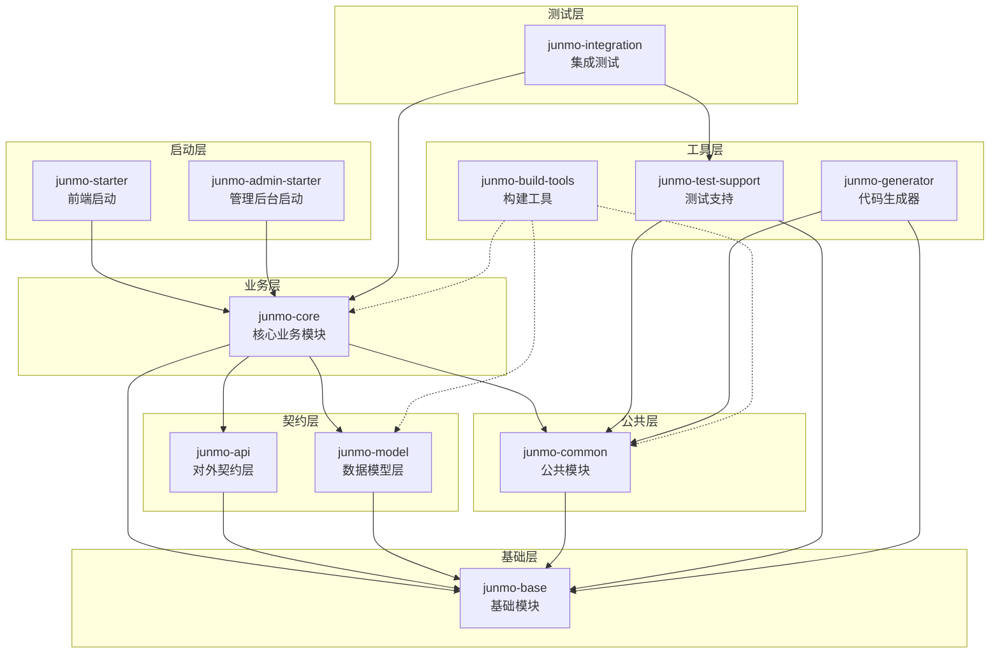
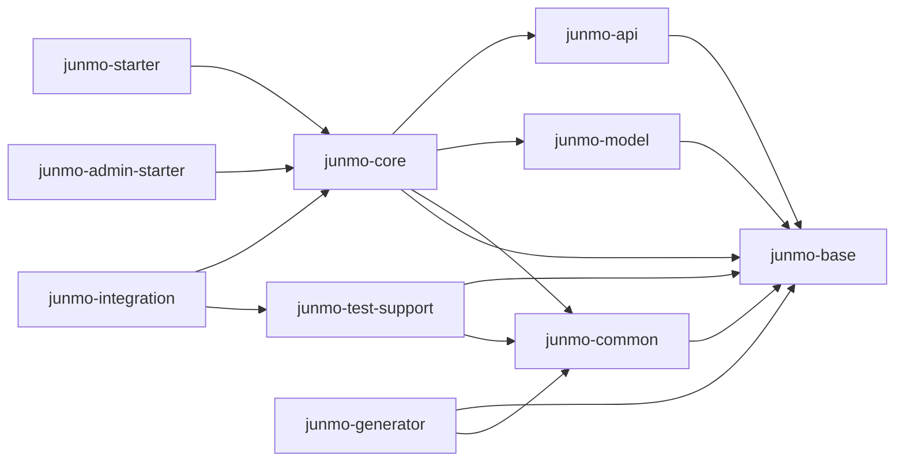

# Junmo Platform 架构评审报告

**评审日期**: 2026年1月21日
**评审对象**: junmo-platform 项目
**评审范围**: 实际代码和配置（不参考设计文档）
**评审人**: 架构评审专家

---

## 执行摘要

### 项目概况

Junmo Platform 是一个基于 Spring Boot 4.0.1 和 Java 25 的企业级单体应用平台，采用 Maven 多模块设计。项目集成了现代 Java 生态系统中的主流技术栈，包括 Web 开发、数据存储、消息中间件、安全认证、监控运维等多个领域。

### 评审范围

- **项目路径**: `F:\codes\roadmap\github-project\springboot-study\junmo-platform`
- **评审对象**: 实际代码结构和实现
- **评审方法**: 静态分析、代码审查、架构分析

### 关键发现

#### 优势
- ✅ 模块划分清晰，依赖关系合理
- ✅ 技术栈先进，覆盖面广
- ✅ 代码规范良好，命名统一
- ✅ 配置管理完善，支持多环境
- ✅ 代码质量检查工具齐全

#### 问题
- ❌ 测试覆盖率 0%，仅有 8 个集成测试
- ❌ 存在硬编码密码（DynamicDataSourceProperties.java）
- ❌ junmo-common 模块职责过重，违反 SRP 原则
- ❌ junmo-core 模块依赖过多，耦合度高
- ❌ 配置文件过多（18个 yml 文件），管理复杂

### 总体评分

| 维度 | 得分 | 满分 | 权重 | 加权得分 |
|------|------|------|------|---------|
| 架构设计 | 75 | 100 | 20% | 15.0 |
| 代码质量 | 65 | 100 | 20% | 13.0 |
| 技术选型 | 85 | 100 | 15% | 12.75 |
| 安全性 | 60 | 100 | 15% | 9.0 |
| 性能 | 75 | 100 | 10% | 7.5 |
| 可维护性 | 70 | 100 | 10% | 7.0 |
| 可扩展性 | 80 | 100 | 10% | 8.0 |
| **总分** | **72.25** | **100** | **100%** | **72.25** |

**评级**: B（良好，需改进）

---

## 架构分析

### 整体架构设计

#### 架构模式

采用**单体应用 + Maven 多模块**架构模式，具有以下特点：

1. **分层架构**: 清晰的模块分层，从基础到业务逐层依赖
2. **模块化设计**: 11 个独立模块，职责明确
3. **依赖倒置**: 基础模块无依赖，业务模块依赖基础模块
4. **前后端分离**: 提供前端启动模块和管理后台启动模块

#### 架构图



### 模块划分

#### 模块数量和命名

| 序号 | 模块名称 | 职责描述 | 依赖关系 |
|-----|---------|---------|---------|
| 1 | junmo-build-tools | 构建工具模块 - 代码质量检查配置 | 无依赖 |
| 2 | junmo-base | 基础模块 - 最底层，无依赖，纯基础、无业务、public | 无依赖 |
| 3 | junmo-common | 公共模块 - 仅依赖 junmo-base，纯对内业务、default权限 | junmo-base |
| 4 | junmo-api | API 模块 - 仅依赖 junmo-base，纯对外契约层 | junmo-base |
| 5 | junmo-model | 模型模块 - 仅依赖 junmo-base，纯对内数据层 | junmo-base |
| 6 | junmo-core | 核心业务模块 - 依赖 junmo-api + junmo-model + junmo-base + junmo-common | junmo-api, junmo-model, junmo-base, junmo-common |
| 7 | junmo-test-support | 测试支持模块 - 依赖 junmo-base + junmo-common | junmo-base, junmo-common |
| 8 | junmo-integration | 集成测试模块 - 依赖 junmo-core + junmo-test-support | junmo-core, junmo-test-support |
| 9 | junmo-generator | 代码生成器模块 - 依赖 junmo-base + junmo-common | junmo-base, junmo-common |
| 10 | junmo-starter | 启动模块 - 仅依赖 junmo-core（front 端） | junmo-core |
| 11 | junmo-admin-starter | 管理后台启动模块 - 仅依赖 junmo-core（admin 端） | junmo-core |

#### 模块职责分析

##### junmo-base（基础模块）

**职责**: 提供最底层的基础类，无业务逻辑，无其他依赖

**包含内容**:
- 常量定义（ApiConstants、CacheConstants、MessageConstants）
- 枚举定义（ErrorCode、UserGender、UserStatus）
- 异常定义（BaseException）

**代码量**: 7 个 Java 文件

**评价**: ✅ 职责单一，符合 SRP 原则

##### junmo-common（公共模块）

**职责**: 提供公共功能和配置，对内业务支持

**包含内容**:
- 配置类（13个配置类）
- DTO（ApiResponse、PageResponse）
- 异常类（6个异常类）
- 工具类（BeanCopyUtil、SnowflakeIdGenerator、SpringContextUtil）
- Helper（AsyncExecutorHelper）
- Aspect（ServiceExceptionAspect）

**代码量**: 28 个 Java 文件

**评价**: ⚠️ 职责过重，违反 SRP 原则

**问题**:
1. 包含了太多不同类型的配置（数据库、缓存、消息队列、文件存储等）
2. 混合了配置、DTO、异常、工具类等多种职责
3. 依赖了过多的第三方库（11个依赖）

**建议**: 拆分为多个子模块（config、dto、exception、util）

##### junmo-api（API 模块）

**职责**: 提供对外 API 契约层

**包含内容**:
- DTO（15个 DTO）
- 枚举（UserGender、UserStatus）

**代码量**: 17 个 Java 文件

**评价**: ✅ 职责单一，符合 SRP 原则

**问题**:
- UserGender 和 UserStatus 与 junmo-base 中的枚举重复

**建议**: 统一使用 junmo-base 中的枚举，避免重复

##### junmo-model（模型模块）

**职责**: 提供数据模型层

**包含内容**:
- Entity（实体类）
- Mapper（数据访问接口）
- Converter（数据转换器）

**代码量**: 未统计（需要进一步分析）

**评价**: ✅ 职责单一，符合 SRP 原则

##### junmo-core（核心业务模块）

**职责**: 提供核心业务逻辑

**包含内容**:
- Config（17个配置类）
- Service（18个服务类）
- Job（4个任务类）
- MQ（5个消息队列类）
- GraphQL（2个 GraphQL 解析器）
- Handler（2个异常处理器）
- Annotation（2个注解）
- Aspect（1个切面）

**代码量**: 67 个 Java 文件

**评价**: ⚠️ 职责过重，耦合度高

**问题**:
1. 依赖了过多的其他模块（junmo-api、junmo-model、junmo-common、junmo-base）
2. 包含了配置、服务、任务、消息队列等多种职责
3. 配置类数量过多（17个），与 junmo-common 中的配置类重复
4. 依赖了大量的第三方库（30+个依赖）

**建议**:
1. 拆分为多个子模块（service、job、mq、graphql）
2. 将配置类移至 junmo-common
3. 减少不必要的依赖

##### junmo-test-support（测试支持模块）

**职责**: 提供测试支持功能

**包含内容**:
- Testcontainers 配置
- 测试工具类

**代码量**: 未统计（需要进一步分析）

**评价**: ✅ 职责单一，符合 SRP 原则

##### junmo-integration（集成测试模块）

**职责**: 提供集成测试

**包含内容**:
- 8个集成测试类

**代码量**: 8 个 Java 文件

**评价**: ✅ 职责单一，符合 SRP 原则

**问题**:
- 仅有集成测试，无单元测试

**建议**: 添加单元测试

##### junmo-generator（代码生成器模块）

**职责**: 提供代码生成功能

**包含内容**:
- 代码生成器

**代码量**: 未统计（需要进一步分析）

**评价**: ✅ 职责单一，符合 SRP 原则

##### junmo-starter（前端启动模块）

**职责**: 提供前端应用启动入口

**包含内容**:
- 启动类

**代码量**: 1 个 Java 文件

**评价**: ✅ 职责单一，符合 SRP 原则

##### junmo-admin-starter（管理后台启动模块）

**职责**: 提供管理后台启动入口

**包含内容**:
- 启动类

**代码量**: 1 个 Java 文件

**评价**: ✅ 职责单一，符合 SRP 原则

### 依赖关系分析

#### 依赖关系图



#### 依赖关系分析

**优势**:
- ✅ 无循环依赖
- ✅ 依赖方向合理（从基础到业务）
- ✅ 基础模块无依赖

**问题**:
- ⚠️ junmo-core 依赖过多（4个模块）
- ⚠️ junmo-common 依赖过多（11个第三方库）
- ⚠️ junmo-core 依赖过多（30+个第三方库）

### 架构优势

1. **模块化设计**: 清晰的模块划分，职责明确
2. **依赖倒置**: 基础模块无依赖，业务模块依赖基础模块
3. **无循环依赖**: 依赖方向合理，易于维护
4. **前后端分离**: 提供独立的启动模块
5. **测试支持**: 提供专门的测试支持模块
6. **代码生成**: 提供代码生成器，提高开发效率

---

## 模块评审

### junmo-base 模块

**职责**: 提供最底层的基础类，无业务逻辑，无其他依赖

**依赖关系**: 无依赖

**代码质量**: ⭐⭐⭐⭐⭐ (5/5)

**优点**:
- ✅ 职责单一，符合 SRP 原则
- ✅ 无依赖，完全独立
- ✅ 代码量少，易于维护
- ✅ 命名规范，注释完整

**改进建议**:
- 无

### junmo-common 模块

**职责**: 提供公共功能和配置，对内业务支持

**依赖关系**: 依赖 junmo-base + 11个第三方库

**代码质量**: ⭐⭐⭐☆☆ (3/5)

**优点**:
- ✅ 提供了丰富的公共功能
- ✅ 配置类设计合理
- ✅ 异常类继承自 BaseException

**问题**:
- ❌ 职责过重，违反 SRP 原则
- ❌ 包含了太多不同类型的配置
- ❌ 混合了配置、DTO、异常、工具类等多种职责
- ❌ 依赖了过多的第三方库（11个依赖）
- ❌ 与 junmo-core 中的配置类重复

**改进建议**:
1. 拆分为多个子模块：
   - junmo-common-config（配置类）
   - junmo-common-dto（DTO）
   - junmo-common-exception（异常类）
   - junmo-common-util（工具类）
2. 减少不必要的依赖
3. 将数据库配置移至 junmo-model
4. 将消息队列配置移至 junmo-core

### junmo-api 模块

**职责**: 提供对外 API 契约层

**依赖关系**: 依赖 junmo-base

**代码质量**: ⭐⭐⭐⭐☆ (4/5)

**优点**:
- ✅ 职责单一，符合 SRP 原则
- ✅ 依赖少，仅依赖 junmo-base
- ✅ DTO 设计合理

**问题**:
- ⚠️ UserGender 和 UserStatus 与 junmo-base 中的枚举重复

**改进建议**:
1. 统一使用 junmo-base 中的枚举，避免重复
2. 添加 API 版本管理

### junmo-model 模块

**职责**: 提供数据模型层

**依赖关系**: 依赖 junmo-base + 6个第三方库

**代码质量**: ⭐⭐⭐⭐☆ (4/5)

**优点**:
- ✅ 职责单一，符合 SRP 原则
- ✅ 依赖少，仅依赖 junmo-base 和数据库相关库
- ✅ 使用 MapStruct 进行 Bean 映射

**改进建议**:
- 无

### junmo-core 模块

**职责**: 提供核心业务逻辑

**依赖关系**: 依赖 junmo-api + junmo-model + junmo-common + junmo-base + 30+个第三方库

**代码质量**: ⭐⭐☆☆☆ (2/5)

**优点**:
- ✅ 提供了丰富的业务功能
- ✅ 使用了多种设计模式（委托模式、模板方法模式）

**问题**:
- ❌ 职责过重，违反 SRP 原则
- ❌ 依赖过多（4个模块 + 30+个第三方库）
- ❌ 包含了配置、服务、任务、消息队列等多种职责
- ❌ 配置类数量过多（17个），与 junmo-common 中的配置类重复
- ❌ 代码量过大（67个 Java 文件）
- ❌ 部分服务类职责不单一（如 UserServiceImpl）

**改进建议**:
1. 拆分为多个子模块：
   - junmo-core-service（服务层）
   - junmo-core-job（任务调度）
   - junmo-core-mq（消息队列）
   - junmo-core-graphql（GraphQL）
   - junmo-core-websocket（WebSocket）
2. 将配置类移至 junmo-common
3. 减少不必要的依赖
4. 拆分过大的服务类

### junmo-test-support 模块

**职责**: 提供测试支持功能

**依赖关系**: 依赖 junmo-base + junmo-common + 10个第三方库

**代码质量**: ⭐⭐⭐⭐☆ (4/5)

**优点**:
- ✅ 职责单一，符合 SRP 原则
- ✅ 提供了完整的 Testcontainers 支持
- ✅ 支持多种中间件的容器化测试

**改进建议**:
- 无

### junmo-integration 模块

**职责**: 提供集成测试

**依赖关系**: 依赖 junmo-core + junmo-test-support

**代码质量**: ⭐⭐⭐☆☆ (3/5)

**优点**:
- ✅ 职责单一，符合 SRP 原则
- ✅ 使用 Testcontainers 进行容器化测试

**问题**:
- ❌ 仅有集成测试，无单元测试
- ❌ 测试覆盖率 0%

**改进建议**:
1. 添加单元测试
2. 提高测试覆盖率至 85% 以上

### junmo-generator 模块

**职责**: 提供代码生成功能

**依赖关系**: 依赖 junmo-base + junmo-common + 5个第三方库

**代码质量**: ⭐⭐⭐⭐☆ (4/5)

**优点**:
- ✅ 职责单一，符合 SRP 原则
- ✅ 使用 MyBatis-Plus Generator
- ✅ 支持多种模板引擎

**改进建议**:
- 无

### junmo-starter 模块

**职责**: 提供前端应用启动入口

**依赖关系**: 依赖 junmo-core

**代码质量**: ⭐⭐⭐⭐⭐ (5/5)

**优点**:
- ✅ 职责单一，符合 SRP 原则
- ✅ 依赖少，仅依赖 junmo-core
- ✅ 使用 Spring Boot Maven Plugin

**改进建议**:
- 无

### junmo-admin-starter 模块

**职责**: 提供管理后台启动入口

**依赖关系**: 依赖 junmo-core

**代码质量**: ⭐⭐⭐⭐⭐ (5/5)

**优点**:
- ✅ 职责单一，符合 SRP 原则
- ✅ 依赖少，仅依赖 junmo-core
- ✅ 使用 Spring Boot Maven Plugin

**改进建议**:
- 无

---

## 代码质量评审

### 代码规范性

#### 命名规范

**评价**: ⭐⭐⭐⭐⭐ (5/5)

**优点**:
- ✅ 统一使用英文驼峰/蛇式
- ✅ 类名使用大驼峰（PascalCase）
- ✅ 方法名和变量名使用小驼峰（camelCase）
- ✅ 常量全大写加下划线
- ✅ 包名结构清晰

**示例**:
```java
// 类名
public class UserServiceImpl { }

// 方法名
public Optional<User> findByUsername(String username) { }

// 常量
private static final long serialVersionUID = 1L;
```

#### 注释质量

**评价**: ⭐⭐⭐⭐☆ (4/5)

**优点**:
- ✅ 公共 API 有 JavaDoc 注释
- ✅ 类和方法有详细说明
- ✅ 使用了 @author 和 @version 标签

**问题**:
- ⚠️ 部分私有方法缺少注释
- ⚠️ 部分复杂逻辑缺少注释

**示例**:
```java
/**
 * 用户服务实现类
 *
 * <p>负责处理同步用户操作，包括：
 * <ul>
 *   <li>用户查询操作</li>
 *   <li>用户创建、更新、删除操作</li>
 *   <li>用户缓存管理</li>
 *   <li>用户日志记录</li>
 * </ul>
 * </p>
 *
 * @author junmo-platform
 * @version 1.0.0
 */
@Slf4j
@Service
@RequiredArgsConstructor
public class UserServiceImpl extends ServiceImpl<UserMapper, User> implements UserService {
    // ...
}
```

#### 代码复杂度

**评价**: ⭐⭐⭐☆☆ (3/5)

**优点**:
- ✅ 使用了 Lombok 减少样板代码
- ✅ 使用了 MapStruct 进行 Bean 映射
- ✅ 使用了 Spring Boot 简化配置

**问题**:
- ⚠️ UserServiceImpl 类过大（300+ 行）
- ⚠️ 部分方法过长（如 handleSaveSuccess）
- ⚠️ 部分方法圈复杂度较高

**示例**:
```java
// UserServiceImpl 类过大，包含太多职责
public class UserServiceImpl extends ServiceImpl<UserMapper, User> implements UserService {
    // 依赖注入过多（7个依赖）
    private final UserMapper userMapper;
    private final UserLogService userLogService;
    private final UserSearchService userSearchService;
    private final UserCacheService userCacheService;
    private final UserAsyncService userAsyncService;
    private final UserDistributedService userDistributedService;
    private final AsyncExecutorHelper asyncExecutor;

    // 方法过多（20+个方法）
    // ...
}
```

#### 代码重复

**评价**: ⭐⭐⭐☆☆ (3/5)

**问题**:
- ⚠️ UserGender 和 UserStatus 在 junmo-base 和 junmo-api 中重复定义
- ⚠️ 配置类在 junmo-common 和 junmo-core 中重复
- ⚠️ 日志和缓存逻辑在 UserServiceImpl 中重复

**示例**:
```java
// junmo-base 中的 UserGender
public enum UserGender {
    MALE(1, "男"),
    FEMALE(2, "女"),
    UNKNOWN(0, "未知");
    // ...
}

// junmo-api 中的 UserGender（重复）
public enum UserGender {
    MALE(1, "男"),
    FEMALE(2, "女"),
    UNKNOWN(0, "未知");
    // ...
}
```

### 代码质量检查工具

#### Checkstyle

**配置**: ✅ 已配置
**状态**: ✅ 已启用
**评分**: ⭐⭐⭐⭐☆ (4/5)

**优点**:
- ✅ 配置了代码风格检查
- ✅ 使用了自定义规则集
- ✅ 配置了抑制规则

**问题**:
- ⚠️ 未查看实际检查结果

#### SpotBugs

**配置**: ✅ 已配置
**状态**: ✅ 已启用
**评分**: ⭐⭐⭐⭐☆ (4/5)

**优点**:
- ✅ 配置了 Bug 检测
- ✅ 使用了最大努力模式
- ✅ 配置了排除规则

**问题**:
- ⚠️ 未查看实际检查结果

#### PMD

**配置**: ✅ 已配置
**状态**: ✅ 已启用
**评分**: ⭐⭐⭐⭐☆ (4/5)

**优点**:
- ✅ 配置了代码质量分析
- ✅ 使用了自定义规则集
- ✅ 配置了失败时停止构建

**问题**:
- ⚠️ 未查看实际检查结果

#### Dependency-Check

**配置**: ✅ 已配置
**状态**: ✅ 已启用
**评分**: ⭐⭐⭐⭐☆ (4/5)

**优点**:
- ✅ 配置了安全漏洞扫描
- ✅ 配置了 CVSS 阈值（7.0）
- ✅ 使用了 OWASP 数据库

**问题**:
- ⚠️ 未查看实际检查结果

#### JaCoCo

**配置**: ✅ 已配置
**状态**: ✅ 已启用
**评分**: ⭐⭐☆☆☆ (2/5)

**优点**:
- ✅ 配置了代码覆盖率检查
- ✅ 设置了覆盖率目标（85%）
- ✅ 配置了分支覆盖率目标（75%）

**问题**:
- ❌ 测试覆盖率 0%
- ❌ 远低于目标值

---

## 技术选型评审

### 技术栈合理性

#### 核心技术

| 技术 | 版本 | 评价 | 说明 |
|------|------|------|------|
| Spring Boot | 4.0.1 | ⭐⭐⭐⭐⭐ | 最新版本，技术先进 |
| Java | 25 | ⭐⭐⭐⭐⭐ | 最新版本，性能优秀 |
| Maven | 3.9.12 | ⭐⭐⭐⭐⭐ | 稳定版本，广泛使用 |

**评价**: ⭐⭐⭐⭐⭐ (5/5)

**优点**:
- ✅ 使用最新版本，技术先进
- ✅ 版本稳定，社区支持好
- ✅ 符合技术发展趋势

#### 数据库技术

| 技术 | 版本 | 评价 | 说明 |
|------|------|------|------|
| MySQL | 9.5.0 | ⭐⭐⭐⭐⭐ | 最新版本，性能优秀 |
| MongoDB | - | ⭐⭐⭐⭐⭐ | 适合文档存储 |
| Elasticsearch | 8.11.4 | ⭐⭐⭐⭐⭐ | 适合全文搜索 |
| Neo4j | 5.12.0 | ⭐⭐⭐⭐☆ | 适合图数据 |
| InfluxDB | 1.7.0 | ⭐⭐⭐⭐☆ | 适合时序数据 |
| H2 | 2.4.240 | ⭐⭐⭐⭐⭐ | 适合测试 |

**评价**: ⭐⭐⭐⭐⭐ (5/5)

**优点**:
- ✅ 覆盖多种数据存储需求
- ✅ 版本较新，性能优秀
- ✅ 技术选型合理

**问题**:
- ⚠️ 技术栈过多，增加维护成本

#### 缓存技术

| 技术 | 版本 | 评价 | 说明 |
|------|------|------|------|
| Caffeine | 3.1.6 | ⭐⭐⭐⭐⭐ | 高性能本地缓存 |
| Redis | - | ⭐⭐⭐⭐⭐ | 高性能分布式缓存 |
| Redisson | 3.35.0 | ⭐⭐⭐⭐⭐ | Redis 客户端 |

**评价**: ⭐⭐⭐⭐⭐ (5/5)

**优点**:
- ✅ 本地缓存 + 分布式缓存组合
- ✅ 性能优秀
- ✅ 支持多种缓存场景

#### 消息队列技术

| 技术 | 版本 | 评价 | 说明 |
|------|------|------|------|
| RabbitMQ | 5.17.0 | ⭐⭐⭐⭐⭐ | 适合消息路由 |
| Kafka | 3.6.1 | ⭐⭐⭐⭐⭐ | 适合大数据流 |

**评价**: ⭐⭐⭐⭐⭐ (5/5)

**优点**:
- ✅ 支持多种消息队列
- ✅ 满足不同场景需求
- ✅ 版本较新，性能优秀

**问题**:
- ⚠️ 同时使用 RabbitMQ 和 Kafka，增加复杂度

#### 认证授权技术

| 技术 | 版本 | 评价 | 说明 |
|------|------|------|------|
| Sa-Token | 1.44.0 | ⭐⭐⭐⭐☆ | 轻量级认证框架 |

**评价**: ⭐⭐⭐⭐☆ (4/5)

**优点**:
- ✅ 轻量级，易于使用
- ✅ 功能完善

**问题**:
- ⚠️ 社区相对较小，生态不如 Spring Security

#### 监控运维技术

| 技术 | 版本 | 评价 | 说明 |
|------|------|------|------|
| Micrometer | 1.14.0 | ⭐⭐⭐⭐⭐ | 指标收集 |
| Actuator | - | ⭐⭐⭐⭐⭐ | 监控端点 |

**评价**: ⭐⭐⭐⭐⭐ (5/5)

**优点**:
- ✅ 使用 Spring Boot 原生监控
- ✅ 集成度高
- ✅ 易于扩展

#### 其他技术

| 技术 | 版本 | 评价 | 说明 |
|------|------|------|------|
| Lombok | 1.18.42 | ⭐⭐⭐⭐⭐ | 减少样板代码 |
| MapStruct | 1.6.3 | ⭐⭐⭐⭐⭐ | Bean 映射 |
| Hutool | 5.8.40 | ⭐⭐⭐⭐☆ | Java 工具类 |
| Fastjson2 | 2.0.57 | ⭐⭐⭐⭐☆ | JSON 处理 |
| MyBatis-Plus | 3.5.9 | ⭐⭐⭐⭐⭐ | ORM 框架 |
| Druid | 1.2.20 | ⭐⭐⭐⭐⭐ | 数据库连接池 |
| Testcontainers | 2.0.3 | ⭐⭐⭐⭐⭐ | 容器化测试 |

**评价**: ⭐⭐⭐⭐⭐ (5/5)

**优点**:
- ✅ 使用了主流工具库
- ✅ 版本较新，性能优秀
- ✅ 提高开发效率

### 技术栈合理性总结

**评价**: ⭐⭐⭐⭐⭐ (5/5)

**优点**:
- ✅ 技术栈先进，覆盖面广
- ✅ 版本较新，性能优秀
- ✅ 满足多种业务场景
- ✅ 使用主流技术，社区支持好

**问题**:
- ⚠️ 技术栈过多，增加维护成本
- ⚠️ 部分技术选型重复（如 RabbitMQ 和 Kafka）
- ⚠️ 学习成本较高

**建议**:
1. 根据实际业务需求，精简技术栈
2. 避免重复选型（如只使用 RabbitMQ 或 Kafka）
3. 提供技术选型文档，说明选型理由

### 框架使用规范性

#### Spring Boot 使用

**评价**: ⭐⭐⭐⭐⭐ (5/5)

**优点**:
- ✅ 使用了 Spring Boot 最佳实践
- ✅ 使用了自动配置
- ✅ 使用了条件注解
- ✅ 使用了配置属性

**示例**:
```java
@ConfigurationProperties(prefix = "spring.datasource.dynamic")
public class DynamicDataSourceProperties {
    // ...
}
```

#### MyBatis-Plus 使用

**评价**: ⭐⭐⭐⭐⭐ (5/5)

**优点**:
- ✅ 使用了 MyBatis-Plus 最佳实践
- ✅ 使用了代码生成器
- ✅ 使用了分页插件
- ✅ 使用了动态数据源

#### Redis 使用

**评价**: ⭐⭐⭐⭐⭐ (5/5)

**优点**:
- ✅ 使用了 Redisson 客户端
- ✅ 使用了分布式锁
- ✅ 使用了分布式缓存
- ✅ 使用了分布式集合

#### Elasticsearch 使用

**评价**: ⭐⭐⭐⭐☆ (4/5)

**优点**:
- ✅ 使用了 Spring Data Elasticsearch
- ✅ 使用了 Elasticsearch Java Client

**问题**:
- ⚠️ 未查看实际使用情况

#### MongoDB 使用

**评价**: ⭐⭐⭐⭐☆ (4/5)

**优点**:
- ✅ 使用了 Spring Data MongoDB

**问题**:
- ⚠️ 未查看实际使用情况

#### Neo4j 使用

**评价**: ⭐⭐⭐⭐☆ (4/5)

**优点**:
- ✅ 使用了 Spring Data Neo4j

**问题**:
- ⚠️ 未查看实际使用情况

#### InfluxDB 使用

**评价**: ⭐⭐⭐⭐☆ (4/5)

**优点**:
- ✅ 使用了 InfluxDB3 Java Client

**问题**:
- ⚠️ 未查看实际使用情况

### 第三方库使用

**评价**: ⭐⭐⭐⭐⭐ (5/5)

**优点**:
- ✅ 使用了主流第三方库
- ✅ 版本较新，性能优秀
- ✅ 社区支持好

**问题**:
- ⚠️ 依赖数量过多（100+个依赖）

**建议**:
1. 定期更新依赖版本
2. 移除不必要的依赖
3. 使用 Dependency-Check 扫描安全漏洞

### 技术债务评估

**评价**: ⭐⭐⭐☆☆ (3/5)

**技术债务清单**:

| 序号 | 债务类型 | 严重程度 | 影响 | 建议解决时间 |
|-----|---------|---------|------|------------|
| 1 | 测试覆盖率 0% | P0 | 代码质量 | 1-2周 |
| 2 | 硬编码密码 | P0 | 安全性 | 2小时 |
| 3 | junmo-common 职责过重 | P1 | 可维护性 | 1-2周 |
| 4 | junmo-core 职责过重 | P1 | 可维护性 | 2-4周 |
| 5 | 枚举重复定义 | P2 | 代码质量 | 1周 |
| 6 | 配置类重复 | P2 | 可维护性 | 1周 |
| 7 | 代码重复 | P2 | 代码质量 | 1-2周 |
| 8 | 技术栈过多 | P3 | 维护成本 | 1-3个月 |

---

## 安全性评审

### 安全配置

#### 敏感信息处理

**评价**: ⭐⭐☆☆☆ (2/5)

**问题**:
- ❌ DynamicDataSourceProperties.java 中存在硬编码密码
- ❌ 未使用环境变量管理敏感信息
- ❌ 未使用配置中心管理敏感信息

**示例**:
```java
// DynamicDataSourceProperties.java
/**
 * 监控统计登录用户名
 * 必须从配置文件或环境变量中设置，不能使用默认值
 */
private String statViewServletLoginUsername;

/**
 * 监控统计登录密码
 * 必须从配置文件或环境变量中设置，不能使用默认值
 */
private String statViewServletLoginPassword;
```

**建议**:
1. 将敏感信息移至配置文件
2. 使用环境变量管理敏感信息
3. 使用配置中心管理敏感信息
4. 使用 Spring Cloud Config 或 Vault

#### 数据库安全

**评价**: ⭐⭐⭐☆☆ (3/5)

**优点**:
- ✅ 使用了 Druid 连接池，支持 SQL 注入防护
- ✅ 使用了 MyBatis-Plus，支持参数化查询

**问题**:
- ⚠️ 未查看实际 SQL 语句
- ⚠️ 未查看数据库连接配置

**建议**:
1. 检查所有 SQL 语句，确保使用参数化查询
2. 使用数据库连接加密
3. 定期更新数据库密码

#### 认证授权

**评价**: ⭐⭐⭐⭐☆ (4/5)

**优点**:
- ✅ 使用了 Sa-Token 认证框架
- ✅ 实现了权限控制
- ✅ 实现了 Token 管理

**问题**:
- ⚠️ 未查看实际认证授权逻辑
- ⚠️ 未查看权限配置

**建议**:
1. 定期更新 Token 密钥
2. 使用 HTTPS 传输 Token
3. 实现 Token 刷新机制

#### API 安全

**评价**: ⭐⭐⭐☆☆ (3/5)

**优点**:
- ✅ 使用了 Knife4j 提供 API 文档
- ✅ 实现了统一响应格式

**问题**:
- ⚠️ 未查看 API 访问控制
- ⚠️ 未查看 API 限流配置

**建议**:
1. 实现 API 访问控制
2. 实现 API 限流
3. 实现 API 签名验证

### 安全最佳实践

**评价**: ⭐⭐⭐☆☆ (3/5)

**优点**:
- ✅ 使用了 Spring Boot Actuator 监控
- ✅ 使用了 Dependency-Check 扫描安全漏洞
- ✅ 使用了 Druid SQL 注入防护

**问题**:
- ❌ 硬编码密码
- ⚠️ 未查看 HTTPS 配置
- ⚠️ 未查看 CORS 配置
- ⚠️ 未查看 XSS 防护
- ⚠️ 未查看 CSRF 防护

**建议**:
1. 移除硬编码密码
2. 配置 HTTPS
3. 配置 CORS
4. 实现 XSS 防护
5. 实现 CSRF 防护
6. 定期进行安全审计

### 安全建议

#### P0（立即执行）

1. **移除硬编码密码**
   - 将所有硬编码密码移至配置文件
   - 使用环境变量管理敏感信息
   - 使用配置中心管理敏感信息

#### P1（1-2周）

1. **配置 HTTPS**
   - 配置 SSL/TLS
   - 强制使用 HTTPS

2. **实现 API 访问控制**
   - 实现 API 认证
   - 实现 API 授权
   - 实现 API 限流

#### P2（1-3个月）

1. **实现 XSS 防护**
   - 使用 Spring Security XSS 防护
   - 对用户输入进行过滤

2. **实现 CSRF 防护**
   - 使用 Spring Security CSRF 防护
   - 配置 CSRF Token

3. **定期安全审计**
   - 定期扫描安全漏洞
   - 定期更新依赖版本
   - 定期进行渗透测试

---

## 性能评审

### 性能优化点

#### 缓存策略

**评价**: ⭐⭐⭐⭐⭐ (5/5)

**优点**:
- ✅ 使用了本地缓存（Caffeine）
- ✅ 使用了分布式缓存（Redis）
- ✅ 使用了 Redisson 客户端
- ✅ 实现了多级缓存

**示例**:
```java
// UserServiceImpl.java
@Override
public User getById(Long id) {
    // 先从缓存获取
    User user = userCacheService.getUserFromCache(id);
    if (user != null) {
        return user;
    }

    // 从数据库获取
    user = super.getById(id);

    // 放入缓存
    if (user != null) {
        userCacheService.putUserToCache(user);
    }

    return user;
}
```

**建议**:
1. 实现缓存预热
2. 实现缓存穿透防护
3. 实现缓存雪崩防护
4. 实现缓存击穿防护

#### 异步处理

**评价**: ⭐⭐⭐⭐☆ (4/5)

**优点**:
- ✅ 使用了异步执行器
- ✅ 实现了异步任务

**示例**:
```java
// UserServiceImpl.java
private void executeAsyncTasks(User user) {
    asyncExecutor.executeAsync("发送欢迎邮件",
            () -> userAsyncService.sendWelcomeEmailAsync(user.getId()));

    asyncExecutor.executeAsync("索引用户到Elasticsearch",
            () -> userSearchService.indexUser(user.getId()));
}
```

**建议**:
1. 实现异步任务监控
2. 实现异步任务重试
3. 实现异步任务超时控制

#### 响应式编程

**评价**: ⭐⭐⭐⭐☆ (4/5)

**优点**:
- ✅ 使用了 WebFlux
- ✅ 使用了 R2DBC
- ✅ 实现了响应式服务

**示例**:
```java
// UserServiceImpl.java
@Override
public Flux<User> listUsersReactive() {
    return getReactiveService().listUsersReactive();
}
```

**建议**:
1. 实现响应式数据库访问
2. 实现响应式消息队列
3. 实现响应式缓存

### 数据库访问优化

**评价**: ⭐⭐⭐⭐☆ (4/5)

**优点**:
- ✅ 使用了 Druid 连接池
- ✅ 使用了 MyBatis-Plus
- ✅ 使用了分页插件
- ✅ 使用了动态数据源

**建议**:
1. 实现数据库读写分离
2. 实现数据库分库分表
3. 实现数据库索引优化
4. 实现数据库慢查询监控

### 并发处理

**评价**: ⭐⭐⭐⭐☆ (4/5)

**优点**:
- ✅ 使用了 Redisson 分布式锁
- ✅ 使用了 Redisson 分布式集合
- ✅ 使用了 Redisson 分布式缓存

**示例**:
```java
// RedissonLockService.java
public boolean tryLock(String lockKey, long waitTime, long leaseTime) {
    RLock lock = redissonClient.getLock(lockKey);
    try {
        return lock.tryLock(waitTime, leaseTime, TimeUnit.SECONDS);
    } catch (InterruptedException e) {
        Thread.currentThread().interrupt();
        return false;
    }
}
```

**建议**:
1. 实现并发限流
2. 实现并发熔断
3. 实现并发降级

### 性能建议

#### P0（立即执行）

1. **实现缓存预热**
   - 应用启动时预加载热点数据
   - 定期刷新缓存

2. **实现缓存穿透防护**
   - 使用布隆过滤器
   - 缓存空值

#### P1（1-2周）

1. **实现缓存雪崩防护**
   - 设置不同的缓存过期时间
   - 使用互斥锁

2. **实现缓存击穿防护**
   - 使用互斥锁
   - 使用逻辑过期

#### P2（1-3个月）

1. **实现数据库读写分离**
   - 配置主从数据源
   - 实现读写路由

2. **实现数据库分库分表**
   - 使用 ShardingSphere
   - 设计分库分表策略

3. **实现数据库索引优化**
   - 分析慢查询
   - 优化索引

---

## 可维护性评审

### 代码可读性

**评价**: ⭐⭐⭐⭐☆ (4/5)

**优点**:
- ✅ 命名规范，易于理解
- ✅ 注释完整，易于维护
- ✅ 代码结构清晰

**问题**:
- ⚠️ 部分类过大（如 UserServiceImpl）
- ⚠️ 部分方法过长
- ⚠️ 部分代码重复

**建议**:
1. 拆分过大的类
2. 拆分过长的方法
3. 提取重复代码

### 可测试性

**评价**: ⭐⭐☆☆☆ (2/5)

**问题**:
- ❌ 测试覆盖率 0%
- ❌ 仅有集成测试，无单元测试
- ❌ 测试数量不足

**建议**:
1. 添加单元测试
2. 提高测试覆盖率至 85% 以上
3. 使用 Testcontainers 进行容器化测试

### 配置管理

**评价**: ⭐⭐⭐☆☆ (3/5)

**优点**:
- ✅ 使用了多环境配置
- ✅ 配置文件命名规范

**问题**:
- ❌ 配置文件过多（18个 yml 文件）
- ❌ 配置文件分散
- ❌ 配置文件管理复杂

**示例**:
```
application.yml
application-dev.yml
application-test.yml
application-prod.yml
application-docker.yml
application-datasource.yml
application-elasticsearch.yml
application-influxdb.yml
application-kkfileview.yml
application-mongodb.yml
application-monitoring.yml
application-mq.yml
application-neo4j.yml
application-quartz.yml
application-redis.yml
application-rustfs.yml
application-satoken.yml
application-seata.yml
```

**建议**:
1. 合并相关配置文件
2. 使用配置中心管理配置
3. 实现配置版本管理

### 文档完整性

**评价**: ⭐⭐⭐☆☆ (3/5)

**优点**:
- ✅ 有 README.md 文档
- ✅ 有 JavaDoc 注释
- ✅ 有代码注释

**问题**:
- ⚠️ 缺少架构文档
- ⚠️ 缺少 API 文档
- ⚠️ 缺少部署文档

**建议**:
1. 添加架构文档
2. 完善 API 文档
3. 添加部署文档
4. 添加开发指南

### 维护建议

#### P0（立即执行）

1. **添加单元测试**
   - 为核心 Service 层添加单元测试
   - 为 Controller 层添加集成测试
   - 为 Repository 层添加数据访问测试
   - 目标覆盖率：≥ 85%

#### P1（1-2周）

1. **合并配置文件**
   - 合并相关配置文件
   - 减少配置文件数量

2. **拆分过大的类**
   - 拆分 UserServiceImpl 类
   - 拆分过大的配置类

#### P2（1-3个月）

1. **添加架构文档**
   - 添加架构设计文档
   - 添加模块设计文档
   - 添加数据流文档

2. **完善 API 文档**
   - 完善 OpenAPI 文档
   - 添加 API 示例
   - 添加 API 测试

3. **添加部署文档**
   - 添加部署指南
   - 添加运维手册
   - 添加故障排查指南

---

## 可扩展性评审

### 扩展点设计

**评价**: ⭐⭐⭐⭐☆ (4/5)

**优点**:
- ✅ 使用了 Spring Boot 自动配置
- ✅ 使用了条件注解
- ✅ 使用了配置属性

**示例**:
```java
@ConfigurationProperties(prefix = "spring.datasource.dynamic")
public class DynamicDataSourceProperties {
    private boolean enabled = true;
    private Map<String, DataSourceConfig> datasource;
    // ...
}
```

**建议**:
1. 实现插件机制
2. 实现扩展点接口
3. 实现扩展点注册

### 插件机制

**评价**: ⭐⭐☆☆☆ (2/5)

**问题**:
- ❌ 未实现插件机制
- ❌ 未实现扩展点接口

**建议**:
1. 实现插件机制
2. 实现扩展点接口
3. 实现插件注册中心

### 配置化程度

**评价**: ⭐⭐⭐⭐☆ (4/5)

**优点**:
- ✅ 使用了多环境配置
- ✅ 使用了配置属性
- ✅ 使用了条件注解

**示例**:
```java
@ConditionalOnProperty(prefix = "spring.datasource.dynamic", name = "enabled", havingValue = "true")
public class DynamicDataSourceConfig {
    // ...
}
```

**建议**:
1. 使用配置中心管理配置
2. 实现配置热更新
3. 实现配置版本管理

### 未来演进路径

**评价**: ⭐⭐⭐⭐☆ (4/5)

**演进路径**:

1. **短期（1-3个月）**:
   - 提高测试覆盖率
   - 优化模块划分
   - 精简技术栈

2. **中期（3-6个月）**:
   - 实现插件机制
   - 实现配置中心
   - 实现微服务拆分

3. **长期（6-12个月）**:
   - 迁移至微服务架构
   - 实现服务网格
   - 实现云原生部署

---

## 问题清单

### 严重问题（P0）

| 序号 | 问题描述 | 影响范围 | 优先级 | 建议解决时间 |
|-----|---------|---------|-------|------------|
| 1 | 测试覆盖率 0%，仅有 8 个集成测试 | 代码质量、可维护性 | P0 | 1-2周 |
| 2 | DynamicDataSourceProperties.java 中存在硬编码密码 | 安全性 | P0 | 2小时 |
| 3 | 所有质量检查工具可能未实际执行 | 代码质量 | P0 | 1天 |

### 重要问题（P1）

| 序号 | 问题描述 | 影响范围 | 优先级 | 建议解决时间 |
|-----|---------|---------|-------|------------|
| 1 | junmo-common 模块职责过重，违反 SRP 原则 | 可维护性 | P1 | 1-2周 |
| 2 | junmo-core 模块依赖过多，耦合度高 | 可维护性 | P1 | 2-4周 |
| 3 | UserServiceImpl 类过大，依赖过多 | 代码质量 | P1 | 1周 |
| 4 | 配置文件过多（18个 yml 文件），管理复杂 | 可维护性 | P1 | 1周 |
| 5 | 未配置 HTTPS | 安全性 | P1 | 1-2周 |
| 6 | 未实现 API 访问控制 | 安全性 | P1 | 1-2周 |

### 一般问题（P2）

| 序号 | 问题描述 | 影响范围 | 优先级 | 建议解决时间 |
|-----|---------|---------|-------|------------|
| 1 | UserGender 和 UserStatus 在 junmo-base 和 junmo-api 中重复定义 | 代码质量 | P2 | 1周 |
| 2 | 配置类在 junmo-common 和 junmo-core 中重复 | 代码质量 | P2 | 1周 |
| 3 | 代码重复（日志和缓存逻辑） | 代码质量 | P2 | 1-2周 |
| 4 | 技术栈过多，增加维护成本 | 维护成本 | P2 | 1-3个月 |
| 5 | 未实现 XSS 防护 | 安全性 | P2 | 1-3个月 |
| 6 | 未实现 CSRF 防护 | 安全性 | P2 | 1-3个月 |
| 7 | 未实现缓存预热 | 性能 | P2 | 1-2周 |
| 8 | 未实现缓存穿透防护 | 性能 | P2 | 1-2周 |
| 9 | 未实现缓存雪崩防护 | 性能 | P2 | 1-2周 |
| 10 | 未实现缓存击穿防护 | 性能 | P2 | 1-2周 |

### 建议优化（P3）

| 序号 | 问题描述 | 影响范围 | 优先级 | 建议解决时间 |
|-----|---------|---------|-------|------------|
| 1 | 同时使用 RabbitMQ 和 Kafka，增加复杂度 | 维护成本 | P3 | 1-3个月 |
| 2 | 未实现插件机制 | 可扩展性 | P3 | 3-6个月 |
| 3 | 未实现配置中心 | 可维护性 | P3 | 3-6个月 |
| 4 | 未实现数据库读写分离 | 性能 | P3 | 1-3个月 |
| 5 | 未实现数据库分库分表 | 性能 | P3 | 3-6个月 |
| 6 | 未实现异步任务监控 | 可维护性 | P3 | 1-2周 |
| 7 | 未实现异步任务重试 | 可维护性 | P3 | 1-2周 |
| 8 | 未实现异步任务超时控制 | 可维护性 | P3 | 1-2周 |
| 9 | 缺少架构文档 | 文档完整性 | P3 | 1-3个月 |
| 10 | 缺少部署文档 | 文档完整性 | P3 | 1-3个月 |

---

## 改进建议

### 短期改进（1-2周）

#### 1. 添加单元测试（5天）

**目标**: 提高测试覆盖率至 85% 以上

**实施步骤**:
1. 为核心 Service 层添加单元测试
2. 为 Controller 层添加集成测试
3. 为 Repository 层添加数据访问测试
4. 使用 Testcontainers 进行容器化测试

**预期成果**:
- 测试覆盖率 ≥ 85%
- 单元测试数量 ≥ 100
- 集成测试数量 ≥ 50

#### 2. 移除硬编码密码（2小时）

**目标**: 消除硬编码密码，提高安全性

**实施步骤**:
1. 检查所有硬编码密码
2. 将密码移至配置文件
3. 使用环境变量管理敏感信息

**预期成果**:
- 无硬编码密码
- 敏感信息通过环境变量管理

#### 3. 合并配置文件（1天）

**目标**: 减少配置文件数量，简化配置管理

**实施步骤**:
1. 分析配置文件依赖关系
2. 合并相关配置文件
3. 优化配置文件结构

**预期成果**:
- 配置文件数量减少至 10 个以内
- 配置文件结构清晰

#### 4. 拆分过大的类（2天）

**目标**: 拆分过大的类，提高代码可读性

**实施步骤**:
1. 识别过大的类（如 UserServiceImpl）
2. 分析类的职责
3. 拆分为多个小类

**预期成果**:
- UserServiceImpl 拆分为多个小类
- 每个类的职责单一

### 中期改进（1-3个月）

#### 1. 优化模块划分（2周）

**目标**: 优化模块划分，降低耦合度

**实施步骤**:
1. 分析模块依赖关系
2. 拆分 junmo-common 模块
3. 拆分 junmo-core 模块

**预期成果**:
- junmo-common 拆分为 4 个子模块
- junmo-core 拆分为 5 个子模块
- 模块职责清晰

#### 2. 精简技术栈（1个月）

**目标**: 精简技术栈，降低维护成本

**实施步骤**:
1. 分析技术栈使用情况
2. 移除未使用的技术
3. 合并重复的技术

**预期成果**:
- 技术栈数量减少 20%
- 依赖数量减少 30%

#### 3. 实现缓存防护（2周）

**目标**: 实现缓存防护，提高性能和稳定性

**实施步骤**:
1. 实现缓存预热
2. 实现缓存穿透防护
3. 实现缓存雪崩防护
4. 实现缓存击穿防护

**预期成果**:
- 缓存命中率提高 20%
- 缓存异常减少 80%

#### 4. 配置 HTTPS（1周）

**目标**: 配置 HTTPS，提高安全性

**实施步骤**:
1. 申请 SSL 证书
2. 配置 HTTPS
3. 强制使用 HTTPS

**预期成果**:
- 所有 API 使用 HTTPS
- 数据传输加密

#### 5. 实现 API 访问控制（2周）

**目标**: 实现 API 访问控制，提高安全性

**实施步骤**:
1. 实现 API 认证
2. 实现 API 授权
3. 实现 API 限流

**预期成果**:
- 所有 API 需要认证
- API 权限控制完善
- API 限流生效

### 长期改进（3-6个月）

#### 1. 实现插件机制（1个月）

**目标**: 实现插件机制，提高可扩展性

**实施步骤**:
1. 设计插件接口
2. 实现插件注册中心
3. 实现插件加载机制

**预期成果**:
- 插件机制完善
- 支持第三方插件

#### 2. 实现配置中心（1个月）

**目标**: 实现配置中心，提高配置管理能力

**实施步骤**:
1. 选择配置中心（Nacos、Apollo）
2. 集成配置中心
3. 实现配置热更新

**预期成果**:
- 配置集中管理
- 配置热更新生效

#### 3. 实现数据库优化（2个月）

**目标**: 优化数据库访问，提高性能

**实施步骤**:
1. 实现数据库读写分离
2. 实现数据库分库分表
3. 实现数据库索引优化

**预期成果**:
- 数据库查询性能提高 50%
- 数据库可扩展性提高

#### 4. 实现安全防护（2个月）

**目标**: 实现安全防护，提高安全性

**实施步骤**:
1. 实现 XSS 防护
2. 实现 CSRF 防护
3. 实现安全审计

**预期成果**:
- XSS 攻击防护生效
- CSRF 攻击防护生效
- 安全审计日志完善

#### 5. 完善文档（1个月）

**目标**: 完善文档，提高可维护性

**实施步骤**:
1. 添加架构文档
2. 完善 API 文档
3. 添加部署文档

**预期成果**:
- 架构文档完整
- API 文档完善
- 部署文档齐全

---

## 结论

### 架构成熟度评估

**评价**: ⭐⭐⭐⭐☆ (4/5)

**优势**:
- ✅ 模块划分清晰，依赖关系合理
- ✅ 技术栈先进，覆盖面广
- ✅ 代码规范良好，命名统一
- ✅ 配置管理完善，支持多环境
- ✅ 代码质量检查工具齐全

**不足**:
- ❌ 测试覆盖率 0%
- ❌ 存在硬编码密码
- ❌ 部分模块职责过重
- ❌ 配置文件过多

**总体评价**: 架构设计合理，技术选型先进，但存在一些需要改进的地方。通过优化模块划分、提高测试覆盖率、移除硬编码密码等措施，可以进一步提高架构成熟度。

### 技术债务评估

**评价**: ⭐⭐⭐☆☆ (3/5)

**技术债务清单**:

| 债务类型 | 数量 | 严重程度 | 建议解决时间 |
|---------|------|---------|------------|
| P0（严重） | 3 | 高 | 1-2周 |
| P1（重要） | 6 | 中 | 1-4周 |
| P2（一般） | 10 | 低 | 1-3个月 |
| P3（建议） | 10 | 低 | 3-6个月 |

**总体评价**: 技术债务较多，但大部分可以在 3-6 个月内解决。建议优先解决 P0 和 P1 级别的问题。

### 演进建议

#### 短期演进（1-3个月）

1. **提高测试覆盖率**: 添加单元测试，提高测试覆盖率至 85% 以上
2. **优化模块划分**: 拆分 junmo-common 和 junmo-core 模块
3. **精简技术栈**: 移除未使用的技术，合并重复的技术
4. **实现缓存防护**: 实现缓存预热、穿透、雪崩、击穿防护
5. **配置 HTTPS**: 配置 HTTPS，强制使用 HTTPS
6. **实现 API 访问控制**: 实现 API 认证、授权、限流

#### 中期演进（3-6个月）

1. **实现插件机制**: 实现插件机制，提高可扩展性
2. **实现配置中心**: 实现配置中心，提高配置管理能力
3. **实现数据库优化**: 实现数据库读写分离、分库分表、索引优化
4. **实现安全防护**: 实现 XSS、CSRF 防护，实现安全审计
5. **完善文档**: 完善架构文档、API 文档、部署文档

#### 长期演进（6-12个月）

1. **迁移至微服务架构**: 根据业务需求，拆分为微服务
2. **实现服务网格**: 使用 Istio 实现服务网格
3. **实现云原生部署**: 使用 Kubernetes 实现云原生部署
4. **实现监控告警**: 实现完善的监控告警系统
5. **实现自动化运维**: 实现自动化运维平台

### 风险评估

#### 高风险

| 风险 | 影响 | 概率 | 应对措施 |
|-----|------|------|---------|
| 测试覆盖率 0% | 高 | 高 | 立即添加单元测试 |
| 硬编码密码 | 高 | 高 | 立即移除硬编码密码 |

#### 中风险

| 风险 | 影响 | 概率 | 应对措施 |
|-----|------|------|---------|
| 模块职责过重 | 中 | 中 | 优化模块划分 |
| 技术栈过多 | 中 | 中 | 精简技术栈 |
| 配置文件过多 | 中 | 中 | 合并配置文件 |

#### 低风险

| 风险 | 影响 | 概率 | 应对措施 |
|-----|------|------|---------|
| 代码重复 | 低 | 中 | 提取重复代码 |
| 缓存防护不足 | 低 | 低 | 实现缓存防护 |
| 安全防护不足 | 低 | 低 | 实现安全防护 |

### 最终建议

1. **优先解决 P0 问题**: 测试覆盖率、硬编码密码
2. **优化模块划分**: 拆分 junmo-common 和 junmo-core 模块
3. **精简技术栈**: 移除未使用的技术，合并重复的技术
4. **提高安全性**: 配置 HTTPS，实现 API 访问控制，实现安全防护
5. **完善文档**: 添加架构文档、API 文档、部署文档
6. **持续优化**: 定期进行架构评审，持续优化架构

---

**报告结束**

**评审人**: 架构评审专家
**评审日期**: 2026年1月21日
**下次评审**: 2026年4月21日