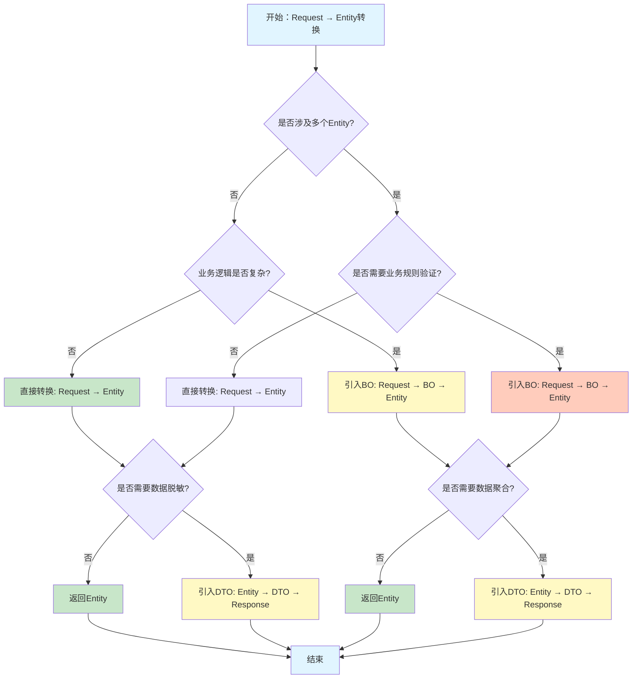

# Request/Entity/DTO/BO 转换策略分析报告

**分析日期**：2026年1月15日
**分析人**：Backend Architect
**项目**：spring4demo
**分析范围**：Spring Boot三层架构数据转换策略

---

## 一、理论分析

### 1.1 BO的定义和职责

#### 1.1.1 BO（Business Object）的概念

**BO（Business Object）** 是业务对象，用于封装业务逻辑和数据，是业务层核心的数据载体。

**核心特征**：
- **业务语义**：包含业务规则和业务逻辑
- **数据聚合**：可以聚合多个Entity的数据
- **业务计算**：包含派生字段和计算属性
- **业务验证**：包含业务规则验证

**与Entity的区别**：

| 维度 | Entity | BO |
|------|--------|-----|
| **职责** | 数据持久化，与数据库表一一对应 | 业务逻辑封装，与业务概念对应 |
| **生命周期** | 由ORM管理，与数据库事务绑定 | 由业务逻辑管理，与业务流程绑定 |
| **数据来源** | 数据库表 | 多个Entity聚合、外部服务调用、计算派生 |
| **验证规则** | 数据完整性约束（主键、外键、非空） | 业务规则验证（状态机、权限、业务约束） |
| **依赖关系** | 可能包含其他Entity作为关联字段 | 可以包含多个Entity、DTO、VO等 |

**与DTO的区别**：

| 维度 | DTO | BO |
|------|-----|-----|
| **职责** | 数据传输，用于层间通信 | 业务逻辑封装，用于业务处理 |
| **位置** | Controller层、API层 | Service层、Domain层 |
| **数据来源** | Request参数、Entity转换 | 多个Entity聚合、业务计算 |
| **验证规则** | 输入验证（格式、长度、非空） | 业务验证（状态、权限、业务约束） |
| **生命周期** | 请求-响应周期 | 业务流程周期 |

#### 1.1.2 BO的核心职责

1. **业务规则封装**
   - 状态机管理
   - 业务约束验证
   - 权限检查
   - 业务规则执行

2. **数据聚合**
   - 聚合多个Entity的数据
   - 整合外部服务数据
   - 计算派生字段

3. **业务计算**
   - 业务指标计算
   - 数据统计汇总
   - 业务规则触发

4. **业务流程协调**
   - 协调多个Entity的操作
   - 管理业务流程状态
   - 触发业务事件

### 1.2 转换层次的必要性

#### 1.2.1 Request → Entity：是否需要中间层？

**直接转换场景**（不需要中间层）：
- 简单CRUD操作
- Request字段与Entity字段一一对应
- 无复杂业务逻辑
- 无数据聚合需求

**示例**：
```java
// UserCommandController.java
@PostMapping
public ResponseEntity<ApiResponse<User>> createUser(
        @Valid @RequestBody UserCreateRequest request) {
    // 直接转换
    User user = buildUserFromRequest(request);
    userService.save(user);
    return ResponseEntity.ok(ApiResponse.success(user));
}

private User buildUserFromRequest(UserCreateRequest request) {
    User user = new User();
    user.setUsername(request.getUsername());
    user.setEmail(request.getEmail());
    user.setPhone(request.getPhone());
    user.setRealName(request.getRealName());
    user.setStatus(request.getStatus() != null ? request.getStatus() : 1);
    return user;
}
```

**需要中间层场景**：
- Request字段与Entity字段不完全对应
- 需要数据验证和转换
- 需要业务规则验证
- 需要数据聚合

#### 1.2.2 Request → BO → Entity：何时需要？

**使用场景**：
1. **多Entity聚合**：业务操作涉及多个Entity
2. **复杂业务逻辑**：需要业务规则验证和计算
3. **业务流程管理**：需要管理业务流程状态
4. **数据转换复杂**：Request到Entity的转换逻辑复杂

**示例场景**：
- 用户注册：需要创建User、UserLog、UserSettings等多个Entity
- 订单创建：需要创建Order、OrderItem、Payment、Inventory等多个Entity
- 审批流程：需要管理流程状态、审批记录、通知等

#### 1.2.3 Request → DTO → Entity：何时需要？

**使用场景**：
1. **数据传输优化**：减少网络传输数据量
2. **数据脱敏**：隐藏敏感字段
3. **数据格式转换**：前后端数据格式不一致
4. **版本兼容**：API版本升级时保持兼容

**注意**：
- DTO主要用于Controller层和API层的数据传输
- 在Service层内部，DTO → Entity的转换应该尽量简单
- 避免在Service层过度使用DTO

#### 1.2.4 多个Entity聚合的场景如何处理？

**场景1：简单聚合（不需要BO）**
```java
// Service层直接操作多个Entity
@Transactional
public void registerUser(UserCreateDTO dto) {
    // 1. 创建用户
    User user = new User();
    user.setUsername(dto.getUsername());
    userService.save(user);

    // 2. 记录日志
    UserLog userLog = new UserLog();
    userLog.setUserId(user.getId());
    userLog.setAction("REGISTER");
    userLogService.save(userLog);
}
```

**场景2：复杂聚合（需要BO）**
```java
// 使用BO封装聚合逻辑
public class UserRegistrationBO {
    private User user;
    private UserLog userLog;
    private UserSettings userSettings;

    // 业务方法
    public void validate() {
        // 业务规则验证
        if (user.getEmail() == null) {
            throw new BusinessException("邮箱不能为空");
        }
    }

    public void execute() {
        // 执行业务流程
        userService.save(user);
        userLogService.save(userLog);
        userSettingsService.save(userSettings);
    }
}

// Service层使用BO
@Transactional
public void registerUser(UserCreateDTO dto) {
    UserRegistrationBO bo = UserRegistrationBO.builder()
        .user(buildUser(dto))
        .userLog(buildUserLog(dto))
        .userSettings(buildUserSettings(dto))
        .build();

    bo.validate();
    bo.execute();
}
```

### 1.3 不同场景的转换策略

#### 1.3.1 简单CRUD场景

**策略**：Request → Entity（直接转换）

**适用条件**：
- 单表操作
- 字段一一对应
- 无复杂业务逻辑
- 无数据验证需求

**代码示例**：
```java
// Controller
@PostMapping
public ResponseEntity<ApiResponse<User>> createUser(
        @Valid @RequestBody UserCreateRequest request) {
    User user = buildUserFromRequest(request);
    userService.save(user);
    return ResponseEntity.ok(ApiResponse.success(user));
}

// Service
public boolean save(User user) {
    return super.save(user);
}
```

**优点**：
- 代码简洁
- 性能高效
- 易于理解

**缺点**：
- 业务逻辑分散
- 难以扩展

#### 1.3.2 复杂业务场景（涉及多个Entity）

**策略**：Request → BO → Entity

**适用条件**：
- 多表操作
- 需要业务规则验证
- 需要数据聚合
- 需要业务流程管理

**代码示例**：
```java
// BO定义
@Data
@Builder
public class OrderCreationBO {
    private Order order;
    private List<OrderItem> orderItems;
    private Payment payment;
    private List<Inventory> inventories;

    // 业务验证
    public void validate() {
        // 库存检查
        for (OrderItem item : orderItems) {
            if (item.getQuantity() > getInventory(item.getProductId())) {
                throw new BusinessException("库存不足");
            }
        }

        // 金额验证
        BigDecimal totalAmount = calculateTotalAmount();
        if (payment.getAmount().compareTo(totalAmount) != 0) {
            throw new BusinessException("支付金额不正确");
        }
    }

    // 业务执行
    @Transactional
    public void execute() {
        // 1. 创建订单
        orderService.save(order);

        // 2. 创建订单项
        orderItems.forEach(item -> {
            item.setOrderId(order.getId());
            orderItemService.save(item);
        });

        // 3. 扣减库存
        inventories.forEach(inv -> {
            inv.setQuantity(inv.getQuantity() - getOrderedQuantity(inv.getProductId()));
            inventoryService.updateById(inv);
        });

        // 4. 创建支付记录
        payment.setOrderId(order.getId());
        paymentService.save(payment);
    }
}

// Service使用BO
@Transactional
public void createOrder(OrderCreateRequest request) {
    OrderCreationBO bo = OrderCreationBO.builder()
        .order(buildOrder(request))
        .orderItems(buildOrderItems(request))
        .payment(buildPayment(request))
        .inventories(getInventories(request))
        .build();

    bo.validate();
    bo.execute();
}
```

**优点**：
- 业务逻辑集中
- 易于测试
- 易于扩展

**缺点**：
- 代码复杂度增加
- 需要额外的BO类

#### 1.3.3 跨服务调用场景

**策略**：Request → BO → DTO → Entity

**适用条件**：
- 跨服务调用
- 需要数据转换
- 需要服务协调

**代码示例**：
```java
// BO定义
@Data
@Builder
public class UserOnboardingBO {
    private User user;
    private UserProfile profile;
    private UserPreferences preferences;
    private NotificationConfig notificationConfig;

    // 调用外部服务
    public void callExternalServices() {
        // 调用用户画像服务
        UserProfileDTO profileDTO = userProfileService.createProfile(
            buildProfileRequest(user)
        );
        this.profile = convertToEntity(profileDTO);

        // 调用通知服务
        NotificationConfigDTO notificationDTO = notificationService.createConfig(
            buildNotificationRequest(user)
        );
        this.notificationConfig = convertToEntity(notificationDTO);
    }

    // 执行业务流程
    @Transactional
    public void execute() {
        userService.save(user);
        userProfileService.save(profile);
        userPreferencesService.save(preferences);
        notificationConfigService.save(notificationConfig);
    }
}
```

#### 1.3.4 数据聚合和计算场景

**策略**：Request → BO → Entity + 派生数据

**适用条件**：
- 需要数据聚合
- 需要计算派生字段
- 需要数据统计

**代码示例**：
```java
// BO定义
@Data
@Builder
public class UserDashboardBO {
    private User user;
    private Long loginCount;
    private Long orderCount;
    private BigDecimal totalAmount;
    private List<Order> recentOrders;
    private List<UserActivity> recentActivities;

    // 计算派生字段
    public void calculateDerivatives() {
        this.loginCount = userLogService.countUserLogins(user.getId());
        this.orderCount = orderService.countUserOrders(user.getId());
        this.totalAmount = orderService.calculateUserTotalAmount(user.getId());
        this.recentOrders = orderService.getRecentOrders(user.getId(), 5);
        this.recentActivities = userActivityService.getRecentActivities(user.getId(), 10);
    }

    // 业务方法
    public UserDashboardVO toVO() {
        return UserDashboardVO.builder()
            .userId(user.getId())
            .username(user.getUsername())
            .avatar(user.getAvatar())
            .loginCount(loginCount)
            .orderCount(orderCount)
            .totalAmount(totalAmount)
            .recentOrders(convertToVO(recentOrders))
            .recentActivities(convertToVO(recentActivities))
            .build();
    }
}

// Service使用BO
public UserDashboardVO getUserDashboard(Long userId) {
    User user = userService.getById(userId);

    UserDashboardBO bo = UserDashboardBO.builder()
        .user(user)
        .build();

    bo.calculateDerivatives();
    return bo.toVO();
}
```

---

## 二、实际案例分析

### 2.1 User模块分析

#### 2.1.1 UserQueryController分析

**文件路径**：`spring4demo-web/src/main/java/com/kev1n/spring4demo/web/controller/UserQueryController.java`

**当前实现**：
```java
@RestController
@RequestMapping("/api/users")
public class UserQueryController {

    @GetMapping
    public ResponseEntity<ApiResponse<Page<User>>> getUsers(
            @ModelAttribute UserQueryRequest request) {
        // 直接使用Entity
        QueryWrapper<User> queryWrapper = buildQueryWrapper(request);
        Page<User> page = new Page<>(request.getCurrent(), request.getSize());
        Page<User> result = userService.page(page, queryWrapper);
        return ResponseEntity.ok(ApiResponse.success(result));
    }

    @GetMapping("/{id}")
    public ResponseEntity<ApiResponse<User>> getUserById(@PathVariable Long id) {
        // 直接返回Entity
        var userOpt = userService.getOptById(id);
        if (userOpt.isPresent()) {
            return ResponseEntity.ok(ApiResponse.success(userOpt.get()));
        } else {
            return ResponseEntity.ok(ApiResponse.error("用户不存在"));
        }
    }
}
```

**场景评估**：

| 场景 | 复杂度 | 是否需要BO | 理由 |
|------|--------|-----------|------|
| 用户列表查询 | 简单 | ❌ 不需要 | 单表查询，无业务逻辑 |
| 用户详情查询 | 简单 | ❌ 不需要 | 单表查询，无业务逻辑 |
| 分页查询 | 简单 | ❌ 不需要 | MyBatis-Plus提供分页支持 |

**结论**：UserQueryController的查询场景简单，不需要引入BO。

#### 2.1.2 UserCommandController分析

**文件路径**：`spring4demo-web/src/main/java/com/kev1n/spring4demo/web/controller/UserCommandController.java`

**当前实现**：
```java
@RestController
@RequestMapping("/api/users")
public class UserCommandController {

    @PostMapping
    public ResponseEntity<ApiResponse<User>> createUser(
            @Valid @RequestBody UserCreateRequest request) {
        // 直接转换Request → Entity
        User user = buildUserFromRequest(request);
        userService.save(user);
        return ResponseEntity.ok(ApiResponse.success(user));
    }

    @PutMapping("/{id}")
    public ResponseEntity<ApiResponse<User>> updateUser(
            @PathVariable Long id,
            @Valid @RequestBody UserUpdateRequest request) {
        // 直接更新Entity
        User user = userService.getById(id);
        updateUserFields(user, request);
        userService.updateById(user);
        return ResponseEntity.ok(ApiResponse.success(user));
    }

    @DeleteMapping("/{id}")
    public ResponseEntity<ApiResponse<Void>> deleteUser(@PathVariable Long id) {
        // 直接删除Entity
        userService.removeById(id);
        return ResponseEntity.ok(ApiResponse.success("用户删除成功", null));
    }
}
```

**场景评估**：

| 场景 | 复杂度 | 是否需要BO | 理由 |
|------|--------|-----------|------|
| 创建用户 | 简单 | ❌ 不需要 | 单表操作，业务逻辑简单 |
| 更新用户 | 简单 | ❌ 不需要 | 单表操作，业务逻辑简单 |
| 删除用户 | 简单 | ❌ 不需要 | 单表操作，业务逻辑简单 |
| 批量删除 | 中等 | ⚠️ 可选 | 涉及多行删除，但业务逻辑简单 |

**结论**：UserCommandController的命令场景简单，不需要引入BO。

#### 2.1.3 UserService分析

**文件路径**：`spring4demo-core/src/main/java/com/kev1n/spring4demo/core/service/UserService.java`

**当前实现**：
```java
public interface UserService extends IService<User> {
    Optional<User> findByUsername(String username);
    User getById(Long id);
    Optional<User> findByEmail(String email);
    boolean existsByUsername(String username);
    boolean existsByEmail(String email);
    List<User> findByStatus(Integer status);
    long countByStatus(Integer status);
    List<User> findRecentActiveUsers();
    void logUserAction(User user, String action, String details, String ipAddress, String userAgent);

    // 响应式方法
    Flux<User> listUsersReactive();
    Mono<User> getUserByIdReactive(Long id);
    // ...

    // 分布式事务方法
    User registerUserDistributed(UserCreateDTO dto);
}
```

**场景评估**：

| 方法 | 复杂度 | 是否需要BO | 理由 |
|------|--------|-----------|------|
| findByUsername | 简单 | ❌ 不需要 | 单表查询 |
| getById | 简单 | ❌ 不需要 | 单表查询 |
| findByEmail | 简单 | ❌ 不需要 | 单表查询 |
| existsByUsername | 简单 | ❌ 不需要 | 单表查询 |
| existsByEmail | 简单 | ❌ 不需要 | 单表查询 |
| findByStatus | 简单 | ❌ 不需要 | 单表查询 |
| countByStatus | 简单 | ❌ 不需要 | 单表查询 |
| findRecentActiveUsers | 简单 | ❌ 不需要 | 单表查询 |
| logUserAction | 中等 | ⚠️ 可选 | 涉及UserLog表，但业务逻辑简单 |
| registerUserDistributed | 复杂 | ✅ 需要 | 涉及User + UserLog，需要分布式事务 |

**结论**：
- 大部分方法简单，不需要BO
- `registerUserDistributed`方法复杂，建议引入BO

### 2.2 多Entity操作分析

#### 2.2.1 UserDistributedService分析

**文件路径**：`spring4demo-core/src/main/java/com/kev1n/spring4demo/core/service/UserDistributedService.java`

**当前实现**：
```java
@Service
public class UserDistributedService {

    @GlobalTransactional(name = "register-user", rollbackFor = Exception.class)
    @Transactional(rollbackFor = Exception.class)
    public User registerUser(UserCreateDTO dto) {
        // 1. 创建用户信息
        User user = new User();
        user.setUsername(dto.getUsername());
        user.setPassword(dto.getPassword());
        user.setEmail(dto.getEmail());
        user.setPhone(dto.getPassword());
        user.setRealName(dto.getRealName());
        user.setStatus(1);
        userService.save(user);

        // 2. 记录用户注册日志
        userLogService.logUserAction(
            user.getId(),
            user.getUsername(),
            "USER_REGISTER",
            String.format("用户注册成功: username=%s, email=%s, phone=%s",
                user.getUsername(), user.getEmail(), user.getPhone()),
            null,
            null
        );

        return user;
    }
}
```

**问题分析**：

1. **业务逻辑分散**：User和UserLog的操作分散在Service层
2. **缺少业务验证**：没有统一的业务规则验证
3. **缺少业务封装**：没有封装业务流程
4. **难以扩展**：如果需要添加更多Entity，需要修改Service方法

**建议引入BO**：

```java
// BO定义
@Data
@Builder
public class UserRegistrationBO {
    private User user;
    private UserLog userLog;

    // 业务验证
    public void validate() {
        // 验证用户名唯一性
        if (userService.existsByUsername(user.getUsername())) {
            throw new BusinessException("用户名已存在");
        }

        // 验证邮箱唯一性
        if (user.getEmail() != null && userService.existsByEmail(user.getEmail())) {
            throw new BusinessException("邮箱已存在");
        }

        // 验证手机号格式
        if (user.getPhone() != null && !isValidPhone(user.getPhone())) {
            throw new BusinessException("手机号格式不正确");
        }
    }

    // 业务执行
    @Transactional
    public void execute() {
        // 1. 创建用户
        userService.save(user);

        // 2. 记录日志
        userLog.setUserId(user.getId());
        userLog.setUsername(user.getUsername());
        userLog.setAction("USER_REGISTER");
        userLog.setDetails(buildRegistrationDetails());
        userLogService.save(userLog);
    }

    private String buildRegistrationDetails() {
        return String.format("用户注册成功: username=%s, email=%s, phone=%s",
            user.getUsername(), user.getEmail(), user.getPhone());
    }
}

// Service使用BO
@GlobalTransactional(name = "register-user", rollbackFor = Exception.class)
@Transactional(rollbackFor = Exception.class)
public User registerUser(UserCreateDTO dto) {
    UserRegistrationBO bo = UserRegistrationBO.builder()
        .user(buildUser(dto))
        .userLog(buildUserLog(dto))
        .build();

    bo.validate();
    bo.execute();

    return bo.getUser();
}
```

**优点**：
- 业务逻辑集中
- 易于测试
- 易于扩展
- 符合单一职责原则

#### 2.2.2 UserMetricsService分析

**文件路径**：`spring4demo-core/src/main/java/com/kev1n/spring4demo/core/service/UserMetricsService.java`

**当前实现**：
```java
@Service
public class UserMetricsService {

    public void recordUserLogin(User user) {
        Point point = Point.measurement("user_login")
            .setTag("userId", user.getId().toString())
            .setTag("username", user.getUsername())
            .setField("email", user.getEmail())
            .setField("phone", user.getPhone())
            .setField("status", user.getStatus())
            .setTimestamp(Instant.now());

        influxDBClient.writePoint(point);
    }

    public long countUserLogins(Long userId, LocalDateTime startTime, LocalDateTime endTime) {
        String sql = String.format(
            "SELECT COUNT(*) AS count FROM user_login " +
            "WHERE time >= '%s' AND time <= '%s' AND userId = '%s'",
            startTime.atZone(ZoneId.systemDefault()).toInstant(),
            endTime.atZone(ZoneId.systemDefault()).toInstant(),
            userId.toString()
        );

        try (Stream<Object[]> stream = influxDBClient.query(sql)) {
            return stream
                .filter(row -> row.length > 0 && row[0] instanceof Number)
                .map(row -> ((Number) row[0]).longValue())
                .findFirst()
                .orElse(0L);
        }
    }
}
```

**场景评估**：

| 方法 | 复杂度 | 是否需要BO | 理由 |
|------|--------|-----------|------|
| recordUserLogin | 简单 | ❌ 不需要 | 单一操作，业务逻辑简单 |
| recordUserOperation | 简单 | ❌ 不需要 | 单一操作，业务逻辑简单 |
| countUserLogins | 中等 | ⚠️ 可选 | 涉及查询和数据转换，但业务逻辑简单 |
| countUserOperations | 中等 | ⚠️ 可选 | 涉及查询和数据转换，但业务逻辑简单 |
| getUserOperationTrend | 复杂 | ✅ 需要 | 涉及聚合查询和数据处理 |
| getActiveUserCount | 复杂 | ✅ 需要 | 涉及聚合查询和数据处理 |

**建议**：
- 简单方法不需要BO
- 复杂的聚合查询方法建议引入BO

**BO示例**：

```java
// BO定义
@Data
@Builder
public class UserActivityAnalysisBO {
    private Long userId;
    private LocalDateTime startTime;
    private LocalDateTime endTime;
    private Long loginCount;
    private Long operationCount;
    private List<OperationTrendResult> operationTrend;
    private List<ActiveUserResult> activeUserCount;

    // 计算分析数据
    public void analyze() {
        this.loginCount = countUserLogins();
        this.operationCount = countUserOperations();
        this.operationTrend = getUserOperationTrend();
        this.activeUserCount = getActiveUserCount();
    }

    // 转换为VO
    public UserActivityAnalysisVO toVO() {
        return UserActivityAnalysisVO.builder()
            .userId(userId)
            .loginCount(loginCount)
            .operationCount(operationCount)
            .operationTrend(operationTrend)
            .activeUserCount(activeUserCount)
            .build();
    }
}

// Service使用BO
public UserActivityAnalysisVO analyzeUserActivity(
        Long userId, LocalDateTime startTime, LocalDateTime endTime) {
    UserActivityAnalysisBO bo = UserActivityAnalysisBO.builder()
        .userId(userId)
        .startTime(startTime)
        .endTime(endTime)
        .build();

    bo.analyze();
    return bo.toVO();
}
```

#### 2.2.3 UserGraphService分析

**文件路径**：`spring4demo-core/src/main/java/com/kev1n/spring4demo/core/service/UserGraphService.java`

**当前实现**：
```java
@Service
public class UserGraphService {

    @Transactional
    public UserNode syncUserToGraph(User user) {
        UserNode userNode = UserNode.builder()
            .id(user.getId())
            .username(user.getUsername())
            .email(user.getEmail())
            .phone(user.getPhone())
            .realName(user.getRealName())
            .status(user.getStatus())
            .createdAt(user.getCreatedAt())
            .updatedAt(user.getUpdatedAt())
            .build();

        return userRepository.save(userNode);
    }
}
```

**场景评估**：

| 方法 | 复杂度 | 是否需要BO | 理由 |
|------|--------|-----------|------|
| syncUserToGraph | 简单 | ❌ 不需要 | 单一Entity转换，业务逻辑简单 |
| batchSyncUsersToGraph | 中等 | ⚠️ 可选 | 涉及批量操作，但业务逻辑简单 |
| getUserNodeById | 简单 | ❌ 不需要 | 单表查询 |
| updateUserNode | 简单 | ❌ 不需要 | 单表更新 |
| deleteUserNode | 简单 | ❌ 不需要 | 单表删除 |

**结论**：UserGraphService的方法简单，不需要引入BO。

### 2.3 复杂业务逻辑分析

#### 2.3.1 SeataService分析

**文件路径**：`spring4demo-core/src/main/java/com/kev1n/spring4demo/core/service/SeataService.java`

**当前实现**：
```java
@Service
public class SeataService {

    @GlobalTransactional(name = "default-seata-transaction", timeoutMills = 60000, rollbackFor = Exception.class)
    public boolean executeInTransaction(String name, int timeout, Runnable action) {
        try {
            log.info("开始执行分布式事务，事务名称：{}，超时时间：{}秒", name, timeout);
            action.run();
            log.info("分布式事务执行成功，事务名称：{}", name);
            return true;
        } catch (BusinessException e) {
            log.error("分布式事务执行失败(业务异常)，Seata将自动回滚，事务名称：{}，错误信息：{}", name, e.getMessage());
            throw e;
        } catch (RuntimeException e) {
            log.error("分布式事务执行失败(运行时异常)，Seata将自动回滚，事务名称：{}，错误信息：{}", name, e.getMessage(), e);
            throw e;
        } catch (Exception e) {
            log.error("分布式事务执行失败(未知异常)，Seata将自动回滚，事务名称：{}，错误信息：{}", name, e.getMessage(), e);
            throw new RuntimeException("分布式事务执行失败: " + name, e);
        }
    }
}
```

**场景评估**：

| 方法 | 复杂度 | 是否需要BO | 理由 |
|------|--------|-----------|------|
| executeInTransaction | 中等 | ❌ 不需要 | 通用事务封装，不涉及具体业务逻辑 |
| executeInTransactionWithResult | 中等 | ❌ 不需要 | 通用事务封装，不涉及具体业务逻辑 |

**结论**：SeataService是通用的事务封装服务，不需要引入BO。

#### 2.3.2 SeataExampleService分析

**文件路径**：`spring4demo-core/src/main/java/com/kev1n/spring4demo/core/service/SeataExampleService.java`

**当前实现**：
```java
@Service
public class SeataExampleService {

    @GlobalTransactional(name = "basic-seata-transaction", timeoutMills = 60000, rollbackFor = Exception.class)
    public void basicTransaction() {
        log.info("开始执行基本的分布式事务");

        // 模拟业务操作
        // userService.createUser(user);
        // orderService.createOrder(order);

        log.info("基本的分布式事务执行成功");
    }
}
```

**场景评估**：

| 方法 | 复杂度 | 是否需要BO | 理由 |
|------|--------|-----------|------|
| basicTransaction | 简单 | ❌ 不需要 | 示例代码，无实际业务逻辑 |
| transactionWithDataSource | 中等 | ⚠️ 可选 | 涉及多数据源，但业务逻辑简单 |
| transactionWithRollback | 简单 | ❌ 不需要 | 示例代码，无实际业务逻辑 |
| nestedTransaction | 中等 | ⚠️ 可选 | 涉及嵌套事务，但业务逻辑简单 |

**结论**：SeataExampleService是示例代码，不需要引入BO。

---

## 三、最佳实践方案

### 3.1 转换层次决策树



**决策规则**：

1. **是否需要BO**：
   - ✅ 需要：涉及多个Entity + 业务逻辑复杂 + 需要业务规则验证
   - ❌ 不需要：单Entity操作 + 业务逻辑简单

2. **是否需要DTO**：
   - ✅ 需要：需要数据脱敏 + 需要数据聚合 + 需要格式转换
   - ❌ 不需要：直接返回Entity即可

### 3.2 BO使用规范

#### 3.2.1 BO的使用场景

**必须使用BO的场景**：
1. **多Entity聚合**：业务操作涉及3个或以上的Entity
2. **复杂业务逻辑**：业务逻辑包含多个步骤，需要状态管理
3. **业务规则验证**：需要复杂的业务规则验证
4. **业务流程管理**：需要管理业务流程状态
5. **数据聚合计算**：需要聚合多个数据源的数据并计算

**可选使用BO的场景**：
1. **双Entity操作**：业务操作涉及2个Entity，但业务逻辑简单
2. **数据转换复杂**：Request到Entity的转换逻辑复杂
3. **业务验证复杂**：需要复杂的输入验证

**不使用BO的场景**：
1. **单Entity操作**：业务操作只涉及1个Entity
2. **简单业务逻辑**：业务逻辑简单，无复杂验证
3. **查询操作**：只读操作，无业务逻辑

#### 3.2.2 BO的命名规范

**命名格式**：`{业务场景}BO`

**示例**：
- `UserRegistrationBO` - 用户注册业务对象
- `OrderCreationBO` - 订单创建业务对象
- `PaymentProcessingBO` - 支付处理业务对象
- `UserActivityAnalysisBO` - 用户活动分析业务对象

**注意事项**：
- BO名称应该清晰地表达业务场景
- 避免使用通用的名称，如 `UserBO`、`OrderBO`
- 使用业务动词+名词的组合

#### 3.2.3 BO的包结构设计

**推荐包结构**：

```
com.kev1n.spring4demo.core/
├── bo/                          # BO包
│   ├── user/                    # 用户相关BO
│   │   ├── UserRegistrationBO.java
│   │   ├── UserOnboardingBO.java
│   │   └── UserActivityAnalysisBO.java
│   ├── order/                   # 订单相关BO
│   │   ├── OrderCreationBO.java
│   │   ├── OrderCancellationBO.java
│   │   └── OrderRefundBO.java
│   ├── payment/                 # 支付相关BO
│   │   ├── PaymentProcessingBO.java
│   │   └── PaymentRefundBO.java
│   └── converter/               # BO转换器
│       ├── BoConverter.java     # BO转换接口
│       ├── UserBoConverter.java
│       ├── OrderBoConverter.java
│       └── PaymentBoConverter.java
```

**包职责**：
- `bo/`：所有BO类的根包
- `bo/user/`：用户相关的BO类
- `bo/order/`：订单相关的BO类
- `bo/payment/`：支付相关的BO类
- `bo/converter/`：BO转换器

#### 3.2.4 BO与Entity的转换策略

**转换原则**：
1. **单向转换**：BO → Entity，避免Entity → BO
2. **转换器封装**：使用转换器类封装转换逻辑
3. **避免循环依赖**：BO不应该依赖Entity，Entity不应该依赖BO

**转换器示例**：

```java
// BO转换接口
public interface BoConverter<BO, Entity> {
    Entity toEntity(BO bo);
    BO toBO(Entity entity);
}

// 用户BO转换器
@Component
public class UserBoConverter implements BoConverter<UserRegistrationBO, User> {

    @Override
    public User toEntity(UserRegistrationBO bo) {
        return bo.getUser();
    }

    @Override
    public UserRegistrationBO toBO(User entity) {
        return UserRegistrationBO.builder()
            .user(entity)
            .build();
    }
}

// 订单BO转换器
@Component
public class OrderBoConverter implements BoConverter<OrderCreationBO, Order> {

    @Override
    public Order toEntity(OrderCreationBO bo) {
        return bo.getOrder();
    }

    @Override
    public OrderCreationBO toBO(Order entity) {
        return OrderCreationBO.builder()
            .order(entity)
            .build();
    }
}
```

### 3.3 代码示例

#### 3.3.1 不需要BO的场景示例

**场景**：用户创建（单Entity操作）

**代码实现**：

```java
// Controller
@RestController
@RequestMapping("/api/users")
public class UserCommandController {

    @PostMapping
    public ResponseEntity<ApiResponse<User>> createUser(
            @Valid @RequestBody UserCreateRequest request) {
        // 直接转换Request → Entity
        User user = buildUserFromRequest(request);
        userService.save(user);
        return ResponseEntity.ok(ApiResponse.success(user));
    }

    private User buildUserFromRequest(UserCreateRequest request) {
        User user = new User();
        user.setUsername(request.getUsername());
        user.setPassword(request.getPassword());
        user.setEmail(request.getEmail());
        user.setPhone(request.getPhone());
        user.setRealName(request.getRealName());
        user.setStatus(request.getStatus() != null ? request.getStatus() : 1);
        return user;
    }
}

// Service
@Service
public class UserServiceImpl extends ServiceImpl<UserMapper, User> implements UserService {

    @Override
    @Transactional(rollbackFor = Exception.class)
    public boolean save(User user) {
        boolean result = super.save(user);
        if (result) {
            handleSaveSuccess(user);
        }
        return result;
    }

    private void handleSaveSuccess(User user) {
        // 缓存用户
        userCacheService.putUserToCache(user);

        // 记录日志
        logUserAction(user, "CREATE", null, null, null);

        // 异步任务
        asyncExecutor.executeAsync("发送欢迎邮件",
            () -> userAsyncService.sendWelcomeEmailAsync(user.getId()));
        asyncExecutor.executeAsync("索引用户到Elasticsearch",
            () -> userSearchService.indexUser(user.getId()));
    }
}
```

**优点**：
- 代码简洁
- 性能高效
- 易于理解

**缺点**：
- 业务逻辑分散
- 难以扩展

#### 3.3.2 需要BO的场景示例（多Entity聚合）

**场景**：用户注册（涉及User + UserLog + UserSettings）

**代码实现**：

```java
// BO定义
@Data
@Builder
public class UserRegistrationBO {
    private User user;
    private UserLog userLog;
    private UserSettings userSettings;

    // 业务验证
    public void validate() {
        // 验证用户名唯一性
        if (userService.existsByUsername(user.getUsername())) {
            throw new BusinessException("用户名已存在");
        }

        // 验证邮箱唯一性
        if (user.getEmail() != null && userService.existsByEmail(user.getEmail())) {
            throw new BusinessException("邮箱已存在");
        }

        // 验证手机号格式
        if (user.getPhone() != null && !isValidPhone(user.getPhone())) {
            throw new BusinessException("手机号格式不正确");
        }

        // 验证密码强度
        if (!isStrongPassword(user.getPassword())) {
            throw new BusinessException("密码强度不够");
        }
    }

    // 业务执行
    @Transactional
    public void execute() {
        // 1. 创建用户
        userService.save(user);

        // 2. 记录注册日志
        userLog.setUserId(user.getId());
        userLog.setUsername(user.getUsername());
        userLog.setAction("USER_REGISTER");
        userLog.setDetails(buildRegistrationDetails());
        userLogService.save(userLog);

        // 3. 创建用户设置
        userSettings.setUserId(user.getId());
        userSettingsService.save(userSettings);

        // 4. 发送欢迎邮件
        asyncExecutor.executeAsync("发送欢迎邮件",
            () -> userAsyncService.sendWelcomeEmailAsync(user.getId()));

        // 5. 索引用户到Elasticsearch
        asyncExecutor.executeAsync("索引用户到Elasticsearch",
            () -> userSearchService.indexUser(user.getId()));
    }

    private String buildRegistrationDetails() {
        return String.format("用户注册成功: username=%s, email=%s, phone=%s",
            user.getUsername(), user.getEmail(), user.getPhone());
    }

    private boolean isValidPhone(String phone) {
        return phone != null && phone.matches("^1[3-9]\\d{9}$");
    }

    private boolean isStrongPassword(String password) {
        return password != null && password.matches(
            "^(?=.*[a-z])(?=.*[A-Z])(?=.*\\d)(?=.*[@$!%*?&])[A-Za-z\\d@$!%*?&]{8,}$"
        );
    }
}

// Service使用BO
@Service
public class UserRegistrationService {

    private final UserService userService;
    private final UserLogService userLogService;
    private final UserSettingsService userSettingsService;
    private final UserAsyncService userAsyncService;
    private final UserSearchService userSearchService;
    private final AsyncExecutorHelper asyncExecutor;

    @GlobalTransactional(name = "register-user", rollbackFor = Exception.class)
    @Transactional(rollbackFor = Exception.class)
    public User registerUser(UserCreateRequest request) {
        // 构建BO
        UserRegistrationBO bo = UserRegistrationBO.builder()
            .user(buildUser(request))
            .userLog(buildUserLog(request))
            .userSettings(buildUserSettings(request))
            .build();

        // 业务验证
        bo.validate();

        // 业务执行
        bo.execute();

        return bo.getUser();
    }

    private User buildUser(UserCreateRequest request) {
        User user = new User();
        user.setUsername(request.getUsername());
        user.setPassword(request.getPassword());
        user.setEmail(request.getEmail());
        user.setPhone(request.getPhone());
        user.setRealName(request.getRealName());
        user.setStatus(1);
        return user;
    }

    private UserLog buildUserLog(UserCreateRequest request) {
        UserLog userLog = new UserLog();
        userLog.setAction("USER_REGISTER");
        userLog.setIp(request.getIp());
        userLog.setUserAgent(request.getUserAgent());
        return userLog;
    }

    private UserSettings buildUserSettings(UserCreateRequest request) {
        UserSettings settings = new UserSettings();
        settings.setLanguage("zh-CN");
        settings.setTimezone("Asia/Shanghai");
        settings.setNotificationEnabled(true);
        return settings;
    }
}

// Controller调用
@RestController
@RequestMapping("/api/users")
public class UserCommandController {

    @PostMapping("/register")
    public ResponseEntity<ApiResponse<User>> registerUser(
            @Valid @RequestBody UserCreateRequest request) {
        User user = userRegistrationService.registerUser(request);
        return ResponseEntity.ok(ApiResponse.success("注册成功", user));
    }
}
```

**优点**：
- 业务逻辑集中
- 易于测试
- 易于扩展
- 符合单一职责原则

**缺点**：
- 代码复杂度增加
- 需要额外的BO类

#### 3.3.3 BO转换器示例

**场景**：BO与Entity之间的转换

**代码实现**：

```java
// BO转换接口
public interface BoConverter<BO, Entity> {
    Entity toEntity(BO bo);
    BO toBO(Entity entity);
}

// 用户BO转换器
@Component
public class UserBoConverter implements BoConverter<UserRegistrationBO, User> {

    @Override
    public User toEntity(UserRegistrationBO bo) {
        return bo.getUser();
    }

    @Override
    public UserRegistrationBO toBO(User entity) {
        return UserRegistrationBO.builder()
            .user(entity)
            .build();
    }
}

// 订单BO转换器
@Component
public class OrderBoConverter implements BoConverter<OrderCreationBO, Order> {

    @Override
    public Order toEntity(OrderCreationBO bo) {
        return bo.getOrder();
    }

    @Override
    public OrderCreationBO toBO(Order entity) {
        return OrderCreationBO.builder()
            .order(entity)
            .build();
    }
}

// 使用转换器
@Service
public class UserRegistrationService {

    private final UserService userService;
    private final UserBoConverter userBoConverter;

    public User registerUser(UserCreateRequest request) {
        // 构建BO
        UserRegistrationBO bo = UserRegistrationBO.builder()
            .user(buildUser(request))
            .userLog(buildUserLog(request))
            .build();

        // 业务验证
        bo.validate();

        // 业务执行
        bo.execute();

        // 转换为Entity
        User user = userBoConverter.toEntity(bo);

        return user;
    }
}
```

#### 3.3.4 复杂业务场景的完整示例

**场景**：订单创建（涉及Order + OrderItem + Payment + Inventory）

**代码实现**：

```java
// BO定义
@Data
@Builder
public class OrderCreationBO {
    private Order order;
    private List<OrderItem> orderItems;
    private Payment payment;
    private List<Inventory> inventories;

    // 业务验证
    public void validate() {
        // 1. 验证订单基本信息
        if (order.getUserId() == null) {
            throw new BusinessException("用户ID不能为空");
        }

        if (orderItems == null || orderItems.isEmpty()) {
            throw new BusinessException("订单项不能为空");
        }

        // 2. 验证库存
        for (OrderItem item : orderItems) {
            Inventory inventory = getInventory(item.getProductId());
            if (inventory.getQuantity() < item.getQuantity()) {
                throw new BusinessException(
                    String.format("商品[%s]库存不足，当前库存：%d，需要：%d",
                        item.getProductName(), inventory.getQuantity(), item.getQuantity())
                );
            }
        }

        // 3. 验证金额
        BigDecimal totalAmount = calculateTotalAmount();
        if (payment.getAmount().compareTo(totalAmount) != 0) {
            throw new BusinessException(
                String.format("支付金额不正确，订单金额：%s，支付金额：%s",
                    totalAmount, payment.getAmount())
            );
        }

        // 4. 验证支付方式
        if (!isValidPaymentMethod(payment.getPaymentMethod())) {
            throw new BusinessException("不支持的支付方式");
        }
    }

    // 业务执行
    @Transactional
    public void execute() {
        // 1. 创建订单
        orderService.save(order);

        // 2. 创建订单项
        for (OrderItem item : orderItems) {
            item.setOrderId(order.getId());
            orderItemService.save(item);
        }

        // 3. 扣减库存
        for (Inventory inventory : inventories) {
            int quantity = getOrderedQuantity(inventory.getProductId());
            inventory.setQuantity(inventory.getQuantity() - quantity);
            inventoryService.updateById(inventory);
        }

        // 4. 创建支付记录
        payment.setOrderId(order.getId());
        paymentService.save(payment);

        // 5. 更新订单状态
        order.setStatus(OrderStatus.PAID.getCode());
        orderService.updateById(order);

        // 6. 发送订单创建通知
        asyncExecutor.executeAsync("发送订单创建通知",
            () -> notificationService.sendOrderCreatedNotification(order.getId()));

        // 7. 更新用户积分
        asyncExecutor.executeAsync("更新用户积分",
            () -> userService.addPoints(order.getUserId(), calculatePoints()));
    }

    // 计算订单总金额
    private BigDecimal calculateTotalAmount() {
        return orderItems.stream()
            .map(item -> item.getPrice().multiply(new BigDecimal(item.getQuantity())))
            .reduce(BigDecimal.ZERO, BigDecimal::add);
    }

    // 获取库存
    private Inventory getInventory(Long productId) {
        return inventories.stream()
            .filter(inv -> inv.getProductId().equals(productId))
            .findFirst()
            .orElseThrow(() -> new BusinessException("商品库存不存在"));
    }

    // 获取订购数量
    private int getOrderedQuantity(Long productId) {
        return orderItems.stream()
            .filter(item -> item.getProductId().equals(productId))
            .mapToInt(OrderItem::getQuantity)
            .sum();
    }

    // 验证支付方式
    private boolean isValidPaymentMethod(String paymentMethod) {
        return Arrays.asList("ALIPAY", "WECHAT", "CREDIT_CARD").contains(paymentMethod);
    }

    // 计算积分
    private int calculatePoints() {
        return order.getTotalAmount().divide(new BigDecimal("10"), 0, RoundingMode.DOWN).intValue();
    }
}

// Service使用BO
@Service
public class OrderCreationService {

    private final OrderService orderService;
    private final OrderItemService orderItemService;
    private final PaymentService paymentService;
    private final InventoryService inventoryService;
    private final NotificationService notificationService;
    private final UserService userService;
    private final AsyncExecutorHelper asyncExecutor;

    @GlobalTransactional(name = "create-order", rollbackFor = Exception.class)
    @Transactional(rollbackFor = Exception.class)
    public Order createOrder(OrderCreateRequest request) {
        // 构建BO
        OrderCreationBO bo = OrderCreationBO.builder()
            .order(buildOrder(request))
            .orderItems(buildOrderItems(request))
            .payment(buildPayment(request))
            .inventories(getInventories(request))
            .build();

        // 业务验证
        bo.validate();

        // 业务执行
        bo.execute();

        return bo.getOrder();
    }

    private Order buildOrder(OrderCreateRequest request) {
        Order order = new Order();
        order.setUserId(request.getUserId());
        order.setOrderNo(generateOrderNo());
        order.setStatus(OrderStatus.PENDING.getCode());
        order.setTotalAmount(calculateTotalAmount(request));
        order.setRemark(request.getRemark());
        return order;
    }

    private List<OrderItem> buildOrderItems(OrderCreateRequest request) {
        return request.getItems().stream()
            .map(item -> {
                OrderItem orderItem = new OrderItem();
                orderItem.setProductId(item.getProductId());
                orderItem.setProductName(item.getProductName());
                orderItem.setPrice(item.getPrice());
                orderItem.setQuantity(item.getQuantity());
                orderItem.setTotalAmount(item.getPrice().multiply(new BigDecimal(item.getQuantity())));
                return orderItem;
            })
            .collect(Collectors.toList());
    }

    private Payment buildPayment(OrderCreateRequest request) {
        Payment payment = new Payment();
        payment.setPaymentMethod(request.getPaymentMethod());
        payment.setAmount(calculateTotalAmount(request));
        payment.setStatus(PaymentStatus.PENDING.getCode());
        return payment;
    }

    private List<Inventory> getInventories(OrderCreateRequest request) {
        List<Long> productIds = request.getItems().stream()
            .map(OrderCreateRequest.Item::getProductId)
            .collect(Collectors.toList());
        return inventoryService.listByIds(productIds);
    }

    private String generateOrderNo() {
        return "ORD" + System.currentTimeMillis() + RandomUtils.nextInt(1000, 9999);
    }

    private BigDecimal calculateTotalAmount(OrderCreateRequest request) {
        return request.getItems().stream()
            .map(item -> item.getPrice().multiply(new BigDecimal(item.getQuantity())))
            .reduce(BigDecimal.ZERO, BigDecimal::add);
    }
}

// Controller调用
@RestController
@RequestMapping("/api/orders")
public class OrderCommandController {

    @PostMapping
    public ResponseEntity<ApiResponse<Order>> createOrder(
            @Valid @RequestBody OrderCreateRequest request) {
        Order order = orderCreationService.createOrder(request);
        return ResponseEntity.ok(ApiResponse.success("订单创建成功", order));
    }
}
```

**优点**：
- 业务逻辑集中
- 易于测试
- 易于扩展
- 符合单一职责原则
- 支持复杂业务流程

**缺点**：
- 代码复杂度增加
- 需要额外的BO类

---

## 四、项目建议

### 4.1 当前场景评估

#### 4.1.1 需要引入BO的场景

| 场景 | 涉及Entity | 复杂度 | 优先级 | 理由 |
|------|-----------|--------|--------|------|
| 用户注册（UserDistributedService.registerUser） | User + UserLog | 中等 | P1 | 涉及多Entity操作，需要业务验证 |
| 用户活动分析（UserMetricsService.getUserOperationTrend） | User + InfluxDB | 复杂 | P1 | 涉及数据聚合和计算 |
| 活跃用户统计（UserMetricsService.getActiveUserCount） | User + InfluxDB | 复杂 | P1 | 涉及数据聚合和计算 |
| 用户注册（完整流程） | User + UserLog + UserSettings | 复杂 | P0 | 涉及多Entity操作，需要业务流程管理 |
| 订单创建（待实现） | Order + OrderItem + Payment + Inventory | 复杂 | P0 | 涉及多Entity操作，需要业务流程管理 |
| 支付处理（待实现） | Payment + Order + Inventory | 复杂 | P0 | 涉及多Entity操作，需要业务流程管理 |

**优先级说明**：
- **P0**：立即执行，核心业务场景
- **P1**：2-4周内执行，重要业务场景
- **P2**：1-2个月内执行，次要业务场景

#### 4.1.2 不需要BO的场景

| 场景 | 涉及Entity | 复杂度 | 理由 |
|------|-----------|--------|------|
| 用户列表查询（UserQueryController.getUsers） | User | 简单 | 单表查询，无业务逻辑 |
| 用户详情查询（UserQueryController.getUserById） | User | 简单 | 单表查询，无业务逻辑 |
| 创建用户（UserCommandController.createUser） | User | 简单 | 单表操作，业务逻辑简单 |
| 更新用户（UserCommandController.updateUser） | User | 简单 | 单表操作，业务逻辑简单 |
| 删除用户（UserCommandController.deleteUser） | User | 简单 | 单表操作，业务逻辑简单 |
| 用户同步到图数据库（UserGraphService.syncUserToGraph） | User + UserNode | 简单 | 单Entity转换，业务逻辑简单 |
| 记录用户登录指标（UserMetricsService.recordUserLogin） | User + InfluxDB | 简单 | 单一操作，业务逻辑简单 |
| 分布式事务封装（SeataService.executeInTransaction） | 通用 | 中等 | 通用事务封装，不涉及具体业务逻辑 |

### 4.2 重构建议

#### 4.2.1 引入BO的重构步骤

**步骤1：创建BO包结构**

```bash
# 创建BO包
mkdir -p spring4demo-core/src/main/java/com/kev1n/spring4demo/core/bo/user
mkdir -p spring4demo-core/src/main/java/com/kev1n/spring4demo/core/bo/order
mkdir -p spring4demo-core/src/main/java/com/kev1n/spring4demo/core/bo/payment
mkdir -p spring4demo-core/src/main/java/com/kev1n/spring4demo/core/bo/converter
```

**步骤2：创建BO类**

```java
// UserRegistrationBO.java
@Data
@Builder
public class UserRegistrationBO {
    private User user;
    private UserLog userLog;
    private UserSettings userSettings;

    public void validate() {
        // 业务验证逻辑
    }

    @Transactional
    public void execute() {
        // 业务执行逻辑
    }
}
```

**步骤3：创建BO转换器**

```java
// UserBoConverter.java
@Component
public class UserBoConverter implements BoConverter<UserRegistrationBO, User> {

    @Override
    public User toEntity(UserRegistrationBO bo) {
        return bo.getUser();
    }

    @Override
    public UserRegistrationBO toBO(User entity) {
        return UserRegistrationBO.builder()
            .user(entity)
            .build();
    }
}
```

**步骤4：重构Service方法**

```java
// 重构前
@GlobalTransactional(name = "register-user", rollbackFor = Exception.class)
@Transactional(rollbackFor = Exception.class)
public User registerUser(UserCreateDTO dto) {
    User user = new User();
    user.setUsername(dto.getUsername());
    userService.save(user);

    userLogService.logUserAction(
        user.getId(),
        user.getUsername(),
        "USER_REGISTER",
        String.format("用户注册成功: username=%s", user.getUsername()),
        null,
        null
    );

    return user;
}

// 重构后
@GlobalTransactional(name = "register-user", rollbackFor = Exception.class)
@Transactional(rollbackFor = Exception.class)
public User registerUser(UserCreateDTO dto) {
    UserRegistrationBO bo = UserRegistrationBO.builder()
        .user(buildUser(dto))
        .userLog(buildUserLog(dto))
        .userSettings(buildUserSettings(dto))
        .build();

    bo.validate();
    bo.execute();

    return bo.getUser();
}
```

**步骤5：添加单元测试**

```java
// UserRegistrationBOTest.java
@SpringBootTest
class UserRegistrationBOTest {

    @Autowired
    private UserService userService;

    @Test
    void testValidate() {
        UserRegistrationBO bo = UserRegistrationBO.builder()
            .user(buildUser())
            .userLog(buildUserLog())
            .userSettings(buildUserSettings())
            .build();

        assertDoesNotThrow(() -> bo.validate());
    }

    @Test
    void testExecute() {
        UserRegistrationBO bo = UserRegistrationBO.builder()
            .user(buildUser())
            .userLog(buildUserLog())
            .userSettings(buildUserSettings())
            .build();

        assertDoesNotThrow(() -> bo.execute());
    }
}
```

#### 4.2.2 重构优先级

**P0（立即执行）**：

1. **用户注册完整流程重构**
   - 文件：`UserDistributedService.registerUser`
   - 创建：`UserRegistrationBO`
   - 时间：2天
   - 影响：核心业务流程

2. **订单创建流程实现**
   - 创建：`OrderCreationBO`
   - 时间：3天
   - 影响：核心业务功能

3. **支付处理流程实现**
   - 创建：`PaymentProcessingBO`
   - 时间：3天
   - 影响：核心业务功能

**P1（2-4周）**：

4. **用户活动分析重构**
   - 文件：`UserMetricsService.getUserOperationTrend`
   - 创建：`UserActivityAnalysisBO`
   - 时间：2天
   - 影响：数据分析功能

5. **活跃用户统计重构**
   - 文件：`UserMetricsService.getActiveUserCount`
   - 合并到：`UserActivityAnalysisBO`
   - 时间：1天
   - 影响：数据分析功能

**P2（1-2个月）**：

6. **用户入职流程实现**
   - 创建：`UserOnboardingBO`
   - 时间：3天
   - 影响：用户体验优化

7. **订单取消流程实现**
   - 创建：`OrderCancellationBO`
   - 时间：2天
   - 影响：订单管理功能

#### 4.2.3 重构注意事项

1. **保持向后兼容**
   - 重构时保持API接口不变
   - 使用内部重构，不影响外部调用

2. **逐步重构**
   - 不要一次性重构所有代码
   - 按优先级逐步重构
   - 每次重构后进行充分测试

3. **添加单元测试**
   - 为BO类添加单元测试
   - 为重构后的Service方法添加集成测试
   - 确保测试覆盖率 ≥ 80%

4. **代码审查**
   - 重构完成后进行代码审查
   - 确保符合项目规范
   - 确保代码质量

5. **文档更新**
   - 更新技术文档
   - 更新API文档
   - 更新开发指南

---

## 五、总结

### 5.1 核心结论

1. **BO不是必须的**
   - 简单场景不需要BO
   - 复杂场景需要BO
   - 根据业务复杂度决定是否使用BO

2. **BO的使用原则**
   - 涉及多个Entity操作
   - 业务逻辑复杂
   - 需要业务规则验证
   - 需要业务流程管理

3. **转换策略**
   - 简单场景：Request → Entity
   - 复杂场景：Request → BO → Entity
   - 数据脱敏：Entity → DTO → Response

4. **项目建议**
   - 当前项目大部分场景简单，不需要BO
   - 少数复杂场景需要引入BO
   - 按优先级逐步重构

### 5.2 最佳实践

1. **架构原则**
   - 遵循单一职责原则
   - 遵循开闭原则
   - 避免过度设计
   - 保持代码简洁

2. **BO设计原则**
   - BO名称清晰表达业务场景
   - BO包含业务验证逻辑
   - BO包含业务执行逻辑
   - BO易于测试

3. **转换原则**
   - 单向转换：BO → Entity
   - 使用转换器封装转换逻辑
   - 避免循环依赖
   - 保持转换逻辑简单

4. **测试原则**
   - 为BO类添加单元测试
   - 为Service方法添加集成测试
   - 确保测试覆盖率 ≥ 80%
   - 使用Testcontainers进行集成测试

### 5.3 后续工作

1. **短期工作（1-2周）**
   - 创建BO包结构
   - 实现UserRegistrationBO
   - 重构UserDistributedService
   - 添加单元测试

2. **中期工作（1-2个月）**
   - 实现OrderCreationBO
   - 实现PaymentProcessingBO
   - 实现UserActivityAnalysisBO
   - 重构相关Service方法

3. **长期工作（3-6个月）**
   - 完善BO体系
   - 优化BO转换器
   - 提升代码质量
   - 完善技术文档

---

**报告完成时间**：2026年1月15日
**报告版本**：v1.0.0
**报告状态**：✅ 完成