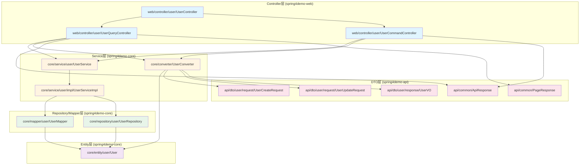
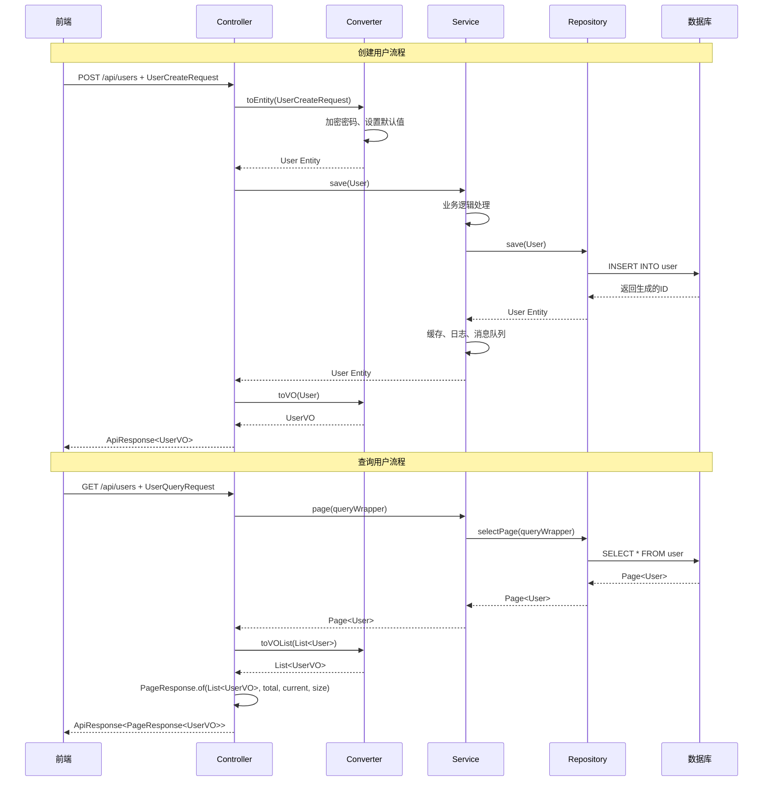
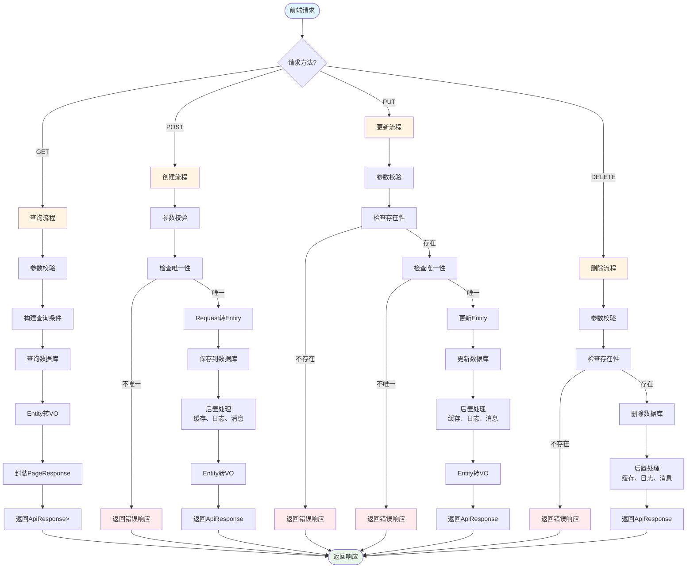

# Spring Boot 三层架构最佳实践分析报告

## 一、当前问题分析

### 1.1 包结构现状

#### 当前包结构

```
spring4demo-core/
└── com.kev1n.spring4demo.core/
    ├── annotation/        # 自定义注解
    ├── aspect/           # 切面
    ├── config/           # 配置类
    ├── document/         # 文档实体（ES）
    ├── entity/           # 数据库实体
    │   └── User.java
    ├── graphql/          # GraphQL解析器
    ├── handler/          # 处理器
    ├── job/              # 定时任务
    ├── mapper/           # MyBatis Mapper
    ├── mq/               # 消息队列
    ├── repository/       # 数据仓库
    │   ├── elasticsearch/
    │   ├── mongo/
    │   ├── neo4j/
    │   └── r2dbc/
    ├── security/         # 安全相关
    └── service/          # 业务服务
        └── impl/         # 服务实现

spring4demo-web/
└── com.kev1n.spring4demo.web/
    ├── config/           # Web配置
    ├── controller/       # 控制器
    │   ├── UserController.java
    │   ├── UserQueryController.java
    │   ├── UserCommandController.java
    │   └── UserStatusController.java
    ├── filter/           # 过滤器
    ├── handler/          # 处理器
    ├── interceptor/      # 拦截器
    └── monitoring/       # 监控

spring4demo-api/
└── com.kev1n.spring4demo.api/
    ├── dto/              # 所有DTO混在一起
    │   ├── ApiResponse.java
    │   ├── PageResponse.java
    │   ├── UserDTO.java
    │   ├── UserCreateDTO.java
    │   ├── UserUpdateDTO.java
    │   ├── UserQueryDTO.java
    │   ├── UserCreateRequest.java
    │   ├── UserUpdateRequest.java
    │   ├── UserQueryRequest.java
    │   ├── UserVO.java
    │   ├── UserMessage.java
    │   ├── UserCreatedMessage.java
    │   ├── UserStatusMessage.java
    │   ├── OnlineUser.java
    │   ├── AuthResult.java
    │   ├── NotificationMessage.java
    │   └── SystemMessage.java
    └── enums/            # 枚举
        ├── UserGender.java
        └── UserStatus.java
```

#### 问题总结

| 问题类型 | 严重程度 | 描述 |
|---------|---------|------|
| DTO包结构混乱 | 🔴 P0 | 所有DTO混在一个包下，没有按业务模块分包 |
| 命名不一致 | 🔴 P0 | 同时存在DTO和Request后缀，命名规范不统一 |
| DTO转换缺失 | 🔴 P0 | Controller直接操作Entity，没有转换层 |
| Page直接暴露 | 🔴 P0 | Controller直接返回MyBatis的Page对象 |
| 职责不清 | 🟡 P1 | Controller中包含业务逻辑（buildUserFromRequest） |
| 缺少转换器 | 🟡 P1 | 没有使用MapStruct等转换工具 |

### 1.2 命名不一致问题

#### User相关类的命名混乱

| 类名 | 类型 | 用途 | 问题 |
|-----|------|------|------|
| UserDTO | DTO | 通用用户DTO | 与Request/VO职责不清 |
| UserCreateDTO | DTO | 创建用户DTO | 与UserCreateRequest重复 |
| UserUpdateDTO | DTO | 更新用户DTO | 与UserUpdateRequest重复 |
| UserQueryDTO | DTO | 查询用户DTO | 与UserQueryRequest重复 |
| UserCreateRequest | Request | 创建用户请求 | 与UserCreateDTO重复 |
| UserUpdateRequest | Request | 更新用户请求 | 与UserUpdateRequest重复 |
| UserQueryRequest | Request | 查询用户请求 | 与UserQueryDTO重复 |
| UserVO | VO | 用户视图对象 | 命名正确，但未使用 |
| User | Entity | 用户实体 | 正确 |
| UserCreateDTO | DTO | 响应式创建用户DTO | 与UserCreateRequest重复 |

#### 命名规范问题

1. **DTO vs Request混淆**：
   - 同时存在`UserCreateDTO`和`UserCreateRequest`
   - 同时存在`UserUpdateDTO`和`UserUpdateRequest`
   - 同时存在`UserQueryDTO`和`UserQueryRequest`

2. **职责不清**：
   - `UserDTO`作为通用DTO，但没有明确的使用场景
   - `UserVO`定义了但Controller没有使用

3. **消息DTO命名**：
   - `UserMessage`、`UserCreatedMessage`、`UserStatusMessage`都是消息DTO
   - 应该统一使用`Message`后缀或放在单独的消息包中

### 1.3 DTO转换缺失

#### 当前转换方式

**UserCommandController.java**：
```java
// 直接在Controller中构建Entity，没有转换器
private User buildUserFromRequest(UserCreateRequest request) {
    User user = new User();
    user.setUsername(request.getUsername());
    user.setEmail(request.getEmail());
    user.setPhone(request.getPhone());
    user.setRealName(request.getRealName());
    user.setStatus(request.getStatus() != null ? request.getStatus() : 1);
    return user;
}
```

**UserQueryController.java**：
```java
// 直接返回Entity，没有转换为VO
public ResponseEntity<ApiResponse<Page<User>>> getUsers(...) {
    Page<User> result = userService.page(page, queryWrapper);
    return ResponseEntity.ok(ApiResponse.success(result));
}

public ResponseEntity<ApiResponse<User>> getUserById(...) {
    var userOpt = userService.getOptById(id);
    if (userOpt.isPresent()) {
        return ResponseEntity.ok(ApiResponse.success(userOpt.get()));
    }
    // ...
}
```

#### 问题分析

| 问题 | 影响 | 严重程度 |
|-----|------|---------|
| Controller直接构建Entity | 违反单一职责原则 | 🔴 P0 |
| Controller直接返回Entity | 暴露数据库结构给前端 | 🔴 P0 |
| 没有使用MapStruct | 转换代码重复，难以维护 | 🟡 P1 |
| Entity与DTO字段映射混乱 | 容易出现字段错误 | 🟡 P1 |

### 1.4 Page直接暴露问题

#### 直接暴露MyBatis Page的地方

**UserQueryController.java**：
```java
@GetMapping
public ResponseEntity<ApiResponse<Page<User>>> getUsers(
        @Parameter(description = "查询参数") @ModelAttribute UserQueryRequest request) {
    // ...
    Page<User> result = userService.page(page, queryWrapper);
    return ResponseEntity.ok(ApiResponse.success(result));  // 直接返回Page对象
}
```

**UserController.java**：
```java
@GetMapping
public ResponseEntity<ApiResponse<Page<User>>> getUsers(
        @Parameter(description = "查询参数") @ModelAttribute UserQueryRequest request) {
    return userQueryController.getUsers(request);  // 委托，但仍然返回Page对象
}
```

#### 问题分析

| 问题 | 影响 | 严重程度 |
|-----|------|---------|
| 暴露MyBatis Page对象 | 前端依赖MyBatis实现细节 | 🔴 P0 |
| PageResponse已定义但未使用 | 代码不一致 | 🔴 P0 |
| Page对象包含过多字段 | 暴露不必要的内部信息 | 🟡 P1 |

#### MyBatis Page对象包含的额外字段

```java
Page<T> {
    records: List<T>      // 数据列表
    total: Long           // 总记录数
    size: Long            // 每页大小
    current: Long         // 当前页码
    pages: Long           // 总页数
    orders: List<OrderItem>  // 排序信息（不应暴露）
    optimizeCountSql: boolean  // SQL优化标志（不应暴露）
    optimizeJoinOfCountSql: boolean  // Join优化标志（不应暴露）
    searchCount: boolean   // 是否查询总数（不应暴露）
    hitCount: boolean      // 是否命中缓存（不应暴露）
    countId: String        // 计数ID（不应暴露）
    maxLimit: Long         // 最大限制（不应暴露）
}
```

## 二、最佳实践设计

### 2.1 三层架构包结构

#### 推荐的包结构设计

```
spring4demo-core/
└── com.kev1n.spring4demo.core/
    ├── annotation/        # 自定义注解
    ├── aspect/           # 切面
    ├── config/           # 配置类
    ├── converter/        # 转换器（MapStruct）
    │   ├── UserConverter.java
    │   ├── OrderConverter.java
    │   └── ProductConverter.java
    ├── document/         # 文档实体（ES）
    │   └── user/
    │       └── UserDocument.java
    ├── entity/           # 数据库实体（按业务模块分包）
    │   ├── user/
    │   │   ├── User.java
    │   │   └── UserLog.java
    │   ├── order/
    │   │   └── Order.java
    │   └── product/
    │       └── Product.java
    ├── graphql/          # GraphQL解析器
    │   └── user/
    │       ├── UserQueryResolver.java
    │       └── UserMutationResolver.java
    ├── handler/          # 处理器
    ├── job/              # 定时任务
    │   └── user/
    │       ├── UserStatsJob.java
    │       └── UserCleanJob.java
    ├── mapper/           # MyBatis Mapper（按业务模块分包）
    │   ├── user/
    │   │   └── UserMapper.java
    │   ├── order/
    │   │   └── OrderMapper.java
    │   └── product/
    │       └── ProductMapper.java
    ├── mq/               # 消息队列
    │   └── user/
    │       ├── UserMessageProducer.java
    │       └── UserMessageConsumer.java
    ├── repository/       # 数据仓库（按业务模块分包）
    │   ├── elasticsearch/
    │   │   └── user/
    │   │       └── UserDocumentRepository.java
    │   ├── mongo/
    │   │   └── user/
    │   │       └── UserLogRepository.java
    │   ├── neo4j/
    │   │   └── user/
    │   │       └── UserRepository.java
    │   └── r2dbc/
    │       └── user/
    │           └── UserR2dbcRepository.java
    ├── security/         # 安全相关
    └── service/          # 业务服务（按业务模块分包）
        ├── user/
        │   ├── UserService.java
        │   ├── UserCacheService.java
        │   ├── UserLogService.java
        │   ├── UserSearchService.java
        │   ├── UserAsyncService.java
        │   ├── UserDistributedService.java
        │   ├── UserReactiveService.java
        │   ├── UserGraphService.java
        │   ├── UserMetricsService.java
        │   └── impl/
        │       ├── UserServiceImpl.java
        │       ├── UserCacheServiceImpl.java
        │       ├── UserLogServiceImpl.java
        │       ├── UserSearchServiceImpl.java
        │       ├── UserAsyncServiceImpl.java
        │       ├── UserDistributedServiceImpl.java
        │       ├── UserReactiveServiceImpl.java
        │       ├── UserGraphServiceImpl.java
        │       └── UserMetricsServiceImpl.java
        ├── order/
        │   ├── OrderService.java
        │   └── impl/
        │       └── OrderServiceImpl.java
        └── product/
            ├── ProductService.java
            └── impl/
                └── ProductServiceImpl.java

spring4demo-web/
└── com.kev1n.spring4demo.web/
    ├── config/           # Web配置
    ├── controller/       # 控制器（按业务模块分包）
    │   ├── user/
    │   │   ├── UserController.java
    │   │   ├── UserQueryController.java
    │   │   ├── UserCommandController.java
    │   │   └── UserStatusController.java
    │   ├── order/
    │   │   └── OrderController.java
    │   └── product/
    │       └── ProductController.java
    ├── filter/           # 过滤器
    ├── handler/          # 处理器
    ├── interceptor/      # 拦截器
    └── monitoring/       # 监控

spring4demo-api/
└── com.kev1n.spring4demo.api/
    ├── common/           # 通用DTO
    │   ├── ApiResponse.java
    │   └── PageResponse.java
    ├── dto/              # DTO（按业务模块分包）
    │   ├── user/
    │   │   ├── request/
    │   │   │   ├── UserCreateRequest.java
    │   │   │   ├── UserUpdateRequest.java
    │   │   │   └── UserQueryRequest.java
    │   │   ├── response/
    │   │   │   ├── UserVO.java
    │   │   │   └── UserDetailVO.java
    │   │   └── message/
    │   │       ├── UserMessage.java
    │   │       ├── UserCreatedMessage.java
    │   │       └── UserStatusMessage.java
    │   ├── order/
    │   │   ├── request/
    │   │   │   ├── OrderCreateRequest.java
    │   │   │   └── OrderUpdateRequest.java
    │   │   └── response/
    │   │       └── OrderVO.java
    │   └── product/
    │       ├── request/
    │       │   └── ProductCreateRequest.java
    │       └── response/
    │           └── ProductVO.java
    └── enums/            # 枚举（按业务模块分包）
        ├── user/
        │   ├── UserGender.java
        │   └── UserStatus.java
        ├── order/
        │   └── OrderStatus.java
        └── common/
            └── ErrorCode.java
```

#### 包职责说明

| 包名 | 职责 | 依赖 |
|-----|------|------|
| core.entity | 数据库实体，对应数据库表 | 无 |
| core.converter | DTO转换器（MapStruct） | entity, api.dto |
| core.mapper | MyBatis Mapper接口 | entity |
| core.repository | 数据仓库接口（JPA/R2DBC） | entity |
| core.service | 业务服务接口和实现 | mapper, repository, converter |
| web.controller | REST控制器 | service, api.dto |
| api.dto.common | 通用响应DTO | 无 |
| api.dto.{module}.request | 请求DTO | 无 |
| api.dto.{module}.response | 响应DTO（VO） | entity |
| api.dto.{module}.message | 消息DTO | 无 |
| api.enums | 枚举定义 | 无 |

### 2.2 命名约定

#### 统一命名规范

| 类型 | 命名规范 | 示例 | 说明 |
|-----|---------|------|------|
| Entity | `{业务名}.java` | `User.java` | 对应数据库表 |
| Mapper | `{业务名}Mapper.java` | `UserMapper.java` | MyBatis Mapper |
| Repository | `{业务名}Repository.java` | `UserRepository.java` | JPA/R2DBC Repository |
| Service | `{业务名}Service.java` | `UserService.java` | 业务服务接口 |
| ServiceImpl | `{业务名}ServiceImpl.java` | `UserServiceImpl.java` | 业务服务实现 |
| Controller | `{业务名}Controller.java` | `UserController.java` | REST控制器 |
| Request | `{业务名}{操作}Request.java` | `UserCreateRequest.java` | 请求DTO |
| VO | `{业务名}VO.java` | `UserVO.java` | 响应DTO（视图对象） |
| Message | `{业务名}{事件}Message.java` | `UserCreatedMessage.java` | 消息DTO |
| Converter | `{业务名}Converter.java` | `UserConverter.java` | MapStruct转换器 |

#### 命名规范详细说明

##### 1. Entity（实体类）

**命名规则**：
- 使用单数形式，与数据库表名对应
- 使用驼峰命名法
- 不使用后缀

**示例**：
```java
// ✅ 正确
User.java
Order.java
Product.java

// ❌ 错误
UserEntity.java
UserDO.java
Users.java
```

**包位置**：
```
core.entity.{module}/
```

##### 2. Mapper（MyBatis Mapper）

**命名规则**：
- 与Entity同名，加`Mapper`后缀
- 使用驼峰命名法

**示例**：
```java
// ✅ 正确
UserMapper.java
OrderMapper.java
ProductMapper.java

// ❌ 错误
UserDao.java
UserRepository.java
```

**包位置**：
```
core.mapper.{module}/
```

##### 3. Repository（JPA/R2DBC Repository）

**命名规则**：
- 与Entity同名，加`Repository`后缀
- 使用驼峰命名法

**示例**：
```java
// ✅ 正确
UserRepository.java
OrderRepository.java
ProductRepository.java

// ❌ 错误
UserDao.java
UserMapper.java
```

**包位置**：
```
core.repository.{datastore}/{module}/
```

##### 4. Service（业务服务）

**命名规则**：
- 与Entity同名，加`Service`后缀
- 使用驼峰命名法

**示例**：
```java
// ✅ 正确
UserService.java
OrderService.java
ProductService.java

// ❌ 错误
UserManager.java
UserBusiness.java
```

**包位置**：
```
core.service.{module}/
core.service.{module}/impl/
```

##### 5. Controller（控制器）

**命名规则**：
- 与Entity同名，加`Controller`后缀
- 使用驼峰命名法

**示例**：
```java
// ✅ 正确
UserController.java
OrderController.java
ProductController.java

// ❌ 错误
UserApi.java
UserEndpoint.java
```

**包位置**：
```
web.controller.{module}/
```

##### 6. Request（请求DTO）

**命名规则**：
- `{业务名}{操作}Request`格式
- 操作类型：Create、Update、Query、Delete
- 使用驼峰命名法

**示例**：
```java
// ✅ 正确
UserCreateRequest.java
UserUpdateRequest.java
UserQueryRequest.java
UserDeleteRequest.java

// ❌ 错误
UserCreateDTO.java
UserReq.java
CreateUserRequest.java
```

**包位置**：
```
api.dto.{module}/request/
```

##### 7. VO（响应DTO）

**命名规则**：
- `{业务名}VO`格式
- 使用驼峰命名法
- 如果有多个响应场景，可以加场景描述

**示例**：
```java
// ✅ 正确
UserVO.java
UserDetailVO.java
UserSimpleVO.java

// ❌ 错误
UserResponse.java
UserDTO.java
User.java
```

**包位置**：
```
api.dto.{module}/response/
```

##### 8. Message（消息DTO）

**命名规则**：
- `{业务名}{事件}Message`格式
- 事件类型：Created、Updated、Deleted、StatusChanged
- 使用驼峰命名法

**示例**：
```java
// ✅ 正确
UserCreatedMessage.java
UserUpdatedMessage.java
UserDeletedMessage.java
UserStatusChangedMessage.java

// ❌ 错误
UserMessage.java
UserEvent.java
```

**包位置**：
```
api.dto.{module}/message/
```

##### 9. Converter（转换器）

**命名规则**：
- 与Entity同名，加`Converter`后缀
- 使用驼峰命名法

**示例**：
```java
// ✅ 正确
UserConverter.java
OrderConverter.java
ProductConverter.java

// ❌ 错误
UserMapper.java
UserTransformer.java
```

**包位置**：
```
core.converter/
```

#### 命名规范对比表

| 场景 | 当前命名 | 推荐命名 | 状态 |
|-----|---------|---------|------|
| 创建用户请求 | UserCreateRequest/UserCreateDTO | UserCreateRequest | ✅ 已正确 |
| 更新用户请求 | UserUpdateRequest/UserUpdateDTO | UserUpdateRequest | ✅ 已正确 |
| 查询用户请求 | UserQueryRequest/UserQueryDTO | UserQueryRequest | ✅ 已正确 |
| 用户响应 | UserDTO/UserVO | UserVO | ❌ 需统一 |
| 用户消息 | UserMessage/UserCreatedMessage | UserCreatedMessage | ⚠️ 需规范 |
| 通用用户DTO | UserDTO | 删除 | ❌ 应删除 |

### 2.3 DTO转换策略

#### 转换层次设计

```
┌─────────────────────────────────────────────────────────────┐
│                        Controller层                          │
│  接收Request，返回VO                                          │
└────────────────────┬────────────────────────────────────────┘
                     │
                     ▼
┌─────────────────────────────────────────────────────────────┐
│                      Converter层                             │
│  Request ↔ Entity                                            │
│  Entity ↔ VO                                                 │
└────────────────────┬────────────────────────────────────────┘
                     │
                     ▼
┌─────────────────────────────────────────────────────────────┐
│                       Service层                              │
│  处理业务逻辑，操作Entity                                      │
└────────────────────┬────────────────────────────────────────┘
                     │
                     ▼
┌─────────────────────────────────────────────────────────────┐
│                    Repository/Mapper层                        │
│  持久化Entity到数据库                                         │
└─────────────────────────────────────────────────────────────┘
```

#### MapStruct转换器设计

##### 1. UserConverter接口

```java
package com.kev1n.spring4demo.core.converter;

import com.kev1n.spring4demo.api.dto.user.request.UserCreateRequest;
import com.kev1n.spring4demo.api.dto.user.request.UserUpdateRequest;
import com.kev1n.spring4demo.api.dto.user.response.UserVO;
import com.kev1n.spring4demo.core.entity.user.User;
import org.mapstruct.Mapper;
import org.mapstruct.Mapping;
import org.mapstruct.MappingTarget;
import org.mapstruct.NullValuePropertyMappingStrategy;
import org.mapstruct.ReportingPolicy;

import java.util.List;

/**
 * 用户对象转换器
 *
 * <p>使用MapStruct实现Entity、Request、VO之间的转换</p>
 *
 * @author spring4demo
 * @version 2.0.0
 */
@Mapper(
    componentModel = "spring",
    nullValuePropertyMappingStrategy = NullValuePropertyMappingStrategy.IGNORE,
    unmappedTargetPolicy = ReportingPolicy.IGNORE,
    uses = {}
)
public interface UserConverter {

    /**
     * Request转Entity（创建）
     *
     * @param request 创建请求
     * @return 用户实体
     */
    @Mapping(target = "id", ignore = true)
    @Mapping(target = "createdAt", ignore = true)
    @Mapping(target = "updatedAt", ignore = true)
    @Mapping(target = "deleted", ignore = true)
    @Mapping(target = "version", ignore = true)
    @Mapping(target = "password", expression = "java(encryptPassword(request.getPassword()))")
    User toEntity(UserCreateRequest request);

    /**
     * Entity转VO
     *
     * @param entity 用户实体
     * @return 用户视图对象
     */
    @Mapping(target = "createTime", source = "createdAt")
    @Mapping(target = "updateTime", source = "updatedAt")
    UserVO toVO(User entity);

    /**
     * Entity列表转VO列表
     *
     * @param entities 用户实体列表
     * @return 用户视图对象列表
     */
    List<UserVO> toVOList(List<User> entities);

    /**
     * Request更新到Entity（更新）
     *
     * @param request 更新请求
     * @param entity 用户实体（目标）
     */
    @Mapping(target = "id", ignore = true)
    @Mapping(target = "username", ignore = true)
    @Mapping(target = "password", ignore = true)
    @Mapping(target = "createdAt", ignore = true)
    @Mapping(target = "updatedAt", ignore = true)
    @Mapping(target = "deleted", ignore = true)
    @Mapping(target = "version", ignore = true)
    void updateEntity(UserUpdateRequest request, @MappingTarget User entity);

    /**
     * 加密密码（示例方法）
     *
     * @param password 明文密码
     * @return 密文密码
     */
    default String encryptPassword(String password) {
        // 实际项目中应该使用PasswordEncoder
        return password;
    }
}
```

##### 2. 使用转换器的Controller

```java
@RestController
@RequestMapping("/api/users")
@RequiredArgsConstructor
@Slf4j
@Tag(name = "用户管理", description = "用户管理相关接口")
public class UserCommandController {

    private final UserService userService;
    private final UserConverter userConverter;

    /**
     * 创建用户
     */
    @PostMapping
    @SaCheckRole("ADMIN")
    @Operation(summary = "创建用户")
    public ResponseEntity<ApiResponse<UserVO>> createUser(
            @Parameter(description = "用户创建信息")
            @Valid @RequestBody UserCreateRequest request) {

        log.info("创建用户请求: username={}, email={}", request.getUsername(), request.getEmail());

        // 检查用户名是否已存在
        if (userService.existsByUsername(request.getUsername())) {
            return ResponseEntity.ok(ApiResponse.error(
                    ErrorCode.USER_ALREADY_EXISTS.getCode(), "用户名已存在"));
        }

        // 检查邮箱是否已存在
        if (StringUtils.hasText(request.getEmail()) && userService.existsByEmail(request.getEmail())) {
            return ResponseEntity.ok(ApiResponse.error(
                    ErrorCode.USER_ALREADY_EXISTS.getCode(), "邮箱已存在"));
        }

        // 使用转换器将Request转换为Entity
        User user = userConverter.toEntity(request);
        boolean result = userService.save(user);

        if (result) {
            log.info("用户创建成功: id={}, username={}", user.getId(), user.getUsername());
            // 使用转换器将Entity转换为VO
            UserVO userVO = userConverter.toVO(user);
            return ResponseEntity.status(HttpStatus.CREATED)
                    .body(ApiResponse.success("用户创建成功", userVO));
        } else {
            return ResponseEntity.ok(ApiResponse.error("用户创建失败"));
        }
    }

    /**
     * 更新用户信息
     */
    @PutMapping("/{id}")
    @SaCheckPermission("user:update")
    @Operation(summary = "更新用户信息")
    public ResponseEntity<ApiResponse<UserVO>> updateUser(
            @Parameter(description = "用户ID") @PathVariable Long id,
            @Parameter(description = "用户更新信息")
            @Valid @RequestBody UserUpdateRequest request) {

        log.info("更新用户信息: id={}, request={}", id, request);

        var userOpt = userService.getOptById(id);
        if (userOpt.isEmpty()) {
            return ResponseEntity.ok(ApiResponse.error(
                    ErrorCode.USER_NOT_FOUND.getCode(), "用户不存在"));
        }

        User user = userOpt.get();

        // 检查邮箱唯一性（如果邮箱发生变化）
        if (StringUtils.hasText(request.getEmail()) &&
                !Objects.equals(user.getEmail(), request.getEmail())) {
            if (userService.existsByEmail(request.getEmail())) {
                return ResponseEntity.ok(ApiResponse.error(
                        ErrorCode.USER_ALREADY_EXISTS.getCode(), "邮箱已存在"));
            }
        }

        // 使用转换器更新Entity
        userConverter.updateEntity(request, user);
        boolean result = userService.updateById(user);

        if (result) {
            log.info("用户更新成功: id={}", id);
            // 使用转换器将Entity转换为VO
            UserVO userVO = userConverter.toVO(user);
            return ResponseEntity.ok(ApiResponse.success("用户更新成功", userVO));
        } else {
            return ResponseEntity.ok(ApiResponse.error("用户更新失败"));
        }
    }
}
```

##### 3. 使用转换器的QueryController

```java
@RestController
@RequestMapping("/api/users")
@RequiredArgsConstructor
@Slf4j
@Tag(name = "用户查询", description = "用户查询相关接口")
public class UserQueryController {

    private final UserService userService;
    private final UserConverter userConverter;
    private final MeterRegistry meterRegistry;

    /**
     * 分页获取用户列表
     */
    @GetMapping
    @SaCheckLogin
    @RateLimit(key = "user:list", permits = 100)
    @Operation(summary = "获取用户列表")
    public ResponseEntity<ApiResponse<PageResponse<UserVO>>> getUsers(
            @Parameter(description = "查询参数") @ModelAttribute UserQueryRequest request) {

        log.debug("获取用户列表: current={}, size={}, keyword={}",
                request.getCurrent(), request.getSize(), request.getKeyword());

        Timer.Sample sample = Timer.start(meterRegistry);

        try {
            // 监控深度分页
            if (request.getCurrent() > 1000) {
                log.warn("深度分页查询: current={}, size={}",
                        request.getCurrent(), request.getSize());
            }

            // 构建查询条件
            QueryWrapper<User> queryWrapper = buildQueryWrapper(request);

            // 分页查询
            Page<User> page = new Page<>(request.getCurrent(), request.getSize());
            Page<User> result = userService.page(page, queryWrapper);

            // 使用转换器将Entity列表转换为VO列表
            List<UserVO> voList = userConverter.toVOList(result.getRecords());

            // 使用PageResponse封装分页结果
            PageResponse<UserVO> pageResponse = PageResponse.of(
                    voList,
                    result.getTotal(),
                    (int) result.getCurrent(),
                    (int) result.getSize()
            );

            // 记录分页查询指标
            sample.stop(Timer.builder("pagination.query.duration")
                    .tag("entity", "user")
                    .tag("current", String.valueOf(request.getCurrent()))
                    .tag("size", String.valueOf(request.getSize()))
                    .register(meterRegistry));

            return ResponseEntity.ok(ApiResponse.success(pageResponse));

        } catch (IllegalArgumentException e) {
            return handleQueryError(sample, "查询参数错误", e);
        } catch (DataAccessException e) {
            return handleQueryError(sample, "系统繁忙，请稍后重试", e);
        } catch (Exception e) {
            return handleQueryError(sample, "系统异常，查询失败", e);
        }
    }

    /**
     * 根据ID获取用户信息
     */
    @GetMapping("/{id}")
    @SaCheckLogin
    @RateLimit(key = "user:detail", permits = 200)
    @Operation(summary = "获取用户详情")
    public ResponseEntity<ApiResponse<UserVO>> getUserById(
            @Parameter(description = "用户ID") @PathVariable Long id) {

        log.debug("获取用户详情: id={}", id);

        try {
            var userOpt = userService.getOptById(id);
            if (userOpt.isPresent()) {
                // 使用转换器将Entity转换为VO
                UserVO userVO = userConverter.toVO(userOpt.get());
                return ResponseEntity.ok(ApiResponse.success(userVO));
            } else {
                return ResponseEntity.ok(ApiResponse.error(
                        ErrorCode.USER_NOT_FOUND.getCode(), "用户不存在"));
            }
        } catch (IllegalArgumentException e) {
            log.error("用户ID参数错误: id={}", id, e);
            return ResponseEntity.ok(ApiResponse.error("用户ID参数错误"));
        } catch (DataAccessException e) {
            log.error("数据库查询失败: id={}", id, e);
            return ResponseEntity.ok(ApiResponse.error("系统繁忙，请稍后重试"));
        } catch (Exception e) {
            log.error("获取用户详情失败: id={}", id, e);
            return ResponseEntity.ok(ApiResponse.error("系统异常，查询失败"));
        }
    }

    // ... 其他方法
}
```

#### 转换器设计原则

| 原则 | 说明 | 示例 |
|-----|------|------|
| 单一职责 | 每个转换器只负责一个业务模块的转换 | UserConverter只转换User相关对象 |
| 双向转换 | 支持Entity ↔ DTO的双向转换 | toEntity()、toVO() |
| 部分更新 | 支持部分字段更新 | updateEntity(request, entity) |
| 忽略敏感字段 | 转换时忽略密码、创建时间等敏感字段 | @Mapping(target = "password", ignore = true) |
| 自定义转换 | 支持自定义转换逻辑 | encryptPassword()方法 |
| 批量转换 | 支持列表转换 | toVOList() |

#### 转换器最佳实践

1. **使用MapStruct**：
   - 编译时生成转换代码，性能高
   - 类型安全，编译期检查
   - 避免手动编写重复代码

2. **转换器放在core模块**：
   - 转换器属于业务逻辑的一部分
   - 不应该放在api模块

3. **忽略敏感字段**：
   - 密码字段不应该暴露给前端
   - 创建时间、更新时间由数据库自动填充

4. **使用@MappingTarget进行部分更新**：
   - 避免覆盖不应该更新的字段
   - 提高更新操作的安全性

### 2.4 Response设计

#### 统一响应格式设计

##### 1. ApiResponse（已存在，无需修改）

```java
package com.kev1n.spring4demo.api.common;

import com.fasterxml.jackson.annotation.JsonInclude;
import com.kev1n.spring4demo.common.enums.ErrorCode;
import lombok.AllArgsConstructor;
import lombok.Builder;
import lombok.Data;
import lombok.NoArgsConstructor;

import java.time.LocalDateTime;

/**
 * 统一API响应格式
 *
 * @param <T> 响应数据类型
 * @author spring4demo
 * @version 1.0.0
 */
@Data
@Builder
@NoArgsConstructor
@AllArgsConstructor
@JsonInclude(JsonInclude.Include.NON_NULL)
public class ApiResponse<T> {

    /** 响应码 */
    private Integer code;

    /** 响应消息 */
    private String message;

    /** 响应数据 */
    private T data;

    /** 响应时间戳 */
    private LocalDateTime timestamp;

    /** 请求ID（用于链路追踪） */
    private String traceId;

    /**
     * 成功响应（无数据）
     */
    public static <T> ApiResponse<T> success() {
        return ApiResponse.<T>builder()
                .code(200)
                .message("操作成功")
                .timestamp(LocalDateTime.now())
                .build();
    }

    /**
     * 成功响应（带数据）
     */
    public static <T> ApiResponse<T> success(T data) {
        return ApiResponse.<T>builder()
                .code(200)
                .message("操作成功")
                .data(data)
                .timestamp(LocalDateTime.now())
                .build();
    }

    /**
     * 成功响应（自定义消息）
     */
    public static <T> ApiResponse<T> success(String message, T data) {
        return ApiResponse.<T>builder()
                .code(200)
                .message(message)
                .data(data)
                .timestamp(LocalDateTime.now())
                .build();
    }

    /**
     * 失败响应
     */
    public static <T> ApiResponse<T> error(String message) {
        return ApiResponse.<T>builder()
                .code(500)
                .message(message)
                .timestamp(LocalDateTime.now())
                .build();
    }

    /**
     * 失败响应（自定义错误码）
     */
    public static <T> ApiResponse<T> error(Integer code, String message) {
        return ApiResponse.<T>builder()
                .code(code)
                .message(message)
                .timestamp(LocalDateTime.now())
                .build();
    }

    /**
     * 失败响应（使用错误码枚举）
     */
    public static <T> ApiResponse<T> error(ErrorCode errorCode) {
        return ApiResponse.<T>builder()
                .code(errorCode.getCode())
                .message(errorCode.getMessage())
                .timestamp(LocalDateTime.now())
                .build();
    }

    /**
     * 判断响应是否成功
     */
    public boolean isSuccess() {
        return code != null && code == 200;
    }
}
```

##### 2. PageResponse（已存在，但需要调整）

```java
package com.kev1n.spring4demo.api.common;

import com.fasterxml.jackson.annotation.JsonInclude;
import lombok.AllArgsConstructor;
import lombok.Builder;
import lombok.Data;
import lombok.NoArgsConstructor;

import java.util.List;

/**
 * 分页响应格式
 *
 * @param <T> 数据类型
 * @author spring4demo
 * @version 2.0.0
 */
@Data
@Builder
@NoArgsConstructor
@AllArgsConstructor
@JsonInclude(JsonInclude.Include.NON_NULL)
public class PageResponse<T> {

    /** 数据列表 */
    private List<T> records;

    /** 总记录数 */
    private Long total;

    /** 当前页码（从0开始） */
    private Integer current;

    /** 每页大小 */
    private Integer size;

    /** 总页数 */
    private Integer pages;

    /** 是否有下一页 */
    private Boolean hasNext;

    /** 是否有上一页 */
    private Boolean hasPrevious;

    /**
     * 创建分页响应（手动构建）
     */
    public static <T> PageResponse<T> of(List<T> records, Long total, Integer current, Integer size) {
        // 参数校验
        if (current == null || current < 0) {
            current = 0;
        }
        if (size == null || size < 1) {
            size = 10;
        }
        if (size > 100) {
            size = 100; // 限制最大分页大小
        }

        int pages = (int) Math.ceil((double) total / size);
        return PageResponse.<T>builder()
                .records(records)
                .total(total)
                .current(current)
                .size(size)
                .pages(pages)
                .hasNext(current < pages - 1)
                .hasPrevious(current > 0)
                .build();
    }

    /**
     * 从MyBatis Page对象创建分页响应
     *
     * <p>注意：这个方法应该在Controller中使用，而不是直接暴露Page对象</p>
     */
    public static <T> PageResponse<T> of(com.baomidou.mybatisplus.extension.plugins.pagination.Page<T> page) {
        int current = (int) page.getCurrent();
        int size = (int) page.getSize();
        long total = page.getTotal();
        int pages = size > 0 ? (int) Math.ceil((double) total / size) : 0;

        return PageResponse.<T>builder()
                .records(page.getRecords())
                .total(total)
                .current(current)
                .size(size)
                .pages(pages)
                .hasNext(current < pages - 1)
                .hasPrevious(current > 0)
                .build();
    }
}
```

##### 3. 响应格式规范

| 场景 | 响应类型 | 示例 |
|-----|---------|------|
| 成功（单条数据） | `ApiResponse<T>` | `ApiResponse<UserVO>` |
| 成功（列表数据） | `ApiResponse<List<T>>` | `ApiResponse<List<UserVO>>` |
| 成功（分页数据） | `ApiResponse<PageResponse<T>>` | `ApiResponse<PageResponse<UserVO>>` |
| 成功（无数据） | `ApiResponse<Void>` | `ApiResponse<Void>` |
| 失败 | `ApiResponse<T>` | `ApiResponse<Void>` |

##### 4. 响应示例

**成功响应（单条数据）**：
```json
{
  "code": 200,
  "message": "操作成功",
  "data": {
    "id": 1,
    "username": "john_doe",
    "email": "john@example.com",
    "realName": "张三",
    "status": "ACTIVE"
  },
  "timestamp": "2026-01-15T10:30:00"
}
```

**成功响应（分页数据）**：
```json
{
  "code": 200,
  "message": "操作成功",
  "data": {
    "records": [
      {
        "id": 1,
        "username": "john_doe",
        "email": "john@example.com"
      },
      {
        "id": 2,
        "username": "jane_doe",
        "email": "jane@example.com"
      }
    ],
    "total": 100,
    "current": 0,
    "size": 10,
    "pages": 10,
    "hasNext": true,
    "hasPrevious": false
  },
  "timestamp": "2026-01-15T10:30:00"
}
```

**失败响应**：
```json
{
  "code": 42001,
  "message": "用户不存在",
  "timestamp": "2026-01-15T10:30:00"
}
```

#### 响应设计原则

| 原则 | 说明 |
|-----|------|
| 统一格式 | 所有接口使用相同的响应格式 |
| 明确状态 | 使用HTTP状态码和业务错误码双重标识 |
| 避免暴露 | 不暴露数据库内部结构和技术细节 |
| 时间戳 | 所有响应都包含时间戳 |
| 链路追踪 | 支持traceId用于链路追踪 |

## 三、架构图

### 3.1 三层架构包结构图



### 3.2 DTO转换流程图



### 3.3 请求响应流程图



## 四、接口契约

### 4.1 统一Response接口

```java
package com.kev1n.spring4demo.api.common;

import com.fasterxml.jackson.annotation.JsonInclude;
import com.kev1n.spring4demo.common.enums.ErrorCode;
import lombok.AllArgsConstructor;
import lombok.Builder;
import lombok.Data;
import lombok.NoArgsConstructor;

import java.time.LocalDateTime;

/**
 * 统一API响应格式
 *
 * @param <T> 响应数据类型
 * @author spring4demo
 * @version 1.0.0
 */
@Data
@Builder
@NoArgsConstructor
@AllArgsConstructor
@JsonInclude(JsonInclude.Include.NON_NULL)
public class ApiResponse<T> {

    /** 响应码 */
    private Integer code;

    /** 响应消息 */
    private String message;

    /** 响应数据 */
    private T data;

    /** 响应时间戳 */
    private LocalDateTime timestamp;

    /** 请求ID（用于链路追踪） */
    private String traceId;

    /**
     * 成功响应（无数据）
     */
    public static <T> ApiResponse<T> success() {
        return ApiResponse.<T>builder()
                .code(200)
                .message("操作成功")
                .timestamp(LocalDateTime.now())
                .build();
    }

    /**
     * 成功响应（带数据）
     */
    public static <T> ApiResponse<T> success(T data) {
        return ApiResponse.<T>builder()
                .code(200)
                .message("操作成功")
                .data(data)
                .timestamp(LocalDateTime.now())
                .build();
    }

    /**
     * 成功响应（自定义消息）
     */
    public static <T> ApiResponse<T> success(String message, T data) {
        return ApiResponse.<T>builder()
                .code(200)
                .message(message)
                .data(data)
                .timestamp(LocalDateTime.now())
                .build();
    }

    /**
     * 失败响应
     */
    public static <T> ApiResponse<T> error(String message) {
        return ApiResponse.<T>builder()
                .code(500)
                .message(message)
                .timestamp(LocalDateTime.now())
                .build();
    }

    /**
     * 失败响应（自定义错误码）
     */
    public static <T> ApiResponse<T> error(Integer code, String message) {
        return ApiResponse.<T>builder()
                .code(code)
                .message(message)
                .timestamp(LocalDateTime.now())
                .build();
    }

    /**
     * 失败响应（使用错误码枚举）
     */
    public static <T> ApiResponse<T> error(ErrorCode errorCode) {
        return ApiResponse.<T>builder()
                .code(errorCode.getCode())
                .message(errorCode.getMessage())
                .timestamp(LocalDateTime.now())
                .build();
    }

    /**
     * 判断响应是否成功
     */
    public boolean isSuccess() {
        return code != null && code == 200;
    }
}
```

### 4.2 分页Response接口

```java
package com.kev1n.spring4demo.api.common;

import com.fasterxml.jackson.annotation.JsonInclude;
import lombok.AllArgsConstructor;
import lombok.Builder;
import lombok.Data;
import lombok.NoArgsConstructor;

import java.util.List;

/**
 * 分页响应格式
 *
 * @param <T> 数据类型
 * @author spring4demo
 * @version 2.0.0
 */
@Data
@Builder
@NoArgsConstructor
@AllArgsConstructor
@JsonInclude(JsonInclude.Include.NON_NULL)
public class PageResponse<T> {

    /** 数据列表 */
    private List<T> records;

    /** 总记录数 */
    private Long total;

    /** 当前页码（从0开始） */
    private Integer current;

    /** 每页大小 */
    private Integer size;

    /** 总页数 */
    private Integer pages;

    /** 是否有下一页 */
    private Boolean hasNext;

    /** 是否有上一页 */
    private Boolean hasPrevious;

    /**
     * 创建分页响应（手动构建）
     */
    public static <T> PageResponse<T> of(List<T> records, Long total, Integer current, Integer size) {
        // 参数校验
        if (current == null || current < 0) {
            current = 0;
        }
        if (size == null || size < 1) {
            size = 10;
        }
        if (size > 100) {
            size = 100; // 限制最大分页大小
        }

        int pages = (int) Math.ceil((double) total / size);
        return PageResponse.<T>builder()
                .records(records)
                .total(total)
                .current(current)
                .size(size)
                .pages(pages)
                .hasNext(current < pages - 1)
                .hasPrevious(current > 0)
                .build();
    }

    /**
     * 从MyBatis Page对象创建分页响应
     */
    public static <T> PageResponse<T> of(com.baomidou.mybatisplus.extension.plugins.pagination.Page<T> page) {
        int current = (int) page.getCurrent();
        int size = (int) page.getSize();
        long total = page.getTotal();
        int pages = size > 0 ? (int) Math.ceil((double) total / size) : 0;

        return PageResponse.<T>builder()
                .records(page.getRecords())
                .total(total)
                .current(current)
                .size(size)
                .pages(pages)
                .hasNext(current < pages - 1)
                .hasPrevious(current > 0)
                .build();
    }
}
```

### 4.3 错误码定义

#### 错误码规范

| 错误码范围 | 说明 | 示例 |
|----------|------|------|
| 200 | 成功 | 200 |
| 40000-40099 | 请求错误 | 40000-BAD_REQUEST |
| 40100-40199 | 认证错误 | 40100-NOT_LOGIN |
| 40300-40399 | 权限错误 | 40300-NO_PERMISSION |
| 42000-42099 | 业务错误 | 42001-USER_NOT_FOUND |
| 50000-50099 | 系统错误 | 50000-SYSTEM_ERROR |
| 50300-50399 | 服务不可用 | 50300-SERVICE_UNAVAILABLE |

#### 错误码枚举（已存在，无需修改）

```java
package com.kev1n.spring4demo.common.enums;

import lombok.AllArgsConstructor;
import lombok.Getter;

/**
 * 错误码枚举
 *
 * @author spring4demo
 * @version 1.0.0
 */
@Getter
@AllArgsConstructor
public enum ErrorCode {

    // ==================== 成功 ====================
    SUCCESS(200, "操作成功"),

    // ==================== 认证相关 40xxx ====================
    NOT_LOGIN(40100, "未登录"),
    NOT_TOKEN(40101, "未提供Token"),
    INVALID_TOKEN(40102, "Token无效"),
    TOKEN_TIMEOUT(40103, "Token已过期"),
    TOKEN_REPLACED(40104, "账号已在其他设备登录"),
    TOKEN_KICK_OUT(40105, "账号已被踢下线"),
    TOKEN_FREEZE(40106, "Token已被冻结"),
    NO_PREFIX(40107, "Token前缀错误"),

    // ==================== 权限相关 40xxx ====================
    NO_PERMISSION(40300, "无权限访问"),
    NO_ROLE(40301, "无该角色"),

    // ==================== 请求错误 40xxx ====================
    BAD_REQUEST(40000, "请求参数错误"),
    VALIDATION_ERROR(40001, "参数校验失败"),
    RESOURCE_NOT_FOUND(40002, "资源不存在"),
    METHOD_NOT_ALLOWED(40003, "请求方法不支持"),
    UNSUPPORTED_MEDIA_TYPE(40004, "不支持的媒体类型"),

    // ==================== 业务错误 42xxx ====================
    BUSINESS_ERROR(42000, "业务处理失败"),
    USER_NOT_FOUND(42001, "用户不存在"),
    USER_ALREADY_EXISTS(42002, "用户已存在"),
    USER_DISABLED(42003, "用户已被禁用"),
    PASSWORD_ERROR(42004, "密码错误"),
    OLD_PASSWORD_ERROR(42005, "原密码错误"),
    DATA_CONFLICT(42006, "数据冲突"),
    OPERATION_FAILED(42007, "操作失败"),

    // ==================== 系统错误 50xxx ====================
    SYSTEM_ERROR(50000, "系统错误"),
    DATABASE_ERROR(50001, "数据库错误"),
    NETWORK_ERROR(50002, "网络错误"),
    EXTERNAL_SERVICE_ERROR(50003, "外部服务错误"),
    FILE_UPLOAD_ERROR(50004, "文件上传失败"),
    FILE_DOWNLOAD_ERROR(50005, "文件下载失败"),

    // ==================== 服务不可用 50xxx ====================
    SERVICE_UNAVAILABLE(50300, "服务暂时不可用"),
    GATEWAY_TIMEOUT(50400, "网关超时");

    /** 错误码 */
    private final int code;

    /** 错误消息 */
    private final String message;

    /**
     * 根据错误码获取枚举
     */
    public static ErrorCode fromCode(int code) {
        for (ErrorCode errorCode : values()) {
            if (errorCode.getCode() == code) {
                return errorCode;
            }
        }
        return SYSTEM_ERROR;
    }

    /**
     * 获取HTTP状态码
     */
    public int getHttpStatus() {
        return code / 1000;
    }
}
```

## 五、重构建议

### 5.1 重构任务清单

#### P0 任务（立即执行）

| 任务ID | 任务名称 | 优先级 | 预计工时 | 风险等级 |
|-------|---------|--------|---------|---------|
| R-001 | 创建UserConverter转换器 | P0 | 2小时 | 低 |
| R-002 | 重构UserQueryController使用UserVO | P0 | 3小时 | 中 |
| R-003 | 重构UserCommandController使用UserVO | P0 | 3小时 | 中 |
| R-004 | 修复PageResponse使用问题 | P0 | 1小时 | 低 |
| R-005 | 删除重复的UserDTO类 | P0 | 0.5小时 | 低 |
| R-006 | 移动UserMessage类到message包 | P0 | 0.5小时 | 低 |

#### P1 任务（2-4周内完成）

| 任务ID | 任务名称 | 优先级 | 预计工时 | 风险等级 |
|-------|---------|--------|---------|---------|
| R-007 | 按业务模块重构entity包结构 | P1 | 4小时 | 中 |
| R-008 | 按业务模块重构mapper包结构 | P1 | 4小时 | 中 |
| R-009 | 按业务模块重构service包结构 | P1 | 6小时 | 中 |
| R-010 | 按业务模块重构controller包结构 | P1 | 4小时 | 中 |
| R-011 | 按业务模块重构dto包结构 | P1 | 6小时 | 中 |
| R-012 | 重构enums包结构 | P1 | 2小时 | 低 |

#### P2 任务（1-2个月内完成）

| 任务ID | 任务名称 | 优先级 | 预计工时 | 风险等级 |
|-------|---------|--------|---------|---------|
| R-013 | 为其他业务模块创建Converter | P2 | 8小时 | 低 |
| R-014 | 统一所有Controller使用VO | P2 | 16小时 | 中 |
| R-015 | 添加DTO转换的单元测试 | P2 | 8小时 | 低 |
| R-016 | 优化转换器性能 | P2 | 4小时 | 低 |
| R-017 | 编写包结构规范文档 | P2 | 4小时 | 低 |

### 5.2 实施步骤

#### 阶段一：P0任务实施（1周）

**步骤1：创建UserConverter转换器**

1. 创建`core.converter`包
2. 创建`UserConverter`接口
3. 定义转换方法：
   - `toEntity(UserCreateRequest)`
   - `toVO(User)`
   - `toVOList(List<User>)`
   - `updateEntity(UserUpdateRequest, User)`
4. 配置MapStruct注解处理器
5. 编译生成转换器实现类
6. 编写单元测试

**步骤2：重构UserQueryController**

1. 修改`getUsers()`方法：
   - 使用`UserConverter.toVOList()`转换Entity列表
   - 使用`PageResponse.of()`封装分页结果
   - 返回类型改为`ApiResponse<PageResponse<UserVO>>`
2. 修改`getUserById()`方法：
   - 使用`UserConverter.toVO()`转换Entity
   - 返回类型改为`ApiResponse<UserVO>`
3. 删除Controller中的`buildUserFromRequest()`方法
4. 运行集成测试

**步骤3：重构UserCommandController**

1. 修改`createUser()`方法：
   - 使用`UserConverter.toEntity()`转换Request
   - 使用`UserConverter.toVO()`转换Entity
   - 返回类型改为`ApiResponse<UserVO>`
2. 修改`updateUser()`方法：
   - 使用`UserConverter.updateEntity()`更新Entity
   - 使用`UserConverter.toVO()`转换Entity
   - 返回类型改为`ApiResponse<UserVO>`
3. 删除Controller中的`buildUserFromRequest()`和`updateUserFields()`方法
4. 运行集成测试

**步骤4：修复PageResponse使用问题**

1. 检查所有使用`Page<User>`的地方
2. 确保都使用`PageResponse.of()`封装
3. 验证分页参数传递正确
4. 运行集成测试

**步骤5：清理重复类**

1. 删除`UserDTO.java`（与UserVO重复）
2. 删除`UserCreateDTO.java`（与UserCreateRequest重复）
3. 删除`UserUpdateDTO.java`（与UserUpdateRequest重复）
4. 删除`UserQueryDTO.java`（与UserQueryRequest重复）
5. 更新所有引用
6. 运行完整测试

**步骤6：移动Message类**

1. 创建`api.dto.user.message`包
2. 移动`UserMessage.java`
3. 移动`UserCreatedMessage.java`
4. 移动`UserStatusMessage.java`
5. 更新所有引用
6. 运行完整测试

#### 阶段二：P1任务实施（2-4周）

**步骤7：按业务模块重构包结构**

1. **Entity包重构**：
   - 创建`core.entity.user`包
   - 移动`User.java`到`core.entity.user`
   - 创建`core.entity.order`、`core.entity.product`等包
   - 更新所有引用

2. **Mapper包重构**：
   - 创建`core.mapper.user`包
   - 移动`UserMapper.java`到`core.mapper.user`
   - 更新所有引用

3. **Service包重构**：
   - 创建`core.service.user`包
   - 移动所有User相关Service到`core.service.user`
   - 创建`core.service.user.impl`包
   - 移动所有User相关ServiceImpl到`core.service.user.impl`
   - 更新所有引用

4. **Controller包重构**：
   - 创建`web.controller.user`包
   - 移动所有User相关Controller到`web.controller.user`
   - 更新所有引用

5. **DTO包重构**：
   - 创建`api.dto.user`包
   - 创建`api.dto.user.request`子包
   - 创建`api.dto.user.response`子包
   - 创建`api.dto.user.message`子包
   - 移动所有User相关DTO到对应包
   - 更新所有引用

6. **Enums包重构**：
   - 创建`api.enums.user`包
   - 移动`UserGender.java`、`UserStatus.java`到`api.enums.user`
   - 创建`api.enums.common`包
   - 移动`ErrorCode.java`到`api.enums.common`
   - 更新所有引用

#### 阶段三：P2任务实施（1-2个月）

**步骤8：为其他业务模块创建Converter**

1. 识别所有业务模块
2. 为每个模块创建Converter
3. 编写单元测试
4. 更新Controller使用Converter

**步骤9：统一所有Controller使用VO**

1. 识别所有直接返回Entity的Controller
2. 为每个Entity创建对应的VO
3. 创建Converter转换方法
4. 更新Controller使用VO
5. 运行集成测试

**步骤10：添加DTO转换的单元测试**

1. 为每个Converter编写单元测试
2. 测试所有转换方法
3. 测试边界条件
4. 测试异常情况

**步骤11：优化转换器性能**

1. 分析转换器性能瓶颈
2. 使用缓存优化频繁转换
3. 使用批量转换优化列表转换
4. 性能测试

**步骤12：编写包结构规范文档**

1. 编写包结构规范文档
2. 编写命名规范文档
3. 编写转换器使用指南
4. 编写最佳实践文档

### 5.3 风险评估

#### 风险评估表

| 风险项 | 风险等级 | 影响范围 | 应对措施 |
|-------|---------|---------|---------|
| 破坏现有API | 🔴 高 | 所有前端调用 | 1. 保持API接口不变<br/>2. 使用VO保持字段兼容<br/>3. 逐步迁移 |
| 转换器性能下降 | 🟡 中 | 所有接口 | 1. 使用MapStruct编译时生成<br/>2. 性能测试验证<br/>3. 缓存优化 |
| 包引用错误 | 🟡 中 | 所有模块 | 1. 使用IDE重构工具<br/>2. 全局搜索替换<br/>3. 完整测试 |
| 测试覆盖不足 | 🟡 中 | 代码质量 | 1. 添加单元测试<br/>2. 添加集成测试<br/>3. 回归测试 |
| 团队协作问题 | 🟢 低 | 开发效率 | 1. 提前沟通<br/>2. 代码审查<br/>3. 文档完善 |

#### 回滚计划

1. **Git分支管理**：
   - 创建重构分支`refactor/three-layer-architecture`
   - 每个阶段提交一次
   - 保留可回滚的commit

2. **功能开关**：
   - 为新功能添加开关
   - 出现问题时快速关闭
   - 逐步启用新功能

3. **灰度发布**：
   - 先在测试环境验证
   - 再在预发布环境验证
   - 最后在生产环境发布

4. **监控告警**：
   - 添加接口性能监控
   - 添加错误率监控
   - 异常情况及时告警

#### 验收标准

1. **功能验收**：
   - ✅ 所有接口功能正常
   - ✅ 所有测试通过
   - ✅ 无回归问题

2. **性能验收**：
   - ✅ 接口响应时间不增加
   - ✅ 内存占用不增加
   - ✅ CPU占用不增加

3. **代码质量验收**：
   - ✅ 代码符合规范
   - ✅ 无安全漏洞
   - ✅ 无技术债务

4. **文档验收**：
   - ✅ API文档更新
   - ✅ 架构文档更新
   - ✅ 开发文档更新

---

## 附录

### A. 参考资料

1. [MapStruct官方文档](https://mapstruct.org/)
2. [Spring Boot最佳实践](https://spring.io/guides/)
3. [RESTful API设计规范](https://restfulapi.net/)
4. [阿里巴巴Java开发手册](https://github.com/alibaba/p3c)

### B. 工具推荐

1. **IDE插件**：
   - MapStruct Support（IDEA）
   - Lombok Plugin（IDEA）
   - MyBatis Plugin（IDEA）

2. **代码生成**：
   - MyBatis-Plus Generator
   - EasyCode

3. **测试工具**：
   - JUnit 5
   - Mockito
   - Testcontainers

### C. 常见问题

**Q1: 为什么不直接使用Entity作为返回值？**

A: 直接使用Entity会暴露数据库结构，存在以下问题：
- 暴露敏感字段（密码、创建时间等）
- 前端依赖数据库结构，耦合度高
- 无法灵活控制返回字段
- 无法进行字段转换和格式化

**Q2: 为什么要使用MapStruct而不是BeanUtils？**

A: MapStruct相比BeanUtils有以下优势：
- 编译时生成代码，性能高
- 类型安全，编译期检查
- 支持复杂映射逻辑
- 代码可读性好

**Q3: Controller中是否可以有业务逻辑？**

A: Controller中可以有轻量级的业务逻辑，但应该遵循以下原则：
- 参数校验
- 权限检查
- 调用Service
- 转换DTO
- 封装响应

复杂的业务逻辑应该放在Service层。

**Q4: 为什么要按业务模块分包？**

A: 按业务模块分包有以下优势：
- 代码组织清晰
- 易于查找和维护
- 减少模块间耦合
- 便于团队协作
- 支持微服务拆分

---

**文档版本**: 2.0.0
**最后更新**: 2026-01-15
**作者**: spring4demo架构团队
**审核状态**: 待审核