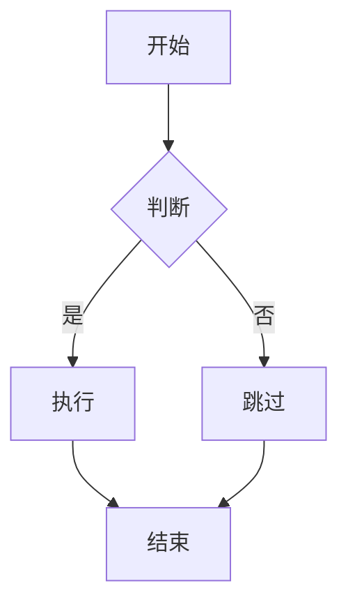

# Markdown to Word Converter

将 Markdown 文件转换为 Word 文档，自动将 Mermaid 图表转换为高清图片。

## 功能特性

- ✅ 自动识别并转换 Mermaid 代码块为高清图片
- ✅ 使用 Pandoc 进行高质量格式转换
- ✅ 保留 Markdown 格式（标题、列表、表格、代码块等）
- ✅ 支持本地图片（包括 GIF 动图）
- ✅ 自动检测并安装 Pandoc（macOS）
- ✅ 生成可直接导入飞书、腾讯文档、钉钉的 Word 文档

## 使用方法

### 基本用法

```bash
node index.js <markdown文件> [输出文件]
```

### 示例

```bash
# 转换为同名 Word 文件
node index.js 产品需求文档.md

# 指定输出文件名
node index.js 产品需求文档.md 输出文档.docx
```

## 依赖要求

- Node.js 14+
- npm
- Pandoc（脚本会自动检测并安装）
  - macOS: 通过 Homebrew 自动安装
  - Windows/Linux: 需手动安装，访问 https://pandoc.org/installing.html

## 安装依赖

```bash
npm install
```

## 转换流程

本工具采用 Pandoc + Mermaid CLI 的组合方案：

1. **检查 Pandoc**: 自动检测系统是否已安装 Pandoc
   - macOS: 未安装则自动通过 Homebrew 安装
   - Windows/Linux: 提示手动安装

2. **Pandoc 转换**: 使用 Pandoc 将 Markdown 转换为 Word 文档

3. **提取 Mermaid**: 扫描 Markdown 文件中的 Mermaid 代码块

4. **生成图片**: 使用 Mermaid CLI 将代码块转换为高清 PNG 图片

5. **替换代码块**: 将 Word 文档中的 Mermaid 代码块替换为生成的图片

## 配置

可以在 `index.js` 中修改 `CONFIG` 对象来调整参数：

```javascript
const CONFIG = {
  mermaidWidth: 3000,   // Mermaid 图片宽度（像素）
  mermaidScale: 3,      // Mermaid 图片缩放倍数
  tempDir: `./temp_${randomUUID()}`,  // 临时目录（使用唯一ID避免并发冲突）
  maxWidth: 6.5,        // Word 中图片最大宽度（英寸）
  minImageHeight: 2,    // 最小图片高度（英寸）
};
```

## 支持的 Markdown 语法

- 标题（# - ######）
- 段落和文本格式（**粗体**、*斜体*、`代码`）
- 列表（有序和无序，支持嵌套）
- 表格
- 代码块
- 引用
- 图片（本地路径）
- Mermaid 图表（支持所有类型）

## 支持的 Mermaid 图表类型

- 流程图（flowchart）
- 时序图（sequenceDiagram）
- 类图（classDiagram）
- 状态图（stateDiagram）
- 实体关系图（erDiagram）
- 甘特图（gantt）
- 饼图（pie）
- 旅程图（journey）
- 思维导图（mindmap）
- 时间线（timeline）
- Git 图（gitGraph）
- C4 架构图（C4Context）
- 等等...

## 注意事项

1. **Pandoc 依赖**:
   - macOS: 脚本会自动检测并安装（需要 Homebrew）
   - Windows/Linux: 需自行安装 Pandoc，可访问 https://pandoc.org/installing.html 下载安装

2. **Mermaid CLI**: 首次运行会自动下载 `@mermaid-js/mermaid-cli`

3. **图片路径**: 支持相对路径和绝对路径

4. **输出格式**: 生成的 Word 文档可直接导入飞书、腾讯文档、钉钉等在线文档系统

5. **临时文件**: 转换过程中会创建临时目录，转换完成后自动清理

## 示例

### 输入 Markdown

```markdown
# 产品需求文档

## 功能概述

这是一个示例文档。

## 流程图



## 功能列表

- 功能 1
- 功能 2
  - 子功能 2.1
  - 子功能 2.2
```

### 输出 Word 文档

- 标题正确转换为 Word 标题样式
- Mermaid 流程图自动转换为高清图片并居中显示
- 列表保持原有格式，支持嵌套